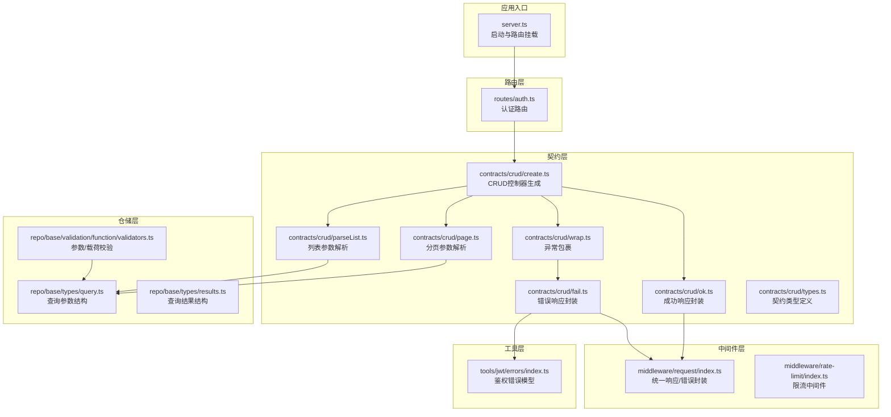
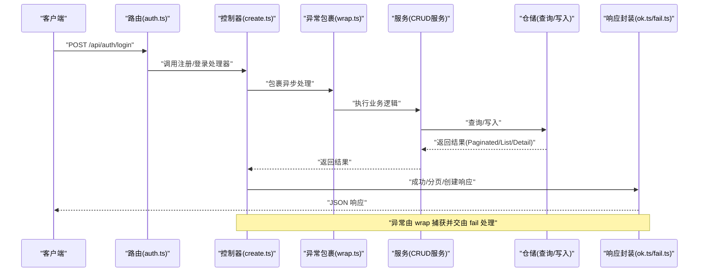
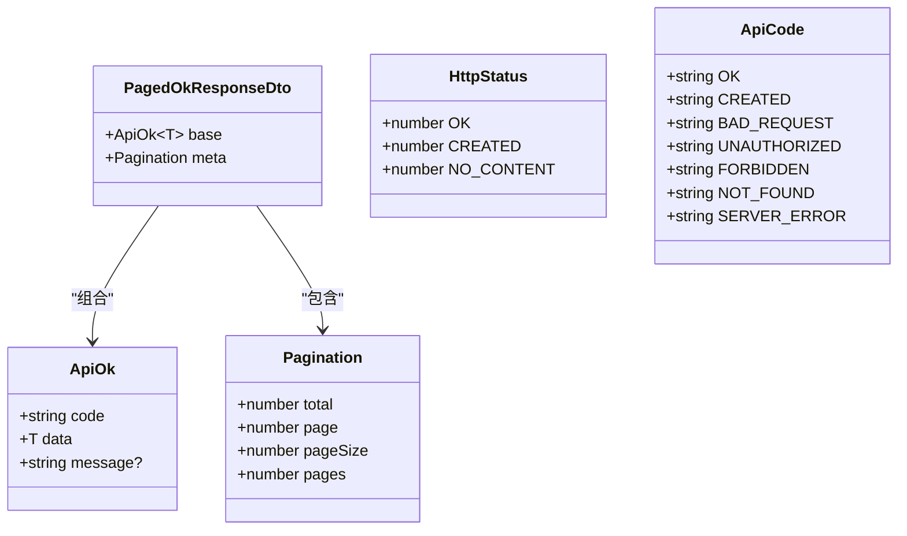
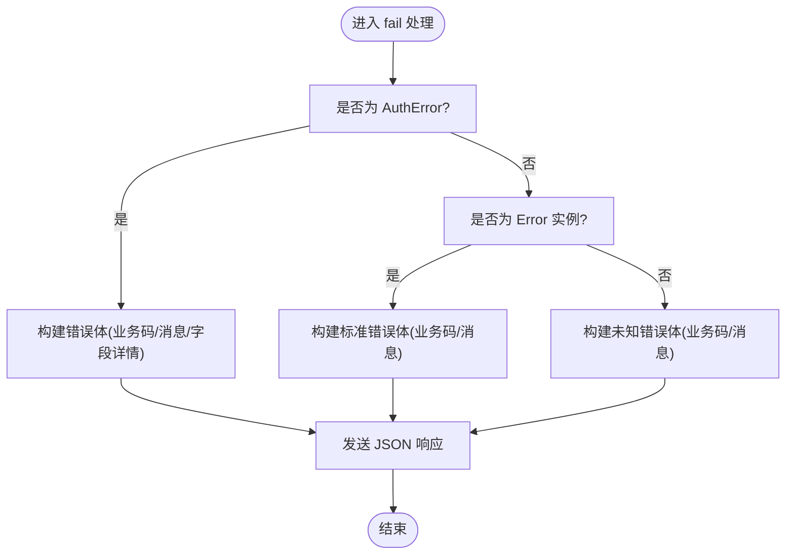
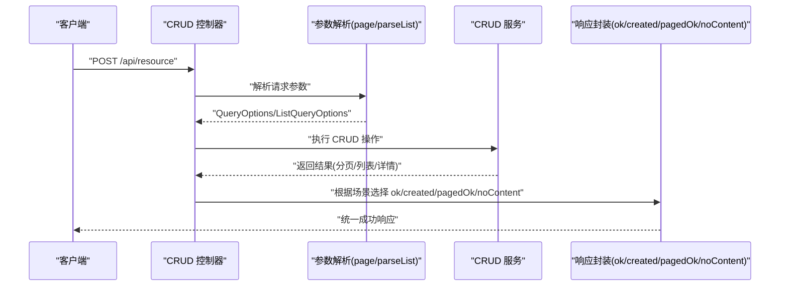
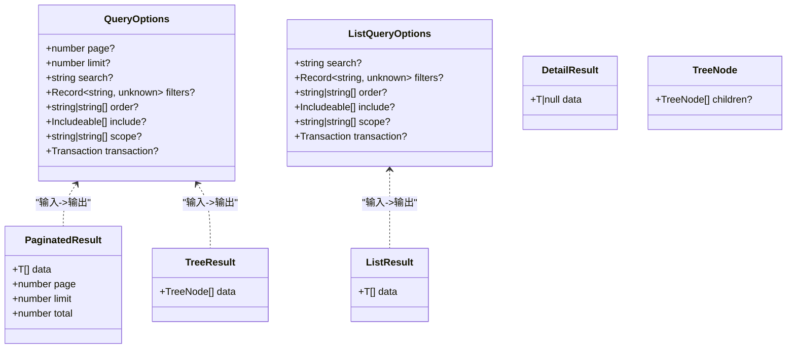
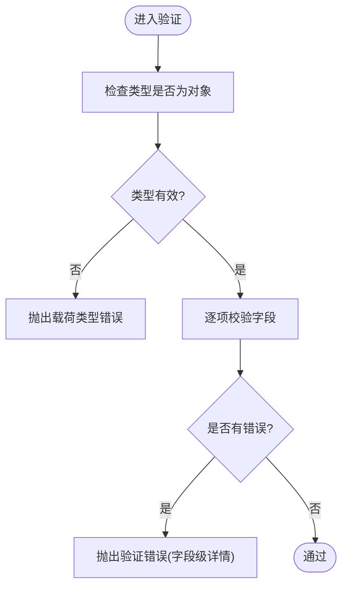
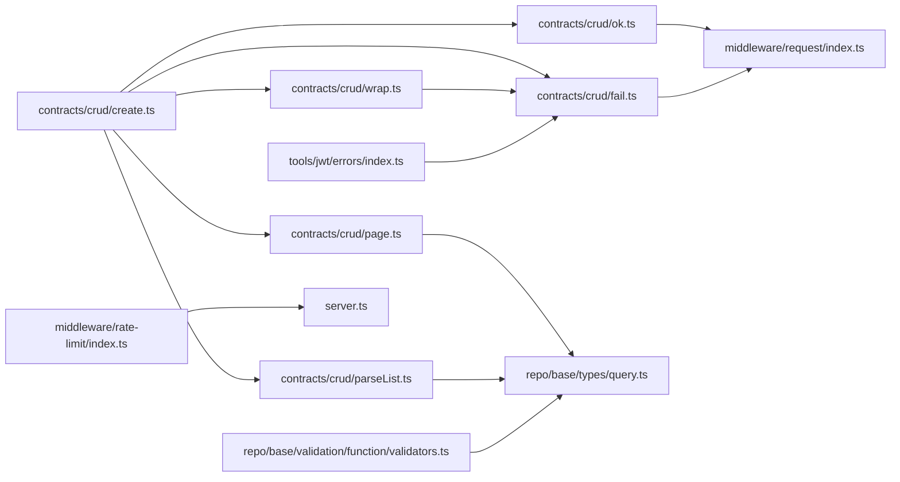

# API契约规范

<cite>
**本文引用的文件**
- [src/contracts/crud/create.ts](file://src/contracts/crud/create.ts)
- [src/contracts/crud/ok.ts](file://src/contracts/crud/ok.ts)
- [src/contracts/crud/fail.ts](file://src/contracts/crud/fail.ts)
- [src/contracts/crud/page.ts](file://src/contracts/crud/page.ts)
- [src/contracts/crud/parseList.ts](file://src/contracts/crud/parseList.ts)
- [src/contracts/crud/wrap.ts](file://src/contracts/crud/wrap.ts)
- [src/contracts/crud/types.ts](file://src/contracts/crud/types.ts)
- [src/middleware/request/index.ts](file://src/middleware/request/index.ts)
- [src/repo/base/types/query.ts](file://src/repo/base/types/query.ts)
- [src/repo/base/types/results.ts](file://src/repo/base/types/results.ts)
- [src/repo/base/validation/function/validators.ts](file://src/repo/base/validation/function/validators.ts)
- [src/tools/jwt/errors/index.ts](file://src/tools/jwt/errors/index.ts)
- [src/middleware/rate-limit/index.ts](file://src/middleware/rate-limit/index.ts)
- [src/routes/auth.ts](file://src/routes/auth.ts)
- [src/server.ts](file://src/server.ts)
- [package.json](file://package.json)
</cite>

## 目录
1. [引言](#引言)
2. [项目结构](#项目结构)
3. [核心组件](#核心组件)
4. [架构总览](#架构总览)
5. [详细组件分析](#详细组件分析)
6. [依赖关系分析](#依赖关系分析)
7. [性能考量](#性能考量)
8. [故障排查指南](#故障排查指南)
9. [结论](#结论)
10. [附录](#附录)

## 引言
本文件为 IM-API 的统一 API 契约规范，旨在：
- 明确所有 API 响应的标准格式（成功、错误、分页）；
- 规范 CRUD 操作的通用契约模式（create、ok、fail 等）；
- 提供 API 版本管理策略与向后兼容性保障建议；
- 定义数据验证规则、错误码体系与国际化支持路径；
- 说明 API 文档更新流程与变更通知机制。

## 项目结构
IM-API 基于 Express 服务，采用“契约层 + 中间件 + 仓储层 + 工具层”的分层设计。契约层通过统一的 CRUD 控制器模板生成 REST 风格接口，中间件负责请求解析、响应封装、限流与日志等横切关注点，仓储层提供查询与写入能力，并内置查询参数与结果结构的标准化。

图表来源
- [src/server.ts](file://src/server.ts#L27-L48)
- [src/routes/auth.ts](file://src/routes/auth.ts#L12-L47)
- [src/contracts/crud/create.ts](file://src/contracts/crud/create.ts#L28-L171)
- [src/contracts/crud/wrap.ts](file://src/contracts/crud/wrap.ts#L10-L19)
- [src/contracts/crud/page.ts](file://src/contracts/crud/page.ts#L10-L52)
- [src/contracts/crud/parseList.ts](file://src/contracts/crud/parseList.ts#L10-L39)
- [src/contracts/crud/ok.ts](file://src/contracts/crud/ok.ts#L29-L82)
- [src/contracts/crud/fail.ts](file://src/contracts/crud/fail.ts#L35-L177)
- [src/middleware/request/index.ts](file://src/middleware/request/index.ts#L197-L331)
- [src/repo/base/types/query.ts](file://src/repo/base/types/query.ts#L26-L35)
- [src/repo/base/types/results.ts](file://src/repo/base/types/results.ts#L18-L44)
- [src/repo/base/validation/function/validators.ts](file://src/repo/base/validation/function/validators.ts#L11-L76)
- [src/tools/jwt/errors/index.ts](file://src/tools/jwt/errors/index.ts#L75-L141)
- [src/middleware/rate-limit/index.ts](file://src/middleware/rate-limit/index.ts#L43-L70)

章节来源
- [src/server.ts](file://src/server.ts#L1-L74)
- [src/routes/auth.ts](file://src/routes/auth.ts#L1-L47)

## 核心组件
- 统一响应封装：提供成功、创建、分页、无内容等响应封装，确保业务码与 HTTP 状态码分离。
- 统一错误封装：将各类错误（含鉴权错误）转换为统一错误响应体，支持字段级错误详情。
- CRUD 控制器模板：自动生成 list/all/getById/getBySlug/create/update/remove/search/tree/listAllFields 等 REST 接口，并内置异常捕获。
- 查询参数解析：从 HTTP 查询参数解析分页、搜索、过滤、排序等选项，内置安全防护（如原型链污染防御）。
- 参数与结果结构：定义 QueryOptions/ListQueryOptions/PaginatedResult/ListResult/DetailResult 等标准化结构。
- 鉴权错误模型：提供 AuthError 类型与工厂方法，支持字段级验证错误映射。
- 限流中间件：基于内存的固定窗口计数限流，按 IP 限速。

章节来源
- [src/middleware/request/index.ts](file://src/middleware/request/index.ts#L15-L331)
- [src/contracts/crud/ok.ts](file://src/contracts/crud/ok.ts#L29-L82)
- [src/contracts/crud/fail.ts](file://src/contracts/crud/fail.ts#L35-L177)
- [src/contracts/crud/create.ts](file://src/contracts/crud/create.ts#L28-L171)
- [src/contracts/crud/page.ts](file://src/contracts/crud/page.ts#L10-L52)
- [src/contracts/crud/parseList.ts](file://src/contracts/crud/parseList.ts#L10-L39)
- [src/repo/base/types/query.ts](file://src/repo/base/types/query.ts#L26-L35)
- [src/repo/base/types/results.ts](file://src/repo/base/types/results.ts#L18-L44)
- [src/tools/jwt/errors/index.ts](file://src/tools/jwt/errors/index.ts#L75-L141)
- [src/middleware/rate-limit/index.ts](file://src/middleware/rate-limit/index.ts#L43-L70)

## 架构总览
下图展示一次典型 CRUD 请求的端到端流程：路由 -> 控制器 -> 服务 -> 仓储 -> 响应封装。

图表来源
- [src/routes/auth.ts](file://src/routes/auth.ts#L12-L47)
- [src/contracts/crud/create.ts](file://src/contracts/crud/create.ts#L28-L171)
- [src/contracts/crud/wrap.ts](file://src/contracts/crud/wrap.ts#L10-L19)
- [src/contracts/crud/ok.ts](file://src/contracts/crud/ok.ts#L29-L82)
- [src/contracts/crud/fail.ts](file://src/contracts/crud/fail.ts#L35-L177)

## 详细组件分析

### 统一响应契约（成功/分页/创建/无内容）
- 成功响应（200）：包含业务码、数据与可选提示信息。
- 创建响应（201）：与成功响应结构一致，业务码区分“创建”场景。
- 分页响应（200 + meta）：在成功响应基础上附加分页元信息（总数、页码、页大小、总页数）。
- 无内容响应（204）：仅返回空数据体，用于删除等无返回数据的场景。

图表来源
- [src/middleware/request/index.ts](file://src/middleware/request/index.ts#L66-L147)
- [src/middleware/request/index.ts](file://src/middleware/request/index.ts#L197-L250)
- [src/middleware/request/index.ts](file://src/middleware/request/index.ts#L226-L240)

章节来源
- [src/middleware/request/index.ts](file://src/middleware/request/index.ts#L197-L331)
- [src/contracts/crud/ok.ts](file://src/contracts/crud/ok.ts#L29-L82)

### 统一错误契约（字段级错误/鉴权错误/通用错误）
- 错误响应包含业务错误码、错误信息与可选错误详情。
- 支持字段级错误详情（字段名、错误描述、触发值）。
- 鉴权错误通过 AuthError 类型识别，自动映射 HTTP 状态码与业务码，并可携带字段级验证错误。
- 提供 400/401/403/404/409/500 等常见错误响应便捷函数。

图表来源
- [src/contracts/crud/fail.ts](file://src/contracts/crud/fail.ts#L35-L68)
- [src/contracts/crud/fail.ts](file://src/contracts/crud/fail.ts#L76-L89)
- [src/tools/jwt/errors/index.ts](file://src/tools/jwt/errors/index.ts#L75-L141)
- [src/middleware/request/index.ts](file://src/middleware/request/index.ts#L169-L175)
- [src/middleware/request/index.ts](file://src/middleware/request/index.ts#L260-L331)

章节来源
- [src/contracts/crud/fail.ts](file://src/contracts/crud/fail.ts#L35-L177)
- [src/tools/jwt/errors/index.ts](file://src/tools/jwt/errors/index.ts#L75-L141)
- [src/middleware/request/index.ts](file://src/middleware/request/index.ts#L169-L331)

### CRUD 控制器模板与通用契约模式
- 控制器方法：list、all、getById、getBySlug、create、update、remove、search、tree、listAllFields。
- 兼容别名：getList、getDetail、delete、getDetailBySlug。
- 统一异常处理：通过 wrap 包裹异步处理，捕获异常并交由 fail 输出。
- 成功响应：ok、created、okPaginated、noContent。
- 查询参数：parseQueryOptions 与 parseListQueryOptions 解析分页/搜索/过滤/排序。

图表来源
- [src/contracts/crud/create.ts](file://src/contracts/crud/create.ts#L28-L171)
- [src/contracts/crud/page.ts](file://src/contracts/crud/page.ts#L10-L52)
- [src/contracts/crud/parseList.ts](file://src/contracts/crud/parseList.ts#L10-L39)
- [src/contracts/crud/ok.ts](file://src/contracts/crud/ok.ts#L29-L82)
- [src/contracts/crud/wrap.ts](file://src/contracts/crud/wrap.ts#L10-L19)

章节来源
- [src/contracts/crud/create.ts](file://src/contracts/crud/create.ts#L28-L171)
- [src/contracts/crud/types.ts](file://src/contracts/crud/types.ts#L57-L196)
- [src/contracts/crud/wrap.ts](file://src/contracts/crud/wrap.ts#L10-L19)

### 查询参数与结果结构
- QueryOptions：分页（page/limit）、搜索（search）、过滤（filters）、排序（order）、关联（include）、Scope（scope）、事务（transaction）。
- ListQueryOptions：非分页场景下的搜索/过滤/排序/关联/Scope/事务。
- 结果结构：PaginatedResult、ListResult、DetailResult、TreeResult，统一数据载体。

图表来源
- [src/repo/base/types/query.ts](file://src/repo/base/types/query.ts#L26-L54)
- [src/repo/base/types/results.ts](file://src/repo/base/types/results.ts#L18-L64)

章节来源
- [src/repo/base/types/query.ts](file://src/repo/base/types/query.ts#L14-L64)
- [src/repo/base/types/results.ts](file://src/repo/base/types/results.ts#L9-L65)

### 数据验证规则
- 查询参数验证：校验 page/limit/search/filters/order 合法性，非法时抛出 CRUD 验证错误。
- 载荷验证：校验必填字段是否存在，缺失则抛出 CRUD 验证错误。
- 验证错误统一映射至错误响应的字段级详情。

图表来源
- [src/repo/base/validation/function/validators.ts](file://src/repo/base/validation/function/validators.ts#L11-L76)

章节来源
- [src/repo/base/validation/function/validators.ts](file://src/repo/base/validation/function/validators.ts#L11-L76)

### 错误码定义与国际化支持
- 业务码（ApiCode）：OK、CREATED、BAD_REQUEST、UNAUTHORIZED、FORBIDDEN、NOT_FOUND、SERVER_ERROR。
- HTTP 状态码（HttpStatus）：200、201、204、400、401、403、404、500。
- 鉴权错误码（AuthErrorCode）：覆盖令牌缺失、格式错误、无效、过期、设备不匹配、撤销、算法不支持、业务错误、验证错误、邮箱已存在等。
- 国际化建议：业务码与消息分离，消息字段支持多语言配置；错误详情中的字段名与描述可本地化。

章节来源
- [src/middleware/request/index.ts](file://src/middleware/request/index.ts#L49-L57)
- [src/middleware/request/index.ts](file://src/middleware/request/index.ts#L27-L36)
- [src/tools/jwt/errors/index.ts](file://src/tools/jwt/errors/index.ts#L46-L63)

### API 版本管理策略与向后兼容性
- 版本策略：建议以路径前缀进行版本控制（如 /api/v1），新功能在新版本暴露，旧版本保持稳定。
- 向后兼容：变更遵循“新增不破坏、默认兼容”，旧字段保留，新增字段可选；弃用旧接口时提供迁移指引与过渡期。
- 本仓库当前版本号为 0.0.0，建议在后续迭代中启用语义化版本管理（SemVer）。

章节来源
- [package.json](file://package.json#L3-L3)

### API 文档更新流程与变更通知机制
- 文档更新流程：契约变更（类型、响应、错误）需同步更新契约层与中间件层注释与类型定义；路由层与控制器层随之调整。
- 变更通知：通过 Git 提交记录与变更日志追踪；对外发布前在预发布环境验证；必要时通过邮件/站内信通知集成方。
- 本仓库未内置自动化文档生成脚本，建议引入 OpenAPI/Swagger 或自动生成契约文档的工具链。

## 依赖关系分析
- 控制器依赖中间件的响应封装与异常处理；
- 查询解析依赖仓储层的查询参数结构；
- 验证器依赖查询参数结构与错误模型；
- 限流中间件独立于业务逻辑，按 IP 限速。

图表来源
- [src/contracts/crud/create.ts](file://src/contracts/crud/create.ts#L28-L171)
- [src/contracts/crud/wrap.ts](file://src/contracts/crud/wrap.ts#L10-L19)
- [src/contracts/crud/page.ts](file://src/contracts/crud/page.ts#L10-L52)
- [src/contracts/crud/parseList.ts](file://src/contracts/crud/parseList.ts#L10-L39)
- [src/contracts/crud/ok.ts](file://src/contracts/crud/ok.ts#L29-L82)
- [src/contracts/crud/fail.ts](file://src/contracts/crud/fail.ts#L35-L177)
- [src/middleware/request/index.ts](file://src/middleware/request/index.ts#L197-L331)
- [src/repo/base/types/query.ts](file://src/repo/base/types/query.ts#L26-L54)
- [src/repo/base/validation/function/validators.ts](file://src/repo/base/validation/function/validators.ts#L11-L76)
- [src/tools/jwt/errors/index.ts](file://src/tools/jwt/errors/index.ts#L75-L141)
- [src/middleware/rate-limit/index.ts](file://src/middleware/rate-limit/index.ts#L43-L70)
- [src/server.ts](file://src/server.ts#L27-L48)

章节来源
- [src/contracts/crud/create.ts](file://src/contracts/crud/create.ts#L28-L171)
- [src/middleware/request/index.ts](file://src/middleware/request/index.ts#L197-L331)
- [src/repo/base/types/query.ts](file://src/repo/base/types/query.ts#L26-L54)

## 性能考量
- 分页限制：建议限制单页最大条数，避免一次性返回大量数据。
- 查询过滤：对 filters 进行白名单校验，避免复杂或高成本查询。
- 无内容响应：删除等操作使用 204，减少响应体大小。
- 限流策略：结合业务场景设置合理的窗口与阈值，防止滥用。

## 故障排查指南
- 400 请求错误：检查查询参数与载荷是否满足验证规则；查看错误响应中的字段级详情定位问题。
- 401 未认证：确认鉴权令牌有效性与过期时间；若为 AuthError，查看具体错误码与字段详情。
- 403 权限不足：确认用户角色与权限范围；查看错误详情中的权限信息。
- 404 资源不存在：确认资源 ID/slug 是否正确；检查软删除或可见性逻辑。
- 500 服务器内部错误：查看服务端日志与错误堆栈；确认 wrap 是否正确捕获异常。

章节来源
- [src/contracts/crud/fail.ts](file://src/contracts/crud/fail.ts#L35-L177)
- [src/tools/jwt/errors/index.ts](file://src/tools/jwt/errors/index.ts#L75-L141)
- [src/middleware/request/index.ts](file://src/middleware/request/index.ts#L260-L331)

## 结论
本规范将 IM-API 的响应、错误、CRUD 契约、查询参数与结果结构进行了统一化设计，配合鉴权错误模型与限流中间件，形成了一套可扩展、可维护、可演进的 API 契约体系。建议在后续版本中完善版本管理与文档自动化流程，持续提升 API 的一致性与可集成性。

## 附录
- 示例路由挂载与健康检查：见 server.ts。
- 认证路由示例：见 routes/auth.ts。

章节来源
- [src/server.ts](file://src/server.ts#L43-L45)
- [src/routes/auth.ts](file://src/routes/auth.ts#L18-L44)