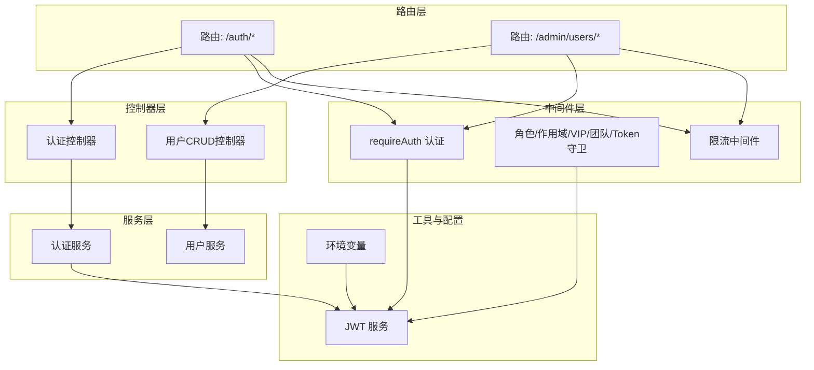
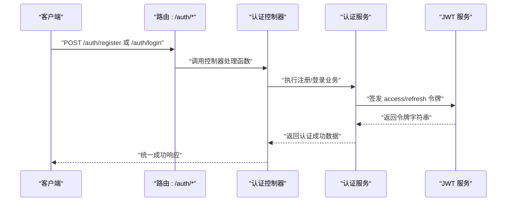
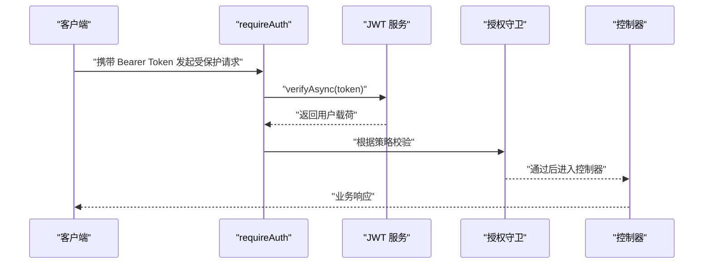
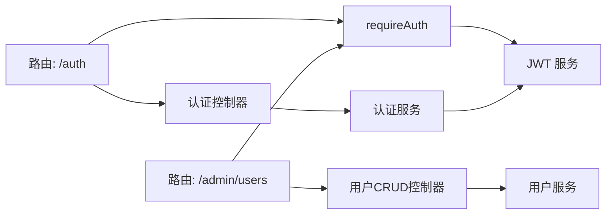

# API接口文档

<cite>
**本文档引用的文件**
- [src/routes/auth.ts](file://src/routes/auth.ts)
- [src/routes/admin/user.ts](file://src/routes/admin/user.ts)
- [src/contracts/auth.controller.ts](file://src/contracts/auth.controller.ts)
- [src/services/auth.ts](file://src/services/auth.ts)
- [src/middleware/auth/require.ts](file://src/middleware/auth/require.ts)
- [src/middleware/auth/guards.ts](file://src/middleware/auth/guards.ts)
- [src/middleware/auth/types.ts](file://src/middleware/auth/types.ts)
- [src/middleware/rate-limit/index.ts](file://src/middleware/rate-limit/index.ts)
- [src/config/env/index.ts](file://src/config/env/index.ts)
- [src/tools/jwt/service.ts](file://src/tools/jwt/service.ts)
- [src/tools/jwt/guards/index.ts](file://src/tools/jwt/guards/index.ts)
- [src/models/auth/anth.ts](file://src/models/auth/anth.ts)
- [src/models/user/types/user.ts](file://src/models/user/types/user.ts)
- [src/contracts/crud/types.ts](file://src/contracts/crud/types.ts)
</cite>

## 目录
1. [简介](#简介)
2. [项目结构](#项目结构)
3. [核心组件](#核心组件)
4. [架构总览](#架构总览)
5. [详细组件分析](#详细组件分析)
6. [依赖关系分析](#依赖关系分析)
7. [性能考量](#性能考量)
8. [故障排查指南](#故障排查指南)
9. [结论](#结论)
10. [附录](#附录)

## 简介
本文件为 IM-API 的完整 RESTful API 接口文档，覆盖认证接口（注册、登录、退出、获取当前用户）、管理接口（用户 CRUD 与心跳）、认证与授权机制、错误处理策略、速率限制、安全建议、性能优化与调试监控方法。文档中的所有技术细节均来自仓库源码与类型定义。

## 项目结构
- 路由层：定义 HTTP 端点与访问控制（公开/受保护）
- 控制器层：封装请求处理、参数校验与统一响应包装
- 服务层：实现业务逻辑（认证、用户管理等）
- 中间件层：认证、授权守卫、限流、日志等横切关注点
- 工具与配置：JWT 服务、环境变量、类型契约

图表来源
- [src/routes/auth.ts](file://src/routes/auth.ts#L1-L47)
- [src/routes/admin/user.ts](file://src/routes/admin/user.ts#L1-L40)
- [src/contracts/auth.controller.ts](file://src/contracts/auth.controller.ts#L1-L111)
- [src/services/auth.ts](file://src/services/auth.ts#L1-L170)
- [src/middleware/auth/require.ts](file://src/middleware/auth/require.ts#L1-L98)
- [src/middleware/auth/guards.ts](file://src/middleware/auth/guards.ts#L1-L195)
- [src/middleware/rate-limit/index.ts](file://src/middleware/rate-limit/index.ts#L1-L70)
- [src/tools/jwt/service.ts](file://src/tools/jwt/service.ts#L1-L98)
- [src/config/env/index.ts](file://src/config/env/index.ts#L1-L223)

章节来源
- [src/routes/auth.ts](file://src/routes/auth.ts#L1-L47)
- [src/routes/admin/user.ts](file://src/routes/admin/user.ts#L1-L40)
- [src/contracts/auth.controller.ts](file://src/contracts/auth.controller.ts#L1-L111)
- [src/services/auth.ts](file://src/services/auth.ts#L1-L170)
- [src/middleware/auth/require.ts](file://src/middleware/auth/require.ts#L1-L98)
- [src/middleware/auth/guards.ts](file://src/middleware/auth/guards.ts#L1-L195)
- [src/middleware/rate-limit/index.ts](file://src/middleware/rate-limit/index.ts#L1-L70)
- [src/config/env/index.ts](file://src/config/env/index.ts#L1-L223)
- [src/tools/jwt/service.ts](file://src/tools/jwt/service.ts#L1-L98)

## 核心组件
- 认证路由与控制器：提供注册、登录、退出、获取当前用户信息的端点，受保护端点使用 requireAuth 中间件
- 认证服务：实现注册、登录、获取当前用户、退出逻辑，签发访问与刷新令牌
- JWT 服务：签发、验证、刷新令牌，支持 HS256/RS256 算法
- 授权守卫：基于 JWT 载荷的角色、作用域、VIP、团队、Token 类型校验
- 限流中间件：按 IP 的固定窗口限流
- 环境配置：统一读取与类型安全的环境变量（含速率限制、数据库、Redis、WebSocket 等）

章节来源
- [src/contracts/auth.controller.ts](file://src/contracts/auth.controller.ts#L1-L111)
- [src/services/auth.ts](file://src/services/auth.ts#L1-L170)
- [src/middleware/auth/require.ts](file://src/middleware/auth/require.ts#L1-L98)
- [src/middleware/auth/guards.ts](file://src/middleware/auth/guards.ts#L1-L195)
- [src/middleware/rate-limit/index.ts](file://src/middleware/rate-limit/index.ts#L1-L70)
- [src/config/env/index.ts](file://src/config/env/index.ts#L1-L223)
- [src/tools/jwt/service.ts](file://src/tools/jwt/service.ts#L1-L98)

## 架构总览
下图展示认证流程的关键调用序列：客户端发起注册/登录请求 → 控制器校验参数 → 服务层执行业务 → JWT 服务签发令牌 → 控制器返回统一响应。

图表来源
- [src/routes/auth.ts](file://src/routes/auth.ts#L18-L44)
- [src/contracts/auth.controller.ts](file://src/contracts/auth.controller.ts#L25-L74)
- [src/services/auth.ts](file://src/services/auth.ts#L94-L134)
- [src/tools/jwt/service.ts](file://src/tools/jwt/service.ts#L41-L56)

## 详细组件分析

### 认证接口规范
- 基础路径：/auth
- 认证方式：Bearer Token（JWT）
- 通用响应结构：见“统一响应契约”章节

1) 注册
- 方法与路径：POST /auth/register
- 访问级别：Public
- 请求体字段
  - phone: string（必填，纯数字）
  - password: string（必填）
  - pin: string（必填，6位纯数字）
- 成功响应：返回用户安全信息、access、refresh 令牌及 payload
- 常见错误
  - 参数缺失或格式不正确：400
  - 手机号已存在：409

2) 登录
- 方法与路径：POST /auth/login
- 访问级别：Public
- 请求体字段
  - phone: string（必填）
  - password: string（必填）
  - deviceId: string（可选）
- 成功响应：返回用户安全信息、access、refresh 令牌及 payload
- 常见错误：400/401（用户名或密码错误）

3) 退出
- 方法与路径：POST /auth/logout
- 访问级别：Protected
- 说明：当前为无状态实现，服务端不维护会话；客户端删除本地令牌即可
- 成功响应：返回操作成功提示

4) 获取当前用户信息
- 方法与路径：GET /auth/me
- 访问级别：Protected
- 说明：依赖 requireAuth 中间件，从 JWT 载荷中解析用户 ID
- 成功响应：返回安全用户信息
- 常见错误：401（未认证）

统一响应契约
- 成功响应：{ code: 0, message: string, data: T }
- 错误响应：{ code: number, message: string, errors?: [{ field?: string, message: string, value?: unknown }] }
- 参考类型定义：ApiSuccessResponse 与 ApiErrorResponse

章节来源
- [src/routes/auth.ts](file://src/routes/auth.ts#L18-L44)
- [src/contracts/auth.controller.ts](file://src/contracts/auth.controller.ts#L25-L110)
- [src/services/auth.ts](file://src/services/auth.ts#L94-L166)
- [src/contracts/crud/types.ts](file://src/contracts/crud/types.ts#L10-L40)
- [src/models/auth/anth.ts](file://src/models/auth/anth.ts#L18-L107)

### 管理接口规范
- 基础路径：/admin/users
- 访问级别：受 requireAuth 保护（具体角色/权限由守卫中间件决定）
- 心跳接口
  - POST /admin/users/heartbeat：用于客户端检测连接，返回 { code: 0, message: "ok", data: { timestamp: number } }

- 用户资源接口
  - GET /admin/users：分页列表
  - POST /admin/users：创建用户
  - GET /admin/users/:id：详情
  - PUT /admin/users/:id：更新用户
  - DELETE /admin/users/:id：删除用户

用户模型字段与可操作范围
- 列表字段：id, phone, account, name, avatar, state, vip, roleId, createdAt
- 详情字段：id, code, phone, account, name, avatar, state, vip, roleId, telegramId, teamId, gender, location, longSession, lastOnlineAt, createdAt, updatedAt
- 可创建字段：phone, password, pin, name, avatar, roleId
- 可更新字段：name, avatar, state, vip, roleId, gender, location, longSession
- 可筛选字段：state, vip, roleId, gender
- 可排序字段：createdAt, lastOnlineAt, name

章节来源
- [src/routes/admin/user.ts](file://src/routes/admin/user.ts#L24-L38)
- [src/models/user/types/user.ts](file://src/models/user/types/user.ts#L93-L177)

### 认证与授权机制
- 认证中间件 requireAuth
  - 从 Authorization 头提取 Bearer Token
  - 使用 JWT 服务验证令牌有效性
  - 将解码后的用户载荷注入 req.user，供后续守卫与控制器使用
- 授权守卫（中间件工厂）
  - requireRole(roles[])：校验用户角色是否在允许列表中
  - requireScopes(scopes[])：校验用户是否拥有至少一个所需作用域
  - requireVip()：校验用户是否为 VIP
  - requireTeam(teams[])：校验用户所属团队
  - requireTokenKind(kind)：校验令牌类型（access/refresh）
- JWT 服务
  - 支持 HS256/RS256 算法
  - 签发时不设置过期时间（长期有效），通过客户端轮换实现安全
  - 提供令牌验证与刷新轮转能力

图表来源
- [src/middleware/auth/require.ts](file://src/middleware/auth/require.ts#L68-L97)
- [src/middleware/auth/guards.ts](file://src/middleware/auth/guards.ts#L25-L194)
- [src/tools/jwt/service.ts](file://src/tools/jwt/service.ts#L66-L75)

章节来源
- [src/middleware/auth/require.ts](file://src/middleware/auth/require.ts#L1-L98)
- [src/middleware/auth/guards.ts](file://src/middleware/auth/guards.ts#L1-L195)
- [src/middleware/auth/types.ts](file://src/middleware/auth/types.ts#L1-L34)
- [src/tools/jwt/guards/index.ts](file://src/tools/jwt/guards/index.ts#L1-L19)
- [src/tools/jwt/service.ts](file://src/tools/jwt/service.ts#L1-L98)

### 错误处理策略
- 统一响应结构
  - 成功：code=0，message 描述，data 载荷
  - 错误：code 非 0，message 描述，errors（字段级错误明细可选）
- 常见 HTTP 状态码
  - 400：参数校验失败
  - 401：未认证/令牌无效
  - 403：权限不足/令牌类型不符
  - 404：资源不存在
  - 409：冲突（如手机号已存在）
  - 429：请求过于频繁（限流）
  - 500：内部错误
- 字段级错误
  - 通过 errors 数组返回，包含 field、message、value

章节来源
- [src/contracts/crud/types.ts](file://src/contracts/crud/types.ts#L10-L40)
- [src/contracts/auth.controller.ts](file://src/contracts/auth.controller.ts#L30-L45)
- [src/services/auth.ts](file://src/services/auth.ts#L102-L106)

### 速率限制
- 限流算法：内存级固定窗口计数
- 依据：X-Forwarded-For 第一个 IP，若不可用则使用 req.ip 或远端地址
- 配置项（来自环境变量）
  - RATE_LIMIT_WINDOW_MS：窗口时长（毫秒）
  - RATE_LIMIT_MAX_REQUESTS：窗口内最大请求数
- 触发 429 后的响应：{ code: "TooManyRequests", message: "Too many requests", status: 429 }

章节来源
- [src/middleware/rate-limit/index.ts](file://src/middleware/rate-limit/index.ts#L1-L70)
- [src/config/env/index.ts](file://src/config/env/index.ts#L208-L209)

### 安全考虑
- 传输安全：生产环境建议启用 HTTPS
- 令牌安全：JWT 为长期有效，客户端负责轮换；避免在前端存储明文密码/PIN
- 授权策略：结合 requireRole/requireScopes/requireVip/requireTeam/requireTokenKind 构建细粒度权限
- 输入校验：控制器对必填字段与格式进行严格校验
- 限流：默认开启按 IP 的固定窗口限流，防止暴力破解与滥用

章节来源
- [src/contracts/auth.controller.ts](file://src/contracts/auth.controller.ts#L30-L45)
- [src/middleware/auth/guards.ts](file://src/middleware/auth/guards.ts#L25-L194)
- [src/middleware/rate-limit/index.ts](file://src/middleware/rate-limit/index.ts#L43-L60)

### 协议特定示例
- 认证头部
  - Authorization: Bearer <access_token>
- 注册请求体
  - phone: "13800001111"
  - password: "your_password"
  - pin: "123456"
- 登录请求体
  - phone: "13800001111"
  - password: "your_password"
  - deviceId: "optional_device_id"
- 成功响应示例
  - { code: 0, message: "...", data: { user, access, refresh, payload } }
- 错误响应示例
  - { code: 400, message: "...", errors: [{ field: "phone", message: "...", value: "..." }] }

章节来源
- [src/contracts/auth.controller.ts](file://src/contracts/auth.controller.ts#L25-L110)
- [src/models/auth/anth.ts](file://src/models/auth/anth.ts#L18-L107)

### 常见用例
- 客户端实现步骤
  - 注册：POST /auth/register，保存返回的 access/refresh
  - 登录：POST /auth/login，保存返回的 access/refresh
  - 受保护请求：在 Authorization 头加入 Bearer Token
  - 退出：POST /auth/logout（无状态，客户端删除令牌）
  - 获取当前用户：GET /auth/me
  - 管理用户：使用 /admin/users 下的 CRUD 接口
- 客户端轮换令牌
  - 由于令牌长期有效，建议在每次启动应用时轮换 access/refresh，确保安全性

章节来源
- [src/routes/auth.ts](file://src/routes/auth.ts#L18-L44)
- [src/routes/admin/user.ts](file://src/routes/admin/user.ts#L33-L37)
- [src/services/auth.ts](file://src/services/auth.ts#L45-L80)

### 性能优化技巧
- 限流策略：根据业务峰值调整 RATE_LIMIT_WINDOW_MS 与 RATE_LIMIT_MAX_REQUESTS
- 缓存：对只读接口（如用户详情）可引入缓存层（Redis 可选）
- 数据库连接池：合理配置 DB_POOL_* 参数以提升并发
- 日志与采样：对高频接口进行采样日志，避免 I/O 抖动

章节来源
- [src/config/env/index.ts](file://src/config/env/index.ts#L178-L186)
- [src/middleware/rate-limit/index.ts](file://src/middleware/rate-limit/index.ts#L66-L69)

### 调试工具与监控方法
- 调试工具
  - curl/postman：直接调用 /auth/* 与 /admin/users/*
  - 浏览器开发者工具：查看请求头 Authorization 与响应体
- 监控指标
  - QPS/错误率：统计 4xx/5xx 比例
  - 限流命中：观察 429 次数
  - 认证成功率：对比注册/登录的成功与失败
  - JWT 验证耗时：埋点 requireAuth 与 verifyAsync 的耗时

章节来源
- [src/middleware/auth/require.ts](file://src/middleware/auth/require.ts#L72-L97)
- [src/middleware/rate-limit/index.ts](file://src/middleware/rate-limit/index.ts#L53-L55)

### 已弃用功能与兼容性
- 当前未发现明确的弃用接口
- 若未来启用 Redis 黑名单，可在服务层扩展注销逻辑（参考注释）

章节来源
- [src/services/auth.ts](file://src/services/auth.ts#L162-L166)

## 依赖关系分析
- 路由依赖控制器：路由文件导出的处理器函数来自控制器模块
- 控制器依赖服务：控制器调用认证服务与用户服务执行业务
- 中间件依赖 JWT 服务：认证中间件与授权守卫依赖 JWT 服务完成令牌校验与断言
- 服务依赖模型与工具：服务层依赖用户模型与 JWT 工具

图表来源
- [src/routes/auth.ts](file://src/routes/auth.ts#L12-L46)
- [src/routes/admin/user.ts](file://src/routes/admin/user.ts#L12-L39)
- [src/contracts/auth.controller.ts](file://src/contracts/auth.controller.ts#L13-L18)
- [src/services/auth.ts](file://src/services/auth.ts#L13-L22)
- [src/middleware/auth/require.ts](file://src/middleware/auth/require.ts#L12-L32)
- [src/tools/jwt/service.ts](file://src/tools/jwt/service.ts#L27-L30)

章节来源
- [src/routes/auth.ts](file://src/routes/auth.ts#L12-L46)
- [src/routes/admin/user.ts](file://src/routes/admin/user.ts#L12-L39)
- [src/contracts/auth.controller.ts](file://src/contracts/auth.controller.ts#L13-L18)
- [src/services/auth.ts](file://src/services/auth.ts#L13-L22)
- [src/middleware/auth/require.ts](file://src/middleware/auth/require.ts#L12-L32)
- [src/tools/jwt/service.ts](file://src/tools/jwt/service.ts#L27-L30)

## 性能考量
- 令牌长期有效：减少过期续签开销，但需客户端妥善轮换
- 限流默认开启：防止暴力破解与异常流量
- 数据库连接池：合理配置以提升并发吞吐
- 建议对高频接口进行缓存与异步处理

章节来源
- [src/tools/jwt/service.ts](file://src/tools/jwt/service.ts#L33-L56)
- [src/config/env/index.ts](file://src/config/env/index.ts#L178-L186)
- [src/middleware/rate-limit/index.ts](file://src/middleware/rate-limit/index.ts#L66-L69)

## 故障排查指南
- 400 参数错误
  - 检查请求体字段是否齐全且格式正确
- 401 未认证/令牌无效
  - 确认 Authorization 头是否为 Bearer Token
  - 检查 JWT 密钥与算法配置
- 403 权限不足
  - 检查角色/作用域/VIP/团队/令牌类型是否满足要求
- 404 资源不存在
  - 检查用户 ID 是否正确
- 409 冲突
  - 手机号已被注册
- 429 请求过于频繁
  - 调整限流参数或降低请求频率

章节来源
- [src/contracts/auth.controller.ts](file://src/contracts/auth.controller.ts#L30-L45)
- [src/services/auth.ts](file://src/services/auth.ts#L102-L106)
- [src/middleware/auth/require.ts](file://src/middleware/auth/require.ts#L75-L96)
- [src/middleware/auth/guards.ts](file://src/middleware/auth/guards.ts#L26-L50)
- [src/middleware/rate-limit/index.ts](file://src/middleware/rate-limit/index.ts#L53-L55)

## 结论
本 API 文档基于仓库源码梳理了认证与管理接口的端点、参数、响应、认证与授权机制、错误处理、限流与安全建议。通过 requireAuth 与多维授权守卫，系统实现了灵活而强健的访问控制；配合统一响应结构与环境配置，便于客户端集成与运维监控。

## 附录
- 环境变量关键项
  - RATE_LIMIT_WINDOW_MS、RATE_LIMIT_MAX_REQUESTS：限流配置
  - JWT_SECRET、PIN_SECRET、PASSWORD_PEPPER：安全密钥
  - DB_*：数据库连接与池配置
  - REDIS_*：Redis 可选配置
  - WS_*：WebSocket 可选配置

章节来源
- [src/config/env/index.ts](file://src/config/env/index.ts#L166-L220)