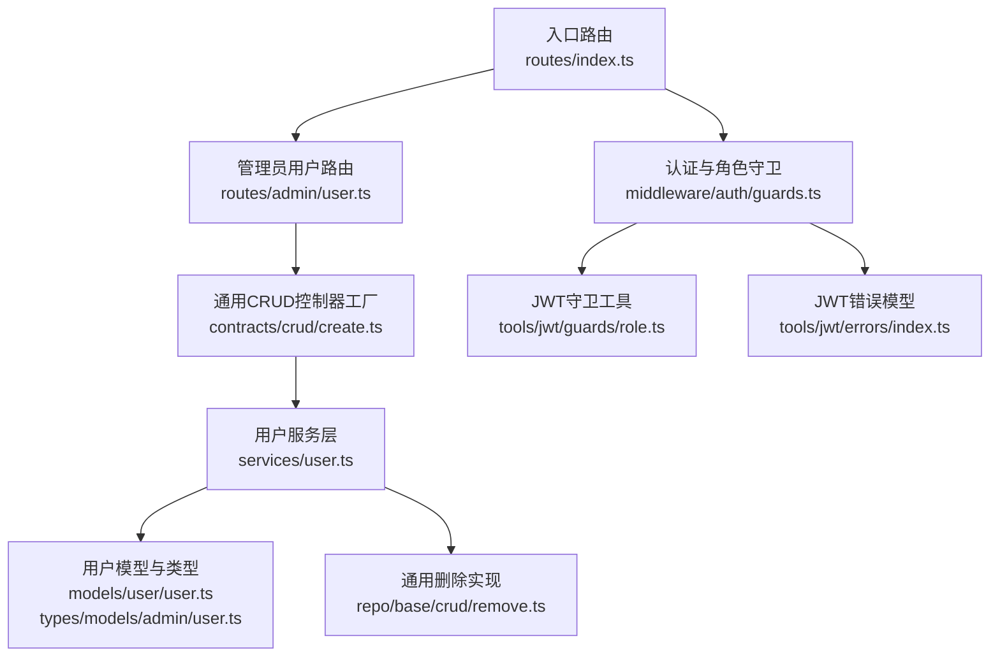
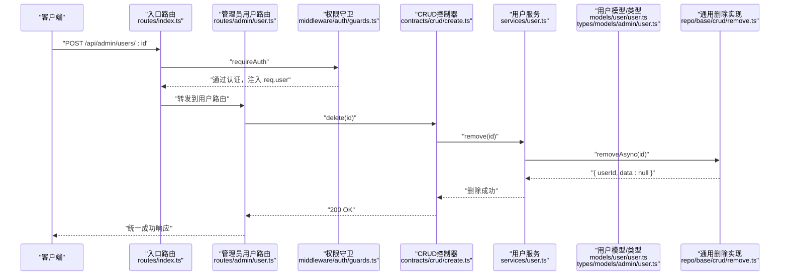
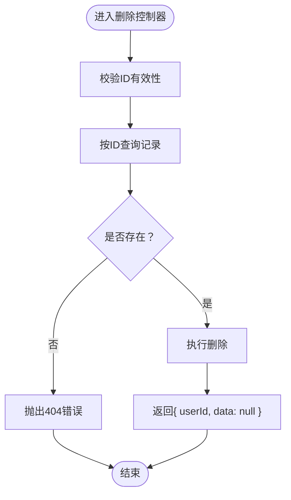
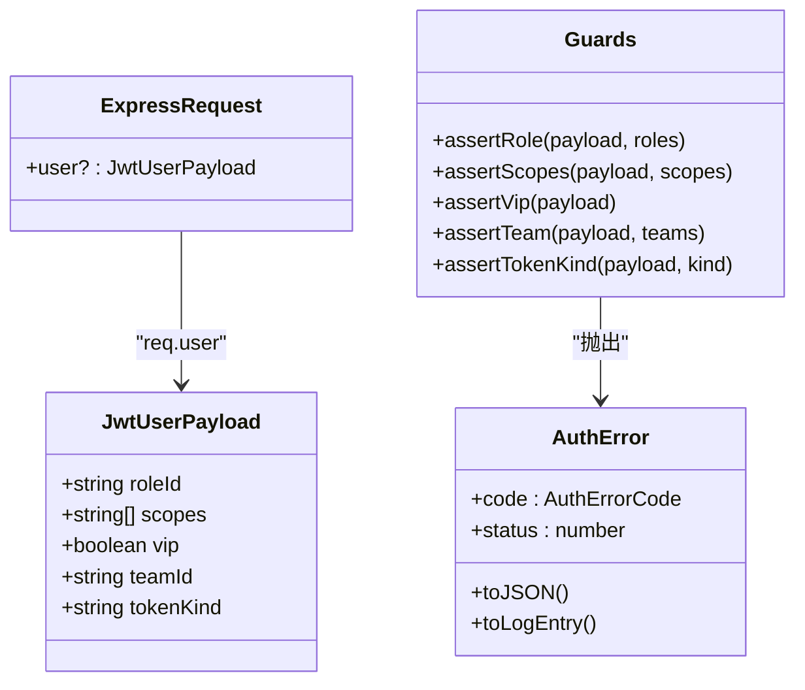
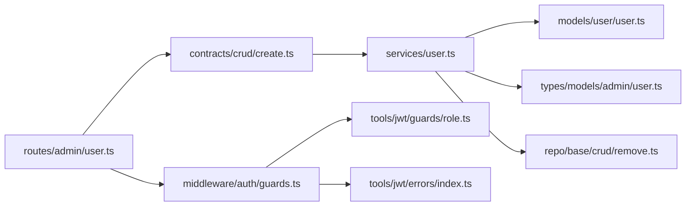

# 管理接口

<cite>
**本文引用的文件**
- [src/routes/admin/user.ts](file://src/routes/admin/user.ts)
- [src/routes/index.ts](file://src/routes/index.ts)
- [src/services/user.ts](file://src/services/user.ts)
- [src/models/user/user.ts](file://src/models/user/user.ts)
- [src/models/role/index.ts](file://src/models/role/index.ts)
- [src/tokens/models/admin/user.ts](file://src/types/models/admin/user.ts)
- [src/middleware/auth/guards.ts](file://src/middleware/auth/guards.ts)
- [src/middleware/auth/types.ts](file://src/middleware/auth/types.ts)
- [src/tools/jwt/guards/role.ts](file://src/tools/jwt/guards/role.ts)
- [src/tools/jwt/errors/index.ts](file://src/tools/jwt/errors/index.ts)
- [src/contracts/crud/create.ts](file://src/contracts/crud/create.ts)
- [src/contracts/crud/wrap.ts](file://src/contracts/crud/wrap.ts)
- [src/contracts/crud/ok.ts](file://src/contracts/crud/ok.ts)
- [src/contracts/crud/fail.ts](file://src/contracts/crud/fail.ts)
- [src/repo/base/crud/remove.ts](file://src/repo/base/crud/remove.ts)
- [src/config/seed/role.json](file://src/config/seed/role.json)
</cite>

## 目录
1. [简介](#简介)
2. [项目结构](#项目结构)
3. [核心组件](#核心组件)
4. [架构总览](#架构总览)
5. [详细组件分析](#详细组件分析)
6. [依赖关系分析](#依赖关系分析)
7. [性能考量](#性能考量)
8. [故障排查指南](#故障排查指南)
9. [结论](#结论)
10. [附录](#附录)

## 简介
本文件为 IM-API 的“管理接口”专题文档，聚焦管理员专用的用户管理端点，尤其是用户删除等管理操作。文档覆盖以下主题：
- 访问权限要求、角色验证与权限控制机制
- 管理接口的请求参数、响应格式与错误处理
- 管理操作的实际示例与使用场景
- 权限守卫的工作原理与安全验证流程
- 管理操作的最佳实践与风险控制措施

## 项目结构
管理接口位于“/admin/users”路径下，采用通用 CRUD 控制器封装，结合认证中间件与角色守卫，确保只有具备相应权限的管理员可以执行管理操作。

图表来源
- [src/routes/index.ts](file://src/routes/index.ts#L12-L21)
- [src/routes/admin/user.ts](file://src/routes/admin/user.ts#L12-L40)
- [src/contracts/crud/create.ts](file://src/contracts/crud/create.ts#L28-L170)
- [src/services/user.ts](file://src/services/user.ts#L30-L59)
- [src/models/user/user.ts](file://src/models/user/user.ts#L109-L266)
- [src/middleware/auth/guards.ts](file://src/middleware/auth/guards.ts#L17-L195)
- [src/tools/jwt/guards/role.ts](file://src/tools/jwt/guards/role.ts#L13-L31)
- [src/tools/jwt/errors/index.ts](file://src/tools/jwt/errors/index.ts#L46-L288)
- [src/repo/base/crud/remove.ts](file://src/repo/base/crud/remove.ts#L16-L56)

章节来源
- [src/routes/index.ts](file://src/routes/index.ts#L12-L21)
- [src/routes/admin/user.ts](file://src/routes/admin/user.ts#L12-L40)

## 核心组件
- 管理员用户路由：提供用户列表、详情、创建、更新、删除等标准 CRUD 端点，并内置心跳检测端点。
- 通用 CRUD 控制器：基于服务层自动包装控制器方法，统一处理分页、查询、创建、更新、删除与搜索。
- 用户服务层：定义用户 CRUD 配置（可列出、可详情、可创建、可更新字段集），并提供便捷查询方法。
- 权限守卫：基于 JWT 载荷进行角色、作用域、VIP、团队、Token 类型等多维校验。
- 错误处理：统一将异常转换为标准 API 错误响应，支持认证错误与业务错误分类输出。

章节来源
- [src/routes/admin/user.ts](file://src/routes/admin/user.ts#L12-L40)
- [src/contracts/crud/create.ts](file://src/contracts/crud/create.ts#L28-L170)
- [src/services/user.ts](file://src/services/user.ts#L30-L59)
- [src/middleware/auth/guards.ts](file://src/middleware/auth/guards.ts#L17-L195)
- [src/contracts/crud/fail.ts](file://src/contracts/crud/fail.ts#L35-L68)

## 架构总览
管理员用户管理的调用链路如下：

图表来源
- [src/routes/index.ts](file://src/routes/index.ts#L17-L18)
- [src/routes/admin/user.ts](file://src/routes/admin/user.ts#L33-L37)
- [src/middleware/auth/guards.ts](file://src/middleware/auth/guards.ts#L25-L51)
- [src/contracts/crud/create.ts](file://src/contracts/crud/create.ts#L94-L102)
- [src/services/user.ts](file://src/services/user.ts#L40-L59)
- [src/repo/base/crud/remove.ts](file://src/repo/base/crud/remove.ts#L35-L55)

## 详细组件分析

### 管理员用户路由与端点
- 路由前缀：/api/admin/users
- 已实现端点：
  - GET / → 列表查询
  - POST / → 创建用户
  - GET /:id → 详情查询
  - PUT /:id → 更新用户
  - DELETE /:id → 删除用户
  - POST /heartbeat → 心跳检测（无需认证）
- 认证策略：所有 /admin/users 下的端点均受 requireAuth 保护，删除端点本身不额外绑定角色守卫。

章节来源
- [src/routes/index.ts](file://src/routes/index.ts#L17-L18)
- [src/routes/admin/user.ts](file://src/routes/admin/user.ts#L33-L37)
- [src/routes/admin/user.ts](file://src/routes/admin/user.ts#L24-L31)

### 通用 CRUD 控制器与删除流程
- CRUD 控制器由工厂方法生成，自动包裹异步处理器并统一错误处理。
- 删除流程：
  - 参数校验：断言 ID 有效
  - 查询记录：按主键查找
  - 不存在处理：抛出 404 错误
  - 删除执行：物理删除（Sequelize 副词启用时为软删除）
  - 返回结构：包含操作用户 ID 与空数据

图表来源
- [src/contracts/crud/create.ts](file://src/contracts/crud/create.ts#L94-L102)
- [src/repo/base/crud/remove.ts](file://src/repo/base/crud/remove.ts#L35-L55)

章节来源
- [src/contracts/crud/create.ts](file://src/contracts/crud/create.ts#L94-L102)
- [src/repo/base/crud/remove.ts](file://src/repo/base/crud/remove.ts#L35-L55)

### 用户服务层与字段配置
- 用户 CRUD 配置：
  - 列表字段、详情字段、可创建字段、可更新字段、可筛选字段、可排序字段
  - 支持按 ID/手机号精确查找
- 服务层继承通用 CRUD 能力，直接暴露 list/all/getById/getBySlug/create/update/search/tree/listAllFields 等方法。

章节来源
- [src/services/user.ts](file://src/services/user.ts#L30-L59)
- [src/tokens/models/admin/user.ts](file://src/tokens/models/admin/user.ts#L89-L177)

### 权限守卫与角色验证
- 认证中间件：requireAuth 将 JWT 解析后的用户载荷注入 req.user
- 角色守卫：requireRole 检查 req.user.roleId 是否在允许列表中
- 错误模型：AuthError 提供统一错误码与响应结构，支持序列化与日志化
- 类型扩展：通过全局声明扩展 Express.Request，新增 user 属性

图表来源
- [src/middleware/auth/types.ts](file://src/middleware/auth/types.ts#L17-L31)
- [src/tools/jwt/guards/role.ts](file://src/tools/jwt/guards/role.ts#L25-L30)
- [src/tools/jwt/errors/index.ts](file://src/tools/jwt/errors/index.ts#L75-L142)

章节来源
- [src/middleware/auth/guards.ts](file://src/middleware/auth/guards.ts#L25-L51)
- [src/middleware/auth/types.ts](file://src/middleware/auth/types.ts#L17-L31)
- [src/tools/jwt/guards/role.ts](file://src/tools/jwt/guards/role.ts#L25-L30)
- [src/tools/jwt/errors/index.ts](file://src/tools/jwt/errors/index.ts#L46-L142)

### 数据模型与类型
- 用户模型：
  - 主键、账号、手机号、密码、角色 ID、状态、VIP、性别、位置、设备信息、时间戳等
  - 默认作用域排除密码字段，提供包含密钥的作用域以供认证使用
- 用户类型：
  - 用户状态枚举（正常/已删除）
  - 字段白名单：列表、详情、可创建、可更新、可筛选、可排序

章节来源
- [src/models/user/user.ts](file://src/models/user/user.ts#L109-L266)
- [src/tokens/models/admin/user.ts](file://src/tokens/models/admin/user.ts#L13-L177)

### 角色与权限种子
- 种子数据包含管理员角色（如部长、团队负责人、团队成员、维护）与普通用户角色
- 角色分组包含 admin 与 user，用于区分管理端与普通用户

章节来源
- [src/config/seed/role.json](file://src/config/seed/role.json#L1-L28)
- [src/models/role/index.ts](file://src/models/role/index.ts#L56-L61)

## 依赖关系分析
- 路由层依赖认证中间件与通用 CRUD 控制器工厂
- 控制器层依赖服务层，服务层依赖模型与类型定义
- 权限守卫依赖 JWT 工具与错误模型
- 删除实现依赖通用 CRUD 工具与模型

图表来源
- [src/routes/admin/user.ts](file://src/routes/admin/user.ts#L12-L40)
- [src/contracts/crud/create.ts](file://src/contracts/crud/create.ts#L28-L170)
- [src/services/user.ts](file://src/services/user.ts#L40-L59)
- [src/models/user/user.ts](file://src/models/user/user.ts#L109-L266)
- [src/tokens/models/admin/user.ts](file://src/tokens/models/admin/user.ts#L89-L177)
- [src/middleware/auth/guards.ts](file://src/middleware/auth/guards.ts#L17-L195)
- [src/tools/jwt/guards/role.ts](file://src/tools/jwt/guards/role.ts#L13-L31)
- [src/tools/jwt/errors/index.ts](file://src/tools/jwt/errors/index.ts#L46-L288)
- [src/repo/base/crud/remove.ts](file://src/repo/base/crud/remove.ts#L16-L56)

章节来源
- [src/routes/admin/user.ts](file://src/routes/admin/user.ts#L12-L40)
- [src/contracts/crud/create.ts](file://src/contracts/crud/create.ts#L28-L170)
- [src/services/user.ts](file://src/services/user.ts#L40-L59)

## 性能考量
- 分页与排序：列表查询默认排序与分页参数由通用控制器解析，避免一次性加载全量数据
- 查询字段白名单：通过类型常量限制可查询字段，减少不必要的列读取
- 删除事务：通用删除实现支持传入事务选项，可在批量删除时保证一致性
- 序列化安全：模型 toJSON 默认剔除敏感字段，降低泄露风险

章节来源
- [src/contracts/crud/create.ts](file://src/contracts/crud/create.ts#L36-L40)
- [src/tokens/models/admin/user.ts](file://src/tokens/models/admin/user.ts#L89-L177)
- [src/repo/base/crud/remove.ts](file://src/repo/base/crud/remove.ts#L34-L55)
- [src/models/user/user.ts](file://src/models/user/user.ts#L96-L100)

## 故障排查指南
- 401 未认证：缺少或无效的 Authorization 头，或令牌格式错误
- 403 禁止访问：角色不在允许列表，或未满足其他守卫条件
- 404 资源不存在：删除或更新的目标用户不存在
- 500 服务器内部错误：未知异常被统一包装为服务器错误

建议排查步骤：
- 确认请求头携带有效的 JWT 令牌
- 确认令牌未过期且签名有效
- 确认用户角色满足管理端点所需角色
- 检查目标用户 ID 是否正确
- 查看服务端日志中的错误堆栈与上下文

章节来源
- [src/middleware/auth/guards.ts](file://src/middleware/auth/guards.ts#L25-L51)
- [src/tools/jwt/errors/index.ts](file://src/tools/jwt/errors/index.ts#L46-L142)
- [src/contracts/crud/fail.ts](file://src/contracts/crud/fail.ts#L35-L68)
- [src/repo/base/crud/remove.ts](file://src/repo/base/crud/remove.ts#L43-L47)

## 结论
本管理接口通过“认证中间件 + 角色守卫 + 通用 CRUD 控制器 + 统一错误处理”的架构，为管理员提供了安全、规范的用户管理能力。删除等高危操作遵循最小权限原则与统一错误模型，配合字段白名单与序列化安全，有效降低了风险。建议在生产环境中结合更细粒度的角色与作用域策略，进一步强化权限控制。

## 附录

### 管理端点一览（示例）
- 路径：/api/admin/users
- 方法：GET/POST/PUT/DELETE
- 参数：DELETE /:id（路径参数）
- 响应：统一成功/失败响应结构
- 错误：401/403/404/500

章节来源
- [src/routes/admin/user.ts](file://src/routes/admin/user.ts#L33-L37)
- [src/contracts/crud/ok.ts](file://src/contracts/crud/ok.ts#L29-L31)
- [src/contracts/crud/fail.ts](file://src/contracts/crud/fail.ts#L99-L105)

### 权限守卫工作原理
- requireAuth：解码 JWT 并注入 req.user
- requireRole：断言 req.user.roleId 在允许列表内
- 错误处理：AuthError 统一序列化为 { code, message, status, details }

章节来源
- [src/middleware/auth/guards.ts](file://src/middleware/auth/guards.ts#L25-L51)
- [src/tools/jwt/guards/role.ts](file://src/tools/jwt/guards/role.ts#L25-L30)
- [src/tools/jwt/errors/index.ts](file://src/tools/jwt/errors/index.ts#L119-L142)

### 最佳实践与风险控制
- 最小权限：仅授予必要角色，避免过度授权
- 审计日志：对删除等高危操作记录操作人与目标
- 输入校验：利用字段白名单与类型约束，拒绝非法字段
- 速率限制：结合限流中间件防止暴力尝试
- 传输安全：强制 HTTPS，定期轮换密钥

章节来源
- [src/tokens/models/admin/user.ts](file://src/tokens/models/admin/user.ts#L89-L177)
- [src/config/seed/role.json](file://src/config/seed/role.json#L1-L28)