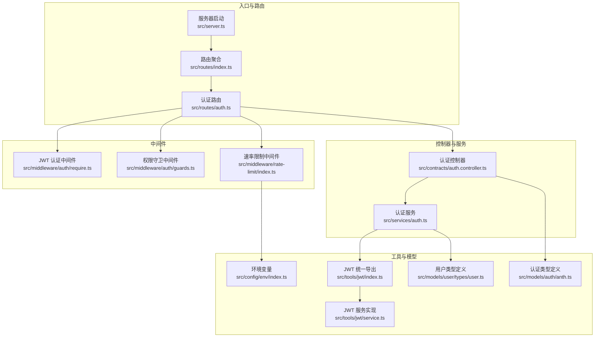
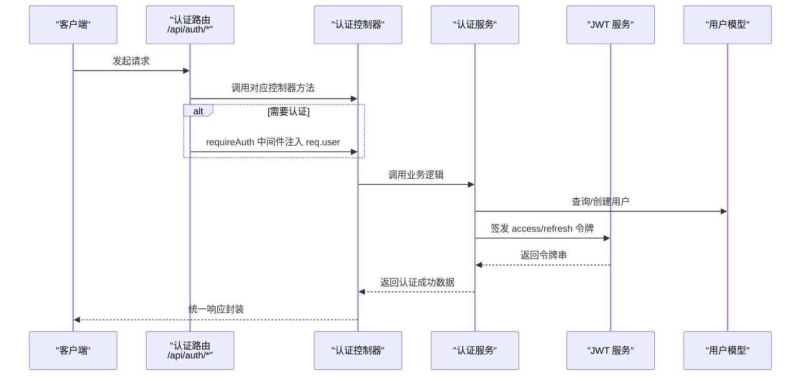
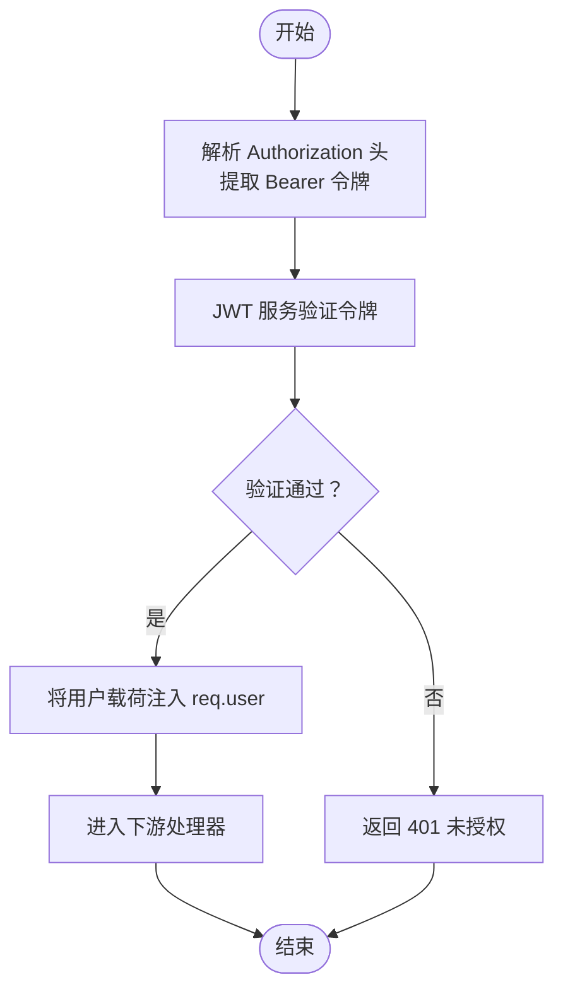
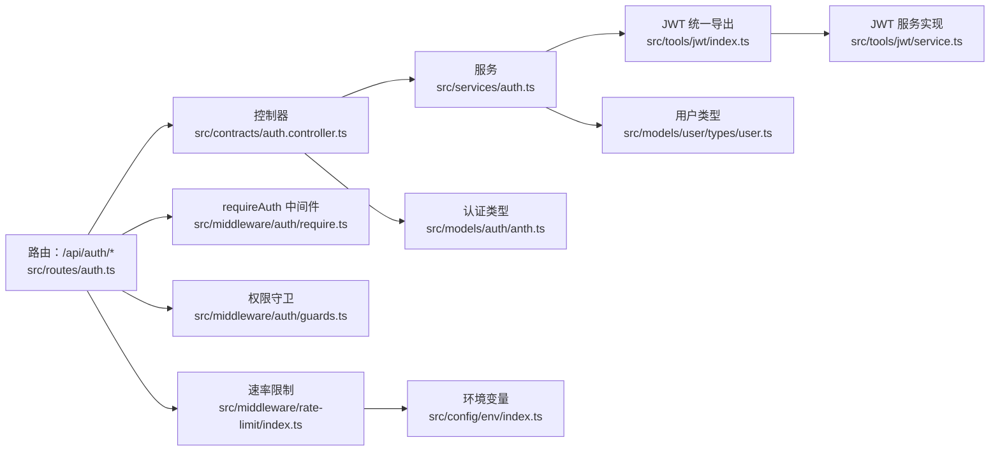

# 认证接口

<cite>
**本文引用的文件**
- [src/routes/auth.ts](file://src/routes/auth.ts)
- [src/contracts/auth.controller.ts](file://src/contracts/auth.controller.ts)
- [src/services/auth.ts](file://src/services/auth.ts)
- [src/middleware/auth/index.ts](file://src/middleware/auth/index.ts)
- [src/middleware/auth/require.ts](file://src/middleware/auth/require.ts)
- [src/middleware/auth/guards.ts](file://src/middleware/auth/guards.ts)
- [src/middleware/rate-limit/index.ts](file://src/middleware/rate-limit/index.ts)
- [src/models/auth/anth.ts](file://src/models/auth/anth.ts)
- [src/models/user/types/user.ts](file://src/models/user/types/user.ts)
- [src/tools/jwt/index.ts](file://src/tools/jwt/index.ts)
- [src/tools/jwt/service.ts](file://src/tools/jwt/service.ts)
- [src/config/env/index.ts](file://src/config/env/index.ts)
- [src/server.ts](file://src/server.ts)
- [src/routes/index.ts](file://src/routes/index.ts)
</cite>

## 目录
1. [简介](#简介)
2. [项目结构](#项目结构)
3. [核心组件](#核心组件)
4. [架构总览](#架构总览)
5. [详细组件分析](#详细组件分析)
6. [依赖关系分析](#依赖关系分析)
7. [性能考量](#性能考量)
8. [故障排查指南](#故障排查指南)
9. [结论](#结论)
10. [附录](#附录)

## 简介
本文件为 IM-API 的认证接口详细 API 文档，覆盖以下四个核心端点：
- 用户注册：POST /api/auth/register
- 用户登录：POST /api/auth/login
- 用户退出：POST /api/auth/logout
- 获取当前用户信息：GET /api/auth/me

内容包括：
- HTTP 方法、URL 模式、请求/响应模式与认证要求
- 请求参数验证规则与错误处理机制
- JWT 令牌使用方式与生命周期管理
- 安全考虑、速率限制与最佳实践

## 项目结构
认证相关代码采用“路由 → 控制器 → 服务 → 工具/模型”的分层设计，配合中间件完成鉴权与限流。

图表来源
- [src/server.ts](file://src/server.ts#L27-L48)
- [src/routes/index.ts](file://src/routes/index.ts#L12-L22)
- [src/routes/auth.ts](file://src/routes/auth.ts#L12-L47)
- [src/middleware/auth/require.ts](file://src/middleware/auth/require.ts#L68-L98)
- [src/middleware/auth/guards.ts](file://src/middleware/auth/guards.ts#L25-L51)
- [src/middleware/rate-limit/index.ts](file://src/middleware/rate-limit/index.ts#L43-L70)
- [src/contracts/auth.controller.ts](file://src/contracts/auth.controller.ts#L25-L111)
- [src/services/auth.ts](file://src/services/auth.ts#L86-L170)
- [src/tools/jwt/index.ts](file://src/tools/jwt/index.ts#L80-L107)
- [src/tools/jwt/service.ts](file://src/tools/jwt/service.ts#L41-L97)
- [src/models/auth/anth.ts](file://src/models/auth/anth.ts#L12-L108)
- [src/models/user/types/user.ts](file://src/models/user/types/user.ts#L64-L87)
- [src/config/env/index.ts](file://src/config/env/index.ts#L166-L220)

章节来源
- [src/server.ts](file://src/server.ts#L27-L48)
- [src/routes/index.ts](file://src/routes/index.ts#L12-L22)
- [src/routes/auth.ts](file://src/routes/auth.ts#L12-L47)

## 核心组件
- 路由层：定义 /api/auth/* 的四个端点，公开注册/登录，受保护的退出与当前用户信息接口。
- 控制器层：负责请求参数校验、调用服务层并封装统一响应/错误。
- 服务层：实现注册、登录、退出、获取当前用户等业务逻辑，签发 JWT 令牌。
- 中间件层：requireAuth 验证 Bearer 令牌；权限守卫提供角色/作用域/VIP/团队/令牌类型校验；速率限制按 IP 固定窗口计数。
- 工具与类型：JWT 服务根据环境变量创建，支持 HS256/RS256；认证与用户类型定义清晰。

章节来源
- [src/routes/auth.ts](file://src/routes/auth.ts#L12-L47)
- [src/contracts/auth.controller.ts](file://src/contracts/auth.controller.ts#L25-L111)
- [src/services/auth.ts](file://src/services/auth.ts#L86-L170)
- [src/middleware/auth/require.ts](file://src/middleware/auth/require.ts#L68-L98)
- [src/middleware/auth/guards.ts](file://src/middleware/auth/guards.ts#L25-L51)
- [src/middleware/rate-limit/index.ts](file://src/middleware/rate-limit/index.ts#L43-L70)
- [src/tools/jwt/index.ts](file://src/tools/jwt/index.ts#L80-L107)
- [src/models/auth/anth.ts](file://src/models/auth/anth.ts#L12-L108)
- [src/models/user/types/user.ts](file://src/models/user/types/user.ts#L64-L87)

## 架构总览
下图展示了认证请求从路由到服务再到 JWT 验证的整体流程。

图表来源
- [src/routes/auth.ts](file://src/routes/auth.ts#L12-L47)
- [src/contracts/auth.controller.ts](file://src/contracts/auth.controller.ts#L25-L111)
- [src/services/auth.ts](file://src/services/auth.ts#L86-L170)
- [src/middleware/auth/require.ts](file://src/middleware/auth/require.ts#L68-L98)
- [src/tools/jwt/service.ts](file://src/tools/jwt/service.ts#L41-L97)
- [src/models/user/types/user.ts](file://src/models/user/types/user.ts#L64-L87)

## 详细组件分析

### 注册接口
- 路径与方法
  - POST /api/auth/register
  - 认证要求：无需认证（公开）
- 请求体
  - phone: string（必填，仅数字）
  - password: string（必填）
  - pin: string（必填，6 位纯数字）
- 成功响应
  - 返回字段：user、access、refresh、payload
  - user：安全用户信息（不含 password/pin）
  - access/refresh：JWT 令牌
  - payload：令牌载荷（不含 tokenType）
- 失败响应
  - 参数缺失或格式不正确：400 错误
  - 手机号已存在：409 冲突
- 示例
  - 成功：返回 201，包含 access/refresh 与 user
  - 失败：返回 400（参数错误）或 409（重复）

章节来源
- [src/routes/auth.ts](file://src/routes/auth.ts#L18-L23)
- [src/contracts/auth.controller.ts](file://src/contracts/auth.controller.ts#L25-L52)
- [src/services/auth.ts](file://src/services/auth.ts#L94-L117)
- [src/models/auth/anth.ts](file://src/models/auth/anth.ts#L25-L29)
- [src/models/auth/anth.ts](file://src/models/auth/anth.ts#L104-L107)

### 登录接口
- 路径与方法
  - POST /api/auth/login
  - 认证要求：无需认证（公开）
- 请求体
  - phone: string（必填）
  - password: string（必填）
  - deviceId: string（可选）
- 成功响应
  - 返回字段：user、access、refresh、payload
- 失败响应
  - 参数缺失：400 错误
  - 用户不存在或密码错误：401 未授权
- 示例
  - 成功：返回 200，包含 access/refresh 与 user
  - 失败：返回 400 或 401

章节来源
- [src/routes/auth.ts](file://src/routes/auth.ts#L25-L30)
- [src/contracts/auth.controller.ts](file://src/contracts/auth.controller.ts#L59-L74)
- [src/services/auth.ts](file://src/services/auth.ts#L126-L134)
- [src/models/auth/anth.ts](file://src/models/auth/anth.ts#L38-L42)
- [src/models/auth/anth.ts](file://src/models/auth/anth.ts#L104-L107)

### 退出接口
- 路径与方法
  - POST /api/auth/logout
  - 认证要求：受保护（需携带有效 access 令牌）
- 请求头
  - Authorization: Bearer <access-token>
- 成功响应
  - 返回 200，消息提示“退出成功”
- 失败响应
  - 未提供或无效令牌：401 未授权
- 说明
  - 本实现为无状态 JWT，服务端不维护会话；退出即客户端丢弃令牌。
  - 若启用 Redis 黑名单，可在服务层扩展注销逻辑。

章节来源
- [src/routes/auth.ts](file://src/routes/auth.ts#L32-L37)
- [src/contracts/auth.controller.ts](file://src/contracts/auth.controller.ts#L81-L88)
- [src/middleware/auth/require.ts](file://src/middleware/auth/require.ts#L68-L98)
- [src/services/auth.ts](file://src/services/auth.ts#L162-L166)

### 获取当前用户信息接口
- 路径与方法
  - GET /api/auth/me
  - 认证要求：受保护（需携带有效 access 令牌）
- 请求头
  - Authorization: Bearer <access-token>
- 成功响应
  - 返回字段：安全用户信息（不含 password/pin）
- 失败响应
  - 未提供或无效令牌：401 未授权
  - 用户不存在：404
- 示例
  - 成功：返回 200，包含用户信息
  - 失败：返回 401 或 404

章节来源
- [src/routes/auth.ts](file://src/routes/auth.ts#L39-L44)
- [src/contracts/auth.controller.ts](file://src/contracts/auth.controller.ts#L95-L110)
- [src/services/auth.ts](file://src/services/auth.ts#L143-L153)
- [src/models/user/types/user.ts](file://src/models/user/types/user.ts#L64-L87)

### JWT 令牌使用与生命周期
- 令牌类型
  - access：访问令牌，用于受保护资源访问
  - refresh：刷新令牌，用于轮换 access
- 生命周期
  - 签发：服务层根据用户载荷签发 access 与 refresh
  - 验证：requireAuth 中间件从 Authorization 头提取 Bearer 令牌并验证
  - 过期：verifyAsync 抛出过期错误，状态码 401
- 载荷与安全
  - 载荷包含 sub、vip、roleId、teamId 等业务字段
  - 支持 HS256/RS256，密钥由环境变量配置
  - 令牌长期有效（不设置 exp），建议客户端妥善保管

图表来源
- [src/middleware/auth/require.ts](file://src/middleware/auth/require.ts#L40-L98)
- [src/tools/jwt/service.ts](file://src/tools/jwt/service.ts#L66-L75)
- [src/tools/jwt/index.ts](file://src/tools/jwt/index.ts#L80-L107)

章节来源
- [src/services/auth.ts](file://src/services/auth.ts#L45-L80)
- [src/middleware/auth/require.ts](file://src/middleware/auth/require.ts#L68-L98)
- [src/tools/jwt/service.ts](file://src/tools/jwt/service.ts#L41-L97)
- [src/tools/jwt/index.ts](file://src/tools/jwt/index.ts#L80-L107)

### 请求参数验证规则
- 注册
  - phone：必填且仅数字
  - password：必填
  - pin：必填且 6 位纯数字
- 登录
  - phone：必填
  - password：必填
- 通用
  - JSON 请求体必须可解析
  - 缺失或格式不符时返回 400

章节来源
- [src/contracts/auth.controller.ts](file://src/contracts/auth.controller.ts#L29-L45)
- [src/contracts/auth.controller.ts](file://src/contracts/auth.controller.ts#L63-L67)

### 错误处理机制
- 参数错误：400 Bad Request
- 未认证/令牌无效：401 Unauthorized
- 资源不存在：404 Not Found
- 冲突（如手机号已存在）：409 Conflict
- 太多请求：429 Too Many Requests（由速率限制中间件返回）
- 未知错误：500 Internal Server Error

章节来源
- [src/contracts/auth.controller.ts](file://src/contracts/auth.controller.ts#L30-L38)
- [src/contracts/auth.controller.ts](file://src/contracts/auth.controller.ts#L64-L67)
- [src/contracts/auth.controller.ts](file://src/contracts/auth.controller.ts#L100-L103)
- [src/services/auth.ts](file://src/services/auth.ts#L102-L106)
- [src/services/auth.ts](file://src/services/auth.ts#L146-L149)
- [src/middleware/auth/require.ts](file://src/middleware/auth/require.ts#L85-L96)
- [src/middleware/rate-limit/index.ts](file://src/middleware/rate-limit/index.ts#L54-L55)

### 响应数据结构
- 认证成功（注册/登录）
  - user：安全用户信息（不含 password/pin）
  - access：访问令牌
  - refresh：刷新令牌
  - payload：令牌载荷（不含 tokenType）
- 获取当前用户
  - 安全用户信息（不含 password/pin）
- 通用错误
  - code：错误码字符串
  - message：错误描述
  - status：HTTP 状态码

章节来源
- [src/models/auth/anth.ts](file://src/models/auth/anth.ts#L16-L16)
- [src/models/auth/anth.ts](file://src/models/auth/anth.ts#L104-L107)
- [src/models/user/types/user.ts](file://src/models/user/types/user.ts#L64-L87)
- [src/contracts/auth.controller.ts](file://src/contracts/auth.controller.ts#L50-L51)
- [src/contracts/auth.controller.ts](file://src/contracts/auth.controller.ts#L72-L73)
- [src/contracts/auth.controller.ts](file://src/contracts/auth.controller.ts#L86-L87)
- [src/contracts/auth.controller.ts](file://src/contracts/auth.controller.ts#L108-L109)

### 安全考虑
- 传输安全：建议在生产环境使用 HTTPS
- 令牌存储：客户端应安全存储 access/refresh 令牌，避免明文落盘
- 令牌撤销：当前为无状态实现；若需撤销，可启用 Redis 黑名单并在服务层扩展
- 设备绑定：当前未启用设备绑定，可在 JWT 配置中开启
- 密钥管理：确保 JWT_SECRET/私钥文件权限严格控制

章节来源
- [src/tools/jwt/index.ts](file://src/tools/jwt/index.ts#L97-L103)
- [src/config/env/index.ts](file://src/config/env/index.ts#L173-L175)

### 速率限制
- 策略：按客户端 IP 的固定窗口计数
- 配置项：RATE_LIMIT_WINDOW_MS、RATE_LIMIT_MAX_REQUESTS
- 触发：超过阈值返回 429 Too Many Requests

章节来源
- [src/middleware/rate-limit/index.ts](file://src/middleware/rate-limit/index.ts#L43-L70)
- [src/config/env/index.ts](file://src/config/env/index.ts#L208-L209)

### 最佳实践
- 客户端在每次请求受保护资源时携带 Authorization: Bearer <access-token>
- access 令牌过期后，使用 refresh 令牌轮换新的 access 令牌
- 退出时客户端应删除本地令牌
- 生产环境务必启用 HTTPS 并妥善管理密钥
- 对高频接口可结合速率限制策略防止滥用

## 依赖关系分析

图表来源
- [src/routes/auth.ts](file://src/routes/auth.ts#L12-L47)
- [src/contracts/auth.controller.ts](file://src/contracts/auth.controller.ts#L13-L19)
- [src/services/auth.ts](file://src/services/auth.ts#L13-L22)
- [src/tools/jwt/index.ts](file://src/tools/jwt/index.ts#L80-L107)
- [src/tools/jwt/service.ts](file://src/tools/jwt/service.ts#L41-L97)
- [src/models/auth/anth.ts](file://src/models/auth/anth.ts#L12-L108)
- [src/models/user/types/user.ts](file://src/models/user/types/user.ts#L64-L87)
- [src/middleware/auth/require.ts](file://src/middleware/auth/require.ts#L68-L98)
- [src/middleware/auth/guards.ts](file://src/middleware/auth/guards.ts#L25-L51)
- [src/middleware/rate-limit/index.ts](file://src/middleware/rate-limit/index.ts#L43-L70)
- [src/config/env/index.ts](file://src/config/env/index.ts#L208-L209)

章节来源
- [src/routes/auth.ts](file://src/routes/auth.ts#L12-L47)
- [src/contracts/auth.controller.ts](file://src/contracts/auth.controller.ts#L13-L19)
- [src/services/auth.ts](file://src/services/auth.ts#L13-L22)
- [src/middleware/auth/require.ts](file://src/middleware/auth/require.ts#L68-L98)
- [src/middleware/auth/guards.ts](file://src/middleware/auth/guards.ts#L25-L51)
- [src/middleware/rate-limit/index.ts](file://src/middleware/rate-limit/index.ts#L43-L70)
- [src/tools/jwt/index.ts](file://src/tools/jwt/index.ts#L80-L107)
- [src/tools/jwt/service.ts](file://src/tools/jwt/service.ts#L41-L97)
- [src/models/auth/anth.ts](file://src/models/auth/anth.ts#L12-L108)
- [src/models/user/types/user.ts](file://src/models/user/types/user.ts#L64-L87)
- [src/config/env/index.ts](file://src/config/env/index.ts#L208-L209)

## 性能考量
- 无状态 JWT：验证在服务端轻量完成，适合水平扩展
- 速率限制：默认每分钟最多 120 次请求，可根据业务调整
- 数据库：使用 SQLite/MySQL，注意连接池与索引优化
- 日志与追踪：统一请求日志与请求 ID，便于定位性能瓶颈

## 故障排查指南
- 400 参数错误
  - 检查请求体 JSON 格式与必填字段
  - 手机号格式与 PIN 格式要求
- 401 未授权
  - 确认 Authorization 头格式为 Bearer <token>
  - 检查令牌是否过期或被篡改
- 404 用户不存在
  - 确认用户 ID 是否正确
- 409 冲突（注册）
  - 手机号已被注册，请更换
- 429 太多请求
  - 检查客户端是否触发限流，适当降低请求频率

章节来源
- [src/contracts/auth.controller.ts](file://src/contracts/auth.controller.ts#L30-L38)
- [src/contracts/auth.controller.ts](file://src/contracts/auth.controller.ts#L64-L67)
- [src/contracts/auth.controller.ts](file://src/contracts/auth.controller.ts#L100-L103)
- [src/services/auth.ts](file://src/services/auth.ts#L102-L106)
- [src/services/auth.ts](file://src/services/auth.ts#L146-L149)
- [src/middleware/auth/require.ts](file://src/middleware/auth/require.ts#L85-L96)
- [src/middleware/rate-limit/index.ts](file://src/middleware/rate-limit/index.ts#L54-L55)

## 结论
本认证体系以无状态 JWT 为核心，结合严格的参数校验、统一的错误处理与速率限制，提供了简洁可靠的用户注册、登录、退出与当前用户信息查询能力。建议在生产环境中启用 HTTPS、妥善管理密钥，并根据业务需求扩展令牌撤销与设备绑定等高级特性。

## 附录

### 端点一览与认证要求
- POST /api/auth/register：公开，注册新用户
- POST /api/auth/login：公开，用户登录
- POST /api/auth/logout：受保护，退出登录
- GET /api/auth/me：受保护，获取当前用户信息

章节来源
- [src/routes/auth.ts](file://src/routes/auth.ts#L18-L44)

### 请求头与示例
- 请求头
  - Content-Type: application/json
  - Authorization: Bearer <access-token>（受保护接口）
- 成功示例
  - 注册/登录：返回 201/200，包含 access/refresh 与 user
  - 退出/获取当前用户：返回 200，包含相应消息或用户信息
- 失败示例
  - 参数错误：返回 400
  - 未认证：返回 401
  - 资源不存在：返回 404
  - 冲突：返回 409
  - 太多请求：返回 429

章节来源
- [src/contracts/auth.controller.ts](file://src/contracts/auth.controller.ts#L30-L38)
- [src/contracts/auth.controller.ts](file://src/contracts/auth.controller.ts#L64-L67)
- [src/contracts/auth.controller.ts](file://src/contracts/auth.controller.ts#L100-L103)
- [src/services/auth.ts](file://src/services/auth.ts#L102-L106)
- [src/services/auth.ts](file://src/services/auth.ts#L146-L149)
- [src/middleware/rate-limit/index.ts](file://src/middleware/rate-limit/index.ts#L54-L55)