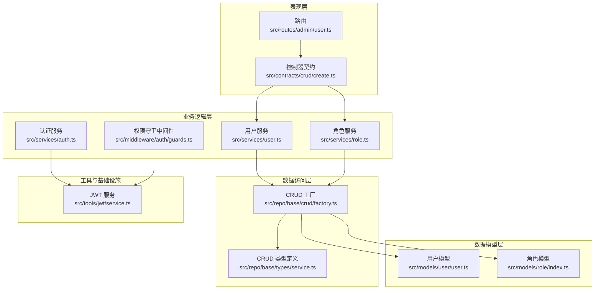
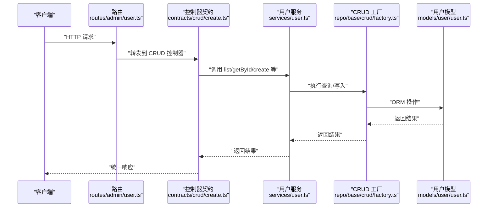
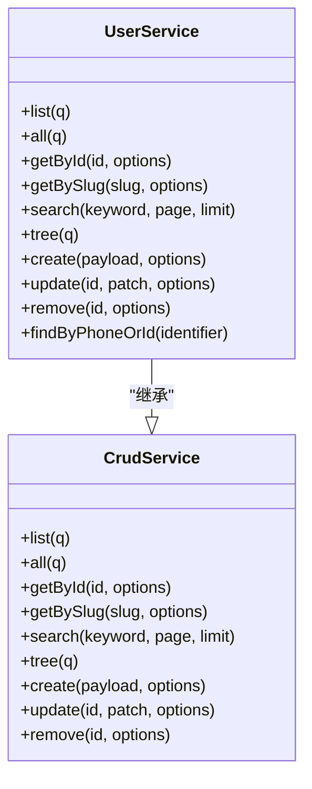
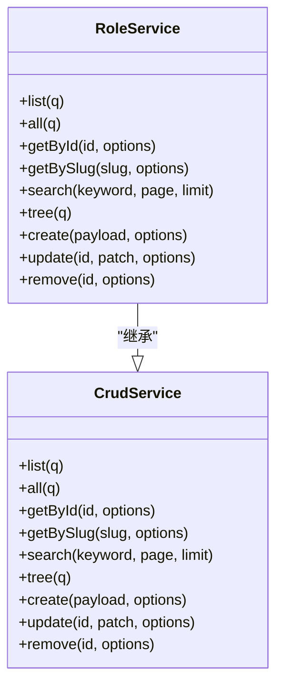
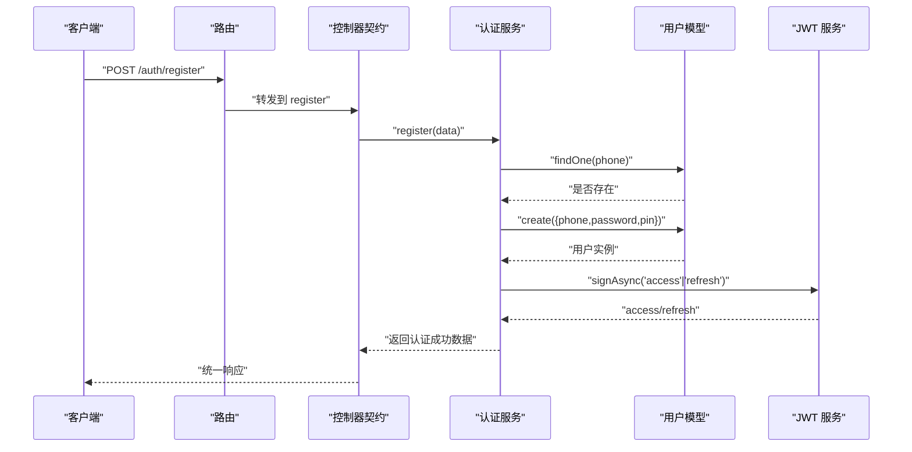
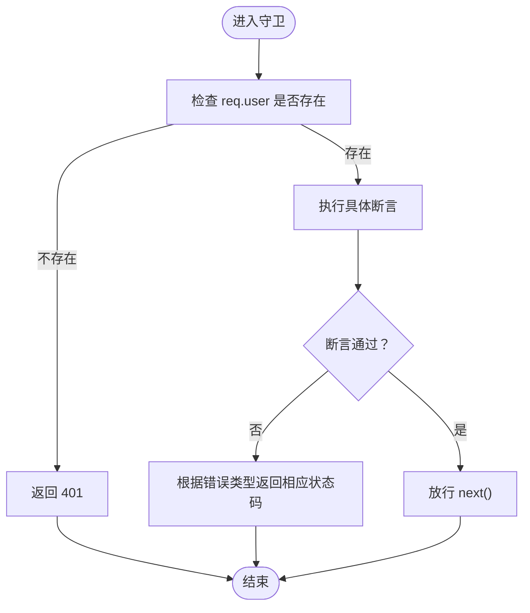
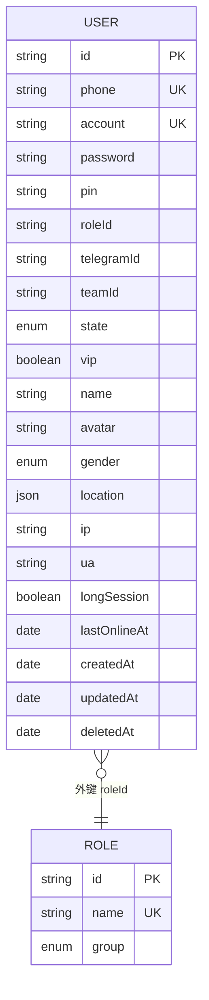
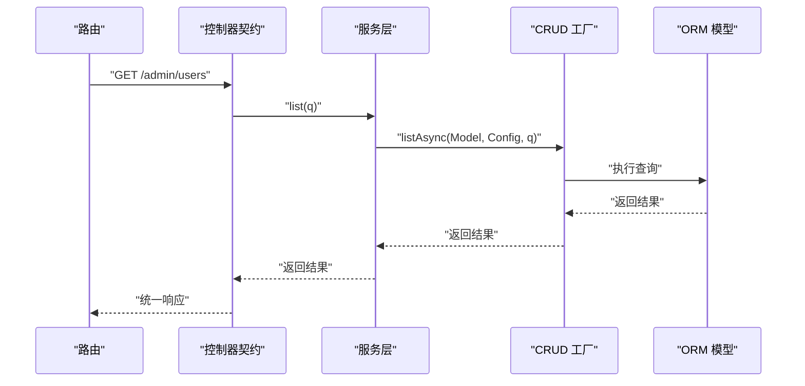
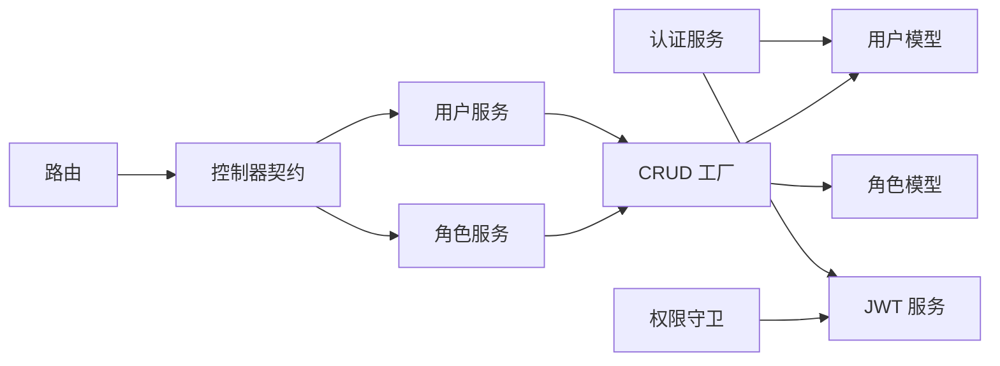

# 业务逻辑层

<cite>
**本文引用的文件**
- [src/services/user.ts](file://src/services/user.ts)
- [src/services/role.ts](file://src/services/role.ts)
- [src/services/auth.ts](file://src/services/auth.ts)
- [src/models/user/user.ts](file://src/models/user/user.ts)
- [src/models/user/hook.ts](file://src/models/user/hook.ts)
- [src/models/role/index.ts](file://src/models/role/index.ts)
- [src/models/role/types/index.ts](file://src/models/role/types/index.ts)
- [src/repo/base/crud/index.ts](file://src/repo/base/crud/index.ts)
- [src/repo/base/crud/factory.ts](file://src/repo/base/crud/factory.ts)
- [src/repo/base/types/service.ts](file://src/repo/base/types/service.ts)
- [src/contracts/crud/create.ts](file://src/contracts/crud/create.ts)
- [src/routes/admin/user.ts](file://src/routes/admin/user.ts)
- [src/middleware/auth/guards.ts](file://src/middleware/auth/guards.ts)
- [src/tools/jwt/service.ts](file://src/tools/jwt/service.ts)
</cite>

## 目录
1. [引言](#引言)
2. [项目结构](#项目结构)
3. [核心组件](#核心组件)
4. [架构总览](#架构总览)
5. [详细组件分析](#详细组件分析)
6. [依赖分析](#依赖分析)
7. [性能考虑](#性能考虑)
8. [故障排查指南](#故障排查指南)
9. [结论](#结论)
10. [附录](#附录)

## 引言
本文件面向 IM-API 的业务逻辑层，系统性阐述服务层架构设计原则与实现模式，覆盖用户管理、角色管理与认证流程的业务逻辑，文档化错误处理与事务策略，解释业务规则与数据一致性保障，并给出性能优化建议、扩展方法与与数据访问层、表现层的交互关系。

## 项目结构
业务逻辑层围绕“服务层 + 数据模型 + 通用 CRUD 工厂 + 控制器契约 + 中间件守卫”的分层组织：
- 服务层：封装业务规则与流程，如用户服务、角色服务、认证服务
- 数据模型层：定义实体结构、约束、索引与钩子，如用户模型、角色模型
- 通用 CRUD 工厂：按配置生成标准化的数据访问服务
- 控制器契约：将服务暴露为 REST 接口，统一封装响应与错误
- 中间件守卫：基于 JWT 载荷进行角色、作用域、VIP、团队、令牌类型等权限校验

图表来源
- [src/routes/admin/user.ts](file://src/routes/admin/user.ts#L1-L40)
- [src/contracts/crud/create.ts](file://src/contracts/crud/create.ts#L1-L171)
- [src/services/user.ts](file://src/services/user.ts#L1-L60)
- [src/services/role.ts](file://src/services/role.ts#L1-L35)
- [src/services/auth.ts](file://src/services/auth.ts#L1-L170)
- [src/repo/base/crud/factory.ts](file://src/repo/base/crud/factory.ts#L1-L66)
- [src/repo/base/types/service.ts](file://src/repo/base/types/service.ts#L1-L142)
- [src/models/user/user.ts](file://src/models/user/user.ts#L1-L275)
- [src/models/role/index.ts](file://src/models/role/index.ts#L1-L77)
- [src/middleware/auth/guards.ts](file://src/middleware/auth/guards.ts#L1-L195)
- [src/tools/jwt/service.ts](file://src/tools/jwt/service.ts#L1-L98)

章节来源
- [src/services/user.ts](file://src/services/user.ts#L1-L60)
- [src/services/role.ts](file://src/services/role.ts#L1-L35)
- [src/services/auth.ts](file://src/services/auth.ts#L1-L170)
- [src/models/user/user.ts](file://src/models/user/user.ts#L1-L275)
- [src/models/role/index.ts](file://src/models/role/index.ts#L1-L77)
- [src/repo/base/crud/factory.ts](file://src/repo/base/crud/factory.ts#L1-L66)
- [src/repo/base/types/service.ts](file://src/repo/base/types/service.ts#L1-L142)
- [src/contracts/crud/create.ts](file://src/contracts/crud/create.ts#L1-L171)
- [src/routes/admin/user.ts](file://src/routes/admin/user.ts#L1-L40)
- [src/middleware/auth/guards.ts](file://src/middleware/auth/guards.ts#L1-L195)
- [src/tools/jwt/service.ts](file://src/tools/jwt/service.ts#L1-L98)

## 核心组件
- 用户服务：基于通用 CRUD 工厂生成标准增删改查能力，并补充“按手机号或 ID 精确查找”等业务方法
- 角色服务：基于通用 CRUD 工厂生成角色的增删改查能力
- 认证服务：负责注册、登录、签发令牌、获取当前用户信息、退出等认证流程
- 权限守卫中间件：基于 JWT 载荷断言角色、作用域、VIP、团队、令牌类型
- JWT 服务：封装签发、校验、刷新轮转的通用逻辑
- 数据模型：用户模型与角色模型定义字段、约束、索引与钩子，确保数据一致性与安全序列化

章节来源
- [src/services/user.ts](file://src/services/user.ts#L1-L60)
- [src/services/role.ts](file://src/services/role.ts#L1-L35)
- [src/services/auth.ts](file://src/services/auth.ts#L1-L170)
- [src/middleware/auth/guards.ts](file://src/middleware/auth/guards.ts#L1-L195)
- [src/tools/jwt/service.ts](file://src/tools/jwt/service.ts#L1-L98)
- [src/models/user/user.ts](file://src/models/user/user.ts#L1-L275)
- [src/models/role/index.ts](file://src/models/role/index.ts#L1-L77)

## 架构总览
业务逻辑层通过“服务层 + 通用 CRUD 工厂 + 控制器契约 + 中间件守卫”的组合，形成清晰的职责边界：
- 服务层专注业务规则与流程编排
- CRUD 工厂屏蔽底层 ORM 细节，提供统一的查询/写入接口
- 控制器契约将服务方法映射为 REST 接口，统一封装响应与错误
- 中间件守卫在请求进入业务处理前完成权限校验

图表来源
- [src/routes/admin/user.ts](file://src/routes/admin/user.ts#L1-L40)
- [src/contracts/crud/create.ts](file://src/contracts/crud/create.ts#L1-L171)
- [src/services/user.ts](file://src/services/user.ts#L1-L60)
- [src/repo/base/crud/factory.ts](file://src/repo/base/crud/factory.ts#L1-L66)
- [src/models/user/user.ts](file://src/models/user/user.ts#L1-L275)

## 详细组件分析

### 用户服务（UserService）
- 设计要点
  - 基于通用 CRUD 工厂生成标准 CRUD 能力，通过配置对象限定字段集与可搜索/可过滤字段
  - 在基础 CRUD 上扩展“按手机号或 ID 精确查找”，满足登录/识别场景
- 关键行为
  - 列表/详情/创建/更新/删除：由 CRUD 工厂统一提供
  - 精确查找：支持 ID 或手机号二选一匹配
- 错误处理
  - 通过控制器契约统一捕获异常并返回标准响应
- 性能与扩展
  - 通过配置限制字段集与排序默认项，减少不必要的列加载
  - 可在配置中增加索引字段与过滤条件，提升查询效率

图表来源
- [src/services/user.ts](file://src/services/user.ts#L1-L60)
- [src/repo/base/types/service.ts](file://src/repo/base/types/service.ts#L23-L128)

章节来源
- [src/services/user.ts](file://src/services/user.ts#L1-L60)
- [src/repo/base/crud/factory.ts](file://src/repo/base/crud/factory.ts#L25-L65)
- [src/repo/base/types/service.ts](file://src/repo/base/types/service.ts#L23-L128)

### 角色服务（RoleService）
- 设计要点
  - 基于通用 CRUD 工厂生成角色的增删改查能力
  - 通过类型常量定义列表/过滤字段，确保前端与后端字段一致
- 关键行为
  - 列表/详情/创建/更新/删除：由 CRUD 工厂统一提供
- 错误处理
  - 通过控制器契约统一捕获异常并返回标准响应

图表来源
- [src/services/role.ts](file://src/services/role.ts#L1-L35)
- [src/repo/base/types/service.ts](file://src/repo/base/types/service.ts#L23-L128)

章节来源
- [src/services/role.ts](file://src/services/role.ts#L1-L35)
- [src/models/role/types/index.ts](file://src/models/role/types/index.ts#L48-L66)
- [src/repo/base/crud/factory.ts](file://src/repo/base/crud/factory.ts#L25-L65)
- [src/repo/base/types/service.ts](file://src/repo/base/types/service.ts#L23-L128)

### 认证服务（AuthService）
- 设计要点
  - 单例 JWT 服务：延迟初始化，避免重复创建
  - 令牌签发：同时生成 access 与 refresh 令牌，并构造安全用户信息
  - 注册/登录/获取当前用户/退出：封装典型认证流程
- 关键流程
  - 注册：校验手机号唯一性，创建用户，签发令牌
  - 登录：调用模型静态认证方法，签发令牌
  - 获取当前用户：按 ID 查询并安全序列化
  - 退出：当前为无状态实现，未来可扩展黑名单
- 错误处理
  - 用户不存在/密码错误/手机号已存在等场景抛出带状态码的错误
- 事务管理
  - 当前未显式开启事务；若后续引入多表写入，可在服务层传入操作选项以启用事务

图表来源
- [src/services/auth.ts](file://src/services/auth.ts#L86-L170)
- [src/models/user/user.ts](file://src/models/user/user.ts#L69-L89)
- [src/tools/jwt/service.ts](file://src/tools/jwt/service.ts#L41-L56)

章节来源
- [src/services/auth.ts](file://src/services/auth.ts#L1-L170)
- [src/models/user/user.ts](file://src/models/user/user.ts#L1-L275)
- [src/tools/jwt/service.ts](file://src/tools/jwt/service.ts#L1-L98)

### 权限守卫中间件（Guards）
- 设计要点
  - 基于 JWT 载荷断言角色、作用域、VIP、团队、令牌类型
  - 统一错误格式与状态码，便于前端处理
- 关键行为
  - 角色守卫：要求用户角色在允许列表内
  - 作用域守卫：要求用户至少拥有一个所需作用域
  - VIP 守卫：要求用户为 VIP
  - 团队守卫：要求用户属于指定团队之一
  - 令牌类型守卫：要求令牌类型匹配
- 错误处理
  - 认证错误与内部错误分别返回不同状态码与消息

图表来源
- [src/middleware/auth/guards.ts](file://src/middleware/auth/guards.ts#L18-L195)

章节来源
- [src/middleware/auth/guards.ts](file://src/middleware/auth/guards.ts#L1-L195)

### 数据模型与一致性
- 用户模型
  - 字段与约束：手机号唯一、账号唯一、角色外键、状态枚举、VIP 标识、位置 JSON、登录统计字段等
  - 索引：按创建时间/ID 降序、角色、状态、最后在线时间、手机号等
  - 钩子：保存前自动对密码进行 scrypt 哈希
  - 安全序列化：toJSON 剔除敏感字段
- 角色模型
  - 字段与约束：ID 主键、名称唯一、分组枚举
  - 索引：按分组字段建立索引

图表来源
- [src/models/user/user.ts](file://src/models/user/user.ts#L109-L266)
- [src/models/role/index.ts](file://src/models/role/index.ts#L41-L77)

章节来源
- [src/models/user/user.ts](file://src/models/user/user.ts#L1-L275)
- [src/models/role/index.ts](file://src/models/role/index.ts#L1-L77)

### 与数据访问层和表现层的交互
- 与数据访问层
  - 服务层通过 CRUD 工厂与 ORM 模型交互，统一查询/写入接口
  - 支持事务选项，便于在服务层扩展多表写入的一致性
- 与表现层
  - 控制器契约将服务方法映射为 REST 接口，统一封装响应与错误
  - 路由层仅负责参数解析与转发，保持简洁

图表来源
- [src/routes/admin/user.ts](file://src/routes/admin/user.ts#L1-L40)
- [src/contracts/crud/create.ts](file://src/contracts/crud/create.ts#L1-L171)
- [src/services/user.ts](file://src/services/user.ts#L1-L60)
- [src/repo/base/crud/factory.ts](file://src/repo/base/crud/factory.ts#L1-L66)

章节来源
- [src/routes/admin/user.ts](file://src/routes/admin/user.ts#L1-L40)
- [src/contracts/crud/create.ts](file://src/contracts/crud/create.ts#L1-L171)
- [src/repo/base/crud/index.ts](file://src/repo/base/crud/index.ts#L1-L28)
- [src/repo/base/crud/factory.ts](file://src/repo/base/crud/factory.ts#L1-L66)

## 依赖分析
- 服务层依赖
  - 用户服务与角色服务依赖通用 CRUD 工厂与模型定义
  - 认证服务依赖 JWT 服务与用户模型
- 中间件依赖
  - 权限守卫依赖 JWT 服务与类型定义
- 控制器契约依赖
  - 将服务方法映射为 REST 接口，统一封装响应与错误

图表来源
- [src/services/auth.ts](file://src/services/auth.ts#L1-L170)
- [src/tools/jwt/service.ts](file://src/tools/jwt/service.ts#L1-L98)
- [src/models/user/user.ts](file://src/models/user/user.ts#L1-L275)
- [src/services/user.ts](file://src/services/user.ts#L1-L60)
- [src/services/role.ts](file://src/services/role.ts#L1-L35)
- [src/repo/base/crud/factory.ts](file://src/repo/base/crud/factory.ts#L1-L66)
- [src/middleware/auth/guards.ts](file://src/middleware/auth/guards.ts#L1-L195)
- [src/routes/admin/user.ts](file://src/routes/admin/user.ts#L1-L40)
- [src/contracts/crud/create.ts](file://src/contracts/crud/create.ts#L1-L171)

章节来源
- [src/services/auth.ts](file://src/services/auth.ts#L1-L170)
- [src/tools/jwt/service.ts](file://src/tools/jwt/service.ts#L1-L98)
- [src/models/user/user.ts](file://src/models/user/user.ts#L1-L275)
- [src/services/user.ts](file://src/services/user.ts#L1-L60)
- [src/services/role.ts](file://src/services/role.ts#L1-L35)
- [src/repo/base/crud/factory.ts](file://src/repo/base/crud/factory.ts#L1-L66)
- [src/middleware/auth/guards.ts](file://src/middleware/auth/guards.ts#L1-L195)
- [src/routes/admin/user.ts](file://src/routes/admin/user.ts#L1-L40)
- [src/contracts/crud/create.ts](file://src/contracts/crud/create.ts#L1-L171)

## 性能考虑
- 字段选择与排序
  - 通过 CRUD 配置限制默认字段集与排序，默认项应与常用查询一致
- 索引优化
  - 用户模型已针对创建时间/ID、角色、状态、最后在线时间、手机号建立索引
  - 建议在高频过滤字段上增加复合索引
- 查询分页
  - 使用分页查询避免一次性加载大量数据
- 缓存策略
  - 对热点用户信息与角色信息可引入缓存（如 Redis），降低数据库压力
- 事务与批量操作
  - 多表写入时使用事务保证一致性；批量写入时注意分批提交，避免长事务锁表
- 密码哈希
  - 使用 scrypt 哈希，避免明文存储；在用户钩子中统一处理，减少重复逻辑

## 故障排查指南
- 认证相关
  - 用户不存在或密码错误：检查手机号唯一性与密码哈希是否正确
  - 手机号已存在：注册时先查询手机号，避免重复
- 权限相关
  - 401 未授权：确认请求头携带令牌且未过期
  - 403 禁止访问：检查角色/作用域/团队/令牌类型断言
- 数据访问相关
  - 查询性能差：确认是否命中索引；检查过滤条件与排序字段
  - 事务回滚：检查服务层是否传入操作选项启用事务
- 日志与监控
  - 使用统一响应与错误包装，便于定位问题

章节来源
- [src/services/auth.ts](file://src/services/auth.ts#L94-L117)
- [src/middleware/auth/guards.ts](file://src/middleware/auth/guards.ts#L25-L50)
- [src/models/user/user.ts](file://src/models/user/user.ts#L256-L263)

## 结论
业务逻辑层通过“服务层 + 通用 CRUD 工厂 + 控制器契约 + 中间件守卫”的架构，实现了清晰的职责分离与可复用的数据访问能力。用户管理、角色管理与认证流程均以统一模式实现，具备良好的扩展性与可维护性。配合合理的索引、分页与缓存策略，可在保证数据一致性的同时获得稳定的性能表现。

## 附录
- 事务管理策略
  - 在服务层通过操作选项启用事务，确保多表写入的一致性
- 业务规则与数据一致性
  - 用户模型钩子统一处理密码哈希；toJSON 剔除敏感字段；唯一约束与枚举约束保证数据完整性
- 扩展方法
  - 新增实体：基于 CRUD 工厂快速生成服务；在控制器契约中映射 REST 接口
  - 新增权限：在守卫中间件中新增断言逻辑；在 JWT 载荷中扩展必要字段
- 最佳实践
  - 明确字段集与默认排序，减少不必要的列加载
  - 优先使用分页查询与索引优化
  - 在高并发场景下引入缓存与限流策略