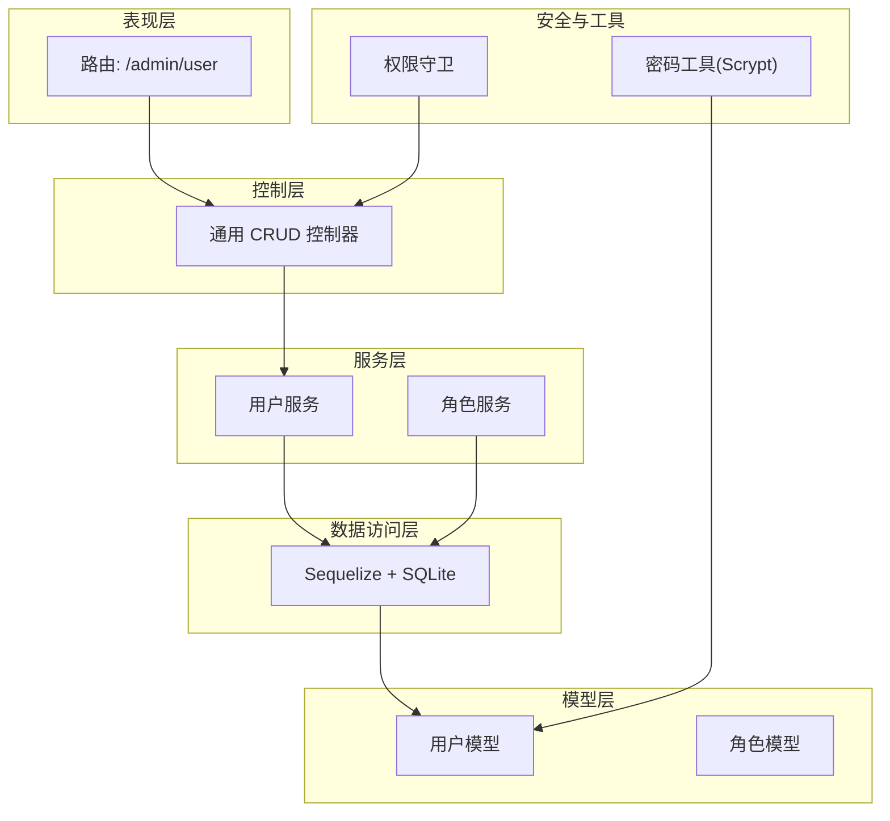
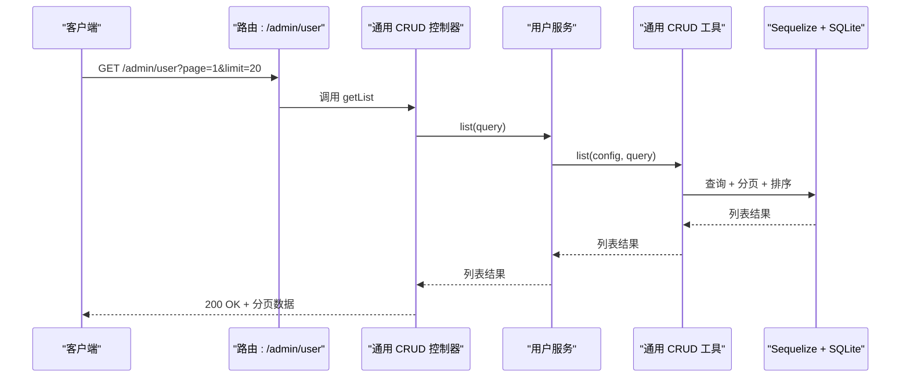
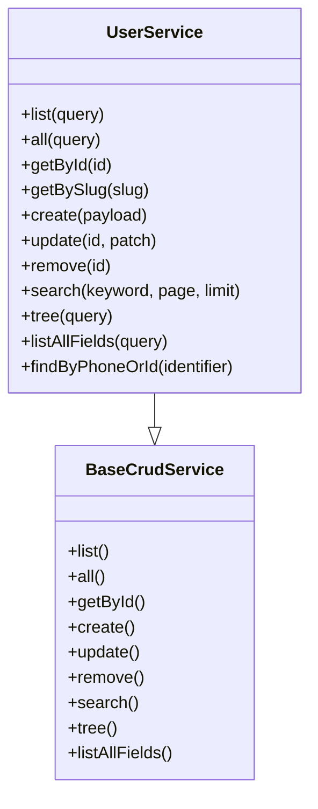
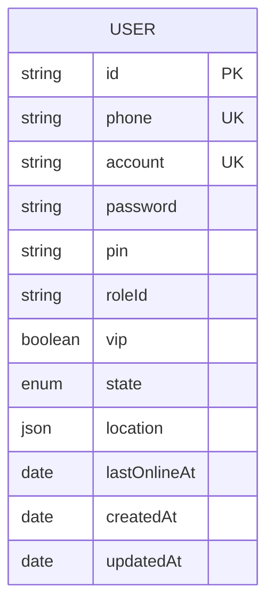
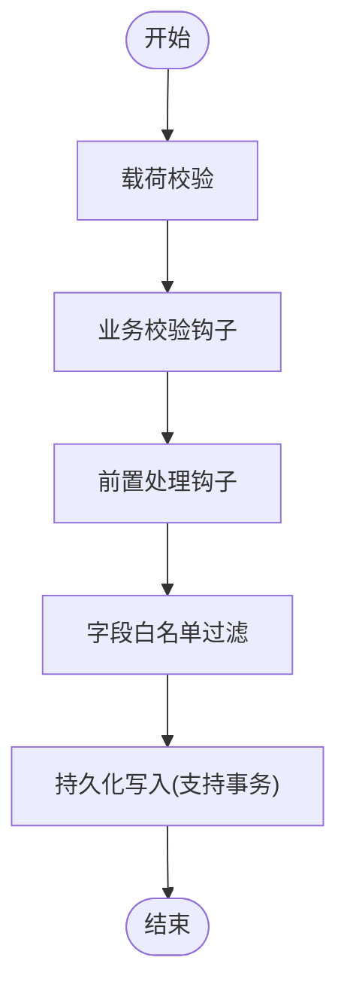
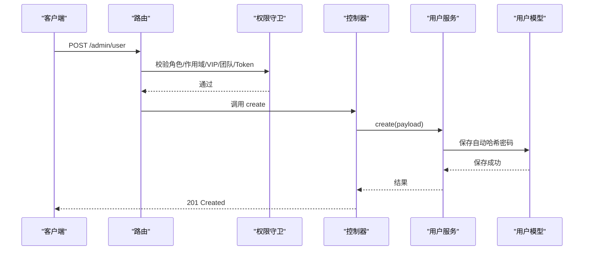
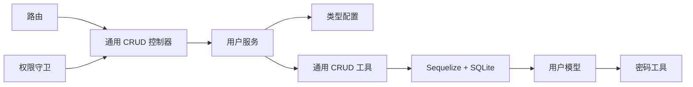

# 用户服务

<cite>
**本文引用的文件**
- [src/services/user.ts](file://src/services/user.ts)
- [src/models/user/user.ts](file://src/models/user/user.ts)
- [src/tmpl/types/models/admin/user.ts](file://src/tmpl/types/models/admin/user.ts)
- [src/routes/admin/user.ts](file://src/routes/admin/user.ts)
- [src/contracts/crud/create.ts](file://src/contracts/crud/create.ts)
- [src/repo/base/validation/function/validators.ts](file://src/repo/base/validation/function/validators.ts)
- [src/repo/base/crud/create.ts](file://src/repo/base/crud/create.ts)
- [src/repo/base/crud/update.ts](file://src/repo/base/crud/update.ts)
- [src/repo/base/crud/remove.ts](file://src/repo/base/crud/remove.ts)
- [src/config/db/sqlite/index.ts](file://src/config/db/sqlite/index.ts)
- [src/utils/common/gen/id.ts](file://src/utils/common/gen/id.ts)
- [src/tools/crypto/password.ts](file://src/tools/crypto/password.ts)
- [src/middleware/auth/guards.ts](file://src/middleware/auth/guards.ts)
- [src/services/role.ts](file://src/services/role.ts)
</cite>

## 目录
1. [简介](#简介)
2. [项目结构](#项目结构)
3. [核心组件](#核心组件)
4. [架构总览](#架构总览)
5. [组件详解](#组件详解)
6. [依赖关系分析](#依赖关系分析)
7. [性能考量](#性能考量)
8. [故障排查指南](#故障排查指南)
9. [结论](#结论)
10. [附录](#附录)

## 简介
本文件面向 IM-API 的用户服务，系统化阐述用户管理的业务逻辑与技术实现，覆盖用户信息的增删改查、数据验证与业务约束、状态与权限管理、与数据访问层的交互与事务策略、隐私与安全设计，以及扩展与自定义业务逻辑的方法。文档同时提供 API 调用示例与错误处理机制说明，帮助开发者快速理解与正确使用用户服务。

## 项目结构
用户服务位于服务层与模型层之间，通过通用 CRUD 服务工厂与路由控制器形成清晰分层：
- 服务层：用户服务封装 CRUD 配置与扩展方法（如按手机号或 ID 查找）
- 模型层：用户模型定义字段、约束、索引与生命周期钩子
- 路由层：基于通用 CRUD 控制器生成 REST 接口
- 数据访问层：基于 Sequelize + SQLite，提供事务与查询优化
- 安全与权限：认证中间件与守卫，配合角色服务进行权限校验

图表来源
- [src/routes/admin/user.ts](file://src/routes/admin/user.ts#L1-L40)
- [src/contracts/crud/create.ts](file://src/contracts/crud/create.ts#L1-L171)
- [src/services/user.ts](file://src/services/user.ts#L1-L60)
- [src/services/role.ts](file://src/services/role.ts#L1-L35)
- [src/models/user/user.ts](file://src/models/user/user.ts#L1-L275)
- [src/config/db/sqlite/index.ts](file://src/config/db/sqlite/index.ts#L1-L410)
- [src/tools/crypto/password.ts](file://src/tools/crypto/password.ts#L1-L111)
- [src/middleware/auth/guards.ts](file://src/middleware/auth/guards.ts#L1-L195)

章节来源
- [src/routes/admin/user.ts](file://src/routes/admin/user.ts#L1-L40)
- [src/contracts/crud/create.ts](file://src/contracts/crud/create.ts#L1-L171)
- [src/services/user.ts](file://src/services/user.ts#L1-L60)
- [src/services/role.ts](file://src/services/role.ts#L1-L35)
- [src/models/user/user.ts](file://src/models/user/user.ts#L1-L275)
- [src/config/db/sqlite/index.ts](file://src/config/db/sqlite/index.ts#L1-L410)
- [src/tools/crypto/password.ts](file://src/tools/crypto/password.ts#L1-L111)
- [src/middleware/auth/guards.ts](file://src/middleware/auth/guards.ts#L1-L195)

## 核心组件
- 用户服务：基于通用 CRUD 服务工厂，提供列表/详情/创建/更新/删除等能力，并扩展“按手机号或 ID 查找”
- 用户模型：定义字段、校验、索引、默认值与生命周期钩子；内置强类型安全序列化与密码校验
- 类型与字段配置：集中定义列表、详情、可创建/更新、可筛选、可排序字段
- 路由与控制器：通过通用 CRUD 控制器生成 REST 接口，自动包装错误
- 数据库与事务：SQLite + WAL 模式优化，支持事务选项传递到 CRUD 操作
- 安全与权限：JWT 守卫按角色/作用域/VIP/团队/Token 类型进行校验
- 密码与隐私：Scrypt 哈希存储，敏感字段在序列化时剔除

章节来源
- [src/services/user.ts](file://src/services/user.ts#L1-L60)
- [src/models/user/user.ts](file://src/models/user/user.ts#L1-L275)
- [src/tmpl/types/models/admin/user.ts](file://src/tmpl/types/models/admin/user.ts#L1-L177)
- [src/routes/admin/user.ts](file://src/routes/admin/user.ts#L1-L40)
- [src/contracts/crud/create.ts](file://src/contracts/crud/create.ts#L1-L171)
- [src/config/db/sqlite/index.ts](file://src/config/db/sqlite/index.ts#L1-L410)
- [src/middleware/auth/guards.ts](file://src/middleware/auth/guards.ts#L1-L195)
- [src/tools/crypto/password.ts](file://src/tools/crypto/password.ts#L1-L111)

## 架构总览
用户服务遵循“路由 -> 控制器 -> 服务 -> 数据访问层”的分层架构，结合通用 CRUD 工厂与类型配置，实现一致的 CRUD 行为与灵活的扩展点。

图表来源
- [src/routes/admin/user.ts](file://src/routes/admin/user.ts#L33-L37)
- [src/contracts/crud/create.ts](file://src/contracts/crud/create.ts#L36-L40)
- [src/services/user.ts](file://src/services/user.ts#L40-L43)
- [src/repo/base/crud/create.ts](file://src/repo/base/crud/create.ts#L36-L80)
- [src/config/db/sqlite/index.ts](file://src/config/db/sqlite/index.ts#L120-L128)

章节来源
- [src/routes/admin/user.ts](file://src/routes/admin/user.ts#L1-L40)
- [src/contracts/crud/create.ts](file://src/contracts/crud/create.ts#L1-L171)
- [src/services/user.ts](file://src/services/user.ts#L1-L60)
- [src/repo/base/crud/create.ts](file://src/repo/base/crud/create.ts#L1-L81)
- [src/config/db/sqlite/index.ts](file://src/config/db/sqlite/index.ts#L1-L410)

## 组件详解

### 用户服务（UserService）
- 基于通用 CRUD 服务工厂创建，继承列表/详情/创建/更新/删除等能力
- 配置项：
  - 列表字段、详情字段、可创建字段、可更新字段
  - 搜索字段：id、name、phone
  - 可筛选字段：state、vip、roleId、gender
  - 默认排序：按可排序字段升序
- 扩展方法：按手机号或 ID 精确查找
- 事务支持：通过 CRUD 工具的选项透传，支持在服务层包裹事务

图表来源
- [src/services/user.ts](file://src/services/user.ts#L30-L57)
- [src/contracts/crud/create.ts](file://src/contracts/crud/create.ts#L28-L170)

章节来源
- [src/services/user.ts](file://src/services/user.ts#L1-L60)

### 用户模型（User）
- 字段与约束：
  - 唯一键：id（7 位随机数字）、phone、account
  - 状态：枚举 active/deleted，默认 active
  - VIP 标识：布尔，默认 false
  - 角色：roleId，默认 user
  - 位置：JSON，默认包含国家/省份/城市
  - 登录相关：longSession、lastOnlineAt
  - 安全：password、pin 使用 Scrypt 哈希
- 索引：createdAt+id、roleId、state、lastOnlineAt、phone
- 生命周期钩子：保存前自动对明文密码进行哈希
- 认证：提供静态认证方法与密码校验
- 序列化：重写 toJSON，剔除敏感字段

图表来源
- [src/models/user/user.ts](file://src/models/user/user.ts#L109-L266)

章节来源
- [src/models/user/user.ts](file://src/models/user/user.ts#L1-L275)

### 类型与字段配置
- 用户状态枚举：active、deleted
- 位置信息接口：country、province、city
- 字段常量：
  - 列表字段：id、phone、account、name、avatar、state、vip、roleId、createdAt
  - 详情字段：包含更多字段
  - 可创建字段：phone、password、pin、name、avatar、roleId
  - 可更新字段：name、avatar、state、vip、roleId、gender、location、longSession
  - 可筛选字段：state、vip、roleId、gender
  - 可排序字段：createdAt、lastOnlineAt、name

章节来源
- [src/tmpl/types/models/admin/user.ts](file://src/tmpl/types/models/admin/user.ts#L1-L177)

### 路由与控制器
- 路由：提供 GET /、POST /、GET /:id、PUT /:id、DELETE /:id
- 控制器：基于通用 CRUD 控制器生成，自动包装异步错误，返回统一结构
- 心跳接口：POST /heartbeat 用于客户端连接检测

章节来源
- [src/routes/admin/user.ts](file://src/routes/admin/user.ts#L1-L40)
- [src/contracts/crud/create.ts](file://src/contracts/crud/create.ts#L1-L171)

### 数据访问与事务策略
- 通用 CRUD 工具：
  - 创建：执行载荷校验 -> 业务校验钩子 -> 前置处理钩子 -> 白名单过滤 -> 持久化（支持事务）
  - 更新：校验 ID 与载荷 -> 业务校验钩子 -> 前置处理钩子 -> 白名单过滤 -> 更新持久化（支持事务）
  - 删除：校验 ID -> 查找记录 -> 删除（支持事务）
- 事务透传：调用方可通过选项将事务传递至 CRUD 工具，确保多步操作原子性

图表来源
- [src/repo/base/crud/create.ts](file://src/repo/base/crud/create.ts#L36-L80)
- [src/repo/base/crud/update.ts](file://src/repo/base/crud/update.ts#L38-L65)
- [src/repo/base/crud/remove.ts](file://src/repo/base/crud/remove.ts#L35-L55)

章节来源
- [src/repo/base/validation/function/validators.ts](file://src/repo/base/validation/function/validators.ts#L1-L76)
- [src/repo/base/crud/create.ts](file://src/repo/base/crud/create.ts#L1-L81)
- [src/repo/base/crud/update.ts](file://src/repo/base/crud/update.ts#L1-L66)
- [src/repo/base/crud/remove.ts](file://src/repo/base/crud/remove.ts#L1-L56)

### 安全与权限
- 密码安全：使用 Scrypt 哈希，存储格式包含成本参数与盐值；支持校验与升级
- 敏感字段保护：模型序列化时剔除 password；默认作用域排除敏感字段
- 认证与授权：JWT 守卫支持角色、作用域、VIP、团队、Token 类型校验
- 角色管理：角色服务提供 CRUD 能力，用户服务依赖 roleId 进行权限判定

图表来源
- [src/middleware/auth/guards.ts](file://src/middleware/auth/guards.ts#L25-L51)
- [src/contracts/crud/create.ts](file://src/contracts/crud/create.ts#L76-L80)
- [src/services/user.ts](file://src/services/user.ts#L40-L43)
- [src/models/user/user.ts](file://src/models/user/user.ts#L256-L263)

章节来源
- [src/tools/crypto/password.ts](file://src/tools/crypto/password.ts#L1-L111)
- [src/models/user/user.ts](file://src/models/user/user.ts#L96-L100)
- [src/middleware/auth/guards.ts](file://src/middleware/auth/guards.ts#L1-L195)
- [src/services/role.ts](file://src/services/role.ts#L1-L35)

### 用户状态管理与业务约束
- 状态枚举：active（正常）、deleted（已删除）
- 约束与默认值：
  - id：7 位随机数字，唯一
  - phone/account：唯一，手机号仅允许数字
  - state：默认 active
  - roleId：默认 user
  - location：默认包含国家/省份/城市
  - longSession/lastOnlineAt：登录相关
- 模型校验：通过 Sequelize validate 与 Scrypt 钩子保障数据一致性与安全性

章节来源
- [src/models/user/user.ts](file://src/models/user/user.ts#L127-L155)
- [src/models/user/user.ts](file://src/models/user/user.ts#L176-L188)
- [src/models/user/user.ts](file://src/models/user/user.ts#L206-L211)
- [src/models/user/user.ts](file://src/models/user/user.ts#L256-L263)

### 扩展与自定义业务逻辑
- 在用户服务中新增方法：例如按手机号或 ID 精确查找
- 通过 CRUD 配置扩展：在 creatableFields/updatableFields/filterableFields 等处增加字段白名单
- 通过钩子扩展：在 createAsync/updateAsync 中利用 validateCreate/beforeCreate/validateUpdate/beforeUpdate 注入业务校验与预处理
- 事务包裹：在服务层调用 CRUD 工具时传入事务选项，确保多步操作原子性

章节来源
- [src/services/user.ts](file://src/services/user.ts#L40-L57)
- [src/repo/base/crud/create.ts](file://src/repo/base/crud/create.ts#L37-L52)
- [src/repo/base/crud/update.ts](file://src/repo/base/crud/update.ts#L39-L53)

## 依赖关系分析
- 用户服务依赖通用 CRUD 工厂与类型配置，耦合度低，内聚性强
- 用户模型依赖密码工具与通用 ID 生成器
- 路由依赖通用 CRUD 控制器，控制器依赖服务层
- 数据库层通过 SQLite 配置与 PRAGMA 优化提升性能与稳定性
- 权限守卫独立于用户服务，通过中间件注入

图表来源
- [src/services/user.ts](file://src/services/user.ts#L1-L60)
- [src/tmpl/types/models/admin/user.ts](file://src/tmpl/types/models/admin/user.ts#L1-L177)
- [src/contracts/crud/create.ts](file://src/contracts/crud/create.ts#L1-L171)
- [src/repo/base/crud/create.ts](file://src/repo/base/crud/create.ts#L1-L81)
- [src/config/db/sqlite/index.ts](file://src/config/db/sqlite/index.ts#L120-L128)
- [src/models/user/user.ts](file://src/models/user/user.ts#L1-L275)
- [src/tools/crypto/password.ts](file://src/tools/crypto/password.ts#L1-L111)
- [src/middleware/auth/guards.ts](file://src/middleware/auth/guards.ts#L1-L195)

章节来源
- [src/services/user.ts](file://src/services/user.ts#L1-L60)
- [src/contracts/crud/create.ts](file://src/contracts/crud/create.ts#L1-L171)
- [src/repo/base/crud/create.ts](file://src/repo/base/crud/create.ts#L1-L81)
- [src/config/db/sqlite/index.ts](file://src/config/db/sqlite/index.ts#L1-L410)
- [src/models/user/user.ts](file://src/models/user/user.ts#L1-L275)
- [src/tools/crypto/password.ts](file://src/tools/crypto/password.ts#L1-L111)
- [src/middleware/auth/guards.ts](file://src/middleware/auth/guards.ts#L1-L195)

## 性能考量
- SQLite 优化：WAL 模式、mmap、cache_size、wal_autocheckpoint、busy_timeout 等 PRAGMA 调优
- 连接池：最大连接数、最小连接数、空闲与获取超时设置
- 查询优化：为常用字段建立索引（createdAt、id、roleId、state、lastOnlineAt、phone）
- 序列化开销：默认作用域剔除敏感字段，避免不必要的数据传输
- 事务批处理：在服务层通过事务选项批量提交，减少锁竞争

章节来源
- [src/config/db/sqlite/index.ts](file://src/config/db/sqlite/index.ts#L136-L154)
- [src/config/db/sqlite/index.ts](file://src/config/db/sqlite/index.ts#L106-L128)
- [src/models/user/user.ts](file://src/models/user/user.ts#L238-L251)
- [src/models/user/user.ts](file://src/models/user/user.ts#L236-L237)

## 故障排查指南
- 创建失败（字段缺失/非法）：检查载荷校验与必填字段，确认 creatableFields 白名单
- 更新失败（ID 无效/资源不存在）：确认 ID 格式与存在性，查看 404 错误
- 认证失败：核对手机号与密码，确认 Scrypt 哈希与 pepper 配置
- 权限不足：检查角色/作用域/VIP/团队/Token 类型是否满足守卫要求
- 数据库连接问题：检查 SQLite 文件路径与 WAL 文件占用，必要时重启服务

章节来源
- [src/repo/base/validation/function/validators.ts](file://src/repo/base/validation/function/validators.ts#L57-L76)
- [src/repo/base/crud/remove.ts](file://src/repo/base/crud/remove.ts#L43-L47)
- [src/tools/crypto/password.ts](file://src/tools/crypto/password.ts#L39-L46)
- [src/middleware/auth/guards.ts](file://src/middleware/auth/guards.ts#L25-L51)
- [src/config/db/sqlite/index.ts](file://src/config/db/sqlite/index.ts#L287-L330)

## 结论
用户服务通过通用 CRUD 工厂与类型配置实现了标准化的增删改查能力，并在模型层内置安全与约束，在路由层提供一致的 REST 接口。配合 SQLite 性能优化、事务支持与权限守卫，能够稳定支撑用户管理场景。通过钩子与事务透传，服务具备良好的扩展性与自定义能力。

## 附录

### API 调用示例（REST）
- 获取列表
  - 方法：GET
  - 路径：/admin/user
  - 查询参数：page、limit、order、filters、search
- 获取详情
  - 方法：GET
  - 路径：/admin/user/:id
- 创建用户
  - 方法：POST
  - 路径：/admin/user
  - 请求体：phone、password、pin、name、avatar、roleId（可创建字段）
- 更新用户
  - 方法：PUT
  - 路径：/admin/user/:id
  - 请求体：name、avatar、state、vip、roleId、gender、location、longSession（可更新字段）
- 删除用户
  - 方法：DELETE
  - 路径：/admin/user/:id
- 心跳检测
  - 方法：POST
  - 路径：/admin/user/heartbeat

章节来源
- [src/routes/admin/user.ts](file://src/routes/admin/user.ts#L33-L37)
- [src/tmpl/types/models/admin/user.ts](file://src/tmpl/types/models/admin/user.ts#L133-L155)

### 错误处理机制
- 控制器统一包装：捕获异步异常，返回统一响应结构
- 校验错误：载荷与查询选项校验失败时抛出业务校验异常
- 资源不存在：删除时若记录不存在，返回 404 错误
- 权限错误：守卫校验失败返回相应状态码与错误信息

章节来源
- [src/contracts/crud/create.ts](file://src/contracts/crud/create.ts#L36-L102)
- [src/repo/base/validation/function/validators.ts](file://src/repo/base/validation/function/validators.ts#L11-L48)
- [src/repo/base/crud/remove.ts](file://src/repo/base/crud/remove.ts#L43-L47)
- [src/middleware/auth/guards.ts](file://src/middleware/auth/guards.ts#L25-L51)