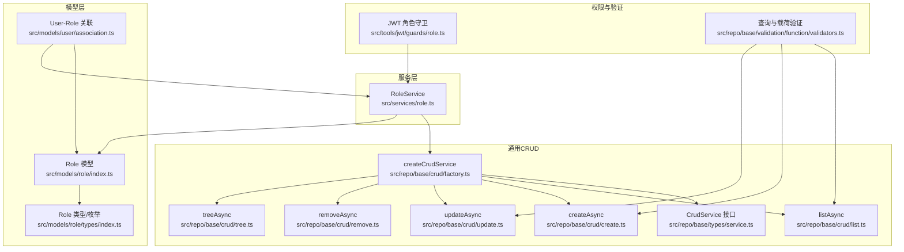
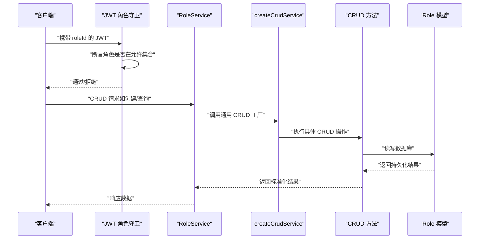
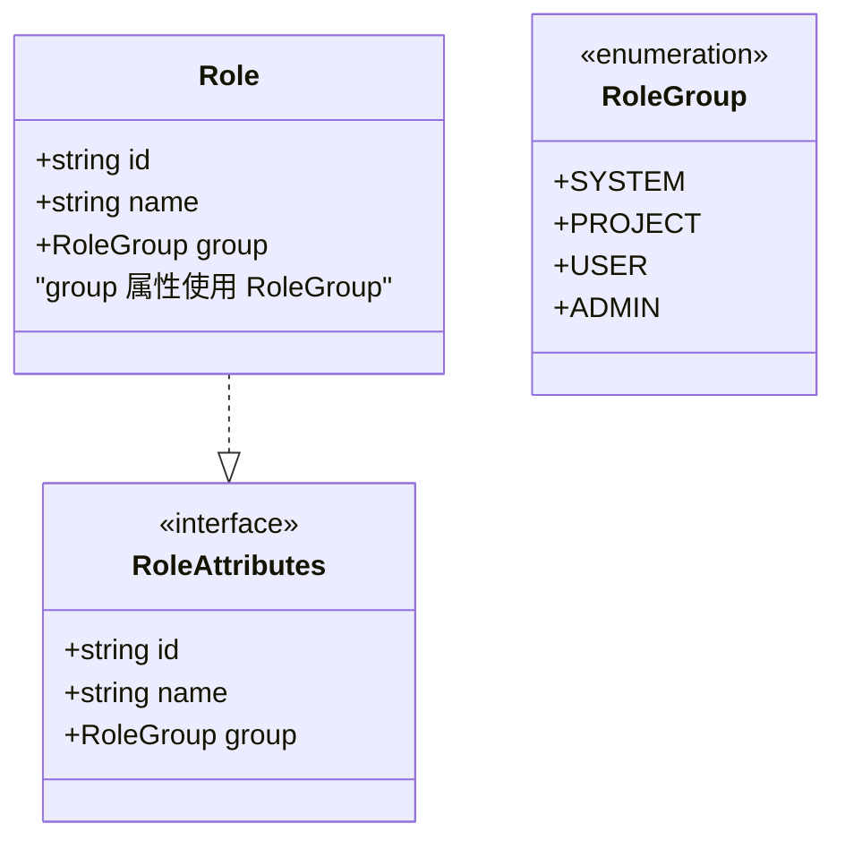
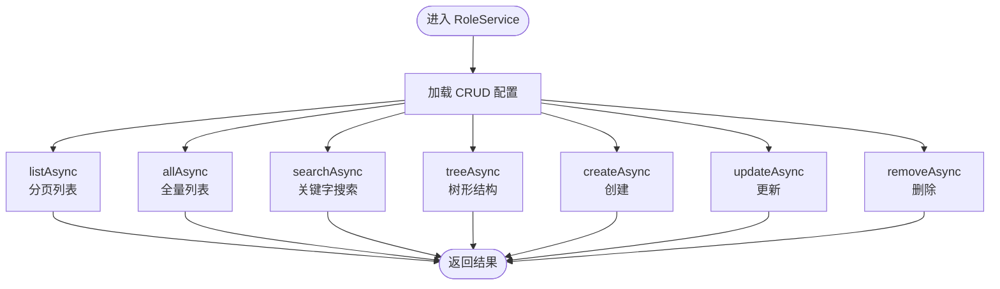
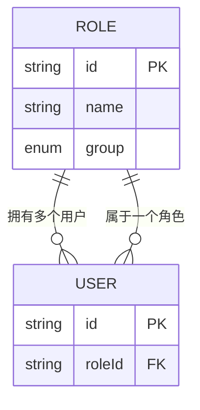
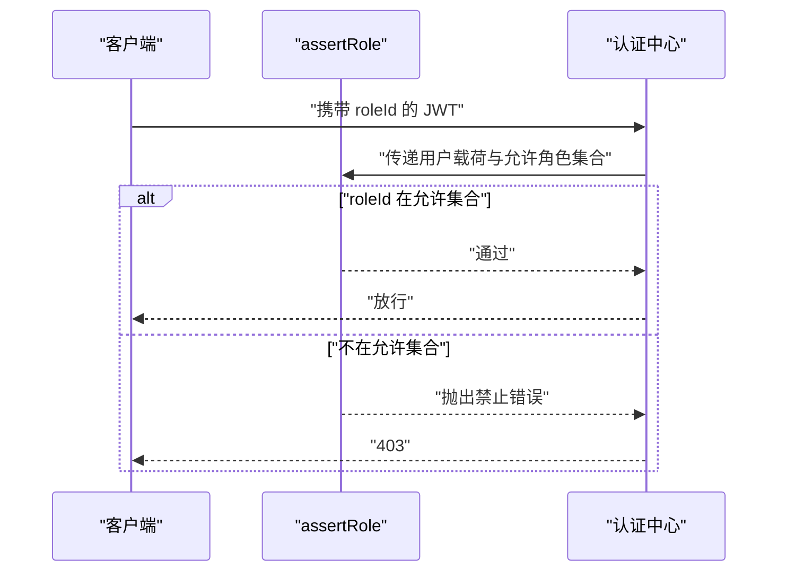
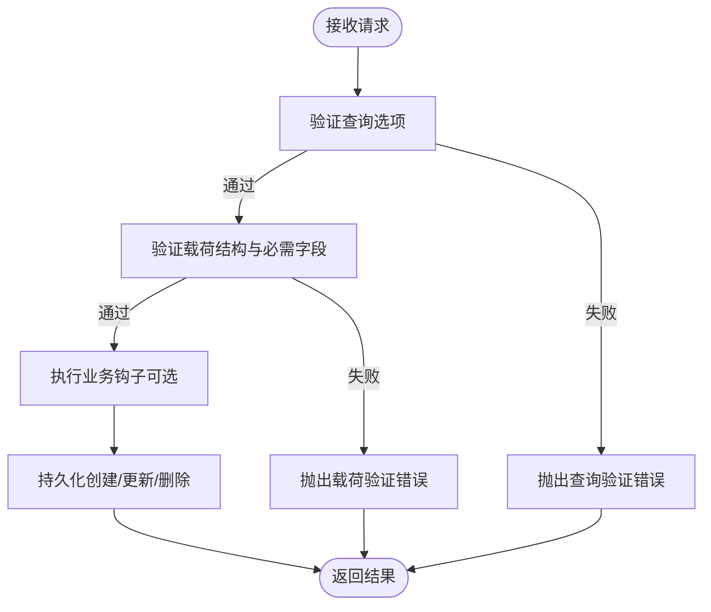
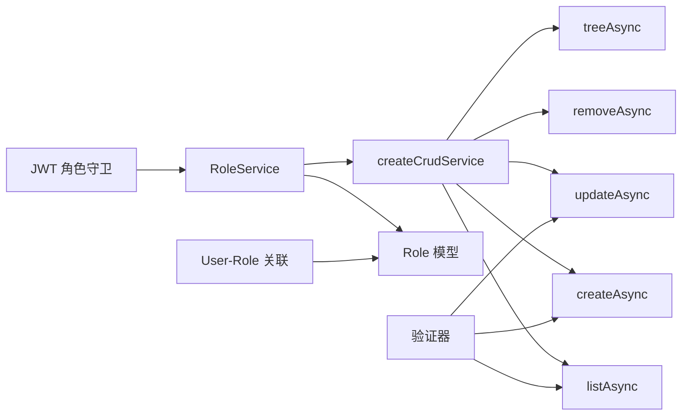

# 角色服务

<cite>
**本文引用的文件**
- [src/services/role.ts](file://src/services/role.ts)
- [src/models/role/index.ts](file://src/models/role/index.ts)
- [src/models/role/types/index.ts](file://src/models/role/types/index.ts)
- [src/models/user/association.ts](file://src/models/user/association.ts)
- [src/repo/base/types/service.ts](file://src/repo/base/types/service.ts)
- [src/repo/base/crud/factory.ts](file://src/repo/base/crud/factory.ts)
- [src/repo/base/crud/list.ts](file://src/repo/base/crud/list.ts)
- [src/repo/base/crud/create.ts](file://src/repo/base/crud/create.ts)
- [src/repo/base/crud/update.ts](file://src/repo/base/crud/update.ts)
- [src/repo/base/crud/remove.ts](file://src/repo/base/crud/remove.ts)
- [src/repo/base/crud/tree.ts](file://src/repo/base/crud/tree.ts)
- [src/repo/base/validation/function/validators.ts](file://src/repo/base/validation/function/validators.ts)
- [src/tools/jwt/guards/role.ts](file://src/tools/jwt/guards/role.ts)
- [src/config/seed/role.json](file://src/config/seed/role.json)
</cite>

## 目录
1. [引言](#引言)
2. [项目结构](#项目结构)
3. [核心组件](#核心组件)
4. [架构总览](#架构总览)
5. [详细组件分析](#详细组件分析)
6. [依赖分析](#依赖分析)
7. [性能考虑](#性能考虑)
8. [故障排查指南](#故障排查指南)
9. [结论](#结论)
10. [附录](#附录)

## 引言
本文件面向 IM-API 的角色服务，系统性阐述角色管理的业务逻辑与技术实现，覆盖角色的创建、修改、删除、查询与树形结构查询；解释角色权限分组与层级结构的设计思路；说明角色与用户的关联关系；梳理权限验证与访问控制的业务规则；给出数据完整性约束与业务验证逻辑；并提供扩展点与自定义权限策略的实现建议。同时，提供 API 使用示例与常见业务场景处理方式。

## 项目结构
角色服务位于服务层与数据层之间，采用“服务层封装 + 通用 CRUD 工厂 + 模型定义”的分层设计：
- 服务层：通过通用 CRUD 工厂创建 RoleService，暴露标准 CRUD 能力，并可注入业务钩子与字段白名单。
- 数据层：Role 模型定义了角色的主键、名称与分组字段；User 与 Role 建立多对一/一对多关联。
- 权限守卫：JWT 角色守卫用于在运行时校验用户角色是否满足访问要求。
- 验证与查询：通用查询构建器与验证器保障查询参数与请求载荷的合法性。

图表来源
- [src/services/role.ts](file://src/services/role.ts#L1-L35)
- [src/repo/base/crud/factory.ts](file://src/repo/base/crud/factory.ts#L25-L66)
- [src/repo/base/types/service.ts](file://src/repo/base/types/service.ts#L22-L128)
- [src/repo/base/crud/list.ts](file://src/repo/base/crud/list.ts#L17-L62)
- [src/repo/base/crud/create.ts](file://src/repo/base/crud/create.ts#L17-L81)
- [src/repo/base/crud/update.ts](file://src/repo/base/crud/update.ts#L17-L66)
- [src/repo/base/crud/remove.ts](file://src/repo/base/crud/remove.ts#L16-L56)
- [src/repo/base/crud/tree.ts](file://src/repo/base/crud/tree.ts#L18-L58)
- [src/models/role/index.ts](file://src/models/role/index.ts#L35-L77)
- [src/models/role/types/index.ts](file://src/models/role/types/index.ts#L11-L66)
- [src/models/user/association.ts](file://src/models/user/association.ts#L9-L23)
- [src/tools/jwt/guards/role.ts](file://src/tools/jwt/guards/role.ts#L13-L31)
- [src/repo/base/validation/function/validators.ts](file://src/repo/base/validation/function/validators.ts#L11-L76)

章节来源
- [src/services/role.ts](file://src/services/role.ts#L1-L35)
- [src/repo/base/crud/factory.ts](file://src/repo/base/crud/factory.ts#L25-L66)
- [src/repo/base/types/service.ts](file://src/repo/base/types/service.ts#L22-L128)
- [src/models/role/index.ts](file://src/models/role/index.ts#L35-L77)
- [src/models/role/types/index.ts](file://src/models/role/types/index.ts#L11-L66)
- [src/models/user/association.ts](file://src/models/user/association.ts#L9-L23)
- [src/tools/jwt/guards/role.ts](file://src/tools/jwt/guards/role.ts#L13-L31)
- [src/repo/base/validation/function/validators.ts](file://src/repo/base/validation/function/validators.ts#L11-L76)

## 核心组件
- 角色服务 RoleService：基于通用 CRUD 工厂创建，提供分页列表、全量列表、详情、搜索、树形查询、创建、更新、删除等能力。
- 角色模型 Role：定义 id、name、group 字段，含唯一性与默认值约束；提供初始化函数。
- 角色类型与枚举：定义 RoleAttributes、RoleGroup 等类型，以及可过滤/可列表字段常量。
- 用户-角色关联：User 与 Role 建立多对一/一对多关系，外键为 roleId。
- JWT 角色守卫：断言用户 JWT 中的 roleId 是否在允许集合内。
- 通用 CRUD 与验证：提供查询选项与载荷的统一验证，确保输入合法。

章节来源
- [src/services/role.ts](file://src/services/role.ts#L18-L34)
- [src/models/role/index.ts](file://src/models/role/index.ts#L20-L77)
- [src/models/role/types/index.ts](file://src/models/role/types/index.ts#L11-L66)
- [src/models/user/association.ts](file://src/models/user/association.ts#L9-L23)
- [src/tools/jwt/guards/role.ts](file://src/tools/jwt/guards/role.ts#L13-L31)
- [src/repo/base/validation/function/validators.ts](file://src/repo/base/validation/function/validators.ts#L11-L76)

## 架构总览
角色服务采用“服务层 + 通用 CRUD 工厂 + 模型层 + 权限守卫”的分层架构。服务层通过配置化的 CRUD 配置，屏蔽底层数据库细节，向上提供统一的 CRUD 能力；模型层负责数据结构与约束；权限守卫在运行时对访问主体进行角色校验。

图表来源
- [src/tools/jwt/guards/role.ts](file://src/tools/jwt/guards/role.ts#L13-L31)
- [src/services/role.ts](file://src/services/role.ts#L18-L34)
- [src/repo/base/crud/factory.ts](file://src/repo/base/crud/factory.ts#L25-L66)
- [src/repo/base/crud/create.ts](file://src/repo/base/crud/create.ts#L17-L81)
- [src/repo/base/crud/list.ts](file://src/repo/base/crud/list.ts#L17-L62)
- [src/models/role/index.ts](file://src/models/role/index.ts#L35-L77)

## 详细组件分析

### 角色模型与类型
- 字段与约束
  - id：主键，字符串，非空。
  - name：字符串，非空且唯一。
  - group：枚举，取值为 system、project、user、admin，默认 user。
- 初始化与索引
  - 提供初始化函数，设置表名、字符集、排序规则、注释及 group 索引。
- 类型与常量
  - RoleAttributes 描述字段；RoleGroup 为枚举；ROLE_LIST/ROLE_FILTERABLE 定义可列表与可过滤字段。

图表来源
- [src/models/role/index.ts](file://src/models/role/index.ts#L20-L77)
- [src/models/role/types/index.ts](file://src/models/role/types/index.ts#L11-L66)

章节来源
- [src/models/role/index.ts](file://src/models/role/index.ts#L35-L77)
- [src/models/role/types/index.ts](file://src/models/role/types/index.ts#L11-L66)

### 角色服务与 CRUD 配置
- 配置项
  - listFields/detailFields：列表/详情返回字段集合。
  - creatableFields/updatableFields：创建/更新字段白名单。
  - searchFields/filterableFields：搜索与过滤字段。
  - defaultOrder：默认排序。
- 服务能力
  - list、all、search、tree：查询类能力。
  - create、update、remove：写入类能力。
  - allPaginated：全量分页浏览。

图表来源
- [src/services/role.ts](file://src/services/role.ts#L18-L34)
- [src/repo/base/crud/factory.ts](file://src/repo/base/crud/factory.ts#L25-L66)
- [src/repo/base/crud/list.ts](file://src/repo/base/crud/list.ts#L17-L62)
- [src/repo/base/crud/create.ts](file://src/repo/base/crud/create.ts#L17-L81)
- [src/repo/base/crud/update.ts](file://src/repo/base/crud/update.ts#L17-L66)
- [src/repo/base/crud/remove.ts](file://src/repo/base/crud/remove.ts#L16-L56)
- [src/repo/base/crud/tree.ts](file://src/repo/base/crud/tree.ts#L18-L58)

章节来源
- [src/services/role.ts](file://src/services/role.ts#L18-L34)
- [src/repo/base/types/service.ts](file://src/repo/base/types/service.ts#L22-L128)
- [src/repo/base/crud/factory.ts](file://src/repo/base/crud/factory.ts#L25-L66)

### 角色与用户的关联关系
- 关系定义
  - User.belongsTo(Role, 外键 roleId，RESTRICT 删除策略，CASCADE 更新策略）。
  - Role.hasMany(User, 外键 roleId，RESTRICT 删除策略，CASCADE 更新策略）。
- 影响
  - 删除角色前需清理用户绑定或保证无用户关联；更新角色 ID 会级联更新用户记录。

图表来源
- [src/models/user/association.ts](file://src/models/user/association.ts#L9-L23)
- [src/models/role/index.ts](file://src/models/role/index.ts#L35-L77)

章节来源
- [src/models/user/association.ts](file://src/models/user/association.ts#L9-L23)

### 权限验证与访问控制
- 运行时校验
  - JWT 角色守卫根据 payload.roleId 与允许集合进行断言，不匹配则抛出禁止错误。
- 访问控制建议
  - 在路由或控制器层引入角色守卫，限定资源访问范围。
  - 结合 Scope 或更细粒度的权限位，形成“角色 + 权限位”的复合授权模型。

图表来源
- [src/tools/jwt/guards/role.ts](file://src/tools/jwt/guards/role.ts#L13-L31)

章节来源
- [src/tools/jwt/guards/role.ts](file://src/tools/jwt/guards/role.ts#L13-L31)

### 数据完整性约束与业务验证
- 数据库层面
  - id 主键、name 唯一、group 枚举与默认值、group 索引。
- 输入验证
  - 查询选项验证：页码、每页数量、搜索词、过滤条件、排序格式。
  - 载荷验证：对象结构、必需字段存在性。
- 业务钩子
  - 可在 CRUD 配置中注入 validateCreate/validateUpdate/beforeCreate/beforeUpdate，实现业务规则与默认值填充。

图表来源
- [src/repo/base/validation/function/validators.ts](file://src/repo/base/validation/function/validators.ts#L11-L76)
- [src/repo/base/crud/create.ts](file://src/repo/base/crud/create.ts#L37-L52)
- [src/repo/base/crud/update.ts](file://src/repo/base/crud/update.ts#L38-L53)

章节来源
- [src/repo/base/validation/function/validators.ts](file://src/repo/base/validation/function/validators.ts#L11-L76)
- [src/repo/base/crud/create.ts](file://src/repo/base/crud/create.ts#L37-L52)
- [src/repo/base/crud/update.ts](file://src/repo/base/crud/update.ts#L38-L53)

### 角色权限的继承关系与层级结构
- 分组设计
  - group 枚举包含 system、project、user、admin 四类，用于标识角色所属系统模块。
- 层级结构
  - 代码未内置父子层级字段（如 pid/sort），树形查询依赖外部传入的 treeConfig；当前实现通过通用 treeAsync 支持树形构建。
- 建议
  - 若需显式层级，可在模型中增加 parentId/sort 字段，并在 treeConfig 中配置；或在业务层维护角色继承映射。

章节来源
- [src/models/role/types/index.ts](file://src/models/role/types/index.ts#L11-L20)
- [src/repo/base/crud/tree.ts](file://src/repo/base/crud/tree.ts#L18-L58)

### 角色管理的 API 使用示例与常见场景
- 创建角色
  - 调用 create，传入 id、name、group；服务端执行载荷验证与字段白名单过滤后持久化。
- 修改角色
  - 调用 update，按 id 更新；支持业务钩子与字段白名单过滤。
- 删除角色
  - 调用 remove，按 id 删除；若存在用户关联，数据库约束将阻止删除。
- 查询角色
  - list：分页列表，支持过滤、排序、搜索。
  - all：全量列表。
  - search：按关键字搜索。
  - tree：树形结构查询（需配置 treeConfig）。
- 常见场景
  - 新建管理员角色：group=“admin”，name 为中文描述，id 为英文标识。
  - 批量导入：参考种子文件结构，批量插入角色数据。
  - 角色切换：更新用户 roleId 后，级联更新用户记录。

章节来源
- [src/services/role.ts](file://src/services/role.ts#L18-L34)
- [src/repo/base/crud/list.ts](file://src/repo/base/crud/list.ts#L17-L62)
- [src/repo/base/crud/create.ts](file://src/repo/base/crud/create.ts#L17-L81)
- [src/repo/base/crud/update.ts](file://src/repo/base/crud/update.ts#L17-L66)
- [src/repo/base/crud/remove.ts](file://src/repo/base/crud/remove.ts#L16-L56)
- [src/config/seed/role.json](file://src/config/seed/role.json#L1-L28)

## 依赖分析
- 服务层依赖
  - RoleService 依赖 createCrudService 与 Role 模型配置。
- CRUD 依赖
  - CRUD 工厂聚合 list、create、update、remove、tree 等方法；查询选项由 QueryOptionsBuilder 统一构建。
- 模型依赖
  - Role 模型定义字段与约束；User-Role 关联定义外键与约束。
- 权限依赖
  - JWT 角色守卫依赖 JwtUserPayload 与认证错误类型。

图表来源
- [src/services/role.ts](file://src/services/role.ts#L18-L34)
- [src/repo/base/crud/factory.ts](file://src/repo/base/crud/factory.ts#L25-L66)
- [src/repo/base/crud/list.ts](file://src/repo/base/crud/list.ts#L17-L62)
- [src/repo/base/crud/create.ts](file://src/repo/base/crud/create.ts#L17-L81)
- [src/repo/base/crud/update.ts](file://src/repo/base/crud/update.ts#L17-L66)
- [src/repo/base/crud/remove.ts](file://src/repo/base/crud/remove.ts#L16-L56)
- [src/repo/base/crud/tree.ts](file://src/repo/base/crud/tree.ts#L18-L58)
- [src/models/role/index.ts](file://src/models/role/index.ts#L35-L77)
- [src/models/user/association.ts](file://src/models/user/association.ts#L9-L23)
- [src/tools/jwt/guards/role.ts](file://src/tools/jwt/guards/role.ts#L13-L31)
- [src/repo/base/validation/function/validators.ts](file://src/repo/base/validation/function/validators.ts#L11-L76)

章节来源
- [src/services/role.ts](file://src/services/role.ts#L18-L34)
- [src/repo/base/crud/factory.ts](file://src/repo/base/crud/factory.ts#L25-L66)
- [src/models/role/index.ts](file://src/models/role/index.ts#L35-L77)
- [src/models/user/association.ts](file://src/models/user/association.ts#L9-L23)
- [src/tools/jwt/guards/role.ts](file://src/tools/jwt/guards/role.ts#L13-L31)
- [src/repo/base/validation/function/validators.ts](file://src/repo/base/validation/function/validators.ts#L11-L76)

## 性能考虑
- 查询优化
  - 为 group 建立索引，提升按分组过滤的查询效率。
  - 使用分页与默认排序，避免全表扫描。
- 写入优化
  - 字段白名单过滤减少无效写入；事务包裹批量写入以保证一致性。
- 树形查询
  - 树形构建依赖全字段查询，注意在 treeAsync 中移除字段限制并合理使用 include/scope。

章节来源
- [src/models/role/index.ts](file://src/models/role/index.ts#L70-L72)
- [src/repo/base/crud/tree.ts](file://src/repo/base/crud/tree.ts#L40-L56)

## 故障排查指南
- 403 禁止访问
  - 检查 JWT 中 roleId 是否在允许集合；确认守卫调用链正确。
- 404 资源不存在
  - 删除或更新时传入的 id 无效；检查 id 格式与存在性。
- 参数非法
  - 查询选项或载荷不符合验证规则；核对页码、每页数量、过滤条件与必需字段。
- 外键约束冲突
  - 删除角色时报错；检查是否存在用户关联，必要时先迁移或清空用户角色。

章节来源
- [src/tools/jwt/guards/role.ts](file://src/tools/jwt/guards/role.ts#L25-L30)
- [src/repo/base/crud/remove.ts](file://src/repo/base/crud/remove.ts#L36-L47)
- [src/repo/base/validation/function/validators.ts](file://src/repo/base/validation/function/validators.ts#L11-L76)
- [src/models/user/association.ts](file://src/models/user/association.ts#L10-L22)

## 结论
角色服务通过通用 CRUD 工厂与清晰的模型定义，提供了稳定的角色管理能力；配合 JWT 角色守卫与输入验证，实现了基本的权限控制与数据完整性保障。对于更复杂的权限继承与树形层级，建议在模型层补充层级字段并在业务层维护继承映射，以满足更丰富的权限场景。

## 附录
- 扩展点与自定义权限策略
  - 在 CRUD 配置中注入 validateCreate/validateUpdate/beforeCreate/beforeUpdate 钩子，实现业务规则与默认值填充。
  - 引入更细粒度的权限位与 Scope，结合角色守卫形成“角色 + 权限位”的复合授权模型。
- 种子数据
  - 参考角色种子文件，快速导入初始角色数据。

章节来源
- [src/services/role.ts](file://src/services/role.ts#L18-L34)
- [src/config/seed/role.json](file://src/config/seed/role.json#L1-L28)