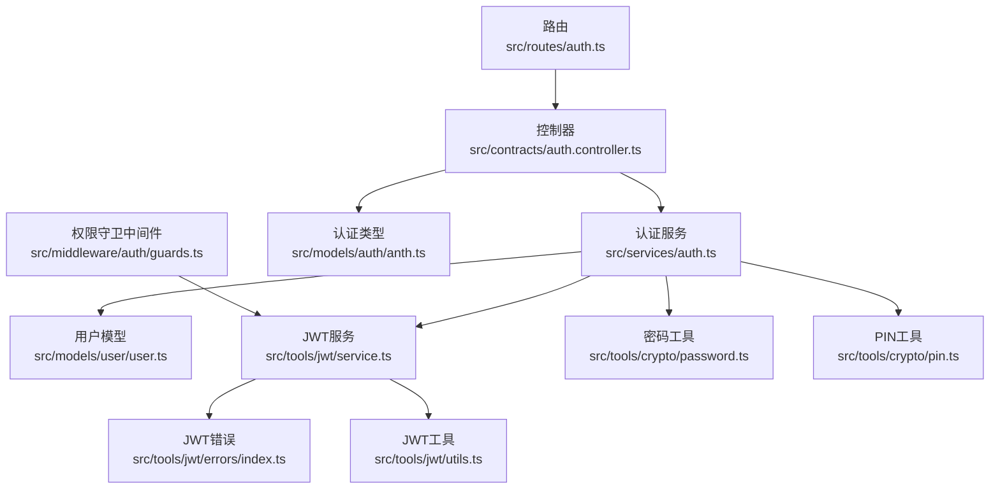
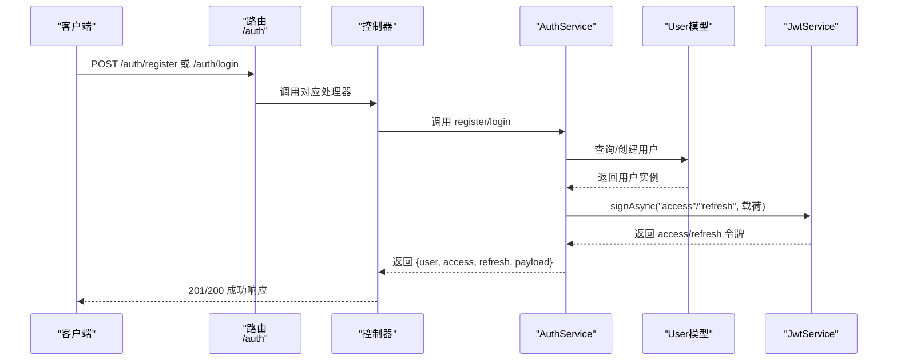
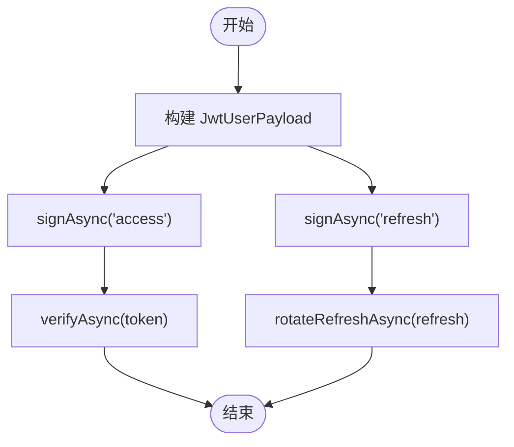
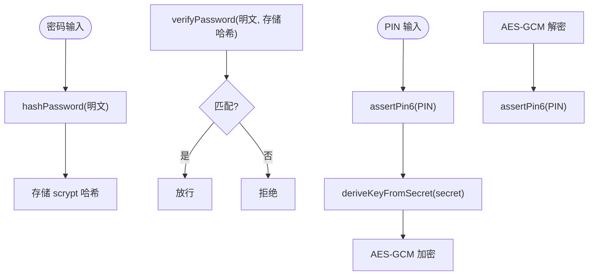
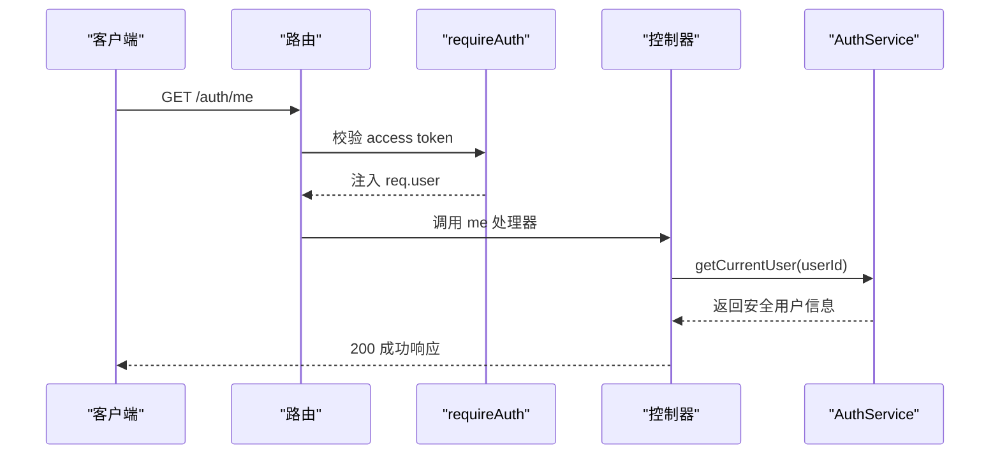
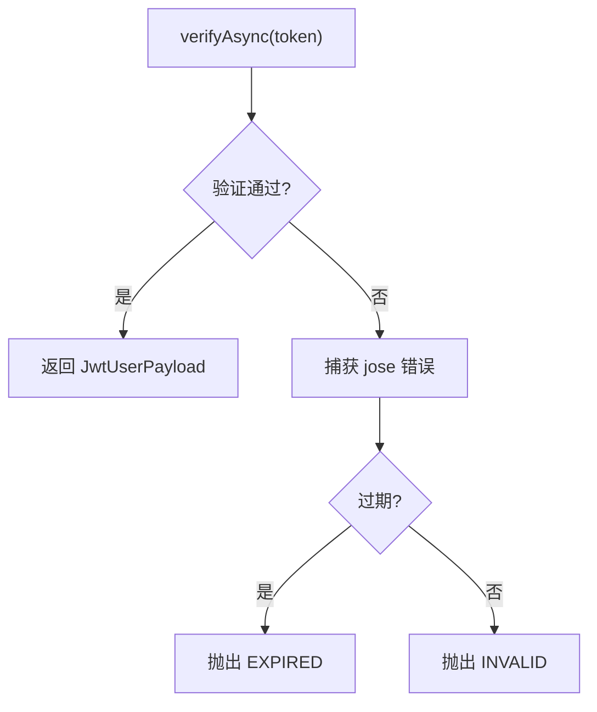
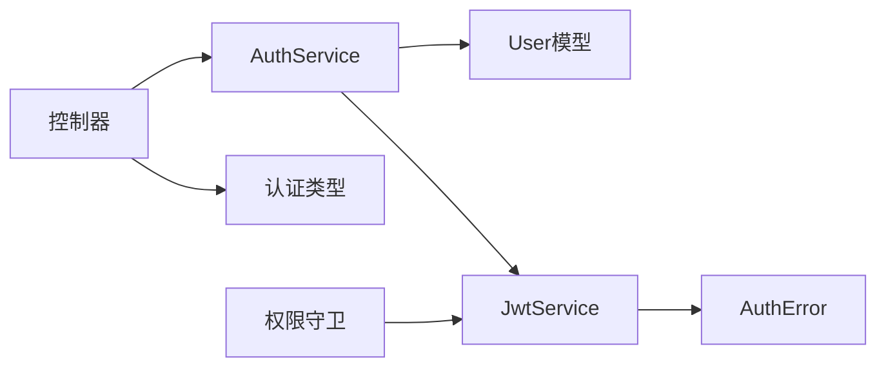

# 认证服务

<cite>
**本文引用的文件**
- [src/services/auth.ts](file://src/services/auth.ts)
- [src/models/auth/anth.ts](file://src/models/auth/anth.ts)
- [src/models/user/user.ts](file://src/models/user/user.ts)
- [src/tools/crypto/password.ts](file://src/tools/crypto/password.ts)
- [src/tools/crypto/pin.ts](file://src/tools/crypto/pin.ts)
- [src/tools/jwt/service.ts](file://src/tools/jwt/service.ts)
- [src/tools/jwt/errors/index.ts](file://src/tools/jwt/errors/index.ts)
- [src/tools/jwt/utils.ts](file://src/tools/jwt/utils.ts)
- [src/contracts/auth.controller.ts](file://src/contracts/auth.controller.ts)
- [src/routes/auth.ts](file://src/routes/auth.ts)
- [src/middleware/auth/guards.ts](file://src/middleware/auth/guards.ts)
- [src/config/env/index.ts](file://src/config/env/index.ts)
</cite>

## 目录
1. [简介](#简介)
2. [项目结构](#项目结构)
3. [核心组件](#核心组件)
4. [架构总览](#架构总览)
5. [组件详解](#组件详解)
6. [依赖关系分析](#依赖关系分析)
7. [性能考量](#性能考量)
8. [故障排查指南](#故障排查指南)
9. [结论](#结论)
10. [附录](#附录)

## 简介
本文件面向 IM-API 的认证服务，系统性阐述 AuthService 类的设计与实现，覆盖用户注册、登录、退出、获取当前用户信息等核心业务逻辑，并深入解析 JWT 令牌的签发与管理机制（含 access token 与 refresh token 的生成策略）、错误处理与异常场景、密码加密与 PIN 码验证等安全机制。同时提供控制器调用模式、性能优化建议与安全最佳实践，帮助开发者快速理解与安全地集成认证能力。

## 项目结构
认证相关模块按“路由 -> 控制器 -> 服务 -> 工具/模型”的分层组织，职责清晰：
- 路由层：定义 /auth/* 接口，暴露注册、登录、退出、获取当前用户等端点。
- 控制器层：封装请求校验、调用服务层并返回标准化响应。
- 服务层：实现业务逻辑（注册/登录/退出/查询），负责令牌签发与载荷构建。
- 工具层：提供密码 scrypt 哈希、PIN AES-GCM 加解密、JWT 签发/校验/刷新等通用能力。
- 模型层：用户模型与认证相关类型定义，含密码/二级密码字段与钩子。



图表来源
- [src/routes/auth.ts](file://src/routes/auth.ts#L1-L47)
- [src/contracts/auth.controller.ts](file://src/contracts/auth.controller.ts#L1-L111)
- [src/services/auth.ts](file://src/services/auth.ts#L1-L170)
- [src/models/user/user.ts](file://src/models/user/user.ts#L1-L275)
- [src/tools/jwt/service.ts](file://src/tools/jwt/service.ts#L1-L98)
- [src/tools/crypto/password.ts](file://src/tools/crypto/password.ts#L1-L111)
- [src/tools/crypto/pin.ts](file://src/tools/crypto/pin.ts#L1-L77)
- [src/tools/jwt/errors/index.ts](file://src/tools/jwt/errors/index.ts#L1-L288)
- [src/tools/jwt/utils.ts](file://src/tools/jwt/utils.ts#L1-L67)
- [src/models/auth/anth.ts](file://src/models/auth/anth.ts#L1-L108)
- [src/middleware/auth/guards.ts](file://src/middleware/auth/guards.ts#L1-L195)

章节来源
- [src/routes/auth.ts](file://src/routes/auth.ts#L1-L47)
- [src/contracts/auth.controller.ts](file://src/contracts/auth.controller.ts#L1-L111)
- [src/services/auth.ts](file://src/services/auth.ts#L1-L170)

## 核心组件
- 认证服务 AuthService：提供 register、login、getCurrentUser、logout 四大方法，负责业务流程编排与令牌签发。
- 用户模型 User：定义用户属性、认证静态方法、密码钩子与安全序列化。
- JWT 服务 JwtService：封装签发、验证、刷新轮转等 JWT 生命周期管理。
- 密码与 PIN 工具：提供 scrypt 哈希与 AES-GCM 加解密，保障密码与 PIN 的安全性。
- 控制器与路由：对外暴露 RESTful 接口，完成输入校验与响应包装。
- 权限守卫中间件：基于 req.user 进行角色、作用域、VIP、团队、Token 类型等校验。

章节来源
- [src/services/auth.ts](file://src/services/auth.ts#L82-L167)
- [src/models/user/user.ts](file://src/models/user/user.ts#L29-L101)
- [src/tools/jwt/service.ts](file://src/tools/jwt/service.ts#L27-L97)
- [src/tools/crypto/password.ts](file://src/tools/crypto/password.ts#L39-L110)
- [src/tools/crypto/pin.ts](file://src/tools/crypto/pin.ts#L49-L76)
- [src/contracts/auth.controller.ts](file://src/contracts/auth.controller.ts#L20-L110)
- [src/middleware/auth/guards.ts](file://src/middleware/auth/guards.ts#L17-L194)

## 架构总览
认证流程采用“无状态 JWT + 服务端令牌签发”的设计。用户通过控制器提交注册/登录请求，服务层完成业务校验与数据库交互，随后使用 JWT 服务签发 access 与 refresh 令牌，返回给客户端。客户端在后续受保护请求中携带 access token，服务端通过守卫中间件解析并校验 token，注入用户上下文。



图表来源
- [src/routes/auth.ts](file://src/routes/auth.ts#L18-L44)
- [src/contracts/auth.controller.ts](file://src/contracts/auth.controller.ts#L25-L74)
- [src/services/auth.ts](file://src/services/auth.ts#L94-L134)
- [src/models/user/user.ts](file://src/models/user/user.ts#L69-L89)
- [src/tools/jwt/service.ts](file://src/tools/jwt/service.ts#L41-L56)

## 组件详解

### AuthService 类设计与实现
- 单例 JWT 服务：通过惰性初始化与缓存，避免重复创建。
- 令牌签发 issueTokens：构建 JwtUserPayload，分别签发 access 与 refresh 令牌，构造返回数据（包含安全用户信息、令牌与载荷）。
- register：校验手机号唯一性，创建用户（密码与 PIN 由模型钩子与工具处理），随后签发令牌。
- login：通过 User.authenticate 校验凭据，成功后签发令牌。
- getCurrentUser：根据用户 ID 查询并返回安全用户信息。
- logout：当前为无状态实现，无需服务端注销；如需黑名单可在服务层扩展。

```mermaid
classDiagram
class AuthService {
+register(data) Promise~AuthSuccessData~
+login(data) Promise~AuthSuccessData~
+getCurrentUser(userId) Promise~SafeUser~
+logout() Promise~void~
}
class JwtService {
+signAsync(kind, payload) Promise~string~
+verifyAsync(token) Promise~JwtUserPayload~
+rotateRefreshAsync(refresh, mutate?) Promise~{access, refresh, payload}~
}
class User {
+authenticate(phone, plain) Promise~User~
+verifyPassword(plain) Promise~boolean~
+toJSON() SafeUser
}
AuthService --> JwtService : "签发令牌"
AuthService --> User : "查询/创建"
```

图表来源
- [src/services/auth.ts](file://src/services/auth.ts#L24-L167)
- [src/tools/jwt/service.ts](file://src/tools/jwt/service.ts#L27-L97)
- [src/models/user/user.ts](file://src/models/user/user.ts#L69-L100)

章节来源
- [src/services/auth.ts](file://src/services/auth.ts#L24-L167)

### JWT 令牌签发与管理
- 签发策略：signAsync 自动设置 iat、jti、tokenType，并根据配置选择算法与密钥。当前实现不设置 exp，令牌长期有效。
- 验证策略：verifyAsync 校验签名与算法，捕获过期与无效错误并映射为 AuthError。
- 刷新轮转：rotateRefreshAsync 校验 refresh token 的 tokenType，生成新的 access 与 refresh 令牌（刷新时 jti 重置）。
- 令牌类型：tokenType 在签发时写入 payload，守卫中间件可据此进行类型校验。



图表来源
- [src/tools/jwt/service.ts](file://src/tools/jwt/service.ts#L41-L96)
- [src/tools/jwt/utils.ts](file://src/tools/jwt/utils.ts#L40-L66)

章节来源
- [src/tools/jwt/service.ts](file://src/tools/jwt/service.ts#L27-L97)
- [src/tools/jwt/errors/index.ts](file://src/tools/jwt/errors/index.ts#L46-L63)

### 密码加密与 PIN 验证
- 密码哈希：使用 scrypt，参数固定，结合环境变量 PASSWORD_PEPPER 提升抗彩虹表能力；提供 verifyPassword 与 verifyPasswordUpgrade 支持校验与升级。
- PIN 加解密：使用 AES-256-GCM，从 secret 派生对称密钥，PIN 固定 6 位纯数字；提供断言与派生工具函数。
- 用户模型钩子：beforeSave 自动对明文密码进行 scrypt 哈希；安全序列化剔除敏感字段。



图表来源
- [src/tools/crypto/password.ts](file://src/tools/crypto/password.ts#L39-L110)
- [src/tools/crypto/pin.ts](file://src/tools/crypto/pin.ts#L49-L76)
- [src/models/user/user.ts](file://src/models/user/user.ts#L256-L274)

章节来源
- [src/tools/crypto/password.ts](file://src/tools/crypto/password.ts#L39-L110)
- [src/tools/crypto/pin.ts](file://src/tools/crypto/pin.ts#L15-L76)
- [src/models/user/user.ts](file://src/models/user/user.ts#L256-L274)

### 认证控制器与路由
- 路由：/auth/register、/auth/login、/auth/logout、/auth/me，分别对应注册、登录、退出、获取当前用户。
- 控制器：对请求体进行基础校验（手机号、PIN 格式等），调用 AuthService 执行业务逻辑，使用响应包装返回统一结构。
- 受保护接口：requireAuth 中间件确保请求携带有效 access token，注入用户上下文。



图表来源
- [src/routes/auth.ts](file://src/routes/auth.ts#L39-L44)
- [src/middleware/auth/guards.ts](file://src/middleware/auth/guards.ts#L17-L51)
- [src/contracts/auth.controller.ts](file://src/contracts/auth.controller.ts#L95-L110)
- [src/services/auth.ts](file://src/services/auth.ts#L143-L153)

章节来源
- [src/routes/auth.ts](file://src/routes/auth.ts#L1-L47)
- [src/contracts/auth.controller.ts](file://src/contracts/auth.controller.ts#L20-L110)
- [src/middleware/auth/guards.ts](file://src/middleware/auth/guards.ts#L17-L194)

### 错误处理与异常情况
- 统一错误模型：AuthError 提供多种错误码（缺失令牌、格式错误、无效令牌、过期、禁止、设备不匹配、撤销、不支持算法、业务错误、验证错误等），并支持 toLogEntry 与 toJSON 序列化。
- 令牌验证异常：verifyAsync 捕获 jose 抛出的过期/无效错误并映射为 AuthError。
- 业务异常：注册手机号冲突、登录凭据错误、用户不存在等均以带状态码的错误对象抛出，控制器统一包装响应。



图表来源
- [src/tools/jwt/service.ts](file://src/tools/jwt/service.ts#L66-L75)
- [src/tools/jwt/errors/index.ts](file://src/tools/jwt/errors/index.ts#L46-L63)

章节来源
- [src/tools/jwt/errors/index.ts](file://src/tools/jwt/errors/index.ts#L75-L141)
- [src/tools/jwt/service.ts](file://src/tools/jwt/service.ts#L66-L75)
- [src/services/auth.ts](file://src/services/auth.ts#L102-L106)

### 使用模式与最佳实践
- 控制器调用：在处理器中先进行输入校验，再调用 AuthService 方法；使用响应包装（created/ok/badRequest/unauthorized）返回统一结构。
- 守卫使用：对受保护路由应用 requireAuth；如需细粒度控制，可叠加 requireRole、requireScopes、requireVip、requireTeam、requireTokenKind。
- 令牌管理：客户端应安全存储 access/refresh 令牌；access 长期有效但无过期时间，refresh 用于轮转；退出时客户端删除令牌即可（当前为无状态）。
- 安全建议：严格配置环境变量（JWT_SECRET/PASSWORD_PEPPER/PIN_SECRET），定期轮换密钥；对高风险操作（如修改 PIN）增加二次验证。

章节来源
- [src/contracts/auth.controller.ts](file://src/contracts/auth.controller.ts#L25-L110)
- [src/middleware/auth/guards.ts](file://src/middleware/auth/guards.ts#L168-L194)
- [src/config/env/index.ts](file://src/config/env/index.ts#L173-L175)

## 依赖关系分析
- 低耦合高内聚：服务层仅依赖模型与工具层，不直接依赖路由/控制器，便于测试与复用。
- 关键依赖链：
  - AuthService 依赖 User、JwtService、认证类型与工具。
  - JwtService 依赖密钥提供器与安全配置，输出标准化令牌。
  - 控制器依赖服务层与响应包装，路由依赖控制器。
  - 守卫中间件依赖 JwtService 与类型定义。



图表来源
- [src/contracts/auth.controller.ts](file://src/contracts/auth.controller.ts#L14-L18)
- [src/services/auth.ts](file://src/services/auth.ts#L13-L22)
- [src/tools/jwt/service.ts](file://src/tools/jwt/service.ts#L15-L20)
- [src/middleware/auth/guards.ts](file://src/middleware/auth/guards.ts#L12-L15)

章节来源
- [src/contracts/auth.controller.ts](file://src/contracts/auth.controller.ts#L14-L18)
- [src/services/auth.ts](file://src/services/auth.ts#L13-L22)
- [src/tools/jwt/service.ts](file://src/tools/jwt/service.ts#L15-L20)
- [src/middleware/auth/guards.ts](file://src/middleware/auth/guards.ts#L12-L15)

## 性能考量
- 密码哈希成本：scrypt 参数固定，兼顾安全性与性能；建议在生产环境监控 CPU 与延迟，必要时调整参数或使用更高效的硬件。
- JWT 签发：无 exp 的长期有效令牌减少过期校验开销；若未来引入短期 access + 长期 refresh，可降低频繁签发频率。
- 数据库访问：User.authenticate 使用带 secret 的 scope 查询，避免不必要的字段读取；索引覆盖 phone、roleId、state、lastOnlineAt 等常用查询字段。
- 中间件与守卫：守卫仅做轻量校验与断言，避免在其中执行重逻辑；将复杂业务下沉至服务层。
- 缓存与限流：结合速率限制中间件与外部缓存（如 Redis）进一步提升吞吐。

[本节为通用性能建议，不直接分析具体文件]

## 故障排查指南
- 令牌无效/过期：检查 verifyAsync 抛出的 AuthError，确认算法与密钥配置一致，以及客户端是否正确传递 access token。
- 用户不存在/密码错误：确认 User.authenticate 的查询条件与索引，检查 beforeSave 是否正确对密码进行 scrypt 哈希。
- 注册失败（手机号已存在）：确认唯一约束与手机号格式校验；查看服务层抛出的错误状态码。
- PIN 校验失败：确认 PIN 为 6 位纯数字，secret 长度满足要求，AES-GCM 加解密过程无异常。
- 守卫失败：检查 requireAuth 是否正确注入 req.user，以及守卫断言（角色/作用域/VIP/团队/Token 类型）是否匹配。

章节来源
- [src/tools/jwt/errors/index.ts](file://src/tools/jwt/errors/index.ts#L46-L63)
- [src/tools/jwt/service.ts](file://src/tools/jwt/service.ts#L66-L75)
- [src/models/user/user.ts](file://src/models/user/user.ts#L69-L89)
- [src/services/auth.ts](file://src/services/auth.ts#L102-L106)
- [src/tools/crypto/pin.ts](file://src/tools/crypto/pin.ts#L67-L76)
- [src/middleware/auth/guards.ts](file://src/middleware/auth/guards.ts#L26-L50)

## 结论
AuthService 以“无状态 JWT + 服务端令牌签发”为核心，结合 scrypt 密码哈希与 AES-GCM PIN 加密，构建了安全、可扩展的认证体系。通过清晰的分层与统一的错误模型，既保证了开发效率，也提升了系统的可观测性与可维护性。建议在生产环境中强化密钥管理、引入短期 access 令牌与黑名单机制，并持续监控与优化性能。

[本节为总结性内容，不直接分析具体文件]

## 附录
- 环境变量关键项：JWT_SECRET、PIN_SECRET、PASSWORD_PEPPER，用于 JWT 密钥、PIN 加密与密码加盐。
- 认证类型：RegisterRequest/LoginRequest/SafeUser/AuthSuccessData 等，用于 DTO 层与服务层的数据契约。

章节来源
- [src/config/env/index.ts](file://src/config/env/index.ts#L173-L175)
- [src/models/auth/anth.ts](file://src/models/auth/anth.ts#L16-L107)