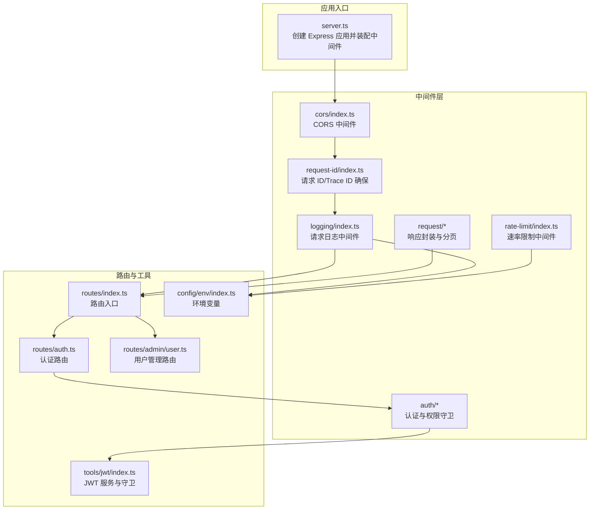
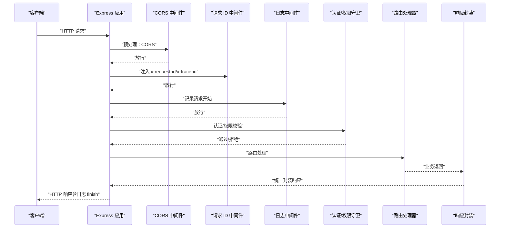
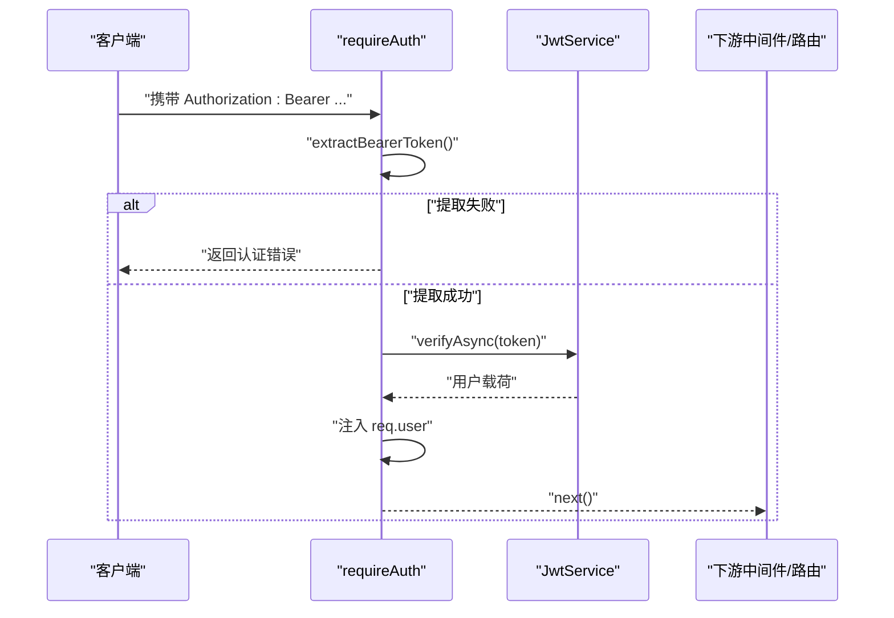
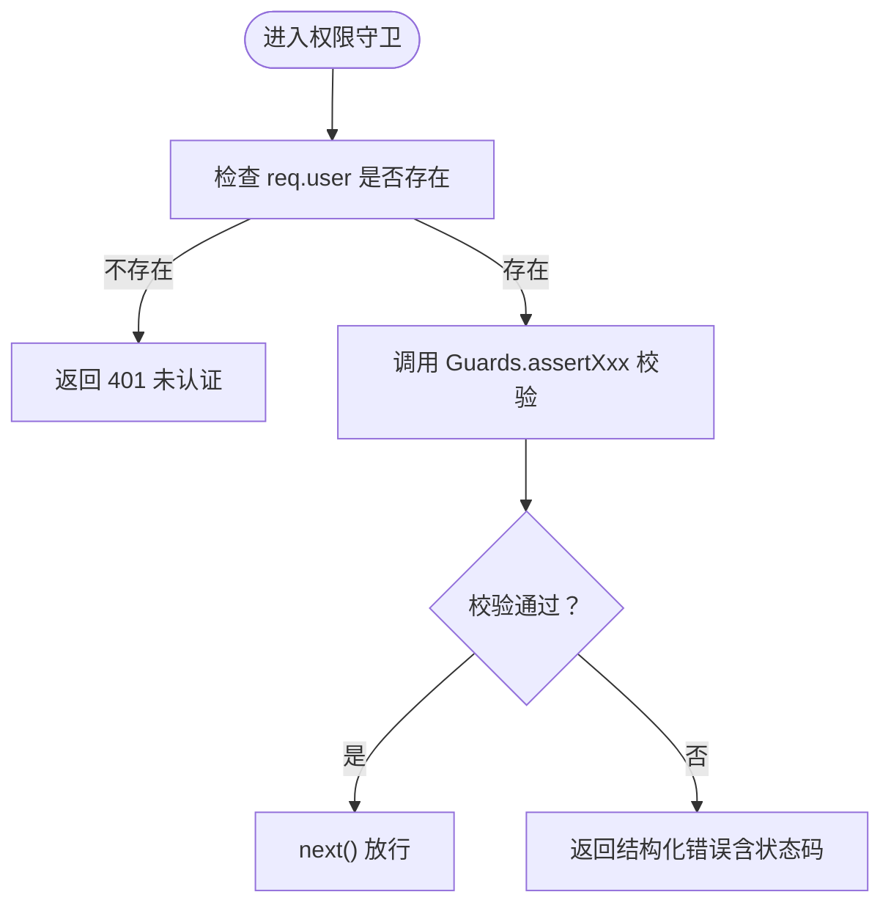
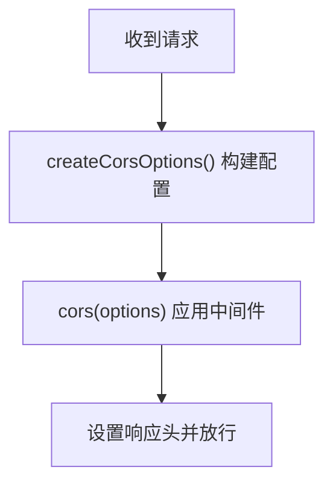
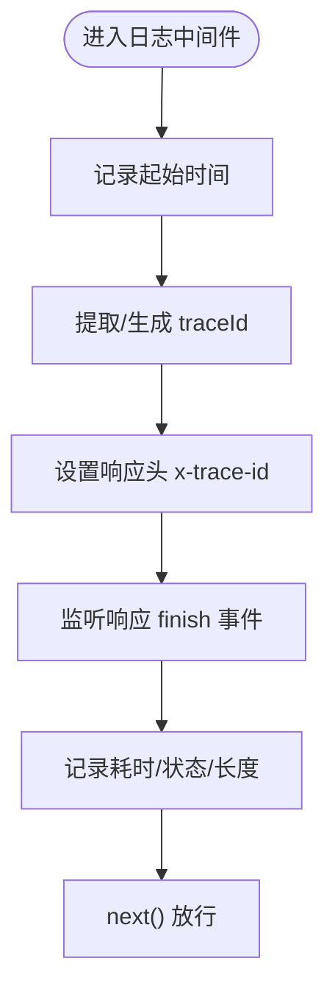
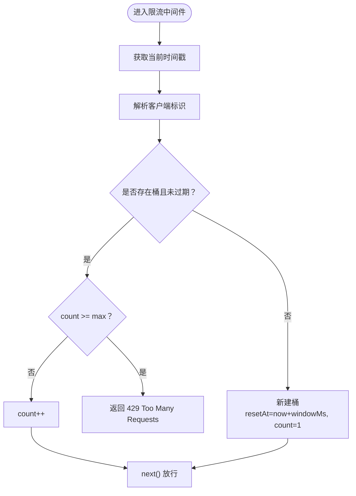
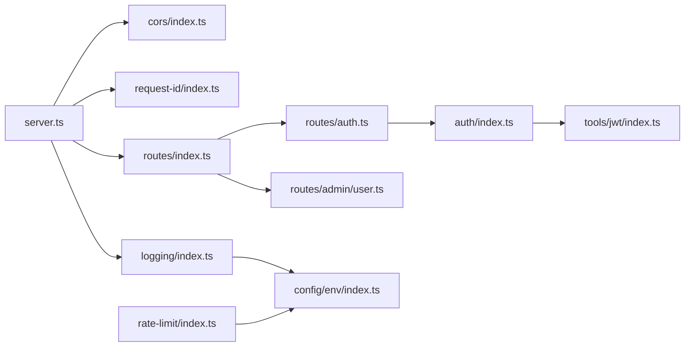

# 中间件系统

<cite>
**本文引用的文件**
- [src/server.ts](file://src/server.ts)
- [src/middleware/cors/index.ts](file://src/middleware/cors/index.ts)
- [src/middleware/request-id/index.ts](file://src/middleware/request-id/index.ts)
- [src/middleware/logging/index.ts](file://src/middleware/logging/index.ts)
- [src/middleware/rate-limit/index.ts](file://src/middleware/rate-limit/index.ts)
- [src/middleware/auth/index.ts](file://src/middleware/auth/index.ts)
- [src/middleware/auth/require.ts](file://src/middleware/auth/require.ts)
- [src/middleware/auth/guards.ts](file://src/middleware/auth/guards.ts)
- [src/middleware/auth/types.ts](file://src/middleware/auth/types.ts)
- [src/middleware/request/index.ts](file://src/middleware/request/index.ts)
- [src/middleware/request/pagination.ts](file://src/middleware/request/pagination.ts)
- [src/config/env/index.ts](file://src/config/env/index.ts)
- [src/tools/jwt/index.ts](file://src/tools/jwt/index.ts)
- [src/routes/index.ts](file://src/routes/index.ts)
- [src/routes/auth.ts](file://src/routes/auth.ts)
- [src/routes/admin/user.ts](file://src/routes/admin/user.ts)
</cite>

## 目录
1. [简介](#简介)
2. [项目结构](#项目结构)
3. [核心组件](#核心组件)
4. [架构总览](#架构总览)
5. [详细组件分析](#详细组件分析)
6. [依赖关系分析](#依赖关系分析)
7. [性能考量](#性能考量)
8. [故障排除指南](#故障排除指南)
9. [结论](#结论)
10. [附录](#附录)

## 简介
本文件面向 IM-API 的中间件系统，系统性阐述 Express.js 中间件的工作原理与链式调用机制，重点覆盖以下中间件：
- 认证中间件：基于 Bearer Token 的 JWT 验证与用户载荷注入
- CORS 中间件：跨域策略与请求头透传
- 日志中间件：基于 traceId 的请求日志与耗时统计
- 速率限制中间件：按 IP 的内存级固定窗口限流
- 请求响应封装与分页工具：统一响应结构与分页 DTO
- 请求 ID/Trace ID 确保：保证每个请求具备可追踪的标识

文档同时给出配置项说明、自定义扩展方法、最佳实践、性能优化建议、使用示例与故障排除。

## 项目结构
中间件相关代码集中于 src/middleware 目录，配合 src/config、src/tools、src/routes 与 src/server.ts 使用。核心启动流程在 server.ts 中完成中间件装配与路由挂载。

**图表来源**
- [src/server.ts](file://src/server.ts#L27-L48)
- [src/middleware/cors/index.ts](file://src/middleware/cors/index.ts#L36-L38)
- [src/middleware/request-id/index.ts](file://src/middleware/request-id/index.ts#L50-L61)
- [src/middleware/logging/index.ts](file://src/middleware/logging/index.ts#L34-L57)
- [src/middleware/rate-limit/index.ts](file://src/middleware/rate-limit/index.ts#L43-L69)
- [src/middleware/auth/index.ts](file://src/middleware/auth/index.ts#L16-L32)
- [src/middleware/request/index.ts](file://src/middleware/request/index.ts#L185-L331)
- [src/config/env/index.ts](file://src/config/env/index.ts#L166-L220)
- [src/tools/jwt/index.ts](file://src/tools/jwt/index.ts#L80-L106)
- [src/routes/index.ts](file://src/routes/index.ts#L12-L21)
- [src/routes/auth.ts](file://src/routes/auth.ts#L12-L46)
- [src/routes/admin/user.ts](file://src/routes/admin/user.ts#L12-L39)

**章节来源**
- [src/server.ts](file://src/server.ts#L27-L48)
- [src/routes/index.ts](file://src/routes/index.ts#L12-L21)

## 核心组件
- 认证中间件 requireAuth：从 Authorization 头提取 Bearer Token，调用 JWT 服务验证后将用户载荷注入 req.user
- 权限守卫 requireRole/requireScopes/requireVip/requireTeam/requireTokenKind：基于 req.user 进行角色、作用域、VIP、团队、Token 类型校验
- CORS 中间件 useCorsMiddleware：根据配置返回 Express 中间件，支持动态 origin、credentials、暴露头等
- 请求日志中间件 createRequestLogger：基于 traceId 记录请求方法、URL、状态码、耗时与响应长度
- 速率限制中间件 createRateLimiter：按客户端 IP 维护内存桶，固定窗口计数，超过阈值返回 429
- 请求 ID/Trace ID 中间件 ensureRequestId：确保 x-request-id 与 x-trace-id 存在并回写响应头
- 响应封装与分页：ok/created/pagedOk/empty 与错误响应函数；分页参数标准化与 limit/offset 转换

**章节来源**
- [src/middleware/auth/require.ts](file://src/middleware/auth/require.ts#L68-L97)
- [src/middleware/auth/guards.ts](file://src/middleware/auth/guards.ts#L25-L194)
- [src/middleware/cors/index.ts](file://src/middleware/cors/index.ts#L20-L38)
- [src/middleware/logging/index.ts](file://src/middleware/logging/index.ts#L34-L57)
- [src/middleware/rate-limit/index.ts](file://src/middleware/rate-limit/index.ts#L43-L69)
- [src/middleware/request-id/index.ts](file://src/middleware/request-id/index.ts#L50-L61)
- [src/middleware/request/index.ts](file://src/middleware/request/index.ts#L185-L331)
- [src/middleware/request/pagination.ts](file://src/middleware/request/pagination.ts#L78-L124)

## 架构总览
下图展示中间件在请求/响应生命周期中的执行顺序与相互影响。

**图表来源**
- [src/server.ts](file://src/server.ts#L27-L48)
- [src/middleware/cors/index.ts](file://src/middleware/cors/index.ts#L36-L38)
- [src/middleware/request-id/index.ts](file://src/middleware/request-id/index.ts#L50-L61)
- [src/middleware/logging/index.ts](file://src/middleware/logging/index.ts#L34-L57)
- [src/middleware/auth/index.ts](file://src/middleware/auth/index.ts#L16-L32)
- [src/middleware/request/index.ts](file://src/middleware/request/index.ts#L185-L331)

## 详细组件分析

### 认证中间件（requireAuth）
- 功能要点
  - 从 Authorization 头提取 Bearer Token
  - 调用 JWT 服务验证，失败时返回结构化错误
  - 成功后将用户载荷注入 req.user，供后续守卫使用
- 关键实现路径
  - [extractBearerToken](file://src/middleware/auth/require.ts#L40-L57)
  - [requireAuth](file://src/middleware/auth/require.ts#L68-L97)
  - [JWT 服务创建](file://src/tools/jwt/index.ts#L80-L106)
- 类型扩展
  - [Express.Request.user 类型声明](file://src/middleware/auth/types.ts#L17-L31)

**图表来源**
- [src/middleware/auth/require.ts](file://src/middleware/auth/require.ts#L40-L97)
- [src/tools/jwt/index.ts](file://src/tools/jwt/index.ts#L80-L106)

**章节来源**
- [src/middleware/auth/require.ts](file://src/middleware/auth/require.ts#L68-L97)
- [src/middleware/auth/types.ts](file://src/middleware/auth/types.ts#L17-L31)
- [src/tools/jwt/index.ts](file://src/tools/jwt/index.ts#L80-L106)

### 权限守卫（requireRole/requireScopes/requireVip/requireTeam/requireTokenKind）
- 功能要点
  - 基于 req.user 进行角色、作用域、VIP、团队、Token 类型断言
  - 使用 Guards.assertXxx 进行校验，捕获认证错误并返回结构化响应
- 关键实现路径
  - [requireRole](file://src/middleware/auth/guards.ts#L25-L51)
  - [requireScopes](file://src/middleware/auth/guards.ts#L61-L86)
  - [requireVip](file://src/middleware/auth/guards.ts#L96-L122)
  - [requireTeam](file://src/middleware/auth/guards.ts#L132-L157)
  - [requireTokenKind](file://src/middleware/auth/guards.ts#L168-L194)
  - [守卫命名空间导出](file://src/tools/jwt/index.ts#L68)

**图表来源**
- [src/middleware/auth/guards.ts](file://src/middleware/auth/guards.ts#L25-L194)
- [src/tools/jwt/index.ts](file://src/tools/jwt/index.ts#L68)

**章节来源**
- [src/middleware/auth/guards.ts](file://src/middleware/auth/guards.ts#L25-L194)
- [src/tools/jwt/index.ts](file://src/tools/jwt/index.ts#L68)

### CORS 中间件（useCorsMiddleware）
- 功能要点
  - 动态 origin 配置，允许本地与局域网访问
  - 支持 methods、allowedHeaders、exposedHeaders、credentials
  - optionsSuccessStatus 设为 204
- 关键实现路径
  - [createCorsOptions](file://src/middleware/cors/index.ts#L20-L29)
  - [useCorsMiddleware](file://src/middleware/cors/index.ts#L36-L38)

**图表来源**
- [src/middleware/cors/index.ts](file://src/middleware/cors/index.ts#L20-L38)

**章节来源**
- [src/middleware/cors/index.ts](file://src/middleware/cors/index.ts#L20-L38)

### 请求日志中间件（createRequestLogger）
- 功能要点
  - 从请求头提取 traceId（优先 x-trace-id，其次 x-request-id），否则生成 UUID
  - 在响应 finish 事件时记录方法、URL、状态码、耗时（ms）、响应长度
  - 将 traceId 写入响应头
- 关键实现路径
  - [getTraceId](file://src/middleware/logging/index.ts#L23-L26)
  - [createRequestLogger](file://src/middleware/logging/index.ts#L34-L57)

**图表来源**
- [src/middleware/logging/index.ts](file://src/middleware/logging/index.ts#L34-L57)

**章节来源**
- [src/middleware/logging/index.ts](file://src/middleware/logging/index.ts#L34-L57)

### 速率限制中间件（createRateLimiter）
- 功能要点
  - 固定窗口计数：以毫秒为单位的窗口，记录每个客户端的请求数
  - 客户端标识：优先使用 x-forwarded-for 第一个地址，其次 req.ip，最后 req.socket.remoteAddress
  - 超限返回 429 与结构化错误
- 关键实现路径
  - [getKey](file://src/middleware/rate-limit/index.ts#L29-L34)
  - [createRateLimiter](file://src/middleware/rate-limit/index.ts#L43-L60)
  - [默认实例 rateLimit](file://src/middleware/rate-limit/index.ts#L66-L69)
- 配置来源
  - [环境变量：窗口时长与最大请求数](file://src/config/env/index.ts#L208-L209)

**图表来源**
- [src/middleware/rate-limit/index.ts](file://src/middleware/rate-limit/index.ts#L43-L69)
- [src/config/env/index.ts](file://src/config/env/index.ts#L208-L209)

**章节来源**
- [src/middleware/rate-limit/index.ts](file://src/middleware/rate-limit/index.ts#L43-L69)
- [src/config/env/index.ts](file://src/config/env/index.ts#L208-L209)

### 请求 ID/Trace ID 中间件（ensureRequestId）
- 功能要点
  - 从 x-request-id 或 x-trace-id 提取已有 ID，若不存在则生成 UUID
  - 将 ID 写入请求与响应头，确保后续日志与追踪一致
- 关键实现路径
  - [getIncomingId](file://src/middleware/request-id/index.ts#L33-L39)
  - [ensureRequestId](file://src/middleware/request-id/index.ts#L50-L61)

**章节来源**
- [src/middleware/request-id/index.ts](file://src/middleware/request-id/index.ts#L50-L61)

### 响应封装与分页（request/*）
- 统一响应结构
  - 成功：ok/created/pagedOk/empty
  - 错误：badRequest/unauthorized/forbidden/notFound/serverError
- 分页工具
  - 标准化分页参数、limit/offset 转换、计算总页数
- 关键实现路径
  - [响应封装函数集](file://src/middleware/request/index.ts#L185-L331)
  - [分页工具集](file://src/middleware/request/pagination.ts#L78-L124)

**章节来源**
- [src/middleware/request/index.ts](file://src/middleware/request/index.ts#L185-L331)
- [src/middleware/request/pagination.ts](file://src/middleware/request/pagination.ts#L78-L124)

## 依赖关系分析
- 中间件装配顺序
  - server.ts 中先注册基础中间件（JSON/URL 编码），再注册安全与追踪中间件（CORS、请求 ID、日志），最后挂载路由
- 认证链路
  - requireAuth 依赖 JwtService（由环境变量驱动），守卫依赖 requireAuth 注入的 req.user
- 配置来源
  - 速率限制参数来自环境变量；日志与限流均依赖 env 模块

**图表来源**
- [src/server.ts](file://src/server.ts#L27-L48)
- [src/routes/index.ts](file://src/routes/index.ts#L12-L21)
- [src/routes/auth.ts](file://src/routes/auth.ts#L12-L46)
- [src/routes/admin/user.ts](file://src/routes/admin/user.ts#L12-L39)
- [src/middleware/auth/index.ts](file://src/middleware/auth/index.ts#L16-L32)
- [src/tools/jwt/index.ts](file://src/tools/jwt/index.ts#L80-L106)
- [src/config/env/index.ts](file://src/config/env/index.ts#L208-L209)

**章节来源**
- [src/server.ts](file://src/server.ts#L27-L48)
- [src/config/env/index.ts](file://src/config/env/index.ts#L208-L209)

## 性能考量
- 速率限制
  - 内存级实现，适合单实例部署；多实例需共享存储（如 Redis）以避免绕过
  - 窗口大小与最大请求数应结合业务峰值流量与下游服务承载能力调整
- 日志
  - 使用高精度时间测量请求耗时，注意日志输出对 I/O 的影响
  - traceId 与响应头回写成本低，建议保留以便链路追踪
- CORS
  - credentials: true 会增加复杂度，仅在必要时开启
  - 动态 origin 需谨慎，避免宽松策略导致安全风险
- 认证
  - JWT 验证为 CPU 密集型，建议合理设置密钥算法与缓存策略（如公钥缓存）
  - 守卫函数尽量轻量，避免在中间件中做重型业务判断

[本节为通用性能建议，不直接分析具体文件]

## 故障排除指南
- 认证失败
  - 现象：返回 401 或结构化错误
  - 排查：确认 Authorization 头格式、Token 是否过期、签名是否正确
  - 参考路径：[requireAuth](file://src/middleware/auth/require.ts#L68-L97)，[JwtService 创建](file://src/tools/jwt/index.ts#L80-L106)
- 权限不足
  - 现象：返回 403 或结构化错误
  - 排查：确认 req.user 是否存在、角色/作用域/团队/Token 类型是否满足要求
  - 参考路径：[权限守卫](file://src/middleware/auth/guards.ts#L25-L194)
- CORS 问题
  - 现象：浏览器报跨域错误
  - 排查：origin 设置、credentials、allowedHeaders、exposedHeaders 是否匹配前端请求
  - 参考路径：[CORS 配置](file://src/middleware/cors/index.ts#L20-L29)
- 限流触发
  - 现象：返回 429 Too Many Requests
  - 排查：确认客户端标识解析（x-forwarded-for/req.ip）、窗口与阈值配置
  - 参考路径：[限流实现](file://src/middleware/rate-limit/index.ts#L43-L69)，[环境变量](file://src/config/env/index.ts#L208-L209)
- 日志缺失或 traceId 不一致
  - 现象：日志中无 traceId 或前后不一致
  - 排查：确认 ensureRequestId 是否在日志中间件之前注册，请求头是否被上游代理覆盖
  - 参考路径：[请求 ID 中间件](file://src/middleware/request-id/index.ts#L50-L61)，[日志中间件](file://src/middleware/logging/index.ts#L34-L57)

**章节来源**
- [src/middleware/auth/require.ts](file://src/middleware/auth/require.ts#L68-L97)
- [src/tools/jwt/index.ts](file://src/tools/jwt/index.ts#L80-L106)
- [src/middleware/auth/guards.ts](file://src/middleware/auth/guards.ts#L25-L194)
- [src/middleware/cors/index.ts](file://src/middleware/cors/index.ts#L20-L29)
- [src/middleware/rate-limit/index.ts](file://src/middleware/rate-limit/index.ts#L43-L69)
- [src/config/env/index.ts](file://src/config/env/index.ts#L208-L209)
- [src/middleware/request-id/index.ts](file://src/middleware/request-id/index.ts#L50-L61)
- [src/middleware/logging/index.ts](file://src/middleware/logging/index.ts#L34-L57)

## 结论
本中间件体系围绕“安全前置、可观测贯穿、响应统一”的设计目标构建。通过认证与权限守卫保障 API 安全，CORS、请求 ID/Trace ID 与日志中间件提升可运维性，速率限制保护系统稳定。建议在生产环境中：
- 使用分布式限流（如 Redis）替代内存级限流
- 明确 CORS 策略，避免 credentials 滥用
- 将守卫与业务逻辑分离，保持中间件职责单一
- 结合统一响应封装与分页工具，提升客户端体验与一致性

[本节为总结性内容，不直接分析具体文件]

## 附录

### 配置选项与环境变量
- 速率限制
  - RATE_LIMIT_WINDOW_MS：固定窗口时长（毫秒）
  - RATE_LIMIT_MAX_REQUESTS：窗口内最大请求数
  - 参考路径：[环境变量定义](file://src/config/env/index.ts#L208-L209)，[默认限流实例](file://src/middleware/rate-limit/index.ts#L66-L69)
- JWT 与安全
  - JWT_SECRET/JWT_ALGORITHM/JWT_ACCESS_TTL/JWT_REFRESH_TTL 等
  - 参考路径：[JWT 服务创建](file://src/tools/jwt/index.ts#L80-L106)
- 日志与追踪
  - 日志中间件依赖 traceId 与响应头回写
  - 参考路径：[日志中间件](file://src/middleware/logging/index.ts#L34-L57)，[请求 ID 中间件](file://src/middleware/request-id/index.ts#L50-L61)

**章节来源**
- [src/config/env/index.ts](file://src/config/env/index.ts#L208-L209)
- [src/middleware/rate-limit/index.ts](file://src/middleware/rate-limit/index.ts#L66-L69)
- [src/tools/jwt/index.ts](file://src/tools/jwt/index.ts#L80-L106)
- [src/middleware/logging/index.ts](file://src/middleware/logging/index.ts#L34-L57)
- [src/middleware/request-id/index.ts](file://src/middleware/request-id/index.ts#L50-L61)

### 自定义扩展方法
- 自定义认证中间件
  - 参考 requireAuth 的实现模式：解析头、调用服务、注入用户信息、错误结构化返回
  - 参考路径：[requireAuth](file://src/middleware/auth/require.ts#L68-L97)
- 自定义权限守卫
  - 参考 requireRole/requireScopes 等实现：检查 req.user、调用 Guards.assertXxx、捕获认证错误
  - 参考路径：[权限守卫](file://src/middleware/auth/guards.ts#L25-L194)
- 自定义 CORS 策略
  - 在 createCorsOptions 中调整 origin、methods、headers 等
  - 参考路径：[CORS 配置](file://src/middleware/cors/index.ts#L20-L29)
- 自定义日志
  - 在 createRequestLogger 中扩展字段或切换日志级别
  - 参考路径：[日志中间件](file://src/middleware/logging/index.ts#L34-L57)
- 自定义限流策略
  - 替换内存桶为 Redis 存储，实现跨实例共享
  - 参考路径：[限流实现](file://src/middleware/rate-limit/index.ts#L43-L69)

**章节来源**
- [src/middleware/auth/require.ts](file://src/middleware/auth/require.ts#L68-L97)
- [src/middleware/auth/guards.ts](file://src/middleware/auth/guards.ts#L25-L194)
- [src/middleware/cors/index.ts](file://src/middleware/cors/index.ts#L20-L29)
- [src/middleware/logging/index.ts](file://src/middleware/logging/index.ts#L34-L57)
- [src/middleware/rate-limit/index.ts](file://src/middleware/rate-limit/index.ts#L43-L69)

### 使用示例（路径指引）
- 在路由中使用认证与权限守卫
  - 示例路径：[认证路由示例](file://src/routes/auth.ts#L37-L44)，[受保护路由示例](file://src/routes/admin/user.ts#L33-L37)
- 在控制器中使用统一响应封装
  - 示例路径：[响应封装函数集](file://src/middleware/request/index.ts#L185-L331)
- 在控制器中使用分页工具
  - 示例路径：[分页工具集](file://src/middleware/request/pagination.ts#L78-L124)

**章节来源**
- [src/routes/auth.ts](file://src/routes/auth.ts#L37-L44)
- [src/routes/admin/user.ts](file://src/routes/admin/user.ts#L33-L37)
- [src/middleware/request/index.ts](file://src/middleware/request/index.ts#L185-L331)
- [src/middleware/request/pagination.ts](file://src/middleware/request/pagination.ts#L78-L124)