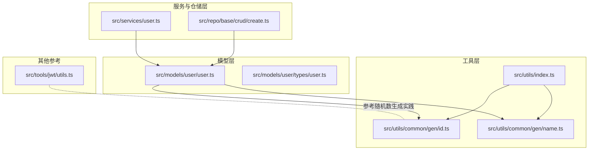
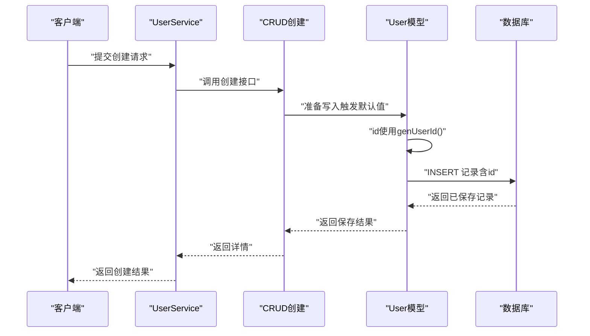
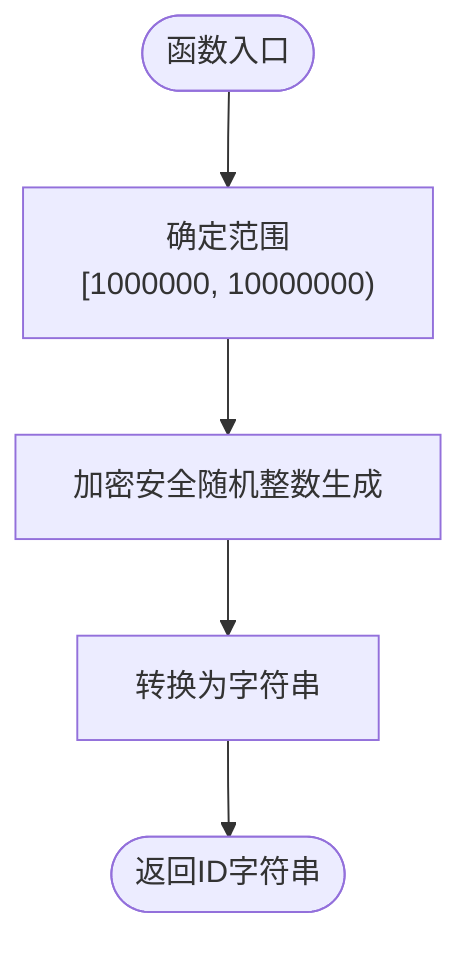
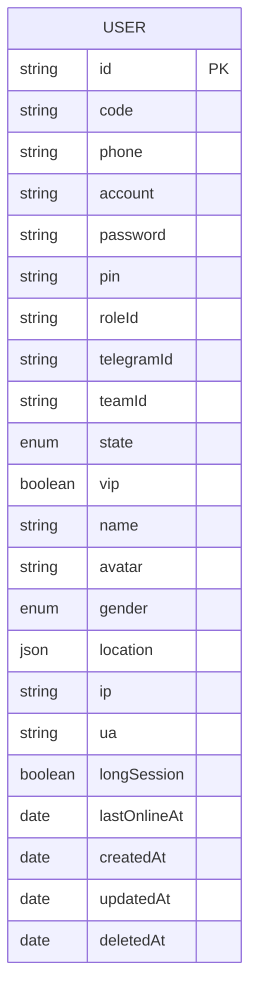
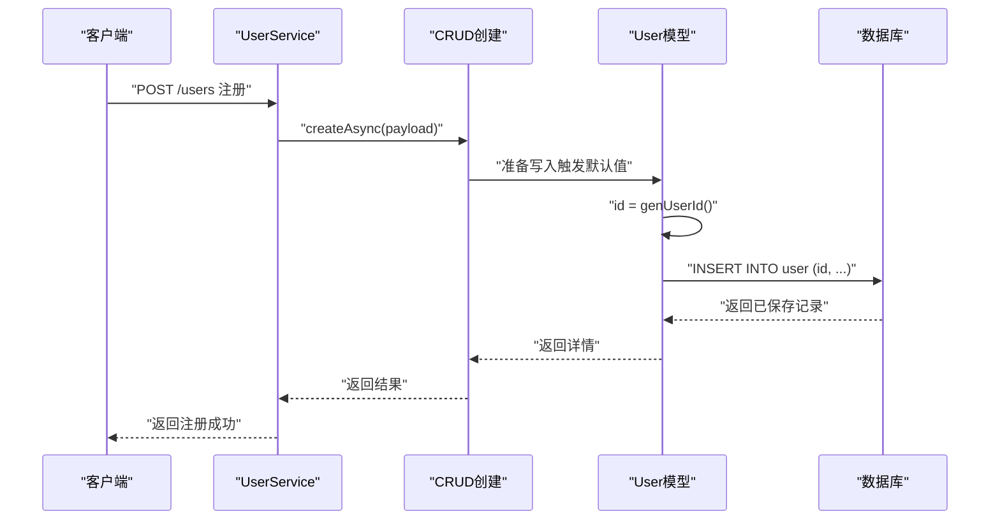
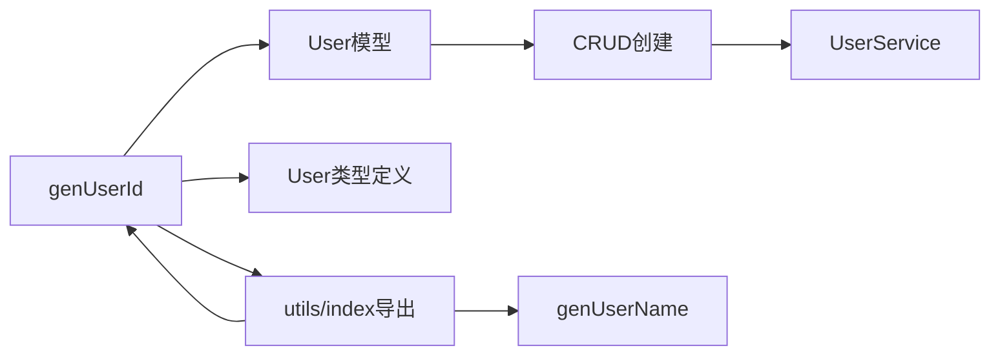

# ID生成器

<cite>
**本文档引用的文件**
- [src/utils/common/gen/id.ts](file://src/utils/common/gen/id.ts)
- [src/utils/common/gen/name.ts](file://src/utils/common/gen/name.ts)
- [src/utils/index.ts](file://src/utils/index.ts)
- [src/models/user/user.ts](file://src/models/user/user.ts)
- [src/models/user/types/user.ts](file://src/models/user/types/user.ts)
- [src/services/user.ts](file://src/services/user.ts)
- [src/repo/base/crud/create.ts](file://src/repo/base/crud/create.ts)
- [src/repo/base/validation/function/number.ts](file://src/repo/base/validation/function/number.ts)
- [src/tools/jwt/utils.ts](file://src/tools/jwt/utils.ts)
</cite>

## 目录
1. [简介](#简介)
2. [项目结构](#项目结构)
3. [核心组件](#核心组件)
4. [架构概览](#架构概览)
5. [详细组件分析](#详细组件分析)
6. [依赖关系分析](#依赖关系分析)
7. [性能考量](#性能考量)
8. [故障排查指南](#故障排查指南)
9. [结论](#结论)
10. [附录](#附录)

## 简介
本文件面向IM-API的ID生成器工具，聚焦genUserId函数的实现原理、随机数生成机制、ID范围规则（1000000至9999999）、安全性考量、性能特征与并发安全性、在用户注册流程中的应用、设计决策与对比，以及扩展与自定义实现建议。文档同时提供可视化图示与实用示例，帮助开发者快速理解与正确使用。

## 项目结构
ID生成器位于通用工具模块中，被用户模型与服务层广泛使用，贯穿创建流程并在数据库层作为主键默认值注入。

**图表来源**
- [src/utils/index.ts](file://src/utils/index.ts#L1-L7)
- [src/utils/common/gen/id.ts](file://src/utils/common/gen/id.ts#L1-L6)
- [src/utils/common/gen/name.ts](file://src/utils/common/gen/name.ts#L1-L21)
- [src/models/user/user.ts](file://src/models/user/user.ts#L1-L275)
- [src/models/user/types/user.ts](file://src/models/user/types/user.ts#L1-L177)
- [src/services/user.ts](file://src/services/user.ts#L1-L60)
- [src/repo/base/crud/create.ts](file://src/repo/base/crud/create.ts#L1-L81)
- [src/tools/jwt/utils.ts](file://src/tools/jwt/utils.ts#L38-L66)

**章节来源**
- [src/utils/index.ts](file://src/utils/index.ts#L1-L7)
- [src/utils/common/gen/id.ts](file://src/utils/common/gen/id.ts#L1-L6)
- [src/utils/common/gen/name.ts](file://src/utils/common/gen/name.ts#L1-L21)
- [src/models/user/user.ts](file://src/models/user/user.ts#L1-L275)
- [src/models/user/types/user.ts](file://src/models/user/types/user.ts#L1-L177)
- [src/services/user.ts](file://src/services/user.ts#L1-L60)
- [src/repo/base/crud/create.ts](file://src/repo/base/crud/create.ts#L1-L81)
- [src/tools/jwt/utils.ts](file://src/tools/jwt/utils.ts#L38-L66)

## 核心组件
- genUserId：生成7位十进制数字字符串的用户ID，范围1000000至9999999。
- genUserName：生成“包聊用户:XXXXXXXXXX”格式的用户名（10位纯数字），用于默认账号与昵称。
- 用户模型User：将genUserId作为id字段的默认值生成器，确保每次创建记录时自动填充主键。
- CRUD创建流程：在持久化前由模型钩子触发默认值生成，随后写入数据库。
- 安全与性能参考：项目内其他模块采用加密安全的随机数生成方式，为ID生成器的安全性提供上下文参考。

**章节来源**
- [src/utils/common/gen/id.ts](file://src/utils/common/gen/id.ts#L1-L6)
- [src/utils/common/gen/name.ts](file://src/utils/common/gen/name.ts#L1-L21)
- [src/models/user/user.ts](file://src/models/user/user.ts#L109-L118)
- [src/repo/base/crud/create.ts](file://src/repo/base/crud/create.ts#L68-L74)
- [src/tools/jwt/utils.ts](file://src/tools/jwt/utils.ts#L38-L66)

## 架构概览
下图展示从用户创建到ID生成与持久化的端到端流程。

**图表来源**
- [src/services/user.ts](file://src/services/user.ts#L40-L57)
- [src/repo/base/crud/create.ts](file://src/repo/base/crud/create.ts#L37-L80)
- [src/models/user/user.ts](file://src/models/user/user.ts#L109-L118)
- [src/utils/common/gen/id.ts](file://src/utils/common/gen/id.ts#L3-L5)

## 详细组件分析

### genUserId函数实现与随机数机制
- 实现要点
  - 使用Node.js内置加密安全随机数API生成范围内的整数。
  - 将整数转换为字符串，确保数据库层以字符串形式存储。
- 随机数生成机制
  - 采用加密安全的随机源，满足一般业务场景下的不可预测性需求。
  - 生成范围为左闭右开区间[1000000, 10000000)，即1000000到9999999。
- 数据类型与约束
  - 返回值为字符串，适配数据库VARCHAR/STRING类型。
  - 在模型中作为主键默认值，确保每条记录都有唯一ID。

**图表来源**
- [src/utils/common/gen/id.ts](file://src/utils/common/gen/id.ts#L1-L6)

**章节来源**
- [src/utils/common/gen/id.ts](file://src/utils/common/gen/id.ts#L1-L6)

### 用户ID范围规则与模型约束
- 范围规则
  - 生成范围：1000000至9999999（共900万个可用ID）。
- 模型约束
  - 字段类型：STRING(7)，限定长度为7。
  - 主键：id为STRING类型主键，确保唯一性。
  - 默认值：使用genUserId作为默认值生成器。
- 类型定义
  - 用户属性接口明确id为字符串类型，与生成器输出一致。

**图表来源**
- [src/models/user/user.ts](file://src/models/user/user.ts#L112-L118)
- [src/models/user/types/user.ts](file://src/models/user/types/user.ts#L64-L87)

**章节来源**
- [src/models/user/user.ts](file://src/models/user/user.ts#L109-L118)
- [src/models/user/types/user.ts](file://src/models/user/types/user.ts#L64-L87)

### 安全性考量
- 随机源安全性
  - 使用加密安全的随机数API，满足一般业务场景的不可预测性。
- 与密码学随机的对比
  - 项目内其他模块（如JWT短ID生成）也采用加密安全随机，ID生成器与其保持一致的安全策略。
- 唯一性与碰撞风险
  - 7位十进制ID空间为900万，适合中小规模业务；若业务体量较大或需更高熵，可考虑UUID或Snowflake等方案。
- 敏感信息保护
  - ID生成器不涉及敏感数据，但应避免在日志中泄露ID序列化趋势。

**章节来源**
- [src/utils/common/gen/id.ts](file://src/utils/common/gen/id.ts#L1-L6)
- [src/tools/jwt/utils.ts](file://src/tools/jwt/utils.ts#L38-L66)

### 性能特点与并发安全性
- 性能特点
  - 生成逻辑简单，CPU开销极低，单次调用几乎无延迟。
  - 字符串转换与数据库写入为主要耗时点。
- 并发安全性
  - 生成过程为纯函数式调用，无共享状态，天然具备并发安全。
  - 数据库层面通过主键约束保证唯一性，避免重复ID写入。
- 与数据库并发的交互
  - 在高并发插入场景下，数据库主键约束会阻止重复ID写入，确保最终一致性。

**章节来源**
- [src/utils/common/gen/id.ts](file://src/utils/common/gen/id.ts#L1-L6)
- [src/models/user/user.ts](file://src/models/user/user.ts#L112-L118)

### 在用户注册流程中的应用
- 典型流程
  - 客户端提交注册请求（不含ID）。
  - 服务层调用通用CRUD创建接口。
  - 模型在持久化前触发默认值生成，使用genUserId填充id。
  - 数据库写入成功后返回用户详情。
- 关键调用链
  - 服务层：UserService负责业务编排。
  - 仓储层：CRUD创建函数负责字段过滤与持久化。
  - 模型层：User模型在初始化时设置id默认值为genUserId。

**图表来源**
- [src/services/user.ts](file://src/services/user.ts#L40-L57)
- [src/repo/base/crud/create.ts](file://src/repo/base/crud/create.ts#L37-L80)
- [src/models/user/user.ts](file://src/models/user/user.ts#L109-L118)
- [src/utils/common/gen/id.ts](file://src/utils/common/gen/id.ts#L3-L5)

**章节来源**
- [src/services/user.ts](file://src/services/user.ts#L40-L57)
- [src/repo/base/crud/create.ts](file://src/repo/base/crud/create.ts#L37-L80)
- [src/models/user/user.ts](file://src/models/user/user.ts#L109-L118)

### 设计决策与对比
- 设计决策
  - 选择7位十进制ID：兼顾易读性、存储效率与唯一性空间。
  - 使用字符串存储：统一与前端交互格式，避免数值溢出问题。
  - 默认值生成：在模型层集中管理，降低上层调用复杂度。
- 与其他ID方案对比
  - UUID：唯一性强、无需中心化协调，但存储与索引成本较高。
  - Snowflake：带时间戳与分片，适合高并发分布式场景。
  - 短ID（如JWT工具中的shortId/nanoid）：更短、URL安全，但需自行保证唯一性。
- 适用性建议
  - 中小型业务、移动端友好场景：genUserId足够。
  - 大规模高并发或跨系统集成：建议迁移到UUID/Snowflake。

**章节来源**
- [src/utils/common/gen/id.ts](file://src/utils/common/gen/id.ts#L1-L6)
- [src/tools/jwt/utils.ts](file://src/tools/jwt/utils.ts#L38-L66)

### 扩展与自定义实现建议
- 自定义范围
  - 若需调整范围，可在生成函数中修改边界值，并同步更新模型字段长度与注释。
- 自定义格式
  - 可在生成函数中加入前缀或分隔符，满足特定业务命名规范。
- 分布式唯一性
  - 引入节点标识或时间戳片段，结合加密随机数生成全局唯一ID。
- 与业务耦合
  - 将ID生成策略抽象为工厂或策略接口，便于在不同模块灵活切换。
- 校验与测试
  - 为生成函数增加范围校验与单元测试，确保边界值正确性。
  - 可参考数值范围校验工具函数的实现思路进行断言。

**章节来源**
- [src/repo/base/validation/function/number.ts](file://src/repo/base/validation/function/number.ts#L29-L44)

## 依赖关系分析
ID生成器的直接依赖与间接影响如下：

**图表来源**
- [src/utils/common/gen/id.ts](file://src/utils/common/gen/id.ts#L1-L6)
- [src/utils/index.ts](file://src/utils/index.ts#L1-L7)
- [src/models/user/user.ts](file://src/models/user/user.ts#L109-L118)
- [src/models/user/types/user.ts](file://src/models/user/types/user.ts#L64-L87)
- [src/repo/base/crud/create.ts](file://src/repo/base/crud/create.ts#L37-L80)
- [src/services/user.ts](file://src/services/user.ts#L40-L57)

**章节来源**
- [src/utils/common/gen/id.ts](file://src/utils/common/gen/id.ts#L1-L6)
- [src/utils/index.ts](file://src/utils/index.ts#L1-L7)
- [src/models/user/user.ts](file://src/models/user/user.ts#L109-L118)
- [src/models/user/types/user.ts](file://src/models/user/types/user.ts#L64-L87)
- [src/repo/base/crud/create.ts](file://src/repo/base/crud/create.ts#L37-L80)
- [src/services/user.ts](file://src/services/user.ts#L40-L57)

## 性能考量
- CPU与内存
  - 生成函数为纯函数，无额外内存分配，CPU开销可忽略。
- I/O瓶颈
  - 数据库写入为主瓶颈，建议关注索引设计与并发写入策略。
- 并发写入
  - 通过数据库主键约束保证唯一性，避免重复ID导致的回滚与重试。
- 可观测性
  - 在高并发场景下，建议对创建接口增加埋点与告警，监控写入延迟与失败率。

## 故障排查指南
- 常见问题
  - ID重复：检查数据库主键约束是否生效，确认并发写入未绕过模型默认值。
  - 类型不匹配：确保id字段为STRING类型且长度至少为7。
  - 范围异常：若出现超出范围的ID，检查生成函数边界与模型默认值配置。
- 排查步骤
  - 核对模型初始化处的id默认值配置。
  - 检查CRUD创建流程是否正确传递了生成的ID。
  - 在数据库中验证主键唯一性与索引状态。
- 相关工具
  - 可使用数值范围校验工具辅助断言输入合法性。

**章节来源**
- [src/models/user/user.ts](file://src/models/user/user.ts#L109-L118)
- [src/repo/base/crud/create.ts](file://src/repo/base/crud/create.ts#L68-L74)
- [src/repo/base/validation/function/number.ts](file://src/repo/base/validation/function/number.ts#L29-L44)

## 结论
genUserId函数以简洁高效的实现提供了稳定的7位十进制用户ID生成能力，配合模型默认值与CRUD流程，确保在用户注册等关键场景中可靠落地。其基于加密安全随机数的生成机制与严格的范围控制，满足中小型业务的唯一性与可读性需求。对于更大规模或更高并发的场景，可考虑引入UUID或Snowflake等方案以进一步提升唯一性与扩展性。

## 附录
- 使用示例（路径指引）
  - 生成用户ID：参考[genUserId函数](file://src/utils/common/gen/id.ts#L3-L5)
  - 用户模型初始化与默认值：参考[User模型初始化](file://src/models/user/user.ts#L109-L118)
  - 用户创建流程：参考[CRUD创建流程](file://src/repo/base/crud/create.ts#L37-L80)
  - 用户服务封装：参考[UserService](file://src/services/user.ts#L40-L57)
- 相关对比参考
  - 短ID生成（加密安全随机）：参考[JWT工具中的shortId/nanoid](file://src/tools/jwt/utils.ts#L38-L66)