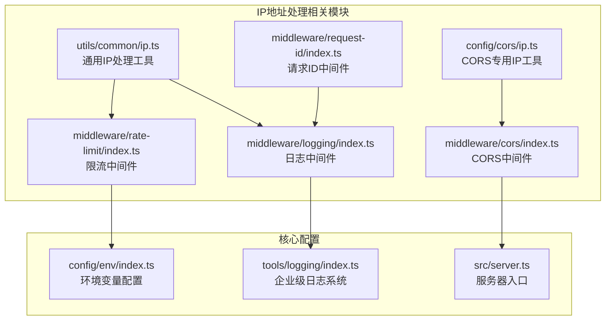
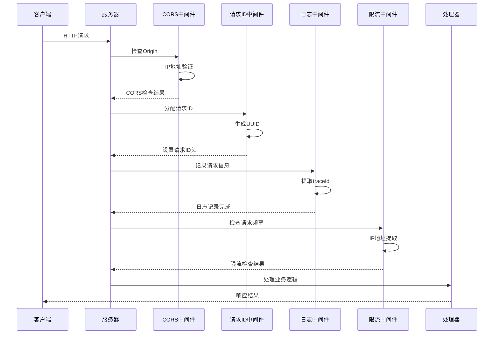
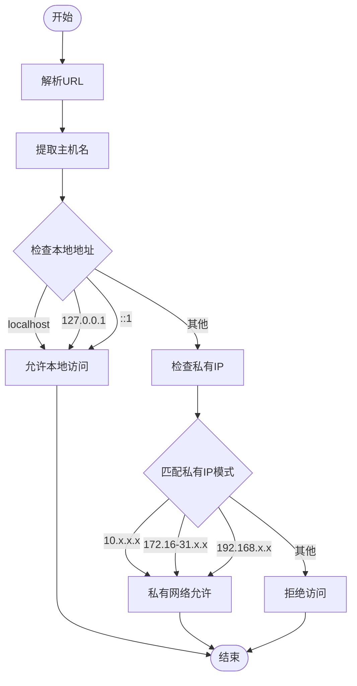
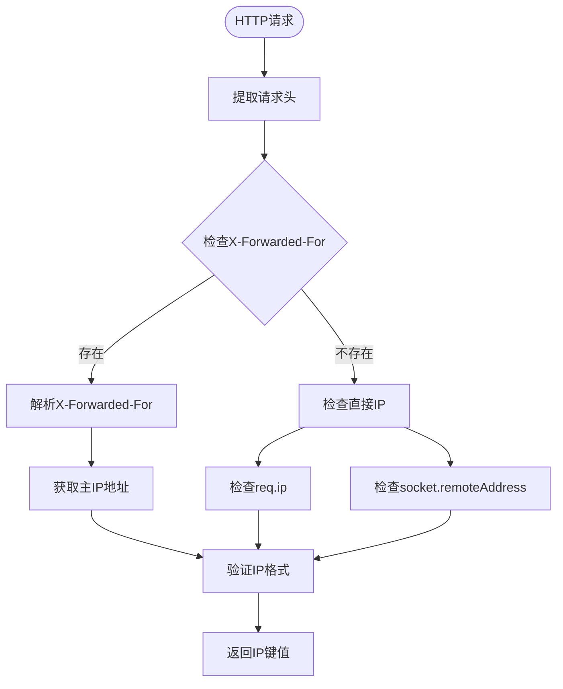
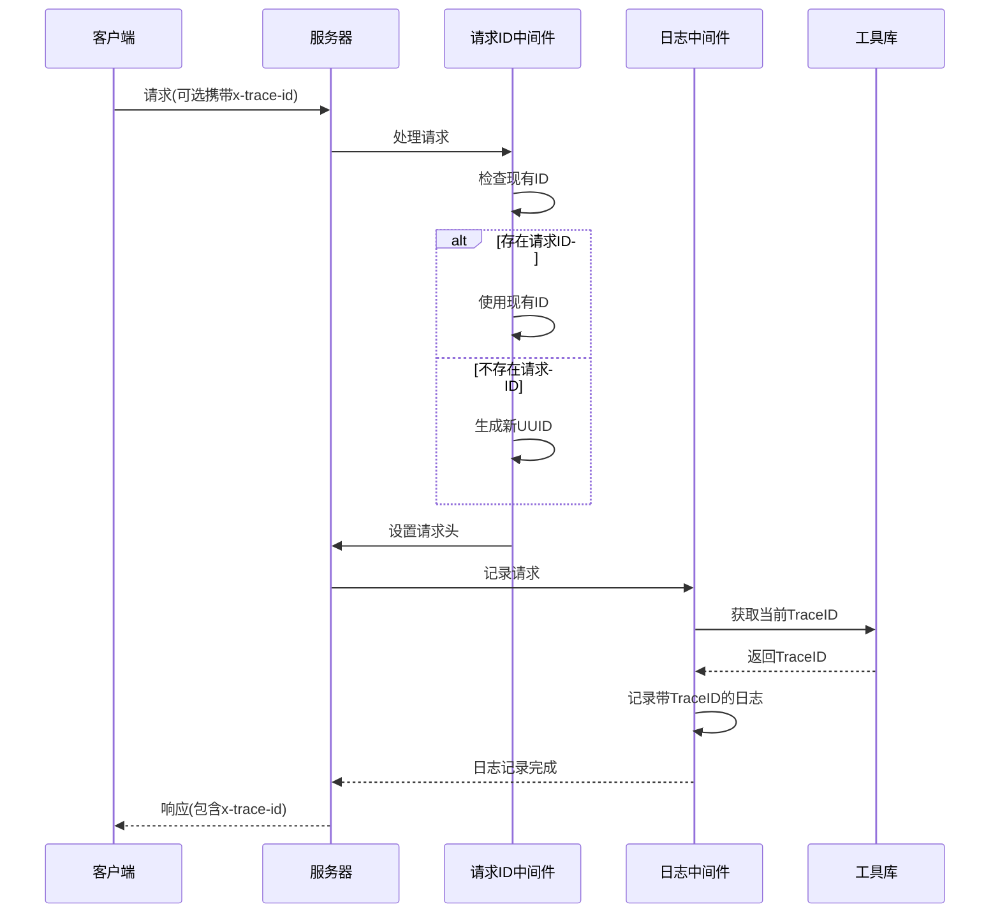
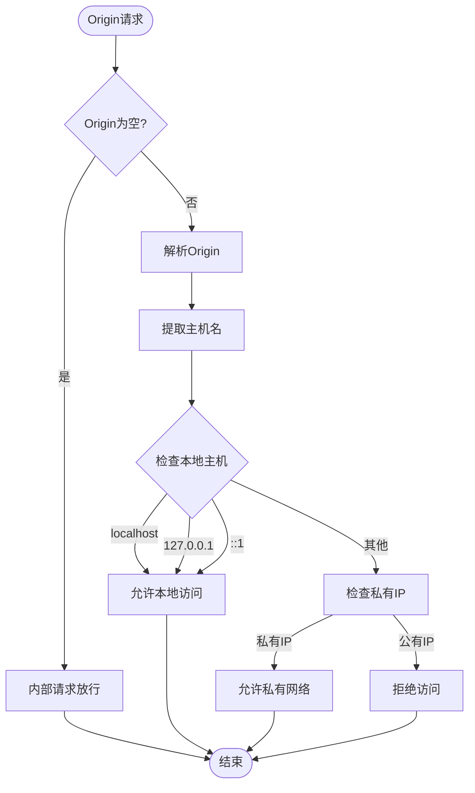
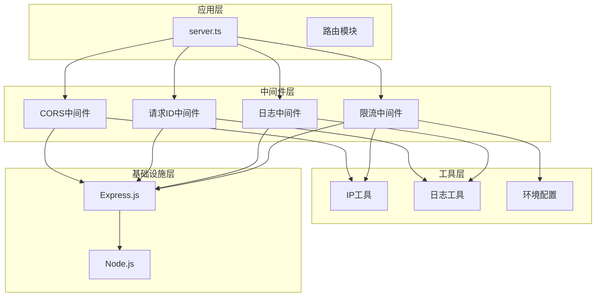

# IP地址处理工具

<cite>
**本文档引用的文件**
- [src/utils/common/ip.ts](file://src/utils/common/ip.ts)
- [src/config/cors/ip.ts](file://src/config/cors/ip.ts)
- [src/middleware/rate-limit/index.ts](file://src/middleware/rate-limit/index.ts)
- [src/middleware/logging/index.ts](file://src/middleware/logging/index.ts)
- [src/middleware/request-id/index.ts](file://src/middleware/request-id/index.ts)
- [src/middleware/cors/index.ts](file://src/middleware/cors/index.ts)
- [src/config/env/index.ts](file://src/config/env/index.ts)
- [src/tools/logging/index.ts](file://src/tools/logging/index.ts)
- [src/server.ts](file://src/server.ts)
</cite>

## 目录
1. [简介](#简介)
2. [项目结构](#项目结构)
3. [核心组件](#核心组件)
4. [架构概览](#架构概览)
5. [详细组件分析](#详细组件分析)
6. [依赖关系分析](#依赖关系分析)
7. [性能考量](#性能考量)
8. [故障排除指南](#故障排除指南)
9. [结论](#结论)
10. [附录](#附录)

## 简介

IP地址处理工具是IM-API项目中的一个关键基础设施组件，专门负责处理和验证网络请求中的IP地址信息。该工具提供了多种IP地址相关的功能，包括本地网络检测、IP地址验证、请求追踪和安全审计等。

该项目采用TypeScript编写，基于Express.js框架构建，实现了完整的IP地址处理解决方案。工具的核心功能围绕着IP地址的识别、验证和格式化，为系统的安全审计、访问控制和请求追踪提供了坚实的基础。

## 项目结构

IM-API项目采用了模块化的组织方式，IP地址处理工具分布在多个目录中：



**图表来源**
- [src/utils/common/ip.ts](file://src/utils/common/ip.ts#L1-L38)
- [src/config/cors/ip.ts](file://src/config/cors/ip.ts#L1-L52)
- [src/middleware/rate-limit/index.ts](file://src/middleware/rate-limit/index.ts#L1-L70)

**章节来源**
- [src/server.ts](file://src/server.ts#L1-L74)
- [src/utils/common/ip.ts](file://src/utils/common/ip.ts#L1-L38)

## 核心组件

IP地址处理工具由以下核心组件构成：

### 1. 本地网络检测组件
- **功能**：判断请求是否来自本地网络或局域网
- **实现**：通过URL解析和正则表达式匹配实现
- **支持协议**：HTTP/HTTPS，支持IPv4和IPv6

### 2. IP地址验证组件
- **功能**：验证IP地址的有效性和格式正确性
- **实现**：基于正则表达式的精确匹配
- **支持范围**：私有IP地址段检测

### 3. 请求追踪组件
- **功能**：为每个请求分配唯一的跟踪ID
- **实现**：基于UUID的分布式ID生成
- **集成**：与日志系统深度集成

### 4. 限流控制组件
- **功能**：基于IP地址的请求频率限制
- **实现**：内存级固定窗口计数算法
- **支持代理**：支持X-Forwarded-For头部

**章节来源**
- [src/utils/common/ip.ts](file://src/utils/common/ip.ts#L7-L36)
- [src/middleware/rate-limit/index.ts](file://src/middleware/rate-limit/index.ts#L29-L34)

## 架构概览

IP地址处理工具在整个系统架构中扮演着关键角色，通过中间件模式与各个组件进行交互：



**图表来源**
- [src/server.ts](file://src/server.ts#L27-L48)
- [src/middleware/cors/index.ts](file://src/middleware/cors/index.ts#L20-L38)
- [src/middleware/request-id/index.ts](file://src/middleware/request-id/index.ts#L50-L61)

## 详细组件分析

### 本地网络检测组件

#### 核心算法实现



**图表来源**
- [src/utils/common/ip.ts](file://src/utils/common/ip.ts#L24-L34)

#### 私有IP地址检测机制

组件支持以下私有IP地址段的检测：
- **10.0.0.0/8**：10.0.0.0 - 10.255.255.255
- **172.16.0.0/12**：172.16.0.0 - 172.31.255.255
- **192.168.0.0/16**：192.168.0.0 - 192.168.255.255

**章节来源**
- [src/utils/common/ip.ts](file://src/utils/common/ip.ts#L7-L16)

### IP地址提取和验证组件

#### 请求头处理流程



**图表来源**
- [src/middleware/rate-limit/index.ts](file://src/middleware/rate-limit/index.ts#L29-L34)

#### IP地址提取策略

组件采用多层IP地址提取策略：
1. **优先级1**：X-Forwarded-For头部的第一个IP地址
2. **优先级2**：Express.js的req.ip
3. **优先级3**：socket.remoteAddress
4. **默认值**：unknown

**章节来源**
- [src/middleware/rate-limit/index.ts](file://src/middleware/rate-limit/index.ts#L29-L34)

### 请求追踪和日志组件

#### TraceID生成和传播机制



**图表来源**
- [src/middleware/request-id/index.ts](file://src/middleware/request-id/index.ts#L50-L61)
- [src/middleware/logging/index.ts](file://src/middleware/logging/index.ts#L34-L57)

#### 日志系统集成

组件与企业级日志系统深度集成：
- **异步存储**：使用AsyncLocalStorage管理TraceID上下文
- **脱敏处理**：自动脱敏敏感信息
- **采样机制**：支持不同级别的日志采样
- **文件持久化**：支持结构化日志文件输出

**章节来源**
- [src/middleware/logging/index.ts](file://src/middleware/logging/index.ts#L34-L57)
- [src/tools/logging/index.ts](file://src/tools/logging/index.ts#L528-L532)

### CORS安全控制组件

#### Origin验证流程



**图表来源**
- [src/config/cors/ip.ts](file://src/config/cors/ip.ts#L31-L51)

**章节来源**
- [src/config/cors/ip.ts](file://src/config/cors/ip.ts#L31-L51)

## 依赖关系分析

IP地址处理工具的依赖关系呈现清晰的分层结构：



**图表来源**
- [src/server.ts](file://src/server.ts#L14-L21)
- [src/middleware/rate-limit/index.ts](file://src/middleware/rate-limit/index.ts#L12-L13)

**章节来源**
- [src/server.ts](file://src/server.ts#L14-L21)

## 性能考量

### 时间复杂度分析

- **IP地址验证**：O(1) - 使用正则表达式和常量时间比较
- **URL解析**：O(1) - 固定长度的字符串操作
- **限流检查**：O(1) - Map查找和基本算术运算
- **日志记录**：O(1) - 异步I/O操作，受磁盘性能影响

### 空间复杂度分析

- **限流存储**：O(n) - n为活跃IP地址数量
- **日志缓冲**：O(m) - m为当前活动日志事件数量
- **TraceID存储**：O(1) - 固定大小的异步存储

### 优化建议

1. **缓存策略**：对频繁访问的IP地址进行缓存
2. **批量处理**：对日志进行批量写入以减少I/O开销
3. **内存管理**：定期清理过期的限流桶数据
4. **异步处理**：使用异步I/O避免阻塞主线程

## 故障排除指南

### 常见问题及解决方案

#### 1. IP地址提取失败

**症状**：限流功能异常，总是返回"unknown" IP

**诊断步骤**：
1. 检查X-Forwarded-For头部是否存在
2. 验证Express.js配置是否正确
3. 确认代理服务器配置

**解决方案**：
```typescript
// 在限流中间件中添加调试信息
function getKey(req: Request): string {
  const h = req.headers ?? {};
  console.log('Headers:', h);
  const xff = (h["x-forwarded-for"] as string | undefined) || "";
  console.log('X-Forwarded-For:', xff);
  const ip = xff.split(",")[0].trim() || (req.ip || (req.socket.remoteAddress || "unknown"));
  console.log('Resolved IP:', ip);
  return ip;
}
```

#### 2. CORS跨域问题

**症状**：浏览器出现CORS错误

**诊断步骤**：
1. 检查Origin头部是否正确传递
2. 验证本地网络检测逻辑
3. 确认CORS配置参数

**解决方案**：
```typescript
// 添加Origin验证日志
export function isLocalNetwork(origin?: string): boolean {
  console.log('Origin:', origin);
  if (!origin) {
    console.log('No Origin - allowing internal request');
    return true;
  }
  // ... 原有逻辑
}
```

#### 3. TraceID丢失问题

**症状**：日志中缺少TraceID关联

**诊断步骤**：
1. 检查请求ID中间件执行顺序
2. 验证AsyncLocalStorage配置
3. 确认日志中间件正确集成

**解决方案**：
```typescript
// 确保正确的中间件执行顺序
app.use(ensureRequestId);
app.use(requestLogger);
```

**章节来源**
- [src/middleware/rate-limit/index.ts](file://src/middleware/rate-limit/index.ts#L29-L34)
- [src/middleware/cors/index.ts](file://src/middleware/cors/index.ts#L20-L28)

## 结论

IP地址处理工具为IM-API项目提供了完整而高效的网络请求处理能力。通过精心设计的组件架构和算法实现，该工具成功解决了以下关键问题：

1. **多协议支持**：同时支持HTTP/HTTPS和IPv4/IPv6
2. **安全防护**：通过本地网络检测和CORS控制防止未授权访问
3. **性能优化**：采用O(1)时间复杂度的算法确保高并发下的响应速度
4. **可观测性**：完整的请求追踪和日志记录系统
5. **可扩展性**：模块化设计便于功能扩展和定制

该工具的成功实施为整个系统的安全性和可靠性奠定了坚实基础，特别是在安全审计、访问控制和请求追踪方面发挥了重要作用。

## 附录

### 使用示例

#### 基本IP地址验证
```typescript
// 验证请求是否来自本地网络
const isLocal = isLocalNetwork("https://localhost:3000");
console.log(isLocal); // true
```

#### 限流中间件使用
```typescript
// 创建基于IP的限流中间件
const rateLimiter = createRateLimiter(60000, 120); // 1分钟内最多120次请求
app.use(rateLimiter);
```

#### 请求追踪集成
```typescript
// 在处理器中使用TraceID
export function myHandler(req: Request, res: Response) {
  const logger = getLogger('my-handler');
  logger.info('Processing request', { traceId: getCurrentTraceId() });
}
```

### 扩展方法

#### 自定义IP处理逻辑
```typescript
// 扩展私有IP检测范围
function isCustomPrivateIP(host: string): boolean {
  const customRanges = [
    /^10\./,
    /^172\.(1[6-9]|2\d|3[0-1])\./,
    /^192\.168\./,
    /^169\.254\./
  ];
  
  return customRanges.some(range => range.test(host));
}
```

#### 高级限流策略
```typescript
// 实现基于IP和用户ID的双重限流
function createAdvancedRateLimiter(windowMs: number, max: number): RequestHandler {
  return (req: Request, res: Response, next: NextFunction): void => {
    const userId = req.user?.id || 'anonymous';
    const clientKey = `${getKey(req)}:${userId}`;
    
    // ... 限流逻辑
  };
}
```