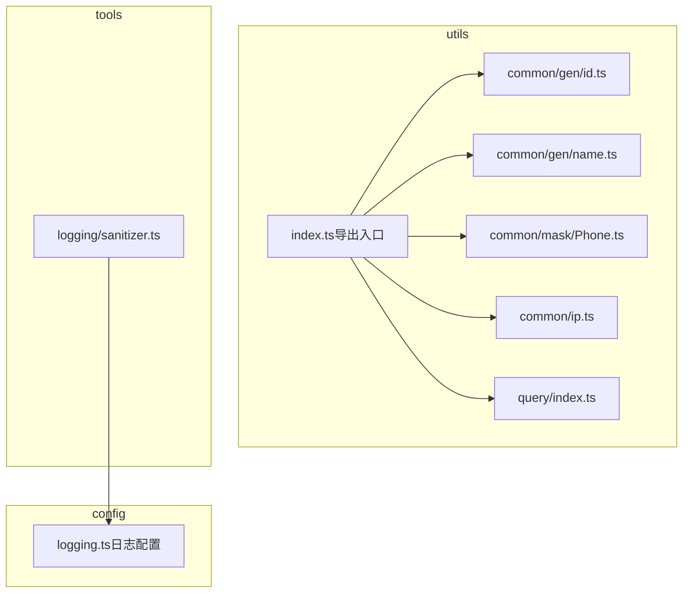
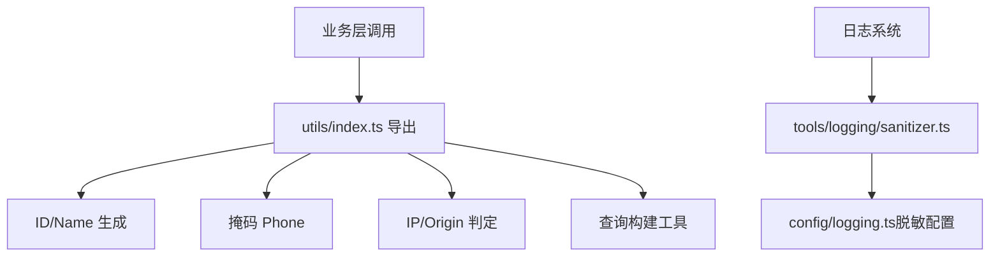
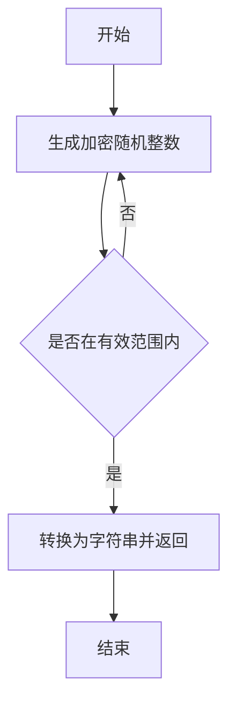
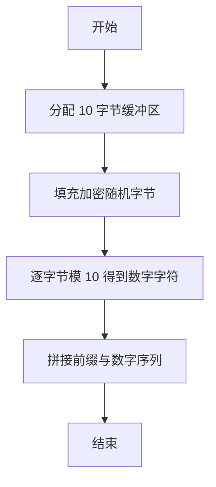
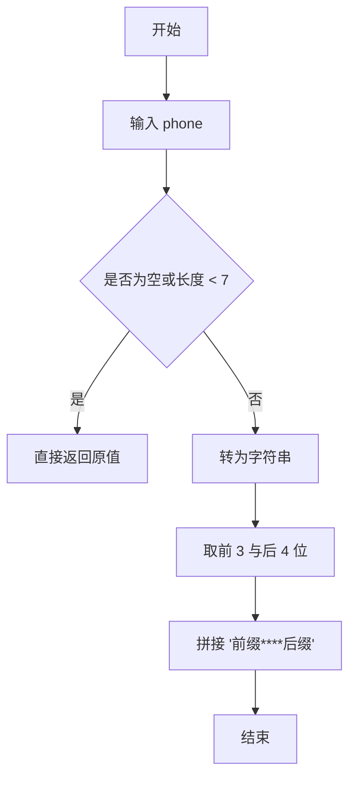
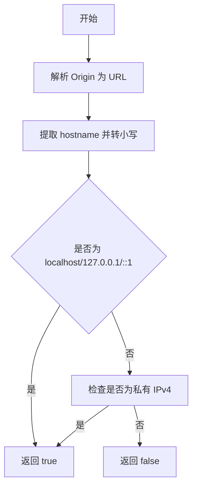
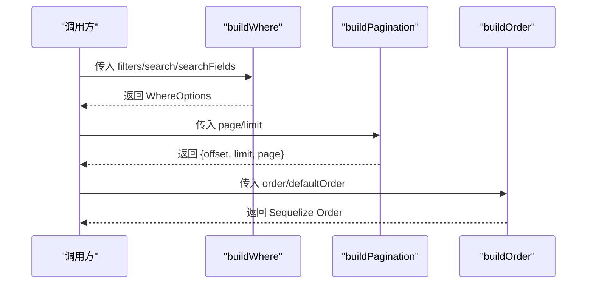
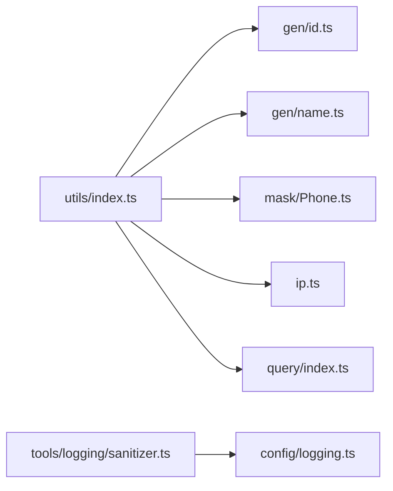

# 工具函数库

<cite>
**本文引用的文件**
- [src/utils/common/gen/id.ts](file://src/utils/common/gen/id.ts)
- [src/utils/common/gen/name.ts](file://src/utils/common/gen/name.ts)
- [src/utils/common/mask/Phone.ts](file://src/utils/common/mask/Phone.ts)
- [src/utils/common/ip.ts](file://src/utils/common/ip.ts)
- [src/utils/query/index.ts](file://src/utils/query/index.ts)
- [src/utils/index.ts](file://src/utils/index.ts)
- [src/config/logging.ts](file://src/config/logging.ts)
- [src/tools/logging/sanitizer.ts](file://src/tools/logging/sanitizer.ts)
</cite>

## 目录
1. [简介](#简介)
2. [项目结构](#项目结构)
3. [核心组件](#核心组件)
4. [架构总览](#架构总览)
5. [详细组件分析](#详细组件分析)
6. [依赖关系分析](#依赖关系分析)
7. [性能考量](#性能考量)
8. [故障排查指南](#故障排查指南)
9. [结论](#结论)
10. [附录](#附录)

## 简介
本文件面向 IM-API 的工具函数库，系统性梳理通用工具函数的设计原则与使用场景，重点覆盖以下主题：
- ID 生成器与命名生成策略
- 数据掩码（尤其是电话号码掩码）实现与扩展
- 查询工具函数（WHERE 构建、分页、排序）的用法与优化
- IP 地址处理工具（本地/内网判定）的应用场景
- 工具函数的扩展方法与自定义实现建议
- 测试策略与质量保证要点

## 项目结构
工具函数库位于 src/utils 目录，按功能域划分为：
- common/gen：ID 与名称生成
- common/mask：数据掩码（当前含电话号码）
- common/ip：IP/Origin 判定
- query：查询构建工具（WHERE、分页、排序）

图表来源
- [src/utils/index.ts](file://src/utils/index.ts#L1-L7)
- [src/utils/common/gen/id.ts](file://src/utils/common/gen/id.ts#L1-L6)
- [src/utils/common/gen/name.ts](file://src/utils/common/gen/name.ts#L1-L21)
- [src/utils/common/mask/Phone.ts](file://src/utils/common/mask/Phone.ts#L1-L15)
- [src/utils/common/ip.ts](file://src/utils/common/ip.ts#L1-L38)
- [src/utils/query/index.ts](file://src/utils/query/index.ts#L1-L132)
- [src/tools/logging/sanitizer.ts](file://src/tools/logging/sanitizer.ts#L1-L210)
- [src/config/logging.ts](file://src/config/logging.ts#L1-L157)

章节来源
- [src/utils/index.ts](file://src/utils/index.ts#L1-L7)

## 核心组件
- ID 生成器：生成安全随机的用户 ID（整型字符串），用于用户标识的快速生成与唯一性保障。
- 名称生成器：生成“包聊用户:XXXXXXX”的用户名，采用加密级随机源，确保长度与字符集特征。
- 电话号码掩码：对手机号进行脱敏，保留前三位与后四位，其余以星号替代。
- IP/Origin 判定：判断请求来源是否为本地或局域网（IPv4 私有地址段与 localhost/127.0.0.1/::1）。
- 查询构建工具：构建 WHERE 条件、分页偏移与限制、排序规则，支持字符串与数组两种排序输入。

章节来源
- [src/utils/common/gen/id.ts](file://src/utils/common/gen/id.ts#L1-L6)
- [src/utils/common/gen/name.ts](file://src/utils/common/gen/name.ts#L1-L21)
- [src/utils/common/mask/Phone.ts](file://src/utils/common/mask/Phone.ts#L1-L15)
- [src/utils/common/ip.ts](file://src/utils/common/ip.ts#L1-L38)
- [src/utils/query/index.ts](file://src/utils/query/index.ts#L1-L132)

## 架构总览
工具函数库通过统一导出入口集中暴露能力，供上层服务与中间件复用。日志脱敏工具与日志配置相互配合，形成“配置驱动”的敏感信息保护闭环。

图表来源
- [src/utils/index.ts](file://src/utils/index.ts#L1-L7)
- [src/tools/logging/sanitizer.ts](file://src/tools/logging/sanitizer.ts#L1-L210)
- [src/config/logging.ts](file://src/config/logging.ts#L1-L157)

## 详细组件分析

### ID 生成器
- 设计原则
  - 使用加密级随机源，确保不可预测性与安全性
  - 输出为固定范围内的整型字符串，便于数据库索引与前端展示
- 实现要点
  - 生成范围：100万到1千万之间，满足常用用户 ID 的可读性与唯一性需求
- 使用场景
  - 用户注册、临时身份、审计追踪等需要稳定且唯一的标识符
- 扩展建议
  - 若需全局唯一性，可结合时间戳或机器标识拼接
  - 支持多语言/地区规则的 ID 前缀策略

图表来源
- [src/utils/common/gen/id.ts](file://src/utils/common/gen/id.ts#L1-L6)

章节来源
- [src/utils/common/gen/id.ts](file://src/utils/common/gen/id.ts#L1-L6)

### 名称生成器
- 设计原则
  - 使用加密级随机源生成纯数字序列，确保不可预测
  - 固定前缀“包聊用户:”，便于识别与可读性
- 实现要点
  - 通过 Uint8Array 与模运算生成 10 位纯数字序列
  - 返回带前缀的字符串
- 使用场景
  - 注册流程中的默认用户名生成
  - 无明确用户名时的占位名称
- 扩展建议
  - 支持多语言前缀与动态模板
  - 提供去重机制（结合存储层）

图表来源
- [src/utils/common/gen/name.ts](file://src/utils/common/gen/name.ts#L1-L21)

章节来源
- [src/utils/common/gen/name.ts](file://src/utils/common/gen/name.ts#L1-L21)

### 电话号码掩码
- 设计原则
  - 保护隐私：仅保留关键位置（前三位与后四位）
  - 容错处理：空值与过短字符串直接返回原值
- 实现要点
  - 将输入转为字符串，长度不足则不处理
  - 使用字符串切片拼接“前缀 + 星号 + 后缀”
- 使用场景
  - 日志输出、用户列表展示、审计记录
- 扩展建议
  - 支持不同国家/地区的掩码策略
  - 提供可配置的保留位数与占位符

图表来源
- [src/utils/common/mask/Phone.ts](file://src/utils/common/mask/Phone.ts#L1-L15)

章节来源
- [src/utils/common/mask/Phone.ts](file://src/utils/common/mask/Phone.ts#L1-L15)

### IP/Origin 判定（本地/局域网）
- 设计原则
  - 严格判定：仅允许 localhost、127.0.0.1、::1 与 IPv4 私有地址段
  - 容错处理：URL 解析失败时返回非本地
- 实现要点
  - 解析 Origin 的 hostname，统一转小写
  - 识别私有地址段：10.x.x.x、192.168.x.x、172.16–31.x.x
- 使用场景
  - 访问控制、调试开关、跨域策略
- 扩展建议
  - 支持 IPv6 私有地址段
  - 支持 CIDR 段匹配与白名单

图表来源
- [src/utils/common/ip.ts](file://src/utils/common/ip.ts#L1-L38)

章节来源
- [src/utils/common/ip.ts](file://src/utils/common/ip.ts#L1-L38)

### 查询构建工具
- 设计原则
  - 参数清洗：过滤空值与空字符串，避免污染 WHERE 条件
  - 分页安全：限制最大页大小，防止资源滥用
  - 排序灵活：支持字符串与数组两种输入，兼容多字段排序
- 实现要点
  - buildWhere：从 filters 构建 WhereOptions，保留非空值
  - buildPagination：计算 offset 与 limit，限制 page≥1、1≤limit≤100
  - buildOrder：解析字符串或数组形式的排序，标准化为 Sequelize Order
- 使用场景
  - CRUD 列表接口、搜索与筛选、分页与排序
- 优化建议
  - 在 buildWhere 中补充搜索字段的 LIKE/Op 组合（当前为占位注释）
  - 对高频字段建立索引，减少全表扫描
  - 分页时结合“游标分页”或“反向索引”进一步优化

图表来源
- [src/utils/query/index.ts](file://src/utils/query/index.ts#L1-L132)

章节来源
- [src/utils/query/index.ts](file://src/utils/query/index.ts#L1-L132)

## 依赖关系分析
- utils/index.ts 作为统一导出入口，聚合各工具函数，便于按需引入
- 日志脱敏工具依赖日志配置，形成“配置驱动”的脱敏策略
- 查询工具与 ORM（Sequelize）类型强相关，需关注版本差异

图表来源
- [src/utils/index.ts](file://src/utils/index.ts#L1-L7)
- [src/tools/logging/sanitizer.ts](file://src/tools/logging/sanitizer.ts#L1-L210)
- [src/config/logging.ts](file://src/config/logging.ts#L1-L157)

章节来源
- [src/utils/index.ts](file://src/utils/index.ts#L1-L7)

## 性能考量
- ID/Name 生成
  - 使用加密随机源，安全性优先，开销可控
  - 如需高吞吐，可预生成批次并缓存，但需注意并发安全
- 掩码
  - 字符串切片操作 O(n)，n 为手机号长度，常数级开销
  - 批量处理时可考虑流式或批量算法减少内存拷贝
- IP 判定
  - URL 解析与正则匹配成本低，适合高频调用
  - 可缓存常见域名解析结果（如 localhost）
- 查询构建
  - buildWhere 的 Object.entries 遍历与 buildPagination 的数学计算均为 O(1)
  - buildOrder 的字符串拆分与数组映射为 O(k)，k 为字段数量
  - 建议在上层接口层做输入校验与限流，避免异常输入导致额外处理

## 故障排查指南
- 掩码异常
  - 现象：手机号未被正确掩码
  - 排查：确认输入非空且长度≥7；检查字符串转换逻辑
- IP 判定失败
  - 现象：合法本地地址被误判
  - 排查：确认 Origin 格式与 hostname 解析；检查 IPv4 私有段匹配
- 查询构建无效
  - 现象：WHERE 条件缺失或排序无效
  - 排查：确认 filters 中无空值；检查 order 输入格式；核对默认排序
- 日志脱敏不生效
  - 现象：敏感字段未被替换
  - 排查：确认 SanitizeConfig.enabled 为 true；检查字段名大小写与包含匹配；确认 partial 配置合理

章节来源
- [src/utils/common/mask/Phone.ts](file://src/utils/common/mask/Phone.ts#L1-L15)
- [src/utils/common/ip.ts](file://src/utils/common/ip.ts#L1-L38)
- [src/utils/query/index.ts](file://src/utils/query/index.ts#L1-L132)
- [src/tools/logging/sanitizer.ts](file://src/tools/logging/sanitizer.ts#L1-L210)
- [src/config/logging.ts](file://src/config/logging.ts#L1-L157)

## 结论
工具函数库以“安全、简洁、可扩展”为核心设计目标，覆盖了 ID/Name 生成、数据掩码、IP 判定与查询构建等关键能力。通过统一导出入口与配置驱动的脱敏策略，提升了代码复用性与安全性。建议在后续迭代中完善查询构建的搜索能力、增强掩码策略的国际化支持，并持续优化性能与可观测性。

## 附录

### 使用示例（路径指引）
- 生成用户 ID：参考 [src/utils/common/gen/id.ts](file://src/utils/common/gen/id.ts#L1-L6)
- 生成用户名：参考 [src/utils/common/gen/name.ts](file://src/utils/common/gen/name.ts#L1-L21)
- 手机号掩码：参考 [src/utils/common/mask/Phone.ts](file://src/utils/common/mask/Phone.ts#L1-L15)
- 本地/局域网判定：参考 [src/utils/common/ip.ts](file://src/utils/common/ip.ts#L1-L38)
- 查询构建（WHERE/分页/排序）：参考 [src/utils/query/index.ts](file://src/utils/query/index.ts#L1-L132)
- 日志脱敏配置：参考 [src/config/logging.ts](file://src/config/logging.ts#L1-L157)
- 日志脱敏工具类：参考 [src/tools/logging/sanitizer.ts](file://src/tools/logging/sanitizer.ts#L1-L210)

### 扩展与自定义
- 新增掩码策略
  - 在 common/mask 下新增文件，遵循现有导出与文档规范
  - 参考 Phone 掩码的实现与注释风格
- 新增查询条件
  - 在 buildWhere 中增加对新字段的处理逻辑（如 LIKE/范围/多值）
  - 参考注释中关于 Sequelize Op 的提示
- 自定义脱敏规则
  - 通过 Sanitizer 类的 updateConfig/addSensitiveField/removeSensitiveField 动态调整
  - 参考 [src/tools/logging/sanitizer.ts](file://src/tools/logging/sanitizer.ts#L170-L201)

### 测试策略与质量保证
- 单元测试建议
  - ID/Name 生成：验证输出范围、长度与字符集特征
  - 掩码：覆盖空值、短串、正常串、边界长度
  - IP 判定：覆盖 localhost/127.0.0.1/::1 与私有地址段
  - 查询构建：覆盖 filters 空值、page/limit 边界、order 多种格式
- 质量保证
  - 文档与注释保持同步，确保 API 变更及时更新
  - 配置项变更通过环境变量与默认值双通道验证
  - 日志脱敏通过集成测试验证字段识别与占位效果