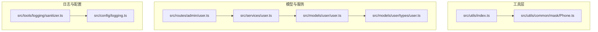
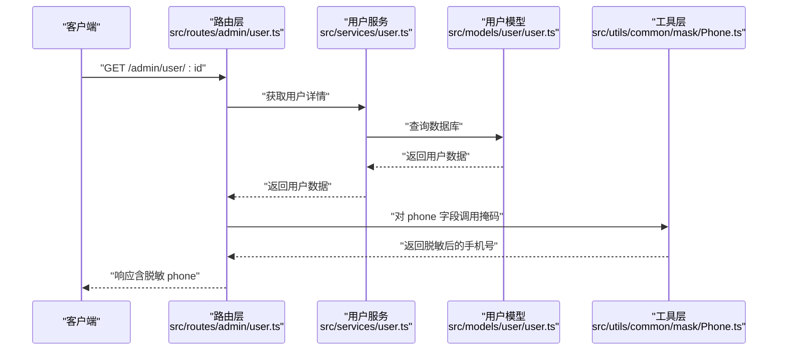
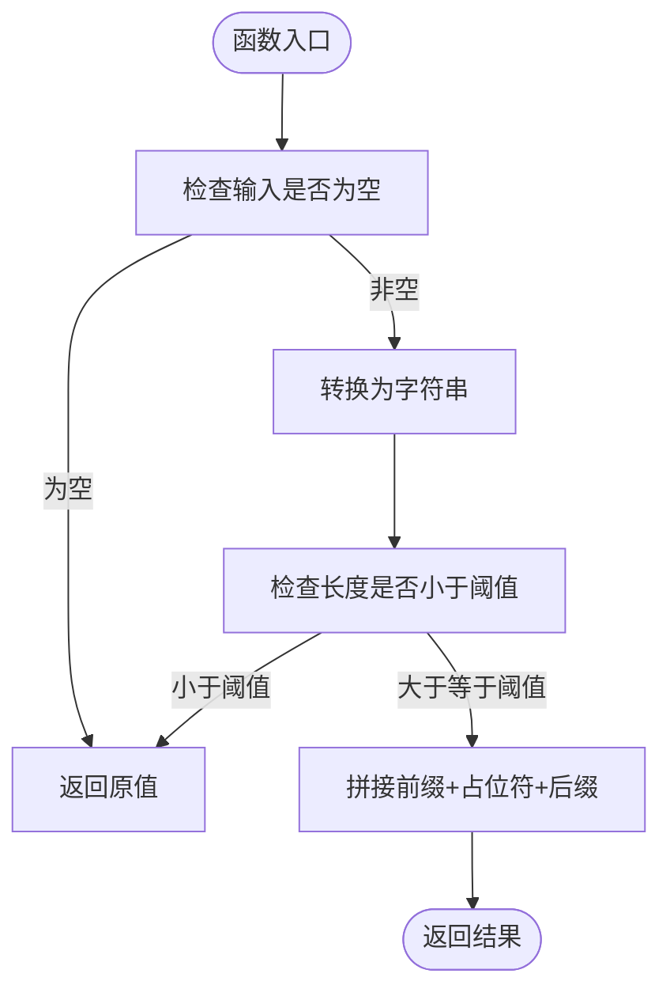
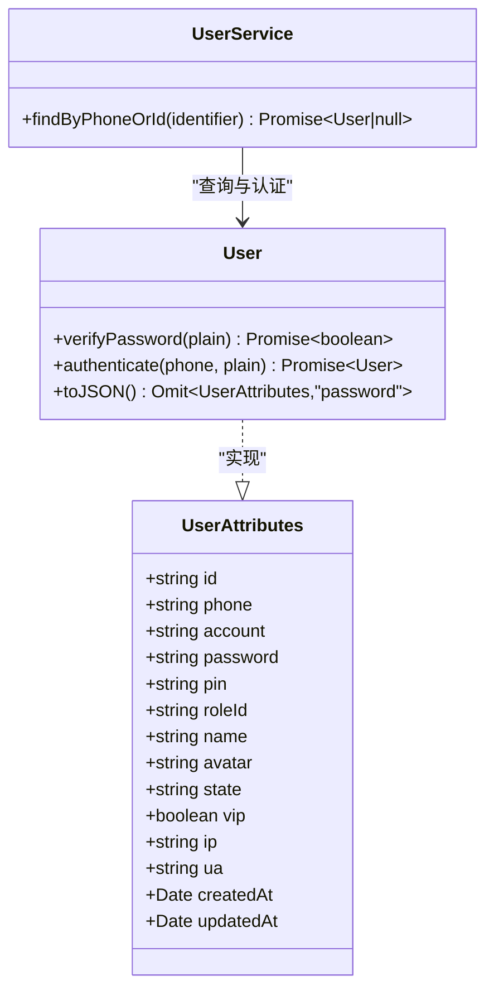
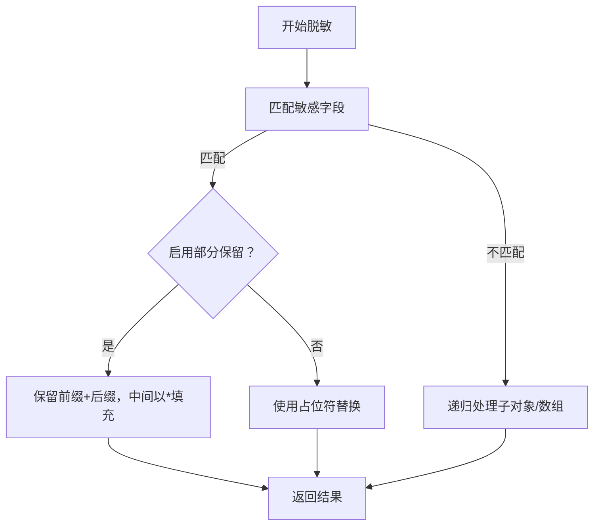
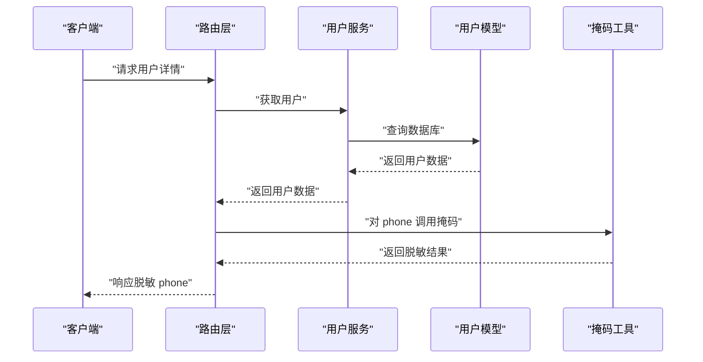
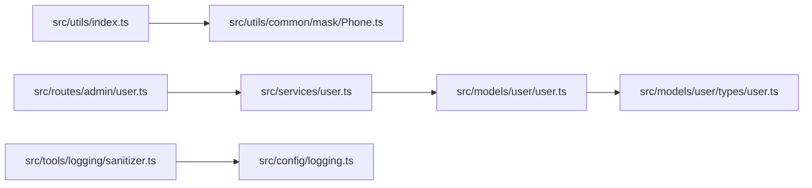

# 数据掩码工具

<cite>
**本文引用的文件**
- [src/utils/common/mask/Phone.ts](file://src/utils/common/mask/Phone.ts)
- [src/utils/index.ts](file://src/utils/index.ts)
- [src/models/user/types/user.ts](file://src/models/user/types/user.ts)
- [src/models/user/user.ts](file://src/models/user/user.ts)
- [src/services/user.ts](file://src/services/user.ts)
- [src/routes/admin/user.ts](file://src/routes/admin/user.ts)
- [src/tools/logging/sanitizer.ts](file://src/tools/logging/sanitizer.ts)
- [src/config/logging.ts](file://src/config/logging.ts)
- [src/repo/base/validation/function/string.ts](file://src/repo/base/validation/function/string.ts)
- [src/repo/base/validation/function/index.ts](file://src/repo/base/validation/function/index.ts)
</cite>

## 目录
1. [简介](#简介)
2. [项目结构](#项目结构)
3. [核心组件](#核心组件)
4. [架构总览](#架构总览)
5. [组件详解](#组件详解)
6. [依赖关系分析](#依赖关系分析)
7. [性能考量](#性能考量)
8. [故障排查指南](#故障排查指南)
9. [结论](#结论)
10. [附录](#附录)

## 简介
本文件面向 IM-API 的数据掩码工具，聚焦于电话号码掩码功能的实现原理、隐私保护机制与可配置性。文档将详细说明 Phone 掩码函数的使用方法与掩码规则，阐述掩码算法的可扩展性与最佳实践，并给出在用户信息展示中的典型应用场景与性能建议。

## 项目结构
数据掩码工具位于通用工具模块中，通过统一导出入口对外提供能力；用户模型与服务层负责数据读取与展示，日志脱敏工具提供更广泛的敏感信息脱敏能力，便于在不同层级进行隐私保护。

**图表来源**
- [src/utils/index.ts](file://src/utils/index.ts#L1-L7)
- [src/utils/common/mask/Phone.ts](file://src/utils/common/mask/Phone.ts#L1-L15)
- [src/models/user/types/user.ts](file://src/models/user/types/user.ts#L1-L177)
- [src/models/user/user.ts](file://src/models/user/user.ts#L1-L275)
- [src/services/user.ts](file://src/services/user.ts#L1-L60)
- [src/routes/admin/user.ts](file://src/routes/admin/user.ts#L1-L40)
- [src/tools/logging/sanitizer.ts](file://src/tools/logging/sanitizer.ts#L1-L86)
- [src/config/logging.ts](file://src/config/logging.ts#L50-L156)

**章节来源**
- [src/utils/index.ts](file://src/utils/index.ts#L1-L7)
- [src/utils/common/mask/Phone.ts](file://src/utils/common/mask/Phone.ts#L1-L15)
- [src/models/user/types/user.ts](file://src/models/user/types/user.ts#L1-L177)
- [src/models/user/user.ts](file://src/models/user/user.ts#L1-L275)
- [src/services/user.ts](file://src/services/user.ts#L1-L60)
- [src/routes/admin/user.ts](file://src/routes/admin/user.ts#L1-L40)
- [src/tools/logging/sanitizer.ts](file://src/tools/logging/sanitizer.ts#L1-L86)
- [src/config/logging.ts](file://src/config/logging.ts#L50-L156)

## 核心组件
- Phone 掩码函数：提供手机号脱敏能力，默认保留前三位与后四位，其余以占位符替代。
- 统一导出入口：通过工具模块索引导出掩码函数，便于跨模块复用。
- 用户模型与服务：用户模型定义 phone 字段类型与约束；服务层提供按手机号或 ID 查询能力；路由层承载用户相关接口。
- 日志脱敏工具：提供通用敏感信息脱敏能力，支持字段白名单、部分保留策略与占位符替换，可用于日志与审计输出。

**章节来源**
- [src/utils/common/mask/Phone.ts](file://src/utils/common/mask/Phone.ts#L1-L15)
- [src/utils/index.ts](file://src/utils/index.ts#L1-L7)
- [src/models/user/types/user.ts](file://src/models/user/types/user.ts#L38-L67)
- [src/models/user/user.ts](file://src/models/user/user.ts#L127-L135)
- [src/services/user.ts](file://src/services/user.ts#L40-L57)
- [src/routes/admin/user.ts](file://src/routes/admin/user.ts#L1-L40)
- [src/tools/logging/sanitizer.ts](file://src/tools/logging/sanitizer.ts#L1-L86)
- [src/config/logging.ts](file://src/config/logging.ts#L50-L156)

## 架构总览
下图展示了从请求到响应过程中，数据掩码与隐私保护的关键节点与交互：

**图表来源**
- [src/routes/admin/user.ts](file://src/routes/admin/user.ts#L33-L37)
- [src/services/user.ts](file://src/services/user.ts#L40-L57)
- [src/models/user/user.ts](file://src/models/user/user.ts#L69-L89)
- [src/utils/common/mask/Phone.ts](file://src/utils/common/mask/Phone.ts#L7-L14)

## 组件详解

### Phone 掩码函数
- 功能描述：对传入的手机号字符串进行脱敏处理，保留前三位与后四位，中间以固定占位符替代。
- 输入输出：
  - 输入：原始手机号字符串（可为空或长度不足阈值）。
  - 输出：脱敏后的手机号字符串。
- 规则说明：
  - 若输入为空或非字符串，直接返回原值。
  - 若字符串长度小于阈值，不进行掩码，直接返回原值。
  - 否则，保留前缀与后缀，中间以占位符替代。
- 使用方式：
  - 通过工具模块统一导出入口引入：import { maskPhone } from "@/utils"。
  - 在数据展示前调用该函数，确保对外输出的手机号符合隐私要求。

**图表来源**
- [src/utils/common/mask/Phone.ts](file://src/utils/common/mask/Phone.ts#L7-L14)

**章节来源**
- [src/utils/common/mask/Phone.ts](file://src/utils/common/mask/Phone.ts#L1-L15)
- [src/utils/index.ts](file://src/utils/index.ts#L1-L7)

### 用户模型与服务中的掩码集成
- 用户模型：
  - phone 字段类型为字符串，长度上限由模型定义；模型提供强类型 toJSON 序列化，剔除敏感字段，避免在序列化阶段泄露密码等信息。
- 用户服务：
  - 提供按手机号或 ID 精确查找用户的能力，便于在展示层对 phone 字段进行脱敏处理。
- 路由层：
  - 提供用户列表、详情等接口，结合服务层返回的数据，在响应前进行掩码处理。

**图表来源**
- [src/models/user/types/user.ts](file://src/models/user/types/user.ts#L38-L87)
- [src/models/user/user.ts](file://src/models/user/user.ts#L33-L101)
- [src/services/user.ts](file://src/services/user.ts#L40-L57)

**章节来源**
- [src/models/user/types/user.ts](file://src/models/user/types/user.ts#L38-L87)
- [src/models/user/user.ts](file://src/models/user/user.ts#L33-L101)
- [src/services/user.ts](file://src/services/user.ts#L40-L57)
- [src/routes/admin/user.ts](file://src/routes/admin/user.ts#L33-L37)

### 日志与配置中的脱敏能力
- 日志脱敏工具：
  - 支持基于字段名匹配的敏感信息识别与替换，可选择启用“部分保留”策略（保留前缀与后缀），或统一占位符替换。
  - 对嵌套对象与数组进行递归处理，防止遗漏深层敏感字段。
- 日志配置：
  - 提供敏感字段白名单、占位符与部分保留策略的配置项，便于在不同环境与场景下灵活调整。

**图表来源**
- [src/tools/logging/sanitizer.ts](file://src/tools/logging/sanitizer.ts#L18-L86)
- [src/config/logging.ts](file://src/config/logging.ts#L50-L156)

**章节来源**
- [src/tools/logging/sanitizer.ts](file://src/tools/logging/sanitizer.ts#L1-L86)
- [src/config/logging.ts](file://src/config/logging.ts#L50-L156)

### 掩码算法的可配置性与扩展性
- 可配置性：
  - Phone 掩码当前规则固定，但可通过工具层扩展新的掩码函数或在上层封装可配置策略（例如：保留前缀/后缀长度、占位符字符等）。
  - 日志脱敏工具已具备完整的配置接口，可直接扩展至 Phone 字段或其他敏感字段。
- 扩展性：
  - 新增掩码函数时，遵循统一导出入口，保持模块解耦与易用性。
  - 对于复杂脱敏需求，优先使用日志脱敏工具，减少重复实现与维护成本。

**章节来源**
- [src/utils/common/mask/Phone.ts](file://src/utils/common/mask/Phone.ts#L1-L15)
- [src/utils/index.ts](file://src/utils/index.ts#L1-L7)
- [src/tools/logging/sanitizer.ts](file://src/tools/logging/sanitizer.ts#L1-L86)
- [src/config/logging.ts](file://src/config/logging.ts#L50-L156)

### 使用示例与应用场景
- 示例流程（用户详情展示）：
  1) 客户端请求用户详情接口。
  2) 路由层调用用户服务获取数据。
  3) 服务层查询数据库并返回用户对象。
  4) 路由层在响应前对 phone 字段调用掩码函数。
  5) 返回脱敏后的用户信息给客户端。
- 典型场景：
  - 用户列表与详情展示：避免直接暴露完整手机号。
  - 日志与审计输出：对 phone 字段进行统一脱敏，防止敏感信息泄露。
  - 认证与授权：在必要场景下仍可使用完整手机号（如登录），但对外展示与日志输出应脱敏。

**图表来源**
- [src/routes/admin/user.ts](file://src/routes/admin/user.ts#L33-L37)
- [src/services/user.ts](file://src/services/user.ts#L40-L57)
- [src/models/user/user.ts](file://src/models/user/user.ts#L69-L89)
- [src/utils/common/mask/Phone.ts](file://src/utils/common/mask/Phone.ts#L7-L14)

**章节来源**
- [src/routes/admin/user.ts](file://src/routes/admin/user.ts#L33-L37)
- [src/services/user.ts](file://src/services/user.ts#L40-L57)
- [src/models/user/user.ts](file://src/models/user/user.ts#L69-L89)
- [src/utils/common/mask/Phone.ts](file://src/utils/common/mask/Phone.ts#L7-L14)

## 依赖关系分析
- 工具层依赖：Phone 掩码函数被工具模块统一导出，供路由与服务层按需引入。
- 模型与服务依赖：服务层依赖模型进行数据查询与认证；模型定义 phone 字段类型与约束。
- 日志与配置依赖：日志脱敏工具依赖日志配置，形成统一的敏感信息处理策略。

**图表来源**
- [src/utils/index.ts](file://src/utils/index.ts#L1-L7)
- [src/utils/common/mask/Phone.ts](file://src/utils/common/mask/Phone.ts#L1-L15)
- [src/routes/admin/user.ts](file://src/routes/admin/user.ts#L1-L40)
- [src/services/user.ts](file://src/services/user.ts#L1-L60)
- [src/models/user/user.ts](file://src/models/user/user.ts#L1-L275)
- [src/models/user/types/user.ts](file://src/models/user/types/user.ts#L1-L177)
- [src/tools/logging/sanitizer.ts](file://src/tools/logging/sanitizer.ts#L1-L86)
- [src/config/logging.ts](file://src/config/logging.ts#L50-L156)

**章节来源**
- [src/utils/index.ts](file://src/utils/index.ts#L1-L7)
- [src/utils/common/mask/Phone.ts](file://src/utils/common/mask/Phone.ts#L1-L15)
- [src/routes/admin/user.ts](file://src/routes/admin/user.ts#L1-L40)
- [src/services/user.ts](file://src/services/user.ts#L1-L60)
- [src/models/user/user.ts](file://src/models/user/user.ts#L1-L275)
- [src/models/user/types/user.ts](file://src/models/user/types/user.ts#L1-L177)
- [src/tools/logging/sanitizer.ts](file://src/tools/logging/sanitizer.ts#L1-L86)
- [src/config/logging.ts](file://src/config/logging.ts#L50-L156)

## 性能考量
- 时间复杂度：Phone 掩码函数为 O(n)，其中 n 为字符串长度，主要消耗在字符串切片与拼接；整体开销极低，适合高频调用。
- 空间复杂度：O(n)，产生一个新的脱敏字符串；内存占用与输入长度线性相关。
- 最佳实践：
  - 在数据展示层统一调用掩码函数，避免在多处重复实现。
  - 对于日志输出，优先使用日志脱敏工具，减少条件分支与重复逻辑。
  - 对超长字符串（如日志内容）进行截断或采样，降低日志体积与序列化成本。
  - 将掩码逻辑与业务逻辑解耦，便于单元测试与性能监控。

[本节为通用性能讨论，无需特定文件分析]

## 故障排查指南
- 输入为空或类型异常：
  - 现象：传入空值或非字符串导致异常。
  - 处理：在调用掩码函数前进行类型校验，确保输入为字符串。
- 长度不足阈值：
  - 现象：手机号长度过短未触发掩码。
  - 处理：确认阈值设置与业务需求一致；必要时在上层封装统一处理逻辑。
- 日志脱敏未生效：
  - 现象：日志中仍出现敏感字段。
  - 处理：检查日志配置中的敏感字段白名单与占位符设置；确认脱敏工具在输出前被调用。
- 类型与模型约束：
  - 现象：模型层对 phone 字段有正则约束，导致入库失败。
  - 处理：确保入库前已去除非数字字符或在模型层进行清洗；展示层使用掩码函数仅用于输出。

**章节来源**
- [src/utils/common/mask/Phone.ts](file://src/utils/common/mask/Phone.ts#L7-L14)
- [src/repo/base/validation/function/string.ts](file://src/repo/base/validation/function/string.ts#L15-L17)
- [src/repo/base/validation/function/index.ts](file://src/repo/base/validation/function/index.ts#L15-L87)
- [src/config/logging.ts](file://src/config/logging.ts#L50-L156)
- [src/tools/logging/sanitizer.ts](file://src/tools/logging/sanitizer.ts#L18-L86)

## 结论
数据掩码工具通过 Phone 掩码函数与日志脱敏工具，实现了对手机号等敏感信息的统一脱敏与隐私保护。其设计简洁、可配置性强，易于在用户信息展示与日志输出等场景中落地。建议在展示层与日志层统一采用掩码策略，并结合日志配置实现灵活的脱敏行为，从而在保障用户体验的同时提升数据安全性。

[本节为总结性内容，无需特定文件分析]

## 附录
- 关键路径参考：
  - Phone 掩码函数：[src/utils/common/mask/Phone.ts](file://src/utils/common/mask/Phone.ts#L7-L14)
  - 工具模块导出：[src/utils/index.ts](file://src/utils/index.ts#L1-L7)
  - 用户模型与服务：[src/models/user/user.ts](file://src/models/user/user.ts#L127-L135), [src/services/user.ts](file://src/services/user.ts#L40-L57)
  - 日志脱敏工具与配置：[src/tools/logging/sanitizer.ts](file://src/tools/logging/sanitizer.ts#L18-L86), [src/config/logging.ts](file://src/config/logging.ts#L50-L156)

[本节为补充说明，无需特定文件分析]