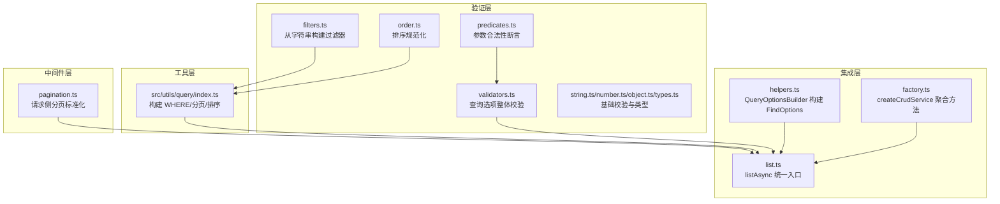
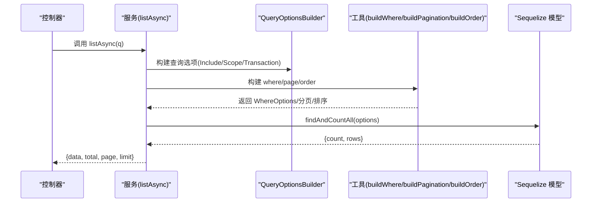
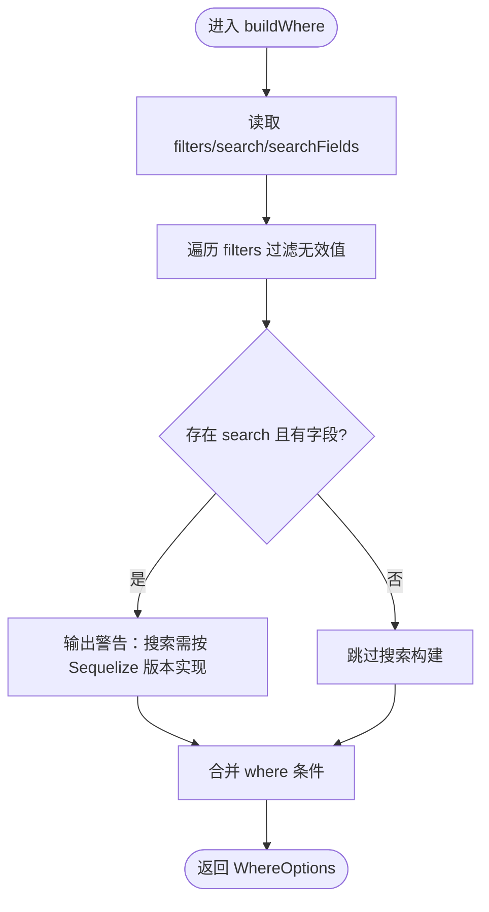
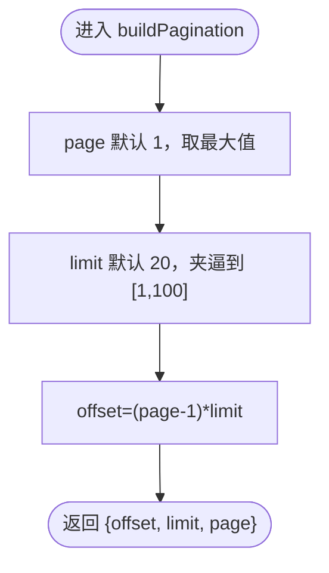
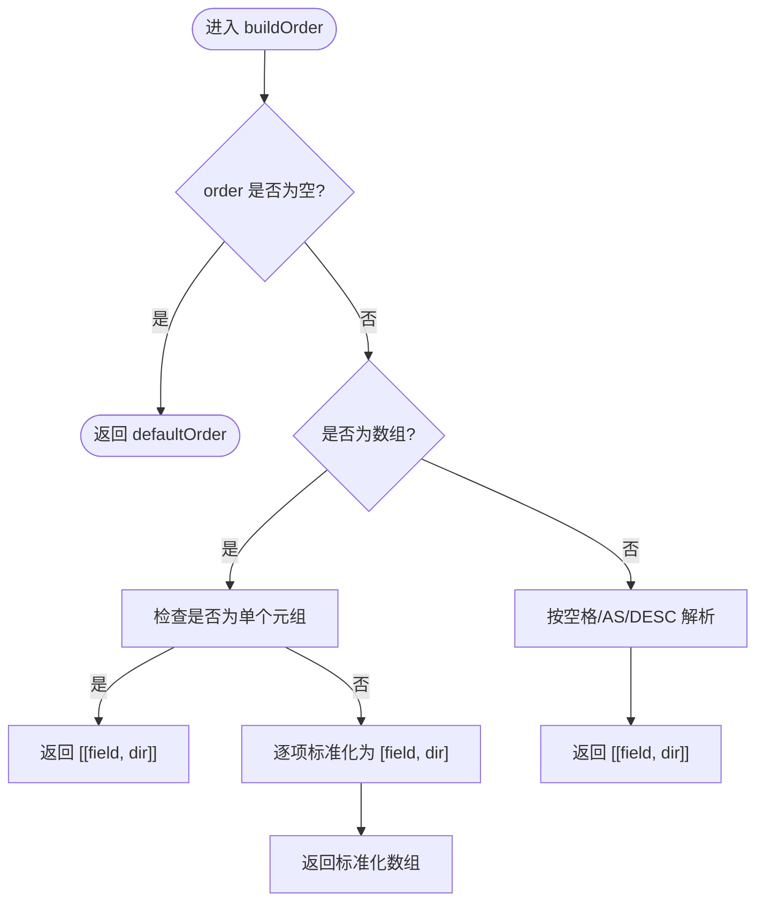
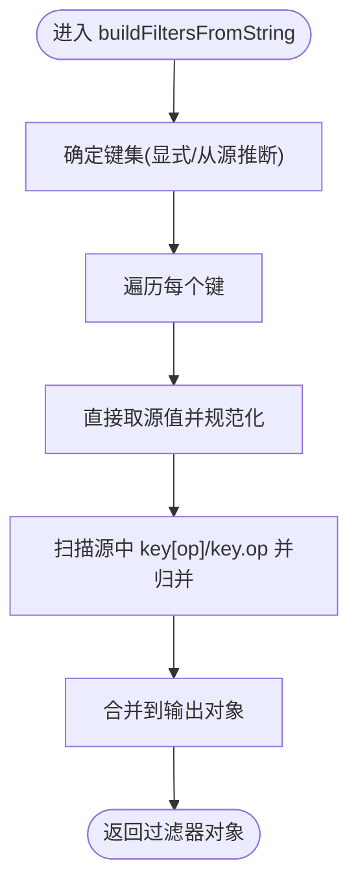
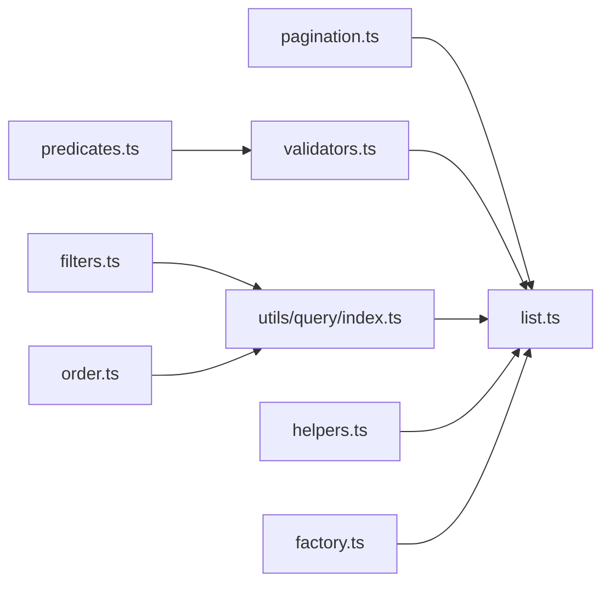

# 查询工具函数

<cite>
**本文档引用的文件**
- [src/utils/query/index.ts](file://src/utils/query/index.ts)
- [src/repo/base/validation/function/filters.ts](file://src/repo/base/validation/function/filters.ts)
- [src/repo/base/validation/function/order.ts](file://src/repo/base/validation/function/order.ts)
- [src/repo/base/validation/function/predicates.ts](file://src/repo/base/validation/function/predicates.ts)
- [src/repo/base/types/query.ts](file://src/repo/base/types/query.ts)
- [src/repo/base/crud/list.ts](file://src/repo/base/crud/list.ts)
- [src/repo/base/validation/function/index.ts](file://src/repo/base/validation/function/index.ts)
- [src/middleware/request/pagination.ts](file://src/middleware/request/pagination.ts)
- [src/repo/base/validation/function/validators.ts](file://src/repo/base/validation/function/validators.ts)
- [src/repo/base/validation/function/string.ts](file://src/repo/base/validation/function/string.ts)
- [src/repo/base/validation/function/number.ts](file://src/repo/base/validation/function/number.ts)
- [src/repo/base/validation/function/object.ts](file://src/repo/base/validation/function/object.ts)
- [src/repo/base/validation/function/types.ts](file://src/repo/base/validation/function/types.ts)
- [src/repo/base/crud/helpers.ts](file://src/repo/base/crud/helpers.ts)
- [src/repo/base/crud/factory.ts](file://src/repo/base/crud/factory.ts)
</cite>

## 目录
1. [简介](#简介)
2. [项目结构](#项目结构)
3. [核心组件](#核心组件)
4. [架构概览](#架构概览)
5. [详细组件分析](#详细组件分析)
6. [依赖分析](#依赖分析)
7. [性能考虑](#性能考虑)
8. [故障排查指南](#故障排查指南)
9. [结论](#结论)
10. [附录](#附录)

## 简介
本文件面向 IM-API 的查询工具函数，系统性阐述查询处理工具的设计原理、参数解析与验证流程、与数据库操作的集成方式、性能优化策略与缓存建议，并提供可扩展的自定义查询处理方案。目标读者既包括需要快速上手的开发者，也包括希望深入理解实现细节的高级工程师。

## 项目结构
查询工具位于工具层与验证层之间，向上为 CRUD 服务提供参数构建能力，向下与 Sequelize ORM 的 Where/Order/Pagination 能力对接。关键模块分布如下：
- 工具层：构建 WHERE、分页、排序参数
- 验证层：参数合法性与规范化
- 集成层：与 CRUD 服务、查询选项构建器协作
- 中间件层：请求侧分页参数标准化

图表来源
- [src/utils/query/index.ts](file://src/utils/query/index.ts#L1-L132)
- [src/repo/base/validation/function/filters.ts](file://src/repo/base/validation/function/filters.ts#L1-L76)
- [src/repo/base/validation/function/order.ts](file://src/repo/base/validation/function/order.ts#L1-L53)
- [src/repo/base/validation/function/predicates.ts](file://src/repo/base/validation/function/predicates.ts#L1-L74)
- [src/repo/base/validation/function/index.ts](file://src/repo/base/validation/function/index.ts#L1-L88)
- [src/repo/base/crud/list.ts](file://src/repo/base/crud/list.ts#L1-L62)
- [src/repo/base/crud/helpers.ts](file://src/repo/base/crud/helpers.ts#L1-L238)
- [src/repo/base/crud/factory.ts](file://src/repo/base/crud/factory.ts#L1-L66)
- [src/middleware/request/pagination.ts](file://src/middleware/request/pagination.ts#L1-L125)

章节来源
- [src/utils/query/index.ts](file://src/utils/query/index.ts#L1-L132)
- [src/repo/base/crud/list.ts](file://src/repo/base/crud/list.ts#L1-L62)
- [src/repo/base/crud/helpers.ts](file://src/repo/base/crud/helpers.ts#L1-L238)
- [src/middleware/request/pagination.ts](file://src/middleware/request/pagination.ts#L1-L125)

## 核心组件
- 查询参数类型定义：QueryOptions/ListQueryOptions/CrudOperationOptions
- WHERE 条件构建：buildWhere（支持 filters、search、searchFields）
- 分页参数构建：buildPagination（page、limit 归一化与 offset 计算）
- 排序参数构建：buildOrder（字符串/数组/元组形式）
- 过滤器字符串解析：buildFiltersFromString（支持嵌套运算符）
- 排序规范化：normalizeOrder（多种输入风格统一为元组数组）
- 参数合法性与异常：predicates.ts + validators.ts
- 查询选项构建器：QueryOptionsBuilder（Scope/Include/Transaction 统一装配）

章节来源
- [src/repo/base/types/query.ts](file://src/repo/base/types/query.ts#L1-L64)
- [src/utils/query/index.ts](file://src/utils/query/index.ts#L14-L129)
- [src/repo/base/validation/function/filters.ts](file://src/repo/base/validation/function/filters.ts#L1-L76)
- [src/repo/base/validation/function/order.ts](file://src/repo/base/validation/function/order.ts#L1-L53)
- [src/repo/base/validation/function/predicates.ts](file://src/repo/base/validation/function/predicates.ts#L1-L74)
- [src/repo/base/validation/function/index.ts](file://src/repo/base/validation/function/index.ts#L1-L88)
- [src/repo/base/validation/function/validators.ts](file://src/repo/base/validation/function/validators.ts#L1-L76)
- [src/repo/base/crud/helpers.ts](file://src/repo/base/crud/helpers.ts#L175-L238)

## 架构概览
查询工具在 IM-API 中的职责链路如下：
- 请求进入控制器后，通过中间件标准化分页参数
- 服务层调用 listAsync，传入 QueryOptions
- QueryOptionsBuilder 统一应用 Scope、Include、Transaction
- 工具层分别构建 where、pagination、order
- 执行 findAndCountAll，返回分页结果

图表来源
- [src/repo/base/crud/list.ts](file://src/repo/base/crud/list.ts#L18-L61)
- [src/repo/base/crud/helpers.ts](file://src/repo/base/crud/helpers.ts#L175-L238)
- [src/utils/query/index.ts](file://src/utils/query/index.ts#L28-L129)

章节来源
- [src/repo/base/crud/list.ts](file://src/repo/base/crud/list.ts#L1-L62)
- [src/repo/base/crud/helpers.ts](file://src/repo/base/crud/helpers.ts#L1-L238)
- [src/utils/query/index.ts](file://src/utils/query/index.ts#L1-L132)

## 详细组件分析

### WHERE 条件构建：buildWhere
- 输入：filters（键值对）、search（关键词）、searchFields（可搜索字段列表）
- 行为：
  - 过滤条件：遍历 filters，过滤掉 undefined/null/空字符串
  - 搜索条件：当前为占位实现，提示需按 Sequelize 版本补充 Op 实现
- 输出：WhereOptions（可用于 Sequelize where）

图表来源
- [src/utils/query/index.ts](file://src/utils/query/index.ts#L28-L51)

章节来源
- [src/utils/query/index.ts](file://src/utils/query/index.ts#L14-L51)

### 分页参数构建：buildPagination
- 输入：page、limit
- 行为：page 至少为 1；limit 限制在 [1, 100]；计算 offset
- 输出：{ offset, limit, page }

图表来源
- [src/utils/query/index.ts](file://src/utils/query/index.ts#L78-L94)

章节来源
- [src/utils/query/index.ts](file://src/utils/query/index.ts#L53-L94)

### 排序参数构建：buildOrder
- 输入：order（字符串/数组/未定义）、defaultOrder
- 行为：
  - 未提供：返回默认排序
  - 数组：
    - 单项元组：[field, direction]
    - 多项：逐项标准化
  - 字符串："field ASC/DESC" 或 "field"（默认 ASC）
- 输出：Sequelize Order（二维元组数组）

图表来源
- [src/utils/query/index.ts](file://src/utils/query/index.ts#L97-L129)

章节来源
- [src/utils/query/index.ts](file://src/utils/query/index.ts#L96-L129)

### 过滤器字符串解析：buildFiltersFromString
- 输入：filter（可选显式字段列表）+ 原始查询对象
- 支持语法：
  - 直接键：直接取值
  - 嵌套运算符：key[op] 或 key.op
  - 多值：逗号分隔，自动转数组并过滤 null
- 行为：规范化 in/notIn 等集合类值；合并嵌套运算符到同一键下
- 输出：Record<string, unknown> 过滤器对象

图表来源
- [src/repo/base/validation/function/filters.ts](file://src/repo/base/validation/function/filters.ts#L1-L76)

章节来源
- [src/repo/base/validation/function/filters.ts](file://src/repo/base/validation/function/filters.ts#L1-L76)

### 排序规范化：normalizeOrder
- 输入：字符串或元组数组
- 支持语法：
  - "field:DIR"、"field DIR"、"-field"、"+field"
  - 多字段逗号分隔
- 输出：标准化 OrderTuple[]（field, "ASC"|"DESC"）

章节来源
- [src/repo/base/validation/function/order.ts](file://src/repo/base/validation/function/order.ts#L1-L53)
- [src/repo/base/validation/function/index.ts](file://src/repo/base/validation/function/index.ts#L79-L87)

### 参数合法性与异常：predicates + validators
- predicates.ts：针对 id/page/limit/search/filters/order 的合法性断言
- validators.ts：validateQueryOptions 对整体查询选项进行校验并抛出 CrudValidationError
- string.ts/number.ts/object.ts/types.ts：基础校验与类型守卫

章节来源
- [src/repo/base/validation/function/predicates.ts](file://src/repo/base/validation/function/predicates.ts#L1-L74)
- [src/repo/base/validation/function/validators.ts](file://src/repo/base/validation/function/validators.ts#L1-L76)
- [src/repo/base/validation/function/string.ts](file://src/repo/base/validation/function/string.ts#L1-L18)
- [src/repo/base/validation/function/number.ts](file://src/repo/base/validation/function/number.ts#L1-L44)
- [src/repo/base/validation/function/object.ts](file://src/repo/base/validation/function/object.ts#L1-L3)
- [src/repo/base/validation/function/types.ts](file://src/repo/base/validation/function/types.ts#L1-L13)

### 查询选项构建器：QueryOptionsBuilder
- 职责：统一装配 Include/Scope/Transaction，生成 FindOptions
- 能力：
  - applyScope：支持单个/多个 Scope，可配白名单
  - buildIncludeOptions：运行时 include 与命名关联解析
  - buildFindOptions：拼装 attributes/where/order/pagination/include/transaction

章节来源
- [src/repo/base/crud/helpers.ts](file://src/repo/base/crud/helpers.ts#L175-L238)

### 与数据库操作的集成：listAsync
- 统一入口：接收 QueryOptions，调用工具层构建 where/page/order
- 与 QueryOptionsBuilder 协作：生成 scopedModel + options
- 执行 findAndCountAll，映射 plain 数据，返回 { data, total, page, limit }

章节来源
- [src/repo/base/crud/list.ts](file://src/repo/base/crud/list.ts#L18-L61)

## 依赖分析
- 工具层依赖验证层的断言与规范化函数
- 集成层依赖工具层与查询选项构建器
- 中间件层负责请求侧分页参数标准化，与工具层的分页构建互补
- 类型层提供 QueryOptions/ListQueryOptions 的强类型约束

图表来源
- [src/middleware/request/pagination.ts](file://src/middleware/request/pagination.ts#L1-L125)
- [src/repo/base/validation/function/filters.ts](file://src/repo/base/validation/function/filters.ts#L1-L76)
- [src/repo/base/validation/function/order.ts](file://src/repo/base/validation/function/order.ts#L1-L53)
- [src/repo/base/validation/function/predicates.ts](file://src/repo/base/validation/function/predicates.ts#L1-L74)
- [src/repo/base/validation/function/validators.ts](file://src/repo/base/validation/function/validators.ts#L1-L76)
- [src/repo/base/crud/list.ts](file://src/repo/base/crud/list.ts#L1-L62)
- [src/repo/base/crud/helpers.ts](file://src/repo/base/crud/helpers.ts#L1-L238)
- [src/repo/base/crud/factory.ts](file://src/repo/base/crud/factory.ts#L1-L66)
- [src/utils/query/index.ts](file://src/utils/query/index.ts#L1-L132)

章节来源
- [src/repo/base/types/query.ts](file://src/repo/base/types/query.ts#L1-L64)
- [src/repo/base/crud/list.ts](file://src/repo/base/crud/list.ts#L1-L62)
- [src/repo/base/crud/helpers.ts](file://src/repo/base/crud/helpers.ts#L1-L238)
- [src/utils/query/index.ts](file://src/utils/query/index.ts#L1-L132)

## 性能考虑
- 分页限制
  - 工具层限制每页最大 100 条，避免超大结果集
  - 中间件层默认 pageSize 为 20，最大 200，防止滥用
- 查询范围控制
  - QueryOptionsBuilder 支持 Scope 白名单，避免无界查询
  - Include 仅在必要时启用，减少 JOIN 开销
- 排序与索引
  - 建议在常用排序字段建立索引，避免全表排序
  - 多字段排序时注意复合索引设计
- 搜索优化
  - 当前搜索为占位实现，建议结合全文索引或特定 Op 实现，避免全表 LIKE
- 缓存建议
  - 对稳定查询（如热门筛选组合）可引入 Redis 缓存，设置合理 TTL
  - 结果集较大时，优先缓存分页游标或游标+偏移的组合键
- I/O 优化
  - 仅选择必要字段（listFields），减少序列化与网络传输
  - 使用事务批量写入时，注意锁粒度与提交频率

## 故障排查指南
- 常见错误与定位
  - 页码/每页数量非法：validateQueryOptions 抛出 CrudValidationError
  - 过滤器格式错误：buildFiltersFromString 会过滤无效值并合并嵌套运算符
  - 排序格式不合法：normalizeOrder 返回空数组，最终排序退化为默认值
- 调试建议
  - 在 QueryOptionsBuilder.buildFindOptions 前打印 options，确认 where/order/pagination/include/transaction
  - 对复杂 filters，先用简单键值验证，再逐步加入嵌套运算符
  - 对排序问题，先验证字符串格式，再检查元组方向是否为 ASC/DESC
- 异常类型
  - ValidationError/CrudValidationError：由 validators.ts 抛出，包含字段、消息、原始值

章节来源
- [src/repo/base/validation/function/validators.ts](file://src/repo/base/validation/function/validators.ts#L1-L76)
- [src/repo/base/validation/function/types.ts](file://src/repo/base/validation/function/types.ts#L1-L13)
- [src/repo/base/crud/helpers.ts](file://src/repo/base/crud/helpers.ts#L222-L237)

## 结论
IM-API 的查询工具函数通过“类型约束 + 参数构建 + 查询选项装配”的分层设计，实现了对 WHERE、分页、排序的统一处理，并与 Sequelize ORM 无缝集成。配合中间件的请求参数标准化与验证层的合法性保障，整体具备良好的可维护性与扩展性。建议在生产环境中结合索引、缓存与合理的分页上限，持续优化查询性能。

## 附录

### 使用示例与应用场景
- 列表查询（分页 + 过滤 + 排序）
  - 步骤：构造 QueryOptions（page、limit、filters、order），调用 service.list(q)
  - 集成点：listAsync → QueryOptionsBuilder → 工具层 → findAndCountAll
- 非分页列表（仅过滤/排序）
  - 使用 ListQueryOptions，适用于导出或一次性拉取
- 搜索场景
  - 提供 search 与 searchFields，待完善 Op 实现后接入
- 自定义查询处理
  - 在 filters 中使用 key[op] 或 key.op 语法表达复杂条件
  - 使用 order 的多种字符串风格满足前端传参习惯

章节来源
- [src/repo/base/crud/list.ts](file://src/repo/base/crud/list.ts#L18-L61)
- [src/repo/base/types/query.ts](file://src/repo/base/types/query.ts#L38-L54)
- [src/repo/base/validation/function/filters.ts](file://src/repo/base/validation/function/filters.ts#L1-L76)
- [src/repo/base/validation/function/order.ts](file://src/repo/base/validation/function/order.ts#L1-L53)

### 扩展方法与自定义查询处理
- 自定义 WHERE 条件
  - 在 buildWhere 中扩展 search 的 Op 实现，或增加更多运算符分支
- 自定义排序规则
  - 在 buildOrder 中支持更多字符串风格，或引入权重排序
- 自定义过滤器解析
  - 在 buildFiltersFromString 中扩展更多嵌套语法或运算符
- 自定义验证规则
  - 在 predicates.ts 新增断言，在 validators.ts 扩展校验逻辑
- 自定义查询选项
  - 在 QueryOptionsBuilder 中扩展更多装配逻辑（如自定义 include 解析）

章节来源
- [src/utils/query/index.ts](file://src/utils/query/index.ts#L28-L129)
- [src/repo/base/validation/function/filters.ts](file://src/repo/base/validation/function/filters.ts#L1-L76)
- [src/repo/base/validation/function/predicates.ts](file://src/repo/base/validation/function/predicates.ts#L1-L74)
- [src/repo/base/validation/function/validators.ts](file://src/repo/base/validation/function/validators.ts#L1-L76)
- [src/repo/base/crud/helpers.ts](file://src/repo/base/crud/helpers.ts#L175-L238)