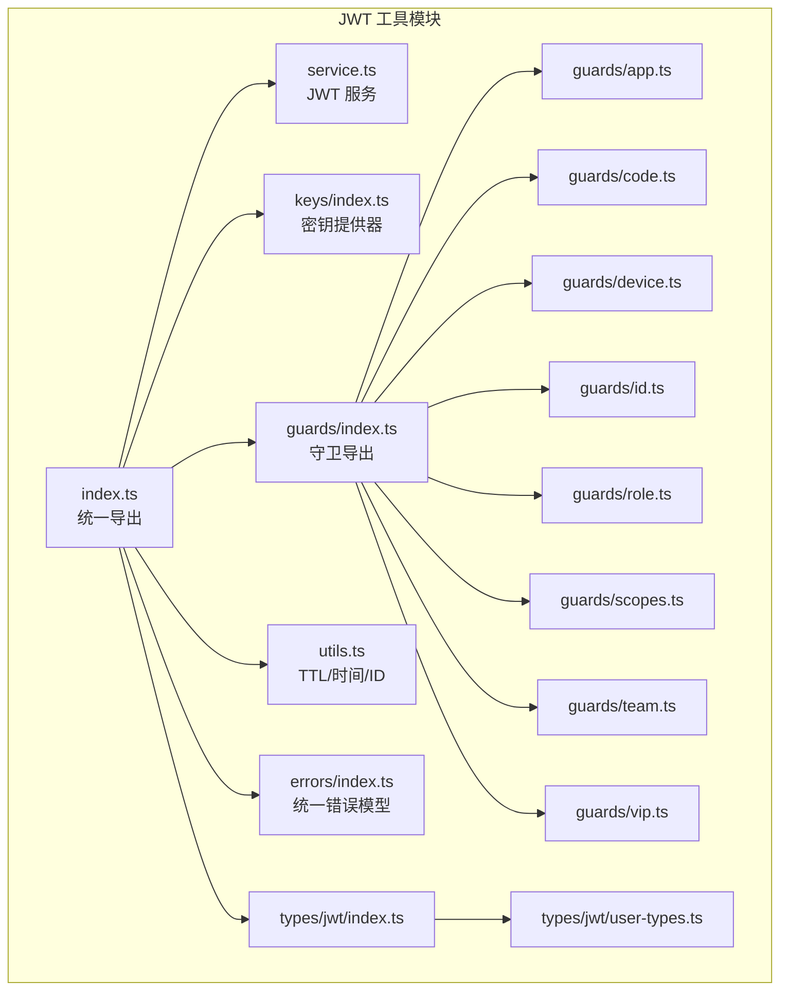
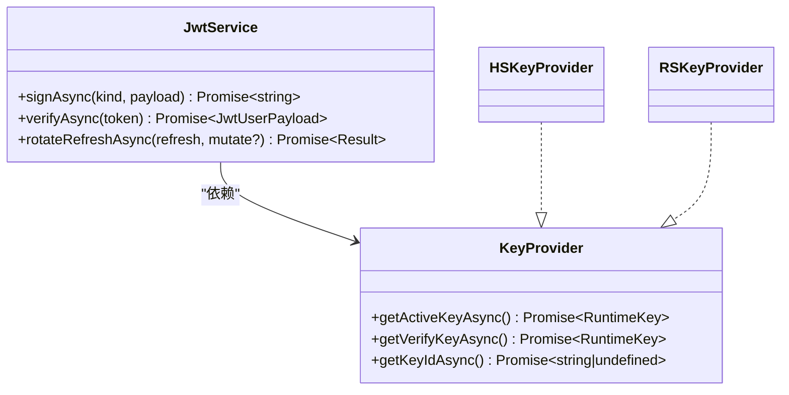
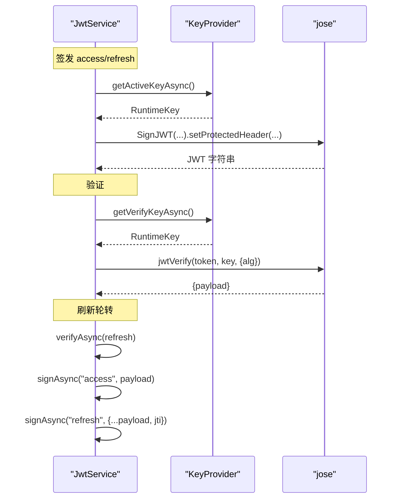
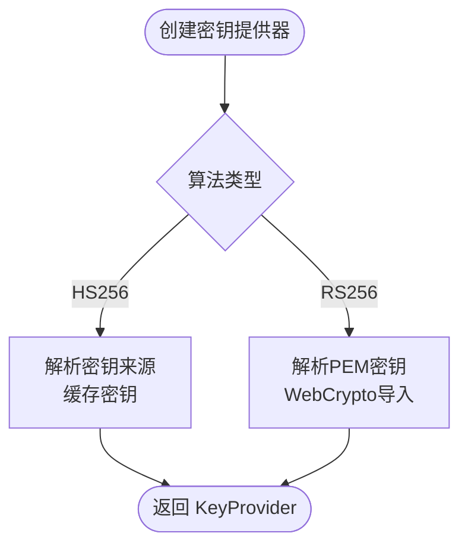
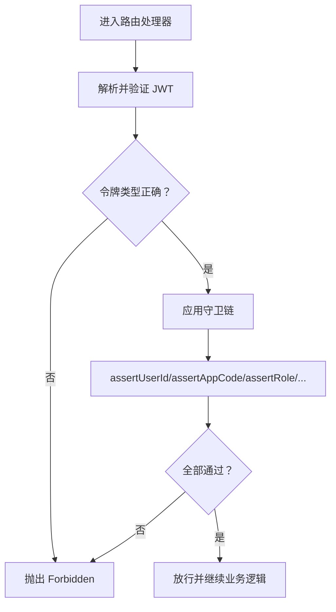
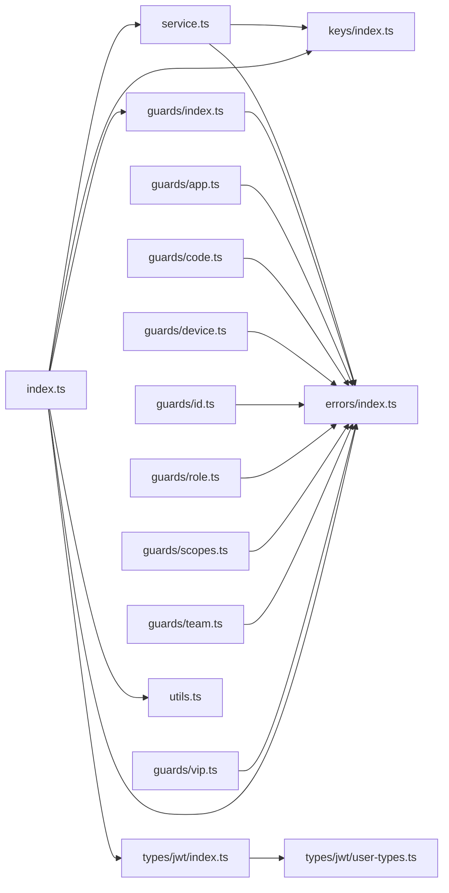

# JWT工具

<cite>
**本文引用的文件**
- [src/tools/jwt/index.ts](file://src/tools/jwt/index.ts)
- [src/tools/jwt/service.ts](file://src/tools/jwt/service.ts)
- [src/tools/jwt/utils.ts](file://src/tools/jwt/utils.ts)
- [src/tools/jwt/keys/index.ts](file://src/tools/jwt/keys/index.ts)
- [src/tools/jwt/errors/index.ts](file://src/tools/jwt/errors/index.ts)
- [src/tools/jwt/guards/index.ts](file://src/tools/jwt/guards/index.ts)
- [src/tools/jwt/guards/app.ts](file://src/tools/jwt/guards/app.ts)
- [src/tools/jwt/guards/code.ts](file://src/tools/jwt/guards/code.ts)
- [src/tools/jwt/guards/device.ts](file://src/tools/jwt/guards/device.ts)
- [src/tools/jwt/guards/id.ts](file://src/tools/jwt/guards/id.ts)
- [src/tools/jwt/guards/role.ts](file://src/tools/jwt/guards/role.ts)
- [src/tools/jwt/guards/scopes.ts](file://src/tools/jwt/guards/scopes.ts)
- [src/tools/jwt/guards/team.ts](file://src/tools/jwt/guards/team.ts)
- [src/tools/jwt/guards/vip.ts](file://src/tools/jwt/guards/vip.ts)
- [src/types/jwt/index.ts](file://src/types/jwt/index.ts)
- [src/types/jwt/user-types.ts](file://src/types/jwt/user-types.ts)
</cite>

## 目录
1. [简介](#简介)
2. [项目结构](#项目结构)
3. [核心组件](#核心组件)
4. [架构总览](#架构总览)
5. [详细组件分析](#详细组件分析)
6. [依赖关系分析](#依赖关系分析)
7. [性能考量](#性能考量)
8. [故障排查指南](#故障排查指南)
9. [结论](#结论)
10. [附录](#附录)

## 简介
本文件为 IM-API 的 JWT 工具模块技术文档，覆盖以下主题：
- JWT 服务的实现：令牌签发、验证、刷新轮转流程与配置项
- 权限守卫体系：app、code、device、id、role、scopes、team、vip 八类守卫的使用场景与验证逻辑
- 环境配置与密钥管理：HS256/RS256 算法选择、密钥来源与安全配置
- 生命周期与安全策略：令牌长期有效、刷新策略、并发访问控制建议
- 错误处理机制：统一错误模型与序列化输出
- 使用示例：如何在路由中应用不同守卫进行权限控制

## 项目结构
JWT 工具模块位于 src/tools/jwt 下，采用按功能分层组织：
- 服务层：service.ts 提供签发、验证、刷新能力
- 密钥层：keys/index.ts 提供 HS/RS 密钥提供器与工厂
- 守卫层：guards/* 提供八类权限断言函数
- 工具层：utils.ts 提供 TTL 解析、时间戳与随机 ID
- 错误层：errors/index.ts 提供统一错误模型
- 类型层：types/jwt/* 提供载荷、算法、密钥等类型定义
- 统一导出：index.ts 汇总导出服务、密钥、守卫、错误、工具与类型

图表来源
- [src/tools/jwt/index.ts](file://src/tools/jwt/index.ts#L1-L107)
- [src/tools/jwt/service.ts](file://src/tools/jwt/service.ts#L1-L98)
- [src/tools/jwt/keys/index.ts](file://src/tools/jwt/keys/index.ts#L1-L286)
- [src/tools/jwt/guards/index.ts](file://src/tools/jwt/guards/index.ts#L1-L19)
- [src/tools/jwt/guards/app.ts](file://src/tools/jwt/guards/app.ts#L1-L29)
- [src/tools/jwt/guards/code.ts](file://src/tools/jwt/guards/code.ts#L1-L32)
- [src/tools/jwt/guards/device.ts](file://src/tools/jwt/guards/device.ts#L1-L36)
- [src/tools/jwt/guards/id.ts](file://src/tools/jwt/guards/id.ts#L1-L31)
- [src/tools/jwt/guards/role.ts](file://src/tools/jwt/guards/role.ts#L1-L31)
- [src/tools/jwt/guards/scopes.ts](file://src/tools/jwt/guards/scopes.ts#L1-L30)
- [src/tools/jwt/guards/team.ts](file://src/tools/jwt/guards/team.ts#L1-L30)
- [src/tools/jwt/guards/vip.ts](file://src/tools/jwt/guards/vip.ts#L1-L30)
- [src/tools/jwt/utils.ts](file://src/tools/jwt/utils.ts#L1-L67)
- [src/tools/jwt/errors/index.ts](file://src/tools/jwt/errors/index.ts#L1-L288)
- [src/types/jwt/index.ts](file://src/types/jwt/index.ts#L1-L24)
- [src/types/jwt/user-types.ts](file://src/types/jwt/user-types.ts#L1-L64)

章节来源
- [src/tools/jwt/index.ts](file://src/tools/jwt/index.ts#L1-L107)
- [src/types/jwt/index.ts](file://src/types/jwt/index.ts#L1-L24)

## 核心组件
- JwtService：封装签发、验证、刷新轮转逻辑，基于 jose 库实现 HS256/RS256
- KeyProvider：密钥提供器抽象，支持 HS/RS 两种算法
- 守卫函数族：针对业务编码、用户ID、角色、团队、VIP、设备绑定、作用域等断言
- 工具函数：TTL 解析、当前时间戳、短 ID 与随机 ID
- 错误模型：统一错误码与可序列化错误对象

章节来源
- [src/tools/jwt/service.ts](file://src/tools/jwt/service.ts#L24-L98)
- [src/tools/jwt/keys/index.ts](file://src/tools/jwt/keys/index.ts#L144-L286)
- [src/tools/jwt/guards/index.ts](file://src/tools/jwt/guards/index.ts#L1-L19)
- [src/tools/jwt/utils.ts](file://src/tools/jwt/utils.ts#L17-L67)
- [src/tools/jwt/errors/index.ts](file://src/tools/jwt/errors/index.ts#L12-L288)

## 架构总览
JWT 工具模块通过“服务-密钥-守卫-类型-错误”五层协作完成认证与授权：
- 服务层负责令牌生命周期管理
- 密钥层负责算法与密钥来源解析
- 守卫层负责细粒度权限断言
- 类型层提供强类型约束
- 错误层提供一致的错误语义与序列化

图表来源
- [src/tools/jwt/service.ts](file://src/tools/jwt/service.ts#L24-L98)
- [src/tools/jwt/keys/index.ts](file://src/tools/jwt/keys/index.ts#L144-L286)

## 详细组件分析

### JWT 服务（JwtService）
- 签发 signAsync
  - 自动注入 tokenType、iat、jti，并根据配置设置 kid
  - 支持 HS256/RS256 算法，长期有效（不设置 exp）
- 验证 verifyAsync
  - 使用对应算法密钥验证签名，区分过期与无效错误
- 刷新 rotateRefreshAsync
  - 仅接受 refresh 类型令牌，签发新的 access 与 refresh，并更新 jti

图表来源
- [src/tools/jwt/service.ts](file://src/tools/jwt/service.ts#L34-L96)
- [src/tools/jwt/keys/index.ts](file://src/tools/jwt/keys/index.ts#L161-L174)

章节来源
- [src/tools/jwt/service.ts](file://src/tools/jwt/service.ts#L24-L98)

### 密钥提供器（KeyProvider）
- HS256
  - 支持从 secret、环境变量、文件三种来源解析密钥
  - 缓存密钥以减少重复解析
- RS256
  - 支持从私钥/公钥 PEM 环境变量或文件解析
  - 使用 WebCrypto 导入为 CryptoKey
- 工厂 createKeyProvider
  - 根据算法类型返回对应 KeyProvider 实例

图表来源
- [src/tools/jwt/keys/index.ts](file://src/tools/jwt/keys/index.ts#L125-L174)
- [src/tools/jwt/keys/index.ts](file://src/tools/jwt/keys/index.ts#L186-L254)
- [src/tools/jwt/keys/index.ts](file://src/tools/jwt/keys/index.ts#L267-L285)

章节来源
- [src/tools/jwt/keys/index.ts](file://src/tools/jwt/keys/index.ts#L1-L286)

### 权限守卫体系
- assertTokenKind：断言令牌类型为 access 或 refresh
- assertAppCode：断言业务编码 appid
- assertUserCode：断言业务标识 code
- assertDevice：断言设备绑定（启用时强制匹配）
- assertUserId：断言用户主体 ID（sub）
- assertRole：断言角色 ID 在允许集合内
- assertScopes：断言至少包含一个所需作用域
- assertTeam：断言团队 ID 在允许集合内
- assertVip：断言用户为 VIP

图表来源
- [src/tools/jwt/guards/index.ts](file://src/tools/jwt/guards/index.ts#L13-L18)
- [src/tools/jwt/guards/app.ts](file://src/tools/jwt/guards/app.ts#L20-L28)
- [src/tools/jwt/guards/code.ts](file://src/tools/jwt/guards/code.ts#L25-L31)
- [src/tools/jwt/guards/device.ts](file://src/tools/jwt/guards/device.ts#L25-L35)
- [src/tools/jwt/guards/id.ts](file://src/tools/jwt/guards/id.ts#L25-L30)
- [src/tools/jwt/guards/role.ts](file://src/tools/jwt/guards/role.ts#L25-L30)
- [src/tools/jwt/guards/scopes.ts](file://src/tools/jwt/guards/scopes.ts#L23-L29)
- [src/tools/jwt/guards/team.ts](file://src/tools/jwt/guards/team.ts#L24-L29)
- [src/tools/jwt/guards/vip.ts](file://src/tools/jwt/guards/vip.ts#L24-L29)

章节来源
- [src/tools/jwt/guards/index.ts](file://src/tools/jwt/guards/index.ts#L1-L19)
- [src/tools/jwt/guards/app.ts](file://src/tools/jwt/guards/app.ts#L1-L29)
- [src/tools/jwt/guards/code.ts](file://src/tools/jwt/guards/code.ts#L1-L32)
- [src/tools/jwt/guards/device.ts](file://src/tools/jwt/guards/device.ts#L1-L36)
- [src/tools/jwt/guards/id.ts](file://src/tools/jwt/guards/id.ts#L1-L31)
- [src/tools/jwt/guards/role.ts](file://src/tools/jwt/guards/role.ts#L1-L31)
- [src/tools/jwt/guards/scopes.ts](file://src/tools/jwt/guards/scopes.ts#L1-L30)
- [src/tools/jwt/guards/team.ts](file://src/tools/jwt/guards/team.ts#L1-L30)
- [src/tools/jwt/guards/vip.ts](file://src/tools/jwt/guards/vip.ts#L1-L30)

### 工具函数
- ttlToSeconds：解析 "15m"|"7d"|"3600s"|"1h" 或纯数字秒
- nowSec：当前秒级时间戳
- shortId/nanoid：生成短 ID 与随机 ID

章节来源
- [src/tools/jwt/utils.ts](file://src/tools/jwt/utils.ts#L17-L67)

### 错误处理
- 统一错误码：缺失令牌、格式错误、无效、过期、禁止、设备不匹配、撤销、算法不支持、业务/验证错误等
- AuthError：可序列化、可日志化的错误对象，提供 toJSON 与 toLogEntry
- 类型守卫 isAuthError 与 serializeUnknown

章节来源
- [src/tools/jwt/errors/index.ts](file://src/tools/jwt/errors/index.ts#L29-L288)

### 类型定义
- TokenKind：令牌类型（access/refresh）
- UserState：用户状态（active/deleted）
- JwtUserPayload：业务载荷字段（sub、roleId、vip、teamId、scope、deviceId、jti、iat、exp 等）
- KeyProvider 接口与密钥工厂选项

章节来源
- [src/types/jwt/user-types.ts](file://src/types/jwt/user-types.ts#L9-L64)
- [src/types/jwt/index.ts](file://src/types/jwt/index.ts#L9-L24)

## 依赖关系分析
- JwtService 依赖 KeyProvider 与错误模型
- 守卫函数依赖错误模型与类型定义
- 工具函数为纯函数，无副作用
- keys/index.ts 依赖 Node 内置 fs/promises 与 webcrypto

图表来源
- [src/tools/jwt/index.ts](file://src/tools/jwt/index.ts#L75-L106)
- [src/tools/jwt/service.ts](file://src/tools/jwt/service.ts#L14-L21)
- [src/tools/jwt/keys/index.ts](file://src/tools/jwt/keys/index.ts#L8-L22)
- [src/tools/jwt/guards/index.ts](file://src/tools/jwt/guards/index.ts#L1-L12)
- [src/tools/jwt/utils.ts](file://src/tools/jwt/utils.ts#L11-L12)
- [src/types/jwt/index.ts](file://src/types/jwt/index.ts#L9-L24)

章节来源
- [src/tools/jwt/index.ts](file://src/tools/jwt/index.ts#L1-L107)

## 性能考量
- 密钥缓存：HS/RS 提供器内部缓存密钥，避免重复 I/O 与导入
- 纯函数工具：TTL 解析、ID 生成为 O(1) 或线性于输入长度，无 I/O
- 验证开销：jose jwtVerify 为 CPU 密集型，建议配合速率限制与缓存策略
- 刷新策略：当前实现不设置 exp，需结合业务侧的并发控制与黑名单策略

## 故障排查指南
- 常见错误与处理
  - 缺少令牌：抛出缺失令牌错误
  - 格式错误：抛出格式错误
  - 无效令牌：抛出无效错误
  - 令牌过期：抛出过期错误
  - 设备不匹配：抛出设备不匹配错误
  - 令牌已撤销：抛出撤销错误
  - 禁止访问：角色/团队/作用域/用户ID 等断言失败
- 排查步骤
  - 确认算法与密钥来源配置正确
  - 检查令牌类型是否为 access/refresh
  - 核对 payload 字段（sub、roleId、teamId、scope、deviceId 等）
  - 查看错误码与状态码，定位具体环节

章节来源
- [src/tools/jwt/errors/index.ts](file://src/tools/jwt/errors/index.ts#L46-L63)
- [src/tools/jwt/service.ts](file://src/tools/jwt/service.ts#L66-L75)
- [src/tools/jwt/guards/index.ts](file://src/tools/jwt/guards/index.ts#L13-L18)

## 结论
本模块提供了简洁而强大的 JWT 能力：支持 HS256/RS256、统一错误模型、强类型载荷、灵活的权限守卫与实用工具函数。当前实现采用长期有效的 access 令牌与刷新轮转机制，建议结合业务场景补充设备绑定、黑名单与速率限制等安全策略。

## 附录

### 环境配置与密钥管理
- 算法选择
  - HS256：使用对称密钥，适合单机或简单部署
  - RS256：使用 RSA 非对称密钥，适合分布式与多节点部署
- 密钥来源
  - HS256：secret、环境变量、文件三者之一
  - RS256：私钥/公钥 PEM 通过环境变量或文件提供
- 安全配置
  - 算法、访问令牌 TTL、刷新令牌 TTL、设备绑定开关、Redis 黑名单开关（当前默认关闭）

章节来源
- [src/tools/jwt/index.ts](file://src/tools/jwt/index.ts#L75-L106)
- [src/tools/jwt/keys/index.ts](file://src/tools/jwt/keys/index.ts#L125-L142)
- [src/tools/jwt/keys/index.ts](file://src/tools/jwt/keys/index.ts#L186-L220)

### 令牌生命周期与安全策略
- 生命周期
  - access：长期有效（不设置 exp），由业务侧控制并发与撤销
  - refresh：用于轮转，每次轮转生成新的 jti
- 安全策略
  - 设备绑定：启用时要求 deviceId 匹配
  - 作用域与角色：通过守卫进行最小权限控制
  - 并发访问：建议结合 Redis 黑名单与速率限制

章节来源
- [src/tools/jwt/service.ts](file://src/tools/jwt/service.ts#L41-L56)
- [src/tools/jwt/service.ts](file://src/tools/jwt/service.ts#L86-L96)
- [src/tools/jwt/guards/device.ts](file://src/tools/jwt/guards/device.ts#L25-L35)

### 使用示例（路径指引）
- 在路由中使用守卫
  - 断言用户 ID：参考 [src/tools/jwt/guards/id.ts](file://src/tools/jwt/guards/id.ts#L25-L30)
  - 断言角色：参考 [src/tools/jwt/guards/role.ts](file://src/tools/jwt/guards/role.ts#L25-L30)
  - 断言团队：参考 [src/tools/jwt/guards/team.ts](file://src/tools/jwt/guards/team.ts#L24-L29)
  - 断言作用域：参考 [src/tools/jwt/guards/scopes.ts](file://src/tools/jwt/guards/scopes.ts#L23-L29)
  - 断言 VIP：参考 [src/tools/jwt/guards/vip.ts](file://src/tools/jwt/guards/vip.ts#L24-L29)
  - 断言业务编码：参考 [src/tools/jwt/guards/code.ts](file://src/tools/jwt/guards/code.ts#L25-L31) 与 [src/tools/jwt/guards/app.ts](file://src/tools/jwt/guards/app.ts#L20-L28)
  - 断言设备绑定：参考 [src/tools/jwt/guards/device.ts](file://src/tools/jwt/guards/device.ts#L25-L35)
- 创建服务实例
  - 参考 [src/tools/jwt/index.ts](file://src/tools/jwt/index.ts#L80-L106)
- 签发/验证/刷新
  - 参考 [src/tools/jwt/service.ts](file://src/tools/jwt/service.ts#L41-L96)