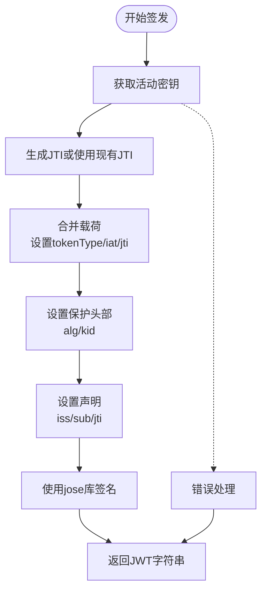

# JWT服务实现

<cite>
**本文档引用的文件**
- [src/tools/jwt/service.ts](file://src/tools/jwt/service.ts)
- [src/tools/jwt/index.ts](file://src/tools/jwt/index.ts)
- [src/services/auth.ts](file://src/services/auth.ts)
- [src/tools/jwt/keys/index.ts](file://src/tools/jwt/keys/index.ts)
- [src/tools/jwt/errors/index.ts](file://src/tools/jwt/errors/index.ts)
- [src/tools/jwt/utils.ts](file://src/tools/jwt/utils.ts)
- [src/tokens/jwt/user-types.ts](file://src/tokens/jwt/user-types.ts)
- [src/tokens/jwt/jwt-config.ts](file://src/tokens/jwt/jwt-config.ts)
- [src/tools/jwt/jwt-env/index.ts](file://src/tools/jwt/jwt-env/index.ts)
- [src/routes/auth.ts](file://src/routes/auth.ts)
- [src/middleware/auth/guards.ts](file://src/middleware/auth/guards.ts)
- [src/config/env/index.ts](file://src/config/env/index.ts)
</cite>

## 目录
1. [简介](#简介)
2. [项目结构](#项目结构)
3. [核心组件](#核心组件)
4. [架构概览](#架构概览)
5. [详细组件分析](#详细组件分析)
6. [依赖关系分析](#依赖关系分析)
7. [性能考虑](#性能考虑)
8. [故障排除指南](#故障排除指南)
9. [结论](#结论)

## 简介

本文档详细介绍了JWT服务实现的技术文档，深入解释了JwtService类的核心功能，包括令牌签发(signAsync)、验证(verifyAsync)和刷新轮转(rotateRefreshAsync)的完整实现流程。文档涵盖了JWT载荷结构、头部配置、签名算法选择和密钥管理机制，以及令牌生命周期管理的详细说明。

该JWT服务实现基于jose库，支持HS256和RS256两种签名算法，提供了完整的令牌生命周期管理功能，包括访问令牌和刷新令牌的签发、验证和轮转机制。

## 项目结构

JWT服务位于项目的工具模块中，采用分层架构设计：


**图表来源**
- [src/tools/jwt/service.ts](file://src/tools/jwt/service.ts#L1-L98)
- [src/tools/jwt/index.ts](file://src/tools/jwt/index.ts#L1-L107)

**章节来源**
- [src/tools/jwt/service.ts](file://src/tools/jwt/service.ts#L1-L98)
- [src/tools/jwt/index.ts](file://src/tools/jwt/index.ts#L1-L107)

## 核心组件

### JwtService类

JwtService是JWT服务的核心类，封装了完整的令牌管理功能：


**图表来源**
- [src/tools/jwt/service.ts](file://src/tools/jwt/service.ts#L27-L98)
- [src/tools/jwt/keys/index.ts](file://src/tools/jwt/keys/index.ts#L1-L286)

### JWT载荷结构

JWT载荷定义了标准化的用户信息结构：

| 字段名 | 类型 | 必填 | 描述 |
|--------|------|------|------|
| sub | string | 是 | 用户主体ID（用户主键） |
| roleId | string | 是 | 角色ID |
| vip | boolean | 是 | 是否为会员用户 |
| teamId | string \| null | 否 | 团队ID |
| teamRoleId | string \| null | 否 | 团队角色ID |
| telegramId | string \| null | 否 | 电报ID |
| status | UserState | 否 | 用户状态 |
| tokenType | TokenKind | 是 | 令牌类型（access/refresh） |
| scope | string[] | 否 | 作用域集合 |
| deviceId | string | 否 | 设备ID（启用绑定时存在） |
| jti | string | 否 | JWT唯一ID |
| iat | number | 否 | 签发时间（秒） |
| exp | number | 否 | 过期时间（秒） |

**章节来源**
- [src/tokens/jwt/user-types.ts](file://src/tokens/jwt/user-types.ts#L27-L64)

## 架构概览

JWT服务的整体架构采用工厂模式和策略模式相结合的设计：


**图表来源**
- [src/services/auth.ts](file://src/services/auth.ts#L45-L80)
- [src/tools/jwt/service.ts](file://src/tools/jwt/service.ts#L41-L56)

**章节来源**
- [src/services/auth.ts](file://src/services/auth.ts#L1-L170)
- [src/tools/jwt/service.ts](file://src/tools/jwt/service.ts#L1-L98)

## 详细组件分析

### 令牌签发流程 (signAsync)

令牌签发是JWT服务的核心功能，负责创建新的访问令牌和刷新令牌：



**图表来源**
- [src/tools/jwt/service.ts](file://src/tools/jwt/service.ts#L41-L56)

签发流程的关键特性：
- 自动设置iat（签发时间）和jti（唯一ID）
- 支持HS256和RS256算法
- 可选的kid（密钥ID）头部设置
- 不设置exp（长期有效）

**章节来源**
- [src/tools/jwt/service.ts](file://src/tools/jwt/service.ts#L33-L56)

### 令牌验证流程 (verifyAsync)

令牌验证确保JWT的有效性和完整性：


**图表来源**
- [src/tools/jwt/service.ts](file://src/tools/jwt/service.ts#L66-L75)

验证流程的错误处理：
- ERR_JWT_EXPIRED -> Expired错误
- 其他错误 -> Invalid错误
- 统一的AuthError异常格式

**章节来源**
- [src/tools/jwt/service.ts](file://src/tools/jwt/service.ts#L59-L75)

### 刷新轮转流程 (rotateRefreshAsync)

刷新轮转机制提供了安全的令牌续期功能：

```mermaid
flowchart TD
Start([开始刷新]) --> Verify[验证刷新令牌]
Verify --> CheckType{tokenType == "refresh"?}
CheckType --> |否| ThrowError[抛出Forbidden错误]
CheckType --> |是| Mutate[应用载荷变换]
Mutate --> SignAccess[签发新access令牌]
SignAccess --> SignRefresh[签发新refresh令牌<br/>生成新jti]
SignRefresh --> Return[返回新令牌对]
Verify -.-> Error[验证失败]
Error --> ThrowError
```

**图表来源**
- [src/tools/jwt/service.ts](file://src/tools/jwt/service.ts#L86-L96)

刷新流程的安全特性：
- 强制要求tokenType为"refresh"
- 自动更新refresh令牌的jti
- 支持可选的载荷变换回调

**章节来源**
- [src/tools/jwt/service.ts](file://src/tools/jwt/service.ts#L78-L96)

### 密钥管理机制

系统支持两种密钥管理方式：

#### HS256对称密钥
- 支持直接密钥、环境变量、文件三种来源
- 密钥缓存机制避免重复加载
- 支持可选的kid标识

#### RS256非对称密钥
- 使用PKCS#8私钥和SPKI公钥格式
- 支持PEM文本和文件两种来源
- CryptoKey缓存提高性能

**章节来源**
- [src/tools/jwt/keys/index.ts](file://src/tools/jwt/keys/index.ts#L125-L174)
- [src/tools/jwt/keys/index.ts](file://src/tools/jwt/keys/index.ts#L232-L255)

### 环境配置管理

JWT服务通过环境变量进行配置管理：

| 环境变量 | 默认值 | 描述 |
|----------|--------|------|
| JWT_ALGORITHM | HS256 | 签名算法（HS256/RS256） |
| JWT_ACCESS_TTL | 15m | 访问令牌有效期 |
| JWT_REFRESH_TTL | 7d | 刷新令牌有效期 |
| JWT_SECRET | dev-secret | HS256密钥 |
| JWT_PRIVATE_KEY_PATH | 无 | RS256私钥文件路径 |
| JWT_PUBLIC_KEY_PATH | 无 | RS256公钥文件路径 |

**章节来源**
- [src/tools/jwt/jwt-env/index.ts](file://src/tools/jwt/jwt-env/index.ts#L19-L52)
- [src/config/env/index.ts](file://src/config/env/index.ts#L173-L173)

## 依赖关系分析

JWT服务的依赖关系图：


**图表来源**
- [src/tools/jwt/service.ts](file://src/tools/jwt/service.ts#L15-L21)
- [src/tools/jwt/index.ts](file://src/tools/jwt/index.ts#L75-L106)

**章节来源**
- [src/tools/jwt/service.ts](file://src/tools/jwt/service.ts#L1-L98)
- [src/tools/jwt/index.ts](file://src/tools/jwt/index.ts#L1-L107)

## 性能考虑

### 缓存策略
- 密钥缓存：HS密钥和RSA密钥在内存中缓存，避免重复I/O操作
- CryptoKey缓存：RSA密钥的CryptoKey对象缓存，提高签名和验证性能

### 内存优化
- 使用Web Crypto API替代OpenSSL，减少内存占用
- 按需加载密钥文件，避免启动时的I/O阻塞

### 并发处理
- 异步密钥加载支持并发场景
- 无状态设计便于水平扩展

## 故障排除指南

### 常见错误类型

| 错误码 | 描述 | 处理方案 |
|--------|------|----------|
| MISSING_TOKEN | 缺少令牌 | 检查Authorization头是否正确设置 |
| MALFORMED | 令牌格式错误 | 验证JWT格式是否符合标准 |
| INVALID | 无效令牌 | 检查密钥配置和算法设置 |
| EXPIRED | 令牌过期 | 使用刷新令牌获取新令牌 |
| FORBIDDEN | 禁止访问 | 确认令牌类型为refresh |
| DEVICE_MISMATCH | 设备不匹配 | 检查设备绑定配置 |
| REVOKED | 令牌已撤销 | 实现黑名单机制 |

### 调试建议

1. **启用详细日志**：使用AuthError.toLogEntry()获取完整的错误上下文
2. **验证环境配置**：确认JWT_ALGORITHM和相关密钥配置正确
3. **检查密钥格式**：确保PEM文件格式正确且无多余字符
4. **测试令牌生命周期**：验证iat和exp字段的计算逻辑

**章节来源**
- [src/tools/jwt/errors/index.ts](file://src/tools/jwt/errors/index.ts#L46-L63)
- [src/tools/jwt/errors/index.ts](file://src/tools/jwt/errors/index.ts#L75-L142)

## 结论

该JWT服务实现提供了完整的令牌管理解决方案，具有以下特点：

**安全性优势**：
- 支持HS256和RS256两种算法
- 完整的错误处理和异常管理
- 设备绑定和黑名单机制预留
- 环境变量驱动的安全配置

**性能优化**：
- 密钥缓存机制
- Web Crypto API的高效实现
- 异步I/O操作
- 内存友好的设计

**易用性**：
- 简洁的API接口
- 完善的类型定义
- 详细的错误信息
- 灵活的配置选项

该实现适合生产环境使用，可根据具体需求进行定制和扩展。