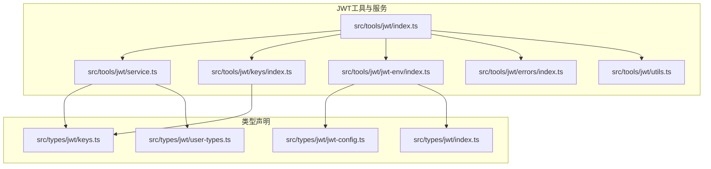
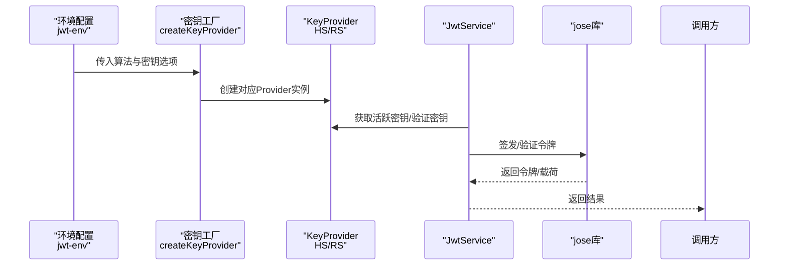
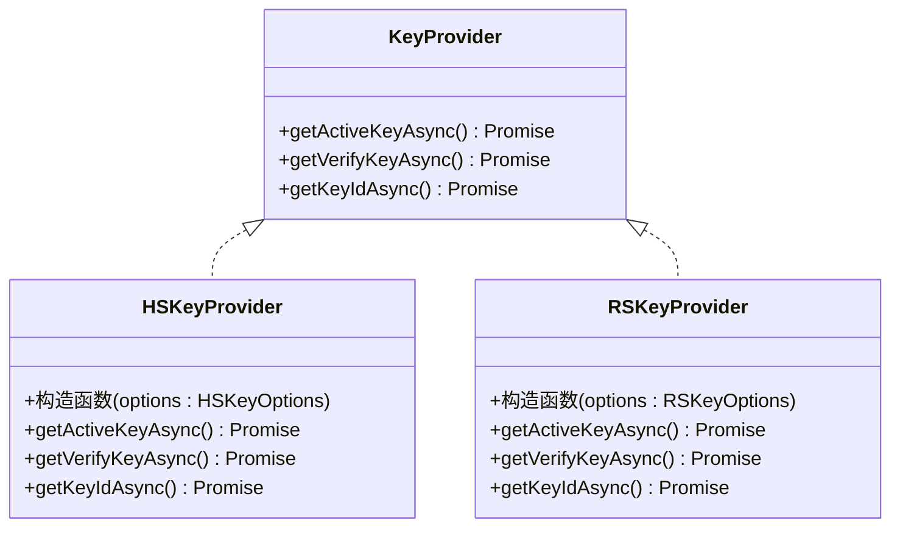
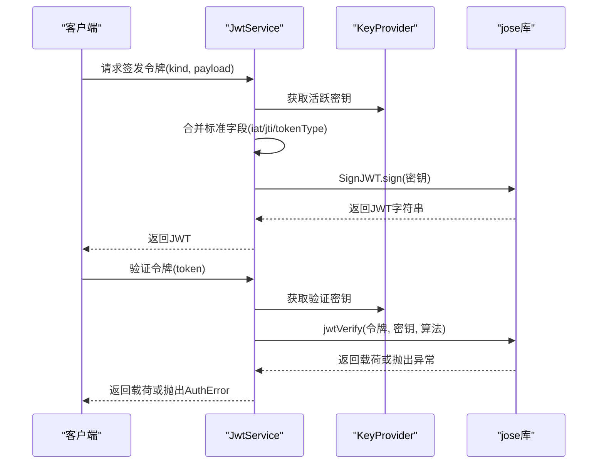
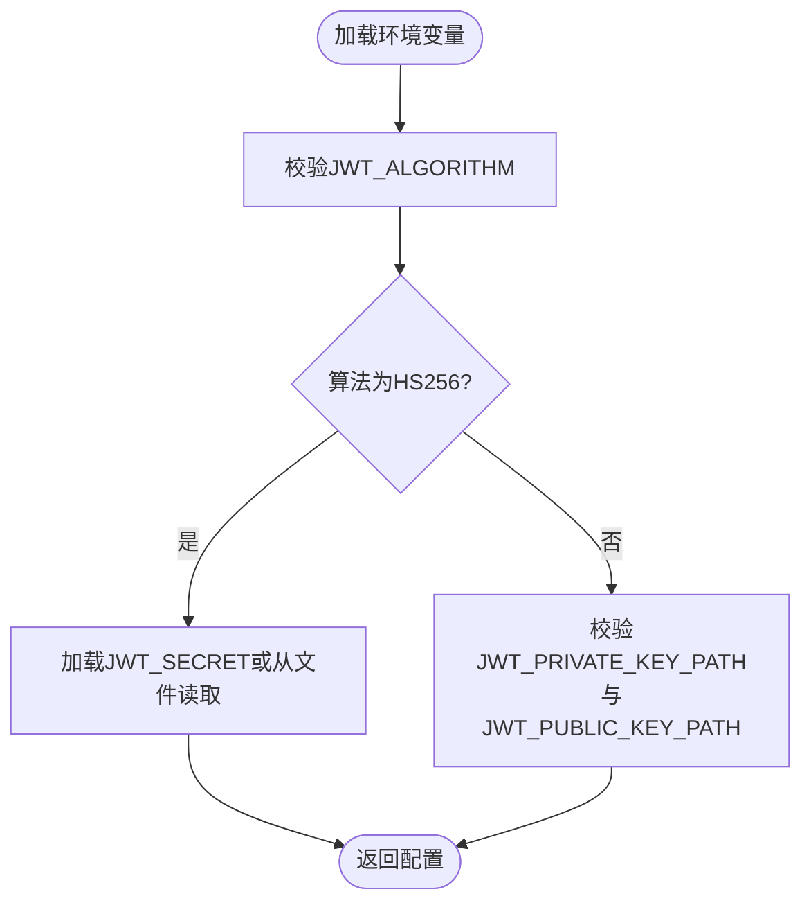
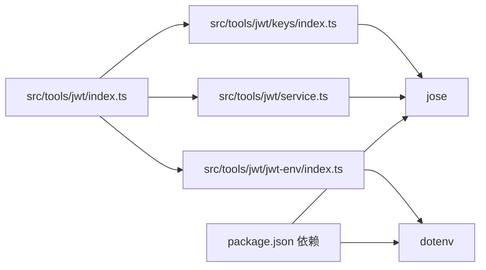
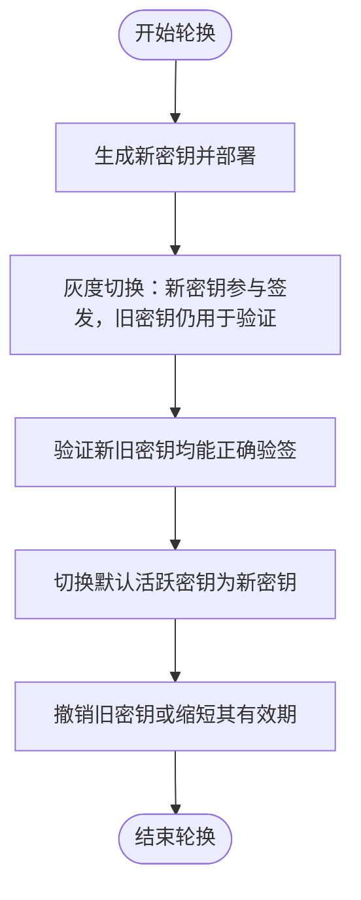

# 密钥管理

<cite>
**本文引用的文件**
- [src/tools/jwt/index.ts](file://src/tools/jwt/index.ts)
- [src/tools/jwt/service.ts](file://src/tools/jwt/service.ts)
- [src/tools/jwt/keys/index.ts](file://src/tools/jwt/keys/index.ts)
- [src/tools/jwt/jwt-env/index.ts](file://src/tools/jwt/jwt-env/index.ts)
- [src/tools/jwt/jwt-env/types.ts](file://src/tools/jwt/jwt-env/types.ts)
- [src/tools/jwt/errors/index.ts](file://src/tools/jwt/errors/index.ts)
- [src/tools/jwt/utils.ts](file://src/tools/jwt/utils.ts)
- [src/types/jwt/index.ts](file://src/types/jwt/index.ts)
- [src/types/jwt/keys.ts](file://src/types/jwt/keys.ts)
- [src/types/jwt/jwt-config.ts](file://src/types/jwt/jwt-config.ts)
- [src/types/jwt/user-types.ts](file://src/types/jwt/user-types.ts)
- [src/server.ts](file://src/server.ts)
- [package.json](file://package.json)
</cite>

## 目录
1. [简介](#简介)
2. [项目结构](#项目结构)
3. [核心组件](#核心组件)
4. [架构总览](#架构总览)
5. [组件详解](#组件详解)
6. [依赖关系分析](#依赖关系分析)
7. [性能与安全考量](#性能与安全考量)
8. [故障排查指南](#故障排查指南)
9. [结论](#结论)
10. [附录](#附录)

## 简介
本文件面向JWT密钥管理系统，围绕KeyProvider接口设计与实现展开，系统性阐述密钥轮换、密钥验证与密钥获取的完整流程；文档化JWT环境配置（算法选择、密钥格式、密钥存储与轮换策略）；对比对称密钥（HS256）与非对称密钥（RS256）的使用场景与安全考虑；给出密钥生成、部署与管理最佳实践；覆盖密钥轮换流程、故障恢复机制与安全审计要点，并延伸到密钥生命周期管理与多环境部署策略。

## 项目结构
该模块位于src/tools/jwt目录，采用“按功能分层+类型声明分离”的组织方式：
- 工具与服务层：服务封装、密钥提供器、环境配置、工具函数与错误模型
- 类型声明层：统一导出入口与核心类型定义
- 顶层聚合导出：对外暴露服务、密钥提供器、守卫、错误与工具

图表来源
- [src/tools/jwt/index.ts](file://src/tools/jwt/index.ts#L1-L107)
- [src/tools/jwt/service.ts](file://src/tools/jwt/service.ts#L1-L98)
- [src/tools/jwt/keys/index.ts](file://src/tools/jwt/keys/index.ts#L1-L286)
- [src/tools/jwt/jwt-env/index.ts](file://src/tools/jwt/jwt-env/index.ts#L1-L52)
- [src/tools/jwt/errors/index.ts](file://src/tools/jwt/errors/index.ts#L1-L288)
- [src/tools/jwt/utils.ts](file://src/tools/jwt/utils.ts#L1-L67)
- [src/types/jwt/index.ts](file://src/types/jwt/index.ts#L1-L24)
- [src/types/jwt/keys.ts](file://src/types/jwt/keys.ts#L1-L118)
- [src/types/jwt/jwt-config.ts](file://src/types/jwt/jwt-config.ts#L1-L13)
- [src/types/jwt/user-types.ts](file://src/types/jwt/user-types.ts#L1-L64)

章节来源
- [src/tools/jwt/index.ts](file://src/tools/jwt/index.ts#L1-L107)
- [src/types/jwt/index.ts](file://src/types/jwt/index.ts#L1-L24)

## 核心组件
- KeyProvider接口：抽象密钥来源与算法差异，向上层屏蔽底层细节，提供获取活跃密钥与验证密钥的能力，并可选提供密钥ID。
- HS密钥提供器：基于对称密钥（HS256），支持从字符串、环境变量或文件中解析密钥，内部缓存以提升性能。
- RS密钥提供器：基于非对称密钥（RS256），支持从环境变量或文件中解析PEM格式的私钥与公钥，通过WebCrypto导入为CryptoKey并缓存。
- JwtService：封装签发、验证与刷新轮转逻辑，依赖KeyProvider与安全配置。
- 环境配置：从环境变量加载并校验JWT配置，支持HS256与RS256两种算法。
- 错误模型：统一的认证错误类型与工厂方法，便于序列化与日志记录。
- 工具函数：TTL解析、时间戳、短ID与随机ID生成等。

章节来源
- [src/types/jwt/keys.ts](file://src/types/jwt/keys.ts#L38-L48)
- [src/tools/jwt/keys/index.ts](file://src/tools/jwt/keys/index.ts#L150-L174)
- [src/tools/jwt/keys/index.ts](file://src/tools/jwt/keys/index.ts#L228-L255)
- [src/tools/jwt/service.ts](file://src/tools/jwt/service.ts#L27-L98)
- [src/tools/jwt/jwt-env/index.ts](file://src/tools/jwt/jwt-env/index.ts#L19-L52)
- [src/tools/jwt/errors/index.ts](file://src/tools/jwt/errors/index.ts#L75-L142)
- [src/tools/jwt/utils.ts](file://src/tools/jwt/utils.ts#L24-L66)

## 架构总览
下图展示从环境配置到密钥提供器再到JWT服务的整体调用链路与职责边界：

图表来源
- [src/tools/jwt/jwt-env/index.ts](file://src/tools/jwt/jwt-env/index.ts#L79-L106)
- [src/tools/jwt/keys/index.ts](file://src/tools/jwt/keys/index.ts#L267-L285)
- [src/tools/jwt/service.ts](file://src/tools/jwt/service.ts#L41-L75)

## 组件详解

### KeyProvider接口与实现
KeyProvider抽象了密钥来源与算法差异，确保上层无需关心密钥来自何处以及如何导入。其能力包括：
- 获取活跃密钥：用于签名
- 获取验证密钥：用于验签
- 可选获取密钥ID：用于头部kid标识

HS密钥提供器实现要点：
- 支持从字符串、环境变量或文件解析对称密钥
- 内部缓存密钥，避免重复I/O
- 返回Uint8Array作为运行时密钥

RS密钥提供器实现要点：
- 支持从环境变量或文件解析PEM私钥与公钥
- 使用WebCrypto导入为CryptoKey并缓存
- 返回CryptoKey作为运行时密钥

图表来源
- [src/types/jwt/keys.ts](file://src/types/jwt/keys.ts#L38-L48)
- [src/tools/jwt/keys/index.ts](file://src/tools/jwt/keys/index.ts#L150-L174)
- [src/tools/jwt/keys/index.ts](file://src/tools/jwt/keys/index.ts#L228-L255)

章节来源
- [src/types/jwt/keys.ts](file://src/types/jwt/keys.ts#L38-L48)
- [src/tools/jwt/keys/index.ts](file://src/tools/jwt/keys/index.ts#L150-L174)
- [src/tools/jwt/keys/index.ts](file://src/tools/jwt/keys/index.ts#L228-L255)

### JwtService：签发、验证与刷新轮转
JwtService封装了完整的令牌生命周期操作：
- 签发：合并业务载荷，注入tokenType、iat、jti等标准字段，使用活跃密钥签名
- 验证：使用验证密钥进行验签，捕获过期等异常并映射为统一错误
- 刷新轮转：校验旧refresh token，生成新的access与refresh token

图表来源
- [src/tools/jwt/service.ts](file://src/tools/jwt/service.ts#L41-L75)

章节来源
- [src/tools/jwt/service.ts](file://src/tools/jwt/service.ts#L27-L98)

### 环境配置与密钥来源
环境配置模块负责从进程环境变量加载并校验JWT配置：
- 算法选择：HS256或RS256
- 令牌有效期：访问令牌与刷新令牌TTL
- 密钥来源：对称密钥（字符串/环境变量/文件）或非对称密钥（PEM文件）

图表来源
- [src/tools/jwt/jwt-env/index.ts](file://src/tools/jwt/jwt-env/index.ts#L19-L45)

章节来源
- [src/tools/jwt/jwt-env/index.ts](file://src/tools/jwt/jwt-env/index.ts#L19-L52)
- [src/tools/jwt/jwt-env/types.ts](file://src/tools/jwt/jwt-env/types.ts#L18-L25)

### 错误模型与统一响应
错误模型提供统一的错误码、错误对象与序列化能力，便于在服务层与网关层一致处理与记录。

章节来源
- [src/tools/jwt/errors/index.ts](file://src/tools/jwt/errors/index.ts#L46-L142)

### 工具函数
- TTL解析：支持“15m”、“7d”、“3600s”、“1h”等格式，或纯数字秒字符串
- 时间戳：当前秒级时间戳
- ID生成：短ID与随机ID，满足不同场景的唯一性需求

章节来源
- [src/tools/jwt/utils.ts](file://src/tools/jwt/utils.ts#L24-L66)

## 依赖关系分析
- 运行时依赖：jose库用于JWT签发与验证；dotenv用于加载环境变量
- 内部依赖：JwtService依赖KeyProvider与安全配置；KeyProvider由工厂根据算法创建；环境配置驱动密钥提供器初始化

图表来源
- [package.json](file://package.json#L12-L23)
- [src/tools/jwt/index.ts](file://src/tools/jwt/index.ts#L75-L106)

章节来源
- [package.json](file://package.json#L12-L23)
- [src/tools/jwt/index.ts](file://src/tools/jwt/index.ts#L75-L106)

## 性能与安全考量
- 性能
  - 密钥缓存：HS与RS提供器均内置缓存，避免重复I/O与导入开销
  - WebCrypto：RS密钥通过WebCrypto导入并缓存，减少重复导入成本
  - ID生成：短ID与随机ID使用加密随机源，兼顾性能与安全性
- 安全
  - 算法选择：HS256适合单体应用或内部服务；RS256适合跨服务与分布式场景
  - 密钥存储：建议使用环境变量或受控文件，避免硬编码
  - 令牌有效期：合理设置访问与刷新令牌TTL，降低泄露风险
  - 设备绑定与黑名单：安全配置接口预留扩展点，可根据需要启用

[本节为通用指导，不直接分析具体文件]

## 故障排查指南
- 常见错误与定位
  - 令牌无效/过期：验证阶段捕获特定错误并映射为统一错误类型
  - 缺少令牌/格式错误：在请求处理层进行前置校验
  - 禁止访问：当令牌类型非refresh时拒绝刷新轮转
- 排查步骤
  - 确认环境变量配置正确且算法与密钥来源匹配
  - 检查密钥文件权限与PEM格式
  - 核对TTL配置与当前时间戳
  - 查看错误对象的序列化与日志条目，定位具体原因

章节来源
- [src/tools/jwt/errors/index.ts](file://src/tools/jwt/errors/index.ts#L75-L142)
- [src/tools/jwt/service.ts](file://src/tools/jwt/service.ts#L66-L96)

## 结论
该JWT密钥管理系统通过KeyProvider接口实现了对称与非对称密钥的统一抽象，结合环境配置与工厂模式，提供了灵活、可扩展且安全的密钥管理方案。JwtService在保证易用性的同时，严格区分签发、验证与刷新轮转流程，并通过统一错误模型与工具函数提升了可观测性与可维护性。配合合理的密钥轮换策略与多环境部署实践，可满足生产级的安全与性能要求。

[本节为总结性内容，不直接分析具体文件]

## 附录

### 密钥类型与使用场景
- 对称密钥（HS256）
  - 场景：单体应用、内部微服务、低复杂度部署
  - 优点：实现简单、性能高
  - 注意：需严格保护密钥，避免泄露
- 非对称密钥（RS256）
  - 场景：跨服务、分布式系统、需要解耦签发与验证
  - 优点：密钥管理更灵活，便于轮换
  - 注意：PEM格式与权限管理，避免私钥泄露

章节来源
- [src/tools/jwt/keys/index.ts](file://src/tools/jwt/keys/index.ts#L150-L174)
- [src/tools/jwt/keys/index.ts](file://src/tools/jwt/keys/index.ts#L228-L255)

### 密钥轮换流程（概念性）

[本图为概念流程图，不直接映射具体代码文件]

### 密钥生命周期管理与多环境部署策略
- 生命周期
  - 生成：使用强随机源生成密钥，妥善保存
  - 分发：通过受控渠道分发至各环境
  - 启用：在新环境中启用并验证
  - 轮换：采用双密钥并行策略，逐步切换
  - 撤销：旧密钥在不再被验证后及时撤销
- 多环境
  - 开发：使用临时密钥或自签名证书
  - 测试：与生产隔离的独立密钥
  - 生产：严格的密钥管理与审计流程

[本节为通用指导，不直接分析具体文件]