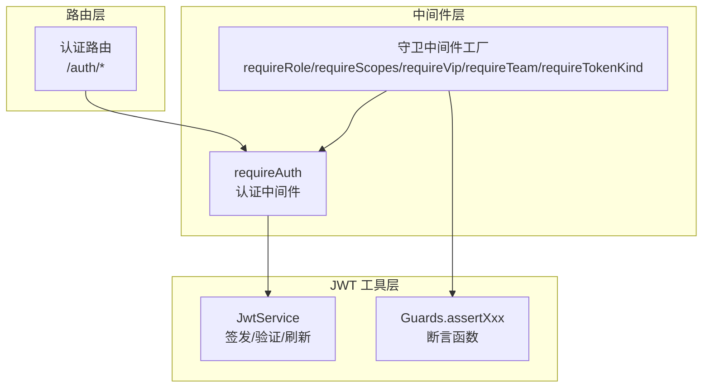
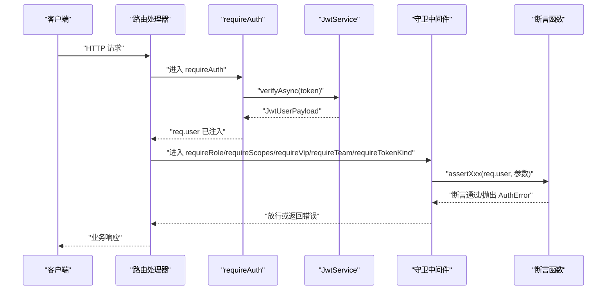
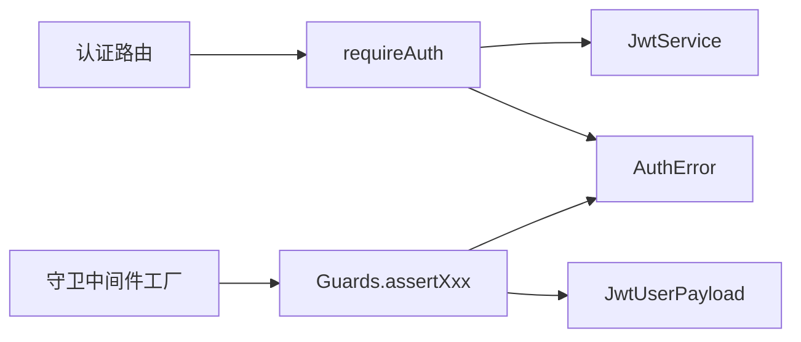

# 权限守卫系统

<cite>
**本文引用的文件**
- [src/middleware/auth/guards.ts](file://src/middleware/auth/guards.ts)
- [src/middleware/auth/require.ts](file://src/middleware/auth/require.ts)
- [src/middleware/auth/types.ts](file://src/middleware/auth/types.ts)
- [src/tools/jwt/guards/index.ts](file://src/tools/jwt/guards/index.ts)
- [src/tools/jwt/guards/app.ts](file://src/tools/jwt/guards/app.ts)
- [src/tools/jwt/guards/code.ts](file://src/tools/jwt/guards/code.ts)
- [src/tools/jwt/guards/device.ts](file://src/tools/jwt/guards/device.ts)
- [src/tools/jwt/guards/id.ts](file://src/tools/jwt/guards/id.ts)
- [src/tools/jwt/guards/role.ts](file://src/tools/jwt/guards/role.ts)
- [src/tools/jwt/guards/scopes.ts](file://src/tools/jwt/guards/scopes.ts)
- [src/tools/jwt/guards/team.ts](file://src/tools/jwt/guards/team.ts)
- [src/tools/jwt/guards/vip.ts](file://src/tools/jwt/guards/vip.ts)
- [src/tools/jwt/errors/index.ts](file://src/tools/jwt/errors/index.ts)
- [src/tools/jwt/service.ts](file://src/tools/jwt/service.ts)
- [src/routers/auth.ts](file://src/routers/auth.ts)
</cite>

## 目录
1. [简介](#简介)
2. [项目结构](#项目结构)
3. [核心组件](#核心组件)
4. [架构总览](#架构总览)
5. [详细组件分析](#详细组件分析)
6. [依赖关系分析](#依赖关系分析)
7. [性能考量](#性能考量)
8. [故障排查指南](#故障排查指南)
9. [结论](#结论)
10. [附录](#附录)

## 简介
本文件为 JWT 权限守卫系统的全面技术文档，覆盖以下守卫类型及其在 Express 路由中的使用方式：
- app 守卫：应用级验证（业务标识）
- code 守卫：验证码/用户业务标识验证
- device 守卫：设备标识验证（可开关）
- id 守卫：用户主体 ID 验证
- role 守卫：角色权限验证
- scopes 守卫：作用域权限验证
- team 守卫：团队隔离验证
- vip 守卫：VIP 特权验证
- tokenKind 守卫：令牌类型（access/refresh）验证

文档同时说明各守卫的验证逻辑、参数要求、返回行为、错误处理策略以及在路由中的组合使用与调试技巧。

## 项目结构
该系统围绕“认证中间件 + 守卫工厂 + JWT 服务 + 统一错误模型”构建，核心文件分布如下：
- 认证中间件：负责从请求头提取 Bearer 令牌并调用 JWT 服务进行验证，将解码后的用户载荷挂载到 req.user
- 守卫中间件：基于 req.user 的业务载荷执行各类权限断言
- JWT 工具：提供签发、验证、刷新轮转等能力
- 错误模型：统一的鉴权错误码与响应结构

图表来源
- [src/middleware/auth/require.ts](file://src/middleware/auth/require.ts#L68-L97)
- [src/middleware/auth/guards.ts](file://src/middleware/auth/guards.ts#L18-L194)
- [src/tools/jwt/service.ts](file://src/tools/jwt/service.ts#L27-L97)
- [src/tools/jwt/guards/index.ts](file://src/tools/jwt/guards/index.ts#L1-L19)
- [src/routers/auth.ts](file://src/routers/auth.ts#L12-L46)

章节来源
- [src/middleware/auth/require.ts](file://src/middleware/auth/require.ts#L1-L98)
- [src/middleware/auth/guards.ts](file://src/middleware/auth/guards.ts#L1-L195)
- [src/tools/jwt/service.ts](file://src/tools/jwt/service.ts#L1-L98)
- [src/tools/jwt/guards/index.ts](file://src/tools/jwt/guards/index.ts#L1-L19)
- [src/routers/auth.ts](file://src/routers/auth.ts#L1-L47)

## 核心组件
- 认证中间件 requireAuth：从 Authorization 头提取 Bearer 令牌，调用 JwtService.verifyAsync 验证，成功后将载荷写入 req.user
- 守卫中间件工厂：基于 req.user 执行断言，内部委托至 src/tools/jwt/guards/index.ts 暴露的断言函数
- JWT 服务 JwtService：封装签发、验证、刷新轮转逻辑，支持 HS256/RS256 算法
- 统一错误模型：AuthError 及其错误码，提供 toLogEntry、toJSON 等序列化方法

章节来源
- [src/middleware/auth/require.ts](file://src/middleware/auth/require.ts#L68-L97)
- [src/middleware/auth/guards.ts](file://src/middleware/auth/guards.ts#L18-L194)
- [src/tools/jwt/service.ts](file://src/tools/jwt/service.ts#L27-L97)
- [src/tools/jwt/errors/index.ts](file://src/tools/jwt/errors/index.ts#L66-L287)

## 架构总览
下图展示从请求进入路由到完成权限断言的整体流程：

图表来源
- [src/middleware/auth/require.ts](file://src/middleware/auth/require.ts#L68-L97)
- [src/middleware/auth/guards.ts](file://src/middleware/auth/guards.ts#L18-L194)
- [src/tools/jwt/service.ts](file://src/tools/jwt/service.ts#L66-L75)
- [src/tools/jwt/guards/index.ts](file://src/tools/jwt/guards/index.ts#L1-L19)

## 详细组件分析

### 认证中间件 requireAuth
- 功能：从 Authorization 头提取 Bearer 令牌，调用 JwtService.verifyAsync 验证，成功后将载荷写入 req.user
- 错误处理：对缺失/格式错误/无效/过期等错误进行统一包装并以 JSON 响应
- 初始化：延迟创建 JwtService 单例，减少启动开销

章节来源
- [src/middleware/auth/require.ts](file://src/middleware/auth/require.ts#L68-L97)

### 守卫中间件工厂
- requireRole(roles[])：断言用户角色在允许列表内
- requireScopes(scopes[])：断言用户至少拥有所需作用域之一
- requireVip()：断言用户为 VIP
- requireTeam(teams[])：断言用户所属团队在允许列表内
- requireTokenKind(kind)：断言令牌类型为 "access" 或 "refresh"
- 共同特征：均在 req.user 存在时执行断言，失败时返回 403，异常时返回 500

章节来源
- [src/middleware/auth/guards.ts](file://src/middleware/auth/guards.ts#L18-L194)

### JWT 服务 JwtService
- 签发 signAsync：自动设置 iat/jti/tokenType，支持 HS256/RS256，长期有效（不设置 exp）
- 验证 verifyAsync：校验并返回业务载荷，区分过期与无效错误
- 刷新 rotateRefreshAsync：校验 refresh，返回新的 access 与 refresh

章节来源
- [src/tools/jwt/service.ts](file://src/tools/jwt/service.ts#L27-L97)

### 统一错误模型 AuthError
- 错误码覆盖：缺失令牌、格式错误、无效、过期、禁止、设备不匹配、撤销、算法不支持、业务/验证错误等
- 序列化：toJSON 用于 HTTP 响应，toLogEntry 用于日志记录
- 类型守卫：isAuthError 用于分支处理

章节来源
- [src/tools/jwt/errors/index.ts](file://src/tools/jwt/errors/index.ts#L46-L287)

### 各类守卫断言函数
- app 守卫（应用级）：断言 payload.appid 等于目标
- code 守卫（验证码/用户业务标识）：断言 payload.code 等于目标
- device 守卫（设备绑定）：当启用绑定时，断言 payload.deviceId 存在且匹配
- id 守卫（用户主体 ID）：断言 payload.sub 等于目标用户 ID
- role 守卫（角色）：断言 payload.roleId 在允许列表
- scopes 守卫（作用域）：断言 payload.scope 至少包含所需其一
- team 守卫（团队）：断言 payload.teamId 存在且在允许列表
- vip 守卫（VIP）：断言 payload.vip 为真
- tokenKind 守卫：断言 payload.tokenType 等于目标类型

章节来源
- [src/tools/jwt/guards/app.ts](file://src/tools/jwt/guards/app.ts#L13-L28)
- [src/tools/jwt/guards/code.ts](file://src/tools/jwt/guards/code.ts#L14-L31)
- [src/tools/jwt/guards/device.ts](file://src/tools/jwt/guards/device.ts#L12-L35)
- [src/tools/jwt/guards/id.ts](file://src/tools/jwt/guards/id.ts#L14-L30)
- [src/tools/jwt/guards/role.ts](file://src/tools/jwt/guards/role.ts#L14-L30)
- [src/tools/jwt/guards/scopes.ts](file://src/tools/jwt/guards/scopes.ts#L12-L29)
- [src/tools/jwt/guards/team.ts](file://src/tools/jwt/guards/team.ts#L13-L29)
- [src/tools/jwt/guards/vip.ts](file://src/tools/jwt/guards/vip.ts#L14-L29)
- [src/tools/jwt/guards/index.ts](file://src/tools/jwt/guards/index.ts#L13-L18)

### Express 路由集成示例
- 登录/注册：无需守卫，直接暴露给公众
- 退出/查询当前用户：需 requireAuth
- 管理员删除用户：需 requireAuth + requireRole(["ADMIN"])
- 写入接口：需 requireAuth + requireScopes(["admin","writer"])
- 专属内容：需 requireAuth + requireVip()
- 团队资源：需 requireAuth + requireTeam(["team-a","team-b"])
- 刷新令牌：需 requireAuth + requireTokenKind("refresh")

章节来源
- [src/routers/auth.ts](file://src/routers/auth.ts#L12-L46)
- [src/middleware/auth/guards.ts](file://src/middleware/auth/guards.ts#L18-L194)

### 权限组合使用与最佳实践
- 组合顺序建议：先 requireAuth，再按需组合 requireRole/requireScopes/requireVip/requireTeam/requireTokenKind
- 作用域与角色：可同时使用 requireScopes 与 requireRole，确保最小权限原则
- 设备绑定：在高安全场景启用 requireDevice，结合服务端策略控制
- 令牌类型：刷新接口必须 requireTokenKind("refresh")
- 错误一致性：所有守卫失败均返回 403，认证失败返回 401，未知错误返回 500

章节来源
- [src/middleware/auth/guards.ts](file://src/middleware/auth/guards.ts#L18-L194)
- [src/tools/jwt/errors/index.ts](file://src/tools/jwt/errors/index.ts#L46-L63)

## 依赖关系分析
- requireAuth 依赖 JwtService 和 AuthError
- 守卫中间件依赖 src/tools/jwt/guards/index.ts 暴露的断言函数
- 断言函数依赖 AuthError 与 JwtUserPayload 类型
- 路由层通过 requireAuth 间接依赖 JwtService

图表来源
- [src/middleware/auth/require.ts](file://src/middleware/auth/require.ts#L13-L32)
- [src/middleware/auth/guards.ts](file://src/middleware/auth/guards.ts#L13-L15)
- [src/tools/jwt/guards/index.ts](file://src/tools/jwt/guards/index.ts#L1-L19)
- [src/tools/jwt/errors/index.ts](file://src/tools/jwt/errors/index.ts#L66-L111)
- [src/routers/auth.ts](file://src/routers/auth.ts#L12-L46)

章节来源
- [src/middleware/auth/require.ts](file://src/middleware/auth/require.ts#L13-L32)
- [src/middleware/auth/guards.ts](file://src/middleware/auth/guards.ts#L13-L15)
- [src/tools/jwt/guards/index.ts](file://src/tools/jwt/guards/index.ts#L1-L19)
- [src/tools/jwt/errors/index.ts](file://src/tools/jwt/errors/index.ts#L66-L111)
- [src/routers/auth.ts](file://src/routers/auth.ts#L12-L46)

## 性能考量
- 认证中间件：仅一次令牌提取与一次验证，复杂度 O(1)
- 守卫断言：除 scopes 守卫外均为 O(1)，scopes 守卫复杂度约为 O(n*m)，其中 n 为 required 长度，m 为 scope 长度
- 建议：尽量减少 scopes 数量，避免超长作用域列表；对高频路由优先使用角色/团队/VIP 等 O(1) 断言
- 令牌有效期：当前实现长期有效（不设置 exp），请根据业务安全策略调整

章节来源
- [src/tools/jwt/guards/scopes.ts](file://src/tools/jwt/guards/scopes.ts#L20-L21)
- [src/tools/jwt/service.ts](file://src/tools/jwt/service.ts#L41-L56)

## 故障排查指南
- 401 未认证/令牌无效：检查 Authorization 头格式、令牌有效性与算法配置
- 403 禁止访问：检查角色/作用域/团队/VIP/设备/令牌类型等断言条件
- 500 服务错误：确认 JwtService 初始化与密钥提供器可用性
- 调试技巧：
  - 使用 AuthError.toLogEntry 输出结构化日志
  - 在 requireAuth 中打印提取的 token 与错误详情
  - 在守卫中间件中输出 req.user 的关键字段（如 sub、roleId、teamId、vip、tokenType）

章节来源
- [src/middleware/auth/require.ts](file://src/middleware/auth/require.ts#L85-L96)
- [src/middleware/auth/guards.ts](file://src/middleware/auth/guards.ts#L36-L50)
- [src/tools/jwt/errors/index.ts](file://src/tools/jwt/errors/index.ts#L119-L141)

## 结论
本权限守卫系统通过“认证中间件 + 守卫中间件工厂 + JWT 服务 + 统一错误模型”的分层设计，提供了灵活、可组合、可扩展的权限控制能力。开发者可在路由中按需组合多种守卫，实现细粒度的权限管理；同时通过统一的错误模型与日志工具，便于问题定位与运维监控。

## 附录

### 各守卫参数与返回说明
- app 守卫：输入业务载荷与目标 appid，断言相等
- code 守卫：输入业务载荷与目标 code，断言相等
- device 守卫：输入业务载荷、设备 ID 与启用开关，断言相等
- id 守卫：输入业务载荷与目标用户 ID，断言相等
- role 守卫：输入业务载荷与角色 ID 列表，断言包含
- scopes 守卫：输入业务载荷与作用域列表，断言交集非空
- team 守卫：输入业务载荷与团队 ID 列表，断言存在且包含
- vip 守卫：输入业务载荷，断言 vip 为真
- tokenKind 守卫：输入业务载荷与目标令牌类型，断言相等

章节来源
- [src/tools/jwt/guards/app.ts](file://src/tools/jwt/guards/app.ts#L13-L28)
- [src/tools/jwt/guards/code.ts](file://src/tools/jwt/guards/code.ts#L14-L31)
- [src/tools/jwt/guards/device.ts](file://src/tools/jwt/guards/device.ts#L12-L35)
- [src/tools/jwt/guards/id.ts](file://src/tools/jwt/guards/id.ts#L14-L30)
- [src/tools/jwt/guards/role.ts](file://src/tools/jwt/guards/role.ts#L14-L30)
- [src/tools/jwt/guards/scopes.ts](file://src/tools/jwt/guards/scopes.ts#L12-L29)
- [src/tools/jwt/guards/team.ts](file://src/tools/jwt/guards/team.ts#L13-L29)
- [src/tools/jwt/guards/vip.ts](file://src/tools/jwt/guards/vip.ts#L14-L29)
- [src/tools/jwt/guards/index.ts](file://src/tools/jwt/guards/index.ts#L13-L18)