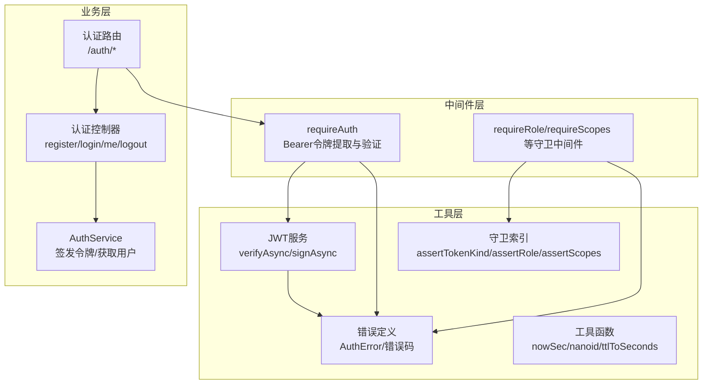
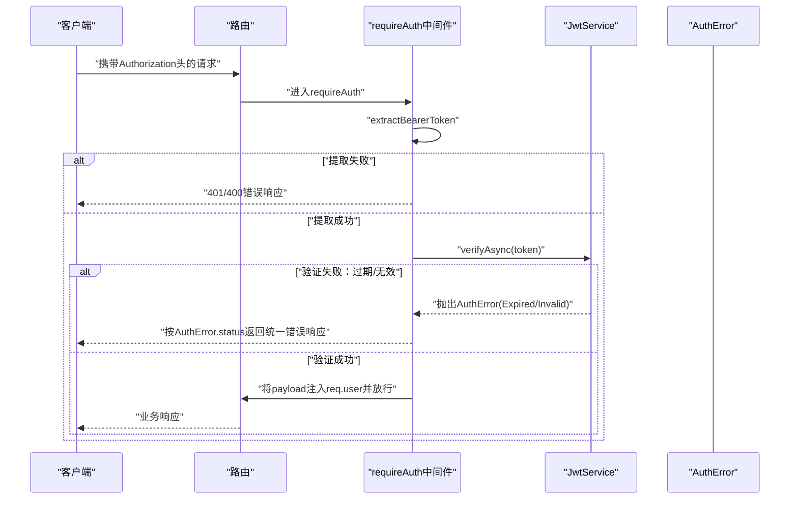
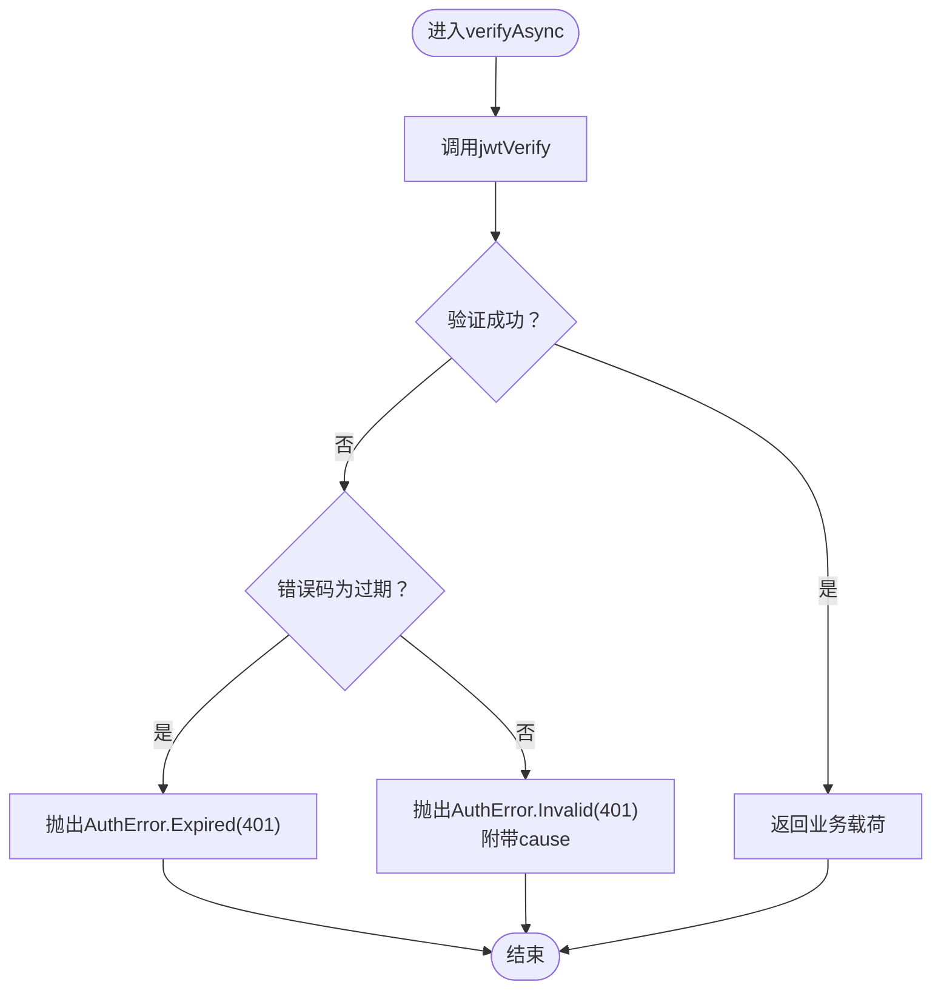
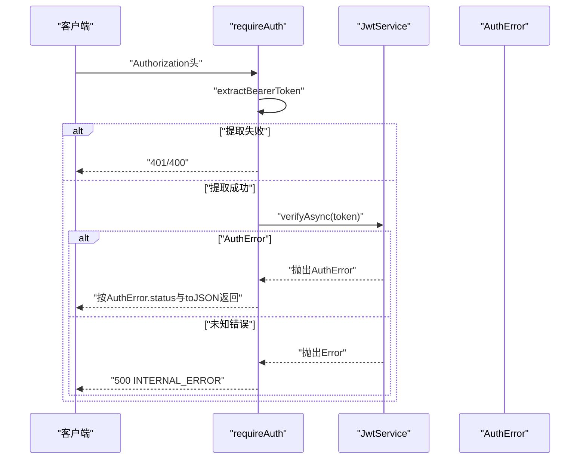
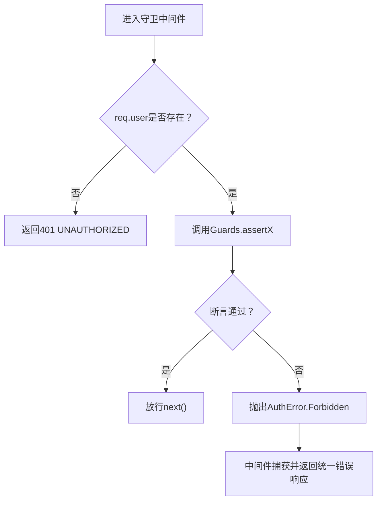
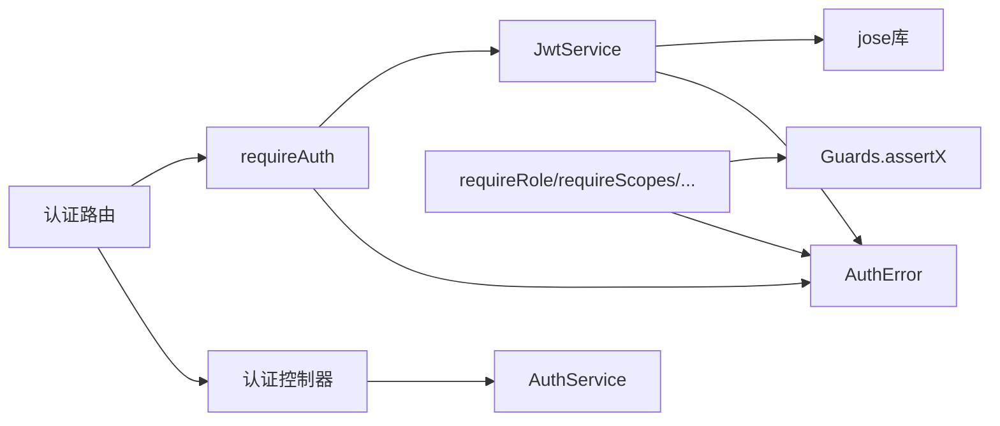

# 错误处理机制

<cite>
**本文引用的文件**
- [src/tools/jwt/errors/index.ts](file://src/tools/jwt/errors/index.ts)
- [src/tools/jwt/service.ts](file://src/tools/jwt/service.ts)
- [src/middleware/auth/require.ts](file://src/middleware/auth/require.ts)
- [src/middleware/auth/guards.ts](file://src/middleware/auth/guards.ts)
- [src/tools/jwt/guards/index.ts](file://src/tools/jwt/guards/index.ts)
- [src/tools/jwt/guards/role.ts](file://src/tools/jwt/guards/role.ts)
- [src/tools/jwt/guards/scopes.ts](file://src/tools/jwt/guards/scopes.ts)
- [src/tools/jwt/index.ts](file://src/tools/jwt/index.ts)
- [src/services/auth.ts](file://src/services/auth.ts)
- [src/contracts/auth.controller.ts](file://src/contracts/auth.controller.ts)
- [src/routes/auth.ts](file://src/routes/auth.ts)
- [src/config/env/index.ts](file://src/config/env/index.ts)
</cite>

## 目录
1. [简介](#简介)
2. [项目结构](#项目结构)
3. [核心组件](#核心组件)
4. [架构总览](#架构总览)
5. [详细组件分析](#详细组件分析)
6. [依赖关系分析](#依赖关系分析)
7. [性能考量](#性能考量)
8. [故障排查指南](#故障排查指南)
9. [结论](#结论)
10. [附录](#附录)

## 简介
本文件聚焦于JWT错误处理机制，系统性阐述AuthError类的设计理念、错误码体系、错误消息格式、HTTP状态码映射与统一错误响应结构。文档还覆盖在不同场景（认证、授权、令牌类型校验）下的错误触发条件与处理流程，提供最佳实践建议（错误日志记录、用户友好提示、调试信息收集）、错误分类、重试策略与故障恢复机制。

## 项目结构
围绕JWT错误处理的关键模块分布如下：
- 工具层：JWT服务、错误定义、守卫工具、通用工具
- 中间件层：认证中间件、权限守卫中间件
- 控制器与路由层：认证接口与受保护资源
- 配置层：环境变量与密钥提供器

图表来源
- [src/tools/jwt/errors/index.ts](file://src/tools/jwt/errors/index.ts#L66-L256)
- [src/tools/jwt/service.ts](file://src/tools/jwt/service.ts#L27-L97)
- [src/middleware/auth/require.ts](file://src/middleware/auth/require.ts#L68-L97)
- [src/middleware/auth/guards.ts](file://src/middleware/auth/guards.ts#L25-L194)
- [src/tools/jwt/guards/index.ts](file://src/tools/jwt/guards/index.ts#L13-L18)
- [src/contracts/auth.controller.ts](file://src/contracts/auth.controller.ts#L25-L110)
- [src/routes/auth.ts](file://src/routes/auth.ts#L16-L46)
- [src/services/auth.ts](file://src/services/auth.ts#L86-L169)

章节来源
- [src/tools/jwt/index.ts](file://src/tools/jwt/index.ts#L11-L106)
- [src/config/env/index.ts](file://src/config/env/index.ts#L166-L223)

## 核心组件
- AuthError类：统一的可序列化、可日志化的认证错误对象，内置工厂方法与类型守卫，支持toJSON与toLogEntry输出标准化错误响应与日志条目。
- AuthErrorCode枚举：涵盖鉴权相关（缺失令牌、格式错误、无效、过期、禁止、设备不匹配、撤销、不支持算法）、业务错误、验证错误及邮箱已存在等错误码。
- JWT服务JwtService：封装签发与验证逻辑，verifyAsync在遇到过期与无效情况抛出AuthError，确保上层统一处理。
- 认证中间件requireAuth：从Authorization头提取Bearer令牌，调用JwtService验证，捕获AuthError并以统一格式返回。
- 权限守卫中间件：基于Guards.assertX系列断言，对角色、作用域、VIP、团队、令牌类型等进行校验，失败时抛出AuthError，由中间件统一返回。

章节来源
- [src/tools/jwt/errors/index.ts](file://src/tools/jwt/errors/index.ts#L66-L256)
- [src/tools/jwt/service.ts](file://src/tools/jwt/service.ts#L66-L75)
- [src/middleware/auth/require.ts](file://src/middleware/auth/require.ts#L68-L97)
- [src/middleware/auth/guards.ts](file://src/middleware/auth/guards.ts#L25-L194)
- [src/tools/jwt/guards/index.ts](file://src/tools/jwt/guards/index.ts#L13-L18)

## 架构总览
JWT错误处理贯穿“中间件-服务-工具”的分层设计，形成“提取与验证-断言与授权-统一响应”的闭环。

图表来源
- [src/middleware/auth/require.ts](file://src/middleware/auth/require.ts#L68-L97)
- [src/tools/jwt/service.ts](file://src/tools/jwt/service.ts#L66-L75)
- [src/tools/jwt/errors/index.ts](file://src/tools/jwt/errors/index.ts#L66-L121)

## 详细组件分析

### AuthError类与错误码体系
- 设计要点
  - 继承Error，具备name、code、status、message、details、fields等属性。
  - 提供toJSON与toLogEntry，统一错误响应与日志输出。
  - 工厂方法覆盖常见错误类型（缺失令牌、格式错误、无效、过期、禁止、设备不匹配、撤销、不支持算法、业务错误、验证错误、邮箱已存在），并设定默认HTTP状态码。
  - 类型守卫isAuthError用于在运行时识别AuthError实例。
  - serializeUnknown用于安全地序列化未知错误对象，便于日志与调试。

- 错误码与HTTP状态码映射（摘要）
  - MISSING_TOKEN：401
  - MALFORMED：400
  - INVALID：401
  - EXPIRED：401
  - FORBIDDEN：403
  - DEVICE_MISMATCH：401
  - REVOKED：401
  - UNSUPPORTED_ALG：400
  - VALIDATION_ERROR：422
  - BUSINESS_ERROR：自定义（默认400）
  - 其他业务/验证错误：根据具体场景设置

- 错误消息格式
  - 统一响应结构包含code、message、status、details（可选）、fields（验证错误时提供）。
  - 日志条目包含level、name、code、status、message、details、fields、stack、cause等字段，便于审计与排障。

章节来源
- [src/tools/jwt/errors/index.ts](file://src/tools/jwt/errors/index.ts#L66-L256)

### JWT服务JwtService与验证错误
- 验证流程
  - verifyAsync使用jose库进行jwtVerify，若返回特定过期错误码，则抛出AuthError.Expired；其他异常统一封装为AuthError.Invalid，并附带cause信息。
- 签发流程
  - signAsync自动设置iat、jti、tokenType等，不设置exp，实现“长期有效”策略（结合业务策略使用refresh token轮转）。

图表来源
- [src/tools/jwt/service.ts](file://src/tools/jwt/service.ts#L66-L75)

章节来源
- [src/tools/jwt/service.ts](file://src/tools/jwt/service.ts#L27-L97)

### 认证中间件requireAuth
- 行为
  - 从Authorization头提取Bearer令牌，若缺失或格式不正确，直接返回对应错误（401/400）。
  - 成功提取后调用JwtService.verifyAsync验证，捕获AuthError并按其status与toJSON输出统一响应。
  - 捕获未知错误时返回500与通用错误码。
  - 验证通过后将payload注入req.user，供后续中间件与处理器使用。

图表来源
- [src/middleware/auth/require.ts](file://src/middleware/auth/require.ts#L68-L97)
- [src/tools/jwt/errors/index.ts](file://src/tools/jwt/errors/index.ts#L119-L141)

章节来源
- [src/middleware/auth/require.ts](file://src/middleware/auth/require.ts#L34-L97)

### 权限守卫中间件与断言
- 角色守卫requireRole：断言用户角色在允许列表内，否则抛出AuthError.Forbidden。
- 作用域守卫requireScopes：断言用户至少拥有所需作用域之一，否则抛出AuthError.Forbidden。
- VIP守卫requireVip：断言用户为VIP，否则抛出AuthError.Forbidden。
- 团队守卫requireTeam：断言用户属于允许的团队之一，否则抛出AuthError.Forbidden。
- 令牌类型守卫requireTokenKind：断言tokenType与期望一致，否则抛出AuthError.Forbidden。
- 守卫工具Guards.assertTokenKind：在业务逻辑中直接断言tokenType，失败抛出AuthError.Forbidden。

图表来源
- [src/middleware/auth/guards.ts](file://src/middleware/auth/guards.ts#L25-L194)
- [src/tools/jwt/guards/index.ts](file://src/tools/jwt/guards/index.ts#L13-L18)
- [src/tools/jwt/guards/role.ts](file://src/tools/jwt/guards/role.ts#L25-L30)
- [src/tools/jwt/guards/scopes.ts](file://src/tools/jwt/guards/scopes.ts#L23-L28)

章节来源
- [src/middleware/auth/guards.ts](file://src/middleware/auth/guards.ts#L18-L194)
- [src/tools/jwt/guards/index.ts](file://src/tools/jwt/guards/index.ts#L1-L19)
- [src/tools/jwt/guards/role.ts](file://src/tools/jwt/guards/role.ts#L1-L31)
- [src/tools/jwt/guards/scopes.ts](file://src/tools/jwt/guards/scopes.ts#L1-L30)

### 认证控制器与路由
- 路由层：/auth/register（公开）、/auth/login（公开）、/auth/logout（受保护）、/auth/me（受保护）。
- 控制器层：register/login调用AuthService，me读取req.user并调用AuthService.getCurrentUser。
- requireAuth中间件在受保护路由上拦截，确保只有通过JWT验证的请求才能继续。

章节来源
- [src/routes/auth.ts](file://src/routes/auth.ts#L16-L46)
- [src/contracts/auth.controller.ts](file://src/contracts/auth.controller.ts#L25-L110)
- [src/middleware/auth/require.ts](file://src/middleware/auth/require.ts#L68-L97)

### 服务层与令牌签发
- AuthService.register/login：先执行业务逻辑（如User.authenticate），再调用issueTokens签发access与refresh令牌。
- issueTokens：构建JwtUserPayload，分别签发access与refresh令牌，返回包含用户信息与令牌的数据结构。

章节来源
- [src/services/auth.ts](file://src/services/auth.ts#L86-L169)

## 依赖关系分析
- requireAuth依赖JwtService与AuthError，负责认证阶段的错误统一。
- 各守卫中间件依赖Guards.assertX与AuthError，负责授权阶段的错误统一。
- JwtService内部依赖AuthError与jose库，负责令牌验证与错误抛出。
- 认证控制器与路由依赖requireAuth与AuthService，形成“路由-中间件-服务”的调用链。
- 环境变量与密钥提供器通过createJwtServiceFromEnv注入到JwtService，影响算法与TTL等安全配置。

图表来源
- [src/middleware/auth/require.ts](file://src/middleware/auth/require.ts#L12-L32)
- [src/middleware/auth/guards.ts](file://src/middleware/auth/guards.ts#L12-L15)
- [src/tools/jwt/service.ts](file://src/tools/jwt/service.ts#L14-L20)
- [src/tools/jwt/errors/index.ts](file://src/tools/jwt/errors/index.ts#L66-L121)
- [src/contracts/auth.controller.ts](file://src/contracts/auth.controller.ts#L13-L18)
- [src/routes/auth.ts](file://src/routes/auth.ts#L12-L16)

章节来源
- [src/tools/jwt/index.ts](file://src/tools/jwt/index.ts#L75-L106)
- [src/config/env/index.ts](file://src/config/env/index.ts#L166-L223)

## 性能考量
- 验证开销：verifyAsync基于jose库，算法选择（HS256/RS256）与密钥提供器会影响CPU消耗；建议在生产环境使用RS256并优化密钥加载。
- 中间件链路：requireAuth与守卫中间件均为O(1)或线性扫描（作用域断言），在高并发下保持低延迟。
- 日志与序列化：toLogEntry与serializeUnknown为纯内存操作，注意避免在高频路径中过度记录敏感字段。

## 故障排查指南
- 常见错误与定位
  - 缺少Authorization头或格式不正确：检查前端是否正确设置Bearer头，确认中间件extractBearerToken分支。
  - 令牌无效/过期：查看JwtService.verifyAsync分支，关注AuthError.Expired与AuthError.Invalid的差异。
  - 禁止访问：检查角色/作用域/团队/VIP/令牌类型断言，确认Guards.assertX的参数与用户载荷。
  - 业务错误/验证错误：使用AuthError.businessError与AuthError.validationError，配合details与fields定位问题。
- 日志记录与调试
  - 使用AuthError.toLogEntry输出结构化日志，包含level、code、status、message、details、fields、stack、cause。
  - 使用serializeUnknown安全序列化未知错误，避免循环引用与不可序列化字段。
- 用户友好提示
  - 在UI层展示统一的错误码与message，避免暴露底层技术细节；对422验证错误，优先展示fields中的字段级提示。
- 重试策略与故障恢复
  - 对于网络波动导致的500错误，建议在客户端进行指数退避重试，但需限制总时长与次数。
  - 对于401/403错误，引导用户重新登录或调整权限；对于400/MALFORMED，提示修正请求格式。
  - 对于EXPIRED，引导用户使用refresh token轮转或重新登录。

章节来源
- [src/tools/jwt/errors/index.ts](file://src/tools/jwt/errors/index.ts#L119-L141)
- [src/tools/jwt/errors/index.ts](file://src/tools/jwt/errors/index.ts#L276-L287)
- [src/middleware/auth/require.ts](file://src/middleware/auth/require.ts#L85-L96)
- [src/middleware/auth/guards.ts](file://src/middleware/auth/guards.ts#L39-L49)

## 结论
该JWT错误处理机制通过AuthError统一了错误表示与响应格式，结合JwtService的验证逻辑与中间件/守卫的断言能力，实现了从认证到授权的一致性错误处理。配合完善的日志与序列化工具，能够快速定位问题并提供用户友好的反馈。建议在生产环境中强化密钥管理、启用更严格的设备绑定与黑名单策略，并持续监控错误分布以优化用户体验与系统稳定性。

## 附录
- 错误码与触发场景速览
  - MISSING_TOKEN：Authorization头缺失或为空
  - MALFORMED：Authorization头格式不正确（非Bearer或空令牌）
  - INVALID：令牌签名/格式异常
  - EXPIRED：令牌过期
  - FORBIDDEN：角色/作用域/团队/VIP/令牌类型不匹配
  - DEVICE_MISMATCH：设备绑定校验失败
  - REVOKED：令牌被撤销（需启用黑名单）
  - UNSUPPORTED_ALG：签名算法不受支持
  - VALIDATION_ERROR：输入参数校验失败（fields提供字段级错误）
  - BUSINESS_ERROR：业务异常（可自定义状态码）