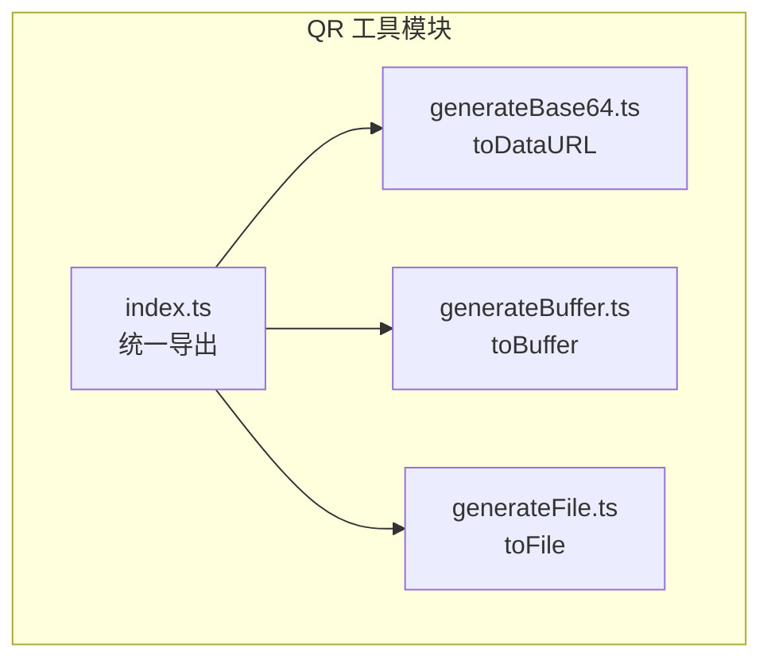
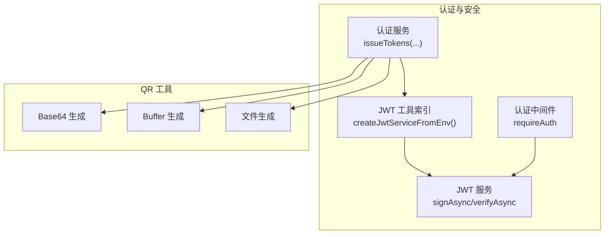
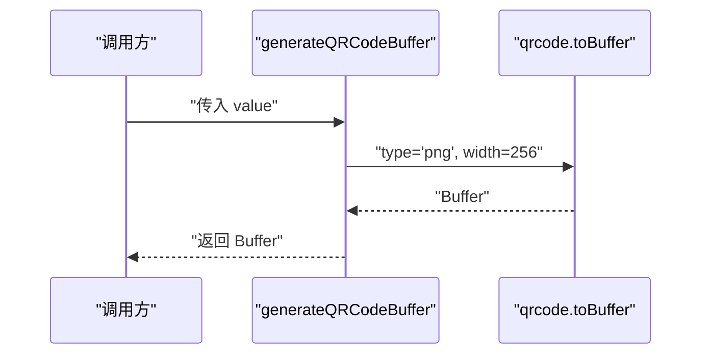
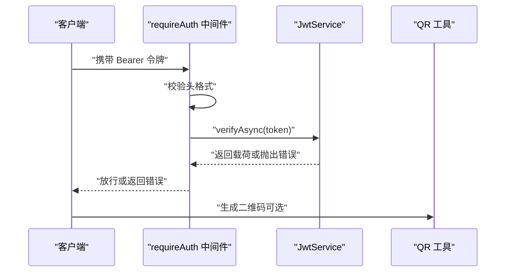
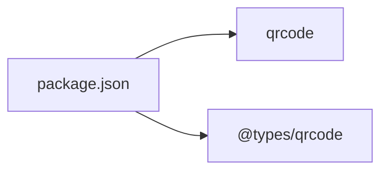

# QR码生成工具

<cite>
**本文引用的文件**
- [src/tools/qr/index.ts](file://src/tools/qr/index.ts)
- [src/tools/qr/generateBase64.ts](file://src/tools/qr/generateBase64.ts)
- [src/tools/qr/generateBuffer.ts](file://src/tools/qr/generateBuffer.ts)
- [src/tools/qr/generateFile.ts](file://src/tools/qr/generateFile.ts)
- [package.json](file://package.json)
- [src/tools/jwt/index.ts](file://src/tools/jwt/index.ts)
- [src/tools/jwt/service.ts](file://src/tools/jwt/service.ts)
- [src/middleware/auth/require.ts](file://src/middleware/auth/require.ts)
- [src/models/auth/anth.ts](file://src/models/auth/anth.ts)
- [src/tools/crypto/pin.ts](file://src/tools/crypto/pin.ts)
</cite>

## 目录
1. [简介](#简介)
2. [项目结构](#项目结构)
3. [核心组件](#核心组件)
4. [架构概览](#架构概览)
5. [详细组件分析](#详细组件分析)
6. [依赖分析](#依赖分析)
7. [性能考量](#性能考量)
8. [故障排查指南](#故障排查指南)
9. [结论](#结论)
10. [附录](#附录)

## 简介
本文件为 IM-API 的 QR 码生成工具提供实用技术文档。该工具提供三种输出形态：Base64 数据 URL、Node.js Buffer 以及直接写入本地 PNG 文件。文档将系统说明各实现方式的适用场景、配置参数（尺寸、边距、纠错级别等）、在用户注册确认与设备绑定等业务中的使用思路、解析与验证机制、移动端兼容性、性能优化与内存注意事项，以及安全性与防伪建议。

## 项目结构
QR 码工具位于 src/tools/qr 目录，采用按功能拆分的模块化组织：
- 入口导出：index.ts 统一导出三个生成函数
- Base64 输出：generateBase64.ts
- Buffer 输出：generateBuffer.ts
- 文件输出：generateFile.ts



图表来源
- [src/tools/qr/index.ts](file://src/tools/qr/index.ts#L1-L5)
- [src/tools/qr/generateBase64.ts](file://src/tools/qr/generateBase64.ts#L1-L18)
- [src/tools/qr/generateBuffer.ts](file://src/tools/qr/generateBuffer.ts#L1-L17)
- [src/tools/qr/generateFile.ts](file://src/tools/qr/generateFile.ts#L1-L24)

章节来源
- [src/tools/qr/index.ts](file://src/tools/qr/index.ts#L1-L5)

## 核心组件
- Base64 输出函数：将输入值渲染为 data URL（PNG），适合在前端直接显示或嵌入 HTML/CSS。
- Buffer 输出函数：返回 PNG 格式 Buffer，适合流式传输或进一步处理（如上传到云存储）。
- 文件输出函数：将 PNG 写入指定路径，适合离线生成或日志记录。

章节来源
- [src/tools/qr/generateBase64.ts](file://src/tools/qr/generateBase64.ts#L10-L17)
- [src/tools/qr/generateBuffer.ts](file://src/tools/qr/generateBuffer.ts#L9-L16)
- [src/tools/qr/generateFile.ts](file://src/tools/qr/generateFile.ts#L11-L23)

## 架构概览
QR 码生成工具与认证体系的交互关系如下：



图表来源
- [src/services/auth.ts](file://src/services/auth.ts#L45-L80)
- [src/tools/jwt/index.ts](file://src/tools/jwt/index.ts#L80-L106)
- [src/tools/jwt/service.ts](file://src/tools/jwt/service.ts#L41-L75)
- [src/middleware/auth/require.ts](file://src/middleware/auth/require.ts#L68-L97)
- [src/tools/qr/generateBase64.ts](file://src/tools/qr/generateBase64.ts#L10-L17)
- [src/tools/qr/generateBuffer.ts](file://src/tools/qr/generateBuffer.ts#L9-L16)
- [src/tools/qr/generateFile.ts](file://src/tools/qr/generateFile.ts#L11-L23)

## 详细组件分析

### Base64 生成函数
- 功能：将任意字符串/数值渲染为 PNG 的 data URL，便于前端直接显示。
- 关键参数：宽度、边距。
- 适用场景：网页内嵌显示、即时预览、邮件或消息中携带二维码图片。

```mermaid
sequenceDiagram
participant Svc as "调用方"
participant QR as "generateQRCodeBase64"
participant Lib as "qrcode.toDataURL"
Svc->>QR : "传入 value"
QR->>Lib : "width=300, margin=1"
Lib-->>QR : "data : image/png;base64,..."
QR-->>Svc : "返回 Base64 字符串"
```

图表来源
- [src/tools/qr/generateBase64.ts](file://src/tools/qr/generateBase64.ts#L10-L17)

章节来源
- [src/tools/qr/generateBase64.ts](file://src/tools/qr/generateBase64.ts#L10-L17)

### Buffer 生成函数
- 功能：生成 PNG 格式的 Buffer。
- 关键参数：类型（PNG）、宽度。
- 适用场景：需要以二进制形式传输或继续处理（如上传到对象存储）。



图表来源
- [src/tools/qr/generateBuffer.ts](file://src/tools/qr/generateBuffer.ts#L9-L16)

章节来源
- [src/tools/qr/generateBuffer.ts](file://src/tools/qr/generateBuffer.ts#L9-L16)

### 文件生成函数
- 功能：将二维码写入本地 PNG 文件。
- 关键参数：类型（PNG）、宽度、边距、纠错级别。
- 适用场景：离线生成、日志记录、批量导出。


图表来源
- [src/tools/qr/generateFile.ts](file://src/tools/qr/generateFile.ts#L11-L23)

章节来源
- [src/tools/qr/generateFile.ts](file://src/tools/qr/generateFile.ts#L11-L23)

### 配置参数与可扩展点
- 尺寸（width）：控制二维码像素尺寸，影响扫描速度与清晰度。
- 边距（margin）：二维码外边距，避免裁剪导致无法识别。
- 纠错级别（errorCorrectionLevel）：支持多种级别，级别越高容错越强，但数据密度降低。
- 图像类型（type）：当前默认 PNG，可扩展为 JPEG/WebP（需 qrcode 支持）。
- 其他渲染选项：掩码模式、字符集映射等（见类型定义）。

章节来源
- [src/tools/qr/generateBase64.ts](file://src/tools/qr/generateBase64.ts#L13-L16)
- [src/tools/qr/generateBuffer.ts](file://src/tools/qr/generateBuffer.ts#L12-L15)
- [src/tools/qr/generateFile.ts](file://src/tools/qr/generateFile.ts#L17-L22)
- [node_modules/@types/qrcode/index.d.ts](file://node_modules/@types/qrcode/index.d.ts#L4-L6)
- [node_modules/@types/qrcode/index.d.ts](file://node_modules/@types/qrcode/index.d.ts#L8-L31)

### 应用场景示例（思路与路径）
以下为常见业务场景的实现思路（不包含具体代码内容）：
- 用户注册确认：在注册成功后，使用 Base64 或 Buffer 生成二维码，供用户扫码绑定或二次验证。
  - 参考路径：[src/services/auth.ts](file://src/services/auth.ts#L94-L117)
- 设备绑定：结合 JWT 的设备绑定能力，将设备标识写入载荷并在客户端生成对应二维码，提升防伪与绑定强度。
  - 参考路径：[src/tools/jwt/guards/device.ts](file://src/tools/jwt/guards/device.ts#L25-L35)
  - JWT 签发与验证：[src/tools/jwt/service.ts](file://src/tools/jwt/service.ts#L41-L75)
  - JWT 工具入口：[src/tools/jwt/index.ts](file://src/tools/jwt/index.ts#L80-L106)
- 二级密码保护：对 PIN 进行加密存储与校验，结合二维码可用于安全提示或恢复流程。
  - 参考路径：[src/tools/crypto/pin.ts](file://src/tools/crypto/pin.ts#L49-L76)

章节来源
- [src/services/auth.ts](file://src/services/auth.ts#L94-L117)
- [src/tools/jwt/guards/device.ts](file://src/tools/jwt/guards/device.ts#L25-L35)
- [src/tools/jwt/service.ts](file://src/tools/jwt/service.ts#L41-L75)
- [src/tools/jwt/index.ts](file://src/tools/jwt/index.ts#L80-L106)
- [src/tools/crypto/pin.ts](file://src/tools/crypto/pin.ts#L49-L76)

### 解析与验证机制
- 前端解析：Base64 数据 URL 可直接作为  的 src；Buffer 需要转换为 Blob 或 DataURL。
- 移动端兼容：现代浏览器与移动 WebView 均支持 data URL；注意 iOS Safari 对超大 Base64 的内存限制。
- 服务端验证：若二维码承载的是 JWT 或其他令牌，应通过中间件进行校验。
  - 中间件流程：提取 Bearer 头 → 校验格式 → 验证令牌有效性。
  - 参考路径：[src/middleware/auth/require.ts](file://src/middleware/auth/require.ts#L68-L97)



图表来源
- [src/middleware/auth/require.ts](file://src/middleware/auth/require.ts#L68-L97)
- [src/tools/jwt/service.ts](file://src/tools/jwt/service.ts#L66-L75)
- [src/tools/qr/generateBase64.ts](file://src/tools/qr/generateBase64.ts#L10-L17)

## 依赖分析
- QR 码库：qrcode（v1.5.4），提供 toDataURL、toBuffer、toFile 等渲染接口。
- 类型定义：@types/qrcode 提供纠错级别、渲染选项等类型声明。
- 项目依赖：package.json 中声明了 qrcode 与 @types/qrcode。



图表来源
- [package.json](file://package.json#L12-L29)

章节来源
- [package.json](file://package.json#L12-L29)

## 性能考量
- 渲染参数权衡
  - 尺寸越大，清晰度越高但内存占用与生成时间增加；建议根据实际显示场景选择合适 width。
  - 边距过小可能导致裁剪，边距过大浪费空间；建议在保证识别的前提下最小化 margin。
  - 纠错级别越高，容错越强但体积增大；默认 M 级别通常已足够。
- 内存与 I/O
  - Buffer 与 data URL 在高并发下会占用较多内存；建议在生成后尽快消费或释放。
  - 文件输出适合离线批处理，避免在请求链路中阻塞。
- 并发与缓存
  - 对相同输入的二维码可做结果缓存（如 Redis），减少重复计算。
- 前端渲染
  - 大量二维码同时加载可能造成内存峰值；建议懒加载或虚拟化列表。

## 故障排查指南
- 生成失败
  - 检查输入值是否为空或过长；QR 码对内容长度有限制。
  - 确认输出路径可写（文件生成）。
- 识别困难
  - 提升 width 或纠错级别；检查 margin 是否过小。
  - 确保背景对比度足够，避免过度压缩。
- 移动端异常
  - iOS Safari 对超大 Base64 有内存限制；优先使用 Buffer 流式传输或文件输出。
- 令牌相关问题
  - 中间件报错：检查 Authorization 头格式与令牌有效性。
  - 参考路径：[src/middleware/auth/require.ts](file://src/middleware/auth/require.ts#L68-L97)

章节来源
- [src/middleware/auth/require.ts](file://src/middleware/auth/require.ts#L68-L97)

## 结论
QR 码生成工具提供了灵活的输出形态与可配置的渲染参数，能够满足前端直显、服务端传输与离线导出等多种场景。结合认证与 JWT 体系，可在注册确认、设备绑定等关键流程中提升安全性与用户体验。建议在生产环境中合理设置尺寸与纠错级别，关注内存与 I/O 开销，并在移动端做好兼容性测试。

## 附录
- 相关类型与选项参考
  - 纠错级别与渲染选项：[node_modules/@types/qrcode/index.d.ts](file://node_modules/@types/qrcode/index.d.ts#L4-L31)
- 业务集成要点
  - 认证服务签发令牌与业务载荷：[src/services/auth.ts](file://src/services/auth.ts#L45-L80)
  - JWT 服务签名与验证：[src/tools/jwt/service.ts](file://src/tools/jwt/service.ts#L41-L75)
  - 设备绑定守卫：[src/tools/jwt/guards/device.ts](file://src/tools/jwt/guards/device.ts#L25-L35)