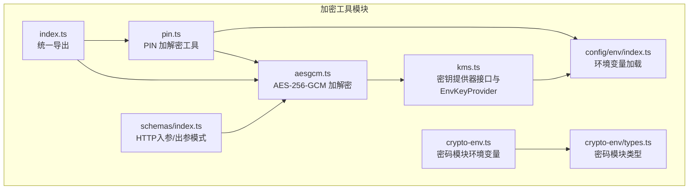
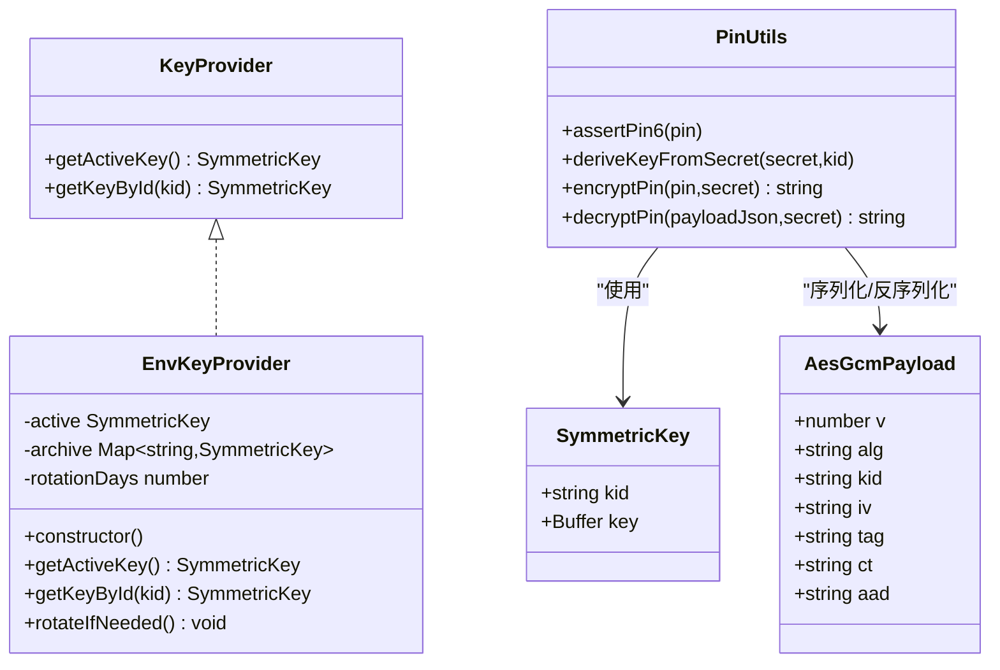
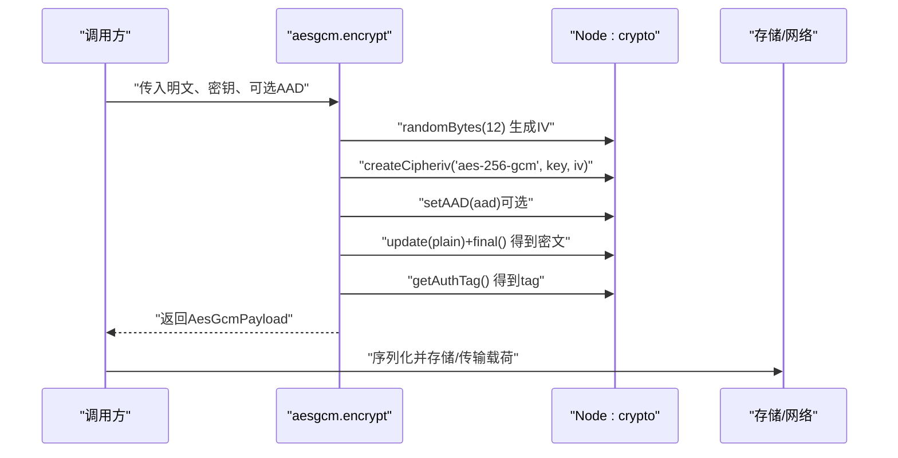
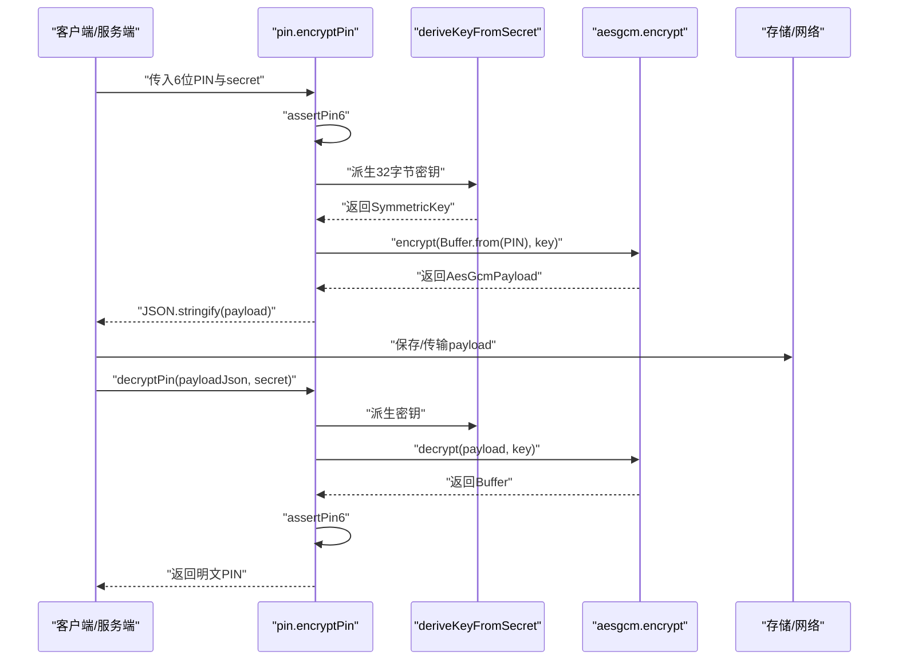
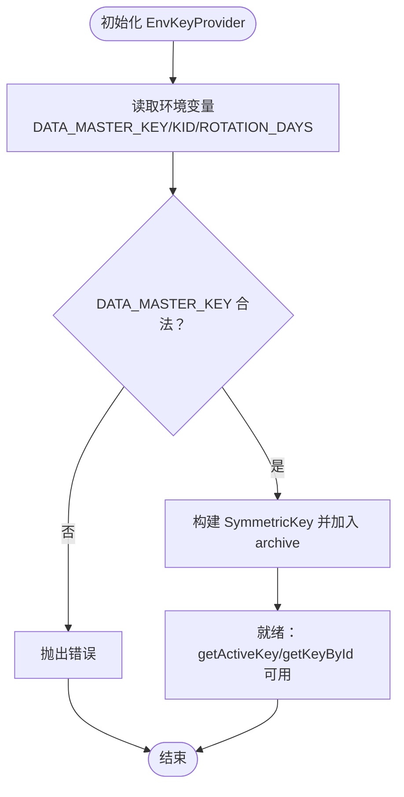
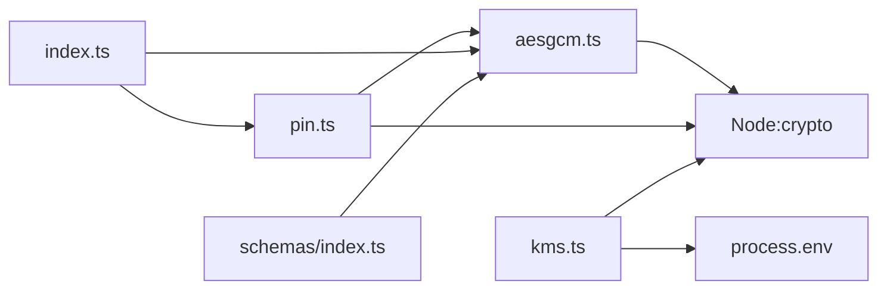

# AES-GCM对称加密

<cite>
**本文引用的文件**
- [src/tools/crypto/aesgcm.ts](file://src/tools/crypto/aesgcm.ts)
- [src/tools/crypto/pin.ts](file://src/tools/crypto/pin.ts)
- [src/tools/crypto/kms.ts](file://src/tools/crypto/kms.ts)
- [src/tools/crypto/index.ts](file://src/tools/crypto/index.ts)
- [src/tools/crypto/README.md](file://src/tools/crypto/README.md)
- [src/config/env/index.ts](file://src/config/env/index.ts)
- [src/tools/crypto/schemas/index.ts](file://src/tools/crypto/schemas/index.ts)
- [src/tools/crypto/crypto-env.ts](file://src/tools/crypto/crypto-env.ts)
- [src/tools/crypto/crypto-env/types.ts](file://src/tools/crypto/crypto-env/types.ts)
</cite>

## 目录
1. [简介](#简介)
2. [项目结构](#项目结构)
3. [核心组件](#核心组件)
4. [架构总览](#架构总览)
5. [详细组件分析](#详细组件分析)
6. [依赖关系分析](#依赖关系分析)
7. [性能与内存优化](#性能与内存优化)
8. [故障排查指南](#故障排查指南)
9. [结论](#结论)
10. [附录](#附录)

## 简介
本技术文档聚焦于IM-API中的AES-GCM对称加密模块，系统阐述其安全特性、实现原理与最佳实践。重点覆盖以下方面：
- AES-GCM模式的认证加密优势与性能特征
- encrypt与decrypt函数的实现细节、密钥管理、随机IV生成与认证标签处理
- PIN码加密的特殊需求与安全考量（密钥轮换、数据完整性保护）
- 典型业务场景下的使用方式与错误处理策略
- 密钥存储安全、随机数生成器选择与侧信道防护

## 项目结构
AES-GCM相关代码位于src/tools/crypto目录，围绕以下职责划分：
- aesgcm.ts：AES-256-GCM加解密、载荷结构与常量时间比较
- pin.ts：基于字符串secret派生密钥的PIN加解密工具
- kms.ts：密钥提供器接口与EnvKeyProvider实现（生产级密钥轮换与按KID检索）
- index.ts：统一导出常用API
- README.md：模块概览、快速开始与最佳实践
- config/env/index.ts：环境变量加载与类型安全
- schemas/index.ts：HTTP层入参/出参模式（zod）
- crypto-env与crypto-env/types.ts：密码模块相关环境变量类型

图表来源
- [src/tools/crypto/aesgcm.ts](file://src/tools/crypto/aesgcm.ts#L1-L100)
- [src/tools/crypto/pin.ts](file://src/tools/crypto/pin.ts#L1-L77)
- [src/tools/crypto/kms.ts](file://src/tools/crypto/kms.ts#L1-L95)
- [src/tools/crypto/index.ts](file://src/tools/crypto/index.ts#L1-L11)
- [src/tools/crypto/schemas/index.ts](file://src/tools/crypto/schemas/index.ts#L1-L29)
- [src/config/env/index.ts](file://src/config/env/index.ts#L1-L223)
- [src/tools/crypto/crypto-env.ts](file://src/tools/crypto/crypto-env.ts#L1-L6)
- [src/tools/crypto/crypto-env/types.ts](file://src/tools/crypto/crypto-env/types.ts#L1-L23)

章节来源
- [src/tools/crypto/README.md](file://src/tools/crypto/README.md#L1-L144)
- [src/tools/crypto/index.ts](file://src/tools/crypto/index.ts#L1-L11)

## 核心组件
- AES-256-GCM加解密
  - 支持随机12字节IV、16字节认证标签、可选AAD（附加认证数据）
  - 输出标准化载荷结构，便于序列化与传输
- PIN加解密
  - 基于字符串secret派生32字节对称密钥（SHA-256）
  - PIN固定为6位纯数字，提供断言与校验
- 密钥提供器
  - KeyProvider接口与EnvKeyProvider实现
  - 支持按KID检索历史密钥，支持密钥轮换占位
- 环境变量与类型
  - 统一加载与校验环境变量，确保配置安全与类型安全

章节来源
- [src/tools/crypto/aesgcm.ts](file://src/tools/crypto/aesgcm.ts#L22-L87)
- [src/tools/crypto/pin.ts](file://src/tools/crypto/pin.ts#L14-L76)
- [src/tools/crypto/kms.ts](file://src/tools/crypto/kms.ts#L15-L94)
- [src/config/env/index.ts](file://src/config/env/index.ts#L64-L223)

## 架构总览
AES-GCM模块通过统一的SymmetricKey与AesGcmPayload抽象，将密钥管理、随机IV生成、认证标签处理与序列化流程解耦，形成清晰的职责边界。PIN工具在此基础上增加secret派生与PIN格式校验，满足特定业务场景的安全需求。

图表来源
- [src/tools/crypto/aesgcm.ts](file://src/tools/crypto/aesgcm.ts#L43-L87)
- [src/tools/crypto/kms.ts](file://src/tools/crypto/kms.ts#L15-L94)
- [src/tools/crypto/pin.ts](file://src/tools/crypto/pin.ts#L14-L76)

## 详细组件分析

### AES-256-GCM加解密（encrypt/decrypt）
- 安全特性
  - 随机IV（12字节）：每次加密生成，避免重用IV导致的安全问题
  - 认证标签（16字节）：确保数据完整性与真实性
  - 可选AAD：绑定业务上下文，防止密文在不同上下文间被误用
- 实现要点
  - 加密：生成IV，创建cipher，设置AAD（如有），拼接更新与最终输出，提取认证标签，封装为AesGcmPayload
  - 解密：解析载荷，设置AAD与认证标签，执行解密并返回明文
  - 常量时间比较：safeKidEqual使用timingSafeEqual避免侧信道泄露
- 错误处理
  - 认证失败抛错，调用方需捕获并妥善处理
  - 建议在上层业务中区分“认证失败”与“其他异常”，避免信息泄露

图表来源
- [src/tools/crypto/aesgcm.ts](file://src/tools/crypto/aesgcm.ts#L52-L68)

章节来源
- [src/tools/crypto/aesgcm.ts](file://src/tools/crypto/aesgcm.ts#L52-L87)
- [src/tools/crypto/README.md](file://src/tools/crypto/README.md#L67-L72)

### PIN加解密（encryptPin/decryptPin）
- 业务需求
  - PIN固定为6位纯数字，满足支付/身份验证等场景
  - 通过secret派生密钥，避免直接管理二进制密钥
- 实现流程
  - 加密：断言PIN格式，派生密钥，调用AES-GCM加密，序列化为JSON字符串
  - 解密：反序列化载荷，派生密钥，AES-GCM解密，断言PIN格式
- 安全考虑
  - secret长度≥16字符，不足则抛错
  - 解密后再次断言PIN格式，确保输出符合预期
  - 建议在高并发场景下对secret进行缓存与限流

图表来源
- [src/tools/crypto/pin.ts](file://src/tools/crypto/pin.ts#L39-L76)
- [src/tools/crypto/aesgcm.ts](file://src/tools/crypto/aesgcm.ts#L52-L87)

章节来源
- [src/tools/crypto/pin.ts](file://src/tools/crypto/pin.ts#L14-L76)
- [src/tools/crypto/README.md](file://src/tools/crypto/README.md#L37-L44)

### 密钥提供器（KeyProvider/EnvKeyProvider）
- 设计目标
  - 统一密钥获取与检索接口，支持按KID查找历史密钥
  - 支持密钥轮换策略（轮换占位，生产需结合持久化实现）
- 关键点
  - 从环境变量加载主密钥（base64url，32字节），并生成KID
  - 提供按KID检索历史密钥的缓存映射
  - 轮换间隔可配置，默认90天（占位方法，实际轮换需扩展）

图表来源
- [src/tools/crypto/kms.ts](file://src/tools/crypto/kms.ts#L55-L94)
- [src/config/env/index.ts](file://src/config/env/index.ts#L166-L223)

章节来源
- [src/tools/crypto/kms.ts](file://src/tools/crypto/kms.ts#L15-L94)
- [src/config/env/index.ts](file://src/config/env/index.ts#L166-L223)

### 环境变量与类型安全
- 环境变量
  - PASSWORD_PEPPER：口令增强因子（≥16字符）
  - DATA_MASTER_KEY：主密钥（base64url，32字节）
  - DATA_MASTER_KEY_KID：可选主密钥标识
  - KEY_ROTATION_DAYS：密钥轮换提示间隔（默认90）
  - PIN_SECRET：PIN加解密密钥来源（≥16字符）
- 类型安全
  - 统一的EnvConfig接口，提供必需项与可选项的类型约束
  - crypto-env模块提供密码模块专用类型与实例

章节来源
- [src/config/env/index.ts](file://src/config/env/index.ts#L64-L223)
- [src/tools/crypto/crypto-env.ts](file://src/tools/crypto/crypto-env.ts#L1-L6)
- [src/tools/crypto/crypto-env/types.ts](file://src/tools/crypto/crypto-env/types.ts#L10-L23)

## 依赖关系分析
- aesgcm.ts依赖Node原生crypto模块（createCipheriv/createDecipheriv/randomBytes/timingSafeEqual）
- pin.ts依赖aesgcm.ts与Node原生crypto（createHash）
- kms.ts依赖process.env与Node原生crypto（randomUUID）
- index.ts聚合导出encryptPin/decryptPin与密码相关工具
- schemas/index.ts提供HTTP层入参/出参模式，便于路由校验

图表来源
- [src/tools/crypto/aesgcm.ts](file://src/tools/crypto/aesgcm.ts#L11)
- [src/tools/crypto/pin.ts](file://src/tools/crypto/pin.ts#L10-L12)
- [src/tools/crypto/kms.ts](file://src/tools/crypto/kms.ts#L10-L12)
- [src/tools/crypto/index.ts](file://src/tools/crypto/index.ts#L9-L10)
- [src/tools/crypto/schemas/index.ts](file://src/tools/crypto/schemas/index.ts#L15-L28)

章节来源
- [src/tools/crypto/index.ts](file://src/tools/crypto/index.ts#L1-L11)
- [src/tools/crypto/schemas/index.ts](file://src/tools/crypto/schemas/index.ts#L1-L29)

## 性能与内存优化
- 性能特征
  - AES-GCM为硬件加速友好算法，适合高吞吐场景
  - 认证标签长度16字节，兼顾安全性与开销
  - 随机IV长度12字节，满足随机性与性能平衡
- 内存优化建议
  - 复用Buffer对象，避免频繁分配
  - 对大块数据采用分片处理，减少峰值内存占用
  - 合理使用AAD，避免冗余数据增加认证开销
- 随机数生成器
  - 使用Node原生randomBytes生成IV，确保熵质量
  - 对密钥轮换与ID生成使用randomUUID，保证唯一性
- 侧信道防护
  - 使用timingSafeEqual进行常量时间比较，避免时序攻击
  - 避免在错误消息中泄露敏感信息（如密钥ID）

[本节为通用性能指导，不直接分析具体文件]

## 故障排查指南
- 常见错误与定位
  - 认证失败：检查IV、认证标签、密钥与AAD是否一致
  - 密钥来源错误：确认DATA_MASTER_KEY或PIN_SECRET配置正确且长度满足要求
  - PIN格式错误：确保输入为6位纯数字
  - 环境变量缺失：核对.env或部署环境变量是否完整
- 建议的日志与监控
  - 记录关键操作（加密/解密、密钥轮换）但避免输出敏感数据
  - 对异常进行分类统计，辅助定位问题根因

章节来源
- [src/tools/crypto/README.md](file://src/tools/crypto/README.md#L129-L136)
- [src/tools/crypto/aesgcm.ts](file://src/tools/crypto/aesgcm.ts#L70-L87)
- [src/tools/crypto/pin.ts](file://src/tools/crypto/pin.ts#L24-L37)

## 结论
AES-GCM对称加密模块在IM-API中提供了安全、高效的数据保护能力。通过随机IV、认证标签与可选AAD，实现了机密性与完整性的双重保障。PIN工具进一步针对特定业务场景进行了适配与加固。配合密钥提供器与严格的环境配置，模块具备良好的可扩展性与生产可用性。建议在生产环境中完善密钥轮换策略与审计日志，持续提升整体安全水平。

[本节为总结性内容，不直接分析具体文件]

## 附录

### API参考与使用示例路径
- AES-GCM加解密
  - [encrypt](file://src/tools/crypto/aesgcm.ts#L52-L68)
  - [decrypt](file://src/tools/crypto/aesgcm.ts#L70-L87)
  - [AesGcmPayload](file://src/tools/crypto/aesgcm.ts#L22-L41)
  - [SymmetricKey](file://src/tools/crypto/aesgcm.ts#L43-L49)
- PIN加解密
  - [encryptPin](file://src/tools/crypto/pin.ts#L39-L55)
  - [decryptPin](file://src/tools/crypto/pin.ts#L57-L76)
  - [deriveKeyFromSecret](file://src/tools/crypto/pin.ts#L24-L37)
  - [assertPin6](file://src/tools/crypto/pin.ts#L14-L22)
- 密钥提供器
  - [KeyProvider](file://src/tools/crypto/kms.ts#L15-L36)
  - [EnvKeyProvider](file://src/tools/crypto/kms.ts#L38-L94)
- 环境变量与类型
  - [EnvConfig](file://src/config/env/index.ts#L64-L160)
  - [cryptoEnv](file://src/tools/crypto/crypto-env.ts#L3-L5)
  - [CrypEnv](file://src/tools/crypto/crypto-env/types.ts#L10-L21)

### HTTP层入参/出参模式
- [TEncryptReq/TEncryptRes](file://src/tools/crypto/schemas/index.ts#L15-L25)
- [TDecryptReq/TDecryptRes](file://src/tools/crypto/schemas/index.ts#L27-L28)

### 快速开始与最佳实践
- [快速开始与示例](file://src/tools/crypto/README.md#L16-L57)
- [最佳实践](file://src/tools/crypto/README.md#L121-L127)