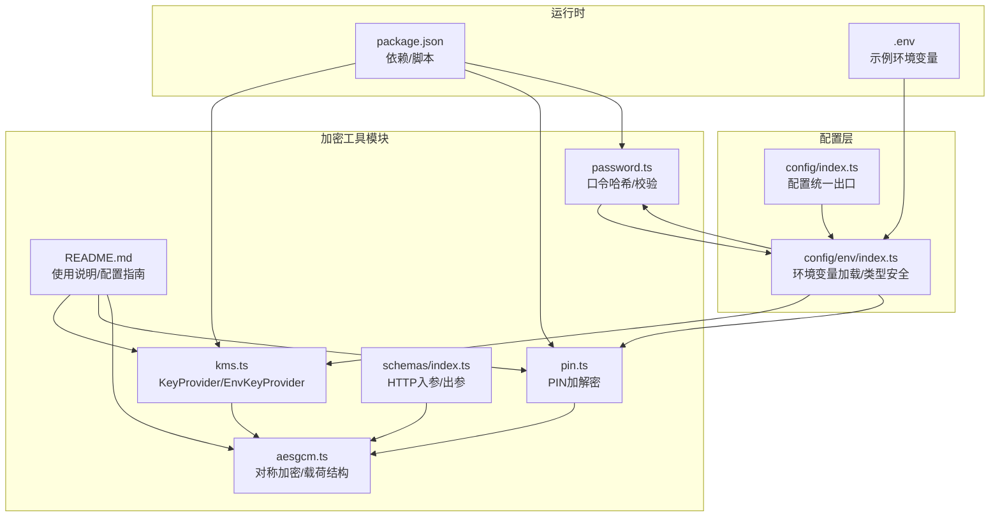
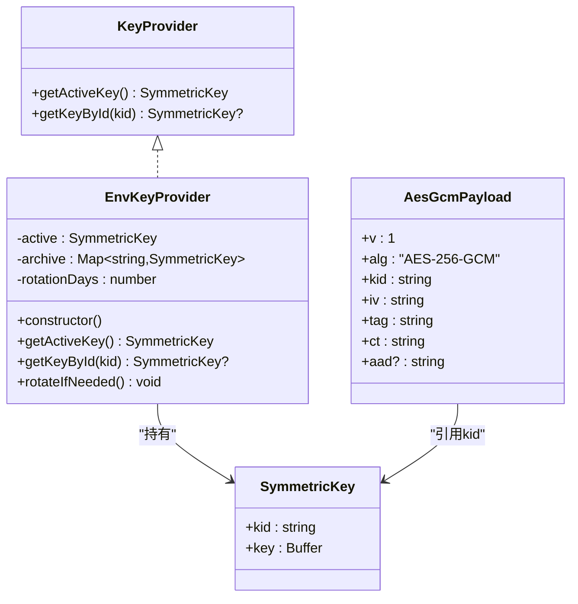
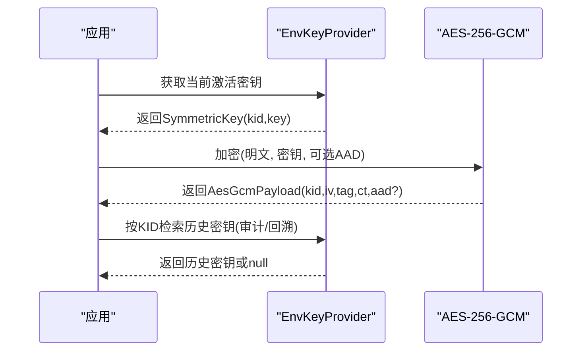
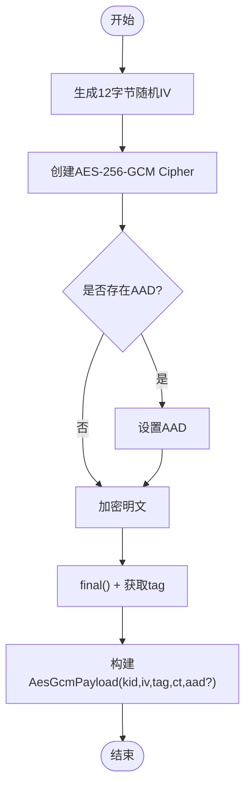
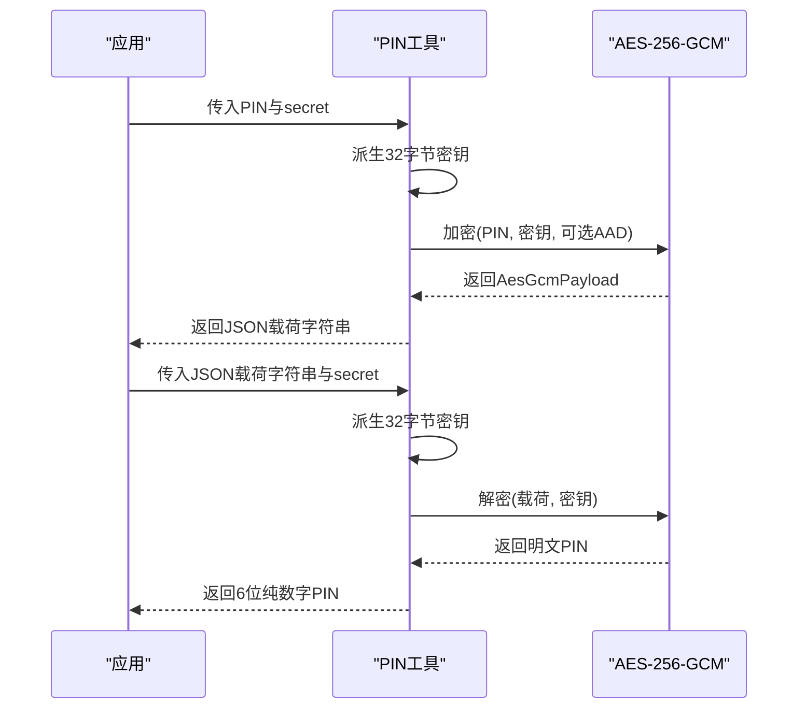
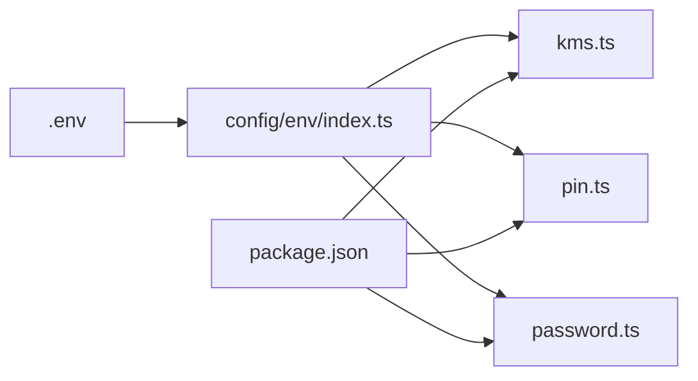

# KMS密钥管理

<cite>
**本文引用的文件**
- [src/tools/crypto/kms.ts](file://src/tools/crypto/kms.ts)
- [src/tools/crypto/aesgcm.ts](file://src/tools/crypto/aesgcm.ts)
- [src/tools/crypto/pin.ts](file://src/tools/crypto/pin.ts)
- [src/tools/crypto/password.ts](file://src/tools/crypto/password.ts)
- [src/tools/crypto/README.md](file://src/tools/crypto/README.md)
- [src/config/env/index.ts](file://src/config/env/index.ts)
- [src/config/index.ts](file://src/config/index.ts)
- [src/tools/crypto/schemas/index.ts](file://src/tools/crypto/schemas/index.ts)
- [.env](file://.env)
- [package.json](file://package.json)
</cite>

## 目录
1. [简介](#简介)
2. [项目结构](#项目结构)
3. [核心组件](#核心组件)
4. [架构总览](#架构总览)
5. [详细组件分析](#详细组件分析)
6. [依赖关系分析](#依赖关系分析)
7. [性能考量](#性能考量)
8. [故障排查指南](#故障排查指南)
9. [结论](#结论)
10. [附录](#附录)

## 简介
本文件面向IM-API的KMS密钥管理模块，系统化阐述密钥提供器接口与默认实现、密钥生命周期策略、与本地加密的协作模式、密钥版本管理与访问控制、安全存储与传输、访问审计、备份恢复与灾难恢复、以及可用性与故障转移策略。文档以仓库现有代码为基础，结合配置与环境变量，给出可落地的实施建议与调用示例路径。

## 项目结构
KMS密钥管理位于加密工具模块中，核心文件包括：
- 密钥提供器接口与默认实现：src/tools/crypto/kms.ts
- 对称加密算法与载荷结构：src/tools/crypto/aesgcm.ts
- PIN加解密工具：src/tools/crypto/pin.ts
- 口令哈希与校验：src/tools/crypto/password.ts
- 加密模块使用说明与配置指南：src/tools/crypto/README.md
- 环境变量加载与类型安全：src/config/env/index.ts
- 配置统一出口：src/config/index.ts
- HTTP入参与响应模式（用于路由层对接）：src/tools/crypto/schemas/index.ts
- 项目依赖与脚本：package.json
- 开发期示例环境变量：.env

**图表来源**
- [src/tools/crypto/kms.ts](file://src/tools/crypto/kms.ts#L1-L95)
- [src/tools/crypto/aesgcm.ts](file://src/tools/crypto/aesgcm.ts#L1-L100)
- [src/tools/crypto/pin.ts](file://src/tools/crypto/pin.ts#L1-L77)
- [src/tools/crypto/password.ts](file://src/tools/crypto/password.ts#L1-L111)
- [src/tools/crypto/schemas/index.ts](file://src/tools/crypto/schemas/index.ts#L1-L28)
- [src/tools/crypto/README.md](file://src/tools/crypto/README.md#L1-L144)
- [src/config/env/index.ts](file://src/config/env/index.ts#L1-L223)
- [src/config/index.ts](file://src/config/index.ts#L1-L30)
- [package.json](file://package.json#L1-L36)
- [.env](file://.env#L1-L22)

**章节来源**
- [src/tools/crypto/README.md](file://src/tools/crypto/README.md#L1-L144)
- [src/config/env/index.ts](file://src/config/env/index.ts#L1-L223)
- [src/config/index.ts](file://src/config/index.ts#L1-L30)
- [package.json](file://package.json#L1-L36)
- [.env](file://.env#L1-L22)

## 核心组件
- KeyProvider接口：定义获取当前激活密钥与按KID检索历史密钥的能力，支撑密钥版本管理与回溯。
- EnvKeyProvider类：默认实现，从环境变量加载主密钥与轮换参数，维护激活密钥与历史密钥缓存。
- SymmetricKey与AesGcmPayload：对称密钥实体与AES-256-GCM加密载荷结构，承载密钥ID与认证标签。
- PIN加解密：基于字符串secret派生32字节密钥，对6位纯数字PIN进行AES-GCM加解密。
- 口令哈希：基于scrypt的单向哈希与校验，支持pepper增强与参数升级评估。
- HTTP模式：提供加密/解密请求与响应的类型定义，便于路由层校验与集成。

**章节来源**
- [src/tools/crypto/kms.ts](file://src/tools/crypto/kms.ts#L15-L94)
- [src/tools/crypto/aesgcm.ts](file://src/tools/crypto/aesgcm.ts#L22-L99)
- [src/tools/crypto/pin.ts](file://src/tools/crypto/pin.ts#L14-L76)
- [src/tools/crypto/password.ts](file://src/tools/crypto/password.ts#L14-L110)
- [src/tools/crypto/schemas/index.ts](file://src/tools/crypto/schemas/index.ts#L1-L28)

## 架构总览
KMS模块通过KeyProvider抽象与EnvKeyProvider实现，将密钥来源与使用解耦。应用在需要对称加密时，先通过KMS获取当前激活密钥，再使用AES-256-GCM完成加解密；对于PIN场景，使用PIN工具从secret派生密钥；对于口令场景，使用password工具进行scrypt哈希与校验。所有密钥ID（kid）均在载荷中携带，便于审计与版本追踪。

**图表来源**
- [src/tools/crypto/kms.ts](file://src/tools/crypto/kms.ts#L15-L94)
- [src/tools/crypto/aesgcm.ts](file://src/tools/crypto/aesgcm.ts#L22-L49)

## 详细组件分析

### 密钥提供器与密钥生命周期
- 接口职责：KeyProvider定义获取当前激活密钥与按KID检索历史密钥的方法，满足密钥版本管理与回溯需求。
- 默认实现：EnvKeyProvider从环境变量加载主密钥，校验长度合法性，生成或使用KID，初始化历史密钥缓存，并设置轮换间隔。当前实现提供轮换占位方法，生产环境需结合持久层与时间策略实现真实轮换。
- 密钥版本管理：通过Map缓存历史密钥，按KID检索；载荷中携带kid，便于审计与跨版本解密。
- 访问控制：通过环境变量隔离密钥来源，避免硬编码；对密钥ID比较采用常量时间比较，降低侧信道风险。

**图表来源**
- [src/tools/crypto/kms.ts](file://src/tools/crypto/kms.ts#L45-L94)
- [src/tools/crypto/aesgcm.ts](file://src/tools/crypto/aesgcm.ts#L52-L87)

**章节来源**
- [src/tools/crypto/kms.ts](file://src/tools/crypto/kms.ts#L15-L94)
- [src/tools/crypto/aesgcm.ts](file://src/tools/crypto/aesgcm.ts#L22-L99)

### AES-256-GCM对称加密与载荷结构
- 加密流程：随机生成12字节IV，创建cipher，设置可选AAD，产出密文与16字节认证标签，封装为AesGcmPayload。
- 解密流程：解析载荷，校验认证标签，产出明文；认证失败抛错。
- 安全要点：载荷包含kid，便于审计；常量时间比较kid避免侧信道；建议在业务上下文设置AAD，绑定唯一标识。

**图表来源**
- [src/tools/crypto/aesgcm.ts](file://src/tools/crypto/aesgcm.ts#L52-L87)

**章节来源**
- [src/tools/crypto/aesgcm.ts](file://src/tools/crypto/aesgcm.ts#L1-L100)

### PIN加解密协作模式
- 密钥派生：从secret（长度≥16）派生32字节密钥，固定kid用于追踪来源。
- 加密：对6位纯数字PIN进行AES-GCM加密，返回JSON序列化的载荷字符串。
- 解密：解析载荷，AES-GCM解密，断言结果仍为6位纯数字PIN。
- 使用场景：PIN作为本地敏感数据的对称加密保护，与KMS主密钥配合，形成多层保护。

**图表来源**
- [src/tools/crypto/pin.ts](file://src/tools/crypto/pin.ts#L24-L76)
- [src/tools/crypto/aesgcm.ts](file://src/tools/crypto/aesgcm.ts#L52-L87)

**章节来源**
- [src/tools/crypto/pin.ts](file://src/tools/crypto/pin.ts#L1-L77)

### 口令哈希与校验（与KMS协作）
- 口令哈希：基于scrypt，结合pepper增强安全性，生成包含成本参数与salt的哈希。
- 校验与升级：支持常量时间比较与参数升级评估，必要时返回新哈希以便在登录成功后更新存储。
- 与KMS协作：口令哈希不依赖KMS；但若未来引入口令加密场景，可沿用KMS提供的密钥与载荷结构。

**章节来源**
- [src/tools/crypto/password.ts](file://src/tools/crypto/password.ts#L14-L110)

### HTTP模式与路由集成
- 模式定义：提供口令哈希、校验与升级、AES-GCM加解密的请求/响应类型，便于路由层校验与契约约束。
- 集成建议：在路由层使用相应模式进行入参校验，确保payload结构与密钥ID一致，避免跨上下文复用。

**章节来源**
- [src/tools/crypto/schemas/index.ts](file://src/tools/crypto/schemas/index.ts#L1-L28)

## 依赖关系分析
- 环境变量：通过config/env/index.ts加载dotenv并进行类型安全转换，KMS与PIN工具均依赖环境变量中的密钥与参数。
- 依赖库：使用Node原生crypto模块实现对称加密与哈希；dotenv用于加载环境变量；项目其他依赖（如JWT、数据库等）与KMS模块解耦。
- 配置出口：config/index.ts统一导出env配置，便于上层模块按需引用。

**图表来源**
- [.env](file://.env#L1-L22)
- [src/config/env/index.ts](file://src/config/env/index.ts#L13-L223)
- [src/tools/crypto/kms.ts](file://src/tools/crypto/kms.ts#L10-L13)
- [src/tools/crypto/pin.ts](file://src/tools/crypto/pin.ts#L10-L12)
- [src/tools/crypto/password.ts](file://src/tools/crypto/password.ts#L10-L12)
- [package.json](file://package.json#L12-L23)

**章节来源**
- [src/config/env/index.ts](file://src/config/env/index.ts#L10-L223)
- [src/config/index.ts](file://src/config/index.ts#L7-L30)
- [package.json](file://package.json#L12-L23)

## 性能考量
- AES-256-GCM：硬件加速可用时性能优异；随机IV与认证标签开销可控。
- scrypt：成本参数（N/r/p/keylen）越高，CPU与内存消耗越大；建议在用户登录时评估升级，避免频繁重算。
- 密钥轮换：轮换策略需平衡安全与性能，避免在高并发时段执行；可采用渐进式切换与双密钥并行期。
- 缓存与归档：EnvKeyProvider维护历史密钥缓存，减少重复加载；建议结合LRU策略限制缓存规模。

## 故障排查指南
- 环境变量缺失或非法
  - 现象：启动时报错或运行时抛出异常。
  - 排查：检查DATA_MASTER_KEY长度与base64url格式、KEY_ROTATION_DAYS数值、PIN_SECRET长度、PASSWORD_PEPPER长度。
- 认证失败
  - 现象：解密抛错或口令校验失败。
  - 排查：确认载荷字段完整性（kid/iv/tag/ct/aad）、密钥ID一致性、AAD是否匹配、pepper是否正确。
- 密钥轮换未生效
  - 现象：rotateIfNeeded为占位实现，未实际执行轮换。
  - 排查：生产环境需实现持久化轮换与历史密钥归档。
- 日志与安全
  - 建议：避免输出密钥与明文敏感信息；对异常进行脱敏记录。

**章节来源**
- [src/tools/crypto/kms.ts](file://src/tools/crypto/kms.ts#L55-L65)
- [src/tools/crypto/pin.ts](file://src/tools/crypto/pin.ts#L32-L37)
- [src/tools/crypto/password.ts](file://src/tools/crypto/password.ts#L40-L46)
- [src/tools/crypto/aesgcm.ts](file://src/tools/crypto/aesgcm.ts#L78-L87)
- [src/tools/crypto/README.md](file://src/tools/crypto/README.md#L129-L136)

## 结论
本项目通过KeyProvider接口与EnvKeyProvider实现，提供了可扩展的密钥管理基础能力。结合AES-256-GCM与PIN工具，实现了对称加密与本地敏感数据保护。建议在生产环境完善密钥轮换、历史密钥归档与持久化策略，并在路由层严格校验载荷结构，确保密钥版本管理与访问控制的有效性。

## 附录

### 环境变量与配置要点
- 必填项
  - PASSWORD_PEPPER：≥16字符，增强scrypt安全性。
  - DATA_MASTER_KEY：32字节base64url，KMS主密钥。
  - PIN_SECRET：≥16字符，PIN加解密密钥来源。
- 可选项
  - DATA_MASTER_KEY_KID：自定义主密钥KID。
  - KEY_ROTATION_DAYS：密钥轮换提示间隔，默认90天。
- 其他
  - JWT_SECRET：用于JWT签名（与KMS职责分离）。

**章节来源**
- [src/tools/crypto/README.md](file://src/tools/crypto/README.md#L103-L120)
- [.env](file://.env#L17-L22)

### 代码示例路径
- 使用EnvKeyProvider与AES-256-GCM
  - 示例路径：[示例：直接使用AES-GCM（含AAD）](file://src/tools/crypto/README.md#L46-L57)
- 使用PIN加解密
  - 示例路径：[示例：PIN 加/解密（序列化载荷 JSON）](file://src/tools/crypto/README.md#L37-L44)
- 使用口令哈希与校验
  - 示例路径：[示例：生成与验证口令哈希](file://src/tools/crypto/README.md#L27-L35)