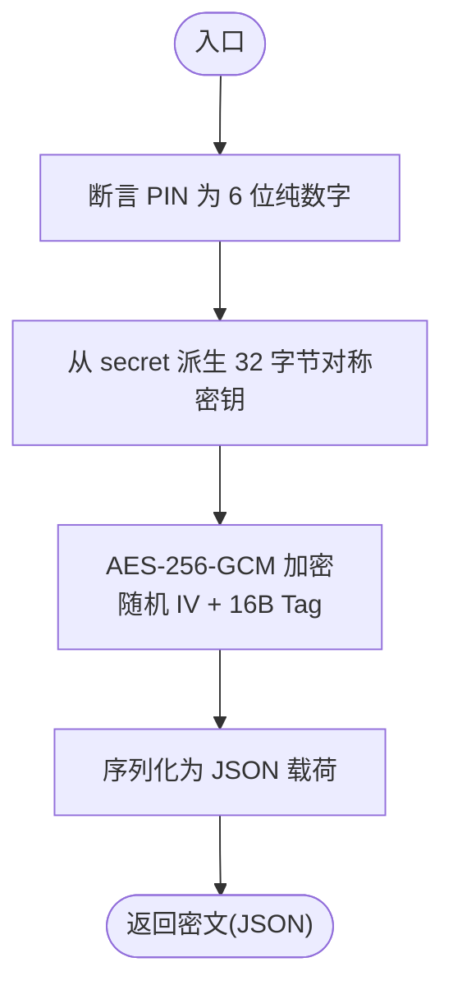

# PIN码加密

<cite>
**本文引用的文件**
- [src/tools/crypto/pin.ts](file://src/tools/crypto/pin.ts)
- [src/tools/crypto/aesgcm.ts](file://src/tools/crypto/aesgcm.ts)
- [src/tools/crypto/index.ts](file://src/tools/crypto/index.ts)
- [src/tools/crypto/README.md](file://src/tools/crypto/README.md)
- [src/models/user/user.ts](file://src/models/user/user.ts)
- [src/services/auth.ts](file://src/services/auth.ts)
- [src/contracts/auth.controller.ts](file://src/contracts/auth.controller.ts)
- [src/routes/auth.ts](file://src/routes/auth.ts)
- [src/config/env/index.ts](file://src/config/env/index.ts)
- [src/middleware/rate-limit/index.ts](file://src/middleware/rate-limit/index.ts)
</cite>

## 目录
1. [简介](#简介)
2. [项目结构](#项目结构)
3. [核心组件](#核心组件)
4. [架构总览](#架构总览)
5. [组件详解](#组件详解)
6. [依赖关系分析](#依赖关系分析)
7. [性能与安全考量](#性能与安全考量)
8. [故障排查指南](#故障排查指南)
9. [结论](#结论)
10. [附录](#附录)

## 简介
本技术文档聚焦于 IM-API 的 PIN 码加密模块，系统性阐述其安全设计、实现策略与使用规范。PIN 码作为高敏感的二次验证因子，具有易受暴力破解与侧信道攻击的特点，因此采用严格的长度与字符集约束、基于对称密钥派生的 AES-256-GCM 加密、以及严格的输入校验与错误处理策略，确保在存储与传输过程中的机密性与完整性。本文还涵盖 PIN 码的生命周期管理、轮换策略与审计要求，并提供可直接定位到源码的路径指引，帮助开发者正确实现 PIN 码的生成、存储与验证流程。

## 项目结构
与 PIN 码加密相关的关键文件分布如下：
- 工具层：提供 PIN 加解密与 AES-GCM 底层实现
- 模型层：用户模型中包含 PIN 字段
- 服务层：认证服务在注册时接收并存储 PIN
- 控制器与路由：对外暴露注册接口并对 PIN 进行基础校验
- 环境配置：提供 PIN_SECRET 等安全配置项
- 安全中间件：提供速率限制等防护能力

图表来源
- [src/tools/crypto/pin.ts](file://src/tools/crypto/pin.ts#L1-L77)
- [src/tools/crypto/aesgcm.ts](file://src/tools/crypto/aesgcm.ts#L1-L100)
- [src/tools/crypto/index.ts](file://src/tools/crypto/index.ts#L1-L11)
- [src/models/user/user.ts](file://src/models/user/user.ts#L1-L275)
- [src/services/auth.ts](file://src/services/auth.ts#L1-L170)
- [src/contracts/auth.controller.ts](file://src/contracts/auth.controller.ts#L1-L111)
- [src/routes/auth.ts](file://src/routes/auth.ts#L1-L47)
- [src/config/env/index.ts](file://src/config/env/index.ts#L165-L223)
- [src/middleware/rate-limit/index.ts](file://src/middleware/rate-limit/index.ts#L1-L69)

章节来源
- [src/tools/crypto/pin.ts](file://src/tools/crypto/pin.ts#L1-L77)
- [src/tools/crypto/aesgcm.ts](file://src/tools/crypto/aesgcm.ts#L1-L100)
- [src/tools/crypto/index.ts](file://src/tools/crypto/index.ts#L1-L11)
- [src/models/user/user.ts](file://src/models/user/user.ts#L1-L275)
- [src/services/auth.ts](file://src/services/auth.ts#L1-L170)
- [src/contracts/auth.controller.ts](file://src/contracts/auth.controller.ts#L1-L111)
- [src/routes/auth.ts](file://src/routes/auth.ts#L1-L47)
- [src/config/env/index.ts](file://src/config/env/index.ts#L165-L223)
- [src/middleware/rate-limit/index.ts](file://src/middleware/rate-limit/index.ts#L1-L69)

## 核心组件
- PIN 加密工具（pin.ts）
  - 提供断言 6 位纯数字、从 secret 派生对称密钥、使用 AES-256-GCM 加密与解密的能力
  - 输出为可序列化的 JSON 载荷字符串，便于安全存储
- AES-256-GCM 实现（aesgcm.ts）
  - 随机初始化向量（IV）、16 字节认证标签（Tag）、可选附加认证数据（AAD）
  - 提供常量时间 KID 比较，防止侧信道泄露
- 用户模型（user.ts）
  - 定义 PIN 字段类型与长度约束，注册时写入数据库
- 认证服务与控制器（auth.ts、auth.controller.ts）
  - 注册流程中接收 PIN 并调用服务层存储
  - 控制器对 PIN 进行基础格式校验
- 环境配置（config/env/index.ts）
  - 提供 PIN_SECRET 等关键安全配置项
- 速率限制中间件（middleware/rate-limit/index.ts）
  - 通过固定窗口计数限制同一 IP 的请求频率，缓解暴力破解风险

章节来源
- [src/tools/crypto/pin.ts](file://src/tools/crypto/pin.ts#L14-L76)
- [src/tools/crypto/aesgcm.ts](file://src/tools/crypto/aesgcm.ts#L23-L87)
- [src/models/user/user.ts](file://src/models/user/user.ts#L151-L155)
- [src/services/auth.ts](file://src/services/auth.ts#L94-L117)
- [src/contracts/auth.controller.ts](file://src/contracts/auth.controller.ts#L41-L45)
- [src/config/env/index.ts](file://src/config/env/index.ts#L174-L174)
- [src/middleware/rate-limit/index.ts](file://src/middleware/rate-limit/index.ts#L43-L69)

## 架构总览
下图展示了从注册请求到 PIN 存储与后续使用的整体流程，以及与安全组件的交互。

图表来源
- [src/routes/auth.ts](file://src/routes/auth.ts#L18-L23)
- [src/contracts/auth.controller.ts](file://src/contracts/auth.controller.ts#L25-L52)
- [src/services/auth.ts](file://src/services/auth.ts#L94-L117)
- [src/models/user/user.ts](file://src/models/user/user.ts#L151-L155)
- [src/tools/crypto/pin.ts](file://src/tools/crypto/pin.ts#L39-L55)
- [src/tools/crypto/aesgcm.ts](file://src/tools/crypto/aesgcm.ts#L59-L68)
- [src/config/env/index.ts](file://src/config/env/index.ts#L174-L174)

## 组件详解

### PIN 加密工具（pin.ts）
- 功能要点
  - 断言：确保 PIN 为 6 位纯数字
  - 密钥派生：从 secret 派生 32 字节对称密钥（SHA-256）
  - 加密：使用 AES-256-GCM，随机 IV 与 16 字节 Tag，返回 JSON 序列化载荷
  - 解密：解析 JSON 载荷，执行解密并再次断言为 6 位纯数字
- 数据格式与编码
  - 明文：UTF-8 字节流
  - 密文：JSON 结构体，包含版本、算法、密钥 ID、IV、Tag、密文等字段
- 错误处理
  - PIN 非法或 secret 长度不足时抛出错误
  - 解密后若非 6 位纯数字同样抛出错误

图表来源
- [src/tools/crypto/pin.ts](file://src/tools/crypto/pin.ts#L20-L55)

章节来源
- [src/tools/crypto/pin.ts](file://src/tools/crypto/pin.ts#L14-L76)

### AES-256-GCM 实现（aesgcm.ts）
- 关键特性
  - 随机 IV（12 字节）、认证标签（16 字节）
  - 可选 AAD（附加认证数据），用于绑定业务上下文
  - 常量时间 KID 比较，避免侧信道
- 载荷结构
  - 字段：版本、算法、密钥 ID、IV、Tag、密文、可选 AAD
- 安全性
  - 认证失败时抛错，确保完整性校验

图表来源
- [src/tools/crypto/aesgcm.ts](file://src/tools/crypto/aesgcm.ts#L23-L87)

章节来源
- [src/tools/crypto/aesgcm.ts](file://src/tools/crypto/aesgcm.ts#L1-L100)

### 用户模型与 PIN 字段（user.ts）
- 字段定义
  - PIN：字符串类型，长度约束，用于存储加密后的载荷
- 生命周期
  - 注册时写入数据库；后续通过服务层进行认证与访问控制
- 安全序列化
  - 自定义 toJSON，剔除敏感字段，降低泄露风险

章节来源
- [src/models/user/user.ts](file://src/models/user/user.ts#L151-L155)
- [src/models/user/user.ts](file://src/models/user/user.ts#L96-L100)

### 认证服务与控制器（auth.ts、auth.controller.ts）
- 注册流程
  - 控制器对手机号、密码、PIN 进行基础校验
  - 服务层调用模型创建用户，模型在 beforeSave 钩子中处理密码哈希
  - PIN 以加密载荷形式写入数据库
- 登录流程
  - 通过现有密码认证流程完成登录，随后可结合 PIN 进行二次验证（如需）

图表来源
- [src/contracts/auth.controller.ts](file://src/contracts/auth.controller.ts#L25-L52)
- [src/services/auth.ts](file://src/services/auth.ts#L94-L117)
- [src/models/user/user.ts](file://src/models/user/user.ts#L151-L155)

章节来源
- [src/contracts/auth.controller.ts](file://src/contracts/auth.controller.ts#L25-L52)
- [src/services/auth.ts](file://src/services/auth.ts#L94-L117)

### 环境配置与密钥来源（config/env/index.ts）
- 关键配置项
  - PIN_SECRET：PIN 加解密的密钥来源，长度需 ≥16
- 默认值
  - 开发环境下提供默认值，生产环境应强制覆盖

章节来源
- [src/config/env/index.ts](file://src/config/env/index.ts#L174-L174)

### 速率限制与暴力破解防护（middleware/rate-limit/index.ts）
- 机制
  - 基于内存的固定窗口计数，按客户端 IP 维度统计
  - 通过环境变量配置窗口时长与最大请求数
- 防护效果
  - 有效抑制针对注册/登录接口的暴力破解行为

章节来源
- [src/middleware/rate-limit/index.ts](file://src/middleware/rate-limit/index.ts#L43-L69)

## 依赖关系分析
- 组件耦合
  - 控制器依赖服务层；服务层依赖模型；模型依赖 PIN 工具；PIN 工具依赖 AES-GCM
- 外部依赖
  - Node 原生 crypto 模块（哈希、对称加解密、随机数、常量时间比较）
- 环境依赖
  - PIN_SECRET 由环境配置提供，用于密钥派生

图表来源
- [src/contracts/auth.controller.ts](file://src/contracts/auth.controller.ts#L1-L111)
- [src/services/auth.ts](file://src/services/auth.ts#L1-L170)
- [src/models/user/user.ts](file://src/models/user/user.ts#L1-L275)
- [src/tools/crypto/pin.ts](file://src/tools/crypto/pin.ts#L1-L77)
- [src/tools/crypto/aesgcm.ts](file://src/tools/crypto/aesgcm.ts#L1-L100)
- [src/config/env/index.ts](file://src/config/env/index.ts#L165-L223)

章节来源
- [src/contracts/auth.controller.ts](file://src/contracts/auth.controller.ts#L1-L111)
- [src/services/auth.ts](file://src/services/auth.ts#L1-L170)
- [src/models/user/user.ts](file://src/models/user/user.ts#L1-L275)
- [src/tools/crypto/pin.ts](file://src/tools/crypto/pin.ts#L1-L77)
- [src/tools/crypto/aesgcm.ts](file://src/tools/crypto/aesgcm.ts#L1-L100)
- [src/config/env/index.ts](file://src/config/env/index.ts#L165-L223)

## 性能与安全考量
- 性能
  - AES-256-GCM 加解密开销极低，适合高频场景
  - JSON 序列化/反序列化成本可忽略
- 安全
  - 严格长度与字符集约束，降低枚举空间
  - 随机 IV 与认证标签确保完整性与抗篡改
  - 常量时间 KID 比较避免侧信道
  - PIN_SECRET 需满足最小长度要求，防止弱密钥
- 风险与缓解
  - 暴力破解：通过速率限制中间件进行防护
  - 重放与跨上下文复用：建议在解密时引入 AAD 绑定业务上下文
  - 日志与输出：严禁记录明文或密钥，避免信息泄露

[本节为通用指导，不直接分析具体文件]

## 故障排查指南
- 常见错误与定位
  - “PIN 必须是 6 位纯数字”：检查输入是否为 6 位纯数字
  - “PIN secret 长度不足（≥16）”：确认环境变量 PIN_SECRET 长度满足要求
  - “认证失败”：检查密钥 ID、IV、Tag、密文与密钥是否一致
- 排查步骤
  - 确认控制器对 PIN 的基础校验是否通过
  - 确认服务层创建用户时传入的 PIN 已加密
  - 确认数据库中存储的是 JSON 载荷而非明文
  - 检查环境变量 PIN_SECRET 是否正确加载
  - 观察速率限制中间件是否触发 429 Too Many Requests

章节来源
- [src/contracts/auth.controller.ts](file://src/contracts/auth.controller.ts#L41-L45)
- [src/tools/crypto/pin.ts](file://src/tools/crypto/pin.ts#L20-L36)
- [src/tools/crypto/aesgcm.ts](file://src/tools/crypto/aesgcm.ts#L78-L87)
- [src/config/env/index.ts](file://src/config/env/index.ts#L174-L174)
- [src/middleware/rate-limit/index.ts](file://src/middleware/rate-limit/index.ts#L53-L56)

## 结论
PIN 码加密模块通过严格的输入约束、安全的对称加密与密钥派生策略，实现了高敏感数据在存储与传输阶段的机密性与完整性保障。配合速率限制等运行时防护，能够有效抵御暴力破解等常见威胁。建议在生产环境中：
- 强制使用高强度的 PIN_SECRET
- 引入 AAD 绑定业务上下文，提升抗重放能力
- 完善密钥轮换与审计机制，定期审查与更新密钥策略
- 在日志与监控中避免输出任何敏感信息

[本节为总结性内容，不直接分析具体文件]

## 附录

### PIN 码数据格式与存储结构
- 明文约束：6 位纯数字
- 存储格式：JSON 序列化后的 AES-GCM 载荷
- 字段含义：版本、算法、密钥 ID、IV、Tag、密文、可选 AAD

章节来源
- [src/tools/crypto/pin.ts](file://src/tools/crypto/pin.ts#L39-L55)
- [src/tools/crypto/aesgcm.ts](file://src/tools/crypto/aesgcm.ts#L23-L41)

### PIN 验证流程（服务端）
- 输入：JSON 载荷字符串与 PIN_SECRET
- 步骤：解析 JSON -> 解密 -> 校验为 6 位纯数字 -> 返回明文
- 错误：解析失败、认证失败、非 6 位纯数字均抛出错误

章节来源
- [src/tools/crypto/pin.ts](file://src/tools/crypto/pin.ts#L57-L76)
- [src/tools/crypto/aesgcm.ts](file://src/tools/crypto/aesgcm.ts#L70-L87)

### 代码示例路径（不展示具体代码内容）
- 生成与验证口令哈希（参考）
  - [src/tools/crypto/password.ts](file://src/tools/crypto/password.ts#L39-L70)
- PIN 加/解密（序列化载荷 JSON）
  - [src/tools/crypto/pin.ts](file://src/tools/crypto/pin.ts#L39-L76)
- AES-256-GCM 加/解密
  - [src/tools/crypto/aesgcm.ts](file://src/tools/crypto/aesgcm.ts#L59-L87)
- 统一导出
  - [src/tools/crypto/index.ts](file://src/tools/crypto/index.ts#L9-L10)

### 环境配置清单
- 必填项
  - PIN_SECRET：≥16 字符
- 可选项
  - 其他安全配置项（如 JWT_SECRET、PASSWORD_PEPPER 等）

章节来源
- [src/config/env/index.ts](file://src/config/env/index.ts#L174-L174)
- [src/tools/crypto/README.md](file://src/tools/crypto/README.md#L114-L116)