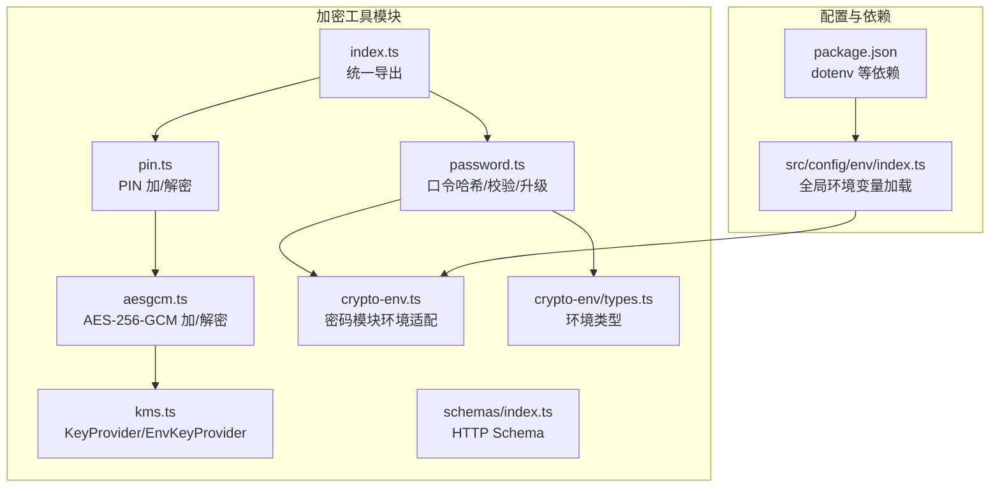
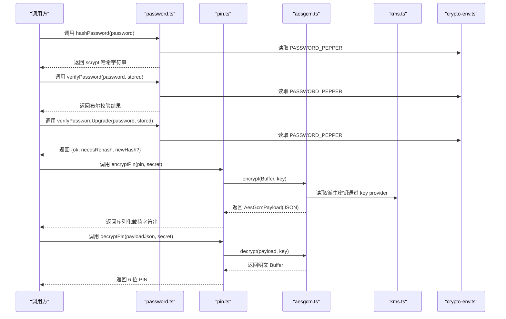
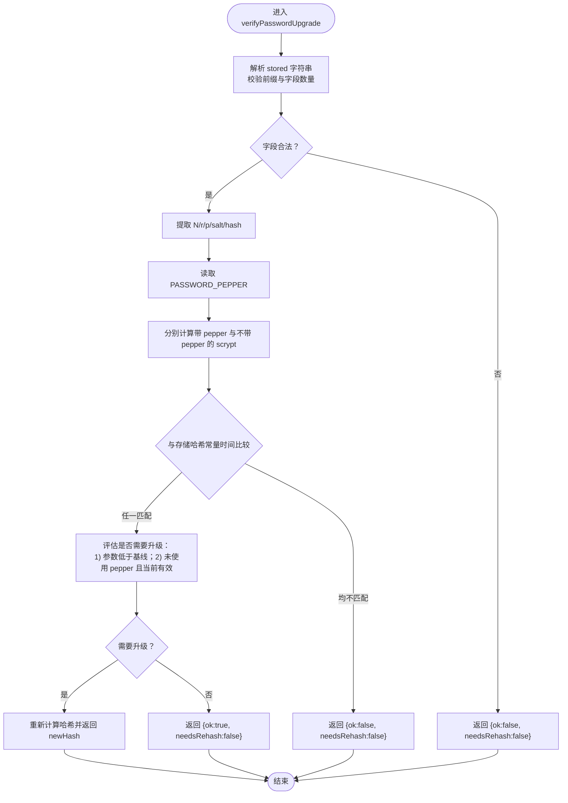
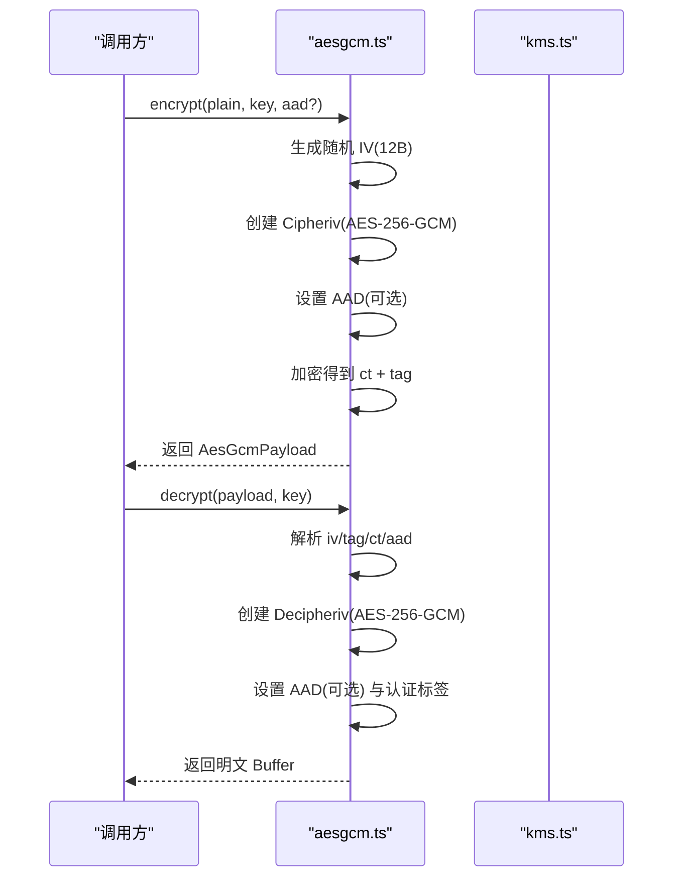
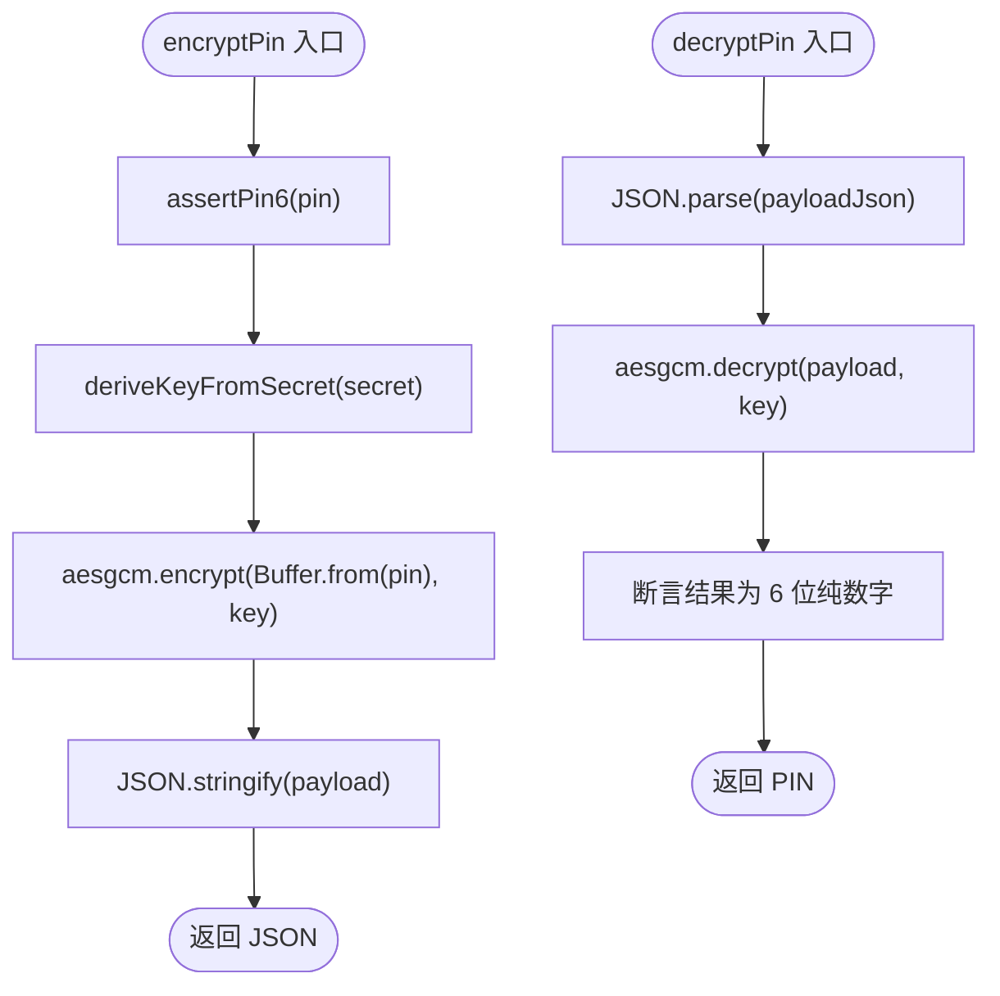
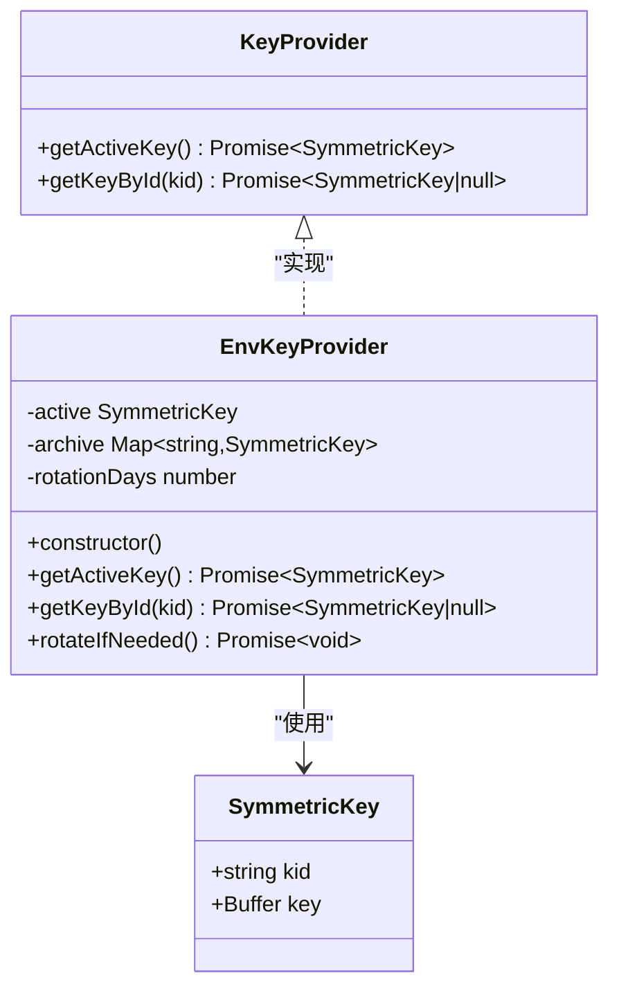
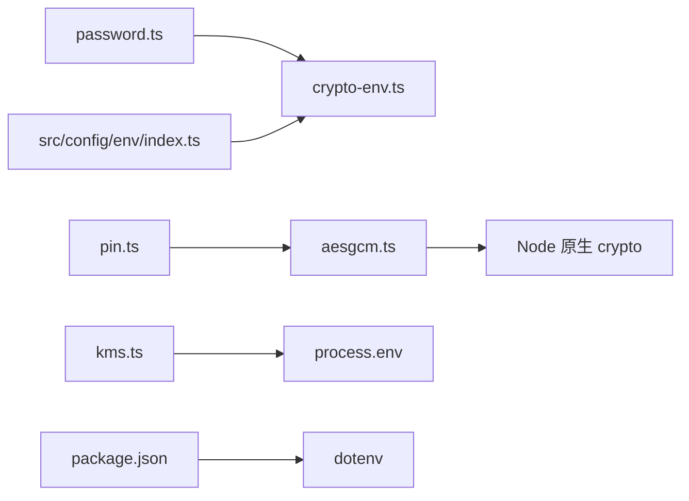

# 加密工具

<cite>
**本文引用的文件**
- [src/tools/crypto/password.ts](file://src/tools/crypto/password.ts)
- [src/tools/crypto/pin.ts](file://src/tools/crypto/pin.ts)
- [src/tools/crypto/aesgcm.ts](file://src/tools/crypto/aesgcm.ts)
- [src/tools/crypto/kms.ts](file://src/tools/crypto/kms.ts)
- [src/tools/crypto/index.ts](file://src/tools/crypto/index.ts)
- [src/tools/crypto/crypto-env.ts](file://src/tools/crypto/crypto-env.ts)
- [src/tools/crypto/crypto-env/types.ts](file://src/tools/crypto/crypto-env/types.ts)
- [src/tools/crypto/schemas/index.ts](file://src/tools/crypto/schemas/index.ts)
- [src/tools/crypto/README.md](file://src/tools/crypto/README.md)
- [src/config/env/index.ts](file://src/config/env/index.ts)
- [package.json](file://package.json)
</cite>

## 目录
1. [简介](#简介)
2. [项目结构](#项目结构)
3. [核心组件](#核心组件)
4. [架构总览](#架构总览)
5. [详细组件分析](#详细组件分析)
6. [依赖分析](#依赖分析)
7. [性能考量](#性能考量)
8. [故障排查指南](#故障排查指南)
9. [结论](#结论)
10. [附录](#附录)

## 简介
本文件为 IM-API 的加密工具模块提供系统化技术文档，覆盖以下主题：
- 口令加密（Scrypt 算法）：hashPassword、verifyPassword、verifyPasswordUpgrade 的实现原理、参数与返回值、安全考虑与升级策略。
- 对称加密（AES-GCM）：encrypt、decrypt 的使用场景、参数与返回值、安全注意事项。
- PIN 加解密：encryptPin、decryptPin 的适用场景、输入约束与错误处理。
- KMS 密钥管理：KeyProvider 接口与 EnvKeyProvider 实现、密钥轮换机制与 KID 管理。
- 环境变量与密钥存储：配置项、加载流程与安全策略。
- 性能优化与安全最佳实践：强度评估、性能建议、常见问题排查。

## 项目结构
加密工具模块位于 src/tools/crypto 下，采用按功能分层组织：
- 密码模块：password.ts
- 对称加密模块：aesgcm.ts
- PIN 工具：pin.ts
- KMS 密钥提供器：kms.ts
- 环境变量适配：crypto-env.ts、crypto-env/types.ts
- HTTP Schema：schemas/index.ts
- 统一导出入口：index.ts
- 模块说明：README.md
- 全局环境变量加载：src/config/env/index.ts
- 依赖：package.json（dotenv）

图表来源
- [src/tools/crypto/password.ts](file://src/tools/crypto/password.ts#L1-L111)
- [src/tools/crypto/aesgcm.ts](file://src/tools/crypto/aesgcm.ts#L1-L100)
- [src/tools/crypto/kms.ts](file://src/tools/crypto/kms.ts#L1-L95)
- [src/tools/crypto/pin.ts](file://src/tools/crypto/pin.ts#L1-L77)
- [src/tools/crypto/index.ts](file://src/tools/crypto/index.ts#L1-L11)
- [src/tools/crypto/crypto-env.ts](file://src/tools/crypto/crypto-env.ts#L1-L6)
- [src/tools/crypto/crypto-env/types.ts](file://src/tools/crypto/crypto-env/types.ts#L1-L23)
- [src/tools/crypto/schemas/index.ts](file://src/tools/crypto/schemas/index.ts#L1-L29)
- [src/config/env/index.ts](file://src/config/env/index.ts#L1-L223)
- [package.json](file://package.json#L1-L36)

章节来源
- [src/tools/crypto/README.md](file://src/tools/crypto/README.md#L1-L144)
- [src/tools/crypto/index.ts](file://src/tools/crypto/index.ts#L1-L11)

## 核心组件
- 口令加密与校验：基于 scrypt 的单向哈希生成与校验，支持 pepper 增强与参数升级。
- AES-GCM 对称加解密：提供随机 IV、16 字节认证标签、可选 AAD 的安全封装。
- PIN 加解密：以字符串 secret 派生 32 字节对称密钥，对 6 位纯数字进行加解密。
- KMS 密钥管理：KeyProvider 接口与 EnvKeyProvider 实现，支持按 KID 检索与轮换占位。
- 环境变量适配：将全局配置映射到密码模块使用的环境变量。

章节来源
- [src/tools/crypto/password.ts](file://src/tools/crypto/password.ts#L1-L111)
- [src/tools/crypto/aesgcm.ts](file://src/tools/crypto/aesgcm.ts#L1-L100)
- [src/tools/crypto/pin.ts](file://src/tools/crypto/pin.ts#L1-L77)
- [src/tools/crypto/kms.ts](file://src/tools/crypto/kms.ts#L1-L95)
- [src/tools/crypto/crypto-env.ts](file://src/tools/crypto/crypto-env.ts#L1-L6)
- [src/tools/crypto/crypto-env/types.ts](file://src/tools/crypto/crypto-env/types.ts#L1-L23)

## 架构总览
加密工具模块围绕“安全默认、常量时间比较、明确配置、可扩展密钥管理”设计，通过统一导出入口对外暴露常用 API，并在内部通过环境变量与 KMS 提供器完成密钥生命周期管理。

图表来源
- [src/tools/crypto/password.ts](file://src/tools/crypto/password.ts#L39-L110)
- [src/tools/crypto/pin.ts](file://src/tools/crypto/pin.ts#L39-L76)
- [src/tools/crypto/aesgcm.ts](file://src/tools/crypto/aesgcm.ts#L59-L87)
- [src/tools/crypto/kms.ts](file://src/tools/crypto/kms.ts#L45-L94)
- [src/tools/crypto/crypto-env.ts](file://src/tools/crypto/crypto-env.ts#L3-L5)

## 详细组件分析

### 口令加密（Scrypt）
- 功能概述
  - 生成 scrypt 哈希：包含 N、r、p、keylen 等参数与随机盐，输出统一格式字符串。
  - 校验口令：支持带 pepper 与不带 pepper 的兼容校验，常量时间比较防止侧信道。
  - 升级评估：根据当前基线参数与存储哈希对比，决定是否需要重算哈希并返回新哈希。
- 关键参数与返回值
  - hashPassword(password: string): Promise<string>
    - 参数：password（明文口令）
    - 返回：形如 scrypt$N$r$p$salt$dk 的字符串
    - 异常：password 为空或 PASSWORD_PEPPER 长度不足时抛错
  - verifyPassword(password: string, stored: string): Promise<boolean>
    - 参数：password（明文）、stored（scrypt 哈希字符串）
    - 返回：布尔匹配结果
    - 行为：解析 stored，提取 N/r/p/salt/hash，分别尝试带 pepper 与不带 pepper 的计算，常量时间比较
  - verifyPasswordUpgrade(password: string, stored: string): Promise<{ ok: boolean; needsRehash: boolean; newHash?: string }>
    - 返回：包含 ok、needsRehash 与可选 newHash
    - 升级条件：当前参数低于基线或存储未使用 pepper 且当前存在有效 pepper
- 安全要点
  - 使用 base64url 编码盐与密文，避免 URL 不安全字符。
  - 常量时间比较 timingSafeEqual，避免泄露长度信息。
  - pepper 作为额外熵源，提升抗彩虹表能力；缺失时仍做兼容校验。
- 使用场景
  - 用户注册时使用 hashPassword 生成哈希并持久化。
  - 登录时使用 verifyPassword 校验；成功后若 needsRehash 为真，使用 newHash 更新存储。
- 复杂度与性能
  - scrypt 成本由 N/r/p 控制，N=32768、r=8、p=1，keylen=32；可通过升级策略逐步提高成本。
  - 建议在用户登录成功后异步更新哈希，避免阻塞登录流程。

图表来源
- [src/tools/crypto/password.ts](file://src/tools/crypto/password.ts#L77-L110)

章节来源
- [src/tools/crypto/password.ts](file://src/tools/crypto/password.ts#L14-L46)
- [src/tools/crypto/password.ts](file://src/tools/crypto/password.ts#L55-L70)
- [src/tools/crypto/password.ts](file://src/tools/crypto/password.ts#L77-L110)
- [src/tools/crypto/crypto-env.ts](file://src/tools/crypto/crypto-env.ts#L3-L5)
- [src/tools/crypto/crypto-env/types.ts](file://src/tools/crypto/crypto-env/types.ts#L11-L21)

### AES-GCM 对称加密
- 功能概述
  - encrypt：随机生成 12 字节 IV，使用 AES-256-GCM 加密，返回可序列化载荷（包含 v、alg、kid、iv、tag、ct、可选 aad）。
  - decrypt：从载荷中解析 iv/tag/ct/aad，设置认证标签，执行解密；认证失败抛错。
  - safeKidEqual：常量时间比较 KID，避免侧信道。
- 关键参数与返回值
  - encrypt(plain: Buffer, key: SymmetricKey, aad?: Buffer): AesGcmPayload
    - 参数：plain（明文 Buffer）、key（包含 kid 与 32 字节 key）、aad（可选附加认证数据）
    - 返回：AesGcmPayload（包含 v、alg、kid、iv、tag、ct、可选 aad）
  - decrypt(payload: AesGcmPayload, key: SymmetricKey): Buffer
    - 参数：payload（加密载荷）、key（对称密钥）
    - 返回：明文 Buffer
    - 异常：认证失败抛错
  - safeKidEqual(a: string, b: string): boolean
    - 参数：两个 KID 字符串
    - 返回：是否相等（常量时间）
- 安全要点
  - 每次加密使用随机 IV，确保相同明文多次加密得到不同密文。
  - 认证标签长度为 16 字节，确保完整性与真实性。
  - AAD 可绑定业务上下文（如订单号、受众），避免密文被跨上下文复用。
  - KID 比较使用常量时间，避免泄露长度信息。
- 使用场景
  - 通用对称加密：对任意二进制数据进行加解密。
  - 结合 KMS：通过 KeyProvider 获取当前激活密钥与历史密钥，支持按 KID 检索。

图表来源
- [src/tools/crypto/aesgcm.ts](file://src/tools/crypto/aesgcm.ts#L59-L87)
- [src/tools/crypto/kms.ts](file://src/tools/crypto/kms.ts#L45-L94)

章节来源
- [src/tools/crypto/aesgcm.ts](file://src/tools/crypto/aesgcm.ts#L22-L41)
- [src/tools/crypto/aesgcm.ts](file://src/tools/crypto/aesgcm.ts#L59-L87)
- [src/tools/crypto/aesgcm.ts](file://src/tools/crypto/aesgcm.ts#L96-L100)

### PIN 加解密
- 功能概述
  - encryptPin：断言 PIN 为 6 位纯数字，从 secret 派生 32 字节对称密钥，使用 AES-GCM 加密并返回序列化 JSON。
  - decryptPin：从 JSON 还原载荷，使用相同密钥解密，断言结果为 6 位纯数字。
  - deriveKeyFromSecret：将 secret（长度 ≥16）经 SHA-256 派生 32 字节对称密钥。
- 关键参数与返回值
  - assertPin6(pin: string): void
    - 参数：pin（6 位纯数字）
    - 异常：非法时抛错
  - deriveKeyFromSecret(secret: string, kid?: string): SymmetricKey
    - 参数：secret（≥16）、kid（可选，默认 "env:PIN_SECRET"）
    - 返回：包含 kid 与 32 字节 key 的对象
  - encryptPin(pin: string, secret: string): Promise<string>
    - 参数：pin（6 位纯数字）、secret（≥16）
    - 返回：序列化 JSON 字符串（包含 v、alg、kid、iv、tag、ct、可选 aad）
  - decryptPin(payloadJson: string, secret: string): Promise<string>
    - 参数：payloadJson（JSON 字符串）、secret（≥16）
    - 返回：6 位纯数字字符串
- 安全要点
  - PIN 严格限制为 6 位纯数字，降低攻击面。
  - 通过 secret 派生密钥，避免直接使用弱口令。
  - 与 AES-GCM 一致的安全属性（随机 IV、认证标签、可选 AAD）。
- 使用场景
  - 交易 PIN、支付授权 PIN 等短期高敏感数据的本地化保护。
  - 与 KMS 结合：通过 KeyProvider 获取当前激活密钥，支持历史密钥按 KID 检索。

图表来源
- [src/tools/crypto/pin.ts](file://src/tools/crypto/pin.ts#L39-L76)
- [src/tools/crypto/aesgcm.ts](file://src/tools/crypto/aesgcm.ts#L59-L87)

章节来源
- [src/tools/crypto/pin.ts](file://src/tools/crypto/pin.ts#L14-L22)
- [src/tools/crypto/pin.ts](file://src/tools/crypto/pin.ts#L24-L37)
- [src/tools/crypto/pin.ts](file://src/tools/crypto/pin.ts#L39-L55)
- [src/tools/crypto/pin.ts](file://src/tools/crypto/pin.ts#L57-L76)

### KMS 密钥管理与密钥轮换
- 接口与实现
  - KeyProvider：定义 getActiveKey 与 getKeyById 两个方法。
  - EnvKeyProvider：从环境变量加载主密钥与轮换参数，维护当前激活密钥与历史密钥缓存。
- 关键行为
  - 构造函数：校验 DATA_MASTER_KEY（32 字节 base64url），生成或使用 DATA_MASTER_KEY_KID，初始化轮换间隔（默认 90 天）。
  - getActiveKey：返回当前激活密钥。
  - getKeyById：按 KID 检索历史密钥。
  - rotateIfNeeded：轮换占位（生产环境应结合持久层与时间策略实现）。
- 安全与扩展
  - KID 用于标识密钥来源，便于审计与回溯。
  - 支持按 KID 检索历史密钥，满足解密旧数据的需求。
  - 轮换策略应在生产环境落地，结合密钥归档与时间窗口控制。

图表来源
- [src/tools/crypto/kms.ts](file://src/tools/crypto/kms.ts#L21-L36)
- [src/tools/crypto/kms.ts](file://src/tools/crypto/kms.ts#L45-L94)
- [src/tools/crypto/aesgcm.ts](file://src/tools/crypto/aesgcm.ts#L43-L49)

章节来源
- [src/tools/crypto/kms.ts](file://src/tools/crypto/kms.ts#L15-L36)
- [src/tools/crypto/kms.ts](file://src/tools/crypto/kms.ts#L45-L94)
- [src/tools/crypto/aesgcm.ts](file://src/tools/crypto/aesgcm.ts#L43-L49)

### 环境变量与密钥存储
- 环境变量加载
  - dotenv 在应用启动时加载 .env 文件至 process.env。
  - src/config/env/index.ts 提供类型安全的环境变量解析与默认值。
- 密码模块环境适配
  - crypto-env.ts 将全局 env 映射为 cryptoEnv，供密码模块使用（如 PASSWORD_PEPPER）。
  - crypto-env/types.ts 定义 CrypEnv 类型，包含 NODE_ENV、PASSWORD_PEPPER、PORT 等。
- 密钥存储与安全策略
  - PASSWORD_PEPPER：增强 scrypt 安全性，长度 ≥16；缺失时仍做兼容校验。
  - DATA_MASTER_KEY：32 字节 base64url，作为对称加密主密钥；DATA_MASTER_KEY_KID 可选。
  - KEY_ROTATION_DAYS：密钥轮换提示间隔（默认 90）。
  - PIN_SECRET：PIN 加解密的密钥来源，长度 ≥16。
  - 安全建议：避免将密钥写入日志；使用只读权限的密钥文件；定期轮换密钥；最小权限访问。

章节来源
- [src/config/env/index.ts](file://src/config/env/index.ts#L10-L223)
- [src/tools/crypto/crypto-env.ts](file://src/tools/crypto/crypto-env.ts#L3-L5)
- [src/tools/crypto/crypto-env/types.ts](file://src/tools/crypto/crypto-env/types.ts#L11-L21)
- [src/tools/crypto/README.md](file://src/tools/crypto/README.md#L103-L127)

## 依赖分析
- 模块内依赖
  - password.ts 依赖 crypto-env.ts 提供的 PASSWORD_PEPPER。
  - pin.ts 依赖 aesgcm.ts 的 encrypt/decrypt 与 SymmetricKey/AesGcmPayload 类型。
  - aesgcm.ts 依赖 Node 原生 crypto 模块。
  - kms.ts 依赖 process.env 读取密钥与轮换参数。
- 外部依赖
  - dotenv：加载 .env 文件。
  - Node 原生 crypto：提供 scrypt、AES-GCM、随机数与常量时间比较等能力。

图表来源
- [src/tools/crypto/password.ts](file://src/tools/crypto/password.ts#L10-L12)
- [src/tools/crypto/pin.ts](file://src/tools/crypto/pin.ts#L10-L12)
- [src/tools/crypto/aesgcm.ts](file://src/tools/crypto/aesgcm.ts#L11)
- [src/tools/crypto/kms.ts](file://src/tools/crypto/kms.ts#L10-L12)
- [src/config/env/index.ts](file://src/config/env/index.ts#L10-L13)
- [package.json](file://package.json#L12-L22)

章节来源
- [package.json](file://package.json#L12-L22)
- [src/config/env/index.ts](file://src/config/env/index.ts#L10-L13)

## 性能考量
- Scrypt 成本控制
  - 当前基线：N=32768、r=8、p=1、keylen=32；可通过升级策略逐步提高 N/r/p。
  - 建议在用户登录成功后异步更新哈希，避免阻塞请求。
- AES-GCM
  - 随机 IV 与认证标签开销较小；AAD 增加少量 CPU 开销但显著提升安全性。
  - 批量处理时注意内存与并发控制，避免一次性处理超大明文。
- PIN 加密
  - 仅处理 6 位数字，性能开销极低；适合高频场景。
- KMS
  - EnvKeyProvider 为内存缓存，避免频繁读取环境变量；轮换逻辑需结合持久化实现。

## 故障排查指南
- 口令相关
  - hashPassword 报错：检查 PASSWORD_PEPPER 是否为空或长度不足。
  - verifyPassword/verifyPasswordUpgrade 返回 false：确认 stored 格式是否为 scrypt$N$r$p$salt$dk。
- AES-GCM
  - decrypt 报错：检查 iv、tag、ct、aad 是否完整且 base64url 正确；确认使用相同密钥与 KID。
  - 认证失败：核对 AAD 是否与加密时一致。
- PIN
  - assertPin6 报错：确认输入为 6 位纯数字。
  - deriveKeyFromSecret 报错：确认 secret 长度 ≥16。
- KMS
  - EnvKeyProvider 构造报错：检查 DATA_MASTER_KEY 是否为 32 字节 base64url。
  - rotateIfNeeded 未生效：生产环境需实现真实轮换逻辑。

章节来源
- [src/tools/crypto/password.ts](file://src/tools/crypto/password.ts#L39-L46)
- [src/tools/crypto/password.ts](file://src/tools/crypto/password.ts#L55-L70)
- [src/tools/crypto/aesgcm.ts](file://src/tools/crypto/aesgcm.ts#L78-L87)
- [src/tools/crypto/pin.ts](file://src/tools/crypto/pin.ts#L20-L22)
- [src/tools/crypto/pin.ts](file://src/tools/crypto/pin.ts#L32-L37)
- [src/tools/crypto/kms.ts](file://src/tools/crypto/kms.ts#L55-L64)

## 结论
本加密工具模块以安全默认为核心，提供口令哈希、对称加密、PIN 加解密与 KMS 密钥管理能力。通过常量时间比较、随机 IV、认证标签与 KID 管理，确保在多种场景下的机密性、完整性与可追溯性。建议在生产环境完善密钥轮换与持久化策略，并遵循最小权限与只读密钥的最佳实践。

## 附录
- 统一导出入口：index.ts 暴露 hashPassword、verifyPassword、verifyPasswordUpgrade、encryptPin、decryptPin。
- HTTP Schema：schemas/index.ts 定义了口令哈希、校验与升级、AES-GCM 加解密的请求/响应接口，便于路由校验集成。

章节来源
- [src/tools/crypto/index.ts](file://src/tools/crypto/index.ts#L9-L10)
- [src/tools/crypto/schemas/index.ts](file://src/tools/crypto/schemas/index.ts#L9-L28)