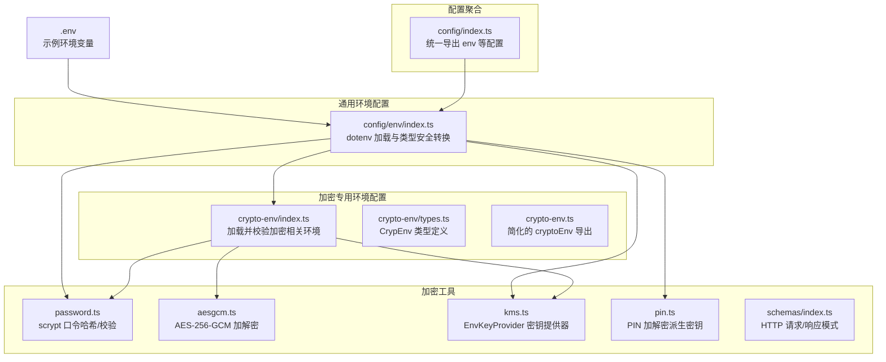
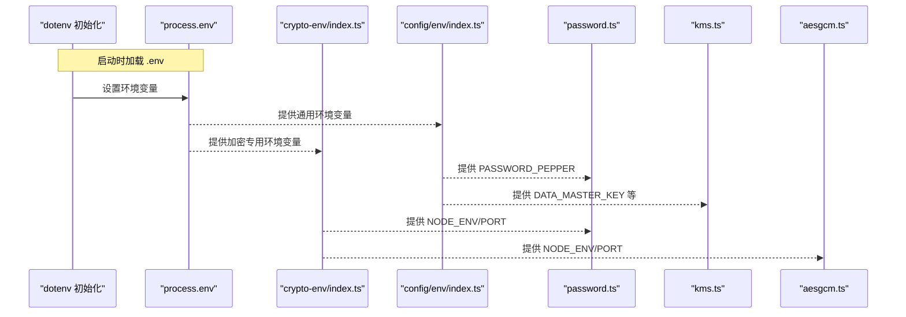
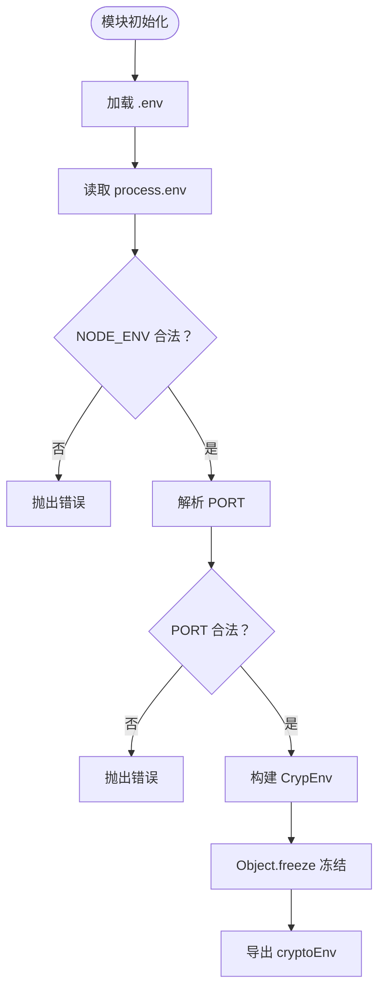
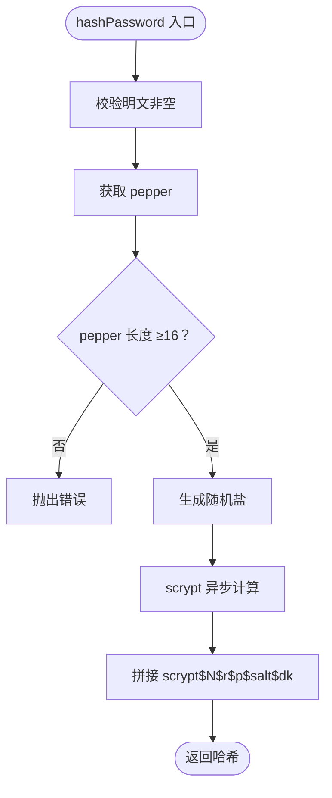
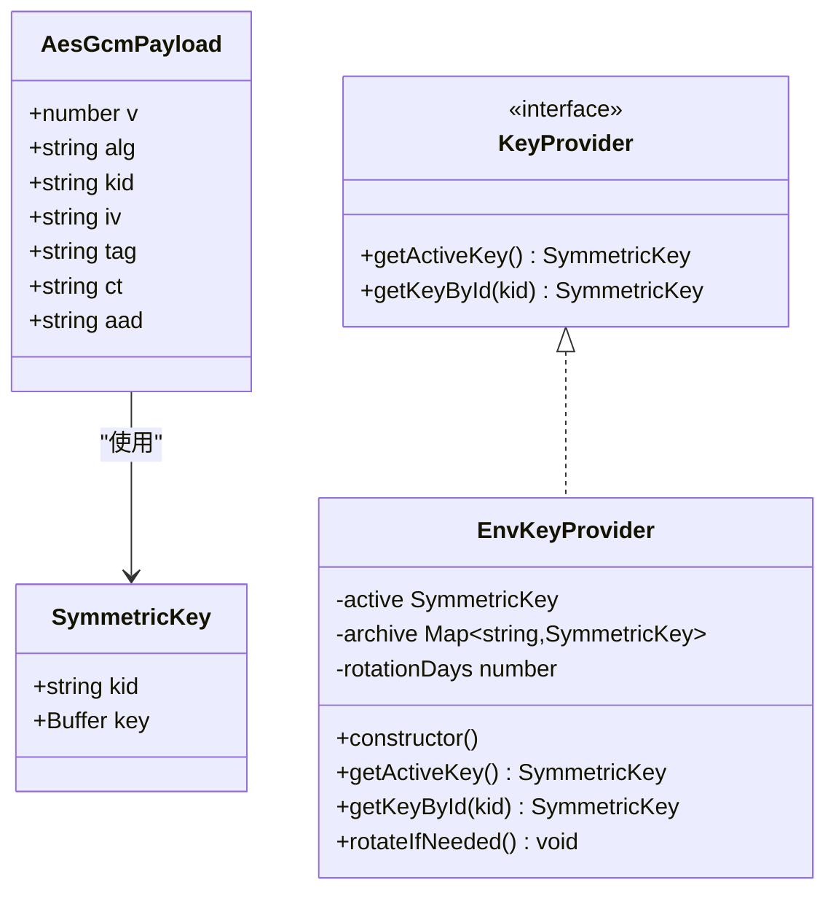
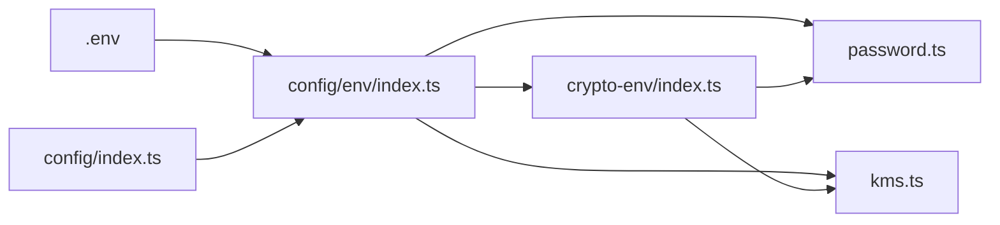

# 加密环境配置

<cite>
**本文引用的文件**
- [src/tools/crypto/crypto-env/index.ts](file://src/tools/crypto/crypto-env/index.ts)
- [src/tools/crypto/crypto-env/types.ts](file://src/tools/crypto/crypto-env/types.ts)
- [src/tools/crypto/crypto-env.ts](file://src/tools/crypto/crypto-env.ts)
- [src/config/env/index.ts](file://src/config/env/index.ts)
- [.env](file://.env)
- [src/tools/crypto/password.ts](file://src/tools/crypto/password.ts)
- [src/tools/crypto/aesgcm.ts](file://src/tools/crypto/aesgcm.ts)
- [src/tools/crypto/kms.ts](file://src/tools/crypto/kms.ts)
- [src/tools/crypto/pin.ts](file://src/tools/crypto/pin.ts)
- [src/tools/crypto/schemas/index.ts](file://src/tools/crypto/schemas/index.ts)
- [src/config/index.ts](file://src/config/index.ts)
- [src/tools/crypto/README.md](file://src/tools/crypto/README.md)
</cite>

## 目录
1. [简介](#简介)
2. [项目结构](#项目结构)
3. [核心组件](#核心组件)
4. [架构总览](#架构总览)
5. [详细组件分析](#详细组件分析)
6. [依赖关系分析](#依赖关系分析)
7. [性能考虑](#性能考虑)
8. [故障排查指南](#故障排查指南)
9. [结论](#结论)
10. [附录](#附录)

## 简介
本文件面向 IM-API 的加密环境配置模块，系统性阐述与加密相关的环境变量配置、加载机制、验证规则与默认值处理，覆盖开发、测试、生产三类环境的安全策略与配置差异。重点包括：
- 密码口令 pepper（PASSWORD_PEPPER）与 scrypt 参数基线
- KMS 主密钥（DATA_MASTER_KEY）与密钥轮换（KEY_ROTATION_DAYS）
- 对称加密（AES-256-GCM）与密钥提供器（EnvKeyProvider）
- 配置加载、验证、错误处理与安全性最佳实践
- 配置热更新、变更管理与敏感信息保护

## 项目结构
加密环境配置相关代码主要分布在以下模块：
- 加密专用环境配置：src/tools/crypto/crypto-env/*
- 通用环境配置：src/config/env/index.ts
- 加密工具与算法：src/tools/crypto/password.ts、aesgcm.ts、kms.ts、pin.ts
- 配置聚合导出：src/config/index.ts
- 示例配置文件：.env

图表来源
- [src/tools/crypto/crypto-env/index.ts](file://src/tools/crypto/crypto-env/index.ts#L1-L44)
- [src/tools/crypto/crypto-env/types.ts](file://src/tools/crypto/crypto-env/types.ts#L1-L23)
- [src/tools/crypto/crypto-env.ts](file://src/tools/crypto/crypto-env.ts#L1-L6)
- [src/config/env/index.ts](file://src/config/env/index.ts#L1-L223)
- [src/tools/crypto/password.ts](file://src/tools/crypto/password.ts#L1-L111)
- [src/tools/crypto/aesgcm.ts](file://src/tools/crypto/aesgcm.ts#L1-L100)
- [src/tools/crypto/kms.ts](file://src/tools/crypto/kms.ts#L1-L95)
- [src/tools/crypto/pin.ts](file://src/tools/crypto/pin.ts#L1-L77)
- [src/tools/crypto/schemas/index.ts](file://src/tools/crypto/schemas/index.ts#L1-L29)
- [src/config/index.ts](file://src/config/index.ts#L1-L30)
- [.env](file://.env#L1-L22)

章节来源
- [src/tools/crypto/crypto-env/index.ts](file://src/tools/crypto/crypto-env/index.ts#L1-L44)
- [src/config/env/index.ts](file://src/config/env/index.ts#L1-L223)
- [src/config/index.ts](file://src/config/index.ts#L1-L30)
- [.env](file://.env#L1-L22)

## 核心组件
- 加密专用环境配置（CrypEnv）
  - 作用：为加密相关模块提供只读、已校验的环境配置对象
  - 关键项：NODE_ENV、PASSWORD_PEPPER、PORT
  - 加载方式：通过 dotenv 初始化后，从 process.env 提取并校验
- 通用环境配置（EnvConfig）
  - 作用：统一加载与类型安全转换所有环境变量，含默认值与必填校验
  - 关键项：PASSWORD_PEPPER、JWT_SECRET、PIN_SECRET、DATA_MASTER_KEY 等
- 加密工具链
  - 口令哈希：scrypt 参数基线与 pepper 校验
  - 对称加密：AES-256-GCM 加解密与载荷结构
  - 密钥提供器：EnvKeyProvider 从环境变量加载主密钥与轮换参数
  - PIN 加解密：基于 secret 派生密钥的 6 位纯数字校验与加解密

章节来源
- [src/tools/crypto/crypto-env/types.ts](file://src/tools/crypto/crypto-env/types.ts#L10-L21)
- [src/tools/crypto/crypto-env/index.ts](file://src/tools/crypto/crypto-env/index.ts#L17-L40)
- [src/config/env/index.ts](file://src/config/env/index.ts#L106-L220)
- [src/tools/crypto/password.ts](file://src/tools/crypto/password.ts#L14-L46)
- [src/tools/crypto/aesgcm.ts](file://src/tools/crypto/aesgcm.ts#L23-L49)
- [src/tools/crypto/kms.ts](file://src/tools/crypto/kms.ts#L45-L94)
- [src/tools/crypto/pin.ts](file://src/tools/crypto/pin.ts#L24-L37)

## 架构总览
加密环境配置的加载与使用流程如下：

图表来源
- [src/config/env/index.ts](file://src/config/env/index.ts#L10-L13)
- [src/tools/crypto/crypto-env/index.ts](file://src/tools/crypto/crypto-env/index.ts#L14-L15)
- [src/tools/crypto/password.ts](file://src/tools/crypto/password.ts#L12)
- [src/tools/crypto/kms.ts](file://src/tools/crypto/kms.ts#L55-L64)
- [src/tools/crypto/aesgcm.ts](file://src/tools/crypto/aesgcm.ts#L11)

## 详细组件分析

### 加密专用环境配置（crypto-env）
- 加载时机：模块初始化时调用 dotenv，仅加载一次
- 校验规则：
  - NODE_ENV 限定为 development、production、test 之一
  - PORT 必须为 1~65535 的整数
- 输出：冻结的 CrypEnv 对象，供加密模块直接使用

图表来源
- [src/tools/crypto/crypto-env/index.ts](file://src/tools/crypto/crypto-env/index.ts#L14-L40)

章节来源
- [src/tools/crypto/crypto-env/index.ts](file://src/tools/crypto/crypto-env/index.ts#L17-L40)
- [src/tools/crypto/crypto-env/types.ts](file://src/tools/crypto/crypto-env/types.ts#L10-L21)

### 通用环境配置（config/env）
- dotenv 在启动时加载 .env
- 类型安全转换与默认值：
  - 必填项缺失时抛错
  - 数字/布尔值转换失败时抛错
  - 默认值策略：如 PORT 默认 3000、PASSWORD_PEPPER 默认 dev-pepper 等
- 关键加密相关项：
  - PASSWORD_PEPPER：口令 pepper，用于增强 scrypt 安全性
  - DATA_MASTER_KEY：主密钥（base64url，32 字节）
  - DATA_MASTER_KEY_KID：密钥 ID（可选，缺省时自动生成）
  - KEY_ROTATION_DAYS：密钥轮换间隔（默认 90 天）

章节来源
- [src/config/env/index.ts](file://src/config/env/index.ts#L10-L13)
- [src/config/env/index.ts](file://src/config/env/index.ts#L166-L220)

### 口令哈希与校验（password.ts）
- scrypt 参数基线：N、r、p、keylen 固定，maxmem 限制
- pepper 使用策略：
  - 新哈希生成要求 pepper 长度 ≥16
  - 校验时若缺失 pepper，仍尝试“无 pepper”兼容校验
  - 支持平滑升级：verifyPasswordUpgrade 返回 needsRehash 与 newHash
- 错误处理：输入为空、pepper 过短、格式不合法均抛错

图表来源
- [src/tools/crypto/password.ts](file://src/tools/crypto/password.ts#L39-L46)

章节来源
- [src/tools/crypto/password.ts](file://src/tools/crypto/password.ts#L14-L46)
- [src/tools/crypto/password.ts](file://src/tools/crypto/password.ts#L77-L110)

### 对称加密与密钥提供器（aesgcm.ts、kms.ts）
- AES-256-GCM：
  - 随机 12 字节 IV，16 字节认证标签
  - 可选 AAD（附加认证数据），用于绑定业务上下文
  - 载荷结构包含版本、算法、密钥 ID、IV、标签、密文、可选 AAD
- EnvKeyProvider：
  - 从环境变量加载主密钥（base64url，32 字节）
  - 支持按 KID 检索历史密钥
  - 轮换参数 KEY_ROTATION_DAYS（默认 90 天）

图表来源
- [src/tools/crypto/aesgcm.ts](file://src/tools/crypto/aesgcm.ts#L33-L49)
- [src/tools/crypto/kms.ts](file://src/tools/crypto/kms.ts#L21-L36)
- [src/tools/crypto/kms.ts](file://src/tools/crypto/kms.ts#L45-L94)

章节来源
- [src/tools/crypto/aesgcm.ts](file://src/tools/crypto/aesgcm.ts#L59-L87)
- [src/tools/crypto/kms.ts](file://src/tools/crypto/kms.ts#L55-L64)

### PIN 加解密（pin.ts）
- 6 位纯数字校验：assertPin6
- 密钥派生：deriveKeyFromSecret 使用 SHA-256 从 secret 派生 32 字节密钥
- 加解密：基于 AES-256-GCM，返回/接收 JSON 序列化载荷

章节来源
- [src/tools/crypto/pin.ts](file://src/tools/crypto/pin.ts#L20-L37)
- [src/tools/crypto/pin.ts](file://src/tools/crypto/pin.ts#L49-L76)

### 配置聚合与导出（config/index.ts）
- 统一导出 env（通用环境配置）与相关数据库、Redis 等配置
- 加密模块通过 env 获取 PASSWORD_PEPPER、DATA_MASTER_KEY 等

章节来源
- [src/config/index.ts](file://src/config/index.ts#L7-L29)

## 依赖关系分析
- crypto-env 依赖 dotenv 与 process.env，输出只读配置
- password.ts 依赖 crypto-env 的 PASSWORD_PEPPER
- kms.ts 依赖 process.env 的 DATA_MASTER_KEY 等
- 两者共同依赖 config/env 的 dotenv 初始化与类型安全转换
- config/index.ts 统一导出 env，供上层模块使用

图表来源
- [src/config/env/index.ts](file://src/config/env/index.ts#L10-L13)
- [src/tools/crypto/crypto-env/index.ts](file://src/tools/crypto/crypto-env/index.ts#L10-L15)
- [src/tools/crypto/password.ts](file://src/tools/crypto/password.ts#L12)
- [src/tools/crypto/kms.ts](file://src/tools/crypto/kms.ts#L55-L64)
- [src/config/index.ts](file://src/config/index.ts#L7)

章节来源
- [src/config/env/index.ts](file://src/config/env/index.ts#L10-L13)
- [src/tools/crypto/crypto-env/index.ts](file://src/tools/crypto/crypto-env/index.ts#L10-L15)
- [src/tools/crypto/password.ts](file://src/tools/crypto/password.ts#L12)
- [src/tools/crypto/kms.ts](file://src/tools/crypto/kms.ts#L55-L64)
- [src/config/index.ts](file://src/config/index.ts#L7)

## 性能考虑
- scrypt 参数基线固定，确保在不同环境中一致的 CPU/内存开销
- AES-256-GCM 认证标签长度固定，避免额外开销
- 密钥轮换策略（KEY_ROTATION_DAYS）建议在生产中结合持久化与定时任务实现，避免频繁轮换带来的性能影响
- 日志脱敏：敏感字段（如 password、token、secret 等）已在日志配置中屏蔽，避免泄露

[本节为通用指导，无需特定文件来源]

## 故障排查指南
- 环境变量缺失或非法
  - 必填项缺失：抛出“Environment variable ... is required.”错误
  - 数字/布尔值非法：抛出“must be a number.”或类型不符错误
- 加密相关错误
  - PASSWORD_PEPPER 长度不足：hashPassword 抛错
  - DATA_MASTER_KEY 非法：EnvKeyProvider 抛错（长度必须为 32 字节 base64url）
  - 口令哈希格式不合法：verifyPassword 返回 false
- 配置加载顺序
  - dotenv 必须在 config/env 初始化前加载，否则 process.env 无法读取 .env
- 日志与安全
  - 避免将敏感信息写入日志；使用内置脱敏配置
  - KID 比较使用常量时间比较，防止侧信道攻击

章节来源
- [src/config/env/index.ts](file://src/config/env/index.ts#L21-L27)
- [src/config/env/index.ts](file://src/config/env/index.ts#L36-L45)
- [src/tools/crypto/password.ts](file://src/tools/crypto/password.ts#L40-L42)
- [src/tools/crypto/kms.ts](file://src/tools/crypto/kms.ts#L57-L60)
- [src/tools/crypto/aesgcm.ts](file://src/tools/crypto/aesgcm.ts#L96-L99)
- [src/config/logging.ts](file://src/config/logging.ts#L131-L150)

## 结论
本加密环境配置模块通过“专用环境配置 + 通用环境配置”的分层设计，实现了：
- 明确的加密相关配置项与严格的校验规则
- 开发/测试/生产三类环境的安全策略差异
- 口令哈希、对称加密与密钥管理的完整工具链
- 安全性与可维护性的平衡，涵盖敏感信息保护与错误处理

[本节为总结，无需特定文件来源]

## 附录

### 环境变量清单与默认值
- 加密专用（crypto-env）
  - NODE_ENV：development | production | test（无默认，非法即报错）
  - PASSWORD_PEPPER：无默认（加密模块要求 ≥16）
  - PORT：3000（非法范围即报错）
- 通用环境（config/env）
  - PASSWORD_PEPPER：dev-pepper
  - DATA_MASTER_KEY：无默认（必须提供，base64url，32 字节）
  - DATA_MASTER_KEY_KID：无默认（缺省自动生成 UUID）
  - KEY_ROTATION_DAYS：90（最小 1）
  - JWT_SECRET：dev-secret
  - PIN_SECRET：无默认（长度 ≥16）

章节来源
- [src/tools/crypto/crypto-env/index.ts](file://src/tools/crypto/crypto-env/index.ts#L22-L32)
- [src/config/env/index.ts](file://src/config/env/index.ts#L166-L220)
- [src/tools/crypto/kms.ts](file://src/tools/crypto/kms.ts#L55-L64)

### 不同环境的安全策略与配置差异
- 开发环境
  - 使用较弱的默认值（如 dev-pepper、dev-secret），便于本地调试
  - 可开启宽松的日志与 CORS 策略
- 测试环境
  - 使用独立的测试密钥与较小的轮换周期
  - 严格校验与日志脱敏
- 生产环境
  - 强制要求 PASSWORD_PEPPER、DATA_MASTER_KEY 等长度与格式
  - 实施密钥轮换与历史密钥归档
  - 严格限制日志输出与访问控制

章节来源
- [src/config/env/index.ts](file://src/config/env/index.ts#L166-L220)
- [src/tools/crypto/kms.ts](file://src/tools/crypto/kms.ts#L55-L64)

### 配置示例（路径参考）
- 示例 .env
  - 参考路径：[.env](file://.env#L1-L22)
- 加载与导出
  - dotenv 初始化：[src/config/env/index.ts](file://src/config/env/index.ts#L10-L13)
  - 统一导出：[src/config/index.ts](file://src/config/index.ts#L7-L29)

### 配置变更管理与热更新
- 变更管理
  - 所有加密相关配置均在进程启动时从 .env 加载并校验
  - 建议通过 CI/CD 注入环境变量，避免直接修改 .env
- 热更新
  - 当前实现不支持运行时热更新；建议通过滚动重启或容器编排实现
  - 对于密钥轮换，建议在生产中实现持久化与定时任务驱动的轮换

章节来源
- [src/tools/crypto/crypto-env/index.ts](file://src/tools/crypto/crypto-env/index.ts#L14-L15)
- [src/tools/crypto/kms.ts](file://src/tools/crypto/kms.ts#L91-L93)