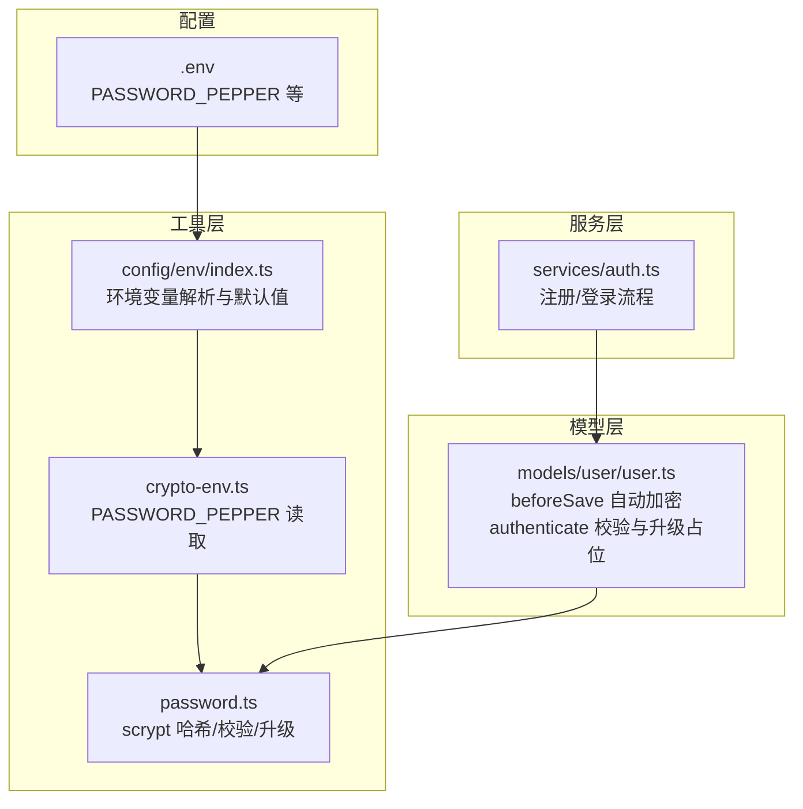
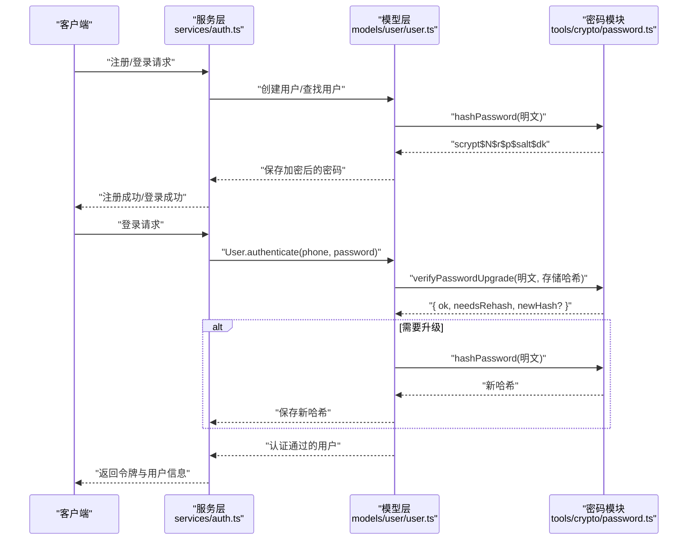
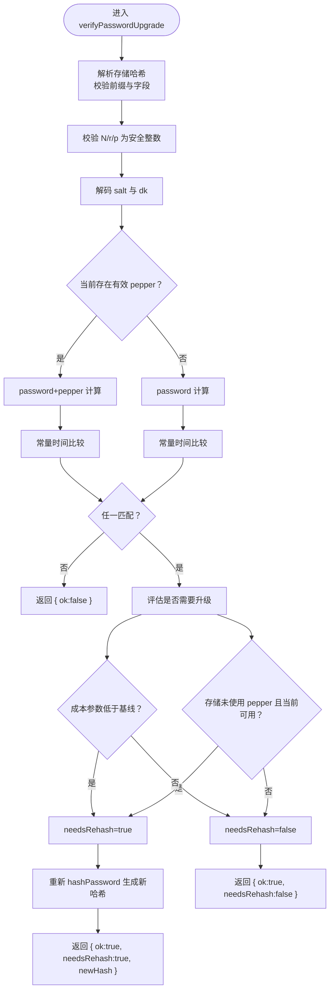
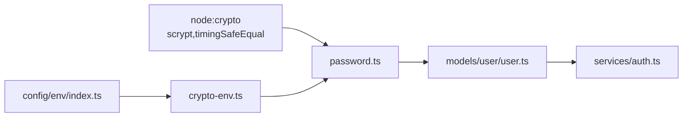

# 密码加密

<cite>
**本文引用的文件**
- [src/tools/crypto/password.ts](file://src/tools/crypto/password.ts)
- [src/tools/crypto/crypto-env.ts](file://src/tools/crypto/crypto-env.ts)
- [src/config/env/index.ts](file://src/config/env/index.ts)
- [src/models/user/user.ts](file://src/models/user/user.ts)
- [src/services/auth.ts](file://src/services/auth.ts)
- [src/tools/crypto/README.md](file://src/tools/crypto/README.md)
- [src/tools/crypto/schemas/index.ts](file://src/tools/crypto/schemas/index.ts)
- [.env](file://.env)
</cite>

## 目录
1. [简介](#简介)
2. [项目结构](#项目结构)
3. [核心组件](#核心组件)
4. [架构总览](#架构总览)
5. [组件详解](#组件详解)
6. [依赖关系分析](#依赖关系分析)
7. [性能与安全考量](#性能与安全考量)
8. [故障排查指南](#故障排查指南)
9. [结论](#结论)
10. [附录](#附录)

## 简介
本文件面向 IM-API 的密码加密模块，系统性阐述基于 scrypt 的口令哈希与校验实现，重点覆盖以下内容：
- Scrypt 算法参数 N（成本参数）、r（内存成本）、p（并行成本）的含义与安全考量
- hashPassword 函数的实现细节：加盐流程、pepper 增强机制、base64url 编码格式
- verifyPassword 与 verifyPasswordUpgrade 的工作原理：时间安全比较、pepper 兼容性检查、自动升级机制
- 使用示例与最佳实践：如何正确调用这些函数进行密码存储与验证
- 性能优化建议与安全最佳实践
- 环境变量 PASSWORD_PEPPER 的配置要求与密钥管理策略

## 项目结构
密码加密模块位于工具层，围绕 scrypt 哈希与校验展开，并通过模型层在入库前完成自动加密、在认证时完成校验与升级。

图表来源
- [src/tools/crypto/password.ts](file://src/tools/crypto/password.ts#L1-L111)
- [src/tools/crypto/crypto-env.ts](file://src/tools/crypto/crypto-env.ts#L1-L6)
- [src/config/env/index.ts](file://src/config/env/index.ts#L166-L220)
- [src/models/user/user.ts](file://src/models/user/user.ts#L256-L275)
- [src/services/auth.ts](file://src/services/auth.ts#L94-L134)
- [.env](file://.env#L19-L21)

章节来源
- [src/tools/crypto/password.ts](file://src/tools/crypto/password.ts#L1-L111)
- [src/tools/crypto/crypto-env.ts](file://src/tools/crypto/crypto-env.ts#L1-L6)
- [src/config/env/index.ts](file://src/config/env/index.ts#L166-L220)
- [src/models/user/user.ts](file://src/models/user/user.ts#L256-L275)
- [src/services/auth.ts](file://src/services/auth.ts#L94-L134)
- [.env](file://.env#L19-L21)

## 核心组件
- scrypt 哈希与校验：提供 hashPassword、verifyPassword、verifyPasswordUpgrade 三个核心函数
- 环境变量读取：从 config/env/index.ts 中读取 PASSWORD_PEPPER，并暴露给密码模块
- 模型钩子：User.beforeSave 自动将明文密码转换为 scrypt 哈希；authenticate 方法负责校验与升级占位
- 服务层集成：注册时写入加密密码；登录时调用模型认证方法

章节来源
- [src/tools/crypto/password.ts](file://src/tools/crypto/password.ts#L33-L110)
- [src/tools/crypto/crypto-env.ts](file://src/tools/crypto/crypto-env.ts#L3-L5)
- [src/config/env/index.ts](file://src/config/env/index.ts#L175-L175)
- [src/models/user/user.ts](file://src/models/user/user.ts#L256-L275)
- [src/services/auth.ts](file://src/services/auth.ts#L94-L134)

## 架构总览
密码加密在系统中的调用链如下：客户端提交明文密码 → 服务层接收 → 模型层 beforeSave 自动加密 → 存储到数据库；登录时，服务层调用模型认证方法 → 模型层执行 verifyPassword/verifyPasswordUpgrade → 返回认证结果与升级建议。

图表来源
- [src/services/auth.ts](file://src/services/auth.ts#L94-L134)
- [src/models/user/user.ts](file://src/models/user/user.ts#L69-L89)
- [src/tools/crypto/password.ts](file://src/tools/crypto/password.ts#L77-L110)

## 组件详解

### Scrypt 参数与安全考量
- N（成本参数）：决定迭代次数，越大越耗时，提升抗暴力破解能力
- r（内存成本）：决定块大小，影响内存占用与并行度
- p（并行成本）：决定并行度，影响多核 CPU 利用率
- keylen：派生密钥长度（固定 32 字节）
- maxmem：内存上限（固定 64MB）

这些参数共同决定了 scrypt 的“时间-空间”复杂度，应随硬件与威胁模型演进而调整。当前模块以固定基线参数提供默认安全水平，同时通过 verifyPasswordUpgrade 支持未来升级。

章节来源
- [src/tools/crypto/password.ts](file://src/tools/crypto/password.ts#L14-L15)
- [src/tools/crypto/password.ts](file://src/tools/crypto/password.ts#L18-L23)

### hashPassword 实现细节
- 输入校验：禁止空密码；要求 PASSWORD_PEPPER 至少 16 字符
- 加盐：使用 16 字节随机盐
- 派生：将 password + pepper 拼接后经 scrypt 派生 32 字节密钥
- 编码：salt 与 dk 均采用 base64url 编码，输出格式为 scrypt$N$r$p$salt$dk
- 时间复杂度：受 N/r/p 影响，建议在生产环境根据硬件能力动态评估

章节来源
- [src/tools/crypto/password.ts](file://src/tools/crypto/password.ts#L39-L46)
- [src/tools/crypto/password.ts](file://src/tools/crypto/password.ts#L25-L28)
- [src/tools/crypto/crypto-env.ts](file://src/tools/crypto/crypto-env.ts#L3-L5)
- [src/config/env/index.ts](file://src/config/env/index.ts#L175-L175)

### verifyPassword 工作原理
- 解析存储哈希：按 $ 分割，校验前缀与字段数量
- 参数校验：确保 N、r、p 为安全整数
- 解码：将 base64url 的 salt 与 dk 解码为 Buffer
- 计算：分别尝试 password+pepper 与 password 两种方式，均使用原哈希的 N/r/p
- 比较：使用常量时间比较，避免时序侧信道
- 返回：任一匹配即视为通过

章节来源
- [src/tools/crypto/password.ts](file://src/tools/crypto/password.ts#L55-L70)
- [src/tools/crypto/password.ts](file://src/tools/crypto/password.ts#L25-L28)

### verifyPasswordUpgrade 自动升级机制
- 同步执行 verifyPassword 的校验步骤
- 判断是否需要升级：
  - 成本参数低于当前基线（N、r、p、keylen）
  - 存储未使用 pepper（但当前有效 pepper 可用）
- 若需要升级：重新调用 hashPassword 生成新哈希并返回
- 返回结构：{ ok, needsRehash, newHash? }

图表来源
- [src/tools/crypto/password.ts](file://src/tools/crypto/password.ts#L77-L110)

章节来源
- [src/tools/crypto/password.ts](file://src/tools/crypto/password.ts#L77-L110)

### 模型与服务层集成
- 模型钩子：User.beforeSave 在密码变更时自动调用 hashPassword，确保只存储哈希
- 认证流程：User.authenticate 查找用户并调用 verifyPasswordAsync，返回认证通过的用户
- 服务层：AuthService.register 调用 User.create，密码自动加密；login 调用 User.authenticate 获取用户并签发令牌

章节来源
- [src/models/user/user.ts](file://src/models/user/user.ts#L256-L275)
- [src/models/user/user.ts](file://src/models/user/user.ts#L69-L89)
- [src/services/auth.ts](file://src/services/auth.ts#L94-L134)

### 使用示例（代码片段路径）
- 生成哈希：参考 [hashPassword 示例](file://src/tools/crypto/README.md#L29-L35)
- 校验与升级：参考 [verifyPassword/verifyPasswordUpgrade 示例](file://src/tools/crypto/README.md#L29-L35)

章节来源
- [src/tools/crypto/README.md](file://src/tools/crypto/README.md#L27-L35)

## 依赖关系分析
密码模块的核心依赖链如下：
- password.ts 依赖 node:crypto 的 scrypt 与 timingSafeEqual
- password.ts 通过 crypto-env.ts 读取 PASSWORD_PEPPER
- crypto-env.ts 依赖 config/env/index.ts 的 env 对象
- 模型层通过 beforeSave 钩子调用 password.ts 的 hashPassword
- 服务层在注册/登录流程中使用模型层提供的认证方法

图表来源
- [src/tools/crypto/password.ts](file://src/tools/crypto/password.ts#L10-L12)
- [src/tools/crypto/crypto-env.ts](file://src/tools/crypto/crypto-env.ts#L1-L5)
- [src/config/env/index.ts](file://src/config/env/index.ts#L166-L220)
- [src/models/user/user.ts](file://src/models/user/user.ts#L256-L275)
- [src/services/auth.ts](file://src/services/auth.ts#L94-L134)

章节来源
- [src/tools/crypto/password.ts](file://src/tools/crypto/password.ts#L10-L12)
- [src/tools/crypto/crypto-env.ts](file://src/tools/crypto/crypto-env.ts#L1-L5)
- [src/config/env/index.ts](file://src/config/env/index.ts#L166-L220)
- [src/models/user/user.ts](file://src/models/user/user.ts#L256-L275)
- [src/services/auth.ts](file://src/services/auth.ts#L94-L134)

## 性能与安全考量
- 性能
  - N/r/p 越大，计算时间越长，建议在生产环境结合硬件能力与阈值进行基准测试
  - verifyPasswordUpgrade 会在需要时触发一次额外的哈希计算，建议在登录高峰期进行限流或异步处理
  - 建议对认证接口进行速率限制与熔断保护
- 安全
  - 必须配置有效的 PASSWORD_PEPPER（至少 16 字符），否则 hashPassword 会抛错
  - 使用常量时间比较避免时序侧信道
  - 哈希存储格式包含 N/r/p，便于未来升级
  - 建议定期评估并提升基线参数，配合 verifyPasswordUpgrade 渐进迁移

[本节为通用指导，不直接分析具体文件]

## 故障排查指南
- 症状：hashPassword 抛出“密码不能为空”或“缺少或过短的 PASSWORD_PEPPER”
  - 排查：确认 .env 中 PASSWORD_PEPPER 设置且长度 ≥16
  - 参考：[环境变量默认值与校验](file://src/config/env/index.ts#L175-L175)
- 症状：verifyPassword/verifyPasswordUpgrade 返回 false
  - 排查：确认存储哈希格式为 scrypt$N$r$p$salt$dk，且 N/r/p 为安全整数
  - 参考：[哈希解析与校验](file://src/tools/crypto/password.ts#L55-L70)
- 症状：升级未生效
  - 排查：verifyPasswordUpgrade 仅在需要时返回 newHash，需在上层逻辑保存新哈希
  - 参考：[升级逻辑与返回值](file://src/tools/crypto/password.ts#L77-L110)

章节来源
- [src/config/env/index.ts](file://src/config/env/index.ts#L175-L175)
- [src/tools/crypto/password.ts](file://src/tools/crypto/password.ts#L55-L70)
- [src/tools/crypto/password.ts](file://src/tools/crypto/password.ts#L77-L110)

## 结论
本模块以 scrypt 为核心，结合随机盐、pepper 增强与常量时间比较，提供了安全可靠的口令存储与验证方案。通过 verifyPasswordUpgrade 实现了平滑的成本参数与 pepper 升级路径，建议在生产环境中结合硬件能力与安全策略持续优化参数基线，并严格管理 PASSWORD_PEPPER 等密钥材料。

[本节为总结性内容，不直接分析具体文件]

## 附录

### 环境变量与密钥管理
- PASSWORD_PEPPER：必须设置且长度 ≥16；建议使用强随机字符串，定期轮换
- 配置位置：.env 中的 SECURITY Secrets 区域
- 读取来源：config/env/index.ts 读取 dotenv 并提供默认值

章节来源
- [.env](file://.env#L19-L21)
- [src/config/env/index.ts](file://src/config/env/index.ts#L175-L175)

### API 与数据模型要点
- 哈希格式：scrypt$N$r$p$salt$dk
- 编码格式：salt 与 dk 使用 base64url
- 参数基线：N=32768, r=8, p=1, keylen=32, maxmem=64MB
- 模型字段：password 与 pin 均为 scrypt 哈希字符串

章节来源
- [src/tools/crypto/password.ts](file://src/tools/crypto/password.ts#L14-L15)
- [src/tools/crypto/password.ts](file://src/tools/crypto/password.ts#L25-L28)
- [src/models/user/user.ts](file://src/models/user/user.ts#L145-L155)