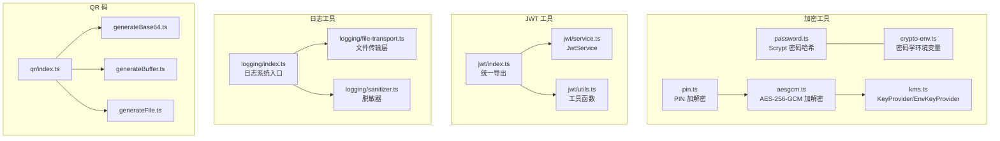
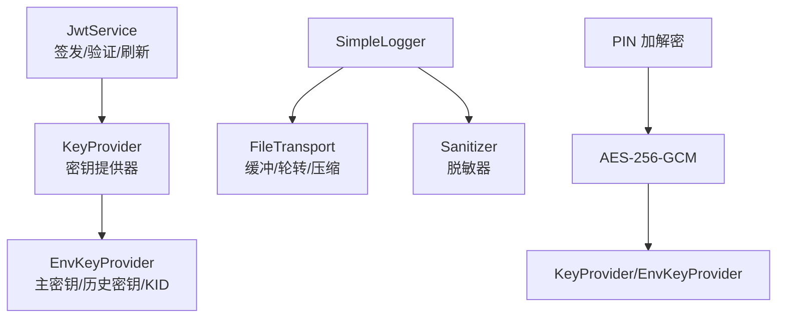
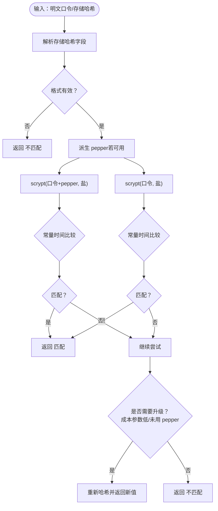
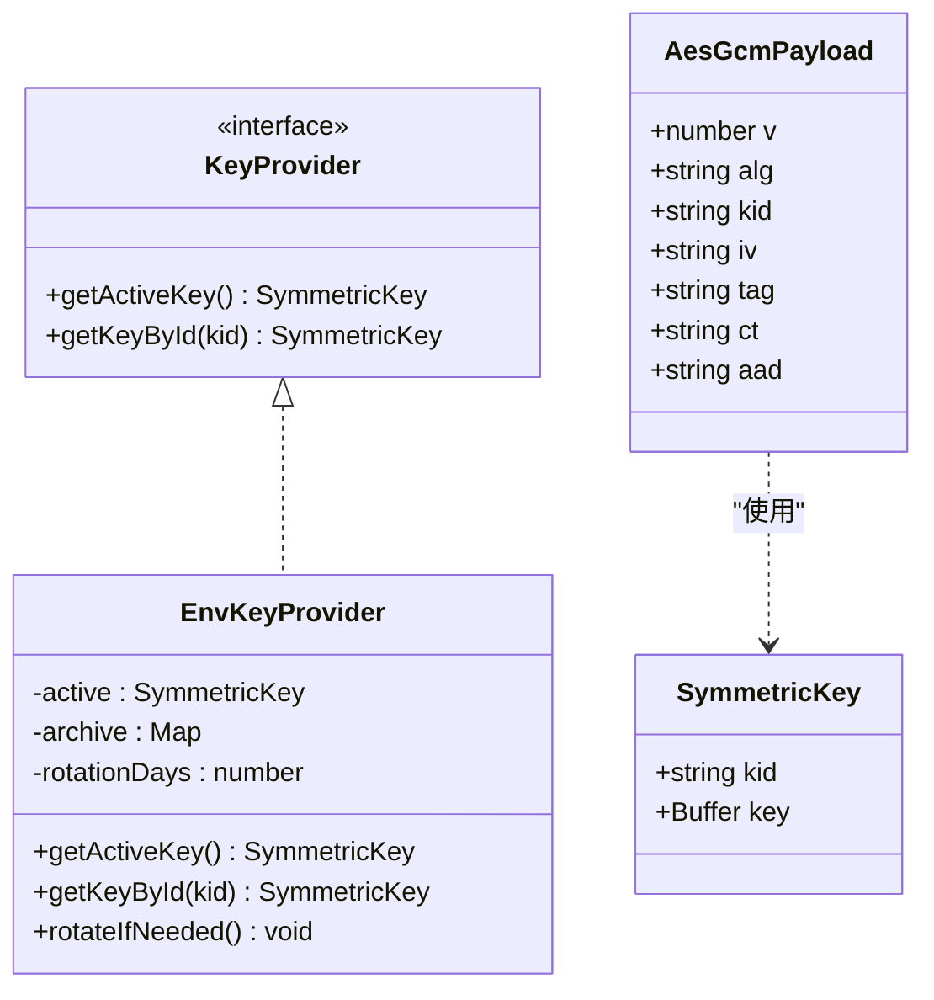
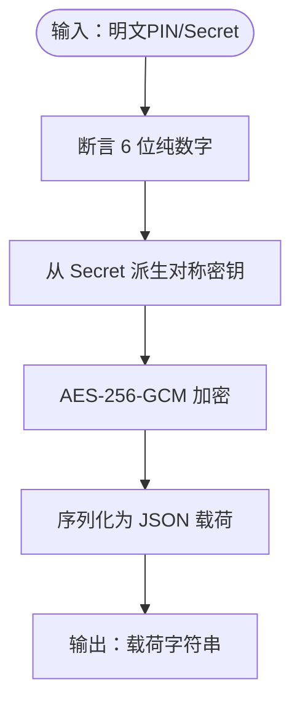
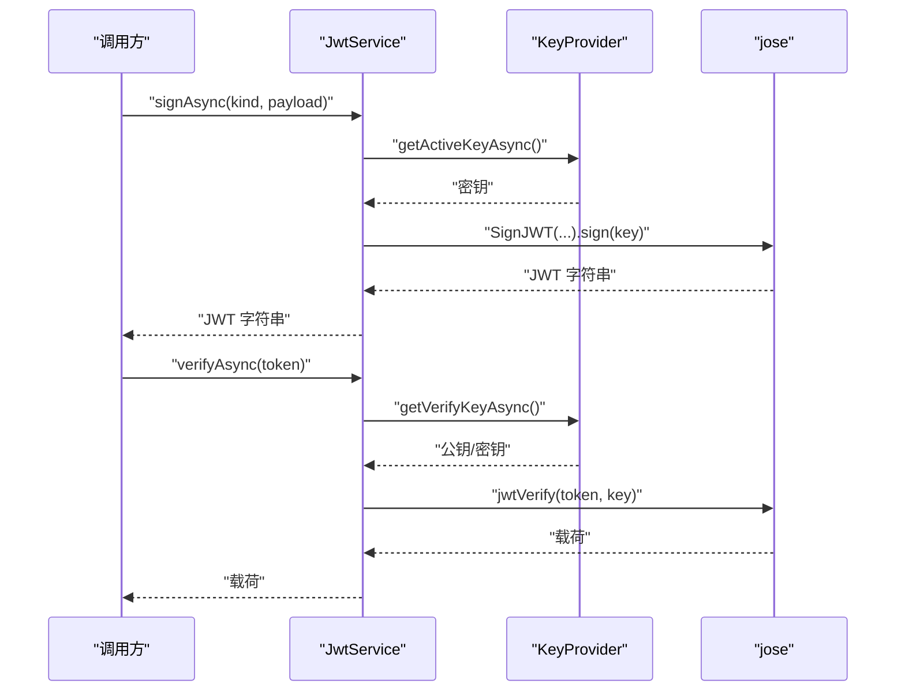
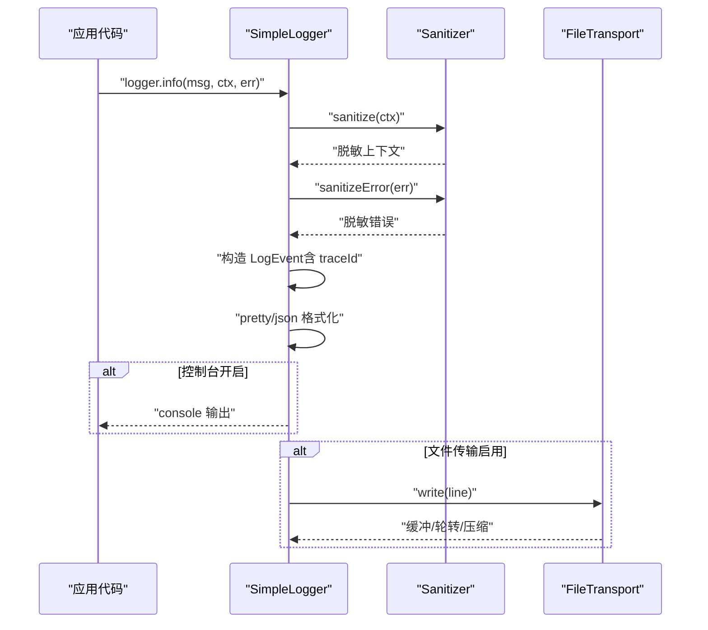
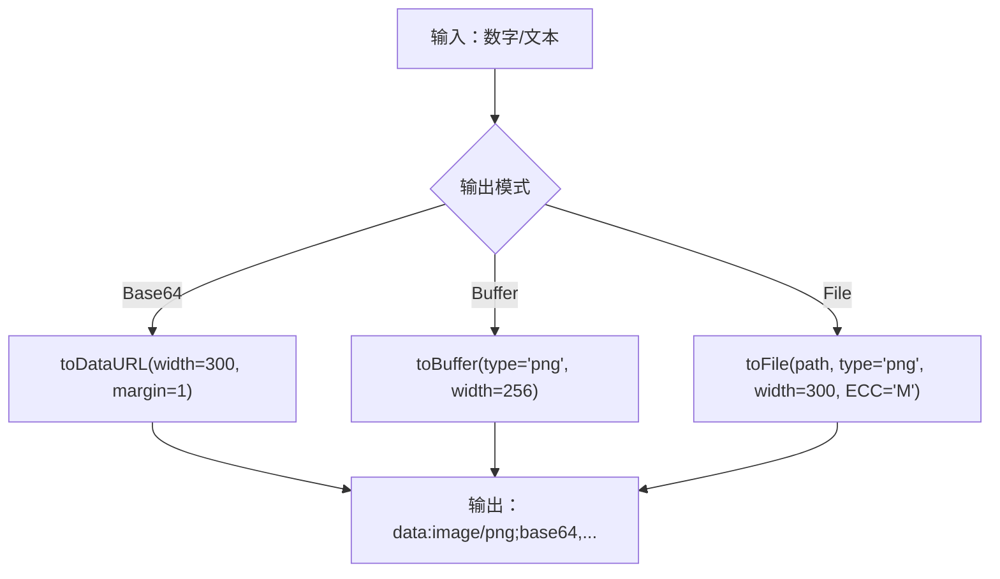
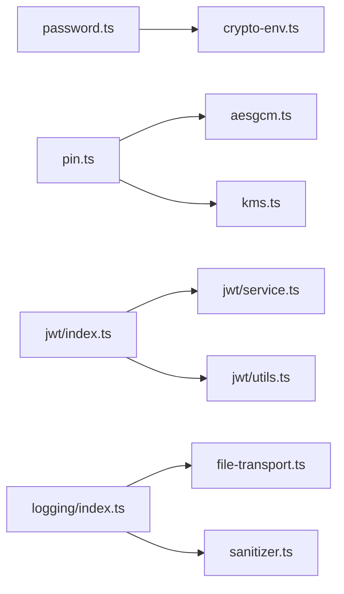

# 工具库详解

<cite>
**本文引用的文件**
- [src/tools/crypto/index.ts](file://src/tools/crypto/index.ts)
- [src/tools/crypto/password.ts](file://src/tools/crypto/password.ts)
- [src/tools/crypto/aesgcm.ts](file://src/tools/crypto/aesgcm.ts)
- [src/tools/crypto/kms.ts](file://src/tools/crypto/kms.ts)
- [src/tools/crypto/crypto-env.ts](file://src/tools/crypto/crypto-env.ts)
- [src/tools/crypto/pin.ts](file://src/tools/crypto/pin.ts)
- [src/tools/jwt/index.ts](file://src/tools/jwt/index.ts)
- [src/tools/jwt/service.ts](file://src/tools/jwt/service.ts)
- [src/tools/jwt/utils.ts](file://src/tools/jwt/utils.ts)
- [src/tools/logging/index.ts](file://src/tools/logging/index.ts)
- [src/tools/logging/file-transport.ts](file://src/tools/logging/file-transport.ts)
- [src/tools/logging/sanitizer.ts](file://src/tools/logging/sanitizer.ts)
- [src/tools/qr/index.ts](file://src/tools/qr/index.ts)
- [src/tools/qr/generateBase64.ts](file://src/tools/qr/generateBase64.ts)
- [src/tools/qr/generateBuffer.ts](file://src/tools/qr/generateBuffer.ts)
- [src/tools/qr/generateFile.ts](file://src/tools/qr/generateFile.ts)
</cite>

## 目录
1. [简介](#简介)
2. [项目结构](#项目结构)
3. [核心组件](#核心组件)
4. [架构概览](#架构概览)
5. [详细组件分析](#详细组件分析)
6. [依赖关系分析](#依赖关系分析)
7. [性能考量](#性能考量)
8. [故障排查指南](#故障排查指南)
9. [结论](#结论)
10. [附录](#附录)

## 简介
本文件面向 IM-API 的工具库，系统性梳理以下能力：
- 加密工具：密码加密（Scrypt）、AES-GCM 对称加密、KMS 密钥管理
- JWT 工具：令牌生成、验证、刷新与权限守卫
- 日志工具：配置、文件传输、数据脱敏、采样与 TraceId 追踪
- QR 码生成：Base64、Buffer、文件三种输出形式
- 扩展与自定义：如何在现有框架上进行二次开发与安全加固
- 性能优化与安全建议：参数调优、密钥轮换、I/O 优化与常见风险规避

## 项目结构
工具库采用“按功能域分层”的组织方式，核心位于 src/tools 下：
- crypto：密码学与密钥管理
- jwt：令牌服务与守卫
- logging：企业级日志系统
- qr：二维码生成工具集

图表来源
- [src/tools/crypto/password.ts](file://src/tools/crypto/password.ts#L1-L111)
- [src/tools/crypto/aesgcm.ts](file://src/tools/crypto/aesgcm.ts#L1-L100)
- [src/tools/crypto/kms.ts](file://src/tools/crypto/kms.ts#L1-L95)
- [src/tools/crypto/crypto-env.ts](file://src/tools/crypto/crypto-env.ts#L1-L6)
- [src/tools/crypto/pin.ts](file://src/tools/crypto/pin.ts#L1-L77)
- [src/tools/jwt/index.ts](file://src/tools/jwt/index.ts#L1-L107)
- [src/tools/jwt/service.ts](file://src/tools/jwt/service.ts#L1-L98)
- [src/tools/jwt/utils.ts](file://src/tools/jwt/utils.ts#L1-L67)
- [src/tools/logging/index.ts](file://src/tools/logging/index.ts#L1-L532)
- [src/tools/logging/file-transport.ts](file://src/tools/logging/file-transport.ts#L1-L268)
- [src/tools/logging/sanitizer.ts](file://src/tools/logging/sanitizer.ts#L1-L210)
- [src/tools/qr/index.ts](file://src/tools/qr/index.ts#L1-L5)
- [src/tools/qr/generateBase64.ts](file://src/tools/qr/generateBase64.ts#L1-L18)
- [src/tools/qr/generateBuffer.ts](file://src/tools/qr/generateBuffer.ts#L1-L17)
- [src/tools/qr/generateFile.ts](file://src/tools/qr/generateFile.ts#L1-L24)

章节来源
- [src/tools/crypto/index.ts](file://src/tools/crypto/index.ts#L1-L11)
- [src/tools/jwt/index.ts](file://src/tools/jwt/index.ts#L1-L107)
- [src/tools/logging/index.ts](file://src/tools/logging/index.ts#L1-L532)
- [src/tools/qr/index.ts](file://src/tools/qr/index.ts#L1-L5)

## 核心组件
- 密码学与密钥管理
  - Scrypt 密码哈希：提供不可逆的口令存储与校验，支持“pepper”与参数升级提示
  - AES-256-GCM 加解密：带随机 IV 与可选 AAD 的认证加密，输出可序列化载荷
  - KMS 密钥提供器：EnvKeyProvider 支持主密钥加载、按 KID 检索与轮换占位
  - PIN 加解密：固定 6 位数字 PIN，基于 Secret 派生对称密钥
- JWT 工具
  - JwtService：签发、验证、刷新轮转；支持 HS256/RS256；可注入密钥提供器
  - 工具函数：TTL 解析、时间戳、短 ID 与随机 ID
- 日志工具
  - SimpleLogger：多级别、结构化输出、采样、脱敏、TraceId、文件传输
  - FileTransport：异步写入、缓冲、轮转、压缩、清理
  - Sanitizer：敏感字段自动识别与脱敏（支持前后缀保留）
- QR 码
  - 三种输出：Base64 数据 URI、Buffer、文件

章节来源
- [src/tools/crypto/password.ts](file://src/tools/crypto/password.ts#L1-L111)
- [src/tools/crypto/aesgcm.ts](file://src/tools/crypto/aesgcm.ts#L1-L100)
- [src/tools/crypto/kms.ts](file://src/tools/crypto/kms.ts#L1-L95)
- [src/tools/crypto/pin.ts](file://src/tools/crypto/pin.ts#L1-L77)
- [src/tools/jwt/service.ts](file://src/tools/jwt/service.ts#L1-L98)
- [src/tools/jwt/utils.ts](file://src/tools/jwt/utils.ts#L1-L67)
- [src/tools/logging/index.ts](file://src/tools/logging/index.ts#L1-L532)
- [src/tools/logging/file-transport.ts](file://src/tools/logging/file-transport.ts#L1-L268)
- [src/tools/logging/sanitizer.ts](file://src/tools/logging/sanitizer.ts#L1-L210)
- [src/tools/qr/generateBase64.ts](file://src/tools/qr/generateBase64.ts#L1-L18)
- [src/tools/qr/generateBuffer.ts](file://src/tools/qr/generateBuffer.ts#L1-L17)
- [src/tools/qr/generateFile.ts](file://src/tools/qr/generateFile.ts#L1-L24)

## 架构概览
工具库以“服务/提供器/传输/脱敏”四层协作：
- 服务层：JwtService、SimpleLogger
- 提供器层：KeyProvider（EnvKeyProvider）、密钥派生（PIN）
- 传输层：FileTransport（文件写入、轮转、压缩）
- 脱敏层：Sanitizer（敏感字段识别与替换）

图表来源
- [src/tools/jwt/service.ts](file://src/tools/jwt/service.ts#L27-L98)
- [src/tools/crypto/kms.ts](file://src/tools/crypto/kms.ts#L45-L95)
- [src/tools/logging/index.ts](file://src/tools/logging/index.ts#L295-L438)
- [src/tools/logging/file-transport.ts](file://src/tools/logging/file-transport.ts#L32-L259)
- [src/tools/logging/sanitizer.ts](file://src/tools/logging/sanitizer.ts#L135-L201)
- [src/tools/crypto/pin.ts](file://src/tools/crypto/pin.ts#L49-L77)
- [src/tools/crypto/aesgcm.ts](file://src/tools/crypto/aesgcm.ts#L59-L87)

## 详细组件分析

### 密码加密（Scrypt）
- 设计要点
  - 使用固定参数 N=32768, r=8, p=1, keylen=32，兼顾安全性与性能
  - 通过“pepper”提升抗彩虹表能力；校验兼容无 pepper 的旧哈希
  - 支持“升级判断”：当成本参数或长度低于基线或未使用 pepper 时，建议重新哈希
- 关键流程

图表来源
- [src/tools/crypto/password.ts](file://src/tools/crypto/password.ts#L55-L110)

- 最佳实践
  - 强制设置足够长度的 PASSWORD_PEPPER（≥16）
  - 定期评估硬件性能，调整 N/r/p 至基线以上
  - 在用户修改口令或登录时触发 verifyPasswordUpgrade，必要时更新存储

章节来源
- [src/tools/crypto/password.ts](file://src/tools/crypto/password.ts#L1-L111)
- [src/tools/crypto/crypto-env.ts](file://src/tools/crypto/crypto-env.ts#L1-L6)

### AES-GCM 加密与 KMS 密钥管理
- AES-GCM
  - 随机 12 字节 IV，16 字节认证标签，可选 AAD
  - 输出结构化载荷（v/alg/kid/iv/tag/ct/aad），便于序列化与跨系统传输
  - 提供常量时间的密钥 ID 比较，降低侧信道风险
- KMS 密钥提供器
  - EnvKeyProvider：从环境变量加载主密钥（base64url 32 字节），生成 KID，支持历史密钥缓存
  - 支持按 KID 检索历史密钥，便于解密旧数据
  - 轮换占位：生产环境建议结合持久化策略实现周期性轮换

图表来源
- [src/tools/crypto/aesgcm.ts](file://src/tools/crypto/aesgcm.ts#L33-L49)
- [src/tools/crypto/kms.ts](file://src/tools/crypto/kms.ts#L15-L36)
- [src/tools/crypto/kms.ts](file://src/tools/crypto/kms.ts#L45-L95)

- 使用建议
  - 严格管理 DATA_MASTER_KEY 与 KID，确保可追溯
  - 对历史密钥保留短期缓存，避免频繁 I/O
  - 在解密失败时，优先尝试历史 KID，再回退到错误处理

章节来源
- [src/tools/crypto/aesgcm.ts](file://src/tools/crypto/aesgcm.ts#L1-L100)
- [src/tools/crypto/kms.ts](file://src/tools/crypto/kms.ts#L1-L95)

### PIN 加密（固定 6 位数字）
- 设计目标
  - 针对支付/风控场景的 6 位纯数字 PIN 安全存储
  - 基于 Secret 派生 32 字节对称密钥（SHA-256）
- 流程图

图表来源
- [src/tools/crypto/pin.ts](file://src/tools/crypto/pin.ts#L49-L77)

- 最佳实践
  - Secret 长度 ≥16，定期轮换
  - 将载荷字符串与业务上下文分离存储，避免泄露
  - 解密后再次断言 PIN 格式，确保完整性

章节来源
- [src/tools/crypto/pin.ts](file://src/tools/crypto/pin.ts#L1-L77)

### JWT 工具：生成、验证与权限守卫
- JwtService
  - 支持 HS256/RS256；根据环境变量动态选择密钥来源
  - 自动注入 iat/jti/sub 等标准字段；tokenType 标识访问/刷新
  - 验证阶段捕获过期与无效错误，统一包装为 AuthError
- 工具函数
  - ttlToSeconds：支持 "15m"/"7d"/"3600s"/"1h" 等格式
  - nowSec：秒级时间戳
  - shortId/nanoid：URL-safe 随机串，满足不同熵需求

图表来源
- [src/tools/jwt/service.ts](file://src/tools/jwt/service.ts#L41-L75)
- [src/tools/jwt/index.ts](file://src/tools/jwt/index.ts#L80-L106)

- 权限守卫
  - 通过 Guards 命名空间导出多种断言（应用/用户/角色/团队/作用域/VIP/设备等）
  - 建议在路由中间件中组合使用，形成“多层守卫”

章节来源
- [src/tools/jwt/index.ts](file://src/tools/jwt/index.ts#L1-L107)
- [src/tools/jwt/service.ts](file://src/tools/jwt/service.ts#L1-L98)
- [src/tools/jwt/utils.ts](file://src/tools/jwt/utils.ts#L1-L67)

### 日志工具：配置、文件传输与数据净化
- SimpleLogger
  - 多级别过滤、结构化上下文、采样率控制、TraceId 注入
  - 支持控制台彩色输出与 JSON 行输出
  - 与 FileTransport/Sanitizer 协作，实现文件持久化与敏感信息脱敏
- FileTransport
  - 异步写入、缓冲区与定时刷新
  - 按大小与日期轮转，支持压缩与过期清理
- Sanitizer
  - 自动识别敏感字段（大小写不敏感、包含匹配）
  - 支持“前后缀保留”策略与占位符替换

图表来源
- [src/tools/logging/index.ts](file://src/tools/logging/index.ts#L397-L437)
- [src/tools/logging/file-transport.ts](file://src/tools/logging/file-transport.ts#L197-L236)
- [src/tools/logging/sanitizer.ts](file://src/tools/logging/sanitizer.ts#L148-L168)

- 最佳实践
  - 生产环境建议开启文件传输与脱敏，合理设置采样率
  - 使用 runWithTraceId 包裹请求链路，便于问题定位
  - 定期清理过期日志文件，避免磁盘占用过高

章节来源
- [src/tools/logging/index.ts](file://src/tools/logging/index.ts#L1-L532)
- [src/tools/logging/file-transport.ts](file://src/tools/logging/file-transport.ts#L1-L268)
- [src/tools/logging/sanitizer.ts](file://src/tools/logging/sanitizer.ts#L1-L210)

### QR 码生成
- 三类输出
  - Base64：适合内嵌显示
  - Buffer：适合进一步处理（如写入文件）
  - 文件：直接落盘，支持纠错等级与尺寸配置
- 应用场景
  - 登录验证码、支付授权、设备绑定、分享链接等

图表来源
- [src/tools/qr/generateBase64.ts](file://src/tools/qr/generateBase64.ts#L10-L17)
- [src/tools/qr/generateBuffer.ts](file://src/tools/qr/generateBuffer.ts#L9-L16)
- [src/tools/qr/generateFile.ts](file://src/tools/qr/generateFile.ts#L11-L23)

章节来源
- [src/tools/qr/index.ts](file://src/tools/qr/index.ts#L1-L5)
- [src/tools/qr/generateBase64.ts](file://src/tools/qr/generateBase64.ts#L1-L18)
- [src/tools/qr/generateBuffer.ts](file://src/tools/qr/generateBuffer.ts#L1-L17)
- [src/tools/qr/generateFile.ts](file://src/tools/qr/generateFile.ts#L1-L24)

## 依赖关系分析
- 组件耦合
  - password 依赖 crypto-env 获取 pepper
  - pin 依赖 aesgcm 与 kms（通过派生密钥间接使用）
  - jwt 依赖 jose 与密钥提供器
  - logging 依赖 file-transport 与 sanitizer
- 外部依赖
  - jose：JWT 签发与验证
  - qrcode：QR 码生成
  - node:crypto、node:fs、node:path、node:zlib、node:async_hooks：运行时能力

图表来源
- [src/tools/crypto/password.ts](file://src/tools/crypto/password.ts#L10-L12)
- [src/tools/crypto/pin.ts](file://src/tools/crypto/pin.ts#L10-L12)
- [src/tools/jwt/index.ts](file://src/tools/jwt/index.ts#L75-L80)
- [src/tools/logging/index.ts](file://src/tools/logging/index.ts#L10-L13)

章节来源
- [src/tools/crypto/password.ts](file://src/tools/crypto/password.ts#L1-L111)
- [src/tools/crypto/aesgcm.ts](file://src/tools/crypto/aesgcm.ts#L1-L100)
- [src/tools/crypto/kms.ts](file://src/tools/crypto/kms.ts#L1-L95)
- [src/tools/jwt/index.ts](file://src/tools/jwt/index.ts#L1-L107)
- [src/tools/logging/index.ts](file://src/tools/logging/index.ts#L1-L532)

## 性能考量
- 密码学
  - Scrypt 参数需随硬件演进调整，建议在基准测试后设定基线
  - 使用常量时间比较避免时序侧信道
- AES-GCM
  - 合理设置 AAD，避免额外解析开销
  - 复用密钥对象，减少重复派生
- 日志
  - 合理配置缓冲区大小与刷新间隔，平衡吞吐与延迟
  - 采样率在高并发下可显著降低 I/O 压力
  - 文件轮转与压缩异步执行，避免阻塞主线程
- JWT
  - 优先使用 HS256 以减少签名/验证开销；RS256 更适合跨系统互信
  - 避免在 payload 中放置过大上下文，减小序列化/网络传输成本

## 故障排查指南
- 密码校验失败
  - 检查 PASSWORD_PEPPER 是否设置且长度足够
  - 使用 verifyPasswordUpgrade 判断是否需要重新哈希
- AES-GCM 解密报错
  - 确认密钥 ID 与密钥一致，必要时通过 KID 检索历史密钥
  - 校验 AAD 一致性，认证标签不匹配会抛错
- JWT 验证失败
  - 检查算法与密钥来源配置（HS256/RS256）
  - 关注过期与非法令牌错误，分别对应 AuthErrorCode.Expired/Invalid
- 日志异常
  - 检查文件路径与权限，确认目录存在且可写
  - 脱敏规则是否覆盖了关键字段，导致信息缺失
- QR 码生成失败
  - 确认输入值可序列化为字符串
  - 检查输出路径与磁盘空间

章节来源
- [src/tools/crypto/password.ts](file://src/tools/crypto/password.ts#L55-L70)
- [src/tools/crypto/aesgcm.ts](file://src/tools/crypto/aesgcm.ts#L78-L87)
- [src/tools/jwt/service.ts](file://src/tools/jwt/service.ts#L66-L75)
- [src/tools/logging/file-transport.ts](file://src/tools/logging/file-transport.ts#L197-L236)
- [src/tools/qr/generateBase64.ts](file://src/tools/qr/generateBase64.ts#L10-L17)

## 结论
该工具库围绕“安全、可观测、易用”三大目标构建：
- 安全：Scrypt、AES-GCM、KMS 提供端到端加密保障
- 可观测：结构化日志、文件传输、脱敏与 TraceId 追踪
- 易用：统一导出、环境驱动配置、清晰的 API 与守卫体系
建议在生产环境中结合密钥轮换、采样与轮转策略，持续优化性能与安全。

## 附录
- 扩展与自定义
  - 新增密钥提供器：实现 KeyProvider 接口，支持外部 KMS/数据库
  - 自定义日志传输：实现自定义 Transport，适配对象存储或远程日志系统
  - 扩展脱敏规则：通过 Sanitizer 动态添加/移除敏感字段
  - JWT 守卫：在 Guards 命名空间新增断言，复用 JwtService 的验证能力
- 最佳实践清单
  - 密码学：强制 pepper、定期升级参数、最小权限密钥管理
  - 日志：启用文件传输与脱敏、合理采样、TraceId 贯穿链路
  - QR：限制输入范围、控制输出质量与尺寸、妥善保存生成文件