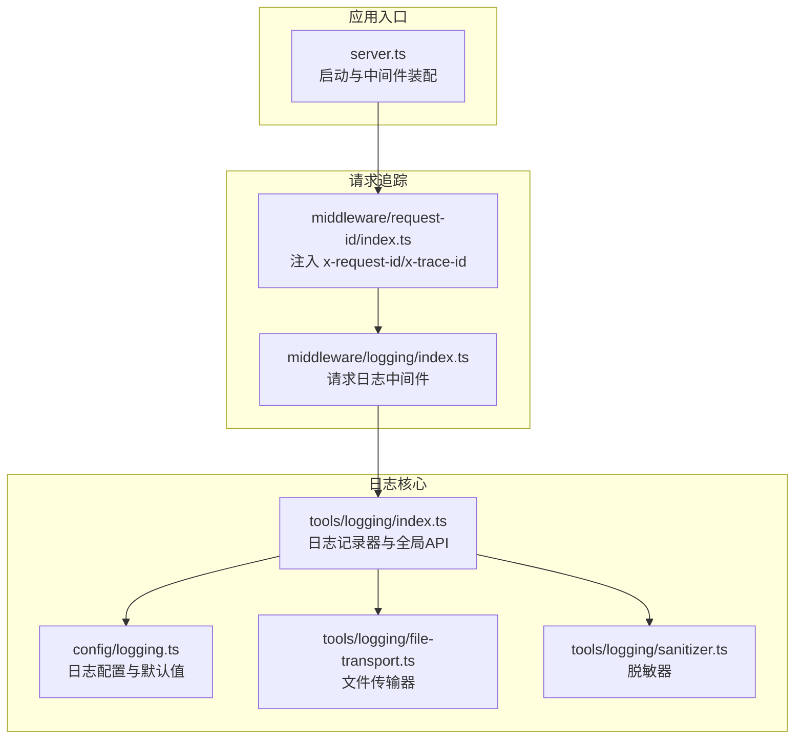
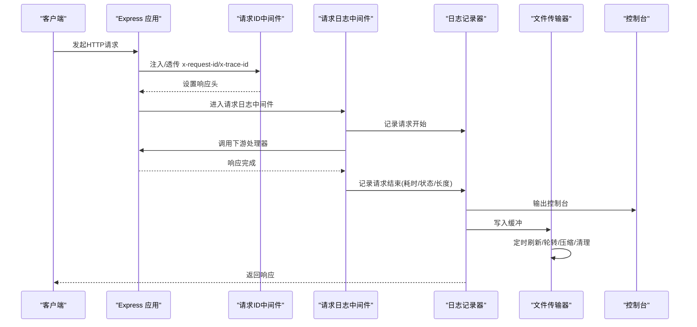
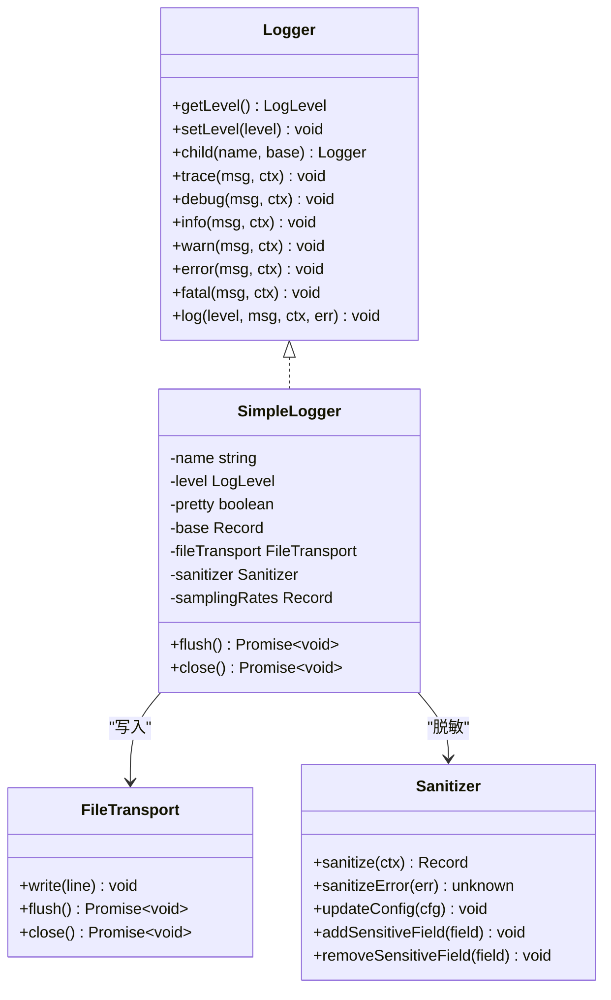
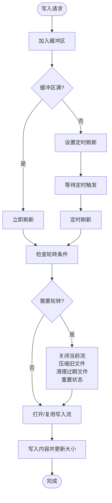
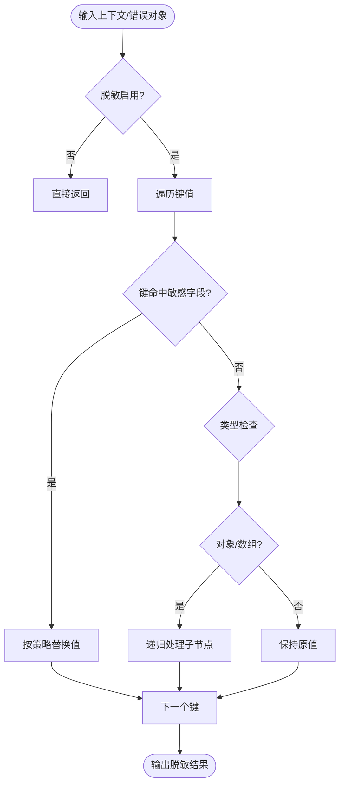
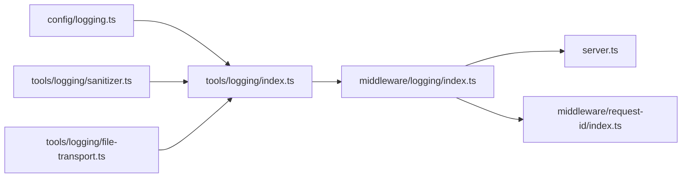

# 日志工具

<cite>
**本文引用的文件**
- [src/tools/logging/index.ts](file://src/tools/logging/index.ts)
- [src/tools/logging/file-transport.ts](file://src/tools/logging/file-transport.ts)
- [src/tools/logging/sanitizer.ts](file://src/tools/logging/sanitizer.ts)
- [src/config/logging.ts](file://src/config/logging.ts)
- [src/middleware/logging/index.ts](file://src/middleware/logging/index.ts)
- [src/middleware/request-id/index.ts](file://src/middleware/request-id/index.ts)
- [src/server.ts](file://src/server.ts)
</cite>

## 目录
1. [简介](#简介)
2. [项目结构](#项目结构)
3. [核心组件](#核心组件)
4. [架构总览](#架构总览)
5. [详细组件分析](#详细组件分析)
6. [依赖关系分析](#依赖关系分析)
7. [性能与存储策略](#性能与存储策略)
8. [故障排查指南](#故障排查指南)
9. [结论](#结论)
10. [附录：配置与示例](#附录配置与示例)

## 简介
本文件为 IM-API 的日志工具模块技术文档，覆盖日志系统整体架构、配置项、文件传输器实现、日志文件管理策略、数据脱敏机制、采样与轮转、性能优化、调试与监控应用、以及安全与合规注意事项。文档以循序渐进的方式呈现，既适合初学者快速上手，也便于资深工程师深入理解实现细节与最佳实践。

## 项目结构
日志工具位于 src/tools/logging 下，配合配置 src/config/logging.ts、请求追踪中间件 src/middleware/request-id/index.ts 与请求日志中间件 src/middleware/logging/index.ts，形成“请求追踪 + 结构化日志 + 文件落盘 + 脱敏 + 采样”的闭环。

图表来源
- [src/server.ts](file://src/server.ts#L1-L74)
- [src/middleware/request-id/index.ts](file://src/middleware/request-id/index.ts#L1-L64)
- [src/middleware/logging/index.ts](file://src/middleware/logging/index.ts#L1-L64)
- [src/config/logging.ts](file://src/config/logging.ts#L1-L157)
- [src/tools/logging/index.ts](file://src/tools/logging/index.ts#L1-L532)
- [src/tools/logging/file-transport.ts](file://src/tools/logging/file-transport.ts#L1-L268)
- [src/tools/logging/sanitizer.ts](file://src/tools/logging/sanitizer.ts#L1-L210)

章节来源
- [src/server.ts](file://src/server.ts#L1-L74)
- [src/middleware/request-id/index.ts](file://src/middleware/request-id/index.ts#L1-L64)
- [src/middleware/logging/index.ts](file://src/middleware/logging/index.ts#L1-L64)
- [src/config/logging.ts](file://src/config/logging.ts#L1-L157)
- [src/tools/logging/index.ts](file://src/tools/logging/index.ts#L1-L532)
- [src/tools/logging/file-transport.ts](file://src/tools/logging/file-transport.ts#L1-L268)
- [src/tools/logging/sanitizer.ts](file://src/tools/logging/sanitizer.ts#L1-L210)

## 核心组件
- 日志记录器与全局API：提供结构化日志、级别过滤、采样、脱敏、TraceId 注入、控制台与文件输出、刷新与关闭能力。
- 文件传输器：负责异步写入、缓冲、定时刷新、日志轮转、压缩与过期清理。
- 脱敏器：对上下文与错误对象进行敏感字段识别与替换，支持部分保留策略。
- 配置模块：集中管理日志级别、输出格式、文件路径、采样率、脱敏字段集与占位符等。
- 请求日志中间件：基于 TraceId 绑定上下文，记录请求耗时、状态码、长度等指标。

章节来源
- [src/tools/logging/index.ts](file://src/tools/logging/index.ts#L1-L532)
- [src/tools/logging/file-transport.ts](file://src/tools/logging/file-transport.ts#L1-L268)
- [src/tools/logging/sanitizer.ts](file://src/tools/logging/sanitizer.ts#L1-L210)
- [src/config/logging.ts](file://src/config/logging.ts#L1-L157)
- [src/middleware/logging/index.ts](file://src/middleware/logging/index.ts#L1-L64)

## 架构总览
日志系统采用“记录器 + 传输器 + 脱敏器 + 配置 + 中间件”的分层设计：
- 记录器负责事件构建、级别与采样过滤、脱敏、TraceId 注入、控制台与文件输出。
- 文件传输器负责缓冲、定时刷新、轮转、压缩与清理。
- 脱敏器在记录器内部统一处理上下文与错误对象的敏感字段。
- 配置模块提供默认值与环境变量覆盖，保证开发与生产差异可控。
- 请求日志中间件通过 TraceId 将请求生命周期内的日志串联起来，便于问题定位与性能分析。

图表来源
- [src/middleware/request-id/index.ts](file://src/middleware/request-id/index.ts#L1-L64)
- [src/middleware/logging/index.ts](file://src/middleware/logging/index.ts#L1-L64)
- [src/tools/logging/index.ts](file://src/tools/logging/index.ts#L1-L532)
- [src/tools/logging/file-transport.ts](file://src/tools/logging/file-transport.ts#L1-L268)

## 详细组件分析

### 日志记录器（SimpleLogger）
- 功能要点
  - 支持 trace/debug/info/warn/error/fatal 六级日志。
  - 级别过滤：按最小级别阈值决定是否输出。
  - 采样过滤：按级别配置采样率，降低高频日志对性能的影响。
  - 脱敏处理：对上下文与错误对象执行敏感字段替换。
  - TraceId 注入：从异步存储中读取当前请求的 TraceId 并附加到日志事件。
  - 输出格式：支持 JSON 行与人类可读彩色格式。
  - 文件输出：通过文件传输器异步写入，支持刷新与关闭。
  - 子记录器：支持按模块/组件创建子记录器，继承基础上下文。
- 性能与可靠性
  - 异步写入与缓冲：减少阻塞，提升吞吐。
  - 定时刷新：避免频繁 I/O。
  - 关闭流程：确保未刷数据落盘。

图表来源
- [src/tools/logging/index.ts](file://src/tools/logging/index.ts#L77-L166)
- [src/tools/logging/index.ts](file://src/tools/logging/index.ts#L295-L438)
- [src/tools/logging/file-transport.ts](file://src/tools/logging/file-transport.ts#L32-L268)
- [src/tools/logging/sanitizer.ts](file://src/tools/logging/sanitizer.ts#L135-L209)

章节来源
- [src/tools/logging/index.ts](file://src/tools/logging/index.ts#L1-L532)

### 文件传输器（FileTransport）
- 功能要点
  - 异步写入与缓冲：写入缓冲区满或定时触发刷新。
  - 轮转策略：按日期与大小判断是否轮转；轮转时压缩旧文件并清理过期文件。
  - 过期清理：按保留数量限制文件数量，删除最旧文件。
  - 目录确保：自动创建日志目录。
  - 关闭流程：停止定时器、刷新缓冲、关闭流。
- 性能与可靠性
  - 流式管道压缩，避免内存峰值。
  - 文件大小解析支持 b/k/m/g，便于灵活配置。
  - 轮转与清理在刷新阶段执行，避免写入阻塞。

图表来源
- [src/tools/logging/file-transport.ts](file://src/tools/logging/file-transport.ts#L197-L236)
- [src/tools/logging/file-transport.ts](file://src/tools/logging/file-transport.ts#L96-L118)
- [src/tools/logging/file-transport.ts](file://src/tools/logging/file-transport.ts#L140-L164)
- [src/tools/logging/file-transport.ts](file://src/tools/logging/file-transport.ts#L170-L191)

章节来源
- [src/tools/logging/file-transport.ts](file://src/tools/logging/file-transport.ts#L1-L268)

### 脱敏器（Sanitizer）
- 功能要点
  - 字段匹配：大小写不敏感，支持包含式匹配，覆盖常见敏感字段。
  - 值替换：支持全量脱敏与部分保留（前后缀保留），默认占位符。
  - 递归处理：对嵌套对象与数组进行深度遍历与脱敏。
  - 错误对象脱敏：对错误对象的键值同样执行脱敏策略。
  - 动态配置：运行时可更新配置、增删敏感字段。
- 隐私与合规
  - 默认覆盖密码、令牌、授权、Cookie、会话等高风险字段。
  - 支持开启/关闭与自定义占位符，满足不同合规要求。

图表来源
- [src/tools/logging/sanitizer.ts](file://src/tools/logging/sanitizer.ts#L60-L101)
- [src/tools/logging/sanitizer.ts](file://src/tools/logging/sanitizer.ts#L110-L129)
- [src/tools/logging/sanitizer.ts](file://src/tools/logging/sanitizer.ts#L148-L168)

章节来源
- [src/tools/logging/sanitizer.ts](file://src/tools/logging/sanitizer.ts#L1-L210)

### 配置模块（LoggingConfig）
- 功能要点
  - 全局日志级别：支持 trace/debug/info/warn/error/fatal。
  - 输出格式：开发模式默认美化输出，生产模式默认 JSON。
  - 文件传输：启用开关、路径模板（支持 %DATE%）、大小上限、保留数量、压缩、日期模式。
  - 采样：trace 与 debug 在生产环境默认低采样，info 默认全采样。
  - 脱敏：默认启用，内置敏感字段集合，支持占位符与部分保留策略。
  - 控制台：默认启用，可通过环境变量禁用。
  - 默认值：根据 NODE_ENV 自动调整级别与美化输出。
- 环境变量覆盖：LOG_LEVEL、LOG_PRETTY、LOG_CONSOLE、LOG_FILE_ENABLED、LOG_FILE_PATH、LOG_FILE_MAX_SIZE、LOG_FILE_MAX_FILES、LOG_FILE_COMPRESS、LOG_FILE_DATE_PATTERN、LOG_SANITIZE。

章节来源
- [src/config/logging.ts](file://src/config/logging.ts#L1-L157)

### 请求日志中间件与 TraceId
- 功能要点
  - 从请求头提取 x-trace-id 或 x-request-id，若不存在则生成 UUID。
  - 将 TraceId 写入响应头，便于跨服务追踪。
  - 在请求生命周期内记录开始与结束事件，包含方法、URL、状态码、耗时、响应长度等。
  - 与日志记录器结合，自动附加 TraceId，实现端到端追踪。
- 依赖关系
  - 依赖请求 ID 中间件确保请求具备唯一标识。
  - 依赖日志记录器进行结构化输出。

章节来源
- [src/middleware/logging/index.ts](file://src/middleware/logging/index.ts#L1-L64)
- [src/middleware/request-id/index.ts](file://src/middleware/request-id/index.ts#L1-L64)
- [src/tools/logging/index.ts](file://src/tools/logging/index.ts#L520-L532)

## 依赖关系分析
- 组件耦合
  - 日志记录器依赖配置模块、文件传输器与脱敏器，三者职责清晰、松耦合。
  - 请求日志中间件依赖请求 ID 中间件与日志记录器，形成“追踪 + 记录”的协作。
- 外部依赖
  - Node.js 文件系统、流与 zlib，用于文件写入、压缩与管道处理。
  - Express 中间件生态，用于请求生命周期钩子与响应头设置。
- 循环依赖
  - 未发现循环依赖；各模块通过导出接口与工厂函数解耦。

图表来源
- [src/config/logging.ts](file://src/config/logging.ts#L1-L157)
- [src/tools/logging/index.ts](file://src/tools/logging/index.ts#L1-L532)
- [src/tools/logging/file-transport.ts](file://src/tools/logging/file-transport.ts#L1-L268)
- [src/tools/logging/sanitizer.ts](file://src/tools/logging/sanitizer.ts#L1-L210)
- [src/middleware/logging/index.ts](file://src/middleware/logging/index.ts#L1-L64)
- [src/middleware/request-id/index.ts](file://src/middleware/request-id/index.ts#L1-L64)
- [src/server.ts](file://src/server.ts#L1-L74)

## 性能与存储策略
- 采样策略
  - 生产环境对 trace 与 debug 级别进行低采样，info 级别全采样，显著降低高频日志对系统的影响。
- 缓冲与刷新
  - 写入缓冲区满或定时刷新，减少磁盘 I/O 次数，提高吞吐。
- 轮转与压缩
  - 按日期与大小轮转，压缩旧文件，节省存储空间。
  - 保留最近 N 个文件，避免无限增长。
- 文件大小解析
  - 支持 b/k/m/g 单位，便于灵活配置大小阈值。
- TraceId 串联
  - 通过请求日志中间件与日志记录器的 TraceId 注入，实现端到端请求追踪，便于性能分析与问题定位。

章节来源
- [src/config/logging.ts](file://src/config/logging.ts#L123-L127)
- [src/tools/logging/file-transport.ts](file://src/tools/logging/file-transport.ts#L203-L210)
- [src/tools/logging/file-transport.ts](file://src/tools/logging/file-transport.ts#L75-L90)
- [src/tools/logging/file-transport.ts](file://src/tools/logging/file-transport.ts#L124-L134)
- [src/tools/logging/file-transport.ts](file://src/tools/logging/file-transport.ts#L140-L164)
- [src/middleware/logging/index.ts](file://src/middleware/logging/index.ts#L36-L56)

## 故障排查指南
- 日志未输出
  - 检查全局级别是否高于当前日志级别。
  - 检查采样率是否过低导致被过滤。
  - 检查控制台输出开关与文件传输器启用状态。
- 文件未落盘
  - 确认缓冲区是否已刷新或定时刷新是否触发。
  - 检查文件路径是否存在且具备写权限。
  - 应用退出时调用关闭流程，确保最后缓冲写入。
- 脱敏效果异常
  - 检查敏感字段列表是否包含目标键（大小写不敏感，支持包含匹配）。
  - 检查占位符与部分保留策略配置。
- 轮转与清理无效
  - 检查文件大小阈值与保留数量配置。
  - 检查日期模式与路径模板是否正确。
- TraceId 未生效
  - 确认请求 ID 中间件在请求日志中间件之前执行。
  - 检查响应头是否正确写入 x-trace-id。

章节来源
- [src/tools/logging/index.ts](file://src/tools/logging/index.ts#L397-L437)
- [src/tools/logging/file-transport.ts](file://src/tools/logging/file-transport.ts#L217-L258)
- [src/tools/logging/sanitizer.ts](file://src/tools/logging/sanitizer.ts#L175-L200)
- [src/middleware/logging/index.ts](file://src/middleware/logging/index.ts#L36-L56)
- [src/middleware/request-id/index.ts](file://src/middleware/request-id/index.ts#L50-L61)

## 结论
该日志工具模块通过“记录器 + 传输器 + 脱敏器 + 配置 + 中间件”的组合，实现了高性能、可追踪、可脱敏、可轮转的企业级日志体系。其默认配置兼顾开发体验与生产稳健性，同时提供丰富的可调参数与运行时能力，适用于调试、监控、审计与合规等多种场景。

## 附录：配置与示例
以下为常见配置项与示例说明，具体取值请参考配置模块与环境变量覆盖规则。

- 全局日志级别
  - 开发环境默认级别：debug
  - 生产环境默认级别：info
  - 可通过环境变量覆盖
- 输出格式
  - 开发环境默认美化输出
  - 生产环境默认 JSON 行
  - 可通过环境变量禁用美化
- 控制台输出
  - 默认启用，可通过环境变量禁用
- 文件传输
  - 启用开关：默认生产环境启用
  - 路径模板：支持 %DATE% 日期变量
  - 单文件大小上限：支持 b/k/m/g
  - 保留文件数量：默认 7
  - 压缩：默认启用
  - 日期模式：默认 YYYY-MM-DD
- 采样
  - trace：生产环境 1%，开发环境 100%
  - debug：生产环境 10%，开发环境 100%
  - info：始终 100%
- 脱敏
  - 默认启用
  - 默认敏感字段：password、pin、token、accessToken、refreshToken、secret、apiKey、authorization、cookie、sessionId
  - 占位符：可自定义
  - 部分保留：可开启并设置前后缀保留位数

章节来源
- [src/config/logging.ts](file://src/config/logging.ts#L105-L151)