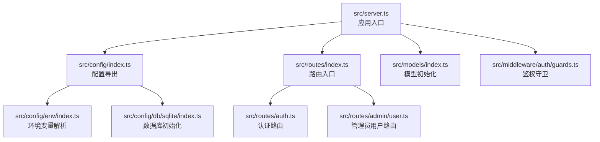
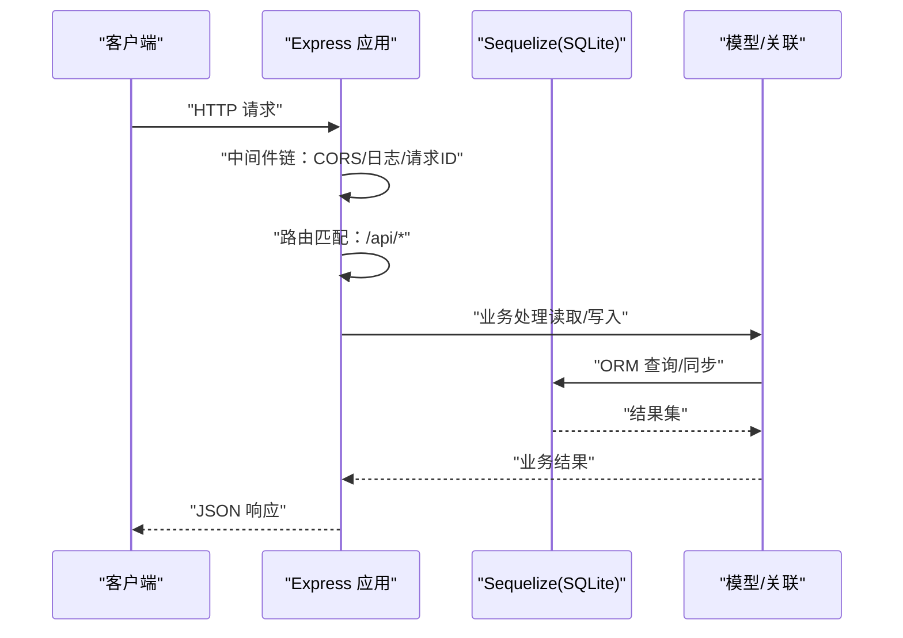
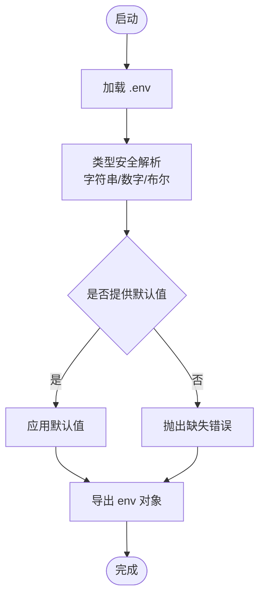
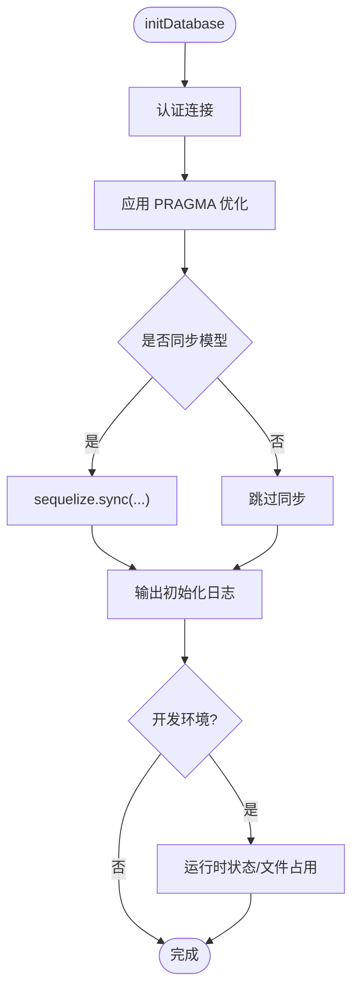
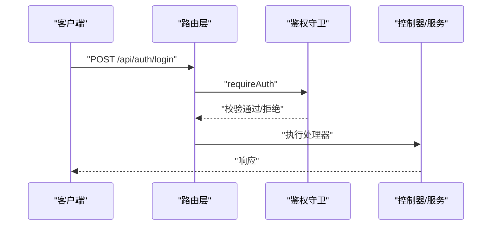
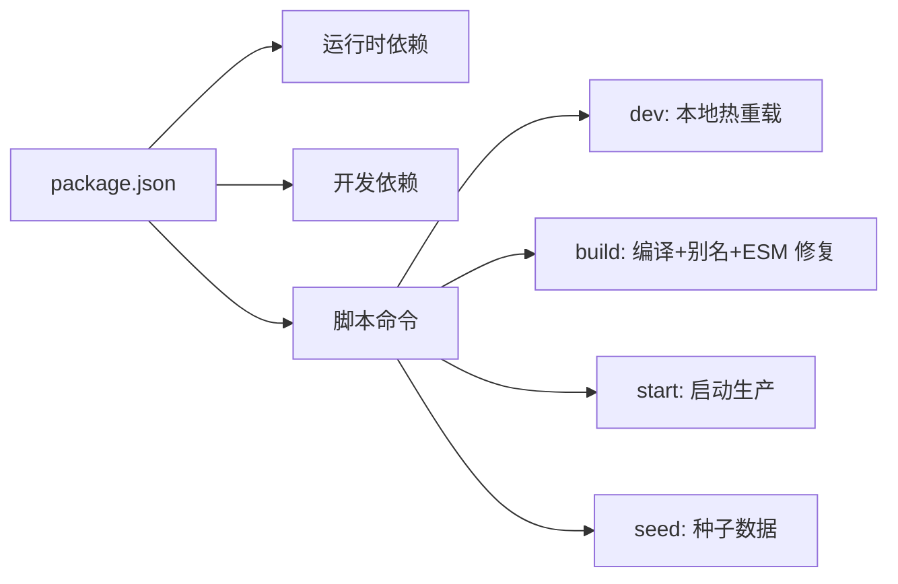

# 快速开始

<cite>
**本文引用的文件**
- [package.json](file://package.json)
- [.env](file://.env)
- [tsconfig.json](file://tsconfig.json)
- [src/server.ts](file://src/server.ts)
- [src/config/env/index.ts](file://src/config/env/index.ts)
- [src/config/db/sqlite/index.ts](file://src/config/db/sqlite/index.ts)
- [src/config/index.ts](file://src/config/index.ts)
- [src/models/index.ts](file://src/models/index.ts)
- [src/routes/index.ts](file://src/routes/index.ts)
- [src/routes/auth.ts](file://src/routes/auth.ts)
- [src/middleware/auth/guards.ts](file://src/middleware/auth/guards.ts)
- [src/config/seed/role.json](file://src/config/seed/role.json)
- [src/tools/crypto/README.md](file://src/tools/crypto/README.md)
</cite>

## 目录
1. [简介](#简介)
2. [项目结构](#项目结构)
3. [核心组件](#核心组件)
4. [架构概览](#架构概览)
5. [详细组件分析](#详细组件分析)
6. [依赖分析](#依赖分析)
7. [性能考虑](#性能考虑)
8. [故障排除指南](#故障排除指南)
9. [结论](#结论)
10. [附录](#附录)

## 简介
本指南面向首次接触 IM-API 的开发者，帮助你在 30 分钟内完成从环境准备到项目运行的全流程。你将学到：
- 环境要求与依赖安装
- .env 配置项详解
- 数据库初始化与种子数据
- 开发服务器启动与基础 API 测试
- 常见问题排查

## 项目结构
IM-API 是一个基于 Node.js + TypeScript + Express + Sequelize 的后端项目，采用模块化分层设计：
- 配置层：环境变量、数据库、Redis、日志等
- 中间件层：CORS、日志、请求 ID、速率限制、鉴权守卫等
- 路由层：公开与受保护的 API 路由
- 业务层：服务与仓库（CRUD）抽象
- 模型层：Sequelize 模型与关联
- 工具层：加密、JWT、QR 码、日志等

图表来源
- [src/server.ts](file://src/server.ts#L1-L74)
- [src/config/index.ts](file://src/config/index.ts#L1-L30)
- [src/config/env/index.ts](file://src/config/env/index.ts#L1-L223)
- [src/config/db/sqlite/index.ts](file://src/config/db/sqlite/index.ts#L1-L410)
- [src/routes/index.ts](file://src/routes/index.ts#L1-L22)
- [src/routes/auth.ts](file://src/routes/auth.ts#L1-L47)
- [src/middleware/auth/guards.ts](file://src/middleware/auth/guards.ts#L1-L195)
- [src/models/index.ts](file://src/models/index.ts#L1-L143)

章节来源
- [src/server.ts](file://src/server.ts#L1-L74)
- [src/config/index.ts](file://src/config/index.ts#L1-L30)
- [src/config/env/index.ts](file://src/config/env/index.ts#L1-L223)
- [src/config/db/sqlite/index.ts](file://src/config/db/sqlite/index.ts#L1-L410)
- [src/routes/index.ts](file://src/routes/index.ts#L1-L22)
- [src/routes/auth.ts](file://src/routes/auth.ts#L1-L47)
- [src/middleware/auth/guards.ts](file://src/middleware/auth/guards.ts#L1-L195)
- [src/models/index.ts](file://src/models/index.ts#L1-L143)

## 核心组件
- 应用入口与启动：负责初始化数据库、注册中间件、挂载路由并启动 HTTP 服务
- 环境变量系统：统一加载 .env，提供类型安全的配置读取与默认值
- 数据库层：基于 Sequelize + SQLite 的高性能配置，包含 WAL、mmap、缓存与连接池优化
- 路由与鉴权：公开认证接口与受保护的管理员接口，支持多种 JWT 守卫
- 模型与关联：集中初始化与注册模型，并定义关联关系
- 工具与加密：提供密码哈希、PIN 加解密、AES-GCM、KMS 等安全工具

章节来源
- [src/server.ts](file://src/server.ts#L1-L74)
- [src/config/env/index.ts](file://src/config/env/index.ts#L1-L223)
- [src/config/db/sqlite/index.ts](file://src/config/db/sqlite/index.ts#L1-L410)
- [src/routes/index.ts](file://src/routes/index.ts#L1-L22)
- [src/middleware/auth/guards.ts](file://src/middleware/auth/guards.ts#L1-L195)
- [src/models/index.ts](file://src/models/index.ts#L1-L143)
- [src/tools/crypto/README.md](file://src/tools/crypto/README.md#L1-L144)

## 架构概览
下图展示了从请求进入应用到数据库查询的整体流程：

图表来源
- [src/server.ts](file://src/server.ts#L27-L48)
- [src/config/db/sqlite/index.ts](file://src/config/db/sqlite/index.ts#L368-L409)
- [src/models/index.ts](file://src/models/index.ts#L42-L57)

章节来源
- [src/server.ts](file://src/server.ts#L1-L74)
- [src/config/db/sqlite/index.ts](file://src/config/db/sqlite/index.ts#L1-L410)
- [src/models/index.ts](file://src/models/index.ts#L1-L143)

## 详细组件分析

### 环境变量与配置
- 加载机制：应用启动时加载 .env，并提供类型安全的读取函数（字符串、数字、布尔）
- 关键配置项：
  - 服务端口、运行环境
  - 数据库方言与存储路径（SQLite）或 MySQL 连接参数
  - 安全密钥：JWT、PIN、密码 Pepper
  - 数据库连接池、SSL、会话参数
  - 速率限制、WebSocket、Redis 等可选功能开关
- 默认值策略：未设置时提供合理默认，便于本地开发

图表来源
- [src/config/env/index.ts](file://src/config/env/index.ts#L166-L220)

章节来源
- [.env](file://.env#L1-L22)
- [src/config/env/index.ts](file://src/config/env/index.ts#L1-L223)

### 数据库初始化与 SQLite 优化
- 连接与认证：建立数据库连接并应用 PRAGMA 性能参数
- WAL 模式与缓存：提升并发读写与崩溃恢复能力
- 连接池：限制最大连接数、空闲回收、获取等待时间
- 可选同步：开发阶段可选择强制重建或非破坏性变更
- 运行时诊断：开发环境输出 PRAGMA 统计与文件占用信息

图表来源
- [src/config/db/sqlite/index.ts](file://src/config/db/sqlite/index.ts#L368-L409)

章节来源
- [src/config/db/sqlite/index.ts](file://src/config/db/sqlite/index.ts#L1-L410)
- [src/config/index.ts](file://src/config/index.ts#L12-L29)

### 路由与鉴权
- 路由组织：公开认证接口与受保护的管理员用户接口
- 鉴权守卫：支持角色、作用域、VIP、团队、Token 类型等多种校验
- 中间件链：CORS、请求 ID、日志、速率限制等

图表来源
- [src/routes/auth.ts](file://src/routes/auth.ts#L18-L31)
- [src/middleware/auth/guards.ts](file://src/middleware/auth/guards.ts#L25-L51)

章节来源
- [src/routes/index.ts](file://src/routes/index.ts#L1-L22)
- [src/routes/auth.ts](file://src/routes/auth.ts#L1-L47)
- [src/middleware/auth/guards.ts](file://src/middleware/auth/guards.ts#L1-L195)

### 模型与关联
- 模型初始化：集中导入并初始化角色与用户模型
- 关联定义：在模型初始化完成后建立关联关系
- 注册表：modelRegistry 提供统一的模型映射，便于通用 CRUD 与权限配置

章节来源
- [src/models/index.ts](file://src/models/index.ts#L1-L143)

## 依赖分析
- 运行时依赖：Express、Sequelize、MySQL2、SQLite3、Redis、CORS、WS、JWK 签名等
- 开发依赖：TypeScript、tsx、tsc-alias、tsc-esm-fix 等
- 脚本命令：开发、构建、启动、种子数据

图表来源
- [package.json](file://package.json#L1-L36)

章节来源
- [package.json](file://package.json#L1-L36)
- [tsconfig.json](file://tsconfig.json#L1-L22)

## 性能考虑
- SQLite 优化：WAL 模式、mmap、缓存大小、自动检查点、锁等待超时
- 连接池：限制最大连接、空闲回收、获取等待时间，避免资源耗尽
- 开发诊断：PRAGMA 统计与文件占用日志，便于定位性能瓶颈
- 建议：生产环境优先使用迁移而非同步，启用 SSL 与合适的会话参数

章节来源
- [src/config/db/sqlite/index.ts](file://src/config/db/sqlite/index.ts#L136-L154)
- [src/config/db/sqlite/index.ts](file://src/config/db/sqlite/index.ts#L377-L383)

## 故障排除指南
- 环境变量缺失
  - 现象：启动时报错提示缺少必要环境变量
  - 处理：根据报错信息补齐 .env 中对应项，或提供系统环境变量
  - 参考：环境变量解析逻辑与必需项定义
- 数据库连接失败
  - 现象：无法连接 SQLite 或 MySQL
  - 处理：检查数据库方言、存储路径或 MySQL 连接参数；确认文件权限与网络可达
  - 参考：数据库初始化与 PRAGMA 应用
- 模型同步异常
  - 现象：表结构不同步或冲突
  - 处理：开发环境可使用非破坏性变更；生产环境请使用迁移
  - 参考：模型初始化与同步选项
- 鉴权失败
  - 现象：受保护接口返回 401/403
  - 处理：确认 JWT 有效性、角色/作用域/团队等守卫条件
  - 参考：鉴权守卫中间件
- 端口占用
  - 现象：端口被占用导致启动失败
  - 处理：修改 .env 中的端口或释放占用端口
  - 参考：服务端口配置

章节来源
- [src/config/env/index.ts](file://src/config/env/index.ts#L21-L27)
- [src/config/db/sqlite/index.ts](file://src/config/db/sqlite/index.ts#L368-L409)
- [src/middleware/auth/guards.ts](file://src/middleware/auth/guards.ts#L25-L51)
- [src/server.ts](file://src/server.ts#L61-L66)

## 结论
通过本指南，你已经完成了环境准备、依赖安装、配置与数据库初始化，并成功启动了开发服务器。建议在本地先完成认证接口的测试，再逐步探索管理员接口与安全工具模块。遇到问题时，优先检查 .env 配置与数据库连接，结合运行时日志进行定位。

## 附录

### 环境要求与安装步骤
- Node.js 版本：推荐使用 Node 22（ESM、ES2022）
- 包管理器：npm
- 步骤
  1) 克隆项目至本地
  2) 安装依赖：npm install
  3) 复制并编辑 .env，填写端口、数据库与安全密钥
  4) 启动开发服务器：npm run dev
  5) 访问 http://localhost:3009/health 检查健康状态

章节来源
- [package.json](file://package.json#L1-L36)
- [.env](file://.env#L1-L22)
- [src/server.ts](file://src/server.ts#L61-L66)

### .env 配置项说明
- 服务与运行环境
  - PORT：HTTP 服务监听端口，默认 3000
  - NODE_ENV：运行环境，如 development / production
- 数据库
  - DB_DIALECT：数据库方言，sqlite 或 mysql
  - DB_STORAGE：SQLite 存储文件路径
  - MYSQL_*：MySQL 主机、端口、数据库、用户名、密码
- 安全密钥
  - JWT_SECRET：JWT 签名密钥
  - PIN_SECRET：PIN 加解密密钥（≥16 字符）
  - PASSWORD_PEPPER：密码增强 pepper（≥16 字符）
- 数据库高级参数
  - 连接池：DB_POOL_MAX、DB_POOL_MIN、DB_POOL_IDLE、DB_POOL_ACQUIRE、DB_POOL_EVICT
  - SSL：DB_SSL_ENABLED、DB_SSL_REJECT_UNAUTHORIZED、DB_SSL_CA_FILE、DB_SSL_CERT_FILE、DB_SSL_KEY_FILE
  - 会话参数：DB_SESSION_TIME_ZONE、DB_SESSION_TX_ISOLATION、DB_SESSION_CHARSET、DB_SESSION_COLLATION、DB_SESSION_SQL_MODE
  - 其他：DB_CONNECT_TIMEOUT、DB_RETRY_MAX、DB_RETRY_TIMEOUT、DB_FORCE_SYNC
- 可选功能
  - WS_ENABLED、WS_PING_INTERVAL_MS、WS_IDLE_TIMEOUT_MS
  - REDIS_ENABLED、REDIS_HOST、REDIS_PORT、REDIS_PASSWORD、REDIS_DB

章节来源
- [.env](file://.env#L1-L22)
- [src/config/env/index.ts](file://src/config/env/index.ts#L106-L220)

### 数据库设置与种子数据
- SQLite 默认存储路径：./data/database.sqlite
- 初始化流程：启动时自动认证连接、应用 PRAGMA 优化、可选同步模型
- 种子数据：角色数据位于 src/config/seed/role.json，可用于初始化基础角色

章节来源
- [src/config/db/sqlite/index.ts](file://src/config/db/sqlite/index.ts#L106-L128)
- [src/config/db/sqlite/index.ts](file://src/config/db/sqlite/index.ts#L368-L409)
- [src/config/seed/role.json](file://src/config/seed/role.json#L1-L28)

### 开发服务器启动与基础 API 测试
- 启动命令
  - 开发：npm run dev（tsx watch）
  - 构建：npm run build（TypeScript 编译 + 别名 + ESM 修复）
  - 启动：npm run start（生产）
  - 种子：npm run seed（执行种子脚本）
- 健康检查：GET http://localhost:3009/health
- 认证接口
  - 注册：POST /api/auth/register
  - 登录：POST /api/auth/login
  - 退出：POST /api/auth/logout
  - 当前用户：GET /api/auth/me
- 管理员接口（需鉴权）
  - 管理员用户相关接口：/api/admin/users/*

章节来源
- [package.json](file://package.json#L6-L11)
- [src/server.ts](file://src/server.ts#L42-L45)
- [src/routes/auth.ts](file://src/routes/auth.ts#L18-L44)
- [src/routes/index.ts](file://src/routes/index.ts#L14-L18)

### 常见初始配置问题与解决方案
- 端口被占用
  - 现象：启动失败，提示端口占用
  - 解决：修改 .env 中的 PORT
- 数据库文件权限不足
  - 现象：SQLite 无法写入
  - 解决：确保存储路径存在且有写权限
- MySQL 连接失败
  - 现象：无法连接到 MySQL
  - 解决：核对 HOST、PORT、DB、USER、PASSWORD；确认网络连通
- JWT 密钥过于简单
  - 现象：安全扫描告警
  - 解决：替换为足够强度的密钥
- 速率限制导致频繁 429
  - 现象：请求被限流
  - 解决：调整 RATE_LIMIT_WINDOW_MS 与 RATE_LIMIT_MAX_REQUESTS

章节来源
- [src/config/env/index.ts](file://src/config/env/index.ts#L148-L209)
- [src/config/db/sqlite/index.ts](file://src/config/db/sqlite/index.ts#L368-L409)

### 不同操作系统安装指导
- Windows
  - 安装 Node.js 22（ESM 支持）
  - 使用 PowerShell 或 CMD 打开项目目录
  - 执行 npm install 安装依赖
  - 修改 .env 后运行 npm run dev
- macOS/Linux
  - 使用终端进入项目目录
  - 安装依赖：npm install
  - 如需编译：npm run build
  - 启动服务：npm run dev

章节来源
- [package.json](file://package.json#L1-L36)
- [.env](file://.env#L1-L22)