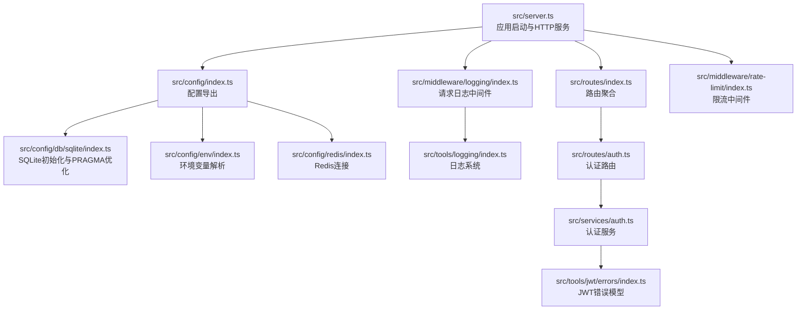
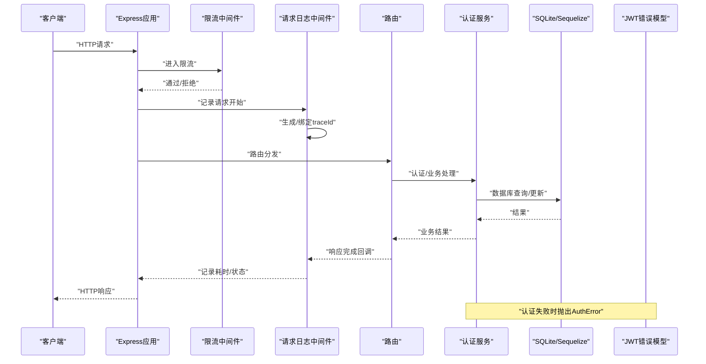
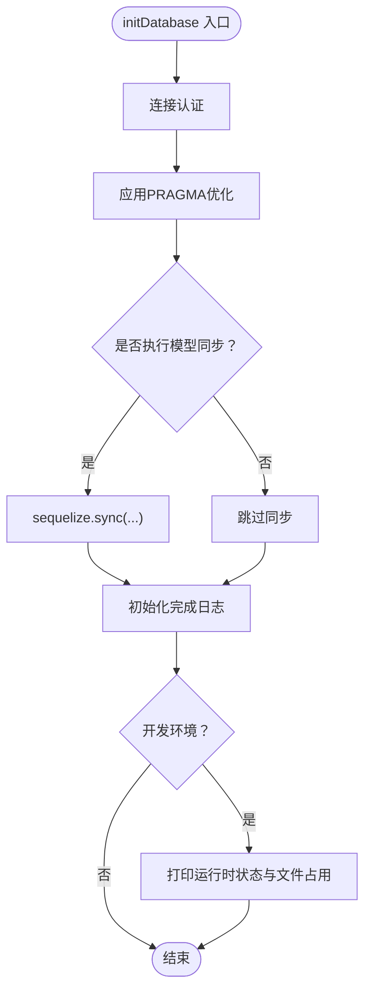
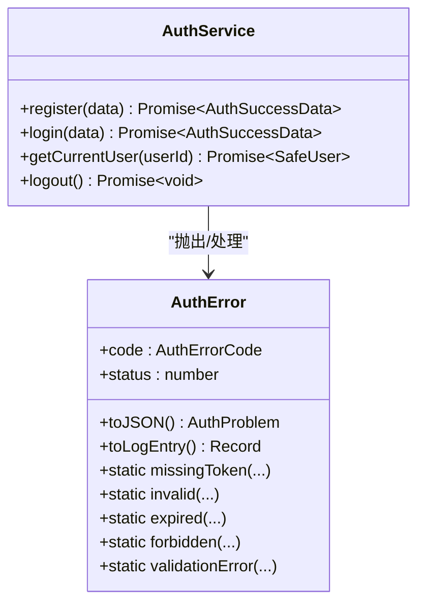
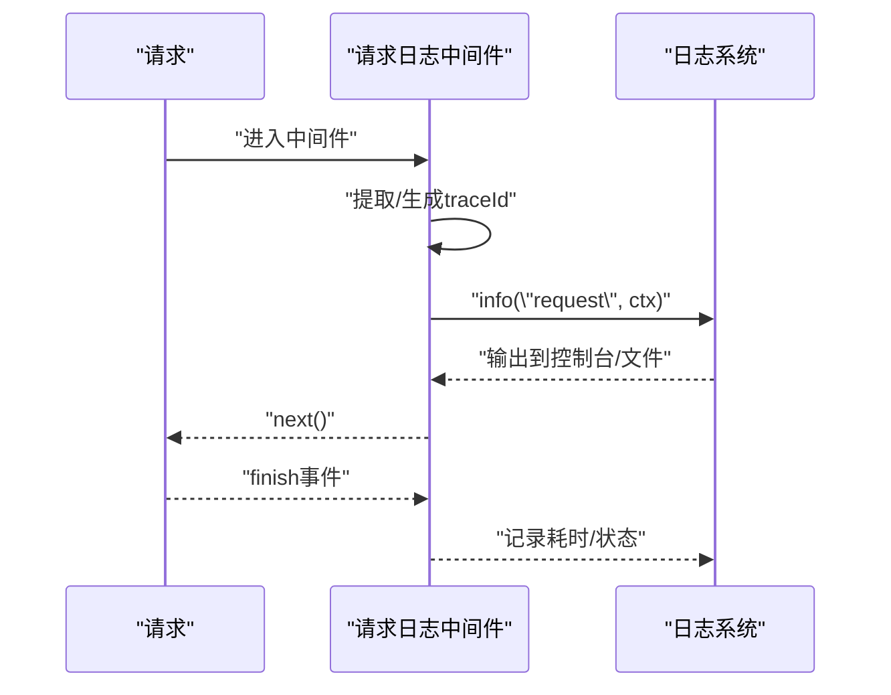
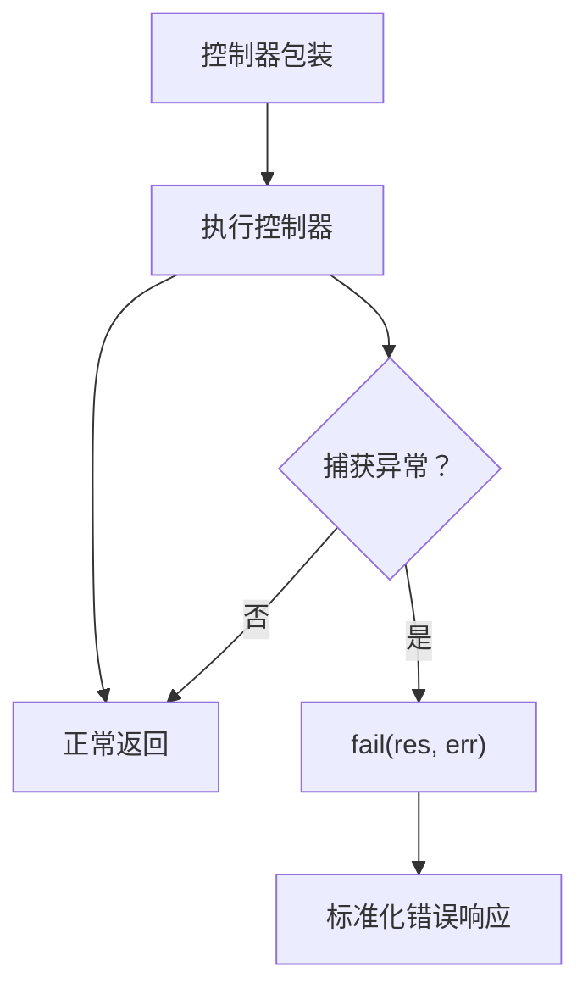
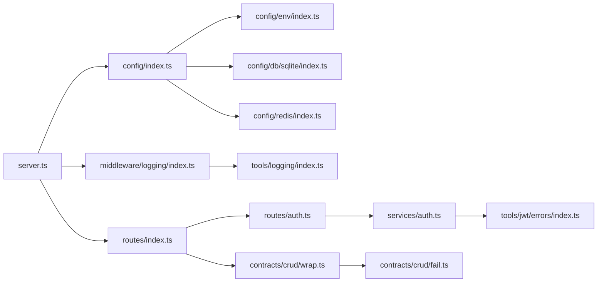

# 故障排除

<cite>
**本文引用的文件**
- [src/server.ts](file://src/server.ts)
- [src/config/index.ts](file://src/config/index.ts)
- [src/config/db/sqlite/index.ts](file://src/config/db/sqlite/index.ts)
- [src/config/env/index.ts](file://src/config/env/index.ts)
- [src/config/logging.ts](file://src/config/logging.ts)
- [src/middleware/logging/index.ts](file://src/middleware/logging/index.ts)
- [src/tools/logging/index.ts](file://src/tools/logging/index.ts)
- [src/services/auth.ts](file://src/services/auth.ts)
- [src/routes/auth.ts](file://src/routes/auth.ts)
- [src/routes/index.ts](file://src/routes/index.ts)
- [src/middleware/auth/guards.ts](file://src/middleware/auth/guards.ts)
- [src/middleware/rate-limit/index.ts](file://src/middleware/rate-limit/index.ts)
- [src/config/redis/index.ts](file://src/config/redis/index.ts)
- [src/contracts/crud/wrap.ts](file://src/contracts/crud/wrap.ts)
- [src/contracts/crud/fail.ts](file://src/contracts/crud/fail.ts)
- [src/tools/jwt/errors/index.ts](file://src/tools/jwt/errors/index.ts)
</cite>

## 目录
1. [简介](#简介)
2. [项目结构](#项目结构)
3. [核心组件](#核心组件)
4. [架构总览](#架构总览)
5. [详细组件分析](#详细组件分析)
6. [依赖关系分析](#依赖关系分析)
7. [性能考量](#性能考量)
8. [故障排除指南](#故障排除指南)
9. [结论](#结论)
10. [附录](#附录)

## 简介
本指南面向 IM-API 的运维与开发人员，提供系统化的故障排除流程、调试技巧、日志分析方法、性能识别与优化策略，以及针对网络、数据库、认证失败等常见问题的排查步骤。同时涵盖监控指标解读、异常告警处理、系统资源使用分析与优化，以及紧急情况下的恢复与应急响应流程。

## 项目结构
IM-API 采用分层架构：入口启动负责初始化数据库与中间件，路由层组织 API，服务层承载业务逻辑，工具层提供日志、JWT、限流等能力。关键启动与配置文件如下图所示：

**图表来源**
- [src/server.ts](file://src/server.ts#L1-L74)
- [src/config/index.ts](file://src/config/index.ts#L1-L30)
- [src/config/db/sqlite/index.ts](file://src/config/db/sqlite/index.ts#L1-L410)
- [src/config/env/index.ts](file://src/config/env/index.ts#L1-L223)
- [src/config/redis/index.ts](file://src/config/redis/index.ts#L1-L40)
- [src/middleware/logging/index.ts](file://src/middleware/logging/index.ts#L1-L64)
- [src/tools/logging/index.ts](file://src/tools/logging/index.ts#L1-L532)
- [src/routes/index.ts](file://src/routes/index.ts#L1-L22)
- [src/routes/auth.ts](file://src/routes/auth.ts#L1-L47)
- [src/services/auth.ts](file://src/services/auth.ts#L1-L170)
- [src/tools/jwt/errors/index.ts](file://src/tools/jwt/errors/index.ts#L1-L288)
- [src/middleware/rate-limit/index.ts](file://src/middleware/rate-limit/index.ts#L1-L70)

**章节来源**
- [src/server.ts](file://src/server.ts#L1-L74)
- [src/config/index.ts](file://src/config/index.ts#L1-L30)

## 核心组件
- 应用启动与HTTP服务：负责初始化数据库、加载中间件、挂载路由并启动服务。
- 数据库配置（SQLite）：提供连接、PRAGMA 性能优化、运行时统计与文件占用查询。
- 环境变量：集中解析与类型安全转换，支撑数据库、JWT、Redis、限流等配置。
- 日志系统：支持结构化输出、文件落盘、采样、脱敏、TraceId 绑定与请求耗时记录。
- 认证与权限：JWT 服务、认证服务、权限守卫与统一错误模型。
- 限流中间件：基于内存的固定窗口计数限流。
- Redis：可选连接与连通性检查。
- 统一错误处理：控制器包装与错误响应封装。

**章节来源**
- [src/config/db/sqlite/index.ts](file://src/config/db/sqlite/index.ts#L102-L129)
- [src/config/env/index.ts](file://src/config/env/index.ts#L162-L220)
- [src/middleware/logging/index.ts](file://src/middleware/logging/index.ts#L34-L63)
- [src/tools/logging/index.ts](file://src/tools/logging/index.ts#L440-L482)
- [src/services/auth.ts](file://src/services/auth.ts#L82-L170)
- [src/middleware/auth/guards.ts](file://src/middleware/auth/guards.ts#L17-L195)
- [src/middleware/rate-limit/index.ts](file://src/middleware/rate-limit/index.ts#L43-L70)
- [src/config/redis/index.ts](file://src/config/redis/index.ts#L5-L38)
- [src/contracts/crud/wrap.ts](file://src/contracts/crud/wrap.ts#L10-L18)
- [src/contracts/crud/fail.ts](file://src/contracts/crud/fail.ts#L35-L45)

## 架构总览
下图展示请求从进入应用到响应的关键流转，包括日志、限流、认证与数据库交互：

**图表来源**
- [src/server.ts](file://src/server.ts#L27-L48)
- [src/middleware/rate-limit/index.ts](file://src/middleware/rate-limit/index.ts#L43-L70)
- [src/middleware/logging/index.ts](file://src/middleware/logging/index.ts#L34-L63)
- [src/routes/index.ts](file://src/routes/index.ts#L12-L21)
- [src/routes/auth.ts](file://src/routes/auth.ts#L12-L46)
- [src/services/auth.ts](file://src/services/auth.ts#L86-L170)
- [src/config/db/sqlite/index.ts](file://src/config/db/sqlite/index.ts#L120-L128)
- [src/tools/jwt/errors/index.ts](file://src/tools/jwt/errors/index.ts#L75-L141)

## 详细组件分析

### 组件A：数据库（SQLite）与性能诊断
- 初始化流程：连接认证、应用 PRAGMA 优化、可选模型同步、开发环境运行时状态与文件占用打印。
- 运行时统计：缓存、页面、WAL、锁等待、内存使用等 PRAGMA 快照。
- 文件占用：主库与 WAL 文件大小统计与中文日志输出。
- WAL 未 checkpoint 估算：结合 wal_checkpoint 与 page_size 估算未合并页数与字节数。

**图表来源**
- [src/config/db/sqlite/index.ts](file://src/config/db/sqlite/index.ts#L368-L409)

**章节来源**
- [src/config/db/sqlite/index.ts](file://src/config/db/sqlite/index.ts#L102-L129)
- [src/config/db/sqlite/index.ts](file://src/config/db/sqlite/index.ts#L136-L154)
- [src/config/db/sqlite/index.ts](file://src/config/db/sqlite/index.ts#L162-L207)
- [src/config/db/sqlite/index.ts](file://src/config/db/sqlite/index.ts#L265-L285)
- [src/config/db/sqlite/index.ts](file://src/config/db/sqlite/index.ts#L292-L330)
- [src/config/db/sqlite/index.ts](file://src/config/db/sqlite/index.ts#L338-L360)

### 组件B：认证服务与JWT错误模型
- 认证服务：注册、登录、获取当前用户、登出（无状态 JWT）。
- JWT 服务：单例创建，签发 access/refresh 令牌。
- 错误模型：统一错误码、错误对象、序列化与日志化、类型守卫。

**图表来源**
- [src/services/auth.ts](file://src/services/auth.ts#L82-L170)
- [src/tools/jwt/errors/index.ts](file://src/tools/jwt/errors/index.ts#L75-L141)

**章节来源**
- [src/services/auth.ts](file://src/services/auth.ts#L86-L170)
- [src/tools/jwt/errors/index.ts](file://src/tools/jwt/errors/index.ts#L46-L63)
- [src/tools/jwt/errors/index.ts](file://src/tools/jwt/errors/index.ts#L149-L255)

### 组件C：请求日志与TraceId追踪
- 请求日志中间件：记录方法、URL、状态码、耗时、长度；写入响应头 traceId；基于 AsyncLocalStorage 绑定 TraceId。
- 日志系统：支持级别过滤、采样、脱敏、文件传输、Pretty 输出、全局根记录器与子记录器。

**图表来源**
- [src/middleware/logging/index.ts](file://src/middleware/logging/index.ts#L34-L63)
- [src/tools/logging/index.ts](file://src/tools/logging/index.ts#L440-L482)

**章节来源**
- [src/middleware/logging/index.ts](file://src/middleware/logging/index.ts#L17-L63)
- [src/tools/logging/index.ts](file://src/tools/logging/index.ts#L295-L438)

### 组件D：统一错误处理与控制器包装
- 控制器包装：捕获异步控制器异常并交由 fail 处理。
- 统一错误响应：根据错误类型映射 HTTP 状态码与 API 错误码，支持字段级验证错误。

**图表来源**
- [src/contracts/crud/wrap.ts](file://src/contracts/crud/wrap.ts#L10-L18)
- [src/contracts/crud/fail.ts](file://src/contracts/crud/fail.ts#L35-L45)

**章节来源**
- [src/contracts/crud/wrap.ts](file://src/contracts/crud/wrap.ts#L10-L18)
- [src/contracts/crud/fail.ts](file://src/contracts/crud/fail.ts#L35-L45)

## 依赖关系分析
- 启动入口依赖配置模块导出的数据库、Redis、环境变量等。
- 路由依赖认证守卫与控制器包装，控制器包装依赖统一错误处理。
- 认证服务依赖 JWT 工具与模型，JWT 工具依赖错误模型。
- 日志系统被请求日志中间件使用，同时支持文件传输与脱敏。

**图表来源**
- [src/server.ts](file://src/server.ts#L14-L20)
- [src/config/index.ts](file://src/config/index.ts#L7-L29)
- [src/config/env/index.ts](file://src/config/env/index.ts#L166-L220)
- [src/config/db/sqlite/index.ts](file://src/config/db/sqlite/index.ts#L106-L128)
- [src/config/redis/index.ts](file://src/config/redis/index.ts#L5-L38)
- [src/middleware/logging/index.ts](file://src/middleware/logging/index.ts#L12-L15)
- [src/tools/logging/index.ts](file://src/tools/logging/index.ts#L440-L482)
- [src/routes/index.ts](file://src/routes/index.ts#L7-L21)
- [src/routes/auth.ts](file://src/routes/auth.ts#L12-L46)
- [src/services/auth.ts](file://src/services/auth.ts#L13-L25)
- [src/tools/jwt/errors/index.ts](file://src/tools/jwt/errors/index.ts#L75-L141)
- [src/contracts/crud/wrap.ts](file://src/contracts/crud/wrap.ts#L10-L18)
- [src/contracts/crud/fail.ts](file://src/contracts/crud/fail.ts#L35-L45)

**章节来源**
- [src/server.ts](file://src/server.ts#L14-L20)
- [src/config/index.ts](file://src/config/index.ts#L7-L29)

## 性能考量
- 数据库性能
  - PRAGMA 优化：WAL、NORMAL 同步、内存临时存储、外键、缓存、mmap、自动检查点、锁等待超时、WAL 大小限制。
  - 连接池：最大/最小连接、空闲回收、获取等待。
  - 运行时统计与文件占用：定期检查缓存命中、WAL 未 checkpoint 估算、主/WAL 文件大小。
- 日志性能
  - 采样：生产环境对 trace/debug 采样率降低，info 保持直通。
  - 脱敏：避免敏感字段落入文件日志。
  - Pretty 输出：开发环境开启，生产关闭。
- 网络与限流
  - 固定窗口限流：基于客户端 IP，窗口与阈值可配置。
- 认证与令牌
  - 无状态 JWT：无需服务端存储，注意令牌撤销场景（可扩展 Redis 黑名单）。

[本节为通用指导，无需特定文件来源]

## 故障排除指南

### 一、启动与健康检查
- 现象：应用无法启动或启动后立即退出。
- 排查步骤
  - 查看启动日志与错误堆栈，确认数据库连接是否成功。
  - 检查环境变量是否正确加载（端口、数据库路径、JWT 密钥等）。
  - 确认 /health 健康端点是否可用。
- 相关文件
  - [src/server.ts](file://src/server.ts#L55-L73)
  - [src/config/env/index.ts](file://src/config/env/index.ts#L166-L220)

**章节来源**
- [src/server.ts](file://src/server.ts#L55-L73)
- [src/config/env/index.ts](file://src/config/env/index.ts#L166-L220)

### 二、网络问题
- 现象：请求超时、429 Too Many Requests、跨域失败。
- 排查步骤
  - 限流中间件：确认窗口与阈值配置，观察是否触发限流。
  - CORS：确认中间件已启用且配置正确。
  - 请求头：确保 traceId 或 request-id 正确传递以便日志关联。
- 相关文件
  - [src/middleware/rate-limit/index.ts](file://src/middleware/rate-limit/index.ts#L43-L70)
  - [src/middleware/logging/index.ts](file://src/middleware/logging/index.ts#L34-L63)
  - [src/config/index.ts](file://src/config/index.ts#L10-L10)

**章节来源**
- [src/middleware/rate-limit/index.ts](file://src/middleware/rate-limit/index.ts#L43-L70)
- [src/middleware/logging/index.ts](file://src/middleware/logging/index.ts#L34-L63)
- [src/config/index.ts](file://src/config/index.ts#L10-L10)

### 三、数据库连接与性能问题
- 现象：启动卡住、查询缓慢、WAL 过大、锁等待超时。
- 排查步骤
  - 初始化日志：确认 PRAGMA 应用与连接认证成功。
  - 运行时统计：查看缓存、页面、WAL、锁等待、内存使用。
  - 文件占用：确认主库与 WAL 文件大小，必要时清理或调整 WAL 限制。
  - 连接池：核对最大/最小连接、空闲回收与获取等待时间。
- 相关文件
  - [src/config/db/sqlite/index.ts](file://src/config/db/sqlite/index.ts#L368-L409)
  - [src/config/db/sqlite/index.ts](file://src/config/db/sqlite/index.ts#L162-L207)
  - [src/config/db/sqlite/index.ts](file://src/config/db/sqlite/index.ts#L292-L330)
  - [src/config/db/sqlite/index.ts](file://src/config/db/sqlite/index.ts#L106-L114)

**章节来源**
- [src/config/db/sqlite/index.ts](file://src/config/db/sqlite/index.ts#L368-L409)
- [src/config/db/sqlite/index.ts](file://src/config/db/sqlite/index.ts#L162-L207)
- [src/config/db/sqlite/index.ts](file://src/config/db/sqlite/index.ts#L292-L330)
- [src/config/db/sqlite/index.ts](file://src/config/db/sqlite/index.ts#L106-L114)

### 四、认证失败与权限问题
- 现象：401/403、令牌过期/无效、设备不匹配、字段验证失败。
- 排查步骤
  - 检查 JWT 错误码与状态码映射，定位具体原因。
  - 核对令牌类型（access/refresh）、角色/作用域/团队/VIP 等守卫配置。
  - 在控制器包装与 fail 中查看标准化错误响应。
- 相关文件
  - [src/tools/jwt/errors/index.ts](file://src/tools/jwt/errors/index.ts#L46-L63)
  - [src/middleware/auth/guards.ts](file://src/middleware/auth/guards.ts#L25-L51)
  - [src/contracts/crud/wrap.ts](file://src/contracts/crud/wrap.ts#L10-L18)
  - [src/contracts/crud/fail.ts](file://src/contracts/crud/fail.ts#L35-L45)

**章节来源**
- [src/tools/jwt/errors/index.ts](file://src/tools/jwt/errors/index.ts#L46-L63)
- [src/middleware/auth/guards.ts](file://src/middleware/auth/guards.ts#L25-L51)
- [src/contracts/crud/wrap.ts](file://src/contracts/crud/wrap.ts#L10-L18)
- [src/contracts/crud/fail.ts](file://src/contracts/crud/fail.ts#L35-L45)

### 五、日志分析与调试技巧
- 现象：难以定位问题、日志噪声大、敏感信息泄露风险。
- 排查步骤
  - 使用 traceId 关联请求生命周期日志。
  - 调整日志级别与采样率，生产环境降低 trace/debug 采样。
  - 启用文件日志与脱敏，避免敏感字段落盘。
  - 使用 Pretty 输出辅助开发调试。
- 相关文件
  - [src/middleware/logging/index.ts](file://src/middleware/logging/index.ts#L34-L63)
  - [src/tools/logging/index.ts](file://src/tools/logging/index.ts#L440-L482)
  - [src/config/logging.ts](file://src/config/logging.ts#L105-L151)

**章节来源**
- [src/middleware/logging/index.ts](file://src/middleware/logging/index.ts#L34-L63)
- [src/tools/logging/index.ts](file://src/tools/logging/index.ts#L440-L482)
- [src/config/logging.ts](file://src/config/logging.ts#L105-L151)

### 六、Redis 连接问题（可选）
- 现象：Redis ping 失败、连接超时、错误事件日志。
- 排查步骤
  - 检查 REDIS_ENABLED 与主机/端口/密码/DB 配置。
  - 使用 initRedisAsync 检测连通性。
  - 观察 error 事件日志中的错误消息。
- 相关文件
  - [src/config/redis/index.ts](file://src/config/redis/index.ts#L5-L38)

**章节来源**
- [src/config/redis/index.ts](file://src/config/redis/index.ts#L5-L38)

### 七、监控指标与异常告警
- 指标建议
  - QPS、P95/P99 延迟、错误率（4xx/5xx）、数据库 PRAGMA 统计（缓存命中、WAL 未 checkpoint）、文件占用（主库/WAL）。
  - Redis 连接状态与 ping 延迟。
- 告警策略
  - QPS 突增或突降、延迟超过阈值、错误率上升、WAL 未 checkpoint 增长过快、数据库文件占用接近上限、Redis 连接失败。
- 处理流程
  - 快速定位 traceId，结合日志与数据库统计进行根因分析，必要时回滚/重启服务。

[本节为通用指导，无需特定文件来源]

### 八、系统资源使用分析与优化
- CPU/内存
  - 通过系统监控工具观察进程资源使用，结合日志耗时定位热点路径。
- I/O
  - 关注 SQLite 页面大小、缓存、mmap 与 WAL 策略；适当增大缓存与 mmap，合理设置 wal_autocheckpoint。
- 网络
  - 限流参数调优，避免突发流量导致 429；CORS 配置避免跨域失败。

[本节为通用指导，无需特定文件来源]

### 九、紧急恢复与应急响应流程
- 流程
  - 识别故障类型（网络/数据库/认证），快速隔离（限流、熔断、降级）。
  - 基于 traceId 快速定位请求链路，查看日志与数据库统计。
  - 采取措施：重启服务、调整 PRAGMA、扩容连接池、修复配置、回滚变更。
  - 告警通知与复盘，完善预案与演练。
- 工具
  - /health 健康检查、日志检索、数据库运行时统计、Redis 连通性检测。

[本节为通用指导，无需特定文件来源]

## 结论
通过规范的启动流程、完善的日志体系、严格的认证与权限控制、合理的数据库与网络配置，IM-API 能够在生产环境中稳定运行。遇到问题时，建议遵循“先定位 traceId、再核对配置与指标、最后实施修复”的流程，结合本指南提供的工具与策略，快速恢复服务并持续优化系统性能与可靠性。

## 附录
- 常用命令与端点
  - /health：健康检查
  - /api/auth/register：注册
  - /api/auth/login：登录
  - /api/auth/me：获取当前用户
  - /api/admin/users：受保护的管理员用户路由
- 关键环境变量
  - NODE_ENV、PORT、DB_*、JWT_SECRET、PIN_SECRET、REDIS_*、RATE_LIMIT_* 等

[本节为通用信息，无需特定文件来源]