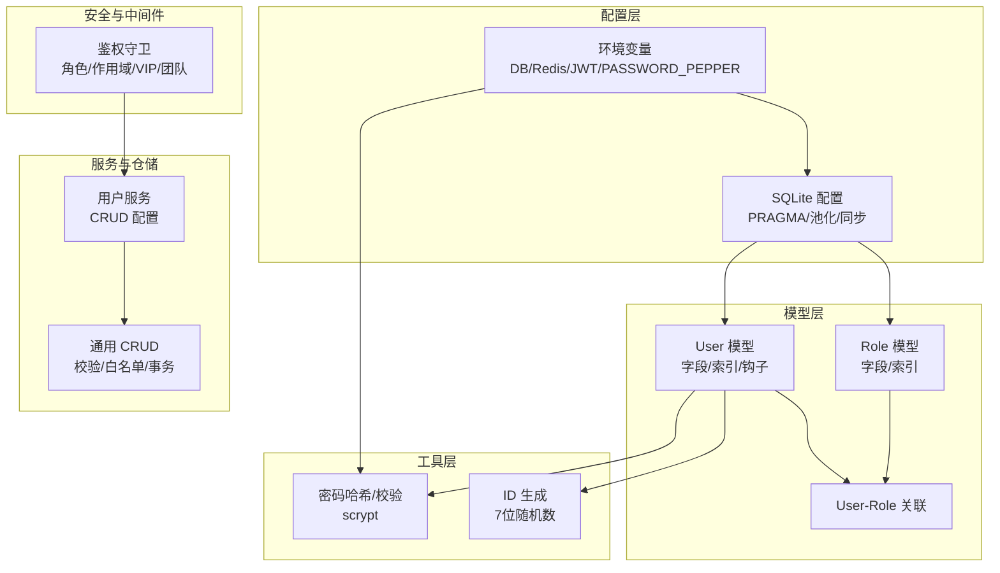
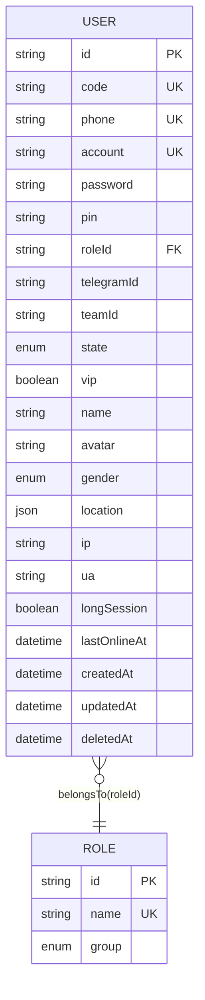
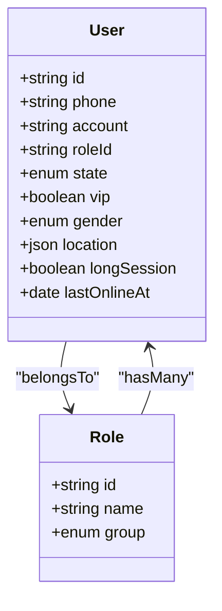
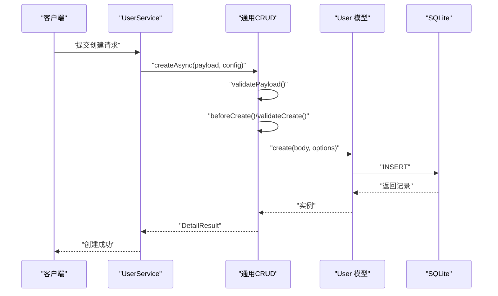
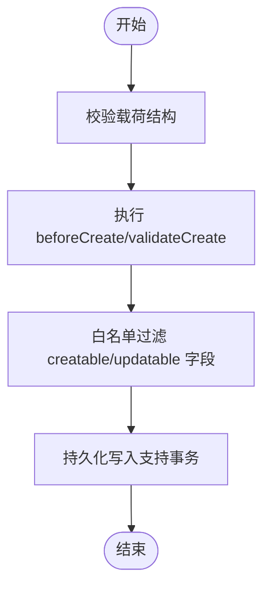
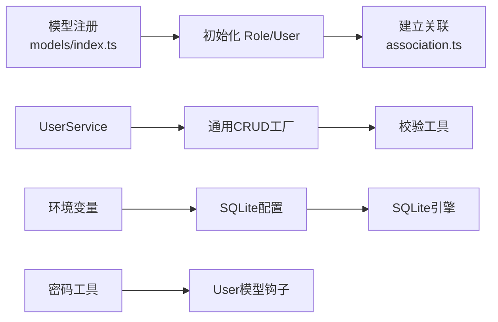

# 数据模型设计

<cite>
**本文引用的文件**
- [src/models/user/user.ts](file://src/models/user/user.ts)
- [src/models/user/types/user.ts](file://src/models/user/types/user.ts)
- [src/models/user/association.ts](file://src/models/user/association.ts)
- [src/models/role/index.ts](file://src/models/role/index.ts)
- [src/models/role/types/index.ts](file://src/models/role/types/index.ts)
- [src/models/index.ts](file://src/models/index.ts)
- [src/config/db/sqlite/index.ts](file://src/config/db/sqlite/index.ts)
- [src/config/env/index.ts](file://src/config/env/index.ts)
- [src/utils/common/gen/id.ts](file://src/utils/common/gen/id.ts)
- [src/tools/crypto/password.ts](file://src/tools/crypto/password.ts)
- [src/services/user.ts](file://src/services/user.ts)
- [src/repo/base/crud/create.ts](file://src/repo/base/crud/create.ts)
- [src/repo/base/validation/function/validators.ts](file://src/repo/base/validation/function/validators.ts)
- [src/config/seed/role.json](file://src/config/seed/role.json)
- [src/middleware/auth/guards.ts](file://src/middleware/auth/guards.ts)
</cite>

## 目录
1. [简介](#简介)
2. [项目结构](#项目结构)
3. [核心组件](#核心组件)
4. [架构总览](#架构总览)
5. [详细组件分析](#详细组件分析)
6. [依赖分析](#依赖分析)
7. [性能考虑](#性能考虑)
8. [故障排查指南](#故障排查指南)
9. [结论](#结论)
10. [附录](#附录)

## 简介
本文件面向 IM-API 的数据模型设计，聚焦“用户”与“角色”两大核心实体，系统性阐述其字段定义、数据类型、主外键关系、索引与约束、验证与业务规则、数据库模式、示例数据、数据访问模式、缓存策略与性能考量、数据生命周期与归档、迁移与版本管理、以及数据安全与访问控制。同时，结合项目中 Sequelize ORM 的配置与使用模式，提供可落地的工程实践指导。

## 项目结构
围绕数据模型的核心目录与文件如下：
- 模型层：用户模型、角色模型及其类型定义与关联
- 配置层：数据库（SQLite）与环境变量配置
- 工具层：密码哈希与校验、ID 生成
- 服务与仓储：用户服务、通用 CRUD 与校验工具
- 安全与中间件：鉴权守卫与权限控制

图表来源
- [src/models/user/user.ts](file://src/models/user/user.ts#L109-L266)
- [src/models/role/index.ts](file://src/models/role/index.ts#L41-L76)
- [src/models/user/association.ts](file://src/models/user/association.ts#L9-L23)
- [src/config/db/sqlite/index.ts](file://src/config/db/sqlite/index.ts#L120-L128)
- [src/config/env/index.ts](file://src/config/env/index.ts#L166-L220)
- [src/utils/common/gen/id.ts](file://src/utils/common/gen/id.ts#L3-L5)
- [src/tools/crypto/password.ts](file://src/tools/crypto/password.ts#L39-L46)
- [src/services/user.ts](file://src/services/user.ts#L30-L38)
- [src/repo/base/crud/create.ts](file://src/repo/base/crud/create.ts#L36-L80)
- [src/middleware/auth/guards.ts](file://src/middleware/auth/guards.ts#L25-L50)

章节来源
- [src/models/index.ts](file://src/models/index.ts#L26-L57)
- [src/config/db/sqlite/index.ts](file://src/config/db/sqlite/index.ts#L120-L128)
- [src/config/env/index.ts](file://src/config/env/index.ts#L166-L220)

## 核心组件
- 用户模型（User）
  - 主键：字符串，长度 7，唯一，自动生成
  - 唯一约束：phone、account、code
  - 枚举字段：state（active/deleted）、gender（male/female/unknown）
  - JSON 字段：location（国家/省份/城市）
  - 外键：roleId（指向 Role.id）
  - 索引：createdAt-id 组合索引、roleId、state、lastOnlineAt、phone
  - 钩子：保存前对 password 进行 scrypt 哈希
  - 敏感字段：password、pin，序列化时默认脱敏
- 角色模型（Role）
  - 主键：字符串，长度 36
  - 唯一约束：name
  - 枚举字段：group（system/project/user/admin）
  - 索引：group
- 关联关系
  - User.belongsTo(Role, { foreignKey: roleId })
  - Role.hasMany(User, { foreignKey: roleId })

章节来源
- [src/models/user/user.ts](file://src/models/user/user.ts#L110-L254)
- [src/models/user/types/user.ts](file://src/models/user/types/user.ts#L38-L87)
- [src/models/role/index.ts](file://src/models/role/index.ts#L42-L72)
- [src/models/role/types/index.ts](file://src/models/role/types/index.ts#L35-L45)
- [src/models/user/association.ts](file://src/models/user/association.ts#L9-L23)

## 架构总览
下图展示用户与角色模型在数据库中的实体关系、字段与约束，以及与配置层的交互。

图表来源
- [src/models/user/user.ts](file://src/models/user/user.ts#L110-L254)
- [src/models/role/index.ts](file://src/models/role/index.ts#L42-L72)

## 详细组件分析

### 用户模型（User）
- 字段与数据类型
  - id：STRING(7)，主键，自动生成
  - code：STRING(64)，唯一
  - phone：STRING(20)，唯一，正则校验仅数字
  - account：STRING(50)，唯一，默认生成用户名
  - password/pin：STRING(200)，存储 scrypt 哈希
  - roleId：STRING(36)，默认 "user"
  - telegramId/teamId：STRING(64)/STRING(36)，可空
  - state：ENUM(active/deleted)，默认 active
  - vip：BOOLEAN，默认 false
  - name/avatar：STRING(20)/STRING(255)，可空
  - gender：ENUM(male/female/unknown)，默认 unknown
  - location：JSON，默认包含国家/省份/城市
  - ip/ua：STRING(255)，可空
  - longSession：BOOLEAN，默认 false
  - lastOnlineAt：DATE，可空
  - timestamps：createdAt/updatedAt
  - paranoid：deletedAt
- 约束与索引
  - 唯一：phone、account、code
  - 索引：createdAt-id-desc、roleId、state、lastOnlineAt、phone
- 验证与业务规则
  - phone 正则仅数字
  - 密码/二级密码使用 scrypt 哈希，保存前钩子自动处理
  - 序列化时排除 password
  - 认证流程：按 phone 查找含密文的用户，校验密码，必要时更新哈希
- 示例数据
  - 可参考种子文件中的角色数据，用户数据可在初始化后插入

章节来源
- [src/models/user/user.ts](file://src/models/user/user.ts#L110-L254)
- [src/models/user/types/user.ts](file://src/models/user/types/user.ts#L38-L87)
- [src/utils/common/gen/id.ts](file://src/utils/common/gen/id.ts#L3-L5)
- [src/tools/crypto/password.ts](file://src/tools/crypto/password.ts#L39-L46)
- [src/config/seed/role.json](file://src/config/seed/role.json#L1-L28)

### 角色模型（Role）
- 字段与数据类型
  - id：STRING(36)，主键
  - name：STRING(30)，唯一
  - group：ENUM(system/project/user/admin)，默认 user
- 约束与索引
  - 唯一：name
  - 索引：group
- 示例数据
  - 种子文件包含多个内置角色，如 user、minister、teamleader 等

章节来源
- [src/models/role/index.ts](file://src/models/role/index.ts#L42-L72)
- [src/models/role/types/index.ts](file://src/models/role/types/index.ts#L35-L45)
- [src/config/seed/role.json](file://src/config/seed/role.json#L1-L28)

### 关联关系与外键
- User.roleId -> Role.id
- 级联策略：更新 CASCADE，删除 RESTRICT（防止误删角色导致用户孤儿）

图表来源
- [src/models/user/association.ts](file://src/models/user/association.ts#L9-L23)
- [src/models/user/user.ts](file://src/models/user/user.ts#L33-L101)
- [src/models/role/index.ts](file://src/models/role/index.ts#L27-L33)

章节来源
- [src/models/user/association.ts](file://src/models/user/association.ts#L9-L23)

### 数据访问模式与通用 CRUD
- 用户服务采用通用 CRUD 配置，限定可列出/详情/创建/更新字段集合
- 通用创建流程：载荷校验 -> 业务钩子 -> 前置处理 -> 白名单过滤 -> 持久化（支持事务）
- 查询校验：页码、每页条数、搜索、过滤、排序的格式与范围校验

图表来源
- [src/services/user.ts](file://src/services/user.ts#L30-L38)
- [src/repo/base/crud/create.ts](file://src/repo/base/crud/create.ts#L36-L80)
- [src/repo/base/validation/function/validators.ts](file://src/repo/base/validation/function/validators.ts#L57-L76)

章节来源
- [src/services/user.ts](file://src/services/user.ts#L30-L38)
- [src/repo/base/crud/create.ts](file://src/repo/base/crud/create.ts#L36-L80)
- [src/repo/base/validation/function/validators.ts](file://src/repo/base/validation/function/validators.ts#L57-L76)

### 数据验证与业务规则
- 字段白名单与必填校验：创建/更新时仅接受配置允许字段，必要字段缺失抛出业务异常
- 查询参数校验：page、limit、search、filters、order 的格式与取值范围
- 密码安全：scrypt 哈希，支持升级（成本参数与 pepper），保存前钩子自动处理
- 认证流程：按 phone 查找用户，校验密码，必要时更新哈希，返回安全视图

图表来源
- [src/repo/base/validation/function/validators.ts](file://src/repo/base/validation/function/validators.ts#L57-L76)
- [src/repo/base/crud/create.ts](file://src/repo/base/crud/create.ts#L36-L80)
- [src/models/user/user.ts](file://src/models/user/user.ts#L256-L263)
- [src/tools/crypto/password.ts](file://src/tools/crypto/password.ts#L39-L46)

章节来源
- [src/repo/base/validation/function/validators.ts](file://src/repo/base/validation/function/validators.ts#L57-L76)
- [src/repo/base/crud/create.ts](file://src/repo/base/crud/create.ts#L36-L80)
- [src/models/user/user.ts](file://src/models/user/user.ts#L256-L263)
- [src/tools/crypto/password.ts](file://src/tools/crypto/password.ts#L39-L46)

### 数据库模式图与示例数据
- 用户表（user）
  - 主键：id（7位字符串）
  - 唯一：phone、account、code
  - 索引：createdAt-id-desc、roleId、state、lastOnlineAt、phone
  - JSON：location（country/province/city）
- 角色表（role）
  - 主键：id（36位字符串）
  - 唯一：name
  - 索引：group
- 示例角色数据（来自种子文件）
  - 包含内置角色：minister、teamleader、teammember、maintain、user

章节来源
- [src/models/user/user.ts](file://src/models/user/user.ts#L110-L254)
- [src/models/role/index.ts](file://src/models/role/index.ts#L42-L72)
- [src/config/seed/role.json](file://src/config/seed/role.json#L1-L28)

### 缓存策略与性能考虑
- SQLite 优化配置（PRAGMA）
  - WAL 模式、NORMAL 同步、MEMORY 临时存储、外键开启、缓存与 mmap 调优、自动检查点与锁超时
- 连接池
  - 最大连接数、最小连接数、空闲回收与获取超时
- 索引与查询
  - createdAt-id-desc 组合索引、roleId/state/lastOnlineAt/phone 索引，有利于分页、过滤与排序
- 密码哈希
  - 使用 scrypt，成本参数与 pepper 可升级，避免明文存储
- Redis（可选）
  - 环境变量开关与连接参数，可用于会话/令牌缓存（需在业务层集成）

章节来源
- [src/config/db/sqlite/index.ts](file://src/config/db/sqlite/index.ts#L136-L154)
- [src/config/db/sqlite/index.ts](file://src/config/db/sqlite/index.ts#L106-L114)
- [src/config/db/sqlite/index.ts](file://src/config/db/sqlite/index.ts#L196-L207)
- [src/config/env/index.ts](file://src/config/env/index.ts#L215-L219)

### 数据生命周期、保留策略与归档
- 逻辑删除
  - 使用 paranoid 模式（deletedAt），软删除用户
- 索引与查询
  - createdAt-id-desc 索引支持高效分页与倒序扫描
- 归档建议
  - 对历史数据可按 state/lastOnlineAt 进行冷热分离与定期归档（需在业务层实现）
- 清理策略
  - 建议结合业务规则定期清理长期未登录或失效账户（需在定时任务中实现）

章节来源
- [src/models/user/user.ts](file://src/models/user/user.ts#L232-L254)

### 数据迁移路径与版本管理
- 开发/自动化部署
  - 可使用 sequelize.sync 进行结构同步（谨慎使用，建议配合 alter）
- 生产环境
  - 建议使用数据库迁移（migration）进行结构变更，避免风险
- 同步补丁
  - 提供同步前后补丁机制（applyBeforeSyncPatches/applyAfterSyncPatches）

章节来源
- [src/config/db/sqlite/index.ts](file://src/config/db/sqlite/index.ts#L377-L383)
- [src/models/index.ts](file://src/models/index.ts#L140-L142)

### 数据安全、隐私与访问控制
- 密码安全
  - scrypt 哈希，保存前钩子自动处理；支持升级（成本参数与 pepper）
- 敏感字段
  - 序列化时自动排除 password；PIN 与密码同等重要，需妥善保护
- 访问控制
  - 基于 JWT 的角色/作用域/VIP/团队/TokenKind 的多维守卫中间件
  - 守卫在中间件层对请求上下文进行断言，拒绝无权限访问

章节来源
- [src/tools/crypto/password.ts](file://src/tools/crypto/password.ts#L39-L46)
- [src/models/user/user.ts](file://src/models/user/user.ts#L96-L100)
- [src/middleware/auth/guards.ts](file://src/middleware/auth/guards.ts#L25-L50)
- [src/middleware/auth/guards.ts](file://src/middleware/auth/guards.ts#L168-L194)

## 依赖分析
- 模型初始化顺序
  - 先初始化 Role 与 User，再建立关联
- 关联建立
  - User.belongsTo(Role) 与 Role.hasMany(User)，外键为 roleId
- 服务与仓储
  - UserService 基于通用 CRUD 工厂，使用字段白名单与校验工具
- 配置与工具
  - SQLite PRAGMA 与连接池配置；环境变量驱动数据库与安全参数；密码工具负责哈希与校验

图表来源
- [src/models/index.ts](file://src/models/index.ts#L42-L57)
- [src/models/user/association.ts](file://src/models/user/association.ts#L9-L23)
- [src/services/user.ts](file://src/services/user.ts#L30-L38)
- [src/repo/base/crud/create.ts](file://src/repo/base/crud/create.ts#L36-L80)
- [src/repo/base/validation/function/validators.ts](file://src/repo/base/validation/function/validators.ts#L57-L76)
- [src/config/db/sqlite/index.ts](file://src/config/db/sqlite/index.ts#L120-L128)
- [src/config/env/index.ts](file://src/config/env/index.ts#L166-L220)
- [src/tools/crypto/password.ts](file://src/tools/crypto/password.ts#L39-L46)

章节来源
- [src/models/index.ts](file://src/models/index.ts#L42-L57)
- [src/models/user/association.ts](file://src/models/user/association.ts#L9-L23)
- [src/services/user.ts](file://src/services/user.ts#L30-L38)
- [src/repo/base/crud/create.ts](file://src/repo/base/crud/create.ts#L36-L80)
- [src/repo/base/validation/function/validators.ts](file://src/repo/base/validation/function/validators.ts#L57-L76)
- [src/config/db/sqlite/index.ts](file://src/config/db/sqlite/index.ts#L120-L128)
- [src/config/env/index.ts](file://src/config/env/index.ts#L166-L220)
- [src/tools/crypto/password.ts](file://src/tools/crypto/password.ts#L39-L46)

## 性能考虑
- SQLite 调优
  - WAL 模式提升并发读写；NORMAL 同步在安全与性能间平衡；mmap 与 cache_size 优化 I/O
  - busy_timeout 降低锁冲突影响；wal_autocheckpoint 控制 WAL 膨胀
- 连接池
  - 合理设置 max/min/idle/acquire，避免资源争用
- 查询优化
  - 利用 createdAt-id-desc、roleId、state、lastOnlineAt、phone 索引，避免全表扫描
- 密码哈希
  - scrypt 成本参数与 pepper 可随硬件能力升级，保障长期安全

章节来源
- [src/config/db/sqlite/index.ts](file://src/config/db/sqlite/index.ts#L136-L154)
- [src/config/db/sqlite/index.ts](file://src/config/db/sqlite/index.ts#L106-L114)
- [src/models/user/user.ts](file://src/models/user/user.ts#L238-L251)
- [src/tools/crypto/password.ts](file://src/tools/crypto/password.ts#L14-L15)

## 故障排查指南
- 数据库连接与 PRAGMA
  - 检查 SQLite 连接与 PRAGMA 设置是否生效；必要时在开发环境输出运行时状态与文件占用
- 密码哈希问题
  - 确认 PASSWORD_PEPPER 环境变量有效；校验升级逻辑是否触发
- 查询异常
  - 校验查询参数（page/limit/search/filters/order）是否符合规范
- 外键与关联
  - 确保 Role 记录先于 User 插入；删除角色时遵循 RESTRICT 策略

章节来源
- [src/config/db/sqlite/index.ts](file://src/config/db/sqlite/index.ts#L265-L285)
- [src/config/db/sqlite/index.ts](file://src/config/db/sqlite/index.ts#L292-L330)
- [src/config/env/index.ts](file://src/config/env/index.ts#L175-L175)
- [src/repo/base/validation/function/validators.ts](file://src/repo/base/validation/function/validators.ts#L57-L76)
- [src/models/user/association.ts](file://src/models/user/association.ts#L13-L14)

## 结论
本设计以用户与角色为核心，通过明确的字段定义、索引与约束、密码安全与访问控制，构建了清晰、可扩展、高性能的数据模型。结合 SQLite 优化配置、通用 CRUD 与校验工具、以及基于 JWT 的多维守卫，满足 IM-API 的业务需求。建议在生产环境采用数据库迁移替代同步，完善归档与清理策略，并持续评估与升级密码哈希参数。

## 附录
- 示例角色数据（节选）
  - minister、teamleader、teammember、maintain、user
- 环境变量要点
  - DB_STORAGE、PASSWORD_PEPPER、JWT_SECRET、PIN_SECRET、REDIS_* 等

章节来源
- [src/config/seed/role.json](file://src/config/seed/role.json#L1-L28)
- [src/config/env/index.ts](file://src/config/env/index.ts#L171-L175)
- [src/config/env/index.ts](file://src/config/env/index.ts#L215-L219)