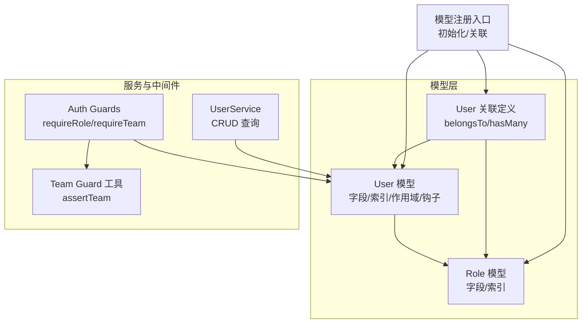
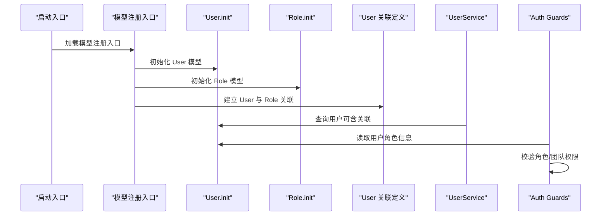
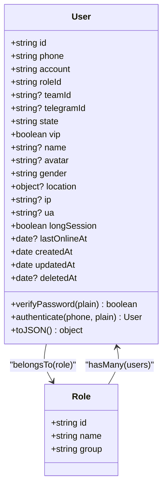
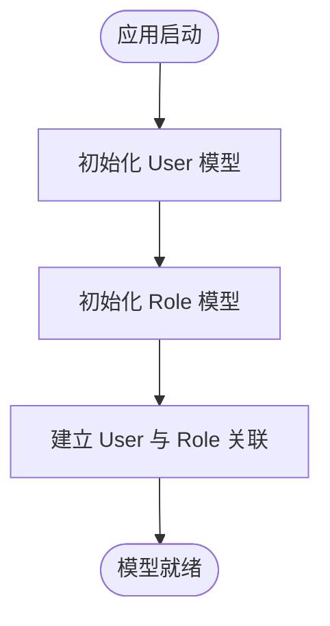
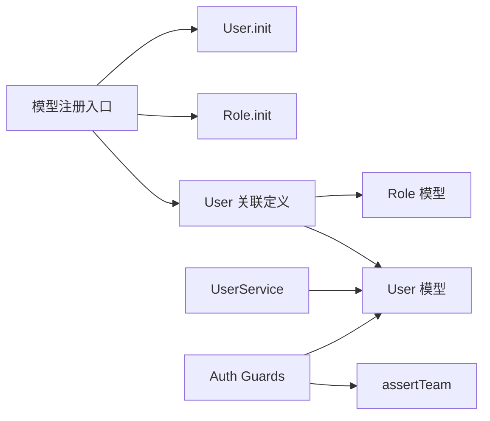

# 模型关联关系

<cite>
**本文引用的文件**
- [src/models/index.ts](file://src/models/index.ts)
- [src/models/user/user.ts](file://src/models/user/user.ts)
- [src/models/user/association.ts](file://src/models/user/association.ts)
- [src/models/role/index.ts](file://src/models/role/index.ts)
- [src/models/user/types/user.ts](file://src/models/user/types/user.ts)
- [src/models/user/hook.ts](file://src/models/user/hook.ts)
- [src/services/user.ts](file://src/services/user.ts)
- [src/middleware/auth/guards.ts](file://src/middleware/auth/guards.ts)
- [src/tools/jwt/guards/team.ts](file://src/tools/jwt/guards/team.ts)
</cite>

## 目录
1. [简介](#简介)
2. [项目结构](#项目结构)
3. [核心组件](#核心组件)
4. [架构总览](#架构总览)
5. [详细组件分析](#详细组件分析)
6. [依赖分析](#依赖分析)
7. [性能考虑](#性能考虑)
8. [故障排查指南](#故障排查指南)
9. [结论](#结论)
10. [附录](#附录)

## 简介
本文件聚焦 IM-API 的模型关联关系设计与实现，围绕用户模型与角色模型之间的关联展开，同时结合用户模型中的团队字段说明其在权限与数据隔离中的作用。文档覆盖一对一、一对多关系的建模与配置，外键约束、关联查询与级联行为，初始化顺序与依赖关系，以及通过关联关系实现权限验证与数据隔离的最佳实践与性能优化策略。

## 项目结构
模型与关联关系主要分布在以下模块：
- 模型注册与初始化入口：负责按序初始化模型并建立关联
- 用户模型：定义用户字段、索引、默认/带密钥作用域、钩子等
- 角色模型：定义角色字段与索引
- 关联定义：用户与角色之间的一对多关系
- 类型定义：用户与角色的属性与字段常量
- 服务与中间件：通过关联进行查询与权限校验

图表来源
- [src/models/index.ts](file://src/models/index.ts#L37-L57)
- [src/models/user/user.ts](file://src/models/user/user.ts#L109-L266)
- [src/models/role/index.ts](file://src/models/role/index.ts#L41-L76)
- [src/models/user/association.ts](file://src/models/user/association.ts#L9-L23)
- [src/services/user.ts](file://src/services/user.ts#L40-L57)
- [src/middleware/auth/guards.ts](file://src/middleware/auth/guards.ts#L25-L158)
- [src/tools/jwt/guards/team.ts](file://src/tools/jwt/guards/team.ts#L24-L29)

章节来源
- [src/models/index.ts](file://src/models/index.ts#L37-L57)
- [src/models/user/user.ts](file://src/models/user/user.ts#L109-L266)
- [src/models/role/index.ts](file://src/models/role/index.ts#L41-L76)
- [src/models/user/association.ts](file://src/models/user/association.ts#L9-L23)

## 核心组件
- 用户模型 User
  - 字段：主键、邀请码、手机号、账号、密码、二级密码、角色ID、Telegram ID、团队ID、状态、VIP、昵称、头像、性别、位置、IP/UA、长期会话、最后在线时间、时间戳等
  - 索引：按创建时间与ID降序复合索引、角色ID、状态、最后在线时间、手机号等
  - 作用域：默认排除密码；带密钥作用域包含密码
  - 钩子：保存前对密码进行哈希处理
- 角色模型 Role
  - 字段：主键、名称（唯一）、分组（枚举）
  - 索引：按分组建立索引
- 关联关系
  - User.belongsTo(Role)：用户属于角色（一对一）
  - Role.hasMany(User)：角色拥有多个用户（一对多）

章节来源
- [src/models/user/user.ts](file://src/models/user/user.ts#L33-L101)
- [src/models/user/user.ts](file://src/models/user/user.ts#L109-L266)
- [src/models/role/index.ts](file://src/models/role/index.ts#L27-L76)
- [src/models/user/association.ts](file://src/models/user/association.ts#L9-L23)

## 架构总览
模型初始化与关联建立遵循严格的顺序：先初始化所有模型，再建立关联。User 与 Role 之间形成“用户-角色”的一对多关系，配合服务层与中间件实现权限控制与数据隔离。

图表来源
- [src/models/index.ts](file://src/models/index.ts#L42-L57)
- [src/models/user/user.ts](file://src/models/user/user.ts#L109-L266)
- [src/models/role/index.ts](file://src/models/role/index.ts#L41-L76)
- [src/models/user/association.ts](file://src/models/user/association.ts#L9-L23)
- [src/services/user.ts](file://src/services/user.ts#L40-L57)
- [src/middleware/auth/guards.ts](file://src/middleware/auth/guards.ts#L25-L158)

## 详细组件分析

### 用户-角色关联关系
- 关系类型：一对一（用户-角色）与一对多（角色-用户）
- 外键约束：用户表的 roleId 字段为非空，指向角色表主键
- 级联行为：
  - 更新：级联更新（CASCADE）
  - 删除：限制删除（RESTRICT），避免误删仍被使用的角色
- 关联查询：
  - 通过 include 预加载角色信息
  - 通过作用域 withSecret 获取密码字段（仅内部认证流程使用）

图表来源
- [src/models/user/user.ts](file://src/models/user/user.ts#L33-L101)
- [src/models/user/association.ts](file://src/models/user/association.ts#L9-L23)
- [src/models/role/index.ts](file://src/models/role/index.ts#L27-L33)

章节来源
- [src/models/user/association.ts](file://src/models/user/association.ts#L9-L23)
- [src/models/user/user.ts](file://src/models/user/user.ts#L109-L266)
- [src/models/role/index.ts](file://src/models/role/index.ts#L41-L76)

### 初始化顺序与依赖关系
- 初始化顺序必须先完成所有模型的定义，再建立关联
- 关联定义依赖已注册的 User 与 Role 模型类
- 模型注册入口集中管理初始化与关联，确保一致性

图表来源
- [src/models/index.ts](file://src/models/index.ts#L42-L57)

章节来源
- [src/models/index.ts](file://src/models/index.ts#L42-L57)

### 关联查询最佳实践
- 预加载关联：在查询用户时，通过 include 预加载角色信息，避免 N+1 查询
- 作用域使用：
  - 默认作用域排除密码，保障安全
  - 认证流程使用带密钥作用域临时包含密码
- 索引利用：
  - 用户表对 roleId、state、lastOnlineAt、phone 等字段建立索引，提升关联与筛选性能
- 服务层封装：
  - 使用通用 CRUD 服务进行列表/详情查询，并在需要时加入关联字段

章节来源
- [src/models/user/user.ts](file://src/models/user/user.ts#L236-L251)
- [src/models/user/user.ts](file://src/models/user/user.ts#L236-L237)
- [src/services/user.ts](file://src/services/user.ts#L30-L57)

### 权限验证与数据隔离
- 角色权限：
  - 中间件 requireRole 校验用户角色是否在允许列表内
  - 结合用户模型的 roleId 字段与角色表进行权限判断
- 团队隔离：
  - 用户模型包含 teamId 字段，JWT 载荷中携带 teamId 与 teamRoleId
  - 中间件 requireTeam 与工具 assertTeam 对团队访问进行严格校验
- 数据隔离：
  - 通过团队 ID 与角色 ID 双维度控制资源访问范围
  - 服务层与中间件协同，确保跨模块的数据边界清晰

章节来源
- [src/middleware/auth/guards.ts](file://src/middleware/auth/guards.ts#L25-L158)
- [src/tools/jwt/guards/team.ts](file://src/tools/jwt/guards/team.ts#L24-L29)
- [src/models/user/user.ts](file://src/models/user/user.ts#L42-L44)
- [src/services/user.ts](file://src/services/user.ts#L40-L57)

### 复杂关联查询示例与解决方案
- 示例场景：查询某角色下的活跃用户列表，并按创建时间倒序排列
  - 解决方案：在查询用户时 include 角色，并通过 where 限定角色 ID 与状态，设置排序
- 示例场景：统计每个角色的用户数量
  - 解决方案：使用 groupBy 角色字段，配合聚合查询统计数量
- 示例场景：查询用户及其角色的组合条件查询
  - 解决方案：在 include 角色的同时，使用 where 对角色字段进行过滤

章节来源
- [src/services/user.ts](file://src/services/user.ts#L40-L57)
- [src/models/user/user.ts](file://src/models/user/user.ts#L236-L251)

## 依赖分析
- 组件耦合
  - User 与 Role 通过外键 roleId 建立强关联
  - 中间件依赖 JWT 载荷中的角色与团队信息进行校验
- 直接依赖
  - 模型注册入口依赖 User 与 Role 的初始化函数
  - 关联定义依赖 User 与 Role 的模型类
- 外部依赖
  - Sequelize ORM 提供模型定义、关联与查询能力
  - Express 中间件链路提供权限守卫

图表来源
- [src/models/index.ts](file://src/models/index.ts#L42-L57)
- [src/models/user/association.ts](file://src/models/user/association.ts#L9-L23)
- [src/services/user.ts](file://src/services/user.ts#L40-L57)
- [src/middleware/auth/guards.ts](file://src/middleware/auth/guards.ts#L25-L158)
- [src/tools/jwt/guards/team.ts](file://src/tools/jwt/guards/team.ts#L24-L29)

章节来源
- [src/models/index.ts](file://src/models/index.ts#L42-L57)
- [src/models/user/association.ts](file://src/models/user/association.ts#L9-L23)
- [src/services/user.ts](file://src/services/user.ts#L40-L57)
- [src/middleware/auth/guards.ts](file://src/middleware/auth/guards.ts#L25-L158)
- [src/tools/jwt/guards/team.ts](file://src/tools/jwt/guards/team.ts#L24-L29)

## 性能考虑
- 索引策略
  - 用户表对 roleId、state、lastOnlineAt、phone 建立索引，提升关联与筛选效率
- 查询优化
  - 使用 include 预加载关联，避免 N+1 查询
  - 通过作用域控制返回字段，减少网络传输与序列化开销
- 写入优化
  - 密码哈希在保存前钩子中异步处理，避免重复计算
- 批量操作
  - 在批量更新/删除时注意级联行为，避免不必要的级联删除

章节来源
- [src/models/user/user.ts](file://src/models/user/user.ts#L236-L251)
- [src/models/user/hook.ts](file://src/models/user/hook.ts#L9-L16)

## 故障排查指南
- 关联未生效
  - 确认模型初始化顺序：先 init 后建立关联
  - 确认关联定义中 foreignKey 与模型字段一致
- 查询结果缺少角色信息
  - 确认查询时 include 了角色关联
  - 确认用户 roleId 有效且对应角色存在
- 权限校验失败
  - 检查 JWT 载荷中角色与团队字段是否正确
  - 确认中间件 requireRole/requireTeam 的参数与实际值一致
- 密码无法验证
  - 确认保存前钩子已对新密码进行哈希
  - 确认认证流程使用带密钥作用域获取密码

章节来源
- [src/models/index.ts](file://src/models/index.ts#L42-L57)
- [src/models/user/association.ts](file://src/models/user/association.ts#L9-L23)
- [src/middleware/auth/guards.ts](file://src/middleware/auth/guards.ts#L25-L158)
- [src/models/user/hook.ts](file://src/models/user/hook.ts#L9-L16)

## 结论
本项目通过明确的模型初始化顺序与严格的关联定义，实现了用户与角色之间的一对多关系，并结合团队字段与 JWT 载荷，构建了完善的权限验证与数据隔离机制。通过索引、作用域与预加载等手段，兼顾了功能完整性与性能表现。建议在后续扩展中继续遵循现有模式，确保新增模型与关联的初始化顺序与依赖关系清晰可控。

## 附录
- 字段与类型参考
  - 用户模型字段与类型定义
  - 角色模型字段与类型定义
- 常用查询与守卫
  - 用户服务的列表/详情查询封装
  - 角色与团队权限守卫的使用方式

章节来源
- [src/models/user/types/user.ts](file://src/models/user/types/user.ts#L39-L87)
- [src/models/role/types/index.ts](file://src/models/role/types/index.ts#L35-L45)
- [src/services/user.ts](file://src/services/user.ts#L40-L57)
- [src/middleware/auth/guards.ts](file://src/middleware/auth/guards.ts#L25-L158)