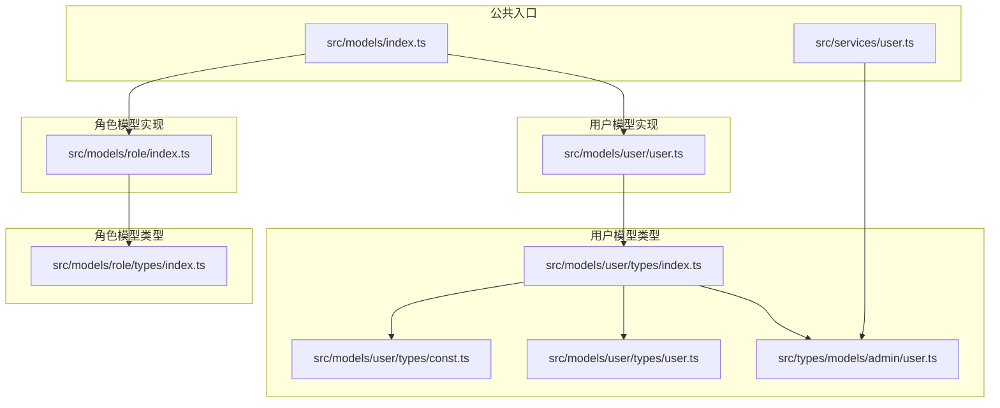
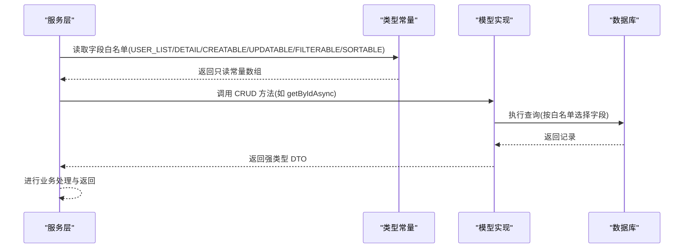
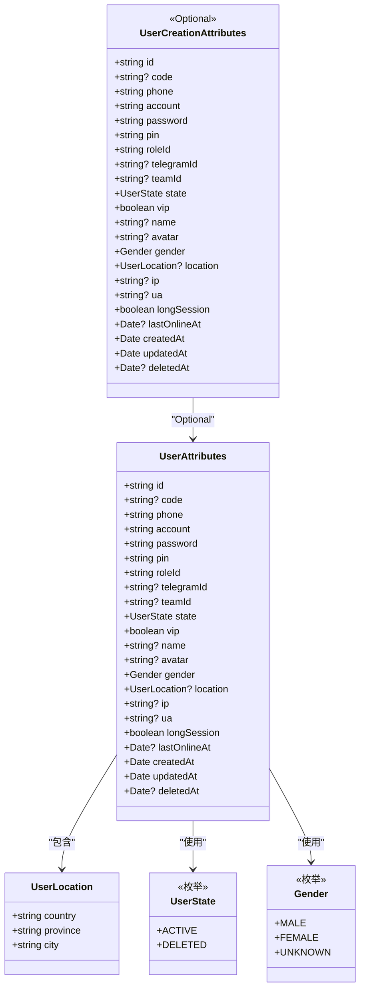
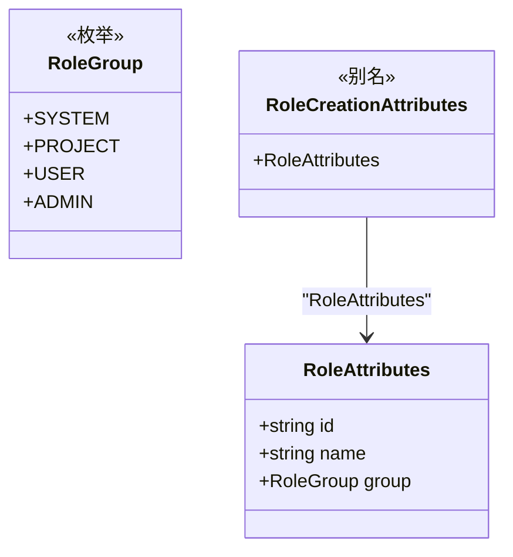
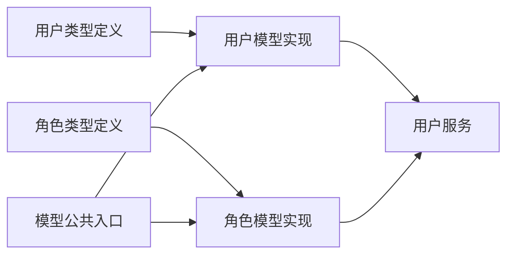

# 模型类型定义

<cite>
**本文档引用的文件**
- [src/models/user/types/user.ts](file://src/models/user/types/user.ts)
- [src/models/user/types/const.ts](file://src/models/user/types/const.ts)
- [src/models/user/types/index.ts](file://src/models/user/types/index.ts)
- [src/models/user/user.ts](file://src/models/user/user.ts)
- [src/models/role/types/index.ts](file://src/models/role/types/index.ts)
- [src/models/role/index.ts](file://src/models/role/index.ts)
- [src/models/index.ts](file://src/models/index.ts)
- [src/types/models/admin/user.ts](file://src/types/models/admin/user.ts)
- [src/services/user.ts](file://src/services/user.ts)
- [src/utils/common/gen/id.ts](file://src/utils/common/gen/id.ts)
- [src/repo/base/crud/getbyid.ts](file://src/repo/base/crud/getbyid.ts)
- [src/repo/base/validation/function/types.ts](file://src/repo/base/validation/function/types.ts)
</cite>

## 目录
1. [简介](#简介)
2. [项目结构](#项目结构)
3. [核心组件](#核心组件)
4. [架构总览](#架构总览)
5. [详细组件分析](#详细组件分析)
6. [依赖关系分析](#依赖关系分析)
7. [性能考量](#性能考量)
8. [故障排查指南](#故障排查指南)
9. [结论](#结论)
10. [附录](#附录)

## 简介
本文件面向 IM-API 的模型类型定义，系统性梳理用户类型、角色类型与常量类型的接口定义、类型约束与模块化组织方式。重点覆盖：
- 用户类型：UserAttributes、UserCreationAttributes、UserLocation、UserState、Gender 等
- 角色类型：RoleAttributes、RoleGroup、RoleId、RoleName 等
- 常量与枚举：UserState、Gender、RoleGroup 的定义与使用场景
- 类型别名、泛型约束与类型推导的应用
- 类型安全在数据模型中的重要性与实现方式
- 导入导出与模块化组织策略
- 最佳实践与常见问题解决方案

## 项目结构
IM-API 的类型定义采用“按功能域分层 + 统一导出”的组织方式：
- 用户模型类型位于 src/models/user/types 下，包含用户属性、状态枚举、性别枚举与字段配置常量，并通过 index.ts 统一导出
- 角色模型类型位于 src/models/role/types 下，包含角色属性、分组枚举与字段配置常量
- 公共模型注册与初始化位于 src/models/index.ts
- 服务层通过 src/services/user.ts 使用类型常量进行 CRUD 配置
- 工具与通用库位于 src/utils 与 src/repo

图表来源
- [src/models/user/types/index.ts](file://src/models/user/types/index.ts#L1-L30)
- [src/models/user/types/const.ts](file://src/models/user/types/const.ts#L1-L34)
- [src/models/user/types/user.ts](file://src/models/user/types/user.ts#L1-L177)
- [src/types/models/admin/user.ts](file://src/types/models/admin/user.ts#L1-L177)
- [src/models/user/user.ts](file://src/models/user/user.ts#L1-L275)
- [src/models/role/types/index.ts](file://src/models/role/types/index.ts#L1-L66)
- [src/models/role/index.ts](file://src/models/role/index.ts#L1-L77)
- [src/models/index.ts](file://src/models/index.ts#L1-L143)
- [src/services/user.ts](file://src/services/user.ts#L1-L60)

章节来源
- [src/models/user/types/index.ts](file://src/models/user/types/index.ts#L1-L30)
- [src/models/index.ts](file://src/models/index.ts#L1-L143)

## 核心组件
本节聚焦用户与角色两类模型的类型定义与实现要点，强调类型安全、可维护性与可扩展性。

- 用户类型
  - UserAttributes：用户模型的完整属性接口，涵盖标识、认证、角色、状态、社交与元信息等字段
  - UserCreationAttributes：基于 Optional 的创建时可省略字段集合，确保创建流程的类型安全
  - UserLocation：用户地理位置信息的结构化接口
  - UserState：用户状态枚举，来源于数据库 ENUM 值，确保与数据库一致
  - Gender：性别枚举，来源于常量定义，确保值域收敛
  - 字段配置常量：列表、详情、可创建、可更新、可筛选、可排序字段的白名单，用于 CRUD 配置与查询优化

- 角色类型
  - RoleAttributes：角色表字段定义，包含 id、name、group
  - RoleGroup：角色分组枚举，标识角色所属系统模块
  - RoleId、RoleName：类型别名，便于前端/DTO 强类型约束
  - 字段配置常量：列表与可过滤字段白名单

章节来源
- [src/models/user/types/user.ts](file://src/models/user/types/user.ts#L1-L177)
- [src/models/user/types/const.ts](file://src/models/user/types/const.ts#L1-L34)
- [src/models/user/types/index.ts](file://src/models/user/types/index.ts#L1-L30)
- [src/models/user/user.ts](file://src/models/user/user.ts#L1-L275)
- [src/models/role/types/index.ts](file://src/models/role/types/index.ts#L1-L66)
- [src/models/role/index.ts](file://src/models/role/index.ts#L1-L77)

## 架构总览
IM-API 的类型体系通过“类型定义 + 模型实现 + 服务配置 + 公共入口”的分层设计，形成闭环的类型安全链路：
- 类型定义层：在 types 目录下集中定义接口、枚举与常量，确保值域收敛与类型推导
- 模型实现层：在 models 目录下实现 Sequelize 模型，将类型定义映射到数据库结构
- 服务配置层：在 services 中使用类型常量构建 CRUD 配置，避免硬编码与越权字段
- 公共入口层：在 models/index.ts 统一初始化与注册模型，提供通用类型与注册表

图表来源
- [src/services/user.ts](file://src/services/user.ts#L1-L60)
- [src/repo/base/crud/getbyid.ts](file://src/repo/base/crud/getbyid.ts#L1-L37)
- [src/types/models/admin/user.ts](file://src/types/models/admin/user.ts#L1-L177)

## 详细组件分析

### 用户类型组件分析
用户类型体系围绕 UserAttributes 与 UserCreationAttributes 展开，结合 UserState、Gender 与字段配置常量，实现从接口到数据库的端到端类型安全。

图表来源
- [src/models/user/types/user.ts](file://src/models/user/types/user.ts#L1-L177)
- [src/models/user/types/const.ts](file://src/models/user/types/const.ts#L1-L34)
- [src/models/user/user.ts](file://src/models/user/user.ts#L1-L275)

- UserAttributes 字段定义与类型安全
  - 标识与认证：id、phone、account、password、pin 等字段均具备明确类型与约束，确保调用方无法传入错误类型
  - 角色与状态：roleId、state、vip 等字段通过枚举与布尔类型限制取值范围
  - 社交与元信息：telegramId、teamId、name、avatar、ip、ua、longSession、lastOnlineAt 等字段支持空值，体现业务灵活性
  - 时间戳：createdAt、updatedAt、deletedAt 使用 Date 类型，确保时间处理一致性
  - 地理位置：location 为 JSON 结构，通过 UserLocation 接口约束其键名与类型

- UserCreationAttributes 泛型约束
  - 使用 Optional<UserAttributes, Keys> 将创建时可省略的字段集合显式化，避免在构造阶段遗漏必要字段
  - 通过类型推导确保创建流程与数据库默认值策略一致

- UserState 与 Gender 枚举
  - UserState：来源于数据库 ENUM 值，确保与数据库一致，避免运行时状态异常
  - Gender：来源于常量定义，值域收敛，便于前端展示与校验

- 字段配置常量
  - USER_LIST、USER_DETAIL、USER_CREATABLE、USER_UPDATABLE、USER_FILTERABLE、USER_SORTABLE：以只读数组形式定义字段白名单，用于 CRUD 配置与查询优化，避免越权访问与不必要的字段加载

章节来源
- [src/models/user/types/user.ts](file://src/models/user/types/user.ts#L1-L177)
- [src/models/user/types/const.ts](file://src/models/user/types/const.ts#L1-L34)
- [src/models/user/types/index.ts](file://src/models/user/types/index.ts#L1-L30)
- [src/models/user/user.ts](file://src/models/user/user.ts#L1-L275)
- [src/types/models/admin/user.ts](file://src/types/models/admin/user.ts#L1-L177)

### 角色类型组件分析
角色类型体系围绕 RoleAttributes 与 RoleGroup 展开，提供清晰的角色分组与字段约束。

图表来源
- [src/models/role/types/index.ts](file://src/models/role/types/index.ts#L1-L66)
- [src/models/role/index.ts](file://src/models/role/index.ts#L1-L77)

- RoleAttributes 字段定义
  - id：角色唯一标识，字符串类型
  - name：角色名称，字符串类型，唯一约束
  - group：角色分组，使用 RoleGroup 枚举限定取值范围

- RoleGroup 枚举
  - 标识角色所属系统模块，包括 system、project、user、admin，便于权限与路由配置

- RoleCreationAttributes 类型别名
  - 与 RoleAttributes 相同，表示创建时所有字段均为必填

章节来源
- [src/models/role/types/index.ts](file://src/models/role/types/index.ts#L1-L66)
- [src/models/role/index.ts](file://src/models/role/index.ts#L1-L77)

### 类型安全与实现方式
- 值域收敛：通过枚举与字面量联合类型限制取值范围，避免魔法字符串与越界值
- 类型推导：利用 TypeScript 的类型推导与条件类型（如 Optional）自动推断可选字段，减少手写样板代码
- 数据库对齐：UserState 与 Gender 的值域与数据库 ENUM 保持一致，避免 ORM 层与数据库层的不一致
- 字段白名单：通过只读常量定义字段白名单，确保 CRUD 查询与更新仅作用于允许的字段，降低安全风险
- 序列化安全：User 模型重写 toJSON，剔除敏感字段（如 password），防止敏感信息泄露

章节来源
- [src/models/user/types/user.ts](file://src/models/user/types/user.ts#L1-L177)
- [src/models/user/types/const.ts](file://src/models/user/types/const.ts#L1-L34)
- [src/models/user/user.ts](file://src/models/user/user.ts#L1-L275)

### 导入导出与模块化组织
- 用户类型统一导出：src/models/user/types/index.ts 将 Gender、UserState、UserAttributes、UserLocation 等集中导出，便于上层模块按需引入
- 角色类型统一导出：src/models/role/types/index.ts 将 RoleAttributes、RoleGroup、RoleId、RoleName 等集中导出
- 公共入口：src/models/index.ts 统一初始化与注册模型，提供 modelRegistry 与通用类型，便于通用 CRUD、动态路由与权限配置

章节来源
- [src/models/user/types/index.ts](file://src/models/user/types/index.ts#L1-L30)
- [src/models/role/types/index.ts](file://src/models/role/types/index.ts#L1-L66)
- [src/models/index.ts](file://src/models/index.ts#L1-L143)

### 类型定义最佳实践
- 使用 as const 与字面量联合类型：确保枚举值与数据库一致，避免运行时错误
- 使用 Optional<T, K>：在创建流程中显式声明可省略字段，提升类型安全性
- 字段白名单：通过只读常量定义 CRUD 字段白名单，避免越权访问与不必要的字段加载
- 类型别名：为常用字符串类型（如 RoleId、RoleName）定义别名，提升可读性与一致性
- 序列化安全：在模型层重写 toJSON，剔除敏感字段，防止敏感信息泄露

章节来源
- [src/models/user/types/user.ts](file://src/models/user/types/user.ts#L1-L177)
- [src/models/user/types/const.ts](file://src/models/user/types/const.ts#L1-L34)
- [src/models/user/user.ts](file://src/models/user/user.ts#L1-L275)
- [src/models/role/types/index.ts](file://src/models/role/types/index.ts#L1-L66)

## 依赖关系分析
用户与角色类型之间的依赖关系如下：
- 用户模型依赖用户类型定义（UserAttributes、UserCreationAttributes、UserState、Gender、UserLocation）
- 角色模型依赖角色类型定义（RoleAttributes、RoleGroup）
- 服务层通过类型常量构建 CRUD 配置，避免硬编码与越权字段
- 公共入口统一初始化模型并提供通用类型与注册表

图表来源
- [src/models/user/types/user.ts](file://src/models/user/types/user.ts#L1-L177)
- [src/models/user/types/const.ts](file://src/models/user/types/const.ts#L1-L34)
- [src/models/user/user.ts](file://src/models/user/user.ts#L1-L275)
- [src/models/role/types/index.ts](file://src/models/role/types/index.ts#L1-L66)
- [src/models/role/index.ts](file://src/models/role/index.ts#L1-L77)
- [src/models/index.ts](file://src/models/index.ts#L1-L143)
- [src/services/user.ts](file://src/services/user.ts#L1-L60)

章节来源
- [src/models/index.ts](file://src/models/index.ts#L1-L143)
- [src/services/user.ts](file://src/services/user.ts#L1-L60)

## 性能考量
- 字段白名单：通过 USER_LIST、USER_DETAIL 等常量限制查询字段，减少网络传输与内存占用
- 索引与排序：模型定义中包含针对 createdAt、id、roleId、state、lastOnlineAt、phone 等字段的索引，提升查询性能
- 默认 Scope：默认排除敏感字段（如 password），减少序列化成本与安全风险
- 泛型约束：Optional 与条件类型减少运行时校验成本，提升编译期安全性

章节来源
- [src/models/user/types/user.ts](file://src/models/user/types/user.ts#L1-L177)
- [src/models/user/user.ts](file://src/models/user/user.ts#L1-L275)

## 故障排查指南
- UserState 不一致
  - 现象：运行时报错或状态异常
  - 排查：确认 UserState 的值域与数据库 ENUM 一致，避免手动拼写错误
  - 参考：UserState 定义与数据库 ENUM 字段

- Gender 值域错误
  - 现象：性别字段赋值失败或显示异常
  - 排查：确认 Gender 枚举值与数据库 ENUM 一致，避免使用非枚举值
  - 参考：Gender 定义与数据库 ENUM 字段

- CRUD 字段越权
  - 现象：更新或查询时出现未授权字段
  - 排查：检查 USER_CREATABLE、USER_UPDATABLE、USER_FILTERABLE、USER_SORTABLE 是否正确使用
  - 参考：字段白名单常量与服务层 CRUD 配置

- 序列化泄露敏感信息
  - 现象：响应体包含敏感字段
  - 排查：确认 User 模型的 toJSON 已剔除 password 等敏感字段
  - 参考：User 模型 toJSON 实现

章节来源
- [src/models/user/types/user.ts](file://src/models/user/types/user.ts#L1-L177)
- [src/models/user/types/const.ts](file://src/models/user/types/const.ts#L1-L34)
- [src/models/user/user.ts](file://src/models/user/user.ts#L1-L275)
- [src/services/user.ts](file://src/services/user.ts#L1-L60)

## 结论
IM-API 的模型类型定义通过“类型收敛 + 枚举约束 + 字段白名单 + 序列化安全”的组合拳，实现了从接口到数据库的端到端类型安全。用户与角色类型体系清晰、可维护性强，配合统一导出与公共入口，有效提升了代码质量与开发体验。建议在新增字段或修改枚举时，遵循现有模式，确保类型定义与数据库结构保持一致。

## 附录
- 工具与通用库
  - ID 生成：genUserId 用于生成用户 ID，默认 7 位随机数字
  - 验证错误接口：ValidationError 用于统一错误结构

章节来源
- [src/utils/common/gen/id.ts](file://src/utils/common/gen/id.ts#L1-L5)
- [src/repo/base/validation/function/types.ts](file://src/repo/base/validation/function/types.ts#L1-L13)