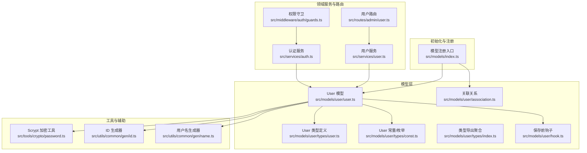
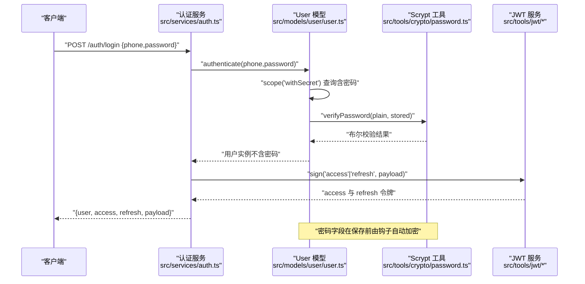
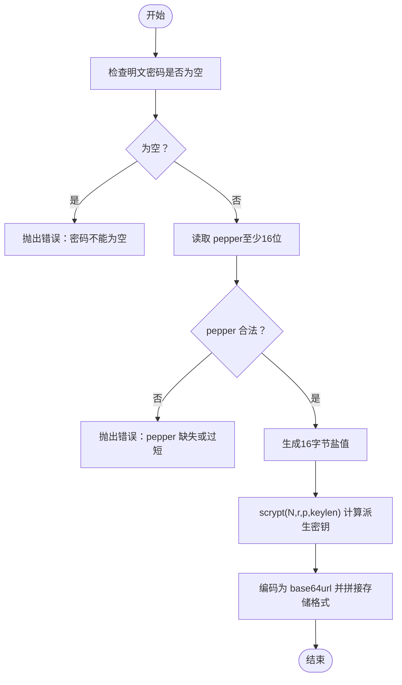
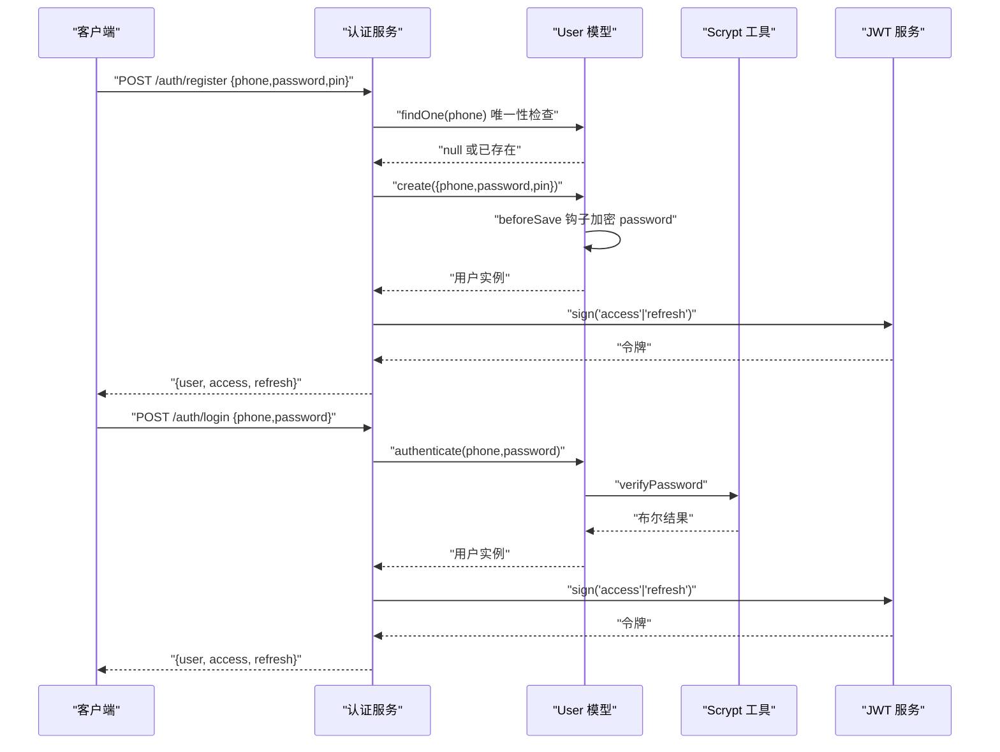
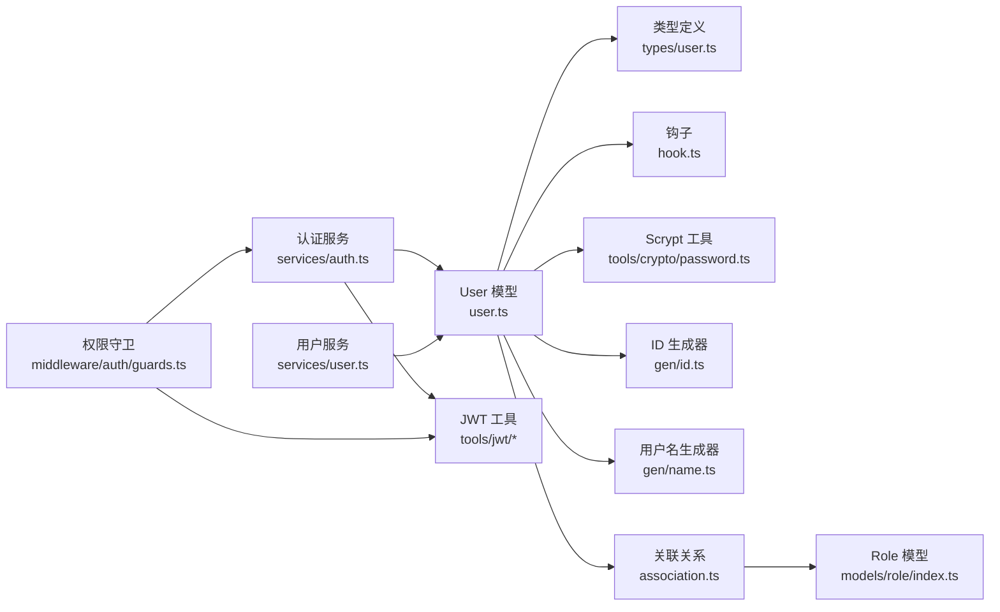

# 用户模型

<cite>
**本文引用的文件**
- [src/models/user/user.ts](file://src/models/user/user.ts)
- [src/models/user/types/user.ts](file://src/models/user/types/user.ts)
- [src/models/user/types/const.ts](file://src/models/user/types/const.ts)
- [src/models/user/types/index.ts](file://src/models/user/types/index.ts)
- [src/models/user/hook.ts](file://src/models/user/hook.ts)
- [src/models/user/association.ts](file://src/models/user/association.ts)
- [src/models/index.ts](file://src/models/index.ts)
- [src/tools/crypto/password.ts](file://src/tools/crypto/password.ts)
- [src/utils/common/gen/id.ts](file://src/utils/common/gen/id.ts)
- [src/utils/common/gen/name.ts](file://src/utils/common/gen/name.ts)
- [src/models/role/index.ts](file://src/models/role/index.ts)
- [src/services/user.ts](file://src/services/user.ts)
- [src/services/auth.ts](file://src/services/auth.ts)
- [src/middleware/auth/guards.ts](file://src/middleware/auth/guards.ts)
- [src/routes/admin/user.ts](file://src/routes/admin/user.ts)
</cite>

## 目录
1. [简介](#简介)
2. [项目结构](#项目结构)
3. [核心组件](#核心组件)
4. [架构总览](#架构总览)
5. [详细组件分析](#详细组件分析)
6. [依赖分析](#依赖分析)
7. [性能考虑](#性能考虑)
8. [故障排查指南](#故障排查指南)
9. [结论](#结论)
10. [附录](#附录)

## 简介
本文件为 IM-API 的用户模型（User）技术文档，面向开发者与运维人员，系统性阐述用户模型的字段定义、数据类型、约束条件、索引设计、密码加密机制、认证流程、钩子函数、初始化配置以及与角色模型（Role）的关联关系，并提供使用示例与最佳实践。

## 项目结构
用户模型位于 models/user 目录下，配合类型定义、钩子、关联关系与初始化入口共同构成完整的用户域模型。

图表来源
- [src/models/user/user.ts](file://src/models/user/user.ts#L109-L266)
- [src/models/user/types/user.ts](file://src/models/user/types/user.ts#L38-L87)
- [src/models/user/types/const.ts](file://src/models/user/types/const.ts#L1-L34)
- [src/models/user/hook.ts](file://src/models/user/hook.ts#L1-L20)
- [src/models/user/association.ts](file://src/models/user/association.ts#L1-L24)
- [src/models/index.ts](file://src/models/index.ts#L25-L57)
- [src/tools/crypto/password.ts](file://src/tools/crypto/password.ts#L1-L111)
- [src/utils/common/gen/id.ts](file://src/utils/common/gen/id.ts#L1-L6)
- [src/utils/common/gen/name.ts](file://src/utils/common/gen/name.ts#L1-L21)
- [src/services/user.ts](file://src/services/user.ts#L1-L60)
- [src/services/auth.ts](file://src/services/auth.ts#L1-L170)
- [src/middleware/auth/guards.ts](file://src/middleware/auth/guards.ts#L1-L195)
- [src/routes/admin/user.ts](file://src/routes/admin/user.ts#L1-L40)

章节来源
- [src/models/index.ts](file://src/models/index.ts#L25-L57)

## 核心组件
- User 模型：定义用户表结构、字段约束、默认值、索引、scopes、钩子与认证方法。
- 类型与常量：定义用户属性接口、状态枚举、性别枚举、位置信息结构与字段白名单。
- 钩子：保存前自动对密码进行 Scrypt 哈希处理。
- 关联：User 与 Role 通过 roleId 建立一对多关联。
- 初始化：在模型注册入口集中初始化并建立关联。
- 加密：使用 Scrypt 对密码与 PIN 进行单向哈希与校验。
- 工具：ID 与用户名生成器用于默认值填充。

章节来源
- [src/models/user/user.ts](file://src/models/user/user.ts#L33-L101)
- [src/models/user/types/user.ts](file://src/models/user/types/user.ts#L12-L87)
- [src/models/user/types/const.ts](file://src/models/user/types/const.ts#L1-L34)
- [src/models/user/hook.ts](file://src/models/user/hook.ts#L1-L20)
- [src/models/user/association.ts](file://src/models/user/association.ts#L1-L24)
- [src/models/index.ts](file://src/models/index.ts#L25-L57)
- [src/tools/crypto/password.ts](file://src/tools/crypto/password.ts#L1-L111)
- [src/utils/common/gen/id.ts](file://src/utils/common/gen/id.ts#L1-L6)
- [src/utils/common/gen/name.ts](file://src/utils/common/gen/name.ts#L1-L21)

## 架构总览
用户模型在初始化阶段完成字段定义与索引设置，并在保存前钩子中对密码进行加密。认证流程由 User 模型的静态方法与认证服务协作完成，最终通过 JWT 签发访问与刷新令牌。权限守卫基于请求上下文中的用户信息进行角色、VIP、团队与令牌类型的校验。

图表来源
- [src/services/auth.ts](file://src/services/auth.ts#L126-L134)
- [src/models/user/user.ts](file://src/models/user/user.ts#L69-L89)
- [src/tools/crypto/password.ts](file://src/tools/crypto/password.ts#L48-L70)
- [src/tools/jwt/index.ts](file://src/tools/jwt/index.ts#L1-L200)

## 详细组件分析

### 字段定义与约束
- 主键与标识
  - id：字符串，7 位随机数字，默认由生成器提供。
  - code：字符串，唯一，邀请码。
  - phone：字符串，唯一，手机号（纯数字，验证正则）。
  - account：字符串，唯一，账号（默认用户名生成器）。
- 凭证
  - password：字符串，密码哈希（Scrypt）。
  - pin：字符串，二级密码哈希（Scrypt）。
- 组织与身份
  - roleId：字符串，外键，指向角色模型，初始默认值为 "user"。
  - teamId：字符串，可空，团队 ID。
  - telegramId：字符串，可空，Telegram ID。
- 状态与属性
  - state：枚举，用户状态（Active/Deleted）。
  - vip：布尔，是否 VIP。
  - longSession：布尔，是否允许长期登录。
  - lastOnlineAt：日期，最后在线时间。
- 个人资料
  - name：字符串，昵称（默认用户名生成器）。
  - avatar：字符串，头像 URL。
  - gender：枚举，性别（male/female/unknown）。
  - location：JSON，位置信息 {country, province, city}，默认值为“未知”三元组。
- 请求痕迹
  - ip：字符串，IP 地址。
  - ua：字符串，User-Agent。
- 时间戳
  - createdAt/updatedAt：记录创建与更新时间。
  - deletedAt：记录软删除时间（启用 paranoid）。

章节来源
- [src/models/user/user.ts](file://src/models/user/user.ts#L110-L254)
- [src/models/user/types/user.ts](file://src/models/user/types/user.ts#L38-L87)
- [src/utils/common/gen/id.ts](file://src/utils/common/gen/id.ts#L1-L6)
- [src/utils/common/gen/name.ts](file://src/utils/common/gen/name.ts#L1-L21)

### 数据类型与约束说明
- 字符串长度与唯一性：phone、account、code、id 等字段具备唯一性约束与长度限制。
- 数值与布尔：id 为字符串但语义上为数值；longSession、vip 为布尔。
- JSON 结构：location 为 JSON，包含国家、省份、城市三元组。
- 枚举值：
  - state：active/deleted（注意：类型常量定义中另有 normal/muted/banned/canceled/risk_controlled，以数据库定义为准）。
  - gender：male/female/unknown。
- 验证规则：phone 字段使用正则表达式确保只包含数字。
- 默认值：大量字段提供默认值，减少空值带来的业务歧义。

章节来源
- [src/models/user/user.ts](file://src/models/user/user.ts#L127-L135)
- [src/models/user/types/user.ts](file://src/models/user/types/user.ts#L12-L23)
- [src/models/user/types/const.ts](file://src/models/user/types/const.ts#L10-L18)

### 用户状态与性别枚举
- 用户状态（数据库枚举）：active、deleted。
- 性别枚举：male、female、unknown。
- 注意：类型常量中定义了更丰富的状态集合（normal/muted/banned/canceled/risk_controlled），但数据库实际枚举为 active/deleted。若需扩展状态，请在数据库与类型两侧同步。

章节来源
- [src/models/user/types/user.ts](file://src/models/user/types/user.ts#L12-L23)
- [src/models/user/types/const.ts](file://src/models/user/types/const.ts#L10-L18)
- [src/models/user/user.ts](file://src/models/user/user.ts#L176-L181)

### 位置信息 JSON 结构
- 结构：{ country: string, province: string, city: string }
- 默认值：全部为“未知”。

章节来源
- [src/models/user/types/user.ts](file://src/models/user/types/user.ts#L26-L36)
- [src/models/user/user.ts](file://src/models/user/user.ts#L206-L211)

### 密码加密机制（Scrypt）
- 哈希算法：Scrypt，参数 N=32768, r=8, p=1, keylen=32，最大内存 64MB。
- 存储格式：scrypt$N$r$p$salt$dk，其中 salt 与 derived key 使用 base64url 编码。
- 验证流程：支持带 pepper 与不带 pepper 的两种校验路径，采用常量时间比较。
- 升级能力：提供校验并判断是否需要升级（成本参数或 pepper），必要时生成新哈希。
- 使用方式：User 模型保存前钩子自动对 password 字段进行加密；认证时使用 verifyPassword 校验。

图表来源
- [src/tools/crypto/password.ts](file://src/tools/crypto/password.ts#L39-L46)
- [src/tools/crypto/password.ts](file://src/tools/crypto/password.ts#L55-L70)
- [src/tools/crypto/password.ts](file://src/tools/crypto/password.ts#L77-L110)

章节来源
- [src/tools/crypto/password.ts](file://src/tools/crypto/password.ts#L1-L111)
- [src/models/user/hook.ts](file://src/models/user/hook.ts#L1-L20)
- [src/models/user/user.ts](file://src/models/user/user.ts#L256-L263)

### 用户认证流程
- 登录步骤：
  1) 使用 User.authenticate(phone, password) 完成查询与校验。
  2) 若通过，调用 issueTokens 生成 access 与 refresh 令牌。
  3) 返回安全用户信息（不含密码）与令牌。
- 注册步骤：
  1) 检查手机号唯一性。
  2) 创建用户，beforeSave 钩子自动加密密码。
  3) 调用 issueTokens 签发令牌。
- 序列图如下：

图表来源
- [src/services/auth.ts](file://src/services/auth.ts#L94-L117)
- [src/services/auth.ts](file://src/services/auth.ts#L126-L134)
- [src/models/user/user.ts](file://src/models/user/user.ts#L69-L89)
- [src/tools/crypto/password.ts](file://src/tools/crypto/password.ts#L55-L70)

章节来源
- [src/services/auth.ts](file://src/services/auth.ts#L82-L167)
- [src/models/user/user.ts](file://src/models/user/user.ts#L65-L89)

### 钩子函数实现
- 保存前钩子：当 password 字段发生变更且未以特定前缀开头时，自动进行 Scrypt 加密并回写。
- 钩子来源：模型内钩子与独立钩子模块均可实现相同逻辑，确保密码始终被安全存储。

章节来源
- [src/models/user/user.ts](file://src/models/user/user.ts#L256-L263)
- [src/models/user/hook.ts](file://src/models/user/hook.ts#L9-L16)

### 初始化配置与索引设计
- 初始化：在模型注册入口集中初始化 Role 与 User，并建立关联。
- 索引：
  - 复合索引：按 createdAt 降序、id 降序，有利于按时间倒序分页与主键回表。
  - 单列索引：roleId、state、lastOnlineAt、phone，分别用于角色过滤、状态筛选、在线统计与手机号快速定位。
- 默认与 scopes：
  - defaultScope 排除 password，避免无意泄露。
  - withSecret scope 仅在必要场景（如认证）开启。

章节来源
- [src/models/index.ts](file://src/models/index.ts#L42-L57)
- [src/models/user/user.ts](file://src/models/user/user.ts#L238-L254)

### 用户模型与角色模型的关联
- 关系：User.belongsTo(Role) 与 Role.hasMany(User)，外键为 roleId。
- 约束：更新级联、删除受限，确保数据一致性。
- 使用：可通过关联加载用户所属角色，或查询某角色下的所有用户。

章节来源
- [src/models/user/association.ts](file://src/models/user/association.ts#L9-L23)
- [src/models/role/index.ts](file://src/models/role/index.ts#L41-L76)

### 使用示例与最佳实践
- 注册
  - 通过认证服务注册，传入手机号、密码与二级密码，系统自动去重与加密。
- 登录
  - 通过认证服务登录，系统完成校验并签发令牌。
- 获取当前用户
  - 通过用户服务根据 ID 查询，返回安全用户信息（不含密码）。
- 权限守卫
  - 在路由层使用守卫中间件校验角色、VIP、团队与令牌类型。
- 最佳实践
  - 仅在必要场景（认证）使用 withSecret scope。
  - 严格控制返回对象，避免密码等敏感字段泄露。
  - 使用 CRUD 服务的字段白名单，防止越权写入。
  - 对手机号等唯一字段做好幂等与冲突处理。

章节来源
- [src/services/auth.ts](file://src/services/auth.ts#L94-L117)
- [src/services/auth.ts](file://src/services/auth.ts#L126-L134)
- [src/services/user.ts](file://src/services/user.ts#L42-L57)
- [src/middleware/auth/guards.ts](file://src/middleware/auth/guards.ts#L1-L195)
- [src/routes/admin/user.ts](file://src/routes/admin/user.ts#L1-L40)

## 依赖分析
- 内部依赖
  - User 模型依赖类型定义、钩子、Scrypt 工具、ID/用户名生成器。
  - 认证服务依赖 User 模型与 JWT 工具。
  - 用户服务依赖 User 模型与字段白名单常量。
  - 权限守卫依赖 JWT 工具与用户上下文。
- 外部依赖
  - Sequelize：ORM 框架，负责模型定义、索引、钩子与关联。
  - Node.js crypto：提供 scrypt、timingSafeEqual 等原语。
- 关联关系
  - User 与 Role：一对多外键关联。
  - User 与 JWT：认证流程产物。

图表来源
- [src/models/user/user.ts](file://src/models/user/user.ts#L1-L275)
- [src/models/user/types/user.ts](file://src/models/user/types/user.ts#L1-L177)
- [src/models/user/hook.ts](file://src/models/user/hook.ts#L1-L20)
- [src/tools/crypto/password.ts](file://src/tools/crypto/password.ts#L1-L111)
- [src/utils/common/gen/id.ts](file://src/utils/common/gen/id.ts#L1-L6)
- [src/utils/common/gen/name.ts](file://src/utils/common/gen/name.ts#L1-L21)
- [src/services/auth.ts](file://src/services/auth.ts#L1-L170)
- [src/services/user.ts](file://src/services/user.ts#L1-L60)
- [src/middleware/auth/guards.ts](file://src/middleware/auth/guards.ts#L1-L195)
- [src/models/user/association.ts](file://src/models/user/association.ts#L1-L24)
- [src/models/role/index.ts](file://src/models/role/index.ts#L1-L77)

章节来源
- [src/models/user/user.ts](file://src/models/user/user.ts#L1-L275)
- [src/models/user/types/user.ts](file://src/models/user/types/user.ts#L1-L177)
- [src/models/user/association.ts](file://src/models/user/association.ts#L1-L24)
- [src/models/role/index.ts](file://src/models/role/index.ts#L1-L77)
- [src/services/auth.ts](file://src/services/auth.ts#L1-L170)
- [src/services/user.ts](file://src/services/user.ts#L1-L60)
- [src/middleware/auth/guards.ts](file://src/middleware/auth/guards.ts#L1-L195)

## 性能考虑
- 索引策略
  - createdAt+id 复合索引：提升按时间倒序分页与主键回表效率。
  - roleId/state/lastOnlineAt/phone 单列索引：分别支撑角色过滤、状态筛选、在线统计与手机号检索。
- 默认排除敏感字段：defaultScope 排除 password，减少序列化与网络传输开销。
- 钩子加密：在入库前完成密码加密，避免重复计算与缓存污染。
- 分页与字段白名单：用户服务使用字段白名单与分页配置，降低数据库压力。
- 建议
  - 针对高频查询字段（如 phone、state、roleId）结合复合索引进一步优化。
  - 对大字段（如 avatar、location）在列表查询中谨慎使用，避免不必要的 IO。

章节来源
- [src/models/user/user.ts](file://src/models/user/user.ts#L238-L254)
- [src/services/user.ts](file://src/services/user.ts#L30-L38)

## 故障排查指南
- 认证失败
  - 确认 phone 是否正确，密码是否与哈希匹配。
  - 检查是否存在 withSecret scope 的必要场景。
- 密码加密异常
  - 确认 PASSWORD_PEPPER 环境变量合法（至少 16 位）。
  - 检查钩子是否生效，避免重复加密或绕过加密。
- 唯一性冲突
  - phone/account/code 唯一约束导致插入失败，需去重或更换。
- 权限拒绝
  - 检查 JWT 载荷中的角色、VIP、团队与令牌类型是否满足守卫要求。
- 索引失效
  - 复合索引顺序与查询条件不匹配会导致回表或全表扫描，需调整查询或索引。

章节来源
- [src/services/auth.ts](file://src/services/auth.ts#L94-L117)
- [src/tools/crypto/password.ts](file://src/tools/crypto/password.ts#L39-L46)
- [src/models/user/user.ts](file://src/models/user/user.ts#L256-L263)
- [src/middleware/auth/guards.ts](file://src/middleware/auth/guards.ts#L1-L195)

## 结论
用户模型围绕安全性、可维护性与性能进行了系统设计：严格的字段约束与默认值、Scrypt 密码加密、合理的索引策略、清晰的类型与枚举定义、完善的钩子与关联关系。配合认证服务、用户服务与权限守卫，形成从注册登录到权限控制的完整闭环。建议在扩展状态枚举与索引策略时，保持数据库与类型定义的一致性，并持续关注查询热点与索引命中率。

## 附录
- 字段白名单与排序
  - 列表字段：id、phone、account、name、avatar、state、vip、roleId、createdAt。
  - 详情字段：id、code、phone、account、name、avatar、state、vip、roleId、telegramId、teamId、gender、location、longSession、lastOnlineAt、createdAt、updatedAt。
  - 可创建字段：phone、password、pin、name、avatar、roleId。
  - 可更新字段：name、avatar、state、vip、roleId、gender、location、longSession。
  - 可筛选字段：state、vip、roleId、gender。
  - 可排序字段：createdAt、lastOnlineAt、name。
- 路由与控制器
  - 用户路由提供列表、创建、详情、更新、删除等标准 CRUD 操作，配合通用 CRUD 控制器。

章节来源
- [src/models/user/types/user.ts](file://src/models/user/types/user.ts#L89-L177)
- [src/routes/admin/user.ts](file://src/routes/admin/user.ts#L1-L40)