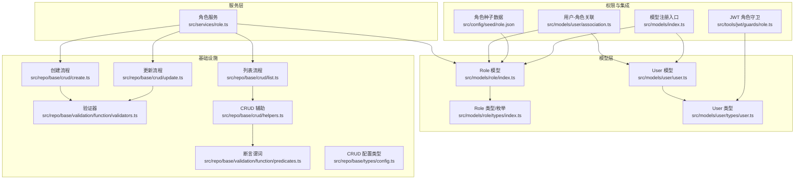
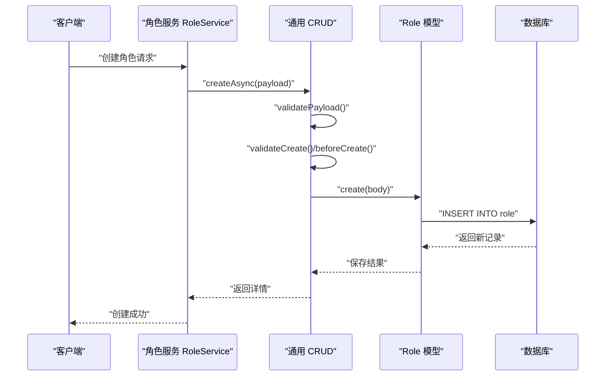
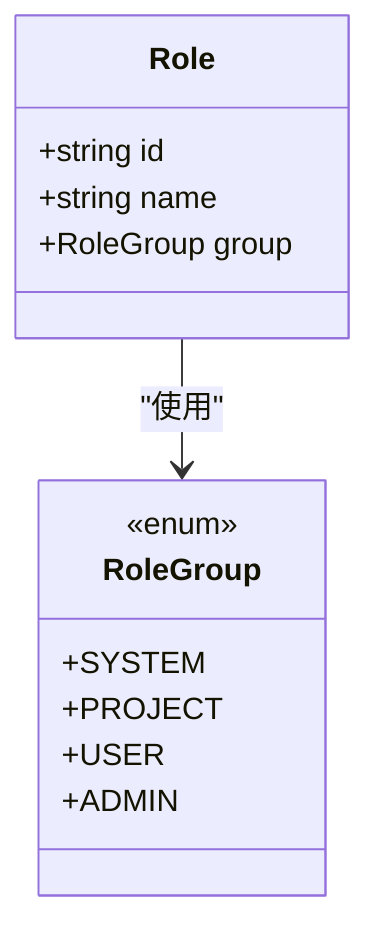
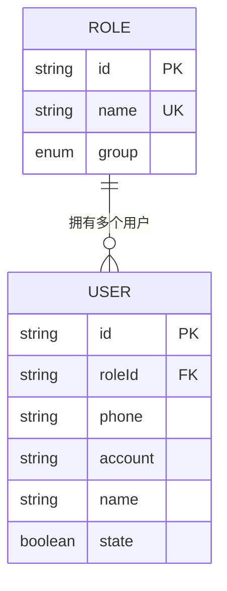
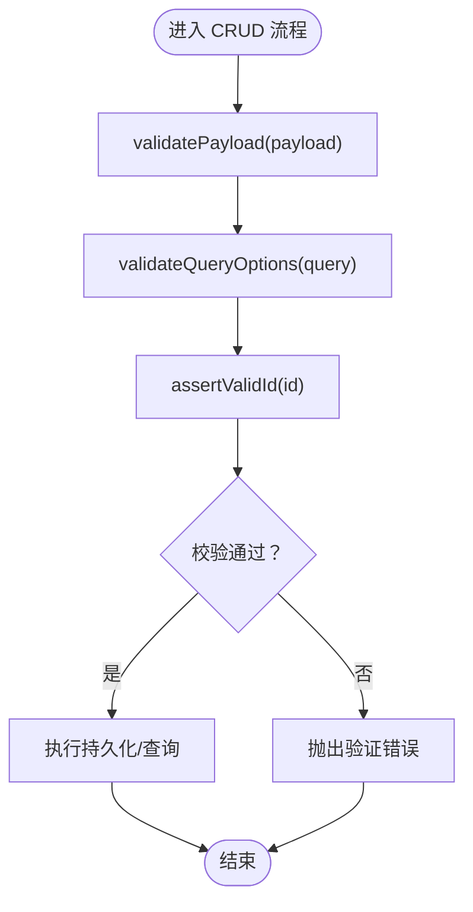
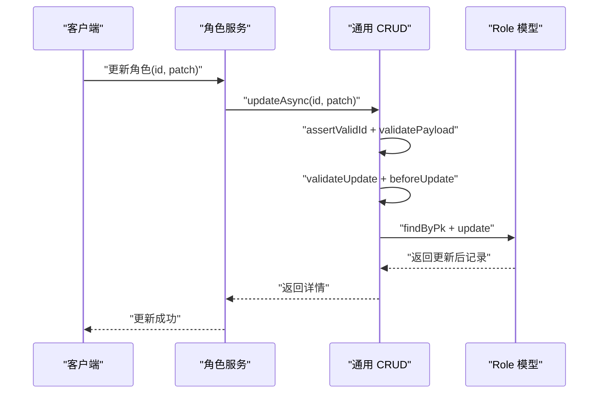
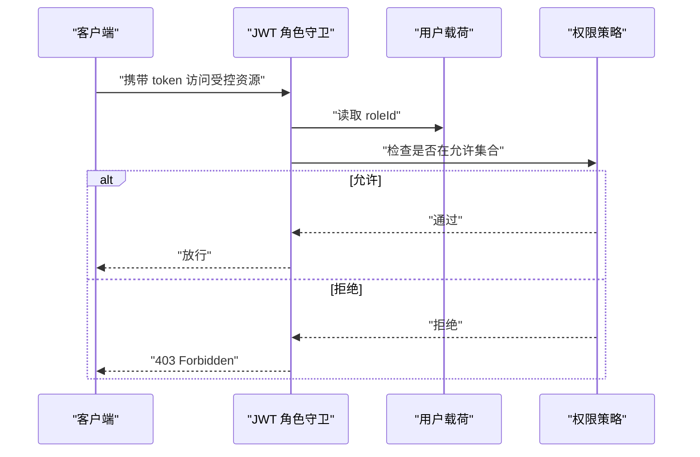
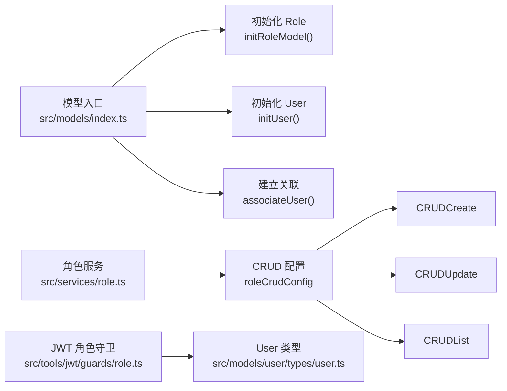

# 角色模型

<cite>
**本文档引用的文件**
- [src/models/role/index.ts](file://src/models/role/index.ts)
- [src/models/role/types/index.ts](file://src/models/role/types/index.ts)
- [src/services/role.ts](file://src/services/role.ts)
- [src/repo/base/crud/create.ts](file://src/repo/base/crud/create.ts)
- [src/repo/base/crud/update.ts](file://src/repo/base/crud/update.ts)
- [src/repo/base/crud/list.ts](file://src/repo/base/crud/list.ts)
- [src/repo/base/validation/function/validators.ts](file://src/repo/base/validation/function/validators.ts)
- [src/repo/base/validation/function/predicates.ts](file://src/repo/base/validation/function/predicates.ts)
- [src/repo/base/crud/helpers.ts](file://src/repo/base/crud/helpers.ts)
- [src/repo/base/types/config.ts](file://src/repo/base/types/config.ts)
- [src/config/seed/role.json](file://src/config/seed/role.json)
- [src/models/user/association.ts](file://src/models/user/association.ts)
- [src/models/user/types/user.ts](file://src/models/user/types/user.ts)
- [src/tools/jwt/guards/role.ts](file://src/tools/jwt/guards/role.ts)
- [src/models/index.ts](file://src/models/index.ts)
</cite>

## 目录
1. [简介](#简介)
2. [项目结构](#项目结构)
3. [核心组件](#核心组件)
4. [架构总览](#架构总览)
5. [详细组件分析](#详细组件分析)
6. [依赖关系分析](#依赖关系分析)
7. [性能考量](#性能考量)
8. [故障排查指南](#故障排查指南)
9. [结论](#结论)
10. [附录](#附录)

## 简介
本文件面向 IM-API 的角色模型，系统化阐述角色实体定义、字段结构、业务规则与权限体系，明确角色 ID、名称、分组（枚举）与描述字段的语义与用途；解释角色与用户的“一对多”关联关系；梳理初始化配置、验证规则与约束条件；给出内置角色（如 ADMIN、USER）的使用场景与权限边界；提供角色模型的 CRUD 操作流程与权限控制实现路径，并总结角色模型在权限系统中的核心作用与扩展方式。

## 项目结构
角色模型位于 models/role 目录，配合服务层与通用 CRUD 基础设施实现完整的增删改查与权限控制能力。关键文件包括：
- 模型定义与初始化：src/models/role/index.ts
- 类型与枚举：src/models/role/types/index.ts
- 服务层（基于通用 CRUD）：src/services/role.ts
- CRUD 基础设施：src/repo/base/crud/*.ts
- 验证与断言：src/repo/base/validation/*.ts
- 关联关系：src/models/user/association.ts
- JWT 角色守卫：src/tools/jwt/guards/role.ts
- 数据种子：src/config/seed/role.json
- 模型注册入口：src/models/index.ts

**图表来源**
- [src/models/role/index.ts](file://src/models/role/index.ts#L1-L77)
- [src/models/role/types/index.ts](file://src/models/role/types/index.ts#L1-L66)
- [src/services/role.ts](file://src/services/role.ts#L1-L35)
- [src/repo/base/crud/create.ts](file://src/repo/base/crud/create.ts#L1-L81)
- [src/repo/base/crud/update.ts](file://src/repo/base/crud/update.ts#L1-L66)
- [src/repo/base/crud/list.ts](file://src/repo/base/crud/list.ts#L1-L62)
- [src/repo/base/validation/function/validators.ts](file://src/repo/base/validation/function/validators.ts#L1-L76)
- [src/repo/base/validation/function/predicates.ts](file://src/repo/base/validation/function/predicates.ts#L1-L74)
- [src/repo/base/crud/helpers.ts](file://src/repo/base/crud/helpers.ts#L1-L238)
- [src/repo/base/types/config.ts](file://src/repo/base/types/config.ts#L1-L147)
- [src/config/seed/role.json](file://src/config/seed/role.json#L1-L28)
- [src/models/user/association.ts](file://src/models/user/association.ts#L1-L24)
- [src/models/user/types/user.ts](file://src/models/user/types/user.ts#L1-L177)
- [src/tools/jwt/guards/role.ts](file://src/tools/jwt/guards/role.ts#L1-L31)
- [src/models/index.ts](file://src/models/index.ts#L1-L143)

**章节来源**
- [src/models/role/index.ts](file://src/models/role/index.ts#L1-L77)
- [src/models/role/types/index.ts](file://src/models/role/types/index.ts#L1-L66)
- [src/services/role.ts](file://src/services/role.ts#L1-L35)
- [src/models/user/association.ts](file://src/models/user/association.ts#L1-L24)
- [src/models/index.ts](file://src/models/index.ts#L1-L143)

## 核心组件
- 角色模型 Role：定义 id、name、group 三个字段，其中 group 为枚举类型，支持 system、project、user、admin 四类分组，默认 user。
- 角色类型与枚举：RoleAttributes、RoleGroup、RoleId、RoleName 等类型与常量，确保前后端一致的强类型约束。
- 角色服务 RoleService：基于通用 CRUD 配置，提供角色的列表、详情、创建、更新等能力。
- 关联关系：User 与 Role 为“多对一/一对多”，外键 roleId，约束为非空，ON UPDATE/CASCADE，ON DELETE/RESTRICT。
- 权限守卫：JWT 角色守卫通过断言用户载荷中的 roleId 是否在允许集合内，实现基于角色的访问控制。

**章节来源**
- [src/models/role/index.ts](file://src/models/role/index.ts#L20-L77)
- [src/models/role/types/index.ts](file://src/models/role/types/index.ts#L11-L66)
- [src/services/role.ts](file://src/services/role.ts#L18-L35)
- [src/models/user/association.ts](file://src/models/user/association.ts#L9-L23)
- [src/tools/jwt/guards/role.ts](file://src/tools/jwt/guards/role.ts#L14-L31)

## 架构总览
角色模型在系统中的定位与交互如下：
- 数据持久化：Role 模型通过 Sequelize 定义字段与索引，初始化时注册到全局模型注册表。
- 业务服务：RoleService 使用通用 CRUD 配置，屏蔽底层细节，聚焦字段白名单、默认排序、可过滤字段等。
- 权限控制：JWT 角色守卫以 roleId 为核心进行授权判断；用户模型持有 roleId 外键，形成“用户-角色”的一对多关系。
- 数据初始化：种子文件提供内置角色（如 admin、user），便于快速搭建初始权限结构。

**图表来源**
- [src/services/role.ts](file://src/services/role.ts#L32-L35)
- [src/repo/base/crud/create.ts](file://src/repo/base/crud/create.ts#L28-L81)
- [src/models/role/index.ts](file://src/models/role/index.ts#L41-L77)

## 详细组件分析

### 实体定义与字段结构
- id：字符串主键，长度限制与注释见模型定义；用于外键关联与权限标识。
- name：字符串，唯一约束，用于显示与检索；支持全局搜索字段。
- group：枚举，取值限定为 system、project、user、admin；默认 user；存在索引 idx_role_group，便于按分组查询。

**图表来源**
- [src/models/role/index.ts](file://src/models/role/index.ts#L27-L77)
- [src/models/role/types/index.ts](file://src/models/role/types/index.ts#L12-L20)

**章节来源**
- [src/models/role/index.ts](file://src/models/role/index.ts#L41-L77)
- [src/models/role/types/index.ts](file://src/models/role/types/index.ts#L11-L66)

### 业务规则与权限等级体系
- 角色分组（RoleGroup）代表角色所属的系统模块域，用于粗粒度权限划分：
  - system：系统级角色，通常用于平台级权限。
  - project：项目级角色，面向项目维度的权限。
  - user：用户级角色，面向个人权限。
  - admin：管理级角色，面向管理域权限。
- 默认分组为 user，便于新角色快速启用。
- 索引 idx_role_group 有助于按分组进行高效查询与权限判定。

**章节来源**
- [src/models/role/types/index.ts](file://src/models/role/types/index.ts#L12-L20)
- [src/models/role/index.ts](file://src/models/role/index.ts#L56-L72)

### 角色与用户的一对多关联
- User 模型包含 roleId 外键，且不允许为空；User.belongsTo(Role) 与 Role.hasMany(User) 形成双向关联。
- 关联策略：
  - ON UPDATE: CASCADE，角色主键变更会级联更新用户。
  - ON DELETE: RESTRICT，防止误删仍有用户的角色，避免悬挂引用。
- 关联在模型注册完成后统一建立，确保初始化顺序正确。

**图表来源**
- [src/models/user/association.ts](file://src/models/user/association.ts#L9-L23)
- [src/models/user/types/user.ts](file://src/models/user/types/user.ts#L64-L87)
- [src/models/role/index.ts](file://src/models/role/index.ts#L41-L77)

**章节来源**
- [src/models/user/association.ts](file://src/models/user/association.ts#L9-L23)
- [src/models/user/types/user.ts](file://src/models/user/types/user.ts#L64-L87)

### 初始化配置与约束条件
- 初始化：在模型入口中先初始化 Role 模型，再建立关联；模型注册表导出 Role 与 User，便于通用 CRUD 与权限配置使用。
- 约束：
  - id 非空，作为主键。
  - name 非空且唯一，支持检索。
  - group 非空，枚举限定，带默认值 user。
  - 索引 idx_role_group(field=group)，提升分组查询效率。
- 种子数据：提供 admin 与 user 等内置角色，便于系统初始化与演示。

**章节来源**
- [src/models/index.ts](file://src/models/index.ts#L42-L57)
- [src/models/role/index.ts](file://src/models/role/index.ts#L41-L77)
- [src/config/seed/role.json](file://src/config/seed/role.json#L1-L28)

### 验证规则与错误处理
- 载荷验证：validatePayload 会检查 payload 是否为对象以及必需字段是否存在；CRUD 创建/更新流程均调用该验证。
- 查询参数验证：validateQueryOptions 对 page、limit、search、filters、order 等进行格式校验，不符合规范抛出统一错误。
- ID 断言：assertValidId 确保主键为非空字符串，避免无效 ID 导致的异常。
- 错误类型：统一使用 CrudValidationError 或 AuthError，便于上层捕获与处理。

**图表来源**
- [src/repo/base/validation/function/validators.ts](file://src/repo/base/validation/function/validators.ts#L57-L76)
- [src/repo/base/validation/function/predicates.ts](file://src/repo/base/validation/function/predicates.ts#L9-L11)
- [src/repo/base/crud/create.ts](file://src/repo/base/crud/create.ts#L44-L47)
- [src/repo/base/crud/update.ts](file://src/repo/base/crud/update.ts#L41-L44)

**章节来源**
- [src/repo/base/validation/function/validators.ts](file://src/repo/base/validation/function/validators.ts#L11-L76)
- [src/repo/base/validation/function/predicates.ts](file://src/repo/base/validation/function/predicates.ts#L9-L74)
- [src/repo/base/crud/create.ts](file://src/repo/base/crud/create.ts#L43-L47)
- [src/repo/base/crud/update.ts](file://src/repo/base/crud/update.ts#L41-L44)

### CRUD 操作示例与流程
- 创建（Create）：通过 RoleService 调用通用 createAsync，传入 creatableFields 白名单，经 validatePayload 与可选 validateCreate/beforeCreate 钩子处理后持久化。
- 更新（Update）：通过 RoleService 调用通用 updateAsync，先断言 ID 与 payload，再根据 updatableFields 白名单过滤，最后持久化更新。
- 列表（List）：通过 RoleService 调用 listAsync，支持分页、搜索、过滤、排序与关联查询，返回 { data, total, page, limit } 结构。
- 详情（GetById）：基于通用 CRUD 的详情查询能力，返回 detailFields 指定字段。

**图表来源**
- [src/services/role.ts](file://src/services/role.ts#L32-L35)
- [src/repo/base/crud/update.ts](file://src/repo/base/crud/update.ts#L29-L66)
- [src/repo/base/crud/helpers.ts](file://src/repo/base/crud/helpers.ts#L68-L78)

**章节来源**
- [src/services/role.ts](file://src/services/role.ts#L18-L35)
- [src/repo/base/crud/create.ts](file://src/repo/base/crud/create.ts#L28-L81)
- [src/repo/base/crud/update.ts](file://src/repo/base/crud/update.ts#L29-L66)
- [src/repo/base/crud/list.ts](file://src/repo/base/crud/list.ts#L27-L62)

### 权限控制实现
- JWT 角色守卫：assertRole 校验用户载荷中的 roleId 是否在允许集合内，不在则抛出 403 Forbidden。
- 用户模型：UserAttributes 中包含 roleId 字段，作为用户角色标识；配合 belongsTo/hasMany 关联完成跨表查询与权限判定。
- 角色分组：Role.group 用于粗粒度权限域划分，结合业务策略实现更细粒度的权限控制。

**图表来源**
- [src/tools/jwt/guards/role.ts](file://src/tools/jwt/guards/role.ts#L25-L30)
- [src/models/user/types/user.ts](file://src/models/user/types/user.ts#L64-L87)

**章节来源**
- [src/tools/jwt/guards/role.ts](file://src/tools/jwt/guards/role.ts#L14-L31)
- [src/models/user/types/user.ts](file://src/models/user/types/user.ts#L64-L87)

### 内置角色与使用场景
- 种子数据提供 admin 与 user 等内置角色，便于系统初始化与演示。
- 使用场景建议：
  - admin：用于管理域操作，具备较高权限；适合管理员、运营人员等。
  - user：用于普通用户操作，权限受限；适合普通注册用户。
- 建议在业务策略中以 roleId 为依据，结合具体资源与动作进行细粒度授权。

**章节来源**
- [src/config/seed/role.json](file://src/config/seed/role.json#L1-L28)

## 依赖关系分析
- 模型注册：模型入口先初始化 Role 与 User，再建立关联，确保关联建立时模型已就绪。
- 服务依赖：RoleService 依赖通用 CRUD 配置与基础设施，实现字段白名单、钩子扩展、查询构建等能力。
- 权限依赖：JWT 角色守卫依赖用户载荷中的 roleId，结合用户模型的外键关系实现跨表权限判定。

**图表来源**
- [src/models/index.ts](file://src/models/index.ts#L42-L57)
- [src/services/role.ts](file://src/services/role.ts#L22-L35)
- [src/tools/jwt/guards/role.ts](file://src/tools/jwt/guards/role.ts#L10-L30)

**章节来源**
- [src/models/index.ts](file://src/models/index.ts#L42-L57)
- [src/services/role.ts](file://src/services/role.ts#L18-L35)

## 性能考量
- 查询索引：group 字段建立索引，有利于按分组过滤与权限判定。
- 分页与排序：列表查询支持分页、搜索、过滤与排序，建议合理设置默认排序与可过滤字段，避免全表扫描。
- 关联查询：通过 QueryOptionsBuilder 统一构建 include 与 scope，减少重复逻辑，提高可维护性。
- 字段白名单：creatableFields/updatableFields 限制写入字段，减少不必要的数据库往返与冗余更新。

## 故障排查指南
- 创建失败（字段缺失）：确认 creatableFields 白名单与必填字段一致；检查 validatePayload 抛出的错误信息。
- 更新失败（ID 非法）：确认传入 id 为非空字符串；查看 assertValidId 抛出的错误。
- 查询失败（参数非法）：检查 page、limit、search、filters、order 参数格式；参考 validateQueryOptions 的错误提示。
- 关联异常（删除受限）：当角色仍有用户时，ON DELETE/RESTRICT 会阻止删除；需先迁移或删除用户后再删除角色。

**章节来源**
- [src/repo/base/validation/function/validators.ts](file://src/repo/base/validation/function/validators.ts#L57-L76)
- [src/repo/base/validation/function/predicates.ts](file://src/repo/base/validation/function/predicates.ts#L9-L11)
- [src/repo/base/crud/helpers.ts](file://src/repo/base/crud/helpers.ts#L68-L78)
- [src/models/user/association.ts](file://src/models/user/association.ts#L13-L22)

## 结论
角色模型通过清晰的实体定义、严格的验证与约束、完善的关联关系与通用 CRUD 能力，为权限系统提供了稳定的基础。结合 JWT 角色守卫与用户模型的外键关系，实现了以 roleId 为核心的权限控制路径。通过分组枚举与种子数据，系统能够快速落地内置角色与权限域划分。未来可在以下方面扩展：
- 在 RoleGroup 基础上引入更细粒度的权限矩阵或权限点（scope），并与业务资源绑定。
- 在 RoleService 中增加 validateCreate/validateUpdate 钩子，实现业务级角色校验（如唯一性、互斥性）。
- 在 JWT 策略中引入角色继承或角色组合机制，简化权限配置与维护成本。

## 附录
- CRUD 配置类型：CrudConfig 定义了字段白名单、默认排序、过滤字段、钩子扩展、关联与 Scope 等能力，支撑 RoleService 的通用化实现。
- 字段映射与 DTO：通过 fieldMappings 可将模型字段映射为对外 DTO，便于控制输出结构与敏感信息隐藏。

**章节来源**
- [src/repo/base/types/config.ts](file://src/repo/base/types/config.ts#L75-L147)