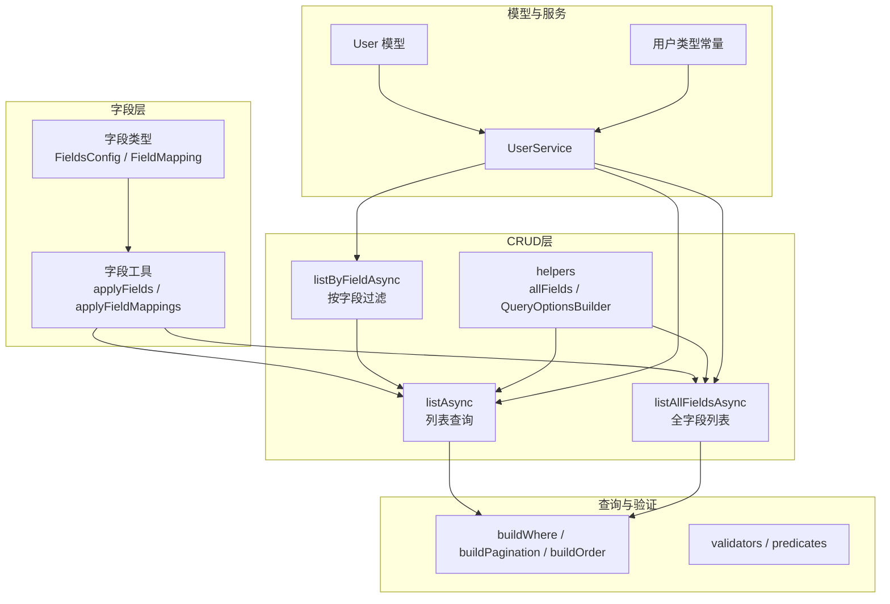
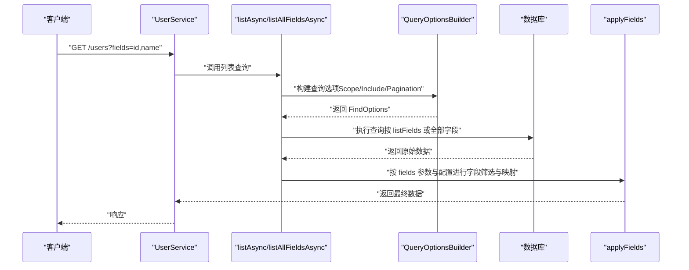
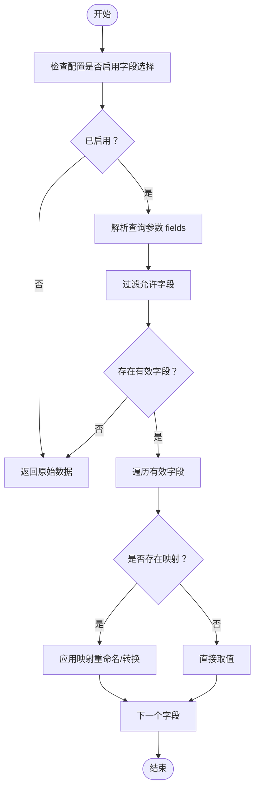
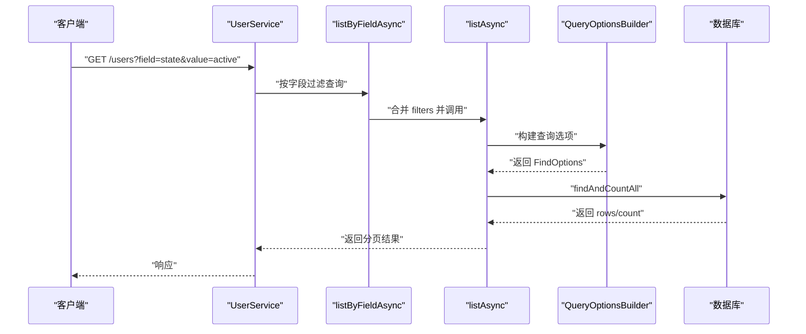
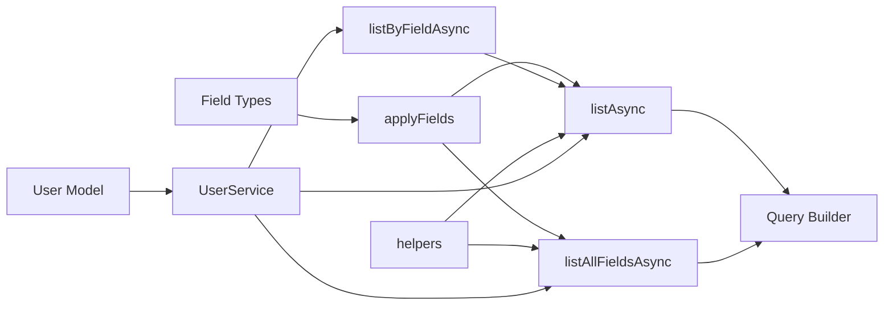

# 字段管理

<cite>
**本文引用的文件**
- [src/repo/base/field/index.ts](file://src/repo/base/field/index.ts)
- [src/repo/base/field/types.ts](file://src/repo/base/field/types.ts)
- [src/repo/base/crud/list.ts](file://src/repo/base/crud/list.ts)
- [src/repo/base/crud/listallfields.ts](file://src/repo/base/crud/listallfields.ts)
- [src/repo/base/crud/listbyfield.ts](file://src/repo/base/crud/listbyfield.ts)
- [src/repo/base/crud/helpers.ts](file://src/repo/base/crud/helpers.ts)
- [src/repo/base/types/config.ts](file://src/repo/base/types/config.ts)
- [src/repo/base/validation/function/validators.ts](file://src/repo/base/validation/function/validators.ts)
- [src/repo/base/validation/function/predicates.ts](file://src/repo/base/validation/function/predicates.ts)
- [src/utils/query/index.ts](file://src/utils/query/index.ts)
- [src/models/user/user.ts](file://src/models/user/user.ts)
- [src/services/user.ts](file://src/services/user.ts)
- [src/types/models/admin/user.ts](file://src/types/models/admin/user.ts)
</cite>

## 目录
1. [简介](#简介)
2. [项目结构](#项目结构)
3. [核心组件](#核心组件)
4. [架构总览](#架构总览)
5. [详细组件分析](#详细组件分析)
6. [依赖分析](#依赖分析)
7. [性能考量](#性能考量)
8. [故障排查指南](#故障排查指南)
9. [结论](#结论)
10. [附录](#附录)

## 简介
本技术文档聚焦 IM-API 的“字段管理系统”，系统性阐述字段级别的数据访问控制与管理机制，涵盖字段白名单与黑名单策略、字段类型定义与验证规则、CRUD 操作中的读写权限控制、按字段查询与全字段查询的实现差异与适用场景、以及字段映射与转换（含字段别名、计算字段与虚拟字段）。文档旨在帮助开发者在确保数据安全的前提下，提供灵活可控的字段访问能力。

## 项目结构
字段管理相关代码主要分布在以下模块：
- 字段选择与映射：src/repo/base/field
- CRUD 查询与字段控制：src/repo/base/crud
- 查询构建与验证：src/utils/query 与 repo/base/validation
- 模型与服务：src/models/user 与 src/services/user
- 类型定义：src/types/models/admin/user

图表来源
- [src/repo/base/field/index.ts](file://src/repo/base/field/index.ts#L1-L118)
- [src/repo/base/field/types.ts](file://src/repo/base/field/types.ts#L1-L50)
- [src/repo/base/crud/list.ts](file://src/repo/base/crud/list.ts#L1-L62)
- [src/repo/base/crud/listallfields.ts](file://src/repo/base/crud/listallfields.ts#L1-L65)
- [src/repo/base/crud/listbyfield.ts](file://src/repo/base/crud/listbyfield.ts#L1-L50)
- [src/repo/base/crud/helpers.ts](file://src/repo/base/crud/helpers.ts#L1-L238)
- [src/utils/query/index.ts](file://src/utils/query/index.ts#L1-L132)
- [src/services/user.ts](file://src/services/user.ts#L1-L60)
- [src/models/user/user.ts](file://src/models/user/user.ts#L1-L275)
- [src/types/models/admin/user.ts](file://src/types/models/admin/user.ts#L1-L177)

章节来源
- [src/repo/base/field/index.ts](file://src/repo/base/field/index.ts#L1-L118)
- [src/repo/base/field/types.ts](file://src/repo/base/field/types.ts#L1-L50)
- [src/repo/base/crud/list.ts](file://src/repo/base/crud/list.ts#L1-L62)
- [src/repo/base/crud/listallfields.ts](file://src/repo/base/crud/listallfields.ts#L1-L65)
- [src/repo/base/crud/listbyfield.ts](file://src/repo/base/crud/listbyfield.ts#L1-L50)
- [src/repo/base/crud/helpers.ts](file://src/repo/base/crud/helpers.ts#L1-L238)
- [src/utils/query/index.ts](file://src/utils/query/index.ts#L1-L132)
- [src/services/user.ts](file://src/services/user.ts#L1-L60)
- [src/models/user/user.ts](file://src/models/user/user.ts#L1-L275)
- [src/types/models/admin/user.ts](file://src/types/models/admin/user.ts#L1-L177)

## 核心组件
- 字段选择与映射工具
  - applyFields：根据查询参数与字段配置进行字段筛选与映射（支持简单重命名与转换函数）
  - applyFieldMappings：独立应用映射配置（不依赖查询参数）
- 字段类型定义
  - FieldMapping：支持 source 与 transform 的字段映射，支持 required 标记
  - FieldsConfig：字段选择开关、参数名、允许字段清单与映射配置
- CRUD 查询与字段控制
  - listAsync：按 listFields 返回字段
  - listAllFieldsAsync：合并 listFields 与 detailFields 返回全部字段
  - listByFieldAsync：按指定字段值进行分页查询
  - helpers.allFields：合并并去重字段集
  - QueryOptionsBuilder：统一构建 Scope、Include、Transaction 等查询选项
- 查询构建与验证
  - buildWhere/buildPagination/buildOrder：构建 WHERE、分页与排序
  - validators/predicates：对查询参数与载荷进行严格校验
- 模型与服务
  - User 模型：默认排除敏感字段，提供 withSecret Scope
  - UserService：基于 CrudConfig 控制字段白名单与默认排序等

章节来源
- [src/repo/base/field/index.ts](file://src/repo/base/field/index.ts#L14-L117)
- [src/repo/base/field/types.ts](file://src/repo/base/field/types.ts#L12-L49)
- [src/repo/base/crud/list.ts](file://src/repo/base/crud/list.ts#L17-L61)
- [src/repo/base/crud/listallfields.ts](file://src/repo/base/crud/listallfields.ts#L17-L64)
- [src/repo/base/crud/listbyfield.ts](file://src/repo/base/crud/listbyfield.ts#L16-L49)
- [src/repo/base/crud/helpers.ts](file://src/repo/base/crud/helpers.ts#L17-L238)
- [src/utils/query/index.ts](file://src/utils/query/index.ts#L27-L129)
- [src/repo/base/validation/function/validators.ts](file://src/repo/base/validation/function/validators.ts#L11-L76)
- [src/repo/base/validation/function/predicates.ts](file://src/repo/base/validation/function/predicates.ts#L9-L74)
- [src/models/user/user.ts](file://src/models/user/user.ts#L236-L237)
- [src/services/user.ts](file://src/services/user.ts#L26-L60)

## 架构总览
字段管理贯穿“请求解析—查询构建—字段选择—映射转换—结果返回”的链路，通过配置驱动实现白名单控制与灵活映射。

图表来源
- [src/services/user.ts](file://src/services/user.ts#L40-L41)
- [src/repo/base/crud/list.ts](file://src/repo/base/crud/list.ts#L27-L61)
- [src/repo/base/crud/listallfields.ts](file://src/repo/base/crud/listallfields.ts#L27-L64)
- [src/repo/base/crud/helpers.ts](file://src/repo/base/crud/helpers.ts#L180-L238)
- [src/repo/base/field/index.ts](file://src/repo/base/field/index.ts#L23-L76)

## 详细组件分析

### 字段选择与映射（applyFields / applyFieldMappings）
- 功能要点
  - 支持按查询参数 fields 进行字段白名单筛选
  - 支持字段映射：简单重命名（source）与复杂转换（transform 函数）
  - 对数组与对象分别处理，保持返回结构一致
- 设计模式
  - 配置驱动：通过 FieldsConfig.allowed 与 FieldMapping.mappings 控制
  - 转换函数式：transform(entity) -> value，便于实现计算字段与虚拟字段
- 安全性
  - 仅返回 allowed 列表中的字段，避免越权暴露
  - 映射转换在安全边界内进行，不引入额外字段

图表来源
- [src/repo/base/field/index.ts](file://src/repo/base/field/index.ts#L23-L76)

章节来源
- [src/repo/base/field/index.ts](file://src/repo/base/field/index.ts#L14-L117)
- [src/repo/base/field/types.ts](file://src/repo/base/field/types.ts#L12-L49)

### 字段类型定义（FieldMapping / FieldsConfig）
- FieldMapping
  - source：源字段名（未指定时使用目标字段名）
  - transform：转换函数，支持计算字段与虚拟字段
  - required：标记是否为必需字段（可用于 DTO 校验）
- FieldsConfig
  - enabled：是否启用字段选择
  - paramName：查询参数名（如 fields）
  - allowed：允许字段白名单
  - mappings：字段映射配置

章节来源
- [src/repo/base/field/types.ts](file://src/repo/base/field/types.ts#L12-L49)

### CRUD 查询与字段控制
- listAsync
  - 依据 config.listFields 返回字段
  - 支持 Scope、Include、分页与排序
- listAllFieldsAsync
  - 合并 listFields 与 detailFields，返回全部字段
  - 支持 Scope、Include、分页与排序
- listByFieldAsync
  - 在查询参数 filters 上追加指定字段的过滤条件
  - 委托 listAsync 实现

图表来源
- [src/repo/base/crud/listbyfield.ts](file://src/repo/base/crud/listbyfield.ts#L28-L49)
- [src/repo/base/crud/list.ts](file://src/repo/base/crud/list.ts#L27-L61)
- [src/repo/base/crud/helpers.ts](file://src/repo/base/crud/helpers.ts#L180-L238)

章节来源
- [src/repo/base/crud/list.ts](file://src/repo/base/crud/list.ts#L17-L61)
- [src/repo/base/crud/listallfields.ts](file://src/repo/base/crud/listallfields.ts#L17-L64)
- [src/repo/base/crud/listbyfield.ts](file://src/repo/base/crud/listbyfield.ts#L16-L49)
- [src/repo/base/crud/helpers.ts](file://src/repo/base/crud/helpers.ts#L17-L27)

### 查询构建与验证
- buildWhere
  - 将 filters 转换为 Sequelize WhereOptions
  - 支持 search 与 searchFields（占位，实际需结合 Op）
- buildPagination
  - 标准化 page/limit，计算 offset
- buildOrder
  - 解析字符串或数组形式的排序
- validators/predicates
  - 对 page、limit、search、filters、order 进行严格校验
  - 对 payload 的必需字段进行校验

章节来源
- [src/utils/query/index.ts](file://src/utils/query/index.ts#L27-L129)
- [src/repo/base/validation/function/validators.ts](file://src/repo/base/validation/function/validators.ts#L11-L76)
- [src/repo/base/validation/function/predicates.ts](file://src/repo/base/validation/function/predicates.ts#L9-L74)

### 模型与服务示例（用户）
- User 模型
  - defaultScope 排除 password
  - scopes.withSecret 包含 password
  - toJSON 强类型安全序列化，剔除 password
- UserService
  - 基于 CrudConfig 控制字段白名单（list/detail/creatable/updatable/filterable）
  - 默认排序与搜索字段配置

章节来源
- [src/models/user/user.ts](file://src/models/user/user.ts#L236-L237)
- [src/models/user/user.ts](file://src/models/user/user.ts#L96-L100)
- [src/services/user.ts](file://src/services/user.ts#L26-L60)
- [src/types/models/admin/user.ts](file://src/types/models/admin/user.ts#L90-L177)

## 依赖分析
字段管理的关键依赖关系如下：

图表来源
- [src/repo/base/field/types.ts](file://src/repo/base/field/types.ts#L12-L49)
- [src/repo/base/field/index.ts](file://src/repo/base/field/index.ts#L23-L76)
- [src/repo/base/crud/list.ts](file://src/repo/base/crud/list.ts#L27-L61)
- [src/repo/base/crud/listallfields.ts](file://src/repo/base/crud/listallfields.ts#L27-L64)
- [src/repo/base/crud/listbyfield.ts](file://src/repo/base/crud/listbyfield.ts#L28-L49)
- [src/repo/base/crud/helpers.ts](file://src/repo/base/crud/helpers.ts#L180-L238)
- [src/services/user.ts](file://src/services/user.ts#L40-L41)
- [src/models/user/user.ts](file://src/models/user/user.ts#L236-L237)

章节来源
- [src/repo/base/field/index.ts](file://src/repo/base/field/index.ts#L1-L118)
- [src/repo/base/crud/helpers.ts](file://src/repo/base/crud/helpers.ts#L17-L27)
- [src/services/user.ts](file://src/services/user.ts#L26-L60)

## 性能考量
- 字段裁剪
  - 通过 listFields 与 allFields 合并，减少 SELECT 字段数量，降低网络与序列化开销
- 分页与排序
  - 标准化分页参数，避免超大 offset 导致的慢查询
- 查询构建
  - buildWhere 仅添加非空值，减少无效条件
- 映射转换
  - applyFieldMappings 采用浅拷贝与按需转换，避免不必要的计算

## 故障排查指南
- 字段选择无效
  - 检查 FieldsConfig.enabled 与 paramName 是否正确
  - 确认 fields 查询参数是否在 allowed 列表中
- 映射转换异常
  - 确认 FieldMapping.source 存在且可访问
  - 检查 transform 函数签名与返回值类型
- 查询参数错误
  - 使用 validators.validateQueryOptions 与 predicates.* 校验 page/limit/search/filters/order
- 数据泄露风险
  - 确保默认 Scope 排除敏感字段（如 User.defaultScope.exclude）
  - 使用 withSecret 时仅在必要场景开启

章节来源
- [src/repo/base/field/types.ts](file://src/repo/base/field/types.ts#L38-L49)
- [src/repo/base/field/index.ts](file://src/repo/base/field/index.ts#L86-L117)
- [src/repo/base/validation/function/validators.ts](file://src/repo/base/validation/function/validators.ts#L11-L76)
- [src/repo/base/validation/function/predicates.ts](file://src/repo/base/validation/function/predicates.ts#L9-L74)
- [src/models/user/user.ts](file://src/models/user/user.ts#L236-L237)

## 结论
字段管理系统通过“配置驱动 + 查询构建 + 映射转换”的方式，在保证数据安全的前提下提供了灵活的字段访问能力。白名单控制与默认 Scope 排除敏感字段相结合，配合按字段查询与全字段查询的差异化实现，满足不同场景下的性能与安全需求。建议在实际项目中：
- 明确各端点的字段白名单与映射策略
- 使用默认 Scope 与强类型 toJSON 保障敏感字段不出域
- 对查询参数与载荷进行严格校验
- 在高并发场景下优先使用 listFields 并配合分页与索引优化

## 附录
- 字段白名单与黑名单策略
  - 白名单：通过 CrudConfig.listFields/detailFields/creatableFields/updatableFields/filterableFields 控制
  - 黑名单：通过默认 Scope 排除敏感字段（如 User.defaultScope.exclude）
- 字段映射与转换
  - 别名：FieldMapping.source
  - 计算字段：FieldMapping.transform
  - 虚拟字段：在 transform 中构造并返回
- 使用场景
  - 按字段查询（listByField）：快速按单一字段过滤，适合筛选与统计
  - 全字段查询（listAllFields）：返回完整字段集，适合详情与导出