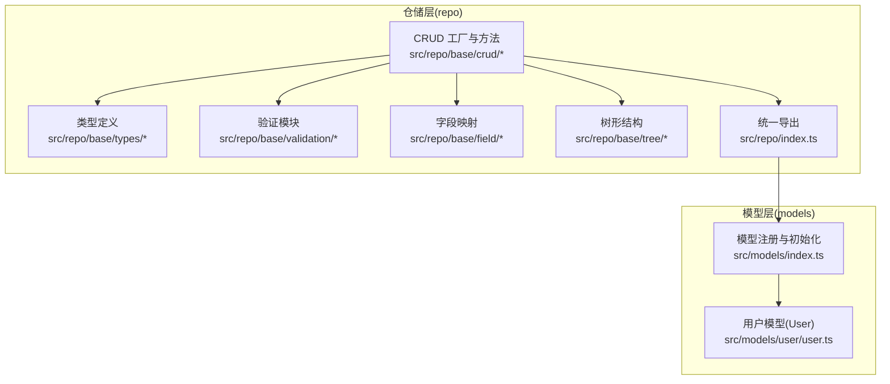
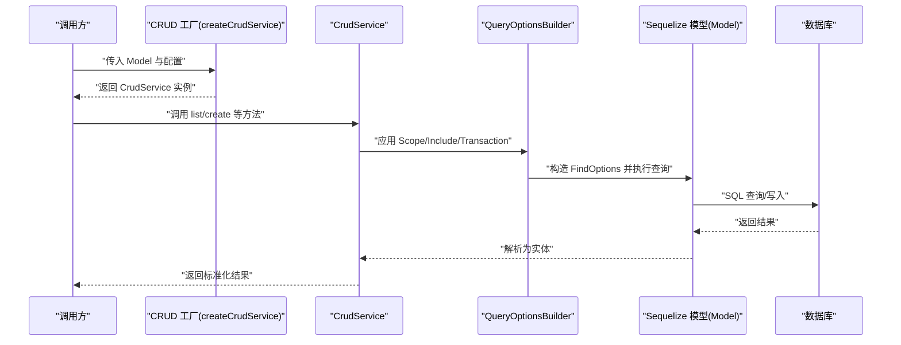
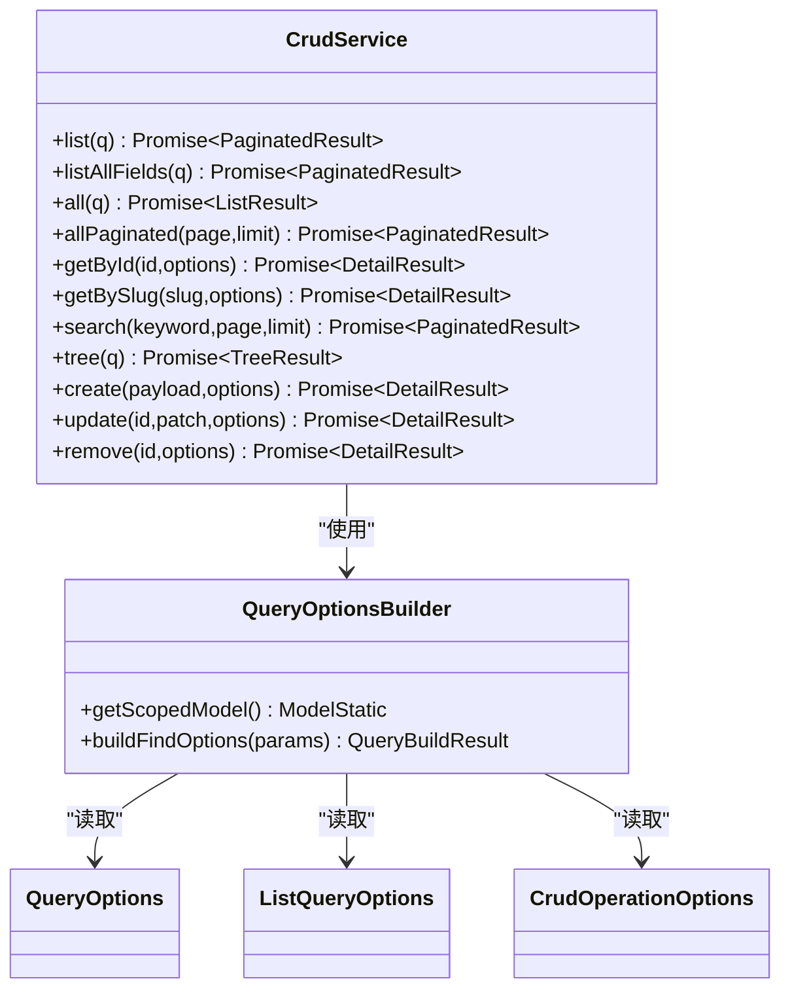
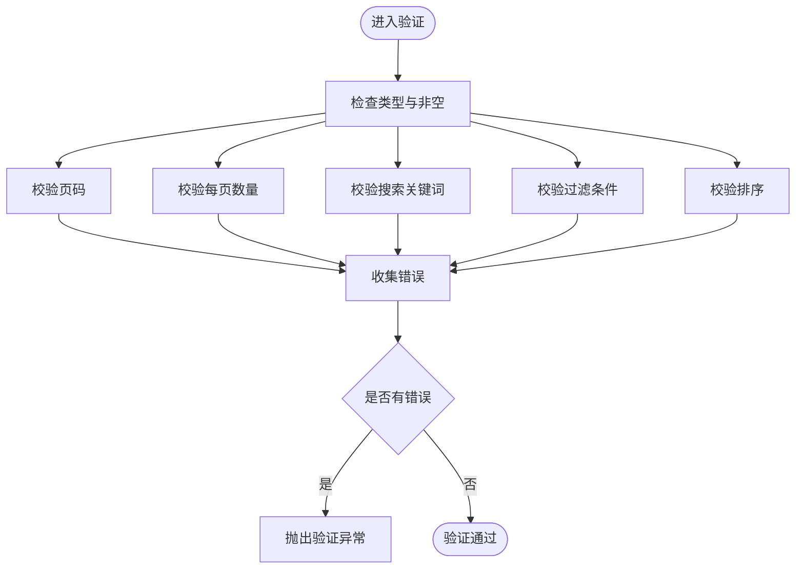
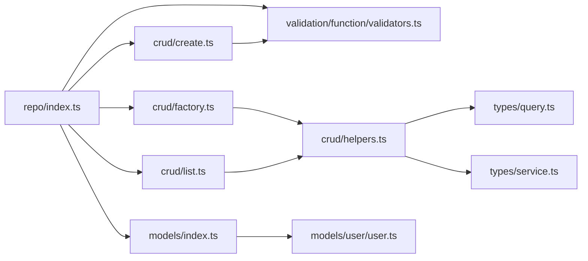

# 数据访问层

<cite>
**本文档引用的文件**
- [src/repo/base/crud/factory.ts](file://src/repo/base/crud/factory.ts)
- [src/repo/base/crud/index.ts](file://src/repo/base/crud/index.ts)
- [src/repo/base/types/service.ts](file://src/repo/base/types/service.ts)
- [src/repo/base/types/query.ts](file://src/repo/base/types/query.ts)
- [src/repo/base/types/results.ts](file://src/repo/base/types/results.ts)
- [src/repo/base/types/config.ts](file://src/repo/base/types/config.ts)
- [src/repo/base/crud/helpers.ts](file://src/repo/base/crud/helpers.ts)
- [src/repo/base/validation/index.ts](file://src/repo/base/validation/index.ts)
- [src/repo/base/validation/function/validators.ts](file://src/repo/base/validation/function/validators.ts)
- [src/repo/base/validation/function/types.ts](file://src/repo/base/validation/function/types.ts)
- [src/repo/base/crud/create.ts](file://src/repo/base/crud/create.ts)
- [src/repo/base/crud/list.ts](file://src/repo/base/crud/list.ts)
- [src/repo/index.ts](file://src/repo/index.ts)
- [src/models/user/user.ts](file://src/models/user/user.ts)
- [src/models/index.ts](file://src/models/index.ts)
</cite>

## 目录
1. [简介](#简介)
2. [项目结构](#项目结构)
3. [核心组件](#核心组件)
4. [架构总览](#架构总览)
5. [详细组件分析](#详细组件分析)
6. [依赖分析](#依赖分析)
7. [性能考虑](#性能考虑)
8. [故障排查指南](#故障排查指南)
9. [结论](#结论)
10. [附录](#附录)

## 简介
本文件面向 IM-API 的数据访问层，系统性阐述通用 CRUD 服务的实现原理、工厂模式的应用、数据验证与输入清理策略、查询优化与数据库连接管理、事务处理与并发控制、与 Sequelize ORM 的集成与配置、性能监控与错误处理机制，以及扩展与自定义实现的最佳实践。目标读者包括需要快速上手与深度定制数据访问层的工程师。

## 项目结构
数据访问层位于 src/repo 目录，采用“按功能域分层 + 工厂聚合”的组织方式：
- base/crud：通用 CRUD 服务与工厂，封装查询、写入、树形结构、搜索等能力
- base/types：服务接口、查询参数、结果结构、配置类型
- base/validation：查询与载荷的验证函数与错误类型
- base/field：字段映射与 DTO 转换
- base/tree：树形结构构建
- index.ts：仓储层统一导出入口

图表来源
- [src/repo/base/crud/index.ts](file://src/repo/base/crud/index.ts#L1-L28)
- [src/repo/base/types/service.ts](file://src/repo/base/types/service.ts#L1-L142)
- [src/repo/base/validation/index.ts](file://src/repo/base/validation/index.ts#L1-L21)
- [src/repo/index.ts](file://src/repo/index.ts#L1-L49)
- [src/models/index.ts](file://src/models/index.ts#L1-L143)
- [src/models/user/user.ts](file://src/models/user/user.ts#L1-L275)

章节来源
- [src/repo/base/crud/index.ts](file://src/repo/base/crud/index.ts#L1-L28)
- [src/repo/index.ts](file://src/repo/index.ts#L1-L49)
- [src/models/index.ts](file://src/models/index.ts#L1-L143)

## 核心组件
- CRUD 服务接口与工厂
  - 通过工厂方法创建统一的 CRUD 服务实例，聚合 list、all、getById、getBySlug、search、tree、create、update、remove 等方法，并支持事务、Scope 与关联查询
- 查询参数与结果结构
  - QueryOptions/ListQueryOptions/CrudOperationOptions 定义分页、搜索、过滤、排序、关联、Scope、事务等查询选项
  - PaginatedResult/ListResult/DetailResult/TreeResult 统一输出结构
- 配置体系
  - CrudConfig/TreeConfig/AssociationConfig/ScopeConfig 描述字段白名单、默认排序、树结构、关联、Scope、过滤字段白名单、字段映射与钩子扩展
- 验证与清理
  - validateQueryOptions/validatePayload 与 predicates 提供查询参数与载荷的结构与取值校验，防止注入与越界
- 辅助工具
  - QueryOptionsBuilder 统一应用 Scope、Include、Transaction，构建 FindOptions；pickDTO、buildIncludeOptions、applyScope 等用于字段裁剪与关联组装

章节来源
- [src/repo/base/types/service.ts](file://src/repo/base/types/service.ts#L22-L128)
- [src/repo/base/crud/factory.ts](file://src/repo/base/crud/factory.ts#L25-L65)
- [src/repo/base/types/query.ts](file://src/repo/base/types/query.ts#L14-L63)
- [src/repo/base/types/results.ts](file://src/repo/base/types/results.ts#L9-L64)
- [src/repo/base/types/config.ts](file://src/repo/base/types/config.ts#L74-L146)
- [src/repo/base/validation/function/validators.ts](file://src/repo/base/validation/function/validators.ts#L5-L76)
- [src/repo/base/crud/helpers.ts](file://src/repo/base/crud/helpers.ts#L175-L238)

## 架构总览
数据访问层围绕“工厂 + 配置 + 辅助工具 + 验证”展开，ORM 层以 Sequelize 为核心，通过模型静态类与实例完成读写操作。事务贯穿写入操作，Scope 与 Include 用于查询增强，QueryOptionsBuilder 把配置与运行时参数统一转化为 Sequelize 查询选项。

图表来源
- [src/repo/base/crud/factory.ts](file://src/repo/base/crud/factory.ts#L25-L65)
- [src/repo/base/crud/helpers.ts](file://src/repo/base/crud/helpers.ts#L175-L238)
- [src/repo/base/crud/list.ts](file://src/repo/base/crud/list.ts#L17-L61)
- [src/repo/base/crud/create.ts](file://src/repo/base/crud/create.ts#L17-L80)

## 详细组件分析

### CRUD 工厂与服务接口
- 工厂职责
  - 聚合 CRUD 方法，暴露统一接口；支持事务透传、Scope 与关联查询
- 服务接口
  - list/all/getById/getBySlug/search/tree：分页/非分页/详情/搜索/树形
  - create/update/remove：写入操作，支持事务
- 关键实现路径
  - 工厂方法与聚合导出：[src/repo/base/crud/factory.ts](file://src/repo/base/crud/factory.ts#L25-L65)
  - 服务接口定义：[src/repo/base/types/service.ts](file://src/repo/base/types/service.ts#L22-L128)

图表来源
- [src/repo/base/types/service.ts](file://src/repo/base/types/service.ts#L22-L128)
- [src/repo/base/crud/helpers.ts](file://src/repo/base/crud/helpers.ts#L175-L238)
- [src/repo/base/types/query.ts](file://src/repo/base/types/query.ts#L14-L63)

章节来源
- [src/repo/base/crud/factory.ts](file://src/repo/base/crud/factory.ts#L25-L65)
- [src/repo/base/types/service.ts](file://src/repo/base/types/service.ts#L22-L128)

### 查询参数与结果结构
- 查询参数
  - QueryOptions：分页、搜索、过滤、排序、关联、Scope、事务
  - ListQueryOptions：非分页列表查询
  - CrudOperationOptions：写入操作事务选项
- 结果结构
  - PaginatedResult：分页数据
  - ListResult：非分页列表
  - DetailResult：单条详情
  - TreeResult：树形节点

章节来源
- [src/repo/base/types/query.ts](file://src/repo/base/types/query.ts#L14-L63)
- [src/repo/base/types/results.ts](file://src/repo/base/types/results.ts#L9-L64)

### 配置体系与扩展点
- CrudConfig
  - 字段白名单：listFields/detailFields/creatableFields/updatableFields
  - 搜索与过滤：searchFields/filterableFields
  - 默认排序：defaultOrder
  - 唯一标识：slugField
  - 树结构：treeConfig
  - 关联与 Scope：associations/scopes
  - 钩子扩展：beforeCreate/beforeUpdate/validateCreate/validateUpdate
  - 字段映射：fieldMappings
- TreeConfig/AssociationConfig/ScopeConfig
  - 树形字段约定、默认/命名关联、Scope 白名单

章节来源
- [src/repo/base/types/config.ts](file://src/repo/base/types/config.ts#L74-L146)

### 验证机制与输入清理
- validateQueryOptions
  - 校验对象结构、页码范围、每页上限、搜索关键词、过滤条件、排序格式
- validatePayload
  - 校验载荷结构与必填字段
- predicates
  - isValidId/isValidPage/isValidLimit/isValidSearch/isValidFilters/isValidOrder
- 清理策略
  - pickDTO 仅保留白名单字段
  - applyScope 过滤非法 Scope 名称
  - buildIncludeOptions 支持命名关联解析与运行时覆盖

图表来源
- [src/repo/base/validation/function/validators.ts](file://src/repo/base/validation/function/validators.ts#L11-L48)
- [src/repo/base/validation/function/types.ts](file://src/repo/base/validation/function/types.ts#L1-L13)

章节来源
- [src/repo/base/validation/index.ts](file://src/repo/base/validation/index.ts#L1-L21)
- [src/repo/base/validation/function/validators.ts](file://src/repo/base/validation/function/validators.ts#L5-L76)
- [src/repo/base/validation/function/types.ts](file://src/repo/base/validation/function/types.ts#L1-L13)

### 查询优化策略与数据库连接管理
- 查询优化
  - 索引设计：模型层定义多处索引，如复合索引、单列索引，提升排序与过滤效率
  - 字段裁剪：通过 listFields/detailFields 控制 SELECT 字段，减少网络与序列化开销
  - 分页与排序：统一的分页与排序构建，避免 N+1 查询（结合 Include 与 Scope）
- 连接管理
  - 通过 Sequelize 实例与 ORM 层管理连接池；仓储层不直接暴露连接，由上层服务或控制器传递事务
- 事务与并发控制
  - 写入操作支持事务透传；事务内并发冲突由数据库层面的锁与隔离级别保障

章节来源
- [src/models/user/user.ts](file://src/models/user/user.ts#L238-L251)
- [src/repo/base/crud/helpers.ts](file://src/repo/base/crud/helpers.ts#L128-L151)
- [src/repo/base/types/query.ts](file://src/repo/base/types/query.ts#L57-L63)

### 事务处理与并发控制
- 事务透传
  - 所有写入操作（create/update/remove）接收 CrudOperationOptions，内部将 transaction 透传给 ORM
- 并发控制
  - 由数据库层的锁与事务隔离级别保障一致性；仓储层不引入额外并发锁
- 事务使用建议
  - 在服务层开启事务，批量写入时复用同一事务对象，确保原子性

章节来源
- [src/repo/base/types/query.ts](file://src/repo/base/types/query.ts#L57-L63)
- [src/repo/base/crud/create.ts](file://src/repo/base/crud/create.ts#L67-L74)

### 与 Sequelize ORM 的集成与配置
- 模型初始化与注册
  - 统一在 models/index.ts 中初始化与关联模型，提供 modelRegistry 便于通用 CRUD 与动态路由
- 模型示例
  - User 模型定义字段、默认/带密文 Scope、索引与钩子；提供认证与序列化安全
- 集成要点
  - 通过 ModelStatic 与实例方法执行查询与写入
  - QueryOptionsBuilder 统一应用 Scope 与 Include，避免重复逻辑

章节来源
- [src/models/index.ts](file://src/models/index.ts#L1-L143)
- [src/models/user/user.ts](file://src/models/user/user.ts#L1-L275)
- [src/repo/base/crud/helpers.ts](file://src/repo/base/crud/helpers.ts#L175-L238)

### 性能监控与错误处理
- 性能监控
  - ORM 层支持 benchmark 选项（创建时可启用），用于开发阶段的 SQL 性能观测
- 错误处理
  - 验证失败抛出 CrudValidationError，包含字段、消息与原始值
  - 上层服务捕获并转换为统一的 API 错误响应

章节来源
- [src/repo/base/crud/create.ts](file://src/repo/base/crud/create.ts#L71-L74)
- [src/repo/base/validation/function/validators.ts](file://src/repo/base/validation/function/validators.ts#L1-L76)

### 使用示例与最佳实践
- 创建 CRUD 服务
  - 使用工厂方法传入模型与配置，获得统一服务接口
- 查询与写入
  - 列表/详情/搜索/树形：使用 QueryOptions；写入：使用 CrudOperationOptions 透传事务
- 字段白名单与安全
  - 通过 CrudConfig 的 creatableFields/updatableFields 限制可写字段；使用 pickDTO 进行白名单过滤
- 关联与 Scope
  - 通过 associations.namedIncludes 与 scopes.availableScopes 精准控制查询范围
- 最佳实践
  - 在服务层开启事务，批量写入复用事务对象
  - 使用默认排序与索引配合，避免全表扫描
  - 严格使用验证器与白名单，杜绝注入风险

章节来源
- [src/repo/base/crud/factory.ts](file://src/repo/base/crud/factory.ts#L25-L65)
- [src/repo/base/types/config.ts](file://src/repo/base/types/config.ts#L74-L146)
- [src/repo/base/validation/function/validators.ts](file://src/repo/base/validation/function/validators.ts#L57-L76)

## 依赖分析
仓储层与模型层的依赖关系清晰：仓储层通过工厂与配置依赖模型层的静态类与实例；验证与辅助工具为 CRUD 方法提供横切能力。

图表来源
- [src/repo/index.ts](file://src/repo/index.ts#L16-L49)
- [src/repo/base/crud/factory.ts](file://src/repo/base/crud/factory.ts#L1-L66)
- [src/repo/base/crud/list.ts](file://src/repo/base/crud/list.ts#L1-L62)
- [src/repo/base/crud/create.ts](file://src/repo/base/crud/create.ts#L1-L81)
- [src/repo/base/validation/function/validators.ts](file://src/repo/base/validation/function/validators.ts#L1-L76)
- [src/repo/base/crud/helpers.ts](file://src/repo/base/crud/helpers.ts#L1-L238)
- [src/repo/base/types/query.ts](file://src/repo/base/types/query.ts#L1-L64)
- [src/repo/base/types/service.ts](file://src/repo/base/types/service.ts#L1-L142)
- [src/models/index.ts](file://src/models/index.ts#L1-L143)
- [src/models/user/user.ts](file://src/models/user/user.ts#L1-L275)

章节来源
- [src/repo/index.ts](file://src/repo/index.ts#L1-L49)
- [src/models/index.ts](file://src/models/index.ts#L1-L143)

## 性能考虑
- 查询层面
  - 使用索引与合理的默认排序，避免全表扫描
  - 通过字段白名单裁剪 SELECT，降低序列化与网络开销
- 写入层面
  - 批量写入复用事务，减少提交次数
  - 使用字段白名单与验证器，减少无效写入
- ORM 层面
  - 在开发阶段可启用 benchmark 观察慢查询
- 缓存与降载
  - 对热点查询可结合上层缓存策略（如 Redis），仓储层保持无状态

## 故障排查指南
- 常见问题
  - 查询参数非法：validateQueryOptions 会抛出验证异常，检查页码、每页数量、过滤与排序格式
  - 载荷缺失字段：validatePayload 会提示缺失的必填字段
  - ID 非法：assertValidId 会在 ID 非法时抛出验证异常
  - Scope/Include 非法：applyScope/buildIncludeOptions 会过滤无效项或返回默认配置
- 处理建议
  - 在服务层捕获 CrudValidationError，转换为 API 错误响应
  - 对事务内的错误，回滚事务并记录日志
  - 使用模型索引与查询计划分析慢查询

章节来源
- [src/repo/base/validation/function/validators.ts](file://src/repo/base/validation/function/validators.ts#L11-L76)
- [src/repo/base/crud/helpers.ts](file://src/repo/base/crud/helpers.ts#L63-L78)
- [src/repo/base/types/query.ts](file://src/repo/base/types/query.ts#L57-L63)

## 结论
数据访问层以工厂模式聚合通用 CRUD 能力，结合配置驱动与验证清理，形成高内聚、低耦合、可扩展的数据访问抽象。通过与 Sequelize 的深度集成、统一的查询构建器与事务透传，既能满足快速开发，也能支撑高性能与高可靠性的生产需求。建议在实际项目中遵循字段白名单、事务批处理、索引与排序优化等最佳实践，并在服务层完善错误处理与监控。

## 附录
- 统一导出入口
  - 仓储层通过 repo/index.ts 汇总导出 CRUD、验证、树形、字段映射与类型，便于上层按需导入
- 模型注册表
  - modelRegistry 提供模型名称到静态类的映射，支持通用 CRUD 与动态路由场景

章节来源
- [src/repo/index.ts](file://src/repo/index.ts#L1-L49)
- [src/models/index.ts](file://src/models/index.ts#L85-L101)