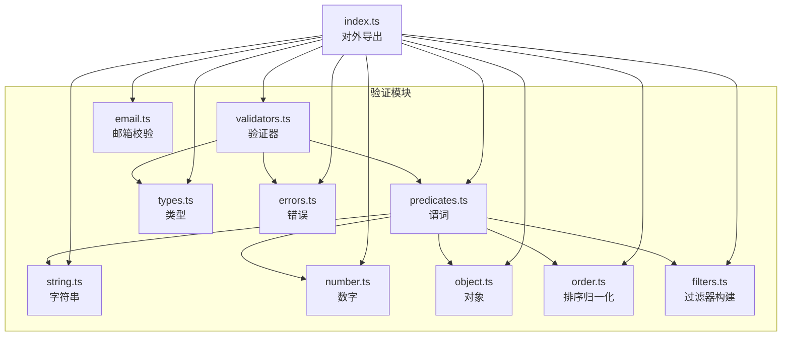
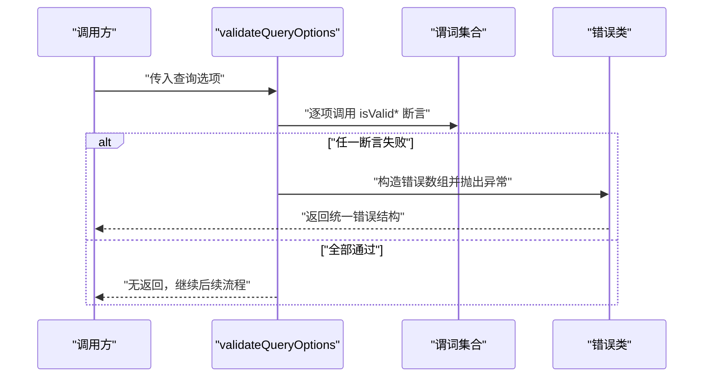
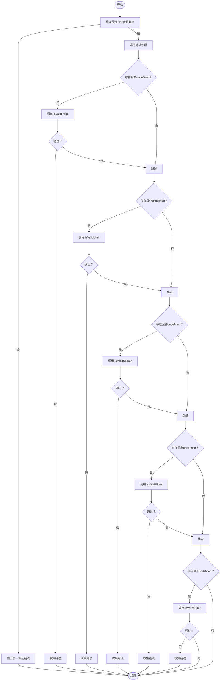
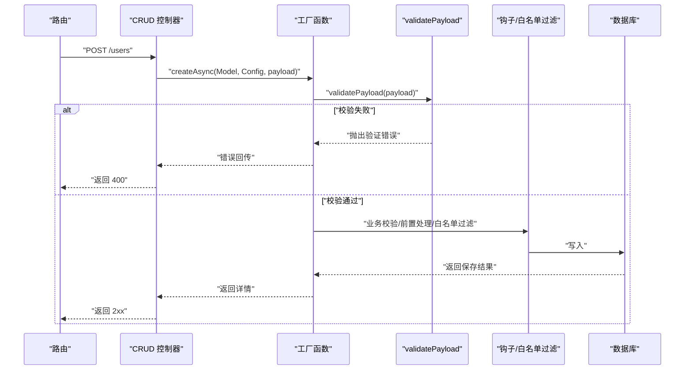
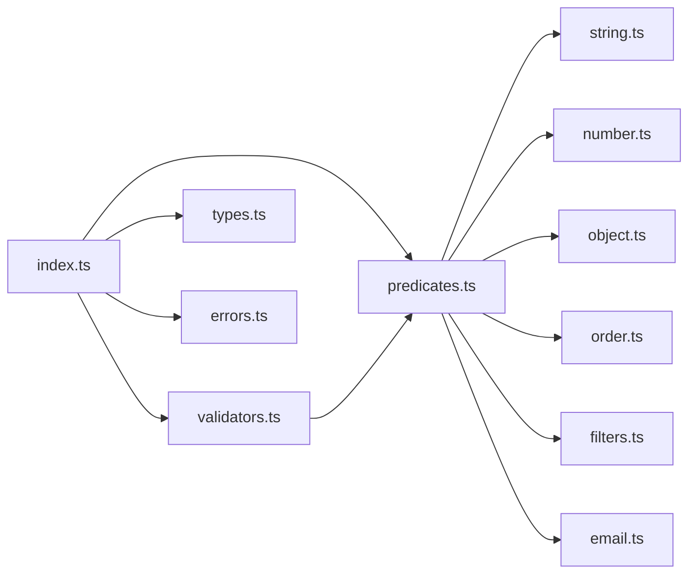

# 数据验证机制

<cite>
**本文引用的文件**
- [src/repo/base/validation/index.ts](file://src/repo/base/validation/index.ts)
- [src/repo/base/validation/function/validators.ts](file://src/repo/base/validation/function/validators.ts)
- [src/repo/base/validation/function/predicates.ts](file://src/repo/base/validation/function/predicates.ts)
- [src/repo/base/validation/function/types.ts](file://src/repo/base/validation/function/types.ts)
- [src/repo/base/validation/function/errors.ts](file://src/repo/base/validation/function/errors.ts)
- [src/repo/base/validation/function/string.ts](file://src/repo/base/validation/function/string.ts)
- [src/repo/base/validation/function/number.ts](file://src/repo/base/validation/function/number.ts)
- [src/repo/base/validation/function/object.ts](file://src/repo/base/validation/function/object.ts)
- [src/repo/base/validation/function/order.ts](file://src/repo/base/validation/function/order.ts)
- [src/repo/base/validation/function/filters.ts](file://src/repo/base/validation/function/filters.ts)
- [src/repo/base/validation/function/email.ts](file://src/repo/base/validation/function/email.ts)
- [src/repo/base/crud/create.ts](file://src/repo/base/crud/create.ts)
- [src/repo/base/crud/update.ts](file://src/repo/base/crud/update.ts)
- [src/routes/admin/user.ts](file://src/routes/admin/user.ts)
- [src/middleware/request/app.ts](file://src/middleware/request/app.ts)
</cite>

## 目录
1. [引言](#引言)
2. [项目结构](#项目结构)
3. [核心组件](#核心组件)
4. [架构总览](#架构总览)
5. [详细组件分析](#详细组件分析)
6. [依赖关系分析](#依赖关系分析)
7. [性能考量](#性能考量)
8. [故障排查指南](#故障排查指南)
9. [结论](#结论)
10. [附录](#附录)

## 引言
本文件系统性阐述 IM-API 的数据验证机制，覆盖验证器的架构设计、组织结构与调用流程，以及字符串、邮箱、对象、数字等类型的具体验证规则。文档还说明验证谓词（predicates）的作用与组合方式，给出自定义验证器的开发与扩展指南，并通过 CRUD 操作集成示例展示如何在实际业务中落地验证策略。

## 项目结构
验证模块位于仓库的“基础能力层”，对外仅暴露查询相关验证函数与类型，内部以“谓词 + 验证器”的分层组织方式实现高内聚、低耦合的校验体系。核心文件分布如下：
- 外部入口：统一导出查询相关验证函数与错误类型
- 谓词层：针对具体数据类型的断言函数（如字符串、数字、对象、排序、过滤器等）
- 验证器层：面向业务场景的组合式校验函数（如查询选项、载荷）
- 辅助工具：排序归一化、过滤器构建、邮箱规范化与校验
- 集成点：CRUD 工厂函数在创建/更新流程中直接调用验证器

图表来源
- [src/repo/base/validation/index.ts](file://src/repo/base/validation/index.ts#L1-L21)
- [src/repo/base/validation/function/validators.ts](file://src/repo/base/validation/function/validators.ts#L1-L76)
- [src/repo/base/validation/function/predicates.ts](file://src/repo/base/validation/function/predicates.ts#L1-L74)
- [src/repo/base/validation/function/types.ts](file://src/repo/base/validation/function/types.ts#L1-L13)
- [src/repo/base/validation/function/errors.ts](file://src/repo/base/validation/function/errors.ts#L1-L22)
- [src/repo/base/validation/function/string.ts](file://src/repo/base/validation/function/string.ts#L1-L18)
- [src/repo/base/validation/function/number.ts](file://src/repo/base/validation/function/number.ts#L1-L44)
- [src/repo/base/validation/function/object.ts](file://src/repo/base/validation/function/object.ts#L1-L3)
- [src/repo/base/validation/function/order.ts](file://src/repo/base/validation/function/order.ts#L1-L53)
- [src/repo/base/validation/function/filters.ts](file://src/repo/base/validation/function/filters.ts#L1-L76)
- [src/repo/base/validation/function/email.ts](file://src/repo/base/validation/function/email.ts#L1-L114)

章节来源
- [src/repo/base/validation/index.ts](file://src/repo/base/validation/index.ts#L1-L21)

## 核心组件
- 验证器（Validators）
  - 查询选项校验：对 page、limit、search、filters、order 等字段进行类型与取值范围校验
  - 载荷校验：对必填字段进行存在性与空值校验
- 谓词（Predicates）
  - 针对 ID、页码、每页条数、搜索词、过滤器、排序等的断言函数
- 辅助工具
  - 排序归一化：将多种输入形式统一为标准化元组序列
  - 过滤器构建：从查询参数字符串或对象构建 filters 结构
  - 邮箱规范化与校验：长度、本地部分、域名、TLD 等规则
- 错误模型
  - 统一的验证错误类，携带字段、消息与原始值，便于前端与日志消费

章节来源
- [src/repo/base/validation/function/validators.ts](file://src/repo/base/validation/function/validators.ts#L1-L76)
- [src/repo/base/validation/function/predicates.ts](file://src/repo/base/validation/function/predicates.ts#L1-L74)
- [src/repo/base/validation/function/order.ts](file://src/repo/base/validation/function/order.ts#L1-L53)
- [src/repo/base/validation/function/filters.ts](file://src/repo/base/validation/function/filters.ts#L1-L76)
- [src/repo/base/validation/function/email.ts](file://src/repo/base/validation/function/email.ts#L1-L114)
- [src/repo/base/validation/function/errors.ts](file://src/repo/base/validation/function/errors.ts#L1-L22)
- [src/repo/base/validation/function/types.ts](file://src/repo/base/validation/function/types.ts#L1-L13)

## 架构总览
验证系统采用“分层 + 组合”的设计：
- 分层：谓词负责单一类型/规则的断言；验证器负责跨字段的组合校验
- 组合：验证器内部通过谓词组合实现复杂规则；错误统一由错误类承载
- 集成：CRUD 工厂在创建/更新阶段调用验证器，确保数据进入持久层前被严格校验

图表来源
- [src/repo/base/validation/function/validators.ts](file://src/repo/base/validation/function/validators.ts#L11-L48)
- [src/repo/base/validation/function/predicates.ts](file://src/repo/base/validation/function/predicates.ts#L1-L74)
- [src/repo/base/validation/function/errors.ts](file://src/repo/base/validation/function/errors.ts#L10-L20)

## 详细组件分析

### 查询选项验证器（validateQueryOptions）
职责：对 page、limit、search、filters、order 等字段进行类型与取值范围校验；若存在错误，统一抛出验证异常。
- 输入：未知对象
- 校验逻辑要点：
  - page：正整数
  - limit：1~200 的整数
  - search：字符串
  - filters：非空对象
  - order：字符串或二维字符串数组（字段+方向）
- 错误聚合：收集所有错误后一次性抛出

图表来源
- [src/repo/base/validation/function/validators.ts](file://src/repo/base/validation/function/validators.ts#L11-L48)
- [src/repo/base/validation/function/predicates.ts](file://src/repo/base/validation/function/predicates.ts#L18-L74)

章节来源
- [src/repo/base/validation/function/validators.ts](file://src/repo/base/validation/function/validators.ts#L11-L48)

### 载荷验证器（validatePayload）
职责：对提交的业务载荷进行必填字段校验；若缺失或为空，统一抛出验证异常。
- 输入：未知对象、必填字段数组
- 校验逻辑要点：
  - 载荷必须为对象且非空
  - 遍历必填字段，若不存在、为 undefined 或 null，则视为缺失

章节来源
- [src/repo/base/validation/function/validators.ts](file://src/repo/base/validation/function/validators.ts#L57-L76)

### 谓词（Predicates）与数据类型规则
- 字符串
  - 非空字符串：去除首尾空白后长度大于 0
- 数字
  - 整数：number 类型且为有限整数
  - 正整数：大于 0 的整数
  - 指定范围整数：闭区间 [min, max] 内的整数
- 对象
  - 非空普通对象：非数组、非 null、键数大于 0
- 排序（order）
  - 支持字符串、字符串数组、二维元组数组（字段+方向）
  - 方向统一归一化为 ASC/DESC
- 过滤器（filters）
  - 支持 key[op]=value、key.op=value 等语法
  - in/notIn 自动解析为数组
- 邮箱（email）
  - 规范化：去空白、转小写
  - 校验：长度、本地部分字符集与边界、域名标签合法性、TLD 至少两位字母

章节来源
- [src/repo/base/validation/function/string.ts](file://src/repo/base/validation/function/string.ts#L15-L17)
- [src/repo/base/validation/function/number.ts](file://src/repo/base/validation/function/number.ts#L15-L43)
- [src/repo/base/validation/function/object.ts](file://src/repo/base/validation/function/object.ts#L1-L3)
- [src/repo/base/validation/function/predicates.ts](file://src/repo/base/validation/function/predicates.ts#L1-L74)
- [src/repo/base/validation/function/order.ts](file://src/repo/base/validation/function/order.ts#L1-L53)
- [src/repo/base/validation/function/filters.ts](file://src/repo/base/validation/function/filters.ts#L1-L76)
- [src/repo/base/validation/function/email.ts](file://src/repo/base/validation/function/email.ts#L1-L114)

### 排序归一化（normalizeOrder）
- 功能：将多种输入形式（逗号分隔、冒号/空格分隔、前缀 +/-）统一为标准化元组数组
- 输出：每个元素为 [field, "ASC"|"DESC"] 的只读元组

章节来源
- [src/repo/base/validation/function/order.ts](file://src/repo/base/validation/function/order.ts#L8-L53)

### 过滤器构建（buildFiltersFromString）
- 功能：从查询参数字符串或对象构建 filters 结构
- 特性：支持 key[op]=value、key.op=value；自动处理 in/notIn 列表；合并嵌套操作符

章节来源
- [src/repo/base/validation/function/filters.ts](file://src/repo/base/validation/function/filters.ts#L8-L76)

### 邮箱规范化与校验（normalizeAndValidateEmail）
- 功能：规范化并校验邮箱地址，满足长度、本地部分、域名与 TLD 规则
- 输出：规范化后的邮箱或 null

章节来源
- [src/repo/base/validation/function/email.ts](file://src/repo/base/validation/function/email.ts#L11-L36)

### 错误模型（CrudValidationError）
- 结构：包含字段、消息、原始值的错误数组，状态码默认 400
- 行为：构造时拼接错误消息，便于统一处理与上报

章节来源
- [src/repo/base/validation/function/errors.ts](file://src/repo/base/validation/function/errors.ts#L10-L20)
- [src/repo/base/validation/function/types.ts](file://src/repo/base/validation/function/types.ts#L9-L13)

### 在 CRUD 中的集成
- 创建（createAsync）
  - 调用 validatePayload 校验载荷结构
  - 支持业务级校验钩子与前置处理钩子
  - 白名单字段过滤后持久化
- 更新（updateAsync）
  - 先断言 ID 合法，再校验载荷
  - 支持业务级校验与前置处理钩子
  - 按 updatableFields 白名单过滤后更新

图表来源
- [src/repo/base/crud/create.ts](file://src/repo/base/crud/create.ts#L37-L80)
- [src/repo/base/crud/update.ts](file://src/repo/base/crud/update.ts#L39-L65)
- [src/repo/base/validation/function/validators.ts](file://src/repo/base/validation/function/validators.ts#L57-L76)

章节来源
- [src/repo/base/crud/create.ts](file://src/repo/base/crud/create.ts#L1-L81)
- [src/repo/base/crud/update.ts](file://src/repo/base/crud/update.ts#L1-L66)

## 依赖关系分析
- 外部导出：index.ts 仅导出查询相关验证函数与类型，保持 API 稳定与清晰
- 内部耦合：验证器依赖谓词；谓词进一步依赖字符串、数字、对象等基础断言
- 集成耦合：CRUD 工厂直接依赖验证器，形成稳定的控制流

图表来源
- [src/repo/base/validation/index.ts](file://src/repo/base/validation/index.ts#L8-L19)
- [src/repo/base/validation/function/validators.ts](file://src/repo/base/validation/function/validators.ts#L1-L3)
- [src/repo/base/validation/function/predicates.ts](file://src/repo/base/validation/function/predicates.ts#L1-L2)

章节来源
- [src/repo/base/validation/index.ts](file://src/repo/base/validation/index.ts#L1-L21)

## 性能考量
- 谓词与验证器均为纯函数，避免副作用，便于缓存与复用
- 排序与过滤器构建采用一次遍历与简单正则匹配，时间复杂度与输入规模线性相关
- 错误聚合避免多次异常抛出，减少上下文切换开销
- 建议在高频路径中复用已构建的 filters 与 order，减少重复解析

## 故障排查指南
- 常见错误类型
  - 查询选项类型不符：检查 page/limit/search/filters/order 的类型与取值范围
  - 载荷必填字段缺失：确认 requiredFields 与请求体字段映射
  - 排序格式不合法：确保使用支持的字符串/数组/元组形式
  - 过滤器语法错误：核对 key[op]=value 与 key.op= 的写法
  - 邮箱格式错误：检查长度、本地部分字符集与域名标签
- 定位步骤
  - 查看错误数组中的字段与消息
  - 核对输入值类型与范围
  - 使用排序与过滤器构建函数进行最小化复现
- 建议
  - 在中间件层打印请求体摘要（脱敏）辅助定位
  - 对关键验证器增加单元测试覆盖边界条件

章节来源
- [src/repo/base/validation/function/errors.ts](file://src/repo/base/validation/function/errors.ts#L10-L20)
- [src/repo/base/validation/function/validators.ts](file://src/repo/base/validation/function/validators.ts#L11-L76)
- [src/repo/base/validation/function/order.ts](file://src/repo/base/validation/function/order.ts#L8-L53)
- [src/repo/base/validation/function/filters.ts](file://src/repo/base/validation/function/filters.ts#L8-L76)
- [src/repo/base/validation/function/email.ts](file://src/repo/base/validation/function/email.ts#L11-L36)

## 结论
该验证机制以“谓词 + 验证器”为核心，实现了对查询选项与业务载荷的强约束与可组合校验。通过统一错误模型与在 CRUD 工厂中的无缝集成，保证了数据质量与系统稳定性。建议在新增业务时优先复用现有谓词与验证器，必要时按需扩展新的断言与校验逻辑，保持一致的错误风格与性能特征。

## 附录

### 自定义验证器开发指南
- 设计原则
  - 单一职责：每个验证器聚焦一类业务规则
  - 可组合：优先调用已有谓词，避免重复实现
  - 易测试：保持纯函数特性，便于编写单元测试
- 开发步骤
  - 在 function 目录下新增文件，定义断言函数（谓词）
  - 在 validators.ts 中新增组合式验证器
  - 在 index.ts 中对外导出新函数
  - 编写测试用例覆盖边界与异常分支
- 示例思路
  - 新增“手机号”验证：先用字符串谓词，再用正则与长度校验
  - 新增“价格区间”验证：基于数字谓词，校验 min/max 关系

章节来源
- [src/repo/base/validation/function/validators.ts](file://src/repo/base/validation/function/validators.ts#L11-L76)
- [src/repo/base/validation/function/predicates.ts](file://src/repo/base/validation/function/predicates.ts#L1-L74)
- [src/repo/base/validation/index.ts](file://src/repo/base/validation/index.ts#L8-L19)

### 集成示例与最佳实践
- 在路由层捕获验证异常并返回统一格式
- 在中间件层对请求头（如 x-app-id）进行校验与注入，减少控制器负担
- 在 CRUD 工厂中优先使用 validatePayload，再接入业务钩子，确保顺序正确

章节来源
- [src/routes/admin/user.ts](file://src/routes/admin/user.ts#L33-L37)
- [src/middleware/request/app.ts](file://src/middleware/request/app.ts#L56-L62)
- [src/repo/base/crud/create.ts](file://src/repo/base/crud/create.ts#L44-L52)
- [src/repo/base/crud/update.ts](file://src/repo/base/crud/update.ts#L41-L53)