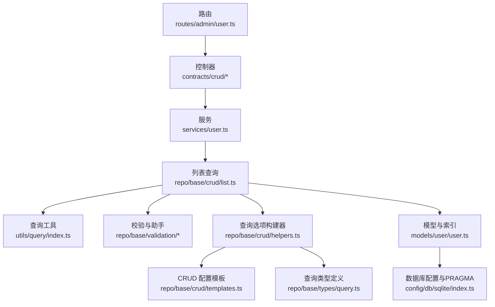
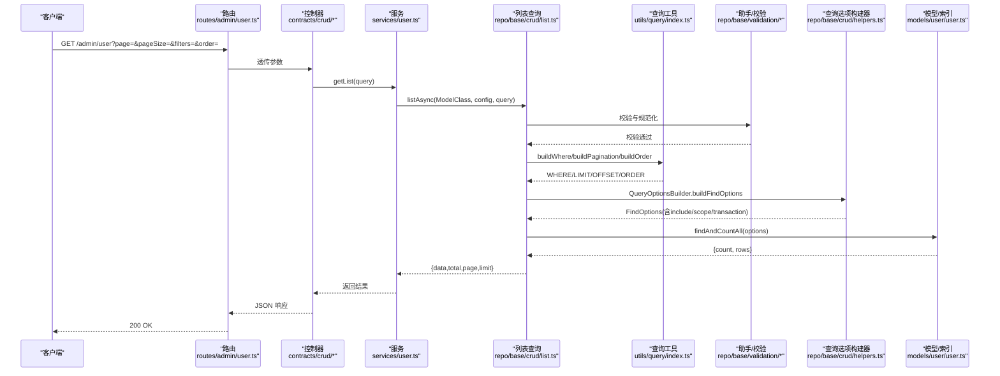
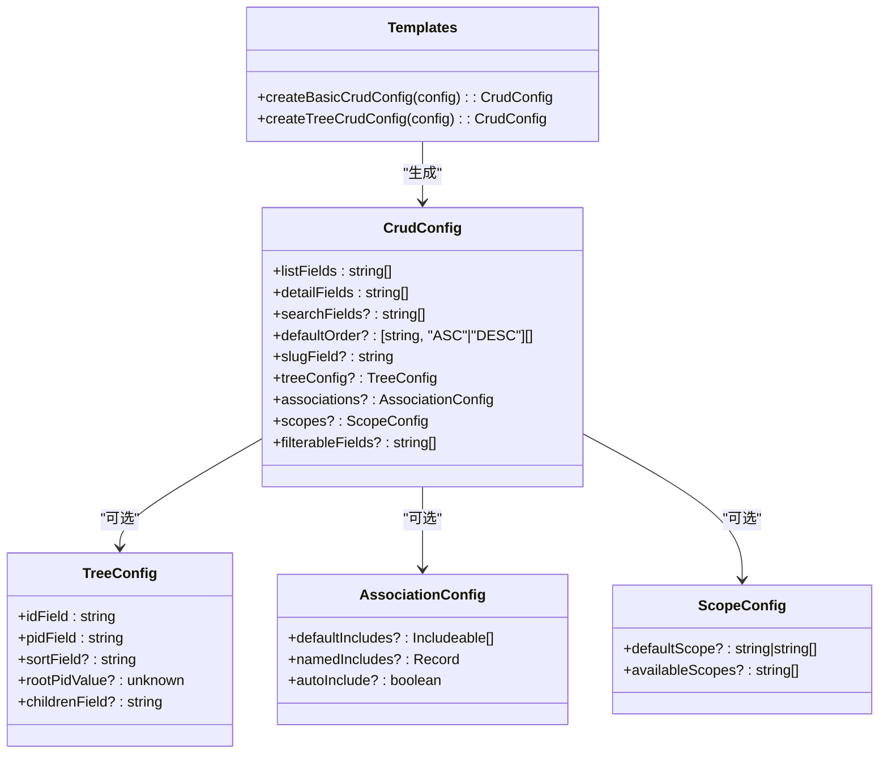
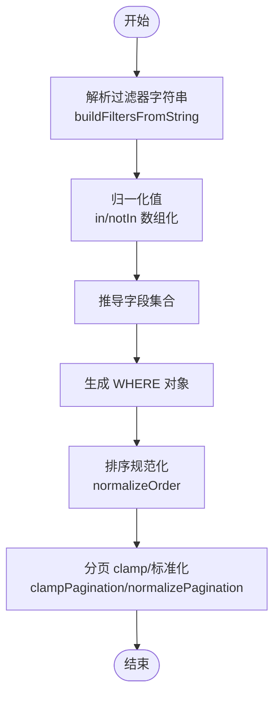
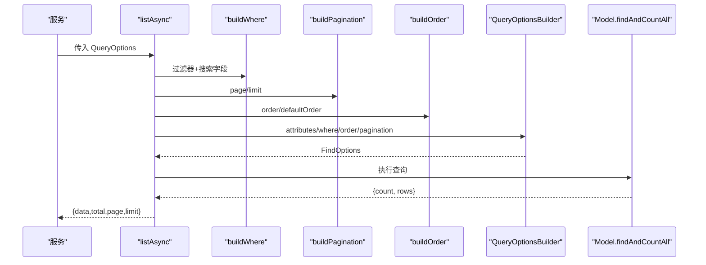
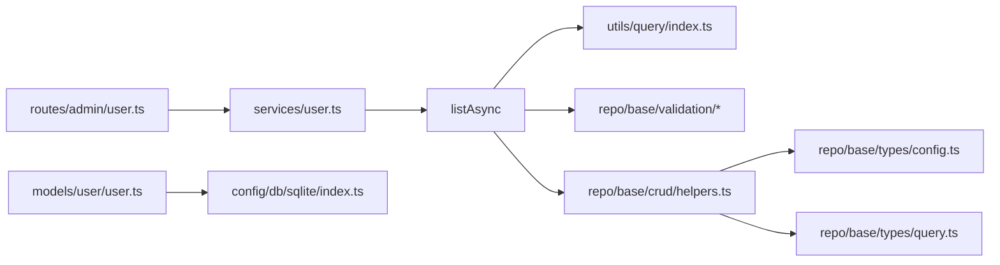
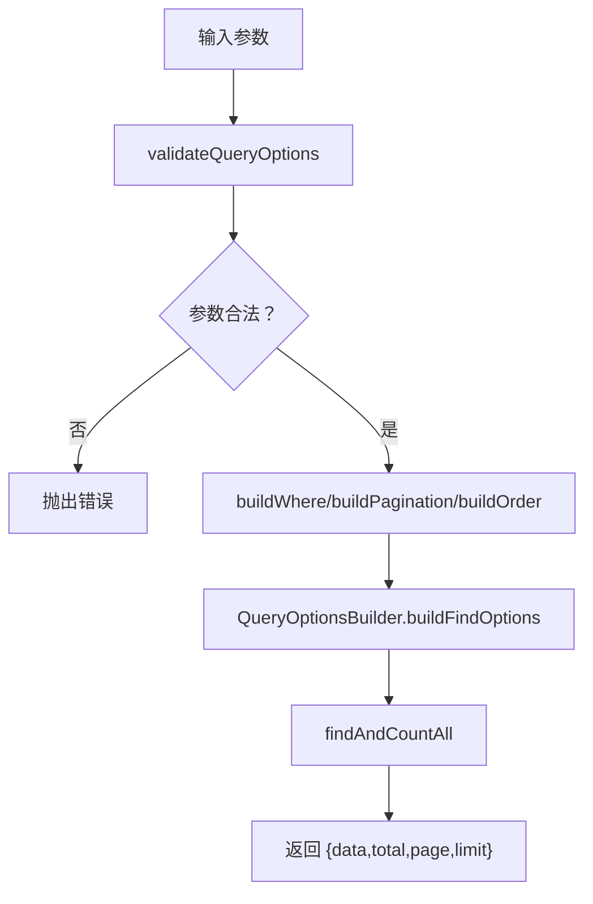

# 查询优化策略

<cite>
**本文档引用的文件**
- [src/repo/base/crud/templates.ts](file://src/repo/base/crud/templates.ts)
- [src/repo/base/validation/function/filters.ts](file://src/repo/base/validation/function/filters.ts)
- [src/repo/base/validation/function/order.ts](file://src/repo/base/validation/function/order.ts)
- [src/middleware/request/pagination.ts](file://src/middleware/request/pagination.ts)
- [src/utils/query/index.ts](file://src/utils/query/index.ts)
- [src/repo/base/types/query.ts](file://src/repo/base/types/query.ts)
- [src/repo/base/validation/function/predicates.ts](file://src/repo/base/validation/function/predicates.ts)
- [src/repo/base/crud/list.ts](file://src/repo/base/crud/list.ts)
- [src/models/user/user.ts](file://src/models/user/user.ts)
- [src/repo/base/crud/helpers.ts](file://src/repo/base/crud/helpers.ts)
- [src/repo/base/types/config.ts](file://src/repo/base/types/config.ts)
- [src/repo/base/validation/function/validators.ts](file://src/repo/base/validation/function/validators.ts)
- [src/repo/base/crud/constants.ts](file://src/repo/base/crud/constants.ts)
- [src/config/db/sqlite/index.ts](file://src/config/db/sqlite/index.ts)
- [src/services/user.ts](file://src/services/user.ts)
- [src/routes/admin/user.ts](file://src/routes/admin/user.ts)
</cite>

## 目录
1. [简介](#简介)
2. [项目结构](#项目结构)
3. [核心组件](#核心组件)
4. [架构总览](#架构总览)
5. [详细组件分析](#详细组件分析)
6. [依赖分析](#依赖分析)
7. [性能考虑](#性能考虑)
8. [故障排查指南](#故障排查指南)
9. [结论](#结论)
10. [附录](#附录)

## 简介
本文件面向 IM-API 的查询优化策略，系统性阐述查询模板系统、查询助手函数、查询结果处理机制（分页、排序、过滤、搜索），以及基于现有代码实现的性能优化最佳实践与案例。文档以代码为依据，结合可视化图示帮助读者快速理解并落地优化方案。

## 项目结构
IM-API 的查询体系围绕“路由 -> 控制器 -> 服务 -> CRUD 基座 -> 查询工具 -> 模型”展开，形成清晰的职责分层：
- 路由与控制器负责请求接入与参数透传；
- 服务层通过通用 CRUD 配置驱动查询；
- CRUD 基座封装分页、排序、过滤、Scope/Include 等通用能力；
- 查询工具提供 WHERE、ORDER、LIMIT/OFFSET 的构建；
- 模型层定义字段、索引与 Scope，支撑高效查询。

图表来源
- [src/routes/admin/user.ts](file://src/routes/admin/user.ts#L1-L40)
- [src/services/user.ts](file://src/services/user.ts#L1-L60)
- [src/repo/base/crud/list.ts](file://src/repo/base/crud/list.ts#L1-L62)
- [src/utils/query/index.ts](file://src/utils/query/index.ts#L1-L132)
- [src/repo/base/validation/function/filters.ts](file://src/repo/base/validation/function/filters.ts#L1-L76)
- [src/repo/base/validation/function/order.ts](file://src/repo/base/validation/function/order.ts#L1-L53)
- [src/repo/base/crud/helpers.ts](file://src/repo/base/crud/helpers.ts#L1-L238)
- [src/repo/base/crud/templates.ts](file://src/repo/base/crud/templates.ts#L1-L52)
- [src/repo/base/types/query.ts](file://src/repo/base/types/query.ts#L1-L64)
- [src/models/user/user.ts](file://src/models/user/user.ts#L1-L275)
- [src/config/db/sqlite/index.ts](file://src/config/db/sqlite/index.ts#L136-L207)

章节来源
- [src/routes/admin/user.ts](file://src/routes/admin/user.ts#L1-L40)
- [src/services/user.ts](file://src/services/user.ts#L1-L60)
- [src/repo/base/crud/list.ts](file://src/repo/base/crud/list.ts#L1-L62)
- [src/utils/query/index.ts](file://src/utils/query/index.ts#L1-L132)
- [src/repo/base/crud/helpers.ts](file://src/repo/base/crud/helpers.ts#L1-L238)
- [src/repo/base/crud/templates.ts](file://src/repo/base/crud/templates.ts#L1-L52)
- [src/repo/base/types/query.ts](file://src/repo/base/types/query.ts#L1-L64)
- [src/models/user/user.ts](file://src/models/user/user.ts#L1-L275)
- [src/config/db/sqlite/index.ts](file://src/config/db/sqlite/index.ts#L136-L207)

## 核心组件
- 查询模板系统：提供树形结构与基础 CRUD 配置模板，统一 listFields/detailFields/defaultOrder/slugField 等关键字段，便于复用与扩展。
- 查询助手函数：过滤器解析、排序规范化、分页参数标准化与 clamp、查询选项构建器等，保障输入安全与输出一致。
- 查询工具：WHERE 条件构建、分页参数构建、排序参数构建，屏蔽底层 ORM 差异。
- 查询结果处理：列表查询返回 total/page/limit/data，支持 include/scope/transaction 等高级特性。
- 模型与索引：模型定义中声明索引与 Scope，为查询优化提供基础。

章节来源
- [src/repo/base/crud/templates.ts](file://src/repo/base/crud/templates.ts#L12-L51)
- [src/repo/base/validation/function/filters.ts](file://src/repo/base/validation/function/filters.ts#L8-L76)
- [src/repo/base/validation/function/order.ts](file://src/repo/base/validation/function/order.ts#L8-L53)
- [src/middleware/request/pagination.ts](file://src/middleware/request/pagination.ts#L78-L124)
- [src/utils/query/index.ts](file://src/utils/query/index.ts#L33-L129)
- [src/repo/base/crud/list.ts](file://src/repo/base/crud/list.ts#L35-L61)
- [src/models/user/user.ts](file://src/models/user/user.ts#L238-L251)

## 架构总览
下图展示一次典型列表查询的端到端流程，从路由到数据库执行的关键步骤与组件交互。

图表来源
- [src/routes/admin/user.ts](file://src/routes/admin/user.ts#L33-L37)
- [src/services/user.ts](file://src/services/user.ts#L40-L57)
- [src/repo/base/crud/list.ts](file://src/repo/base/crud/list.ts#L35-L61)
- [src/utils/query/index.ts](file://src/utils/query/index.ts#L33-L129)
- [src/repo/base/validation/function/filters.ts](file://src/repo/base/validation/function/filters.ts#L8-L76)
- [src/repo/base/validation/function/order.ts](file://src/repo/base/validation/function/order.ts#L8-L53)
- [src/repo/base/crud/helpers.ts](file://src/repo/base/crud/helpers.ts#L222-L237)
- [src/models/user/user.ts](file://src/models/user/user.ts#L238-L251)

## 详细组件分析

### 查询模板系统
- 设计目标：提供可复用的 CRUD 配置模板，统一字段集、默认排序、slug 字段等，降低重复配置成本。
- 基础模板：createBasicCrudConfig 提供最小可用配置，覆盖 slugField 等关键字段。
- 树形模板：createTreeCrudConfig 在基础模板上增加树形配置（pid/id 字段、默认排序），便于菜单/分类等树形数据场景。
- 使用建议：
  - 新增实体时优先复用模板，减少样板代码；
  - 通过 Partial<CrudConfig<T>> 覆盖默认值，保持一致性；
  - 树形场景务必配合模型索引与默认排序，提升查询效率。

图表来源
- [src/repo/base/types/config.ts](file://src/repo/base/types/config.ts#L75-L146)
- [src/repo/base/crud/templates.ts](file://src/repo/base/crud/templates.ts#L24-L51)

章节来源
- [src/repo/base/crud/templates.ts](file://src/repo/base/crud/templates.ts#L12-L51)
- [src/repo/base/types/config.ts](file://src/repo/base/types/config.ts#L22-L146)

### 查询助手函数
- 过滤器解析：buildFiltersFromString 支持直接键值、方括号表达式、点号嵌套等多种语法，自动归一化 in/notIn 等数组值，派生字段集合，确保生成的过滤器对象可用于 ORM。
- 排序规范化：normalizeOrder 支持字符串、数组、前缀符号等多样输入，统一转为 [字段, 方向] 元组数组，兼容多字段排序。
- 参数校验：predicates 与 validators 提供 isValidPage/isValidLimit/isValidOrder 等断言与 validateQueryOptions 统一校验入口，防止异常输入进入查询链路。

图表来源
- [src/repo/base/validation/function/filters.ts](file://src/repo/base/validation/function/filters.ts#L8-L76)
- [src/repo/base/validation/function/order.ts](file://src/repo/base/validation/function/order.ts#L8-L53)
- [src/middleware/request/pagination.ts](file://src/middleware/request/pagination.ts#L101-L112)

章节来源
- [src/repo/base/validation/function/filters.ts](file://src/repo/base/validation/function/filters.ts#L8-L76)
- [src/repo/base/validation/function/order.ts](file://src/repo/base/validation/function/order.ts#L8-L53)
- [src/repo/base/validation/function/predicates.ts](file://src/repo/base/validation/function/predicates.ts#L18-L28)
- [src/repo/base/validation/function/validators.ts](file://src/repo/base/validation/function/validators.ts#L11-L48)

### 查询结果处理机制
- 列表查询：listAsync 负责组装 WHERE/LIMIT/OFFSET/ORDER，调用 QueryOptionsBuilder 构建最终 FindOptions，执行 findAndCountAll 并返回 {data,total,page,limit}。
- 分页：middleware 提供 clamp/normalize/toLimitOffset/computePages 等工具，确保页码与每页数量在安全范围，避免超大偏移导致的性能问题。
- 排序/过滤：通过 utils/query 与 validation 组件统一构建，保证跨模块一致性。
- 高级特性：支持 include/scope/transaction，QueryOptionsBuilder.applyScope 与 buildIncludeOptions 提供白名单与运行时动态 include。

图表来源
- [src/repo/base/crud/list.ts](file://src/repo/base/crud/list.ts#L35-L61)
- [src/utils/query/index.ts](file://src/utils/query/index.ts#L33-L129)
- [src/repo/base/crud/helpers.ts](file://src/repo/base/crud/helpers.ts#L174-L237)

章节来源
- [src/repo/base/crud/list.ts](file://src/repo/base/crud/list.ts#L18-L61)
- [src/middleware/request/pagination.ts](file://src/middleware/request/pagination.ts#L78-L124)
- [src/utils/query/index.ts](file://src/utils/query/index.ts#L33-L129)
- [src/repo/base/crud/helpers.ts](file://src/repo/base/crud/helpers.ts#L174-L237)

### 查询模板使用与自定义
- 使用预定义模板：在服务层直接传入 Partial<CrudConfig<T>> 覆盖默认值，例如设置 listFields/detailFields/searchFields/filterableFields/defaultOrder/slugField/treeConfig 等。
- 自定义模板：可在模板工厂基础上扩展，新增领域专用配置（如多租户 Scope、字段映射等），并通过 createCrudService 注入到具体服务。
- 最佳实践：
  - 保持 listFields/detailFields 与业务视图一致，避免 SELECT 过多字段；
  - 为高频过滤字段建立索引；
  - 为默认排序字段建立复合索引，减少排序开销。

章节来源
- [src/repo/base/crud/templates.ts](file://src/repo/base/crud/templates.ts#L24-L51)
- [src/services/user.ts](file://src/services/user.ts#L30-L38)

### 查询助手函数的应用场景
- 过滤器解析：支持 in/notIn、嵌套运算符、派生字段集合，适用于复杂筛选场景。
- 排序规范化：统一多源输入，避免 SQL 注入与无效排序。
- 参数校验：在进入 ORM 之前拦截非法参数，降低数据库压力与异常风险。
- 分页 clamp：限制每页最大数量，避免超大 offset 导致的慢查询。

章节来源
- [src/repo/base/validation/function/filters.ts](file://src/repo/base/validation/function/filters.ts#L8-L76)
- [src/repo/base/validation/function/order.ts](file://src/repo/base/validation/function/order.ts#L8-L53)
- [src/middleware/request/pagination.ts](file://src/middleware/request/pagination.ts#L101-L112)
- [src/repo/base/validation/function/validators.ts](file://src/repo/base/validation/function/validators.ts#L11-L48)

### 查询结果处理：分页、排序、过滤
- 分页：middleware 提供 clamp/normalize/toLimitOffset/computePages，确保 page≥1、pageSize 在 [1,200] 范围内，limit 最大 100（工具层）。
- 排序：支持字符串 'field ASC'、数组 [['field','DESC']] 等多种输入，统一转为 ORM 排序结构。
- 过滤：filters 与 search/searchFields 组合，WHERE 条件按字段白名单与类型安全构建。
- 高级特性：include/scope/transaction 通过 QueryOptionsBuilder 动态注入，支持关联查询与作用域切换。

章节来源
- [src/middleware/request/pagination.ts](file://src/middleware/request/pagination.ts#L78-L124)
- [src/utils/query/index.ts](file://src/utils/query/index.ts#L103-L129)
- [src/repo/base/types/query.ts](file://src/repo/base/types/query.ts#L14-L35)
- [src/repo/base/crud/helpers.ts](file://src/repo/base/crud/helpers.ts#L174-L237)

## 依赖分析
- 组件耦合：
  - listAsync 依赖 utils/query 与 repo/base/validation，以及 QueryOptionsBuilder；
  - QueryOptionsBuilder 依赖 types/config 与 helpers（include/scope/transaction）；
  - 服务层依赖 CRUD 配置模板与模型索引。
- 外部依赖：
  - Sequelize（ORM）、SQLite（数据库）；
  - Express（路由）。

图表来源
- [src/repo/base/crud/list.ts](file://src/repo/base/crud/list.ts#L12-L15)
- [src/utils/query/index.ts](file://src/utils/query/index.ts#L12-L12)
- [src/repo/base/validation/function/filters.ts](file://src/repo/base/validation/function/filters.ts#L8-L76)
- [src/repo/base/validation/function/order.ts](file://src/repo/base/validation/function/order.ts#L8-L53)
- [src/repo/base/crud/helpers.ts](file://src/repo/base/crud/helpers.ts#L180-L237)
- [src/repo/base/types/config.ts](file://src/repo/base/types/config.ts#L75-L146)
- [src/repo/base/types/query.ts](file://src/repo/base/types/query.ts#L14-L35)
- [src/services/user.ts](file://src/services/user.ts#L40-L57)
- [src/routes/admin/user.ts](file://src/routes/admin/user.ts#L21-L21)
- [src/models/user/user.ts](file://src/models/user/user.ts#L238-L251)
- [src/config/db/sqlite/index.ts](file://src/config/db/sqlite/index.ts#L136-L207)

章节来源
- [src/repo/base/crud/list.ts](file://src/repo/base/crud/list.ts#L12-L15)
- [src/repo/base/crud/helpers.ts](file://src/repo/base/crud/helpers.ts#L180-L237)
- [src/repo/base/types/config.ts](file://src/repo/base/types/config.ts#L75-L146)
- [src/repo/base/types/query.ts](file://src/repo/base/types/query.ts#L14-L35)
- [src/services/user.ts](file://src/services/user.ts#L40-L57)
- [src/routes/admin/user.ts](file://src/routes/admin/user.ts#L21-L21)
- [src/models/user/user.ts](file://src/models/user/user.ts#L238-L251)
- [src/config/db/sqlite/index.ts](file://src/config/db/sqlite/index.ts#L136-L207)

## 性能考虑
- 索引使用建议：
  - 用户表已具备多字段索引（如 createdAt/id 降序复合索引、roleId/state/lastOnlineAt/phone 等），建议在高频过滤/排序字段上补充合适索引。
  - 对于搜索字段（如 phone/name），优先使用唯一索引或合适组合索引，避免全表扫描。
- 查询计划分析：
  - SQLite PRAGMA 可用于观察缓存、WAL、内存使用等运行时状态，辅助定位性能瓶颈。
  - 建议在开发/测试环境定期打印运行时统计，评估索引命中率与 WAL 状态。
- 慢查询诊断：
  - 使用 validateQueryOptions 与 predicates 在入口拦截异常参数，减少无效查询；
  - 通过 clampPagination 限制每页数量，避免深层 OFFSET 导致的慢查询；
  - 对高频查询字段建立复合索引，减少排序与过滤成本。
- 性能优化案例（概念性说明）：
  - 场景：用户列表按创建时间倒序，按状态过滤，分页 20 条。
  - 优化：确保 createdAt/id 复合索引存在；使用 QueryOptionsBuilder 自动 include 必要关联；限制 pageSize≤100；对 filters 进行白名单校验。
  - 效果：减少回表次数，避免全表扫描，提升分页查询吞吐。

章节来源
- [src/models/user/user.ts](file://src/models/user/user.ts#L238-L251)
- [src/config/db/sqlite/index.ts](file://src/config/db/sqlite/index.ts#L136-L207)
- [src/middleware/request/pagination.ts](file://src/middleware/request/pagination.ts#L101-L112)
- [src/repo/base/validation/function/validators.ts](file://src/repo/base/validation/function/validators.ts#L11-L48)

## 故障排查指南
- 输入参数异常：
  - 使用 validateQueryOptions 校验 page/limit/search/filters/order，出现异常将抛出统一错误，便于前端与监控系统识别。
- 分页异常：
  - 检查 clampPagination/normalizePagination 是否正确执行；确认 pageSize 上限与 page 下限；
  - 若出现超大偏移，建议改为基于游标（cursor-based pagination）或基于索引的高效分页策略。
- 排序异常：
  - 确认 order 输入格式正确；检查默认排序与字段是否存在；
  - 对于多字段排序，确保每个字段都有对应索引。
- 过滤异常：
  - 使用 filters 解析函数确保 in/notIn 等数组值被正确归一化；
  - 对过滤字段进行白名单校验，避免注入或无效条件。
- 查询慢：
  - 使用 SQLite PRAGMA 运行时统计查看缓存命中、WAL 状态与内存使用；
  - 检查索引是否被使用，必要时重建或调整索引。

章节来源
- [src/repo/base/validation/function/validators.ts](file://src/repo/base/validation/function/validators.ts#L11-L48)
- [src/middleware/request/pagination.ts](file://src/middleware/request/pagination.ts#L78-L124)
- [src/repo/base/validation/function/filters.ts](file://src/repo/base/validation/function/filters.ts#L8-L76)
- [src/repo/base/validation/function/order.ts](file://src/repo/base/validation/function/order.ts#L8-L53)
- [src/config/db/sqlite/index.ts](file://src/config/db/sqlite/index.ts#L162-L207)

## 结论
IM-API 的查询优化策略以“模板化配置 + 标准化工具 + 类型安全校验 + ORM 选项构建器”为核心，形成可复用、可扩展、可维护的查询体系。通过合理的索引设计、分页限制、排序与过滤规范化，以及运行时统计与校验拦截，能够显著提升查询性能与稳定性。建议在新功能开发中优先复用 CRUD 模板与查询工具，持续完善索引与查询计划分析，确保系统在高并发场景下的稳定表现。

## 附录
- 关键流程图（算法实现概览）

图表来源
- [src/repo/base/validation/function/validators.ts](file://src/repo/base/validation/function/validators.ts#L11-L48)
- [src/utils/query/index.ts](file://src/utils/query/index.ts#L33-L129)
- [src/repo/base/crud/helpers.ts](file://src/repo/base/crud/helpers.ts#L222-L237)
- [src/repo/base/crud/list.ts](file://src/repo/base/crud/list.ts#L58-L60)