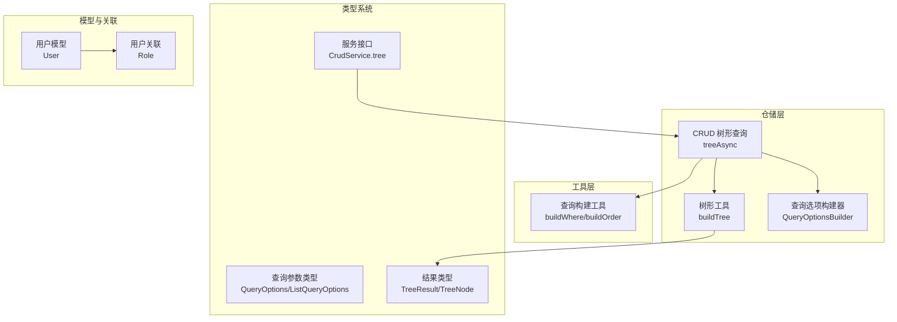
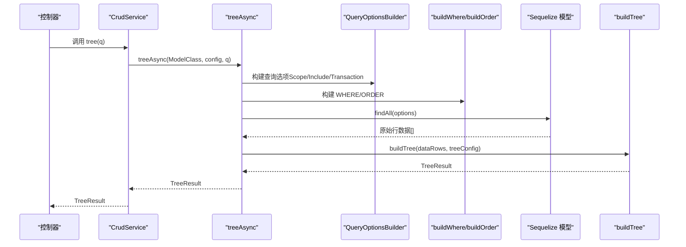
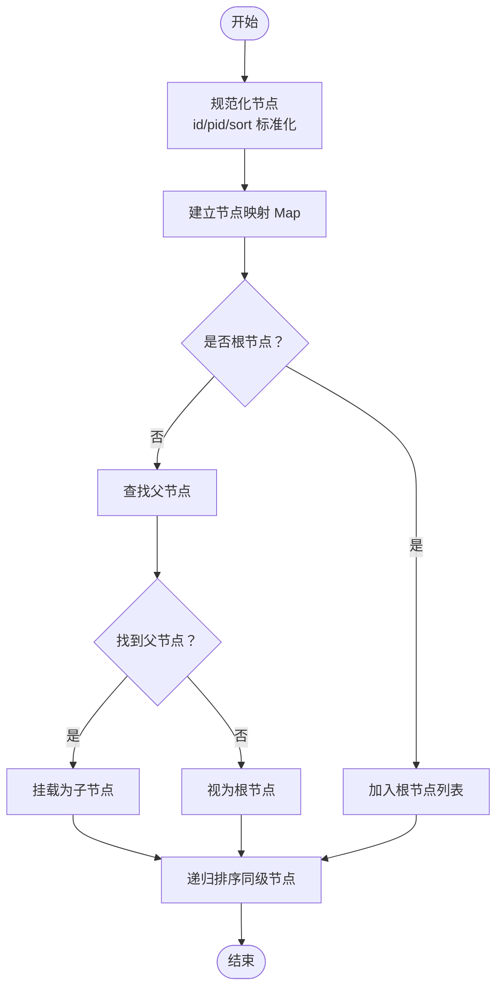
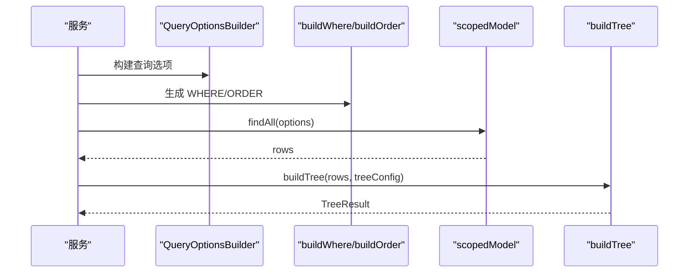
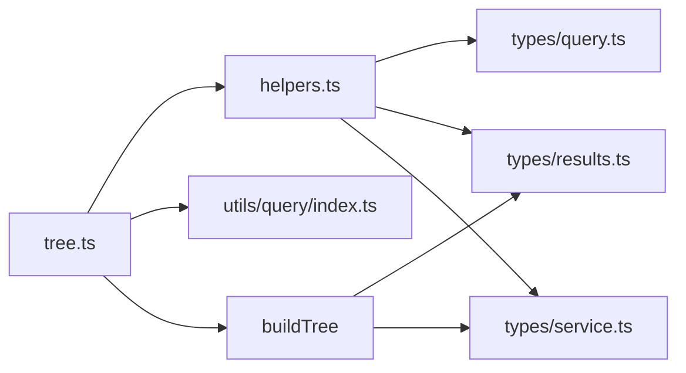

# 树形结构操作

<cite>
**本文档引用的文件**
- [src/repo/base/tree/index.ts](file://src/repo/base/tree/index.ts)
- [src/repo/base/crud/tree.ts](file://src/repo/base/crud/tree.ts)
- [src/repo/base/crud/helpers.ts](file://src/repo/base/crud/helpers.ts)
- [src/utils/query/index.ts](file://src/utils/query/index.ts)
- [src/repo/base/types/query.ts](file://src/repo/base/types/query.ts)
- [src/repo/base/types/results.ts](file://src/repo/base/types/results.ts)
- [src/repo/base/types/service.ts](file://src/repo/base/types/service.ts)
- [src/repo/base/README.md](file://src/repo/base/README.md)
- [src/repo/index.ts](file://src/repo/index.ts)
- [src/models/user/user.ts](file://src/models/user/user.ts)
- [src/models/user/association.ts](file://src/models/user/association.ts)
- [src/config/db/sqlite/index.ts](file://src/config/db/sqlite/index.ts)
</cite>

## 目录
1. [简介](#简介)
2. [项目结构](#项目结构)
3. [核心组件](#核心组件)
4. [架构总览](#架构总览)
5. [详细组件分析](#详细组件分析)
6. [依赖分析](#依赖分析)
7. [性能考虑](#性能考虑)
8. [故障排查指南](#故障排查指南)
9. [结论](#结论)
10. [附录](#附录)

## 简介
本技术文档聚焦于 IM-API 中的树形结构操作，系统性阐述树形数据模型的设计原理、父子关系的建立与维护机制、树形查询的实现细节、遍历算法与性能优化策略，以及在保持树形结构完整性的前提下进行增删改查的操作指南。同时覆盖缓存策略、并发控制与序列化/反序列化处理方法，帮助开发者在实际业务中高效、稳定地使用树形数据。

## 项目结构
围绕树形结构的核心代码位于仓储层（repo）与工具层（utils），并通过服务层接口对外暴露。关键模块如下：
- 树形工具：提供通用的树形构建算法与类型定义
- CRUD 树形查询：封装数据库查询、Scope/Include 处理与树形构建
- 查询工具：WHERE/ORDER/PAGINATION 构建
- 类型系统：统一的查询参数、结果与服务接口定义
- 模型与关联：示例用户模型具备树形字段约定（id/pid/sort）

**图表来源**
- [src/repo/base/tree/index.ts](file://src/repo/base/tree/index.ts#L88-L195)
- [src/repo/base/crud/tree.ts](file://src/repo/base/crud/tree.ts#L18-L57)
- [src/repo/base/crud/helpers.ts](file://src/repo/base/crud/helpers.ts#L174-L238)
- [src/utils/query/index.ts](file://src/utils/query/index.ts#L27-L129)
- [src/repo/base/types/query.ts](file://src/repo/base/types/query.ts#L14-L54)
- [src/repo/base/types/results.ts](file://src/repo/base/types/results.ts#L46-L64)
- [src/repo/base/types/service.ts](file://src/repo/base/types/service.ts#L22-L128)
- [src/models/user/user.ts](file://src/models/user/user.ts#L33-L101)
- [src/models/user/association.ts](file://src/models/user/association.ts#L1-L24)

**章节来源**
- [src/repo/base/README.md](file://src/repo/base/README.md#L1-L275)
- [src/repo/base/tree/index.ts](file://src/repo/base/tree/index.ts#L1-L195)
- [src/repo/base/crud/tree.ts](file://src/repo/base/crud/tree.ts#L1-L58)
- [src/repo/base/crud/helpers.ts](file://src/repo/base/crud/helpers.ts#L1-L238)
- [src/utils/query/index.ts](file://src/utils/query/index.ts#L1-L132)
- [src/repo/base/types/query.ts](file://src/repo/base/types/query.ts#L1-L64)
- [src/repo/base/types/results.ts](file://src/repo/base/types/results.ts#L1-L65)
- [src/repo/base/types/service.ts](file://src/repo/base/types/service.ts#L1-L142)
- [src/models/user/user.ts](file://src/models/user/user.ts#L1-L275)
- [src/models/user/association.ts](file://src/models/user/association.ts#L1-L24)

## 核心组件
- 树形配置（TreeConfig）：支持自定义 id/pid/sort 字段名与根节点 pid 值
- 树形节点（TreeNode）：在实体基础上扩展 id/pid/sort/children
- 树形结果（TreeResult）：根节点数组包装
- 树形构建（buildTree）：规范化节点、建立父子关系、递归排序
- CRUD 树形查询（treeAsync）：组合 Scope/Include/Transaction、构建 WHERE/ORDER、执行 findAll 后调用 buildTree
- 查询选项构建器（QueryOptionsBuilder）：统一处理 Scope、Include、Transaction、分页与默认查询选项
- 查询构建工具（buildWhere/buildOrder）：WHERE 条件与排序参数构建
- 类型系统：QueryOptions/ListQueryOptions、TreeResult/TreeNode、CrudService 接口

**章节来源**
- [src/repo/base/tree/index.ts](file://src/repo/base/tree/index.ts#L14-L86)
- [src/repo/base/crud/tree.ts](file://src/repo/base/crud/tree.ts#L18-L57)
- [src/repo/base/crud/helpers.ts](file://src/repo/base/crud/helpers.ts#L174-L238)
- [src/utils/query/index.ts](file://src/utils/query/index.ts#L27-L129)
- [src/repo/base/types/query.ts](file://src/repo/base/types/query.ts#L14-L54)
- [src/repo/base/types/results.ts](file://src/repo/base/types/results.ts#L46-L64)
- [src/repo/base/types/service.ts](file://src/repo/base/types/service.ts#L22-L128)

## 架构总览
树形查询的整体流程：控制器调用服务接口 -> 服务通过 CRUD 树形查询方法 -> 查询选项构建器组装 Scope/Include/Transaction -> 查询构建工具生成 WHERE/ORDER -> 执行数据库查询 -> 将结果交给树形构建器生成树形结构。

**图表来源**
- [src/repo/base/types/service.ts](file://src/repo/base/types/service.ts#L93-L99)
- [src/repo/base/crud/tree.ts](file://src/repo/base/crud/tree.ts#L28-L57)
- [src/repo/base/crud/helpers.ts](file://src/repo/base/crud/helpers.ts#L174-L238)
- [src/utils/query/index.ts](file://src/utils/query/index.ts#L27-L129)
- [src/repo/base/tree/index.ts](file://src/repo/base/tree/index.ts#L88-L195)

## 详细组件分析

### 树形数据模型设计与实现
- 字段约定：id/pid/sort 三元组表达父子关系与同级排序；id/pid 统一标准化为字符串，pid 支持 null
- 根节点判定：当 pid 为空/未设置或等于配置的 rootPidValue 时视为根节点
- 子节点挂载：通过 Map 快速定位父节点并挂载子节点
- 同级排序：按 sort 升序排序，缺失 sort 的节点视为 0
- 递归排序：对每个节点的 children 递归执行排序

**图表来源**
- [src/repo/base/tree/index.ts](file://src/repo/base/tree/index.ts#L115-L191)

**章节来源**
- [src/repo/base/tree/index.ts](file://src/repo/base/tree/index.ts#L88-L195)

### CRUD 树形查询实现
- 查询准备：使用 QueryOptionsBuilder 统一处理 Scope、Include、Transaction
- 条件与排序：buildWhere 与 buildOrder 生成 WHERE/ORDER
- 查询执行：移除 attributes 限制，返回全部字段以满足树形构建需求
- 结果处理：将 plain 对象数组传入 buildTree 生成 TreeResult

**图表来源**
- [src/repo/base/crud/tree.ts](file://src/repo/base/crud/tree.ts#L36-L57)
- [src/repo/base/crud/helpers.ts](file://src/repo/base/crud/helpers.ts#L174-L238)
- [src/utils/query/index.ts](file://src/utils/query/index.ts#L27-L129)

**章节来源**
- [src/repo/base/crud/tree.ts](file://src/repo/base/crud/tree.ts#L18-L57)
- [src/repo/base/crud/helpers.ts](file://src/repo/base/crud/helpers.ts#L174-L238)
- [src/utils/query/index.ts](file://src/utils/query/index.ts#L27-L129)

### 遍历算法与性能优化
- 深度优先遍历（DFS）：先序访问每个节点及其子树，适合层级打印与路径追踪
- 广度优先遍历（BFS）：逐层访问，适合层级检索与最短路径（按层级）
- 性能优化策略：
  - 使用 Map 建立节点索引，O(1) 查找父节点
  - 一次遍历完成父子关系建立，避免重复扫描
  - 递归排序仅在必要时进行，减少不必要的比较
  - 查询阶段移除 attributes 限制，确保树形构建所需字段齐全

**章节来源**
- [src/repo/base/tree/index.ts](file://src/repo/base/tree/index.ts#L112-L191)

### 增删改查操作指南（树形结构）
- 查询（tree）：通过 treeAsync 获取完整树形结构，支持 filters/order/include/scope
- 创建（create）：新增节点时确保 pid 指向有效父节点；若无父节点则成为根节点
- 更新（update）：修改 pid 可移动节点至新父节点；修改 sort 可调整同级顺序
- 删除（remove）：删除节点时需处理其子树迁移或保留策略（例如迁移到父节点或标记删除）

注意：以上操作需结合业务规则与事务控制，确保树形结构一致性。

**章节来源**
- [src/repo/base/types/service.ts](file://src/repo/base/types/service.ts#L93-L128)
- [src/repo/base/crud/tree.ts](file://src/repo/base/crud/tree.ts#L18-L57)

### 缓存策略与并发控制
- 缓存策略建议：
  - 读多写少场景：对热点树形结构进行缓存（如 Redis），设置合理过期时间
  - 变更频繁场景：采用写后失效（invalidate）策略，变更时主动清除相关缓存
  - 分层缓存：内存缓存 + 分布式缓存，降低数据库压力
- 并发控制：
  - 读写分离：树形查询走读库，写操作走写库
  - 事务隔离：在高并发下使用合适的事务隔离级别，避免脏读与幻读
  - 锁粒度：对关键节点更新采用行级锁或乐观锁，减少冲突

（本节为通用实践建议，不直接对应具体源码）

### 序列化与反序列化
- 序列化：树形结构在传输前可进行安全序列化，剔除敏感字段，避免泄露
- 反序列化：接收前端提交的树形变更时，严格校验字段类型与范围，防止注入与异常

（本节为通用实践建议，不直接对应具体源码）

## 依赖分析
- 组件耦合：
  - treeAsync 依赖 QueryOptionsBuilder、buildWhere、buildOrder、buildTree
  - buildTree 为纯函数，依赖 TreeConfig 与输入数组
  - 类型系统贯穿查询参数、结果与服务接口
- 外部依赖：
  - Sequelize：ORM 查询与 Scope/Include/Transaction
  - SQLite：数据库运行时状态查询（可用于性能监控）

**图表来源**
- [src/repo/base/crud/tree.ts](file://src/repo/base/crud/tree.ts#L12-L16)
- [src/repo/base/crud/helpers.ts](file://src/repo/base/crud/helpers.ts#L12-L16)
- [src/utils/query/index.ts](file://src/utils/query/index.ts#L12-L132)
- [src/repo/base/tree/index.ts](file://src/repo/base/tree/index.ts#L88-L195)
- [src/repo/base/types/query.ts](file://src/repo/base/types/query.ts#L14-L54)
- [src/repo/base/types/results.ts](file://src/repo/base/types/results.ts#L46-L64)
- [src/repo/base/types/service.ts](file://src/repo/base/types/service.ts#L22-L128)

**章节来源**
- [src/repo/base/crud/tree.ts](file://src/repo/base/crud/tree.ts#L12-L16)
- [src/repo/base/crud/helpers.ts](file://src/repo/base/crud/helpers.ts#L12-L16)
- [src/utils/query/index.ts](file://src/utils/query/index.ts#L12-L132)
- [src/repo/base/tree/index.ts](file://src/repo/base/tree/index.ts#L88-L195)
- [src/repo/base/types/query.ts](file://src/repo/base/types/query.ts#L14-L54)
- [src/repo/base/types/results.ts](file://src/repo/base/types/results.ts#L46-L64)
- [src/repo/base/types/service.ts](file://src/repo/base/types/service.ts#L22-L128)

## 性能考虑
- 查询阶段：
  - 移除 attributes 限制，保证树形构建所需字段齐全
  - 使用 buildOrder 指定默认排序，减少客户端二次排序
- 树形构建阶段：
  - Map 索引 + 一次遍历建立父子关系，时间复杂度 O(n)
  - 递归排序仅在存在 sort 字段时生效
- 数据库层面：
  - 可参考 SQLite 运行时状态查询，监控缓存、WAL、内存使用等指标，优化数据库性能

**章节来源**
- [src/repo/base/crud/tree.ts](file://src/repo/base/crud/tree.ts#L45-L56)
- [src/repo/base/tree/index.ts](file://src/repo/base/tree/index.ts#L112-L191)
- [src/config/db/sqlite/index.ts](file://src/config/db/sqlite/index.ts#L156-L257)

## 故障排查指南
- 常见问题：
  - 根节点识别异常：检查 TreeConfig.rootPidValue 与数据中 pid 的取值
  - 排序无效：确认 sort 字段类型为数值或可解析为数值的字符串
  - 孤儿节点：父节点缺失时会被视为根节点，检查 pid 指向
- 校验与错误：
  - 查询参数校验失败统一抛出 CrudValidationError
  - ID 校验失败抛出相应错误，便于快速定位非法请求

**章节来源**
- [src/repo/base/tree/index.ts](file://src/repo/base/tree/index.ts#L147-L167)
- [src/repo/base/crud/helpers.ts](file://src/repo/base/crud/helpers.ts#L63-L78)
- [src/repo/base/README.md](file://src/repo/base/README.md#L202-L233)

## 结论
IM-API 的树形结构操作通过“查询 + 构建”的清晰分层，实现了灵活、可配置且高性能的树形数据处理。借助 TreeConfig、TreeNode、TreeResult 与 buildTree，开发者可以轻松适配不同业务场景；配合 QueryOptionsBuilder 与查询构建工具，能够高效地完成复杂查询与排序。在实际部署中，建议结合缓存与并发控制策略，持续监控数据库运行时状态，以获得最佳性能与稳定性。

## 附录
- 示例模型与关联：用户模型具备树形字段约定，可作为树形结构的实体载体
- 仓储层导出：统一导出 CRUD 与树形工具，便于在服务层按需使用

**章节来源**
- [src/models/user/user.ts](file://src/models/user/user.ts#L33-L101)
- [src/models/user/association.ts](file://src/models/user/association.ts#L1-L24)
- [src/repo/index.ts](file://src/repo/index.ts#L15-L48)