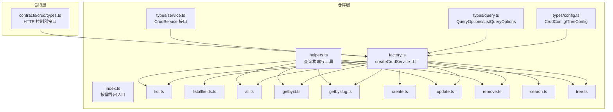
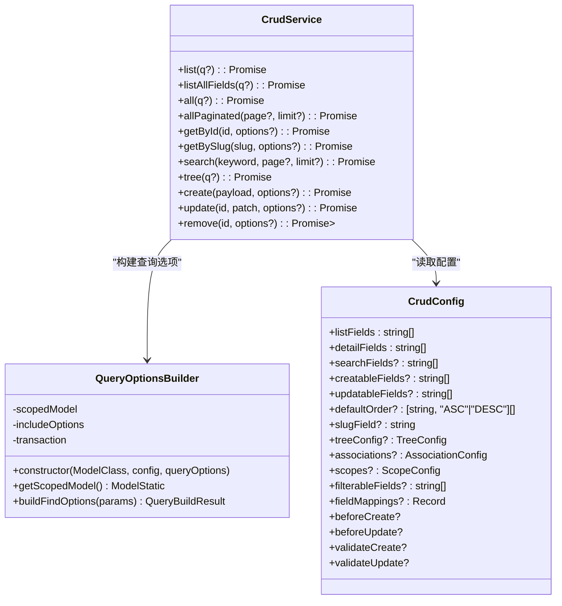
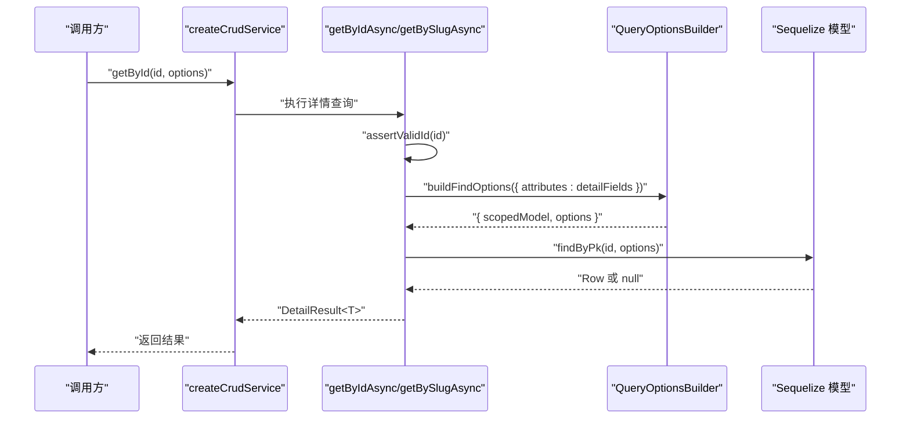
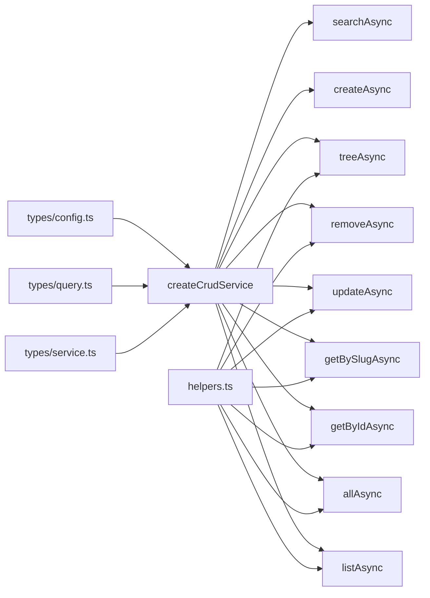

# 通用CRUD操作

<cite>
**本文档引用的文件**
- [src/repo/base/crud/factory.ts](file://src/repo/base/crud/factory.ts)
- [src/repo/base/crud/index.ts](file://src/repo/base/crud/index.ts)
- [src/repo/base/types/service.ts](file://src/repo/base/types/service.ts)
- [src/repo/base/types/config.ts](file://src/repo/base/types/config.ts)
- [src/repo/base/types/query.ts](file://src/repo/base/types/query.ts)
- [src/repo/base/crud/create.ts](file://src/repo/base/crud/create.ts)
- [src/repo/base/crud/getbyid.ts](file://src/repo/base/crud/getbyid.ts)
- [src/repo/base/crud/getbyslug.ts](file://src/repo/base/crud/getbyslug.ts)
- [src/repo/base/crud/update.ts](file://src/repo/base/crud/update.ts)
- [src/repo/base/crud/remove.ts](file://src/repo/base/crud/remove.ts)
- [src/repo/base/crud/list.ts](file://src/repo/base/crud/list.ts)
- [src/repo/base/crud/search.ts](file://src/repo/base/crud/search.ts)
- [src/repo/base/crud/tree.ts](file://src/repo/base/crud/tree.ts)
- [src/repo/base/crud/helpers.ts](file://src/repo/base/crud/helpers.ts)
- [src/contracts/crud/types.ts](file://src/contracts/crud/types.ts)
</cite>

## 目录
1. [简介](#简介)
2. [项目结构](#项目结构)
3. [核心组件](#核心组件)
4. [架构总览](#架构总览)
5. [详细组件分析](#详细组件分析)
6. [依赖分析](#依赖分析)
7. [性能考虑](#性能考虑)
8. [故障排查指南](#故障排查指南)
9. [结论](#结论)
10. [附录](#附录)

## 简介
本文件面向 IM-API 的通用 CRUD 服务体系，系统性阐述 CRUD 服务工厂的设计模式与实现原理，详解 createCrudService 工厂函数如何聚合各 CRUD 操作，以及“创建、读取、更新、删除、列表、搜索、树形查询”等操作的参数、返回值与错误处理机制。文档还覆盖事务支持与并发控制的实现细节，并提供使用示例与最佳实践，帮助开发者在不同业务场景下正确选择与组合 CRUD 操作。

## 项目结构
CRUD 能力主要位于仓库层的 base/crud 目录，通过工厂函数统一暴露能力，并以类型定义约束配置与查询参数。HTTP 层通过通用控制器接口对接这些服务。



图表来源
- [src/repo/base/crud/factory.ts](file://src/repo/base/crud/factory.ts#L25-L65)
- [src/repo/base/crud/index.ts](file://src/repo/base/crud/index.ts#L16-L28)
- [src/repo/base/crud/helpers.ts](file://src/repo/base/crud/helpers.ts#L175-L238)
- [src/repo/base/types/config.ts](file://src/repo/base/types/config.ts#L74-L147)
- [src/repo/base/types/query.ts](file://src/repo/base/types/query.ts#L14-L64)
- [src/repo/base/types/service.ts](file://src/repo/base/types/service.ts#L22-L142)
- [src/contracts/crud/types.ts](file://src/contracts/crud/types.ts#L56-L196)

章节来源
- [src/repo/base/crud/factory.ts](file://src/repo/base/crud/factory.ts#L1-L66)
- [src/repo/base/crud/index.ts](file://src/repo/base/crud/index.ts#L1-L28)
- [src/repo/base/types/service.ts](file://src/repo/base/types/service.ts#L1-L142)
- [src/repo/base/types/config.ts](file://src/repo/base/types/config.ts#L1-L147)
- [src/repo/base/types/query.ts](file://src/repo/base/types/query.ts#L1-L64)
- [src/contracts/crud/types.ts](file://src/contracts/crud/types.ts#L1-L197)

## 核心组件
- CRUD 服务工厂：createCrudService，将 list、all、getById、getBySlug、create、update、remove、search、tree 等方法聚合为统一接口，支持 Scope、关联查询与事务。
- 服务接口：CrudService<T>，定义所有 CRUD 操作的签名与返回类型。
- 配置类型：CrudConfig<T>，集中定义字段白名单、默认排序、树形配置、关联与 Scope、过滤白名单、字段映射与钩子等。
- 查询参数：QueryOptions、ListQueryOptions、CrudOperationOptions，分别用于分页/搜索/过滤/排序/关联/Scope/事务，非分页列表查询，以及写入操作的事务选项。
- 辅助工具：QueryOptionsBuilder、buildIncludeOptions、applyScope、pickDTO、assertValidId 等，统一处理 Scope、Include、Transaction、字段白名单与 ID 校验。

章节来源
- [src/repo/base/types/service.ts](file://src/repo/base/types/service.ts#L22-L142)
- [src/repo/base/types/config.ts](file://src/repo/base/types/config.ts#L74-L147)
- [src/repo/base/types/query.ts](file://src/repo/base/types/query.ts#L14-L64)
- [src/repo/base/crud/helpers.ts](file://src/repo/base/crud/helpers.ts#L175-L238)

## 架构总览
CRUD 服务工厂通过依赖注入模型类与配置，返回一个强类型的 CrudService 实例。所有读取操作均通过 QueryOptionsBuilder 统一构建查询选项，支持 Scope、Include、Transaction；写入操作支持事务包裹，配合字段白名单与钩子扩展实现安全与可扩展的持久化流程。



图表来源
- [src/repo/base/types/service.ts](file://src/repo/base/types/service.ts#L22-L142)
- [src/repo/base/crud/helpers.ts](file://src/repo/base/crud/helpers.ts#L175-L238)
- [src/repo/base/types/config.ts](file://src/repo/base/types/config.ts#L74-L147)

## 详细组件分析

### CRUD 服务工厂与接口
- 设计要点
  - 工厂函数 createCrudService 接收 Sequelize 模型类与 CRUD 配置，返回统一的 CrudService 接口实例。
  - 所有方法均通过异步函数实现，便于与数据库交互与事务包裹。
  - 支持 Scope、关联查询、默认 Include 自动加载与运行时 Include 动态切换。
- 返回值与错误
  - 读取类操作返回 DetailResult<T> 或 PaginatedResult<T>，未命中时 DetailResult.data 为 null。
  - 删除操作返回 DetailResult<null>，资源不存在时抛出带状态码的错误。
  - 写入类操作返回 DetailResult<T>，包含用户标识与保存后的数据。

章节来源
- [src/repo/base/crud/factory.ts](file://src/repo/base/crud/factory.ts#L25-L65)
- [src/repo/base/types/service.ts](file://src/repo/base/types/service.ts#L22-L142)

### 创建（create）
- 参数
  - payload：部分实体字段，受 creatableFields 白名单过滤。
  - options：支持传入 transaction。
- 流程
  - 基础载荷校验 → 业务校验钩子 validateCreate → 前置处理钩子 beforeCreate → 字段白名单过滤 → 持久化写入（支持事务）。
- 返回值
  - DetailResult<T>，包含 userId 与保存后的完整数据。
- 错误处理
  - 校验失败抛出字段级错误；事务异常由上层捕获。

```mermaid
sequenceDiagram
participant Caller as "调用方"
participant Factory as "createCrudService"
participant Create as "createAsync"
participant Hooks as "校验/钩子"
participant Model as "Sequelize 模型"
Caller->>Factory : "create(payload, options)"
Factory->>Create : "执行创建流程"
Create->>Hooks : "validatePayload()"
Hooks-->>Create : "通过"
Create->>Hooks : "validateCreate(payload)"
Hooks-->>Create : "通过"
Create->>Hooks : "beforeCreate(payload)"
Hooks-->>Create : "返回准备好的 payload"
Create->>Create : "pickDTO(白名单过滤)"
Create->>Model : "create(body, options)"
Model-->>Create : "Saved Instance"
Create-->>Factory : "DetailResult<T>"
Factory-->>Caller : "返回结果"
```

图表来源
- [src/repo/base/crud/factory.ts](file://src/repo/base/crud/factory.ts#L54-L56)
- [src/repo/base/crud/create.ts](file://src/repo/base/crud/create.ts#L17-L81)

章节来源
- [src/repo/base/crud/create.ts](file://src/repo/base/crud/create.ts#L17-L81)
- [src/repo/base/types/config.ts](file://src/repo/base/types/config.ts#L111-L146)

### 读取（getById、getBySlug）
- getById
  - 参数：id（主键）、可选 QueryOptions（支持 include/scope/transaction）。
  - 流程：ID 合法性断言 → QueryOptionsBuilder 构建查询 → findByPk 查询 → 返回 DetailResult。
- getBySlug
  - 参数：slug（业务唯一标识）、可选 QueryOptions。
  - 流程：slug 非空校验 → 通过 slugField 构建 where 条件 → findOne 查询 → 返回 DetailResult。
- 返回值：DetailResult<T>，未命中返回 data=null。
- 错误处理：getBySlug 在 slug 非法时抛出字段级错误；getById 依赖断言抛错。



图表来源
- [src/repo/base/crud/getbyid.ts](file://src/repo/base/crud/getbyid.ts#L16-L52)
- [src/repo/base/crud/getbyslug.ts](file://src/repo/base/crud/getbyslug.ts#L17-L55)
- [src/repo/base/crud/helpers.ts](file://src/repo/base/crud/helpers.ts#L175-L238)

章节来源
- [src/repo/base/crud/getbyid.ts](file://src/repo/base/crud/getbyid.ts#L16-L52)
- [src/repo/base/crud/getbyslug.ts](file://src/repo/base/crud/getbyslug.ts#L17-L55)

### 更新（update）
- 参数
  - id：主键；patch：更新补丁；options：支持 transaction。
- 流程
  - ID 与补丁校验 → validateUpdate 钩子 → findByPk 查找 → beforeUpdate 钩子 → pickDTO 白名单过滤 → update 持久化（支持事务）。
- 返回值：DetailResult<T>，未命中返回 data=null。
- 错误处理：未找到资源时返回 data=null；事务异常由上层捕获。

章节来源
- [src/repo/base/crud/update.ts](file://src/repo/base/crud/update.ts#L17-L66)
- [src/repo/base/types/config.ts](file://src/repo/base/types/config.ts#L111-L146)

### 删除（remove）
- 参数：id、options（支持 transaction）。
- 流程：assertValidId → findByPk → 若不存在抛出带状态码的错误 → destroy 删除 → 返回 DetailResult<null>。
- 错误处理：资源不存在时抛出错误并设置状态码。

章节来源
- [src/repo/base/crud/remove.ts](file://src/repo/base/crud/remove.ts#L16-L56)

### 列表（list、listAllFields、all、allPaginated）
- list
  - 参数：QueryOptions（page、limit、search、filters、order、include、scope、transaction）。
  - 流程：QueryOptionsBuilder 构建查询 → buildWhere/buildPagination/buildOrder 组合 where/order/pagination → findAndCountAll → 返回分页结果。
- listAllFields
  - 与 list 类似，但返回模型全部字段，适用于管理端或导出场景。
- all
  - 参数：ListQueryOptions（无分页），返回 ListResult。
- allPaginated
  - 基于 list 实现，直接传入 page/limit。
- 返回值：ListResult 或 PaginatedResult，包含 data、total、page、limit。

章节来源
- [src/repo/base/crud/list.ts](file://src/repo/base/crud/list.ts#L17-L62)
- [src/repo/base/types/query.ts](file://src/repo/base/types/query.ts#L14-L54)

### 搜索（search）
- 参数：keyword、page、limit。
- 实现：委托 listAsync，将 keyword 作为查询参数传入，内部通过 buildWhere 与 searchFields 构建模糊匹配条件。
- 返回值：分页结果。

章节来源
- [src/repo/base/crud/search.ts](file://src/repo/base/crud/search.ts#L12-L34)
- [src/repo/base/crud/list.ts](file://src/repo/base/crud/list.ts#L42-L48)

### 树形查询（tree）
- 参数：ListQueryOptions（filters、order、include、scope、transaction）。
- 实现：QueryOptionsBuilder 构建查询 → findAll 获取全部字段 → 通过 buildTree 基于 treeConfig（idField/pidField/sortField/rootPidValue/childrenField）构建树形结构。
- 返回值：TreeResult。

章节来源
- [src/repo/base/crud/tree.ts](file://src/repo/base/crud/tree.ts#L18-L58)
- [src/repo/base/types/config.ts](file://src/repo/base/types/config.ts#L21-L48)

### 事务支持与并发控制
- 事务注入
  - QueryOptionsBuilder 在构造时接收 transaction，并在 buildFindOptions 中透传到 Sequelize 查询选项。
  - 写入操作（create/update/remove）通过 CrudOperationOptions 传入 transaction，确保原子性。
- 并发控制
  - 代码未显式实现行级锁或乐观/悲观锁策略；建议在高并发场景结合数据库层面的唯一约束、索引与业务幂等设计，必要时在上层引入分布式锁或业务锁。

章节来源
- [src/repo/base/crud/helpers.ts](file://src/repo/base/crud/helpers.ts#L175-L238)
- [src/repo/base/types/query.ts](file://src/repo/base/types/query.ts#L57-L64)
- [src/repo/base/crud/create.ts](file://src/repo/base/crud/create.ts#L67-L74)
- [src/repo/base/crud/update.ts](file://src/repo/base/crud/update.ts#L46-L62)
- [src/repo/base/crud/remove.ts](file://src/repo/base/crud/remove.ts#L38-L52)

### 字段白名单与钩子扩展
- 字段白名单
  - creatableFields/updatableFields：决定允许写入的字段集合，未列出字段将被忽略。
  - listFields/detailFields：决定查询返回的字段集合。
- 钩子扩展
  - validateCreate/validateUpdate：业务级校验钩子。
  - beforeCreate/beforeUpdate：前置处理钩子，可用于补全默认值或写入系统字段。
- 字段映射
  - fieldMappings：用于响应 DTO 转换，提升接口稳定性与安全性。

章节来源
- [src/repo/base/types/config.ts](file://src/repo/base/types/config.ts#L111-L146)
- [src/repo/base/crud/create.ts](file://src/repo/base/crud/create.ts#L54-L65)
- [src/repo/base/crud/update.ts](file://src/repo/base/crud/update.ts#L55-L57)

### 查询构建器与辅助工具
- QueryOptionsBuilder
  - 统一处理 Scope、Include、Transaction，支持运行时 include 与命名 include 解析。
  - 提供 buildFindOptions 输出 FindOptions，供 Sequelize 查询使用。
- 辅助函数
  - pickDTO：按白名单挑选字段，忽略 undefined 值。
  - assertValidId：断言 ID 合法性，非法时抛出字段级错误。
  - applyScope：应用模型 Scope，支持白名单过滤与多 Scope 应用。
  - buildIncludeOptions：解析运行时 include 与命名 include，支持默认自动 Include。

章节来源
- [src/repo/base/crud/helpers.ts](file://src/repo/base/crud/helpers.ts#L175-L238)
- [src/repo/base/crud/helpers.ts](file://src/repo/base/crud/helpers.ts#L46-L60)
- [src/repo/base/crud/helpers.ts](file://src/repo/base/crud/helpers.ts#L62-L78)
- [src/repo/base/crud/helpers.ts](file://src/repo/base/crud/helpers.ts#L120-L151)
- [src/repo/base/crud/helpers.ts](file://src/repo/base/crud/helpers.ts#L80-L117)

## 依赖分析
- 组件耦合
  - 工厂函数依赖各操作模块与 helpers；helpers 依赖配置与查询类型。
  - 读取类操作共享 QueryOptionsBuilder，降低重复逻辑。
  - 写入类操作共享字段白名单与钩子机制。
- 外部依赖
  - Sequelize 模型与事务；HTTP 层通过通用控制器接口对接服务。



图表来源
- [src/repo/base/crud/factory.ts](file://src/repo/base/crud/factory.ts#L14-L23)
- [src/repo/base/crud/helpers.ts](file://src/repo/base/crud/helpers.ts#L175-L238)
- [src/repo/base/types/config.ts](file://src/repo/base/types/config.ts#L74-L147)
- [src/repo/base/types/query.ts](file://src/repo/base/types/query.ts#L14-L64)
- [src/repo/base/types/service.ts](file://src/repo/base/types/service.ts#L22-L142)

章节来源
- [src/repo/base/crud/factory.ts](file://src/repo/base/crud/factory.ts#L14-L23)
- [src/repo/base/crud/helpers.ts](file://src/repo/base/crud/helpers.ts#L175-L238)
- [src/repo/base/types/config.ts](file://src/repo/base/types/config.ts#L74-L147)
- [src/repo/base/types/query.ts](file://src/repo/base/types/query.ts#L14-L64)
- [src/repo/base/types/service.ts](file://src/repo/base/types/service.ts#L22-L142)

## 性能考虑
- 分页与排序
  - 使用 buildPagination 与 buildOrder 组合查询，避免一次性加载全量数据。
- 关联查询
  - 通过 QueryOptionsBuilder 的 Include 与 Scope 控制关联范围，减少 N+1 查询风险。
- 字段裁剪
  - listFields/detailFields 限制 SELECT 字段，降低网络与序列化开销。
- 搜索优化
  - 仅在必要字段上启用 searchFields，避免全表模糊匹配。
- 事务边界
  - 将相关写入操作放入同一事务，减少长事务占用与死锁概率。

## 故障排查指南
- 字段级错误
  - validatePayload/assertValidId 抛出字段级错误，检查请求载荷与 ID 格式。
- 资源不存在
  - getById/getBySlug 返回 data=null；remove 在未找到时抛出带状态码的错误。
- Scope/Include 配置
  - 确认 scopes.availableScopes 与 associations.autoInclude/namedIncludes 配置正确。
- 事务问题
  - 确保传入的 transaction 正确传递至 QueryOptionsBuilder 与写入操作。

章节来源
- [src/repo/base/crud/getbyid.ts](file://src/repo/base/crud/getbyid.ts#L38-L39)
- [src/repo/base/crud/getbyslug.ts](file://src/repo/base/crud/getbyslug.ts#L40-L42)
- [src/repo/base/crud/remove.ts](file://src/repo/base/crud/remove.ts#L43-L47)
- [src/repo/base/crud/helpers.ts](file://src/repo/base/crud/helpers.ts#L175-L238)

## 结论
IM-API 的通用 CRUD 体系通过工厂模式将查询构建、Scope/Include/事务、字段白名单与钩子扩展统一抽象，形成高内聚、低耦合的服务层能力。开发者只需在配置层定义字段策略与树形结构，即可在读取与写入两端获得一致的体验与强大的扩展性。配合合理的分页、排序与关联裁剪策略，可在保证性能的同时满足复杂业务需求。

## 附录
- 使用示例与最佳实践
  - 列表查询：在 QueryOptions 中设置 filters、order、include、scope，合理设置 page/limit。
  - 详情查询：getById/getBySlug 返回 detailFields，注意未命中返回 data=null。
  - 创建/更新：通过 creatableFields/updatableFields 限定字段，利用 validate/before 钩子完成业务校验与预处理。
  - 树形查询：配置 treeConfig 的 idField/pidField/sortField/rootPidValue，确保父子关系与排序字段正确。
  - 事务：将多个写入操作封装在同一事务中，确保一致性；并发场景建议结合数据库约束与业务幂等设计。