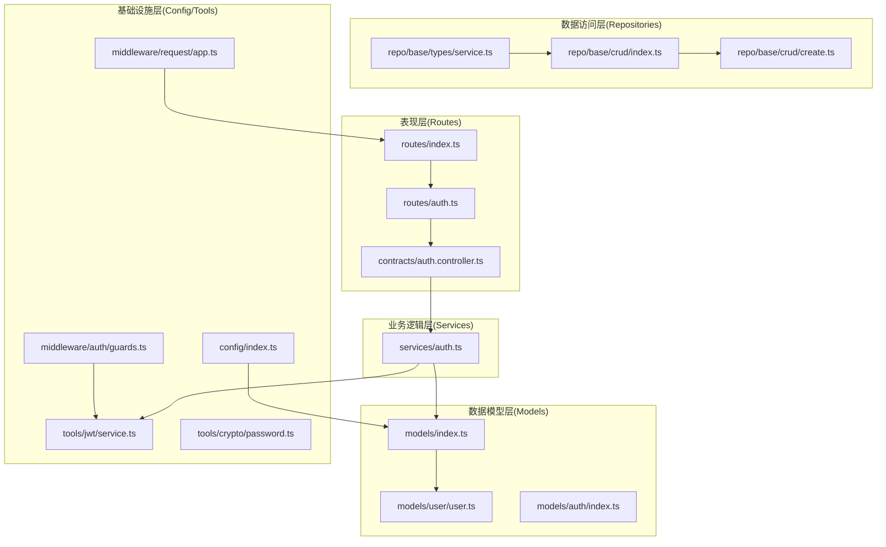
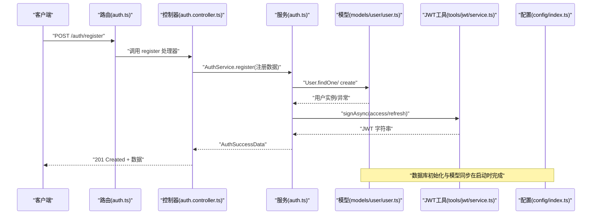
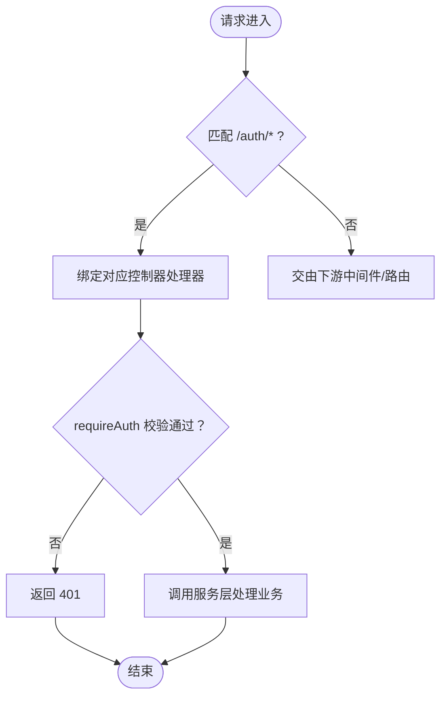
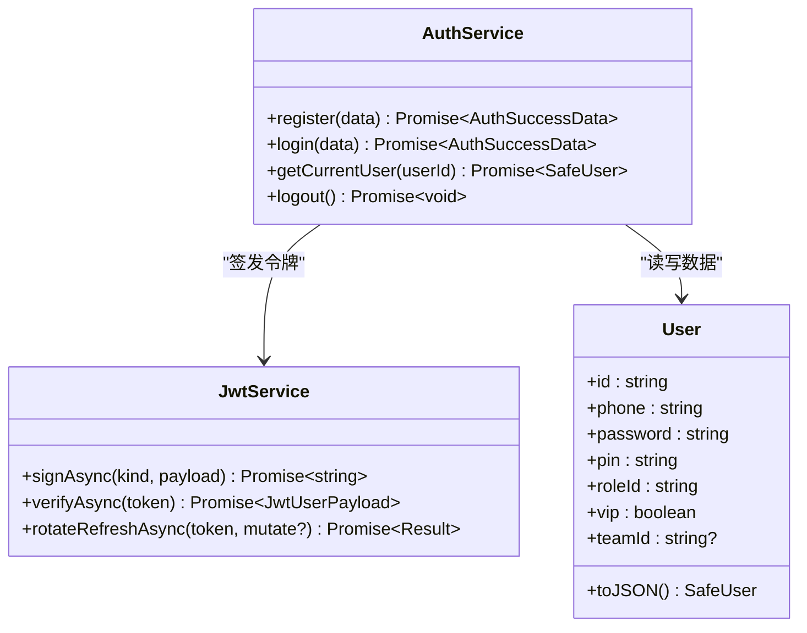
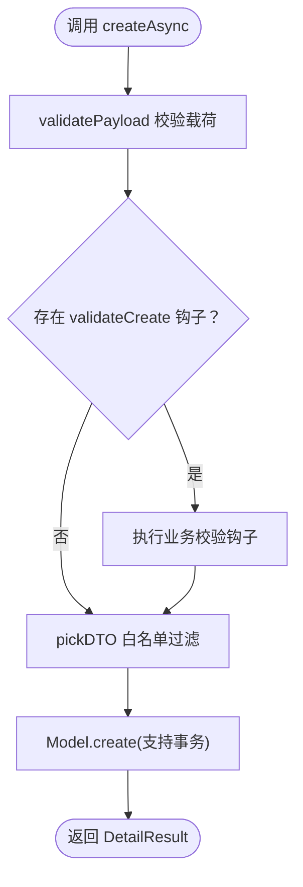
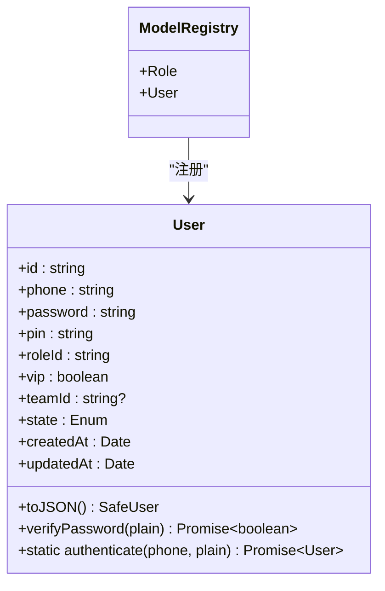
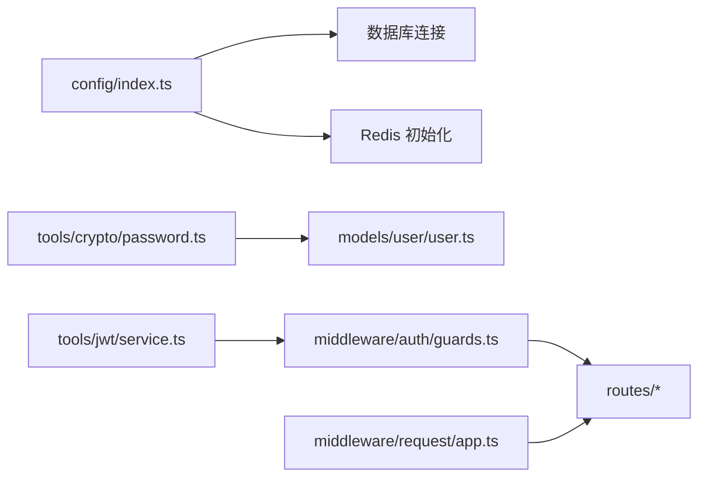
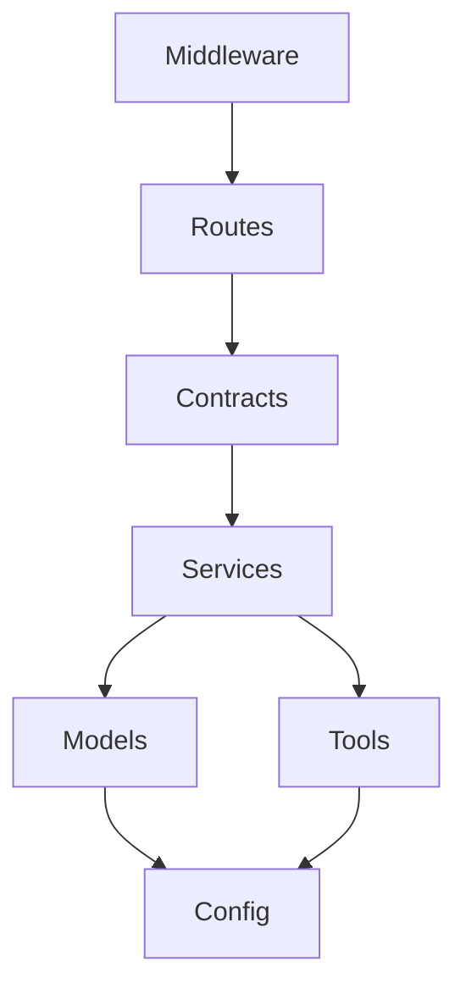

# 分层架构设计

<cite>
**本文档引用的文件**
- [src/server.ts](file://src/server.ts)
- [src/config/index.ts](file://src/config/index.ts)
- [src/models/index.ts](file://src/models/index.ts)
- [src/models/user/user.ts](file://src/models/user/user.ts)
- [src/models/auth/index.ts](file://src/models/auth/index.ts)
- [src/routes/index.ts](file://src/routes/index.ts)
- [src/routes/auth.ts](file://src/routes/auth.ts)
- [src/contracts/auth.controller.ts](file://src/contracts/auth.controller.ts)
- [src/services/auth.ts](file://src/services/auth.ts)
- [src/repo/base/types/service.ts](file://src/repo/base/types/service.ts)
- [src/repo/base/crud/index.ts](file://src/repo/base/crud/index.ts)
- [src/repo/base/crud/create.ts](file://src/repo/base/crud/create.ts)
- [src/middleware/auth/guards.ts](file://src/middleware/auth/guards.ts)
- [src/middleware/request/app.ts](file://src/middleware/request/app.ts)
- [src/tools/jwt/service.ts](file://src/tools/jwt/service.ts)
- [src/tools/crypto/password.ts](file://src/tools/crypto/password.ts)
</cite>

## 目录
1. [简介](#简介)
2. [项目结构](#项目结构)
3. [核心组件](#核心组件)
4. [架构总览](#架构总览)
5. [详细组件分析](#详细组件分析)
6. [依赖关系分析](#依赖关系分析)
7. [性能考量](#性能考量)
8. [故障排查指南](#故障排查指南)
9. [结论](#结论)

## 简介
本项目采用五层架构模式组织代码，自顶向下分别为：
- 表现层（Routes）：负责接收 HTTP 请求、绑定路由与控制器。
- 业务逻辑层（Services）：封装领域业务规则与流程编排。
- 数据访问层（Repositories）：抽象通用 CRUD 与查询能力，屏蔽具体 ORM 细节。
- 数据模型层（Models）：定义实体结构、约束与生命周期钩子。
- 基础设施层（Config/Tools）：提供配置、数据库连接、加密、日志、JWT 等基础设施能力。

该架构通过清晰的职责边界与单向依赖，确保各层独立、可测试、可替换，同时通过中间件与工具模块实现横切关注点的解耦。

## 项目结构
项目采用按“功能域+层次”混合组织方式，既体现业务域划分，又遵循分层职责：
- 表现层：src/routes、src/contracts
- 业务逻辑层：src/services
- 数据访问层：src/repo/base
- 数据模型层：src/models
- 基础设施层：src/config、src/tools、src/middleware

图表来源
- [src/routes/index.ts](file://src/routes/index.ts#L1-L22)
- [src/routes/auth.ts](file://src/routes/auth.ts#L1-L47)
- [src/contracts/auth.controller.ts](file://src/contracts/auth.controller.ts#L1-L111)
- [src/services/auth.ts](file://src/services/auth.ts#L1-L170)
- [src/repo/base/types/service.ts](file://src/repo/base/types/service.ts#L1-L142)
- [src/repo/base/crud/index.ts](file://src/repo/base/crud/index.ts#L1-L28)
- [src/repo/base/crud/create.ts](file://src/repo/base/crud/create.ts#L1-L81)
- [src/models/index.ts](file://src/models/index.ts#L1-L143)
- [src/models/user/user.ts](file://src/models/user/user.ts#L1-L275)
- [src/config/index.ts](file://src/config/index.ts#L1-L30)
- [src/tools/jwt/service.ts](file://src/tools/jwt/service.ts#L1-L98)
- [src/tools/crypto/password.ts](file://src/tools/crypto/password.ts#L1-L111)
- [src/middleware/auth/guards.ts](file://src/middleware/auth/guards.ts#L1-L195)
- [src/middleware/request/app.ts](file://src/middleware/request/app.ts#L1-L99)

章节来源
- [src/server.ts](file://src/server.ts#L1-L74)
- [src/config/index.ts](file://src/config/index.ts#L1-L30)

## 核心组件
- 表现层
  - 路由聚合：统一挂载公共与受保护路由，引入鉴权中间件。
  - 控制器：封装请求校验、调用服务层并返回标准化响应。
- 业务逻辑层
  - 认证服务：注册、登录、获取当前用户、退出；与模型与 JWT 工具协作。
- 数据访问层
  - CRUD 接口与工厂：定义通用 CRUD 服务接口与工厂方法，提供分页、搜索、树形等能力。
  - 通用创建：支持字段白名单、业务校验钩子、前置处理钩子与事务。
- 数据模型层
  - 用户模型：定义字段、约束、默认/带密文作用域、生命周期钩子与索引。
  - 模型注册：集中初始化与关联，提供通用类型与注册表。
- 基础设施层
  - 配置：导出环境变量、数据库连接、Redis 初始化等。
  - 加密：提供 scrypt 口令哈希与校验。
  - JWT：签发、验证、刷新轮转与权限守卫。
  - 中间件：鉴权守卫、请求头解析、日志与跨域等。

章节来源
- [src/routes/index.ts](file://src/routes/index.ts#L1-L22)
- [src/routes/auth.ts](file://src/routes/auth.ts#L1-L47)
- [src/contracts/auth.controller.ts](file://src/contracts/auth.controller.ts#L1-L111)
- [src/services/auth.ts](file://src/services/auth.ts#L1-L170)
- [src/repo/base/types/service.ts](file://src/repo/base/types/service.ts#L1-L142)
- [src/repo/base/crud/index.ts](file://src/repo/base/crud/index.ts#L1-L28)
- [src/repo/base/crud/create.ts](file://src/repo/base/crud/create.ts#L1-L81)
- [src/models/index.ts](file://src/models/index.ts#L1-L143)
- [src/models/user/user.ts](file://src/models/user/user.ts#L1-L275)
- [src/config/index.ts](file://src/config/index.ts#L1-L30)
- [src/tools/crypto/password.ts](file://src/tools/crypto/password.ts#L1-L111)
- [src/tools/jwt/service.ts](file://src/tools/jwt/service.ts#L1-L98)
- [src/middleware/auth/guards.ts](file://src/middleware/auth/guards.ts#L1-L195)
- [src/middleware/request/app.ts](file://src/middleware/request/app.ts#L1-L99)

## 架构总览
下图展示从 HTTP 请求到数据库持久化的完整数据流，体现五层之间的调用关系与数据传递方式。

图表来源
- [src/routes/auth.ts](file://src/routes/auth.ts#L1-L47)
- [src/contracts/auth.controller.ts](file://src/contracts/auth.controller.ts#L1-L111)
- [src/services/auth.ts](file://src/services/auth.ts#L1-L170)
- [src/models/user/user.ts](file://src/models/user/user.ts#L1-L275)
- [src/tools/jwt/service.ts](file://src/tools/jwt/service.ts#L1-L98)
- [src/config/index.ts](file://src/config/index.ts#L1-L30)

## 详细组件分析

### 表现层（Routes）
- 职责边界
  - 路由聚合：将公共与受保护路由统一挂载，引入鉴权中间件。
  - 控制器绑定：将具体处理器绑定到路径，负责输入校验与响应包装。
- 接口定义
  - 认证路由：注册、登录、退出、获取当前用户。
  - 受保护路由：通过 requireAuth 中间件注入用户信息。
- 层间通信
  - 通过控制器调用服务层；受保护路由依赖中间件解析 JWT 并注入 req.user。

图表来源
- [src/routes/index.ts](file://src/routes/index.ts#L1-L22)
- [src/routes/auth.ts](file://src/routes/auth.ts#L1-L47)
- [src/middleware/auth/guards.ts](file://src/middleware/auth/guards.ts#L1-L195)

章节来源
- [src/routes/index.ts](file://src/routes/index.ts#L1-L22)
- [src/routes/auth.ts](file://src/routes/auth.ts#L1-L47)
- [src/contracts/auth.controller.ts](file://src/contracts/auth.controller.ts#L1-L111)
- [src/middleware/auth/guards.ts](file://src/middleware/auth/guards.ts#L1-L195)

### 业务逻辑层（Services）
- 职责边界
  - 封装认证业务：注册、登录、获取当前用户、退出。
  - 令牌签发：基于 JWT 工具签发 access/refresh 令牌。
- 错误传播
  - 业务异常通过抛错并在控制器层统一包装返回。
- 依赖关系
  - 依赖模型层进行数据读写；依赖 JWT 工具进行令牌处理。

图表来源
- [src/services/auth.ts](file://src/services/auth.ts#L1-L170)
- [src/tools/jwt/service.ts](file://src/tools/jwt/service.ts#L1-L98)
- [src/models/user/user.ts](file://src/models/user/user.ts#L1-L275)

章节来源
- [src/services/auth.ts](file://src/services/auth.ts#L1-L170)
- [src/tools/jwt/service.ts](file://src/tools/jwt/service.ts#L1-L98)
- [src/models/user/user.ts](file://src/models/user/user.ts#L1-L275)

### 数据访问层（Repositories）
- 职责边界
  - 抽象通用 CRUD 能力：分页、列表、详情、搜索、树形、创建、更新、删除。
  - 工厂与配置：基于模型与配置生成对应 CRUD 服务实例。
- 数据传递
  - 输入：查询选项、过滤条件、排序、关联、Scope、事务等。
  - 输出：分页结果、列表结果、详情结果、树形结果。
- 依赖关系
  - 依赖 Sequelize 模型与查询构建工具；支持事务与钩子扩展。

图表来源
- [src/repo/base/crud/create.ts](file://src/repo/base/crud/create.ts#L1-L81)
- [src/repo/base/types/service.ts](file://src/repo/base/types/service.ts#L1-L142)
- [src/repo/base/crud/index.ts](file://src/repo/base/crud/index.ts#L1-L28)

章节来源
- [src/repo/base/types/service.ts](file://src/repo/base/types/service.ts#L1-L142)
- [src/repo/base/crud/index.ts](file://src/repo/base/crud/index.ts#L1-L28)
- [src/repo/base/crud/create.ts](file://src/repo/base/crud/create.ts#L1-L81)

### 数据模型层（Models）
- 职责边界
  - 定义实体结构、字段约束、默认作用域与带密文作用域。
  - 提供生命周期钩子（如密码哈希）与索引优化。
- 关联与注册
  - 集中初始化模型与关联关系，提供通用类型与注册表。
- 与业务层交互
  - 业务层通过模型进行读写；模型内部通过钩子保证数据一致性。

图表来源
- [src/models/user/user.ts](file://src/models/user/user.ts#L1-L275)
- [src/models/index.ts](file://src/models/index.ts#L1-L143)

章节来源
- [src/models/user/user.ts](file://src/models/user/user.ts#L1-L275)
- [src/models/index.ts](file://src/models/index.ts#L1-L143)

### 基础设施层（Config/Tools）
- 配置
  - 导出环境变量、数据库连接、Redis 初始化等，供启动阶段使用。
- 加密
  - 提供 scrypt 口令哈希与校验，保障密码存储安全。
- JWT
  - 提供签发、验证、刷新轮转与权限守卫，支撑认证与授权。
- 中间件
  - 鉴权守卫：基于 req.user 进行角色/作用域/VIP/团队/TokenKind 校验。
  - 请求头解析：提取并校验 x-app-id，写入 req.appId。

图表来源
- [src/config/index.ts](file://src/config/index.ts#L1-L30)
- [src/tools/crypto/password.ts](file://src/tools/crypto/password.ts#L1-L111)
- [src/tools/jwt/service.ts](file://src/tools/jwt/service.ts#L1-L98)
- [src/middleware/auth/guards.ts](file://src/middleware/auth/guards.ts#L1-L195)
- [src/middleware/request/app.ts](file://src/middleware/request/app.ts#L1-L99)

章节来源
- [src/config/index.ts](file://src/config/index.ts#L1-L30)
- [src/tools/crypto/password.ts](file://src/tools/crypto/password.ts#L1-L111)
- [src/tools/jwt/service.ts](file://src/tools/jwt/service.ts#L1-L98)
- [src/middleware/auth/guards.ts](file://src/middleware/auth/guards.ts#L1-L195)
- [src/middleware/request/app.ts](file://src/middleware/request/app.ts#L1-L99)

## 依赖关系分析
- 层内高内聚、层间低耦合
  - 表现层仅依赖控制器与中间件；控制器依赖服务层；服务层依赖模型与工具；模型与工具不反向依赖上层。
- 单向依赖
  - 上层依赖下层，下层不依赖上层；通过接口与类型约束降低耦合。
- 可替换性
  - 数据库连接、JWT 签发算法、加密方案均可通过配置与工具模块替换。
- 横切关注点
  - 日志、跨域、请求追踪、速率限制等通过中间件注入，避免侵入业务逻辑。

图表来源
- [src/server.ts](file://src/server.ts#L1-L74)
- [src/routes/index.ts](file://src/routes/index.ts#L1-L22)
- [src/contracts/auth.controller.ts](file://src/contracts/auth.controller.ts#L1-L111)
- [src/services/auth.ts](file://src/services/auth.ts#L1-L170)
- [src/models/index.ts](file://src/models/index.ts#L1-L143)
- [src/config/index.ts](file://src/config/index.ts#L1-L30)
- [src/tools/jwt/service.ts](file://src/tools/jwt/service.ts#L1-L98)

章节来源
- [src/server.ts](file://src/server.ts#L1-L74)
- [src/config/index.ts](file://src/config/index.ts#L1-L30)

## 性能考量
- 查询优化
  - 模型定义了多处索引，有助于高频查询性能；建议结合实际查询模式持续评估与调整。
- 事务与并发
  - CRUD 工厂支持事务选项，可在复杂业务中减少竞态风险；注意控制事务范围，避免长事务阻塞。
- 加密成本
  - scrypt 参数经过权衡，兼顾安全性与性能；在高并发场景下可考虑缓存安全上下文或异步化处理。
- JWT 无状态
  - 无状态 JWT 减少服务端状态存储开销；若未来启用黑名单，需评估 Redis 写入延迟与容量。

## 故障排查指南
- 认证失败
  - 检查 JWT 签发与校验流程，确认密钥提供器与算法配置正确。
  - 核对守卫中间件对角色/作用域/VIP/团队/TokenKind 的断言逻辑。
- 数据访问异常
  - 核查 CRUD 配置中的 creatableFields 与钩子是否正确；确认事务参数与回滚策略。
- 模型读写问题
  - 确认默认/带密文作用域是否满足读取需求；检查生命周期钩子是否触发。
- 中间件问题
  - 校验 x-app-id 提取与校验逻辑；检查请求追踪与日志中间件是否正常注入。

章节来源
- [src/middleware/auth/guards.ts](file://src/middleware/auth/guards.ts#L1-L195)
- [src/repo/base/crud/create.ts](file://src/repo/base/crud/create.ts#L1-L81)
- [src/models/user/user.ts](file://src/models/user/user.ts#L1-L275)
- [src/middleware/request/app.ts](file://src/middleware/request/app.ts#L1-L99)

## 结论
该五层架构通过明确的职责划分与严格的单向依赖，实现了表现层、业务层、数据访问层、数据模型层与基础设施层的解耦。层间通过接口与类型约束进行契约定义，配合中间件与工具模块实现横切关注点，既保证了系统的可维护性与可测试性，也为未来的扩展与演进提供了稳定基础。