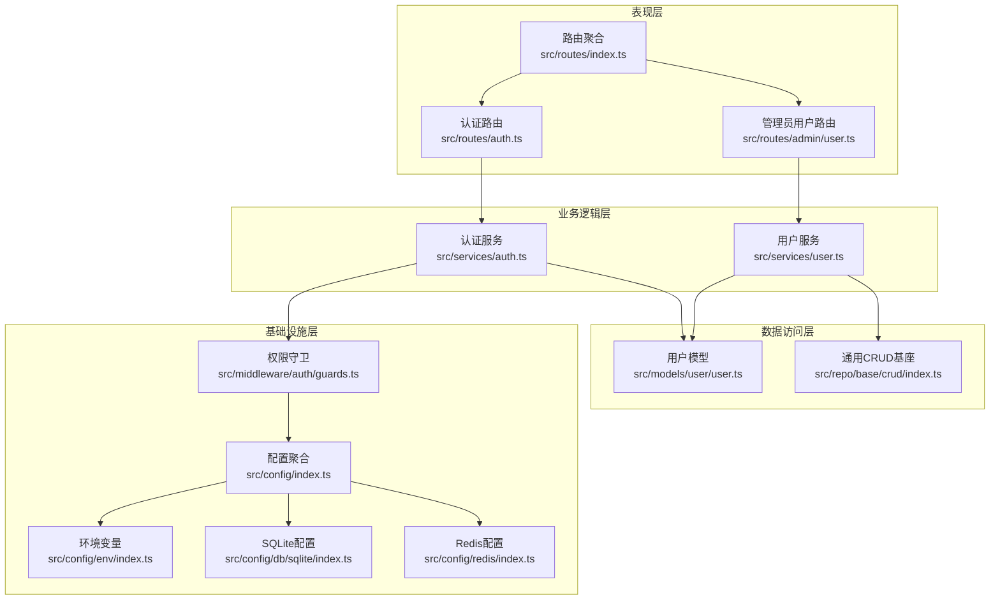
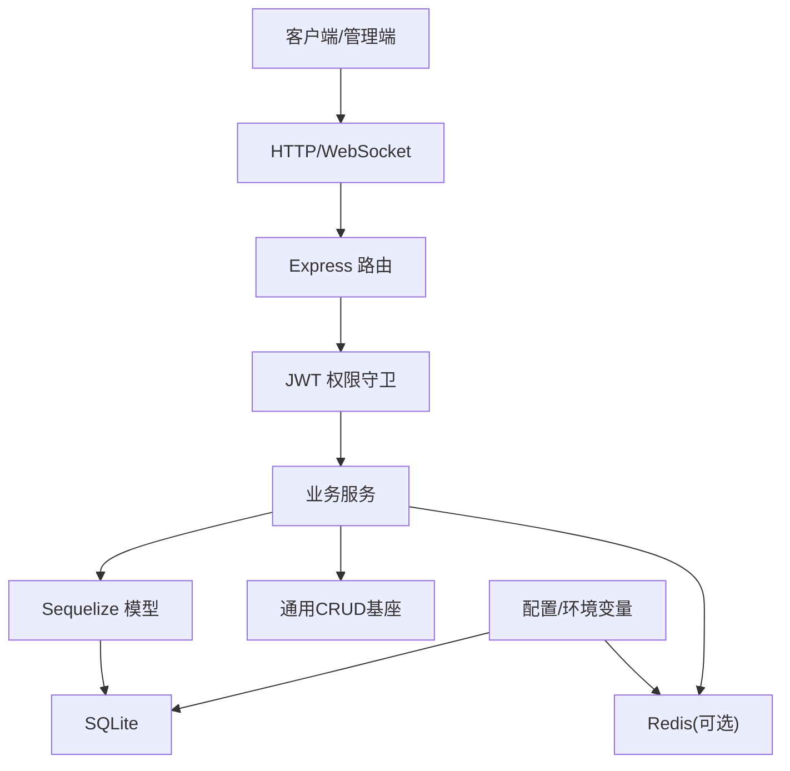
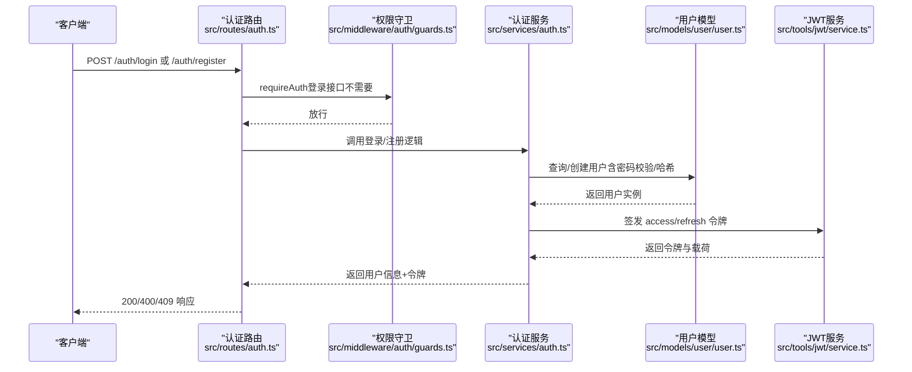
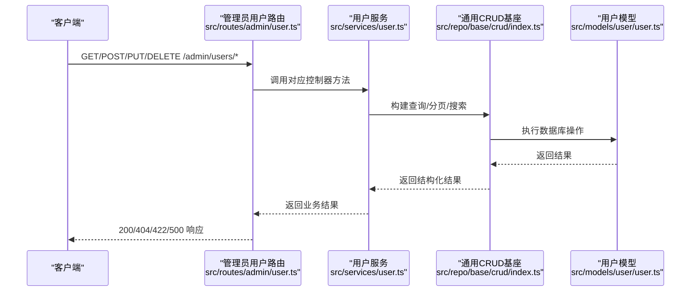
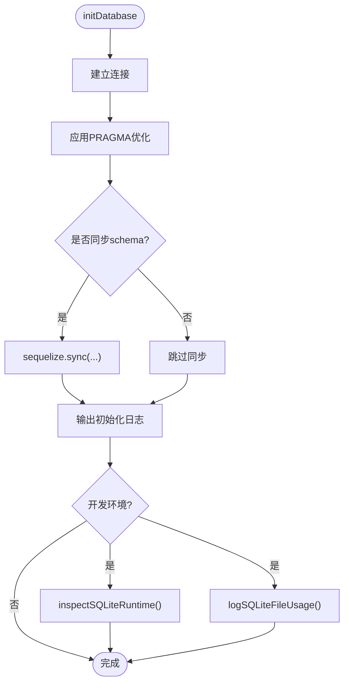
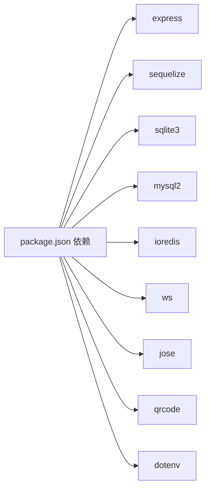
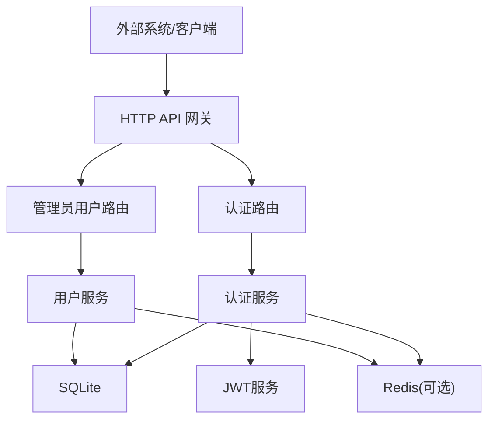

# 架构设计

<cite>
**本文引用的文件**
- [package.json](file://package.json)
- [tsconfig.json](file://tsconfig.json)
- [src/server.ts](file://src/server.ts)
- [src/config/index.ts](file://src/config/index.ts)
- [src/config/env/index.ts](file://src/config/env/index.ts)
- [src/config/db/sqlite/index.ts](file://src/config/db/sqlite/index.ts)
- [src/config/redis/index.ts](file://src/config/redis/index.ts)
- [src/routes/index.ts](file://src/routes/index.ts)
- [src/routes/auth.ts](file://src/routes/auth.ts)
- [src/routes/admin/user.ts](file://src/routes/admin/user.ts)
- [src/middleware/auth/guards.ts](file://src/middleware/auth/guards.ts)
- [src/services/auth.ts](file://src/services/auth.ts)
- [src/services/user.ts](file://src/services/user.ts)
- [src/models/user/user.ts](file://src/models/user/user.ts)
- [src/repo/base/crud/index.ts](file://src/repo/base/crud/index.ts)
- [src/tools/jwt/service.ts](file://src/tools/jwt/service.ts)
</cite>

## 目录
1. [引言](#引言)
2. [项目结构](#项目结构)
3. [核心组件](#核心组件)
4. [架构总览](#架构总览)
5. [详细组件分析](#详细组件分析)
6. [依赖关系分析](#依赖关系分析)
7. [性能考量](#性能考量)
8. [故障排查指南](#故障排查指南)
9. [结论](#结论)
10. [附录](#附录)

## 引言
本架构设计文档面向 IM-API 项目，系统采用分层架构，围绕表现层（Express 路由与控制器）、业务逻辑层（服务与工具）、数据访问层（Sequelize 模型与 CRUD 基座）、基础设施层（环境配置、数据库、Redis、日志与中间件）展开。系统边界清晰：外部通过 HTTP/WebSocket（可选）接入，内部通过 JWT 实现认证鉴权，通过 SQLite 存储用户与业务数据，Redis 提供可选缓存与会话能力。

## 项目结构
项目采用按功能域与职责分层的组织方式：
- 表现层：路由与控制器，负责请求接入与响应输出
- 业务逻辑层：服务类封装领域业务，如认证、用户管理
- 数据访问层：Sequelize 模型与通用 CRUD 基座
- 基础设施层：环境配置、数据库连接、Redis、日志与中间件
- 工具与安全：JWT 服务、密码与加密工具、QR 等



图表来源
- [src/routes/index.ts](file://src/routes/index.ts#L1-L22)
- [src/routes/auth.ts](file://src/routes/auth.ts#L1-L47)
- [src/routes/admin/user.ts](file://src/routes/admin/user.ts#L1-L40)
- [src/services/auth.ts](file://src/services/auth.ts#L1-L170)
- [src/services/user.ts](file://src/services/user.ts)
- [src/models/user/user.ts](file://src/models/user/user.ts#L1-L275)
- [src/repo/base/crud/index.ts](file://src/repo/base/crud/index.ts#L1-L28)
- [src/config/index.ts](file://src/config/index.ts#L1-L30)
- [src/config/env/index.ts](file://src/config/env/index.ts#L1-L223)
- [src/config/db/sqlite/index.ts](file://src/config/db/sqlite/index.ts#L1-L410)
- [src/config/redis/index.ts](file://src/config/redis/index.ts#L1-L40)
- [src/middleware/auth/guards.ts](file://src/middleware/auth/guards.ts#L1-L195)

章节来源
- [src/server.ts](file://src/server.ts#L1-L74)
- [src/config/index.ts](file://src/config/index.ts#L1-L30)

## 核心组件
- 应用启动与中间件装配：启动入口负责初始化数据库、装配 CORS、请求 ID、日志与路由，并提供健康检查端点
- 路由与控制器：路由模块聚合认证与管理员用户路由，控制器由契约层生成，统一处理 CRUD
- 服务层：认证服务负责注册、登录、签发令牌；用户服务基于通用 CRUD 基座提供用户管理能力
- 数据层：用户模型定义字段、校验、索引与钩子；通用 CRUD 基座提供查询构建、分页、搜索等能力
- 基础设施：环境变量解析与类型安全；SQLite 优化配置与运行时状态；Redis 可选连接；JWT 服务与守卫中间件

章节来源
- [src/server.ts](file://src/server.ts#L27-L67)
- [src/routes/index.ts](file://src/routes/index.ts#L1-L22)
- [src/services/auth.ts](file://src/services/auth.ts#L86-L167)
- [src/models/user/user.ts](file://src/models/user/user.ts#L109-L266)
- [src/repo/base/crud/index.ts](file://src/repo/base/crud/index.ts#L1-L28)
- [src/config/env/index.ts](file://src/config/env/index.ts#L166-L220)
- [src/config/db/sqlite/index.ts](file://src/config/db/sqlite/index.ts#L120-L128)
- [src/config/redis/index.ts](file://src/config/redis/index.ts#L5-L15)
- [src/middleware/auth/guards.ts](file://src/middleware/auth/guards.ts#L25-L51)

## 架构总览
系统采用“路由-服务-模型-基础设施”的分层架构，职责清晰、耦合度低。请求从路由进入，经守卫中间件鉴权后交由服务层处理，服务层通过模型与通用 CRUD 基座访问数据，基础设施层提供配置、数据库与缓存支撑。



图表来源
- [src/server.ts](file://src/server.ts#L27-L48)
- [src/routes/auth.ts](file://src/routes/auth.ts#L12-L46)
- [src/middleware/auth/guards.ts](file://src/middleware/auth/guards.ts#L1-L195)
- [src/services/auth.ts](file://src/services/auth.ts#L1-L170)
- [src/config/db/sqlite/index.ts](file://src/config/db/sqlite/index.ts#L120-L128)
- [src/config/redis/index.ts](file://src/config/redis/index.ts#L5-L15)

## 详细组件分析

### 组件：认证流程（登录/注册）
该流程展示从路由到服务再到模型与 JWT 的完整链路。



图表来源
- [src/routes/auth.ts](file://src/routes/auth.ts#L18-L44)
- [src/middleware/auth/guards.ts](file://src/middleware/auth/guards.ts#L25-L51)
- [src/services/auth.ts](file://src/services/auth.ts#L94-L134)
- [src/models/user/user.ts](file://src/models/user/user.ts#L69-L89)
- [src/tools/jwt/service.ts](file://src/tools/jwt/service.ts#L41-L56)

章节来源
- [src/routes/auth.ts](file://src/routes/auth.ts#L1-L47)
- [src/services/auth.ts](file://src/services/auth.ts#L86-L167)
- [src/models/user/user.ts](file://src/models/user/user.ts#L109-L266)
- [src/tools/jwt/service.ts](file://src/tools/jwt/service.ts#L27-L97)

### 组件：用户管理（CRUD）
用户管理通过通用 CRUD 基座与服务层协作，路由直接绑定控制器方法。



图表来源
- [src/routes/admin/user.ts](file://src/routes/admin/user.ts#L20-L38)
- [src/services/user.ts](file://src/services/user.ts)
- [src/repo/base/crud/index.ts](file://src/repo/base/crud/index.ts#L16-L28)
- [src/models/user/user.ts](file://src/models/user/user.ts#L109-L266)

章节来源
- [src/routes/admin/user.ts](file://src/routes/admin/user.ts#L1-L40)
- [src/repo/base/crud/index.ts](file://src/repo/base/crud/index.ts#L1-L28)
- [src/models/user/user.ts](file://src/models/user/user.ts#L1-L275)

### 组件：JWT 服务与守卫
JWT 服务负责签发与校验；守卫中间件根据用户载荷进行角色、作用域、VIP、团队与令牌类型校验。

```mermaid
classDiagram
class JwtService {
+signAsync(kind, payload) Promise~string~
+verifyAsync(token) Promise~JwtUserPayload~
+rotateRefreshAsync(refresh, mutate?) Promise~{access, refresh, payload}~
}
class Guards {
+assertRole(user, roles) void
+assertScopes(user, scopes) void
+assertVip(user) void
+assertTeam(user, teams) void
+assertTokenKind(user, kind) void
}
JwtService <.. Guards : "守卫使用JWT载荷"
```

图表来源
- [src/tools/jwt/service.ts](file://src/tools/jwt/service.ts#L27-L97)
- [src/middleware/auth/guards.ts](file://src/middleware/auth/guards.ts#L25-L194)

章节来源
- [src/tools/jwt/service.ts](file://src/tools/jwt/service.ts#L1-L98)
- [src/middleware/auth/guards.ts](file://src/middleware/auth/guards.ts#L1-L195)

### 组件：数据库与运行时状态
系统通过 SQLite 配置提供 WAL 模式、内存映射、缓存与连接池优化，并提供运行时状态与文件占用检查。



图表来源
- [src/config/db/sqlite/index.ts](file://src/config/db/sqlite/index.ts#L368-L409)

章节来源
- [src/config/db/sqlite/index.ts](file://src/config/db/sqlite/index.ts#L120-L128)
- [src/config/db/sqlite/index.ts](file://src/config/db/sqlite/index.ts#L136-L154)
- [src/config/db/sqlite/index.ts](file://src/config/db/sqlite/index.ts#L368-L409)

## 依赖关系分析
- 运行时依赖：Express、Sequelize、SQLite3、MySQL2（可选）、ioredis、ws、jose、qrcode、dotenv
- 开发依赖：TypeScript、tsx、tsc-alias、tsc-esm-fix
- 关键外部集成：数据库（SQLite/MySQL）、Redis、WebSocket（可选）、二维码生成



图表来源
- [package.json](file://package.json#L12-L23)

章节来源
- [package.json](file://package.json#L1-L36)

## 性能考量
- 数据库层面
  - WAL 模式提升并发读写稳定性，结合内存映射与缓存配置降低 I/O 压力
  - 连接池参数与忙等待超时控制并发与锁竞争
  - 运行时状态与文件占用检查用于容量与性能观测
- 缓存与会话
  - Redis 可选启用，适合短期会话、限流与热点数据缓存
- 安全与合规
  - JWT 无过期策略，依赖客户端管理生命周期；如需黑名单可扩展 Redis
  - 密码使用 scrypt 哈希，PIN 二次校验增强安全
- 可扩展性
  - 路由与服务解耦，易于水平扩展
  - SQLite 适合中小规模，MySQL 可平滑迁移

[本节为通用指导，不直接分析具体文件]

## 故障排查指南
- 启动失败
  - 检查数据库连接与 PRAGMA 应用是否成功；查看初始化日志
  - 确认环境变量（端口、数据库方言、Redis 开关等）正确
- 认证异常
  - JWT 校验失败多因签名算法或密钥问题；确认密钥提供器与算法配置一致
  - 登录/注册报错需核对手机号唯一性与密码哈希流程
- 路由鉴权失败
  - 守卫中间件返回 401/403 时，检查令牌类型、角色与作用域
- Redis 不可用
  - 检查连接参数与 ping 结果；确认启用开关与错误回调

章节来源
- [src/config/db/sqlite/index.ts](file://src/config/db/sqlite/index.ts#L405-L409)
- [src/config/env/index.ts](file://src/config/env/index.ts#L166-L220)
- [src/tools/jwt/service.ts](file://src/tools/jwt/service.ts#L66-L75)
- [src/middleware/auth/guards.ts](file://src/middleware/auth/guards.ts#L25-L51)
- [src/config/redis/index.ts](file://src/config/redis/index.ts#L31-L38)

## 结论
IM-API 采用清晰的分层架构与模块化设计，通过 JWT 实现无状态认证，借助 SQLite 与可选 Redis 提供稳定的数据与缓存能力。系统具备良好的可维护性与扩展性，适合中小规模场景快速迭代，并可通过 MySQL 平滑扩容。

[本节为总结性内容，不直接分析具体文件]

## 附录

### 系统上下文图


图表来源
- [src/server.ts](file://src/server.ts#L27-L48)
- [src/routes/auth.ts](file://src/routes/auth.ts#L1-L47)
- [src/routes/admin/user.ts](file://src/routes/admin/user.ts#L1-L40)
- [src/services/auth.ts](file://src/services/auth.ts#L1-L170)
- [src/services/user.ts](file://src/services/user.ts)
- [src/config/db/sqlite/index.ts](file://src/config/db/sqlite/index.ts#L120-L128)
- [src/config/redis/index.ts](file://src/config/redis/index.ts#L5-L15)
- [src/tools/jwt/service.ts](file://src/tools/jwt/service.ts#L27-L97)

### 技术栈与版本兼容性
- 运行时与核心库：Express、Sequelize、SQLite3、ioredis、ws、jose、qrcode、dotenv
- TypeScript 与构建工具：TypeScript、tsx、tsc-alias、tsc-esm-fix
- 版本策略：以 package.json 为准，确保依赖锁定与类型安全

章节来源
- [package.json](file://package.json#L12-L34)
- [tsconfig.json](file://tsconfig.json)