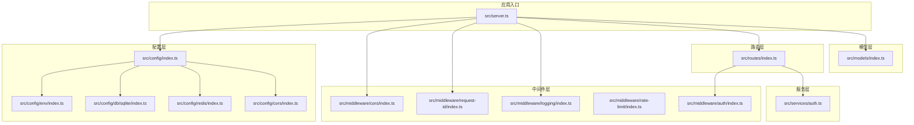
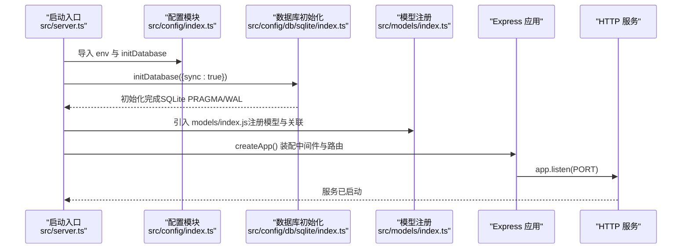
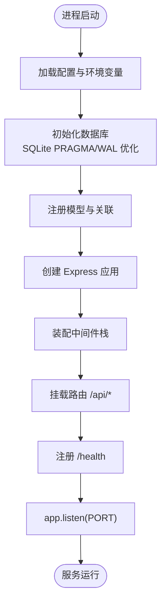
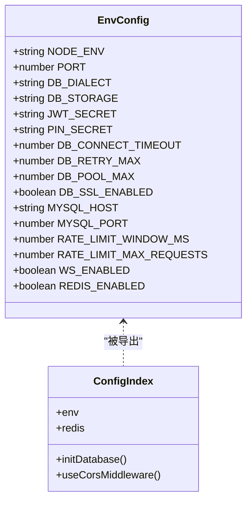
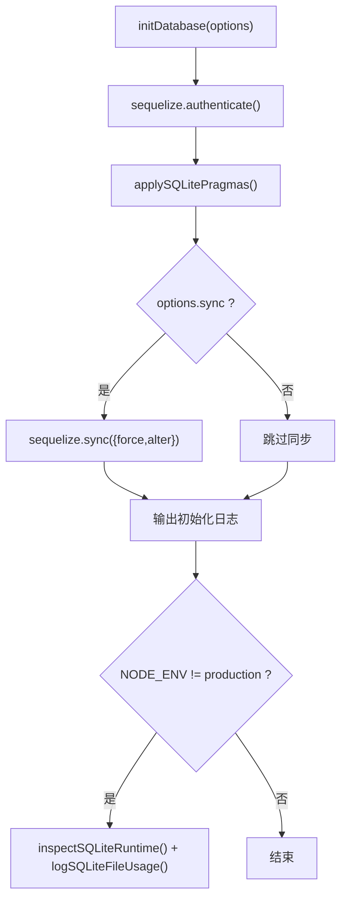
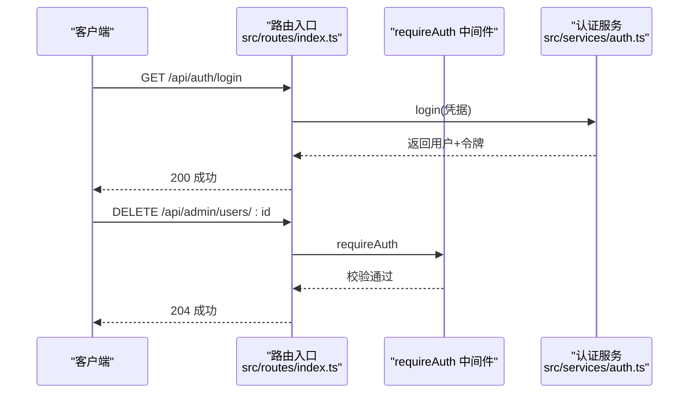
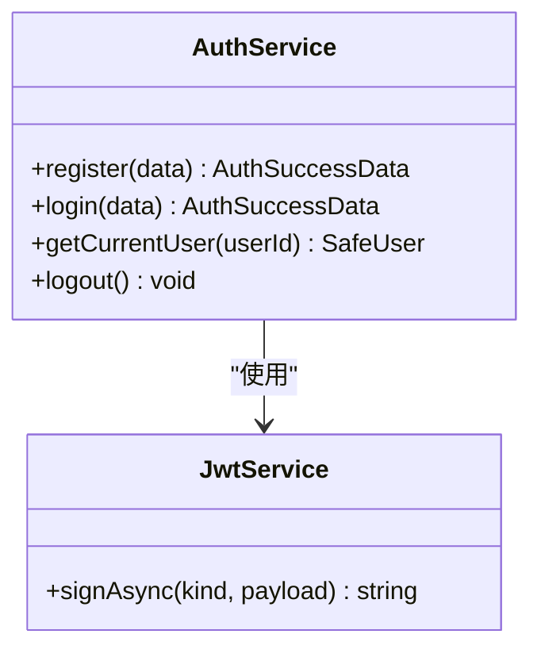
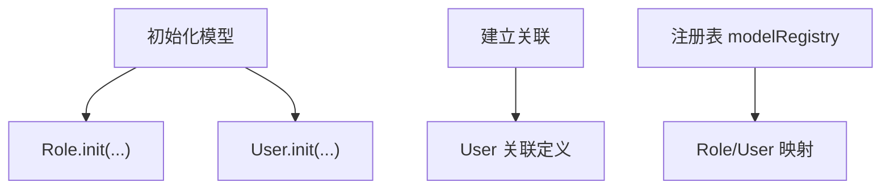
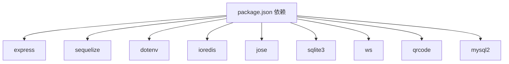

# 核心架构

<cite>
**本文引用的文件**
- [src/server.ts](file://src/server.ts)
- [src/config/index.ts](file://src/config/index.ts)
- [src/config/env/index.ts](file://src/config/env/index.ts)
- [src/config/db/sqlite/index.ts](file://src/config/db/sqlite/index.ts)
- [src/config/redis/index.ts](file://src/config/redis/index.ts)
- [src/config/cors/index.ts](file://src/config/cors/index.ts)
- [src/middleware/cors/index.ts](file://src/middleware/cors/index.ts)
- [src/middleware/logging/index.ts](file://src/middleware/logging/index.ts)
- [src/middleware/rate-limit/index.ts](file://src/middleware/rate-limit/index.ts)
- [src/middleware/request-id/index.ts](file://src/middleware/request-id/index.ts)
- [src/middleware/auth/index.ts](file://src/middleware/auth/index.ts)
- [src/routes/index.ts](file://src/routes/index.ts)
- [src/services/auth.ts](file://src/services/auth.ts)
- [src/models/index.ts](file://src/models/index.ts)
- [package.json](file://package.json)
</cite>

## 目录
1. [简介](#简介)
2. [项目结构](#项目结构)
3. [核心组件](#核心组件)
4. [架构总览](#架构总览)
5. [详细组件分析](#详细组件分析)
6. [依赖分析](#依赖分析)
7. [性能考虑](#性能考虑)
8. [故障排查指南](#故障排查指南)
9. [结论](#结论)
10. [附录](#附录)

## 简介
本项目为一个基于 Express.js 的 IM-API 后端，采用 TypeScript 构建，围绕“配置集中化、中间件标准化、路由分层、模型与服务解耦”的理念组织代码。系统通过统一的启动入口完成数据库初始化、模型注册、中间件装配与路由挂载，并提供健康检查端点与基础安全中间件（CORS、限流、请求追踪）。  
选择 Express.js 的原因在于其生态成熟、中间件体系完善、上手成本低且适合快速迭代；同时结合 Sequelize 与 SQLite/WAL 模式优化，满足中小规模数据持久化需求。配置管理采用 dotenv + 类型安全的 env 抽象，集中暴露于 config/index.ts，便于跨模块复用。

## 项目结构
项目采用按职责分层的目录组织方式：
- config：集中化配置与基础设施（环境变量、数据库、Redis、CORS）
- middleware：可复用的 Express 中间件（CORS、日志、限流、请求 ID、鉴权）
- routes：API 路由入口与分组
- services：业务服务层（认证、角色、用户等）
- models：ORM 模型与关联、注册表
- tools：工具模块（JWT、日志、二维码等）
- repo：仓储层（通用 CRUD、查询模板、校验器等）
- server.ts：应用启动入口

图表来源
- [src/server.ts](file://src/server.ts#L14-L48)
- [src/config/index.ts](file://src/config/index.ts#L7-L29)
- [src/config/env/index.ts](file://src/config/env/index.ts#L166-L220)
- [src/config/db/sqlite/index.ts](file://src/config/db/sqlite/index.ts#L120-L128)
- [src/config/redis/index.ts](file://src/config/redis/index.ts#L5-L15)
- [src/config/cors/index.ts](file://src/config/cors/index.ts#L20-L28)
- [src/middleware/cors/index.ts](file://src/middleware/cors/index.ts#L36-L38)
- [src/middleware/request-id/index.ts](file://src/middleware/request-id/index.ts#L50-L61)
- [src/middleware/logging/index.ts](file://src/middleware/logging/index.ts#L34-L63)
- [src/middleware/rate-limit/index.ts](file://src/middleware/rate-limit/index.ts#L43-L69)
- [src/middleware/auth/index.ts](file://src/middleware/auth/index.ts#L16-L32)
- [src/routes/index.ts](file://src/routes/index.ts#L7-L21)
- [src/services/auth.ts](file://src/services/auth.ts#L86-L167)
- [src/models/index.ts](file://src/models/index.ts#L25-L57)

章节来源
- [src/server.ts](file://src/server.ts#L14-L48)
- [src/config/index.ts](file://src/config/index.ts#L7-L29)

## 核心组件
- 应用入口与启动流程：负责创建 Express 实例、装配中间件、注册路由、初始化数据库与模型、启动 HTTP 服务。
- 配置管理：统一导出 env、数据库、Redis、CORS 等配置与工厂，提供类型安全的配置读取与默认值。
- 中间件体系：CORS、请求 ID、日志、限流、鉴权守卫，形成标准的安全与可观测性基线。
- 路由与鉴权：公开与受保护路由分离，受保护路由通过 requireAuth 中间件进行 JWT 校验。
- 服务层：认证服务封装注册、登录、令牌签发等业务逻辑。
- ORM 层：集中初始化与关联定义，提供模型注册表与通用同步辅助。

章节来源
- [src/server.ts](file://src/server.ts#L27-L48)
- [src/config/env/index.ts](file://src/config/env/index.ts#L166-L220)
- [src/config/db/sqlite/index.ts](file://src/config/db/sqlite/index.ts#L120-L128)
- [src/config/redis/index.ts](file://src/config/redis/index.ts#L5-L15)
- [src/middleware/cors/index.ts](file://src/middleware/cors/index.ts#L36-L38)
- [src/middleware/request-id/index.ts](file://src/middleware/request-id/index.ts#L50-L61)
- [src/middleware/logging/index.ts](file://src/middleware/logging/index.ts#L34-L63)
- [src/middleware/rate-limit/index.ts](file://src/middleware/rate-limit/index.ts#L43-L69)
- [src/middleware/auth/index.ts](file://src/middleware/auth/index.ts#L16-L32)
- [src/routes/index.ts](file://src/routes/index.ts#L7-L21)
- [src/services/auth.ts](file://src/services/auth.ts#L86-L167)
- [src/models/index.ts](file://src/models/index.ts#L25-L57)

## 架构总览
系统采用“配置中心 + 中间件栈 + 路由 + 服务 + ORM”的分层架构。启动时序强调“先配置、后模型、再中间件、最后路由”，以确保依赖顺序正确。

图表来源
- [src/server.ts](file://src/server.ts#L55-L67)
- [src/config/db/sqlite/index.ts](file://src/config/db/sqlite/index.ts#L368-L409)
- [src/models/index.ts](file://src/models/index.ts#L42-L57)

## 详细组件分析

### 启动入口与生命周期
- createApp：创建 Express 实例，按顺序注册 JSON/URL 编码中间件、CORS、请求 ID、日志中间件；挂载 /api 路由；提供 /health 健康检查。
- bootstrap：先执行数据库初始化（含 SQLite PRAGMA/WAL 优化、可选 schema 同步），再创建并启动应用。
- 生命周期：进程启动 → 数据库连接与优化 → 模型注册 → 中间件装配 → 路由注册 → HTTP 服务监听 → 运行中。

图表来源
- [src/server.ts](file://src/server.ts#L27-L48)
- [src/server.ts](file://src/server.ts#L55-L67)
- [src/config/db/sqlite/index.ts](file://src/config/db/sqlite/index.ts#L368-L409)
- [src/models/index.ts](file://src/models/index.ts#L42-L57)

章节来源
- [src/server.ts](file://src/server.ts#L27-L48)
- [src/server.ts](file://src/server.ts#L55-L67)

### 配置管理系统与环境变量
- 环境变量加载：通过 dotenv 在进程启动时加载 .env，随后对关键变量进行类型转换（字符串、数字、布尔）并提供默认值。
- 配置导出：config/index.ts 统一导出 env、数据库、Redis、CORS 等能力，便于跨模块按需引入。
- 关键配置项：运行环境、端口、数据库方言与存储、JWT/PIN 密钥、数据库连接池与超时、SSL 参数、MySQL 连接参数、限流窗口与阈值、WebSocket 与 Redis 开关及连接参数等。

图表来源
- [src/config/env/index.ts](file://src/config/env/index.ts#L106-L160)
- [src/config/index.ts](file://src/config/index.ts#L7-L29)

章节来源
- [src/config/env/index.ts](file://src/config/env/index.ts#L166-L220)
- [src/config/index.ts](file://src/config/index.ts#L7-L29)

### 数据库初始化与 SQLite 优化
- 连接与认证：通过全局 Sequelize 实例进行连接认证。
- SQLite PRAGMA 优化：启用 WAL、NORMAL 同步、内存临时表、外键、缓存与 mmap、自动检查点、锁超时等，提升并发与稳定性。
- 可选 schema 同步：支持 force/alter 等策略，开发环境可选开启。
- 运行时状态与文件占用：提供 PRAGMA 统计与中文字段映射、文件大小日志、WAL 未 checkpoint 估算等，便于诊断。

图表来源
- [src/config/db/sqlite/index.ts](file://src/config/db/sqlite/index.ts#L368-L409)
- [src/config/db/sqlite/index.ts](file://src/config/db/sqlite/index.ts#L136-L154)
- [src/config/db/sqlite/index.ts](file://src/config/db/sqlite/index.ts#L162-L207)
- [src/config/db/sqlite/index.ts](file://src/config/db/sqlite/index.ts#L265-L285)
- [src/config/db/sqlite/index.ts](file://src/config/db/sqlite/index.ts#L289-L330)

章节来源
- [src/config/db/sqlite/index.ts](file://src/config/db/sqlite/index.ts#L120-L128)
- [src/config/db/sqlite/index.ts](file://src/config/db/sqlite/index.ts#L368-L409)

### 中间件配置与安全基线
- CORS：动态 origin、允许常用头部与凭证，保障本地与局域网联调体验。
- 请求 ID：确保每个请求具备 x-request-id/x-trace-id，并在响应头回写，便于链路追踪。
- 日志：基于 traceId 绑定上下文，记录方法、URL、状态码、耗时与响应长度。
- 限流：按 IP 的固定窗口计数限流，窗口与阈值来自 env。
- 鉴权：requireAuth 与多种守卫（角色、作用域、VIP、团队、Token 类型）统一导出，配合路由使用。

图表来源
- [src/middleware/cors/index.ts](file://src/middleware/cors/index.ts#L36-L38)
- [src/middleware/request-id/index.ts](file://src/middleware/request-id/index.ts#L50-L61)
- [src/middleware/logging/index.ts](file://src/middleware/logging/index.ts#L34-L63)
- [src/middleware/rate-limit/index.ts](file://src/middleware/rate-limit/index.ts#L43-L69)
- [src/middleware/auth/index.ts](file://src/middleware/auth/index.ts#L16-L32)
- [src/routes/index.ts](file://src/routes/index.ts#L17-L18)

章节来源
- [src/middleware/cors/index.ts](file://src/middleware/cors/index.ts#L20-L28)
- [src/middleware/request-id/index.ts](file://src/middleware/request-id/index.ts#L50-L61)
- [src/middleware/logging/index.ts](file://src/middleware/logging/index.ts#L34-L63)
- [src/middleware/rate-limit/index.ts](file://src/middleware/rate-limit/index.ts#L43-L69)
- [src/middleware/auth/index.ts](file://src/middleware/auth/index.ts#L16-L32)

### 路由与鉴权
- 路由入口：/api 下挂载 auth 与 admin/users 等子路由。
- 鉴权策略：公开路由（如 /api/auth）无需鉴权；受保护路由（如 /api/admin/users）需 requireAuth 中间件。
- 服务集成：认证路由与控制器对接认证服务，完成注册/登录与令牌签发。

图表来源
- [src/routes/index.ts](file://src/routes/index.ts#L7-L21)
- [src/middleware/auth/index.ts](file://src/middleware/auth/index.ts#L16-L32)
- [src/services/auth.ts](file://src/services/auth.ts#L126-L134)

章节来源
- [src/routes/index.ts](file://src/routes/index.ts#L7-L21)
- [src/middleware/auth/index.ts](file://src/middleware/auth/index.ts#L16-L32)
- [src/services/auth.ts](file://src/services/auth.ts#L126-L134)

### 服务层：认证服务
- 单例 JWT 服务：延迟初始化，避免重复创建。
- 令牌签发：构建用户载荷，分别签发 access 与 refresh 令牌，返回安全用户信息与 payload。
- 业务流程：注册（去重校验）、登录（认证）、获取当前用户、退出（无状态 JWT）。

图表来源
- [src/services/auth.ts](file://src/services/auth.ts#L86-L167)
- [src/services/auth.ts](file://src/services/auth.ts#L24-L37)

章节来源
- [src/services/auth.ts](file://src/services/auth.ts#L86-L167)

### ORM 层：模型注册与关联
- 初始化：按顺序注册 Role、User 等模型至 Sequelize。
- 关联：在所有模型初始化后再建立关联（hasMany/belongsTo 等）。
- 注册表：modelRegistry 提供模型名到静态类的映射，支撑通用 CRUD、权限与后台面板。

图表来源
- [src/models/index.ts](file://src/models/index.ts#L42-L57)
- [src/models/index.ts](file://src/models/index.ts#L97-L101)

章节来源
- [src/models/index.ts](file://src/models/index.ts#L25-L57)
- [src/models/index.ts](file://src/models/index.ts#L97-L101)

## 依赖分析
- 启动依赖：Express、Sequelize、dotenv、ioredis、jose、sqlite3/mysql2、ws、qrcode 等。
- 开发依赖：TypeScript、tsx、tsc-alias、tsc-esm-fix 等，支持热重载与构建产物修正。
- 运行脚本：dev（tsx watch）、build（tsc + 别名 + ESM 修复）、start（node dist/server.js）、seed（种子数据）。

图表来源
- [package.json](file://package.json#L12-L23)

章节来源
- [package.json](file://package.json#L12-L34)

## 性能考虑
- 数据库层面：SQLite 采用 WAL 模式、内存映射、缓存上限与自动检查点，降低锁竞争与 I/O 开销；PRAGMA 参数在开发/调试环境输出中文日志，便于定位瓶颈。
- 连接池：通过 env 控制最大/最小连接、空闲回收、获取超时等，避免资源争用与抖动。
- 中间件：限流按 IP 固定窗口计数，窗口与阈值可配置；日志中间件仅记录必要字段，避免冗余开销。
- 服务层：JWT 服务单例化，减少重复初始化成本。

## 故障排查指南
- 启动失败：检查 .env 是否存在、关键变量（如 DB_STORAGE、JWT_SECRET）是否设置；查看数据库初始化日志与错误堆栈。
- 数据库异常：确认 SQLite 文件路径可写、WAL 文件未被意外删除；在非生产环境可通过运行时状态与文件占用日志定位问题。
- Redis 连接：若启用 Redis，确认主机、端口、密码与 DB；initRedisAsync 会在 ping 失败时抛错，便于早期发现配置问题。
- CORS 问题：确认浏览器端是否携带 Cookie/凭证，后端 origin 是否允许；必要时调整允许的源与头部。
- 限流触发：检查客户端 IP 与限流窗口/阈值配置，确认是否被误伤。

章节来源
- [src/config/db/sqlite/index.ts](file://src/config/db/sqlite/index.ts#L405-L408)
- [src/config/redis/index.ts](file://src/config/redis/index.ts#L31-L38)
- [src/middleware/rate-limit/index.ts](file://src/middleware/rate-limit/index.ts#L54-L55)

## 结论
本项目以 Express 为核心，结合类型安全的配置抽象、标准化中间件与清晰的路由分层，构建了可维护、可扩展的 API 基础设施。数据库采用 SQLite+WAL+PRAGMA 优化，兼顾性能与易用性；服务层通过单例 JWT 与模型注册表实现业务与数据的解耦。整体架构强调“启动顺序可控、配置集中、中间件可插拔、路由可扩展”，适合中小型 IM 场景的快速迭代与稳定运行。

## 附录
- 启动命令：开发（tsx watch）、构建（tsc + 别名 + ESM 修复）、运行（node dist/server.js）、种子数据（tsx seed）。
- 关键环境变量：NODE_ENV、PORT、DB_*、JWT_SECRET、PIN_SECRET、MYSQL_*、RATE_LIMIT_*、WS_*、REDIS_* 等。

章节来源
- [package.json](file://package.json#L6-L10)
- [src/config/env/index.ts](file://src/config/env/index.ts#L166-L220)