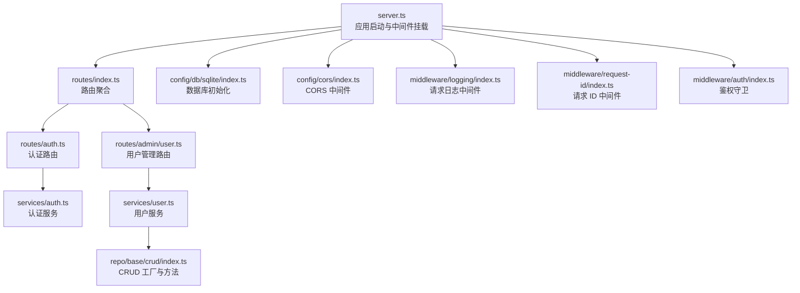
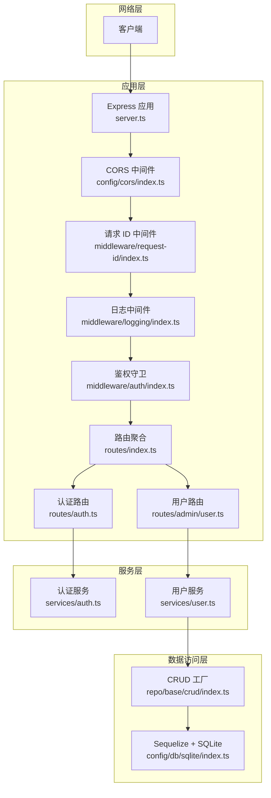
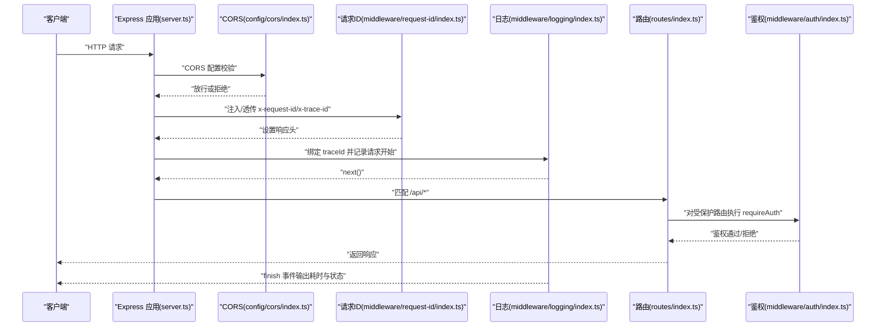
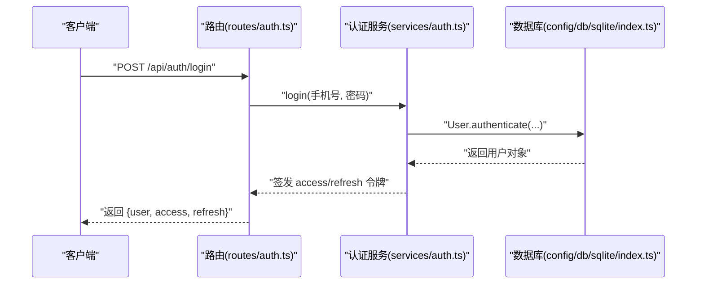
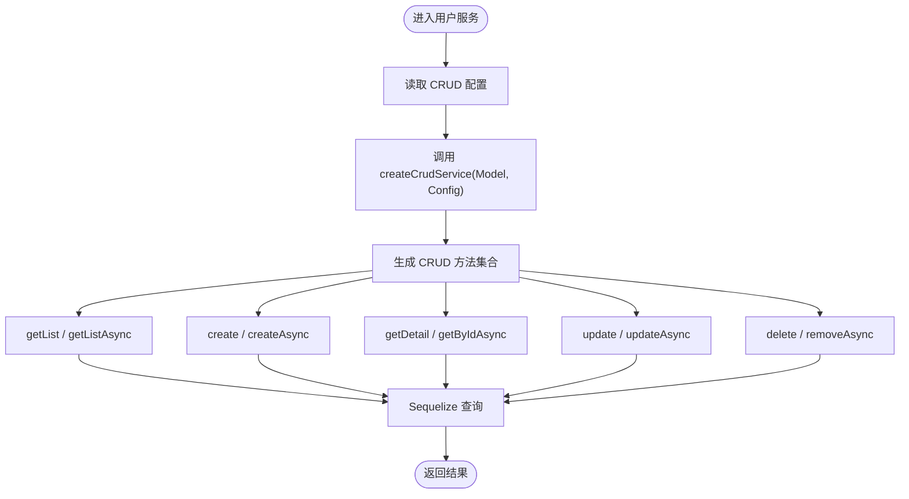
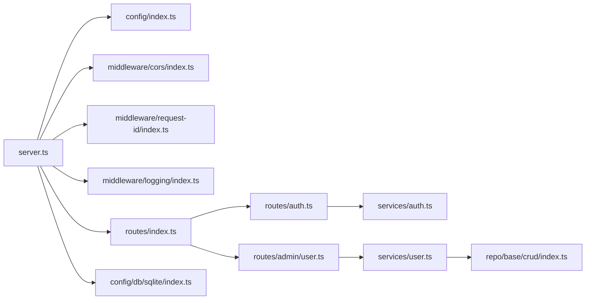

# 组件交互关系

<cite>
**本文引用的文件**
- [src/server.ts](file://src/server.ts)
- [src/config/index.ts](file://src/config/index.ts)
- [src/config/env/index.ts](file://src/config/env/index.ts)
- [src/config/db/sqlite/index.ts](file://src/config/db/sqlite/index.ts)
- [src/config/cors/index.ts](file://src/config/cors/index.ts)
- [src/middleware/logging/index.ts](file://src/middleware/logging/index.ts)
- [src/middleware/auth/index.ts](file://src/middleware/auth/index.ts)
- [src/middleware/request-id/index.ts](file://src/middleware/request-id/index.ts)
- [src/routes/index.ts](file://src/routes/index.ts)
- [src/routes/auth.ts](file://src/routes/auth.ts)
- [src/routes/admin/user.ts](file://src/routes/admin/user.ts)
- [src/services/auth.ts](file://src/services/auth.ts)
- [src/services/user.ts](file://src/services/user.ts)
- [src/repo/base/crud/index.ts](file://src/repo/base/crud/index.ts)
</cite>

## 目录
1. [引言](#引言)
2. [项目结构](#项目结构)
3. [核心组件](#核心组件)
4. [架构总览](#架构总览)
5. [详细组件分析](#详细组件分析)
6. [依赖分析](#依赖分析)
7. [性能考虑](#性能考虑)
8. [故障排查指南](#故障排查指南)
9. [结论](#结论)

## 引言
本文件面向 IM-API 项目，系统梳理组件交互关系，重点覆盖以下方面：
- 中间件链式调用顺序与职责边界
- 路由到服务层的调用流程
- 服务层到数据访问层的交互模式
- 组件间的依赖注入与模块化设计
- 事件传播与错误处理机制
- 提供时序图、调用链路图与典型请求处理流程图
- 组件解耦策略与接口抽象原则

## 项目结构
项目采用“按层+按功能”的混合组织方式：
- 入口与启动：server.ts 负责创建 Express 应用、挂载中间件、注册路由、启动 HTTP 服务
- 配置层：集中导出环境变量、数据库、CORS、Redis 等配置与工具
- 中间件层：CORS、日志、请求 ID、鉴权守卫等
- 路由层：对外暴露 /api 下的子路由，区分公开与受保护接口
- 服务层：封装业务逻辑，如认证、用户管理等
- 数据访问层：通过 Sequelize + SQLite 实现 ORM 访问，CRUD 服务由 repo/base/crud 工厂生成

图表来源
- [src/server.ts](file://src/server.ts#L27-L48)
- [src/routes/index.ts](file://src/routes/index.ts#L7-L21)
- [src/routes/auth.ts](file://src/routes/auth.ts#L12-L46)
- [src/routes/admin/user.ts](file://src/routes/admin/user.ts#L12-L39)
- [src/services/auth.ts](file://src/services/auth.ts#L86-L169)
- [src/services/user.ts](file://src/services/user.ts#L13-L59)
- [src/repo/base/crud/index.ts](file://src/repo/base/crud/index.ts#L16-L28)
- [src/config/db/sqlite/index.ts](file://src/config/db/sqlite/index.ts#L120-L128)
- [src/config/cors/index.ts](file://src/config/cors/index.ts#L36-L38)
- [src/middleware/logging/index.ts](file://src/middleware/logging/index.ts#L34-L63)
- [src/middleware/request-id/index.ts](file://src/middleware/request-id/index.ts)
- [src/middleware/auth/index.ts](file://src/middleware/auth/index.ts#L12-L44)

章节来源
- [src/server.ts](file://src/server.ts#L14-L48)
- [src/config/index.ts](file://src/config/index.ts#L7-L29)
- [src/config/env/index.ts](file://src/config/env/index.ts#L166-L220)

## 核心组件
- 应用入口与启动器：负责创建 Express 实例、初始化数据库、挂载中间件、注册路由、启动服务
- 配置模块：统一导出环境变量、数据库连接、CORS、Redis 等
- 中间件栈：JSON/URL 编码解析、CORS、请求 ID、日志、鉴权守卫
- 路由层：公开与受保护接口分组，绑定控制器契约
- 服务层：认证服务、用户服务；用户服务通过 CRUD 工厂生成标准 CRUD 能力
- 数据访问层：Sequelize + SQLite，CRUD 方法由工厂按配置生成

章节来源
- [src/server.ts](file://src/server.ts#L27-L48)
- [src/config/db/sqlite/index.ts](file://src/config/db/sqlite/index.ts#L120-L128)
- [src/config/cors/index.ts](file://src/config/cors/index.ts#L20-L38)
- [src/middleware/logging/index.ts](file://src/middleware/logging/index.ts#L34-L63)
- [src/middleware/auth/index.ts](file://src/middleware/auth/index.ts#L12-L44)
- [src/routes/auth.ts](file://src/routes/auth.ts#L12-L46)
- [src/routes/admin/user.ts](file://src/routes/admin/user.ts#L12-L39)
- [src/services/auth.ts](file://src/services/auth.ts#L86-L169)
- [src/services/user.ts](file://src/services/user.ts#L13-L59)
- [src/repo/base/crud/index.ts](file://src/repo/base/crud/index.ts#L16-L28)

## 架构总览
下图展示了从请求进入至数据库查询的整体链路，以及各组件间的依赖方向。

图表来源
- [src/server.ts](file://src/server.ts#L27-L48)
- [src/config/cors/index.ts](file://src/config/cors/index.ts#L36-L38)
- [src/middleware/request-id/index.ts](file://src/middleware/request-id/index.ts)
- [src/middleware/logging/index.ts](file://src/middleware/logging/index.ts#L34-L63)
- [src/middleware/auth/index.ts](file://src/middleware/auth/index.ts#L12-L44)
- [src/routes/index.ts](file://src/routes/index.ts#L7-L21)
- [src/routes/auth.ts](file://src/routes/auth.ts#L12-L46)
- [src/routes/admin/user.ts](file://src/routes/admin/user.ts#L12-L39)
- [src/services/auth.ts](file://src/services/auth.ts#L86-L169)
- [src/services/user.ts](file://src/services/user.ts#L13-L59)
- [src/repo/base/crud/index.ts](file://src/repo/base/crud/index.ts#L16-L28)
- [src/config/db/sqlite/index.ts](file://src/config/db/sqlite/index.ts#L120-L128)

## 详细组件分析

### 中间件链式调用与职责边界
- 顺序：JSON/URL 解析 → CORS → 请求 ID → 日志 → 路由 → 鉴权守卫
- CORS：动态 origin 配置，允许凭证与常用头部
- 请求 ID：从请求头提取 traceId，若无则生成 UUID，写入响应头
- 日志：基于 traceId 绑定上下文，记录方法、URL、状态码、耗时、响应长度
- 鉴权守卫：requireAuth 作为路由中间件，对受保护接口生效

图表来源
- [src/server.ts](file://src/server.ts#L27-L48)
- [src/config/cors/index.ts](file://src/config/cors/index.ts#L20-L38)
- [src/middleware/request-id/index.ts](file://src/middleware/request-id/index.ts)
- [src/middleware/logging/index.ts](file://src/middleware/logging/index.ts#L34-L63)
- [src/routes/index.ts](file://src/routes/index.ts#L7-L21)
- [src/middleware/auth/index.ts](file://src/middleware/auth/index.ts#L12-L44)

章节来源
- [src/server.ts](file://src/server.ts#L27-L48)
- [src/config/cors/index.ts](file://src/config/cors/index.ts#L20-L38)
- [src/middleware/logging/index.ts](file://src/middleware/logging/index.ts#L34-L63)
- [src/middleware/auth/index.ts](file://src/middleware/auth/index.ts#L12-L44)

### 路由到服务层的调用流程
- 认证路由：注册、登录、退出、获取当前用户，绑定控制器契约
- 用户路由：基于 CRUD 控制器生成列表、详情、创建、更新、删除
- 受保护路由：通过 requireAuth 中间件拦截未授权请求

图表来源
- [src/routes/auth.ts](file://src/routes/auth.ts#L12-L46)
- [src/services/auth.ts](file://src/services/auth.ts#L126-L134)
- [src/config/db/sqlite/index.ts](file://src/config/db/sqlite/index.ts#L120-L128)

章节来源
- [src/routes/auth.ts](file://src/routes/auth.ts#L12-L46)
- [src/services/auth.ts](file://src/services/auth.ts#L86-L169)

### 服务层到数据访问层的交互模式
- 用户服务通过 CRUD 工厂按配置生成标准 CRUD 方法
- CRUD 工厂导出 listAsync/getByIdAsync/createAsync/updateAsync/removeAsync/searchAsync/treeAsync 等异步方法
- 认证服务直接使用模型 User 的静态方法与钩子完成密码处理与签发令牌

图表来源
- [src/services/user.ts](file://src/services/user.ts#L13-L59)
- [src/repo/base/crud/index.ts](file://src/repo/base/crud/index.ts#L16-L28)
- [src/config/db/sqlite/index.ts](file://src/config/db/sqlite/index.ts#L120-L128)

章节来源
- [src/services/user.ts](file://src/services/user.ts#L13-L59)
- [src/repo/base/crud/index.ts](file://src/repo/base/crud/index.ts#L16-L28)

### 依赖注入与模块化设计
- 依赖注入策略
  - 服务层通过构造函数/工厂函数获取依赖（如 JWT 服务单例）
  - 路由层通过控制器契约与服务实例解耦
  - 配置层统一导出，避免跨模块直接 import 具体实现
- 接口抽象
  - CRUD 工厂以配置驱动生成接口，降低对具体模型的耦合
  - 中间件以 RequestHandler 形式暴露，便于组合
- 模块化原则
  - 按功能分包（auth、user、admin）、按关注点分层（config、middleware、routes、services、repo）
  - 明确的导出入口（index.ts），隐藏内部实现细节

章节来源
- [src/services/auth.ts](file://src/services/auth.ts#L24-L37)
- [src/services/user.ts](file://src/services/user.ts#L13-L59)
- [src/config/index.ts](file://src/config/index.ts#L7-L29)

### 事件传播与错误处理机制
- 请求生命周期事件
  - finish 事件用于计算耗时并记录日志
- 错误传播
  - 服务层抛出带状态码的错误（如 409、404），路由层捕获并返回
  - 中间件链中任一环节异常，将被上层统一处理（建议结合全局错误处理器）

章节来源
- [src/middleware/logging/index.ts](file://src/middleware/logging/index.ts#L42-L55)
- [src/services/auth.ts](file://src/services/auth.ts#L102-L106)
- [src/services/auth.ts](file://src/services/auth.ts#L146-L149)

## 依赖分析
- 组件内聚与耦合
  - 路由层与服务层通过契约解耦，便于替换与测试
  - 服务层与数据访问层通过模型与工厂解耦，便于切换存储
- 外部依赖
  - Express、Sequelize、cors、dotenv 等
- 潜在循环依赖
  - 通过导出入口与延迟初始化避免循环引用

图表来源
- [src/server.ts](file://src/server.ts#L14-L48)
- [src/config/index.ts](file://src/config/index.ts#L7-L29)
- [src/config/cors/index.ts](file://src/config/cors/index.ts#L36-L38)
- [src/middleware/logging/index.ts](file://src/middleware/logging/index.ts#L34-L63)
- [src/routes/index.ts](file://src/routes/index.ts#L7-L21)
- [src/routes/auth.ts](file://src/routes/auth.ts#L12-L46)
- [src/routes/admin/user.ts](file://src/routes/admin/user.ts#L12-L39)
- [src/services/auth.ts](file://src/services/auth.ts#L86-L169)
- [src/services/user.ts](file://src/services/user.ts#L13-L59)
- [src/repo/base/crud/index.ts](file://src/repo/base/crud/index.ts#L16-L28)
- [src/config/db/sqlite/index.ts](file://src/config/db/sqlite/index.ts#L120-L128)

章节来源
- [src/server.ts](file://src/server.ts#L14-L48)
- [src/config/index.ts](file://src/config/index.ts#L7-L29)

## 性能考虑
- 数据库层
  - SQLite 采用 WAL 模式、mmap、cache_size、busy_timeout 等 PRAGMA 优化
  - 连接池参数可调，建议结合压测调整 max/min/idle/acquire
- 中间件层
  - 日志中间件仅在 finish 事件输出，避免阻塞主流程
  - CORS 放行凭证时注意 origin 策略，避免宽松导致安全风险
- 服务层
  - CRUD 工厂按需生成方法，减少冗余逻辑
  - 认证服务 JWT 单例避免重复初始化

章节来源
- [src/config/db/sqlite/index.ts](file://src/config/db/sqlite/index.ts#L136-L154)
- [src/config/db/sqlite/index.ts](file://src/config/db/sqlite/index.ts#L368-L409)
- [src/middleware/logging/index.ts](file://src/middleware/logging/index.ts#L34-L63)
- [src/services/auth.ts](file://src/services/auth.ts#L24-L37)

## 故障排查指南
- 启动失败
  - 检查数据库连接与 PRAGMA 应用是否成功
  - 确认环境变量（端口、数据库路径、密钥）是否正确
- 认证异常
  - 登录失败：确认手机号是否存在、密码是否正确
  - 令牌无效：确认 JWT 密钥与签名算法一致
- 路由 401
  - 确认请求头携带有效的 Authorization 或符合要求的自定义头
- 日志定位
  - 使用 x-request-id/x-trace-id 在日志中检索完整请求链路

章节来源
- [src/config/db/sqlite/index.ts](file://src/config/db/sqlite/index.ts#L368-L409)
- [src/config/env/index.ts](file://src/config/env/index.ts#L166-L220)
- [src/middleware/logging/index.ts](file://src/middleware/logging/index.ts#L34-L63)
- [src/services/auth.ts](file://src/services/auth.ts#L126-L134)
- [src/middleware/auth/index.ts](file://src/middleware/auth/index.ts#L12-L44)

## 结论
本项目通过清晰的分层与模块化设计，实现了中间件链式调用、路由到服务层、服务层到数据访问层的稳定交互。依赖注入与接口抽象提升了可维护性与可测试性；CRUD 工厂与配置驱动进一步降低了耦合度。建议在现有基础上补充全局错误处理中间件与更完善的监控埋点，以增强可观测性与稳定性。