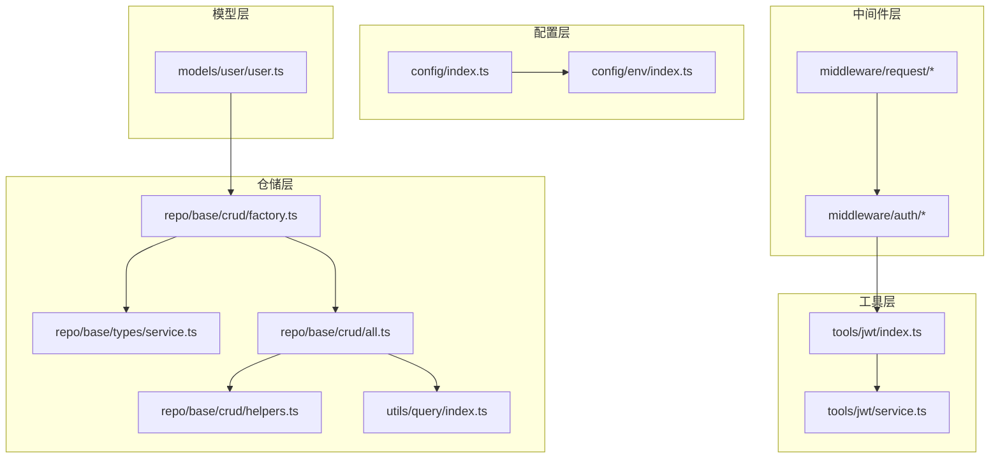
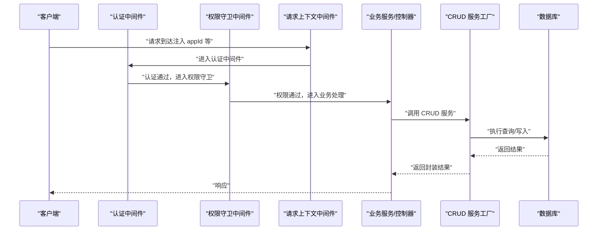
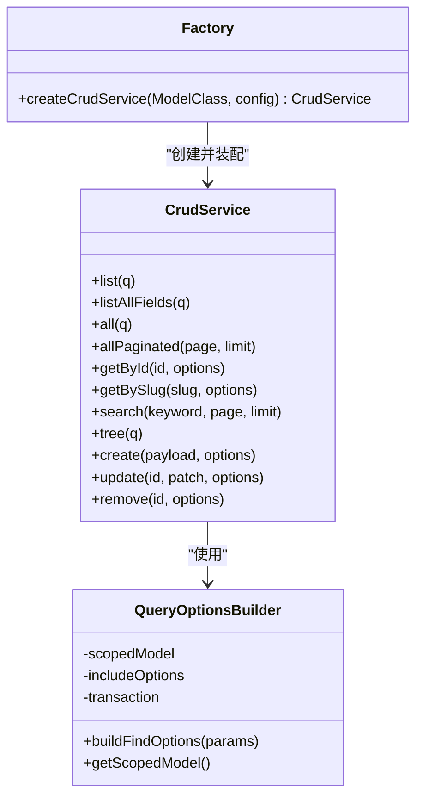
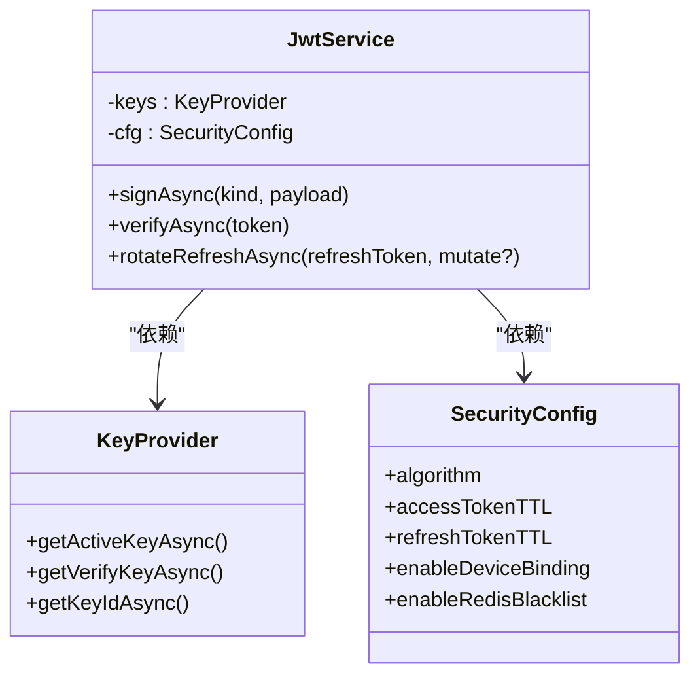
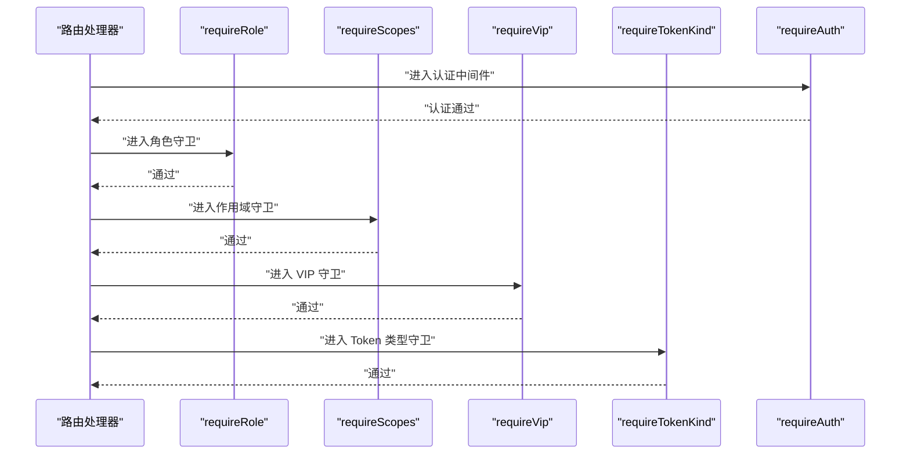
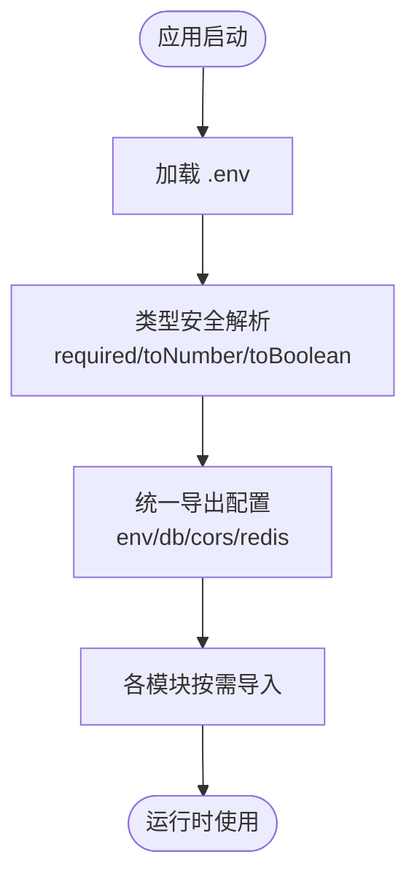
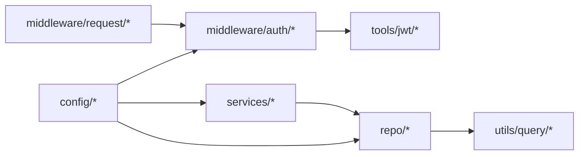

# 设计模式应用

<cite>
**本文引用的文件**
- [src/repo/base/crud/factory.ts](file://src/repo/base/crud/factory.ts)
- [src/repo/base/types/service.ts](file://src/repo/base/types/service.ts)
- [src/repo/base/crud/all.ts](file://src/repo/base/crud/all.ts)
- [src/repo/base/crud/helpers.ts](file://src/repo/base/crud/helpers.ts)
- [src/utils/query/index.ts](file://src/utils/query/index.ts)
- [src/middleware/auth/guards.ts](file://src/middleware/auth/guards.ts)
- [src/middleware/auth/index.ts](file://src/middleware/auth/index.ts)
- [src/middleware/request/app.ts](file://src/middleware/request/app.ts)
- [src/config/index.ts](file://src/config/index.ts)
- [src/config/env/index.ts](file://src/config/env/index.ts)
- [src/tools/jwt/index.ts](file://src/tools/jwt/index.ts)
- [src/tools/jwt/service.ts](file://src/tools/jwt/service.ts)
- [src/models/user/user.ts](file://src/models/user/user.ts)
</cite>

## 目录
1. [引言](#引言)
2. [项目结构](#项目结构)
3. [核心组件](#核心组件)
4. [架构总览](#架构总览)
5. [详细组件分析](#详细组件分析)
6. [依赖关系分析](#依赖关系分析)
7. [性能考量](#性能考量)
8. [故障排查指南](#故障排查指南)
9. [结论](#结论)
10. [附录](#附录)

## 引言
本文件聚焦于 IM-API 项目中已实现或具备落地条件的设计模式，系统梳理并解释以下模式在项目中的应用场景、实现方式与收益：
- 工厂模式：CRUD 服务工厂，统一聚合数据访问能力
- 单例模式：JWT 服务（通过模块级单例与工厂函数组合实现）
- 中间件模式：Express 中间件链（认证、权限守卫、请求上下文注入）
- 依赖注入模式：配置管理（环境变量加载与类型安全封装）

同时给出 UML 类图、调用序列图、流程图与最佳实践建议，帮助读者理解这些模式如何提升可维护性、可扩展性与可测试性，并提供模式选择的技术决策依据与替代方案对比。

## 项目结构
项目采用按“领域/能力”分层的组织方式：
- config：集中管理环境变量、数据库、CORS、Redis 等配置
- contracts：契约与类型定义（如 CRUD 结果包装）
- middleware：HTTP 中间件（认证、权限守卫、日志、限流、请求上下文）
- repo：仓储层（CRUD 抽象、查询构建、验证）
- services：业务服务（如用户、角色、鉴权）
- tools：工具与基础设施（JWT、加密、日志、二维码）
- models：ORM 模型定义（Sequelize）
- routes：路由入口
- utils：通用工具（查询构建、通用函数）

图表来源
- [src/config/index.ts](file://src/config/index.ts#L1-L30)
- [src/config/env/index.ts](file://src/config/env/index.ts#L1-L223)
- [src/middleware/auth/index.ts](file://src/middleware/auth/index.ts#L1-L45)
- [src/middleware/request/app.ts](file://src/middleware/request/app.ts#L1-L99)
- [src/repo/base/crud/factory.ts](file://src/repo/base/crud/factory.ts#L1-L66)
- [src/repo/base/types/service.ts](file://src/repo/base/types/service.ts#L1-L142)
- [src/repo/base/crud/all.ts](file://src/repo/base/crud/all.ts#L1-L70)
- [src/repo/base/crud/helpers.ts](file://src/repo/base/crud/helpers.ts#L1-L238)
- [src/utils/query/index.ts](file://src/utils/query/index.ts#L1-L132)
- [src/tools/jwt/index.ts](file://src/tools/jwt/index.ts#L1-L107)
- [src/tools/jwt/service.ts](file://src/tools/jwt/service.ts#L1-L98)
- [src/models/user/user.ts](file://src/models/user/user.ts#L1-L275)

章节来源
- [src/config/index.ts](file://src/config/index.ts#L1-L30)
- [src/config/env/index.ts](file://src/config/env/index.ts#L1-L223)
- [src/middleware/auth/index.ts](file://src/middleware/auth/index.ts#L1-L45)
- [src/middleware/request/app.ts](file://src/middleware/request/app.ts#L1-L99)
- [src/repo/base/crud/factory.ts](file://src/repo/base/crud/factory.ts#L1-L66)
- [src/repo/base/types/service.ts](file://src/repo/base/types/service.ts#L1-L142)
- [src/repo/base/crud/all.ts](file://src/repo/base/crud/all.ts#L1-L70)
- [src/repo/base/crud/helpers.ts](file://src/repo/base/crud/helpers.ts#L1-L238)
- [src/utils/query/index.ts](file://src/utils/query/index.ts#L1-L132)
- [src/tools/jwt/index.ts](file://src/tools/jwt/index.ts#L1-L107)
- [src/tools/jwt/service.ts](file://src/tools/jwt/service.ts#L1-L98)
- [src/models/user/user.ts](file://src/models/user/user.ts#L1-L275)

## 核心组件
- CRUD 服务工厂与接口：以工厂函数聚合 CRUD 能力，屏蔽底层实现细节，暴露统一接口
- 查询构建器与工具：统一 WHERE、ORDER、分页、Scope、Include 等查询构建逻辑
- JWT 服务与守卫：提供签发、验证、刷新与多维度权限断言的中间件
- 中间件链：认证、权限守卫、请求上下文注入、CORS、限流等
- 配置管理：dotenv 加载、类型安全转换、导出统一入口

章节来源
- [src/repo/base/crud/factory.ts](file://src/repo/base/crud/factory.ts#L25-L65)
- [src/repo/base/types/service.ts](file://src/repo/base/types/service.ts#L22-L142)
- [src/repo/base/crud/helpers.ts](file://src/repo/base/crud/helpers.ts#L174-L238)
- [src/utils/query/index.ts](file://src/utils/query/index.ts#L27-L132)
- [src/tools/jwt/service.ts](file://src/tools/jwt/service.ts#L23-L98)
- [src/middleware/auth/guards.ts](file://src/middleware/auth/guards.ts#L17-L195)
- [src/config/env/index.ts](file://src/config/env/index.ts#L162-L223)

## 架构总览
下图展示“中间件链 + 仓储层 + 工具层”的典型调用路径，体现中间件模式与依赖注入模式的协同：

图表来源
- [src/middleware/auth/index.ts](file://src/middleware/auth/index.ts#L11-L45)
- [src/middleware/auth/guards.ts](file://src/middleware/auth/guards.ts#L17-L195)
- [src/middleware/request/app.ts](file://src/middleware/request/app.ts#L48-L99)
- [src/repo/base/crud/factory.ts](file://src/repo/base/crud/factory.ts#L34-L65)

## 详细组件分析

### 工厂模式：CRUD 服务工厂
- 应用场景
  - 统一聚合 CRUD 操作（查询、分页、创建、更新、删除、树形查询等）
  - 支持关联查询、Scope、事务、分页与字段裁剪
  - 降低上层对底层 ORM 的耦合度，便于替换与扩展
- 实现方式
  - 工厂函数接收 Sequelize 模型类与配置对象，返回统一的 CrudService 接口实例
  - 各具体 CRUD 方法通过独立模块实现，工厂负责装配与导出
  - 查询构建由 QueryOptionsBuilder 统一封装，支持 Scope、Include、Transaction
- 好处
  - 降低重复代码，提升一致性
  - 易于单元测试与替换底层实现
  - 便于扩展新的 CRUD 能力（新增方法只需在工厂中注册）
- 最佳实践
  - 将配置与模型解耦，通过配置对象控制字段、默认排序、Scope、Include
  - 在工厂中集中处理分页与事务，避免分散逻辑
  - 对外只暴露接口类型，隐藏实现细节

图表来源
- [src/repo/base/types/service.ts](file://src/repo/base/types/service.ts#L22-L142)
- [src/repo/base/crud/helpers.ts](file://src/repo/base/crud/helpers.ts#L174-L238)
- [src/repo/base/crud/factory.ts](file://src/repo/base/crud/factory.ts#L25-L65)

章节来源
- [src/repo/base/crud/factory.ts](file://src/repo/base/crud/factory.ts#L25-L65)
- [src/repo/base/types/service.ts](file://src/repo/base/types/service.ts#L22-L142)
- [src/repo/base/crud/all.ts](file://src/repo/base/crud/all.ts#L17-L70)
- [src/repo/base/crud/helpers.ts](file://src/repo/base/crud/helpers.ts#L174-L238)

### 单例模式：JWT 服务
- 应用场景
  - 在进程生命周期内复用同一套密钥提供器与安全配置，避免重复初始化
  - 通过工厂函数按环境变量动态创建服务实例，满足不同部署场景（HS256/RS256）
- 实现方式
  - 工具模块统一导出 JwtService 类与 createJwtServiceFromEnv 工厂函数
  - 服务内部持有 KeyProvider 与 SecurityConfig，提供签发、验证、刷新能力
- 好处
  - 保证密钥与配置的一致性，减少配置漂移
  - 便于替换密钥提供器与算法，提升可测试性
- 最佳实践
  - 将密钥路径、算法、TTL 等配置集中管理并通过环境变量注入
  - 在应用启动阶段创建服务实例并注入到中间件与控制器

图表来源
- [src/tools/jwt/service.ts](file://src/tools/jwt/service.ts#L23-L98)
- [src/tools/jwt/index.ts](file://src/tools/jwt/index.ts#L70-L107)

章节来源
- [src/tools/jwt/service.ts](file://src/tools/jwt/service.ts#L23-L98)
- [src/tools/jwt/index.ts](file://src/tools/jwt/index.ts#L70-L107)

### 中间件模式：Express 中间件链
- 应用场景
  - 认证（requireAuth）、权限守卫（角色、作用域、VIP、团队、Token 类型）、请求上下文注入（appId）、CORS、限流等
  - 通过中间件组合实现横切关注点，保持路由处理器的简洁
- 实现方式
  - 认证与守卫以工厂函数返回 RequestHandler，支持链式组合
  - 请求上下文中间件注入 appId 等字段到 req 对象
  - 中间件聚合出口统一导出，便于在路由中按需组合
- 好处
  - 逻辑清晰、职责单一，易于测试与复用
  - 通过组合实现灵活的权限策略
- 最佳实践
  - 将守卫函数与错误处理解耦，确保统一的错误响应格式
  - 在中间件中尽早失败，减少无效调用

图表来源
- [src/middleware/auth/guards.ts](file://src/middleware/auth/guards.ts#L17-L195)
- [src/middleware/auth/index.ts](file://src/middleware/auth/index.ts#L11-L45)

章节来源
- [src/middleware/auth/guards.ts](file://src/middleware/auth/guards.ts#L17-L195)
- [src/middleware/auth/index.ts](file://src/middleware/auth/index.ts#L11-L45)
- [src/middleware/request/app.ts](file://src/middleware/request/app.ts#L48-L99)

### 依赖注入模式：配置管理
- 应用场景
  - 将环境变量加载、类型安全转换与导出统一抽象，避免在各模块中重复解析
  - 通过模块导出统一入口，便于替换与测试
- 实现方式
  - 环境变量模块集中加载 .env，提供 required、toNumber、toBoolean 等转换函数
  - 配置模块统一导出 env、数据库、CORS、Redis 等能力
- 好处
  - 类型安全、边界清晰、易于替换与测试
  - 降低配置散落导致的运维风险
- 最佳实践
  - 必填项必须显式校验，缺失时直接抛错
  - 将默认值集中在一处，便于审计与变更

图表来源
- [src/config/env/index.ts](file://src/config/env/index.ts#L15-L223)
- [src/config/index.ts](file://src/config/index.ts#L1-L30)

章节来源
- [src/config/env/index.ts](file://src/config/env/index.ts#L15-L223)
- [src/config/index.ts](file://src/config/index.ts#L1-L30)

## 依赖关系分析
- 中间件链依赖 JWT 工具模块进行权限断言
- 仓储层依赖查询构建工具与 ORM 配置
- 业务服务通过 CRUD 工厂与模型交互
- 配置模块为各层提供统一的环境变量与连接配置

图表来源
- [src/middleware/auth/index.ts](file://src/middleware/auth/index.ts#L11-L45)
- [src/middleware/request/app.ts](file://src/middleware/request/app.ts#L48-L99)
- [src/repo/base/crud/helpers.ts](file://src/repo/base/crud/helpers.ts#L174-L238)
- [src/utils/query/index.ts](file://src/utils/query/index.ts#L27-L132)
- [src/config/index.ts](file://src/config/index.ts#L1-L30)

章节来源
- [src/middleware/auth/index.ts](file://src/middleware/auth/index.ts#L11-L45)
- [src/middleware/request/app.ts](file://src/middleware/request/app.ts#L48-L99)
- [src/repo/base/crud/helpers.ts](file://src/repo/base/crud/helpers.ts#L174-L238)
- [src/utils/query/index.ts](file://src/utils/query/index.ts#L27-L132)
- [src/config/index.ts](file://src/config/index.ts#L1-L30)

## 性能考量
- 查询性能
  - 使用 QueryOptionsBuilder 统一构建 Include 与 Scope，避免重复拼装
  - 合理设置分页上限与默认排序，减少大结果集扫描
- 中间件链
  - 将轻量中间件前置，尽早失败，减少后续处理开销
- JWT
  - 复用单例服务实例，避免频繁创建密钥提供器
- 配置
  - 环境变量一次性加载并冻结，避免运行时重复解析

## 故障排查指南
- 中间件权限失败
  - 检查守卫函数的错误类型与响应格式，确保统一处理
  - 确认 req.user 是否正确注入
- CRUD 查询异常
  - 核查 QueryOptionsBuilder 的 Include 与 Scope 配置
  - 检查 filters 与 search 参数是否符合预期
- JWT 验证失败
  - 确认密钥提供器与算法配置一致
  - 校验 token 类型与过期时间
- 配置加载失败
  - 检查 .env 文件是否存在与字段完整
  - 使用 required 函数定位缺失项

章节来源
- [src/middleware/auth/guards.ts](file://src/middleware/auth/guards.ts#L17-L195)
- [src/repo/base/crud/helpers.ts](file://src/repo/base/crud/helpers.ts#L174-L238)
- [src/tools/jwt/service.ts](file://src/tools/jwt/service.ts#L66-L75)
- [src/config/env/index.ts](file://src/config/env/index.ts#L15-L27)

## 结论
IM-API 项目在仓储层、中间件链与工具层中自然体现了多种设计模式：
- 工厂模式提升了 CRUD 能力的可复用性与可扩展性
- 单例模式配合工厂函数实现了 JWT 服务的稳定与可替换
- 中间件模式使认证与权限控制具备高内聚、低耦合的特性
- 依赖注入模式通过配置模块实现了跨层的统一与可控

这些模式共同提升了系统的可维护性、可扩展性与可测试性。建议在新增模块时遵循现有模式约定，保持一致性与演进的稳定性。

## 附录
- 模式选择的技术决策依据
  - 工厂模式：统一接口、屏蔽复杂性、便于替换
  - 单例模式：资源复用、配置一致性、避免重复初始化
  - 中间件模式：横切关注点分离、链式组合、易测试
  - 依赖注入：解耦、可替换、可测试
- 替代方案对比
  - 工厂 vs 直接构造：工厂更利于扩展与测试替身
  - 单例 vs 多实例：单例适合全局共享资源；多实例适合多租户或多算法场景
  - 中间件 vs 控制器内联：中间件更易复用与组合
  - 配置注入 vs 硬编码：配置注入提升灵活性与安全性