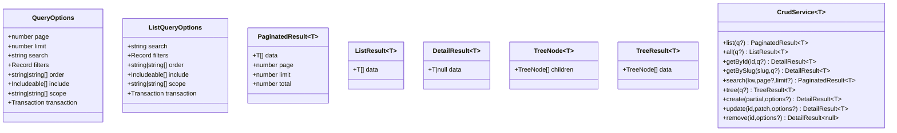

# 类型定义

<cite>
**本文引用的文件**
- [src/types/jwt/index.ts](file://src/types/jwt/index.ts)
- [src/types/jwt/user-types.ts](file://src/types/jwt/user-types.ts)
- [src/types/jwt/keys.ts](file://src/types/jwt/keys.ts)
- [src/types/jwt/jwt-config.ts](file://src/types/jwt/jwt-config.ts)
- [src/models/user/types/index.ts](file://src/models/user/types/index.ts)
- [src/models/user/types/user.ts](file://src/models/user/types/user.ts)
- [src/models/user/types/const.ts](file://src/models/user/types/const.ts)
- [src/models/user/association.ts](file://src/models/user/association.ts)
- [src/models/user/hook.ts](file://src/models/user/hook.ts)
- [src/contracts/crud/types.ts](file://src/contracts/crud/types.ts)
- [src/contracts/crud/create.ts](file://src/contracts/crud/create.ts)
- [src/contracts/crud/ok.ts](file://src/contracts/crud/ok.ts)
- [src/contracts/crud/fail.ts](file://src/contracts/crud/fail.ts)
- [src/contracts/crud/page.ts](file://src/contracts/crud/page.ts)
- [src/repo/base/types/query.ts](file://src/repo/base/types/query.ts)
- [src/repo/base/types/results.ts](file://src/repo/base/types/results.ts)
- [src/repo/base/types/service.ts](file://src/repo/base/types/service.ts)
- [src/middleware/auth/types.ts](file://src/middleware/auth/types.ts)
- [src/services/user.ts](file://src/services/user.ts)
- [src/services/auth.ts](file://src/services/auth.ts)
</cite>

## 目录
1. [引言](#引言)
2. [项目结构](#项目结构)
3. [核心组件](#核心组件)
4. [架构总览](#架构总览)
5. [详细组件分析](#详细组件分析)
6. [依赖分析](#依赖分析)
7. [性能考虑](#性能考虑)
8. [故障排查指南](#故障排查指南)
9. [结论](#结论)
10. [附录](#附录)

## 引言
本文件系统性梳理 IM-API 的 TypeScript 类型定义，聚焦以下目标：
- 解释类型系统设计原则与组织结构
- 文档化接口定义与类型安全实践
- 说明泛型应用与类型推导的使用场景
- 提供 JWT 类型、模型类型与业务类型的设计思路
- 给出类型扩展与自定义的方法
- 涉及类型检查与编译时错误处理
- 提供类型定义的维护与演进策略

## 项目结构
类型定义主要分布在如下模块：
- JWT 类型：集中于 src/types/jwt，提供用户载荷、密钥提供器、安全配置等声明
- 模型类型：集中在 src/models/user/types，包含用户状态、性别、字段清单与属性接口
- 通用契约与控制器：src/contracts/crud，定义统一响应、错误、控制器接口与异步处理器类型
- 仓储层类型：src/repo/base/types，定义查询参数、结果结构与通用 CRUD 服务接口
- 中间件与服务：src/middleware/auth/types 与 src/services，展示类型如何贯穿请求生命周期与业务流程

图表来源
- [src/types/jwt/index.ts](file://src/types/jwt/index.ts#L1-L24)
- [src/models/user/types/index.ts](file://src/models/user/types/index.ts#L1-L30)
- [src/contracts/crud/types.ts](file://src/contracts/crud/types.ts#L1-L197)
- [src/repo/base/types/service.ts](file://src/repo/base/types/service.ts#L1-L142)
- [src/middleware/auth/types.ts](file://src/middleware/auth/types.ts#L1-L34)
- [src/services/user.ts](file://src/services/user.ts#L1-L60)
- [src/services/auth.ts](file://src/services/auth.ts#L1-L170)

章节来源
- [src/types/jwt/index.ts](file://src/types/jwt/index.ts#L1-L24)
- [src/models/user/types/index.ts](file://src/models/user/types/index.ts#L1-L30)
- [src/contracts/crud/types.ts](file://src/contracts/crud/types.ts#L1-L197)
- [src/repo/base/types/service.ts](file://src/repo/base/types/service.ts#L1-L142)
- [src/middleware/auth/types.ts](file://src/middleware/auth/types.ts#L1-L34)

## 核心组件
- JWT 类型体系：统一导出用户载荷、令牌类型、用户状态、密钥提供器与安全配置，确保认证相关类型的一致性与可复用性
- 模型类型体系：用户状态、性别、位置、属性接口与字段清单常量，支撑模型层与服务层的类型安全
- 通用 CRUD 类型：统一的成功/错误响应、异步处理器、控制器接口与查询/结果结构，保证 API 层一致性
- 仓储类型：QueryOptions、ListQueryOptions、CrudOperationOptions 与分页/列表/详情/树形结果结构，抽象数据访问层
- 中间件类型扩展：为 Express Request 注入 req.user，使路由与中间件可直接消费 JWT 载荷类型

章节来源
- [src/types/jwt/user-types.ts](file://src/types/jwt/user-types.ts#L1-L64)
- [src/types/jwt/keys.ts](file://src/types/jwt/keys.ts#L1-L118)
- [src/types/jwt/jwt-config.ts](file://src/types/jwt/jwt-config.ts#L1-L13)
- [src/models/user/types/user.ts](file://src/models/user/types/user.ts#L1-L177)
- [src/models/user/types/const.ts](file://src/models/user/types/const.ts#L1-L34)
- [src/contracts/crud/types.ts](file://src/contracts/crud/types.ts#L1-L197)
- [src/repo/base/types/query.ts](file://src/repo/base/types/query.ts#L1-L64)
- [src/repo/base/types/results.ts](file://src/repo/base/types/results.ts#L1-L65)
- [src/middleware/auth/types.ts](file://src/middleware/auth/types.ts#L1-L34)

## 架构总览
类型系统贯穿“中间件 -> 控制器 -> 服务 -> 仓储 -> 模型”的调用链路，通过泛型与接口约束实现编译期安全。

图表来源
- [src/middleware/auth/types.ts](file://src/middleware/auth/types.ts#L1-L34)
- [src/contracts/crud/create.ts](file://src/contracts/crud/create.ts#L1-L171)
- [src/services/user.ts](file://src/services/user.ts#L1-L60)
- [src/services/auth.ts](file://src/services/auth.ts#L1-L170)
- [src/repo/base/types/service.ts](file://src/repo/base/types/service.ts#L1-L142)
- [src/models/user/user.ts](file://src/models/user/user.ts#L1-L177)

## 详细组件分析

### JWT 类型与安全配置
- 用户载荷与令牌类型：定义 JwtUserPayload、TokenKind、UserState，确保业务载荷字段明确、可选字段清晰
- 密钥提供器与算法：支持 HS256/RS256，KeyProvider 抽象屏蔽密钥来源差异；KeyFactoryOptions 统一工厂参数
- 安全配置：accessTokenTTL、refreshTokenTTL、refreshWindow 与算法选择、设备绑定、黑名单开关
- 统一导出入口：src/types/jwt/index.ts 将上述类型集中导出，便于跨模块引用

图表来源
- [src/types/jwt/user-types.ts](file://src/types/jwt/user-types.ts#L1-L64)
- [src/types/jwt/keys.ts](file://src/types/jwt/keys.ts#L1-L118)
- [src/types/jwt/jwt-config.ts](file://src/types/jwt/jwt-config.ts#L1-L13)

章节来源
- [src/types/jwt/user-types.ts](file://src/types/jwt/user-types.ts#L1-L64)
- [src/types/jwt/keys.ts](file://src/types/jwt/keys.ts#L1-L118)
- [src/types/jwt/jwt-config.ts](file://src/types/jwt/jwt-config.ts#L1-L13)
- [src/types/jwt/index.ts](file://src/types/jwt/index.ts#L1-L24)

### 模型类型与字段清单
- 用户状态与性别：使用 const assertions 生成字面量联合类型，避免字符串字面量漂移
- 用户属性接口：UserAttributes 描述完整字段，包含可空字段与时间戳
- 字段清单常量：USER_LIST/USER_DETAIL/USER_CREATABLE/USER_UPDATABLE/USER_FILTERABLE/USER_SORTABLE，用于控制查询/创建/更新范围
- 关联与钩子：User 与 Role 的 belongsTo/hasMany 关联，保存前钩子对密码进行哈希处理

图表来源
- [src/models/user/types/const.ts](file://src/models/user/types/const.ts#L1-L34)
- [src/models/user/types/user.ts](file://src/models/user/types/user.ts#L1-L177)
- [src/models/user/association.ts](file://src/models/user/association.ts#L1-L24)
- [src/models/user/hook.ts](file://src/models/user/hook.ts#L1-L20)

章节来源
- [src/models/user/types/const.ts](file://src/models/user/types/const.ts#L1-L34)
- [src/models/user/types/user.ts](file://src/models/user/types/user.ts#L1-L177)
- [src/models/user/types/index.ts](file://src/models/user/types/index.ts#L1-L30)
- [src/models/user/association.ts](file://src/models/user/association.ts#L1-L24)
- [src/models/user/hook.ts](file://src/models/user/hook.ts#L1-L20)

### 通用 CRUD 类型与控制器
- 响应契约：ApiSuccessResponse/ApiErrorResponse/ApiErrorDetail，统一成功与错误响应结构
- 异步处理器：AsyncHandler，约束控制器处理函数签名
- 控制器接口：CrudHttpController，提供 list/all/getById/getBySlug/create/update/remove/search/tree/listAllFields 等 REST 方法
- 控制器工厂：createCrudController<Entity>，基于 CrudService<T> 生成控制器，自动包装分页/列表/详情/树形查询与统一响应

图表来源
- [src/contracts/crud/create.ts](file://src/contracts/crud/create.ts#L1-L171)
- [src/contracts/crud/page.ts](file://src/contracts/crud/page.ts#L1-L52)
- [src/contracts/crud/ok.ts](file://src/contracts/crud/ok.ts#L1-L82)
- [src/contracts/crud/types.ts](file://src/contracts/crud/types.ts#L1-L197)

章节来源
- [src/contracts/crud/types.ts](file://src/contracts/crud/types.ts#L1-L197)
- [src/contracts/crud/create.ts](file://src/contracts/crud/create.ts#L1-L171)
- [src/contracts/crud/ok.ts](file://src/contracts/crud/ok.ts#L1-L82)
- [src/contracts/crud/fail.ts](file://src/contracts/crud/fail.ts#L1-L177)
- [src/contracts/crud/page.ts](file://src/contracts/crud/page.ts#L1-L52)

### 仓储层类型与查询/结果结构
- 查询参数：QueryOptions/ListQueryOptions/CrudOperationOptions，支持分页、搜索、过滤、排序、关联、Scope 与事务
- 结果结构：PaginatedResult/ListResult/DetailResult/TreeNode/TreeResult，统一不同查询场景的返回形态
- 服务接口：CrudService<T>，定义 list/all/getById/getBySlug/search/tree/create/update/remove 等方法签名与泛型约束

图表来源
- [src/repo/base/types/query.ts](file://src/repo/base/types/query.ts#L1-L64)
- [src/repo/base/types/results.ts](file://src/repo/base/types/results.ts#L1-L65)
- [src/repo/base/types/service.ts](file://src/repo/base/types/service.ts#L1-L142)

章节来源
- [src/repo/base/types/query.ts](file://src/repo/base/types/query.ts#L1-L64)
- [src/repo/base/types/results.ts](file://src/repo/base/types/results.ts#L1-L65)
- [src/repo/base/types/service.ts](file://src/repo/base/types/service.ts#L1-L142)

### 中间件与服务中的类型应用
- 中间件类型扩展：通过全局命名空间扩展 Express.Request，注入 req.user: JwtUserPayload，使下游中间件与路由可直接使用强类型用户信息
- 服务层应用：AuthService 在签发令牌时使用 JwtUserPayload 构造载荷，并返回包含用户信息与令牌的结构；UserService 通过 CrudService<User> 提供用户相关 CRUD 能力

图表来源
- [src/middleware/auth/types.ts](file://src/middleware/auth/types.ts#L1-L34)
- [src/services/auth.ts](file://src/services/auth.ts#L1-L170)
- [src/contracts/crud/ok.ts](file://src/contracts/crud/ok.ts#L1-L82)

章节来源
- [src/middleware/auth/types.ts](file://src/middleware/auth/types.ts#L1-L34)
- [src/services/auth.ts](file://src/services/auth.ts#L1-L170)
- [src/services/user.ts](file://src/services/user.ts#L1-L60)

## 依赖分析
- 类型导出与复用：src/types/jwt/index.ts 将用户载荷、密钥提供器与安全配置集中导出，降低跨模块导入成本
- 模型类型到服务：UserService 通过导入用户类型常量与属性接口，将字段清单与模型约束传递给服务层
- 控制器到服务：createCrudController 以泛型参数 Entity 约束服务输入输出，结合 QueryOptions 与结果类型，形成端到端类型安全
- 中间件到类型：中间件通过全局扩展注入 JwtUserPayload，使路由与控制器可直接消费强类型用户信息

图表来源
- [src/types/jwt/index.ts](file://src/types/jwt/index.ts#L1-L24)
- [src/middleware/auth/types.ts](file://src/middleware/auth/types.ts#L1-L34)
- [src/services/auth.ts](file://src/services/auth.ts#L1-L170)
- [src/models/user/types/index.ts](file://src/models/user/types/index.ts#L1-L30)
- [src/models/user/types/user.ts](file://src/models/user/types/user.ts#L1-L177)
- [src/contracts/crud/types.ts](file://src/contracts/crud/types.ts#L1-L197)
- [src/contracts/crud/create.ts](file://src/contracts/crud/create.ts#L1-L171)
- [src/repo/base/types/query.ts](file://src/repo/base/types/query.ts#L1-L64)
- [src/repo/base/types/results.ts](file://src/repo/base/types/results.ts#L1-L65)
- [src/repo/base/types/service.ts](file://src/repo/base/types/service.ts#L1-L142)

章节来源
- [src/types/jwt/index.ts](file://src/types/jwt/index.ts#L1-L24)
- [src/models/user/types/index.ts](file://src/models/user/types/index.ts#L1-L30)
- [src/contracts/crud/create.ts](file://src/contracts/crud/create.ts#L1-L171)
- [src/repo/base/types/service.ts](file://src/repo/base/types/service.ts#L1-L142)

## 性能考虑
- 泛型与编译期优化：通过 CrudService<T> 与 createCrudController<Entity> 在编译期锁定实体类型，减少运行时类型检查开销
- 查询参数防御：parseQueryOptions 对 filters 进行 JSON 解析与原型污染防护，避免无效/恶意参数导致的查询异常
- 字段清单控制：使用 USER_LIST/USER_DETAIL/USER_CREATABLE 等常量限制查询/创建/更新字段，降低数据库往返与序列化成本
- 事务与批量操作：CrudOperationOptions 支持传入 Transaction，便于在服务层进行批量写入与一致性保障

## 故障排查指南
- 统一错误响应：fail 函数根据错误类型与状态码映射 ApiCode，确保错误响应一致；支持字段级错误详情
- 认证错误识别：isAuthError 用于区分认证相关错误，按 401/403 等状态返回相应业务码
- 参数解析异常：parseQueryOptions 对非法 JSON 的 filters 进行容错处理，避免解析失败导致整条链路中断
- 服务层错误：AuthService.register/login 在重复/不存在等场景抛出带 status 的错误，便于 fail 统一处理

章节来源
- [src/contracts/crud/fail.ts](file://src/contracts/crud/fail.ts#L1-L177)
- [src/contracts/crud/page.ts](file://src/contracts/crud/page.ts#L1-L52)
- [src/services/auth.ts](file://src/services/auth.ts#L1-L170)

## 结论
本类型系统通过“JWT 类型 -> 模型类型 -> 仓储类型 -> 控制器契约 -> 中间件扩展”的分层设计，实现了端到端的类型安全与可维护性。泛型与接口约束确保了跨模块的一致性，字段清单与查询参数结构提升了性能与安全性。建议在新增模块时遵循现有命名与导出策略，保持类型定义的演进一致性。

## 附录
- 类型扩展与自定义
  - JWT：新增令牌类型或载荷字段时，优先在 JwtUserPayload 中扩展，保持与密钥提供器与安全配置的联动
  - 模型：新增字段时同步更新 UserAttributes 与字段清单常量，避免越权查询/更新
  - 仓储：新增查询场景时扩展 QueryOptions 或新增结果类型，保持 CrudService<T> 的契约稳定
  - 控制器：通过 createCrudController<Entity> 快速生成控制器，必要时在 CrudHttpController 上补充方法别名
- 类型检查与编译时错误处理
  - 使用严格模式与 noImplicitAny，确保类型缺失被及时发现
  - 对外导出统一入口（如 src/types/jwt/index.ts），减少循环依赖与导入复杂度
- 类型定义的维护与演进策略
  - 版本化注释与模块文档，明确变更影响面
  - 通过字段清单与查询参数的常量化，降低破坏性变更风险
  - 对外暴露的类型尽量使用只读与字面量联合，提升类型稳定性