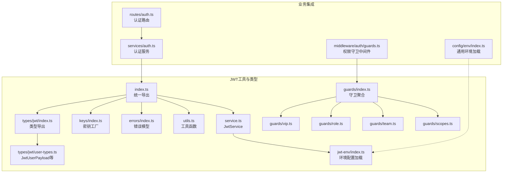
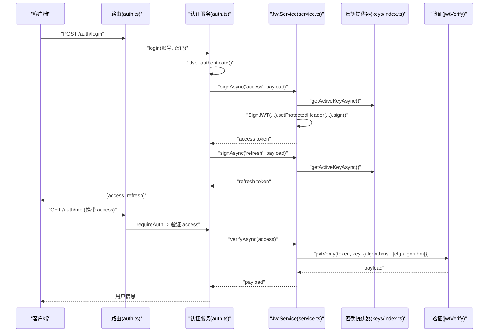
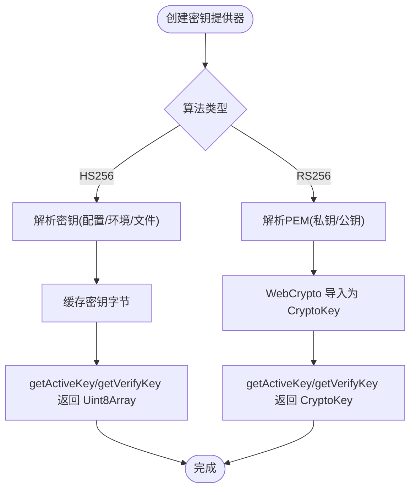
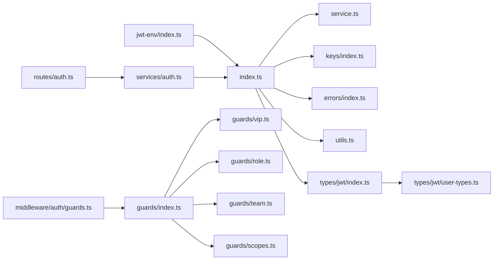

# JWT令牌机制

<cite>
**本文引用的文件**
- [src/tools/jwt/index.ts](file://src/tools/jwt/index.ts)
- [src/tools/jwt/service.ts](file://src/tools/jwt/service.ts)
- [src/tools/jwt/utils.ts](file://src/tools/jwt/utils.ts)
- [src/tools/jwt/keys/index.ts](file://src/tools/jwt/keys/index.ts)
- [src/tools/jwt/errors/index.ts](file://src/tools/jwt/errors/index.ts)
- [src/tools/jwt/jwt-env/index.ts](file://src/tools/jwt/jwt-env/index.ts)
- [src/tools/jwt/guards/index.ts](file://src/tools/jwt/guards/index.ts)
- [src/tools/jwt/guards/vip.ts](file://src/tools/jwt/guards/vip.ts)
- [src/tools/jwt/guards/role.ts](file://src/tools/jwt/guards/role.ts)
- [src/tools/jwt/guards/team.ts](file://src/tools/jwt/guards/team.ts)
- [src/tools/jwt/guards/scopes.ts](file://src/tools/jwt/guards/scopes.ts)
- [src/types/jwt/index.ts](file://src/types/jwt/index.ts)
- [src/types/jwt/user-types.ts](file://src/types/jwt/user-types.ts)
- [src/services/auth.ts](file://src/services/auth.ts)
- [src/routes/auth.ts](file://src/routes/auth.ts)
- [src/middleware/auth/guards.ts](file://src/middleware/auth/guards.ts)
- [src/config/env/index.ts](file://src/config/env/index.ts)
</cite>

## 目录
1. [简介](#简介)
2. [项目结构](#项目结构)
3. [核心组件](#核心组件)
4. [架构总览](#架构总览)
5. [组件详解](#组件详解)
6. [依赖关系分析](#依赖关系分析)
7. [性能与安全考量](#性能与安全考量)
8. [故障排查指南](#故障排查指南)
9. [结论](#结论)
10. [附录：使用示例与最佳实践](#附录使用示例与最佳实践)

## 简介
本文件系统性阐述基于 JOSE 库的 JWT 实现，覆盖令牌生成、签名与验证、载荷构建、访问/刷新令牌生命周期与轮换、权限守卫、错误处理与安全最佳实践。文档以代码为依据，配合图示帮助读者快速掌握机制设计与落地要点。

## 项目结构
围绕 JWT 的核心代码集中在 tools/jwt 子模块，并通过服务层与路由/中间件集成到业务流程中。关键模块职责如下：
- 工具与类型：提供密钥工厂、服务封装、工具函数、错误模型与类型定义
- 服务层：封装签发、验证、刷新轮换
- 中间件与守卫：基于载荷进行角色、作用域、VIP、团队等权限断言
- 业务集成：认证服务负责签发访问/刷新令牌，路由暴露登录/注册/退出/查询用户等接口



图表来源
- [src/tools/jwt/index.ts](file://src/tools/jwt/index.ts#L1-L107)
- [src/tools/jwt/service.ts](file://src/tools/jwt/service.ts#L1-L98)
- [src/tools/jwt/keys/index.ts](file://src/tools/jwt/keys/index.ts#L1-L286)
- [src/tools/jwt/errors/index.ts](file://src/tools/jwt/errors/index.ts#L1-L288)
- [src/tools/jwt/utils.ts](file://src/tools/jwt/utils.ts#L1-L67)
- [src/tools/jwt/jwt-env/index.ts](file://src/tools/jwt/jwt-env/index.ts#L1-L52)
- [src/tools/jwt/guards/index.ts](file://src/tools/jwt/guards/index.ts#L1-L19)
- [src/tools/jwt/guards/vip.ts](file://src/tools/jwt/guards/vip.ts#L1-L30)
- [src/tools/jwt/guards/role.ts](file://src/tools/jwt/guards/role.ts#L1-L31)
- [src/tools/jwt/guards/team.ts](file://src/tools/jwt/guards/team.ts#L1-L30)
- [src/tools/jwt/guards/scopes.ts](file://src/tools/jwt/guards/scopes.ts#L1-L30)
- [src/types/jwt/index.ts](file://src/types/jwt/index.ts#L1-L24)
- [src/types/jwt/user-types.ts](file://src/types/jwt/user-types.ts#L1-L64)
- [src/services/auth.ts](file://src/services/auth.ts#L1-L170)
- [src/routes/auth.ts](file://src/routes/auth.ts#L1-L47)
- [src/middleware/auth/guards.ts](file://src/middleware/auth/guards.ts#L1-L195)
- [src/config/env/index.ts](file://src/config/env/index.ts#L1-L223)

章节来源
- [src/tools/jwt/index.ts](file://src/tools/jwt/index.ts#L1-L107)
- [src/services/auth.ts](file://src/services/auth.ts#L1-L170)
- [src/routes/auth.ts](file://src/routes/auth.ts#L1-L47)
- [src/middleware/auth/guards.ts](file://src/middleware/auth/guards.ts#L1-L195)

## 核心组件
- JwtService：封装签发、验证、刷新轮换，基于 JOSE 的 SignJWT/jwtVerify
- KeyProvider：密钥提供器，支持 HS256（对称）与 RS256（非对称）
- 工具函数：TTL解析、时间戳、短ID与随机ID生成
- 错误模型：统一的 AuthError 与错误码，便于HTTP响应与日志
- 权限守卫：assertRole/assertScopes/assertVip/assertTeam/assertTokenKind 等
- 环境配置：从 dotenv 加载并校验 JWT 算法、密钥与TTL

章节来源
- [src/tools/jwt/service.ts](file://src/tools/jwt/service.ts#L1-L98)
- [src/tools/jwt/keys/index.ts](file://src/tools/jwt/keys/index.ts#L1-L286)
- [src/tools/jwt/utils.ts](file://src/tools/jwt/utils.ts#L1-L67)
- [src/tools/jwt/errors/index.ts](file://src/tools/jwt/errors/index.ts#L1-L288)
- [src/tools/jwt/guards/index.ts](file://src/tools/jwt/guards/index.ts#L1-L19)
- [src/tools/jwt/jwt-env/index.ts](file://src/tools/jwt/jwt-env/index.ts#L1-L52)

## 架构总览
下图展示了从请求到令牌签发与验证的整体流程，以及服务层与中间件的协作关系。



图表来源
- [src/routes/auth.ts](file://src/routes/auth.ts#L1-L47)
- [src/services/auth.ts](file://src/services/auth.ts#L1-L170)
- [src/tools/jwt/service.ts](file://src/tools/jwt/service.ts#L1-L98)
- [src/tools/jwt/keys/index.ts](file://src/tools/jwt/keys/index.ts#L1-L286)

## 组件详解

### JwtService：签发、验证与刷新轮换
- 签发 signAsync
  - 自动注入 tokenType、iat、jti；不设置 exp（长期有效）
  - 从 KeyProvider 获取活跃密钥，按算法设置 kid 头部
- 验证 verifyAsync
  - 使用 KeyProvider 的验证密钥，限定算法
  - 捕获 JOSE 的过期错误并映射为 AuthError.Expired
- 刷新轮换 rotateRefreshAsync
  - 校验旧 refresh 的 tokenType
  - 生成新的 access 与 refresh（refresh 的 jti 重新生成）

```mermaid
classDiagram
class JwtService {
-keys : KeyProvider
-cfg : SecurityConfig
+signAsync(kind, payload) Promise~string~
+verifyAsync(token) Promise~JwtUserPayload~
+rotateRefreshAsync(refresh, mutate?) Promise~{access, refresh, payload}~
}
class KeyProvider {
+getActiveKeyAsync() Promise~RuntimeKey~
+getVerifyKeyAsync() Promise~RuntimeKey~
+getKeyIdAsync() Promise~string|undefined~
}
JwtService --> KeyProvider : "依赖"
```

图表来源
- [src/tools/jwt/service.ts](file://src/tools/jwt/service.ts#L27-L97)
- [src/tools/jwt/keys/index.ts](file://src/tools/jwt/keys/index.ts#L150-L254)

章节来源
- [src/tools/jwt/service.ts](file://src/tools/jwt/service.ts#L34-L96)

### 密钥提供器：HS256 与 RS256
- HS256
  - 支持从配置、环境变量或文件解析对称密钥
  - 缓存密钥字节，提供 getActiveKey/getVerifyKey
- RS256
  - 支持从环境变量或文件解析 PEM 私钥/公钥
  - 使用 WebCrypto 导入为 CryptoKey，分别用于签名与验证
- 工厂 createKeyProvider
  - 根据算法选择对应 Provider



图表来源
- [src/tools/jwt/keys/index.ts](file://src/tools/jwt/keys/index.ts#L150-L254)

章节来源
- [src/tools/jwt/keys/index.ts](file://src/tools/jwt/keys/index.ts#L125-L285)

### 工具函数：TTL解析、时间戳与ID生成
- ttlToSeconds：支持 "15m"/"7d"/"3600s"/"1h" 或纯数字秒
- nowSec：当前秒级时间戳
- shortId/nanoid：URL-safe 短ID与随机ID生成，后者支持自定义长度

章节来源
- [src/tools/jwt/utils.ts](file://src/tools/jwt/utils.ts#L18-L66)

### 错误模型：AuthError 与错误码
- 统一错误码枚举，覆盖缺失令牌、格式错误、无效、过期、禁止、设备不匹配、撤销、算法不支持、业务与验证错误等
- AuthError 支持 toJSON 与 toLogEntry，便于HTTP响应与日志记录
- isAuthError 类型守卫与 serializeUnknown 安全序列化

章节来源
- [src/tools/jwt/errors/index.ts](file://src/tools/jwt/errors/index.ts#L30-L287)

### 权限守卫：角色/作用域/VIP/团队/令牌类型
- assertRole/assertScopes/assertVip/assertTeam/assertTokenKind
- 中间件 requireRole/requireScopes/requireVip/requireTeam/requireTokenKind
- 在中间件中捕获 AuthError 并返回标准化响应

章节来源
- [src/tools/jwt/guards/index.ts](file://src/tools/jwt/guards/index.ts#L1-L19)
- [src/tools/jwt/guards/vip.ts](file://src/tools/jwt/guards/vip.ts#L14-L29)
- [src/tools/jwt/guards/role.ts](file://src/tools/jwt/guards/role.ts#L14-L30)
- [src/tools/jwt/guards/team.ts](file://src/tools/jwt/guards/team.ts#L13-L29)
- [src/tools/jwt/guards/scopes.ts](file://src/tools/jwt/guards/scopes.ts#L12-L29)
- [src/middleware/auth/guards.ts](file://src/middleware/auth/guards.ts#L18-L194)

### 环境配置：JWT 算法与TTL
- 从 dotenv 加载 JWT_ALGORITHM/JWT_ACCESS_TTL/JWT_REFRESH_TTL/JWT_SECRET/JWT_PRIVATE_KEY_PATH/JWT_PUBLIC_KEY_PATH
- RS256 需要同时提供私钥与公钥路径
- 提供 createJwtServiceFromEnv 工厂方法，按环境自动装配

章节来源
- [src/tools/jwt/jwt-env/index.ts](file://src/tools/jwt/jwt-env/index.ts#L19-L51)
- [src/tools/jwt/index.ts](file://src/tools/jwt/index.ts#L80-L106)

### 认证服务与路由：签发与使用
- 认证服务在登录/注册后签发 access 与 refresh 令牌
- 路由暴露 /auth/login、/auth/register、/auth/logout、/auth/me
- requireAuth 中间件结合守卫实现细粒度权限控制

章节来源
- [src/services/auth.ts](file://src/services/auth.ts#L45-L80)
- [src/routes/auth.ts](file://src/routes/auth.ts#L18-L44)
- [src/middleware/auth/guards.ts](file://src/middleware/auth/guards.ts#L17-L194)

## 依赖关系分析
- JwtService 依赖 KeyProvider 与 SecurityConfig
- 服务层通过 createJwtServiceFromEnv 与 jwt-env 集成
- 认证服务依赖 JwtService 与用户模型
- 中间件依赖守卫与 JwtService 的验证能力
- 类型系统通过 types/jwt 汇总导出



图表来源
- [src/tools/jwt/index.ts](file://src/tools/jwt/index.ts#L75-L106)
- [src/tools/jwt/service.ts](file://src/tools/jwt/service.ts#L1-L21)
- [src/tools/jwt/keys/index.ts](file://src/tools/jwt/keys/index.ts#L1-L20)
- [src/tools/jwt/errors/index.ts](file://src/tools/jwt/errors/index.ts#L1-L10)
- [src/tools/jwt/utils.ts](file://src/tools/jwt/utils.ts#L1-L11)
- [src/types/jwt/index.ts](file://src/types/jwt/index.ts#L1-L24)
- [src/types/jwt/user-types.ts](file://src/types/jwt/user-types.ts#L1-L24)
- [src/services/auth.ts](file://src/services/auth.ts#L14-L37)
- [src/routes/auth.ts](file://src/routes/auth.ts#L12-L16)
- [src/middleware/auth/guards.ts](file://src/middleware/auth/guards.ts#L12-L15)
- [src/tools/jwt/guards/index.ts](file://src/tools/jwt/guards/index.ts#L1-L12)

章节来源
- [src/tools/jwt/index.ts](file://src/tools/jwt/index.ts#L1-L107)
- [src/services/auth.ts](file://src/services/auth.ts#L24-L37)
- [src/routes/auth.ts](file://src/routes/auth.ts#L12-L16)
- [src/middleware/auth/guards.ts](file://src/middleware/auth/guards.ts#L12-L15)

## 性能与安全考量
- 性能
  - HS256 使用对称密钥，签名/验证开销低；RS256 使用非对称密钥，验证更快但签名较慢
  - KeyProvider 对密钥进行缓存，避免重复解析与导入
  - 工具函数均无 I/O，计算复杂度低
- 安全
  - 长期有效的 access token（不设置 exp），建议结合刷新令牌与黑名单策略
  - 支持 kid 头部，便于密钥轮换与审计
  - 设备绑定与黑名单可通过扩展 SecurityConfig 与守卫实现
  - 建议生产环境使用 RS256 并妥善保管私钥

[本节为通用指导，不直接分析具体文件]

## 故障排查指南
- 常见错误与定位
  - 令牌过期：verifyAsync 捕获 JOSE 过期错误并映射为 AuthError.Expired
  - 无效令牌/算法不支持：映射为 AuthError.Invalid/UnsupportedAlgorithm
  - 设备不匹配/禁止访问：AuthError.Forbidden
  - 缺少令牌：AuthError.MissingToken
- 日志与序列化
  - 使用 AuthError.toLogEntry 输出结构化日志
  - 使用 serializeUnknown 安全序列化未知错误对象

章节来源
- [src/tools/jwt/service.ts](file://src/tools/jwt/service.ts#L66-L75)
- [src/tools/jwt/errors/index.ts](file://src/tools/jwt/errors/index.ts#L75-L141)
- [src/tools/jwt/errors/index.ts](file://src/tools/jwt/errors/index.ts#L276-L287)

## 结论
该JWT实现以 JOSE 为基础，提供了清晰的密钥抽象、完善的错误模型与权限守卫体系。通过工厂方法与环境配置，能够灵活切换 HS256/RS256，并在服务层完成令牌签发、验证与刷新轮换。结合中间件与守卫，可实现细粒度的权限控制。建议在生产环境中启用 RS256、密钥轮换与黑名单策略，并对 access token 设置合理的过期时间以降低风险。

[本节为总结性内容，不直接分析具体文件]

## 附录：使用示例与最佳实践

### 访问令牌与刷新令牌的区别与使用场景
- 访问令牌（access）
  - 用于受保护资源访问
  - 长期有效（本实现不设置 exp），建议结合刷新令牌与黑名单策略
- 刷新令牌（refresh）
  - 用于轮换新的访问令牌
  - 严格校验 tokenType，确保仅由 refresh 令牌发起轮换

章节来源
- [src/tools/jwt/service.ts](file://src/tools/jwt/service.ts#L34-L56)
- [src/tools/jwt/service.ts](file://src/tools/jwt/service.ts#L78-L96)
- [src/types/jwt/user-types.ts](file://src/types/jwt/user-types.ts#L10-L13)

### JWT 载荷字段说明（部分）
- sub：主体ID（用户主键）
- roleId：角色ID
- vip：是否为会员用户
- teamId/teamRoleId：团队与团队角色ID（可空）
- telegramId：电报ID（可空）
- status：用户状态
- tokenType：令牌类型（access/refresh）
- scope：作用域数组（可空）
- deviceId：设备ID（启用绑定时存在）
- jti/iat/exp：唯一ID、签发时间、过期时间（可空）

章节来源
- [src/types/jwt/user-types.ts](file://src/types/jwt/user-types.ts#L28-L58)

### 令牌生命周期管理与轮换机制
- 登录/注册后签发 access 与 refresh
- 资源访问使用 access
- 刷新轮换：使用 refresh 验证通过后生成新的 access 与 refresh
- 退出：当前为无状态实现，可在启用黑名单时扩展

章节来源
- [src/services/auth.ts](file://src/services/auth.ts#L45-L80)
- [src/services/auth.ts](file://src/services/auth.ts#L155-L166)
- [src/tools/jwt/service.ts](file://src/tools/jwt/service.ts#L78-L96)

### 权限断言与中间件使用
- 角色断言：requireRole([...]) 或 Guards.assertRole
- 作用域断言：requireScopes([...]) 或 Guards.assertScopes
- VIP断言：requireVip() 或 Guards.assertVip
- 团队断言：requireTeam([...]) 或 Guards.assertTeam
- 令牌类型断言：requireTokenKind("refresh") 或 Guards.assertTokenKind

章节来源
- [src/middleware/auth/guards.ts](file://src/middleware/auth/guards.ts#L18-L194)
- [src/tools/jwt/guards/index.ts](file://src/tools/jwt/guards/index.ts#L13-L18)

### 环境配置与密钥准备
- HS256：设置 JWT_SECRET 或通过环境变量/文件提供
- RS256：设置 JWT_PRIVATE_KEY_PATH 与 JWT_PUBLIC_KEY_PATH
- TTL：JWT_ACCESS_TTL 与 JWT_REFRESH_TTL 支持 "15m"/"7d"/"3600s"/"1h"

章节来源
- [src/tools/jwt/jwt-env/index.ts](file://src/tools/jwt/jwt-env/index.ts#L19-L44)
- [src/tools/jwt/keys/index.ts](file://src/tools/jwt/keys/index.ts#L125-L142)
- [src/tools/jwt/keys/index.ts](file://src/tools/jwt/keys/index.ts#L186-L220)

### 错误处理与异常情况
- 缺少令牌：MissingToken
- 格式错误：Malformed
- 无效/过期：Invalid/Expired
- 禁止访问：Forbidden
- 设备不匹配：DeviceMismatch
- 令牌已撤销：Revoked
- 算法不支持：UnsupportedAlgorithm
- 业务/验证错误：BusinessError/ValidationError

章节来源
- [src/tools/jwt/errors/index.ts](file://src/tools/jwt/errors/index.ts#L46-L63)
- [src/tools/jwt/errors/index.ts](file://src/tools/jwt/errors/index.ts#L150-L255)