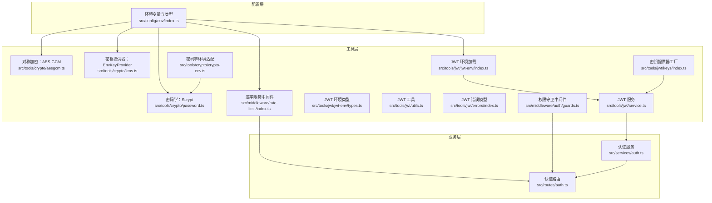
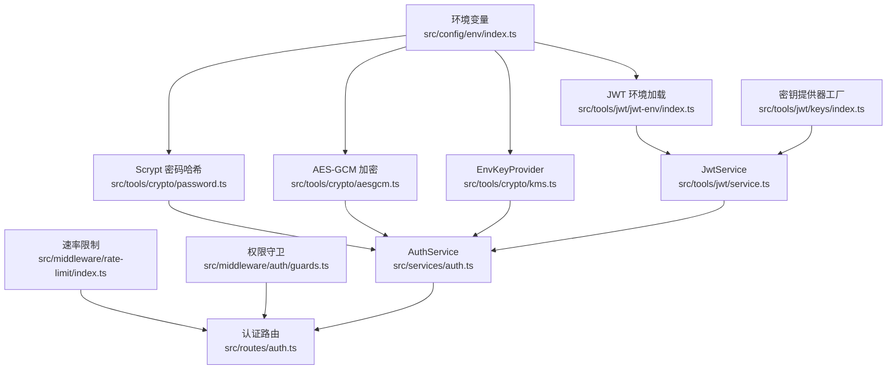
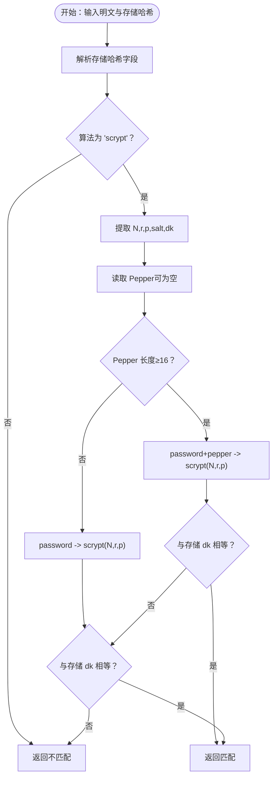
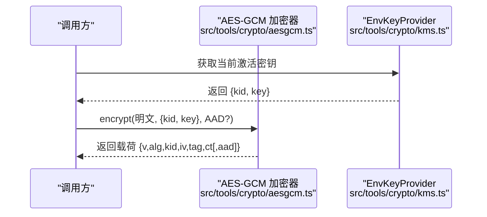
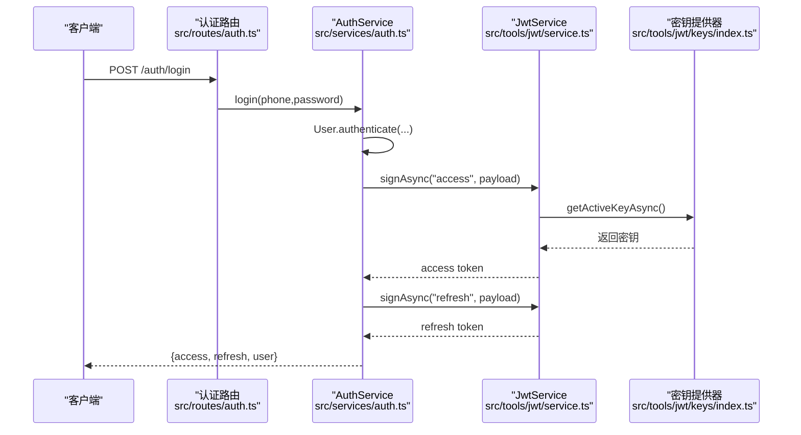
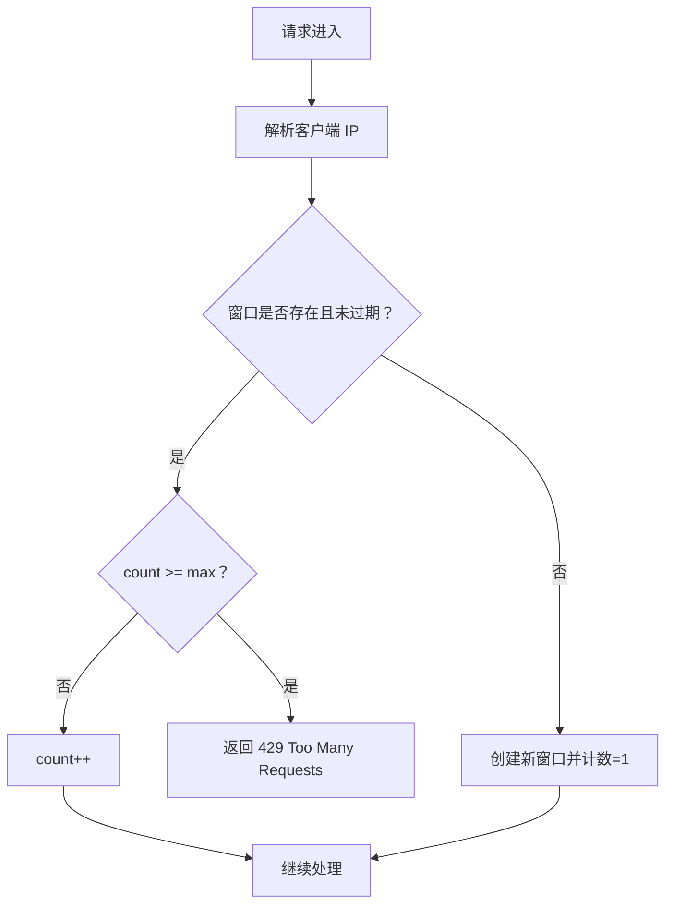
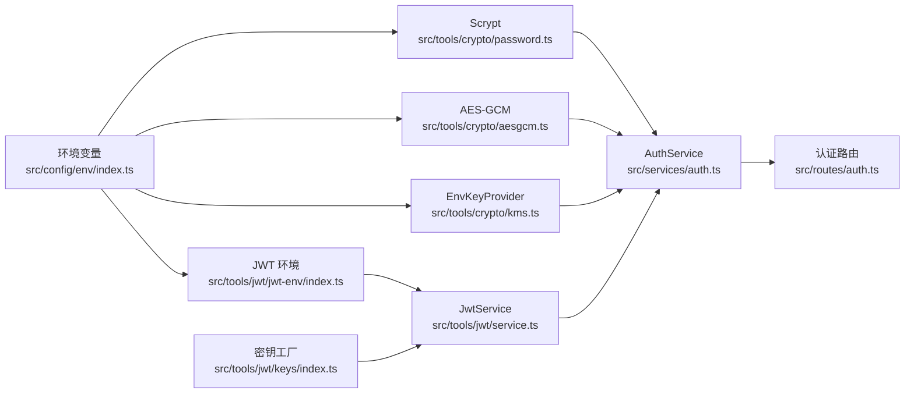

# 安全最佳实践

<cite>
**本文引用的文件**
- [src/tools/crypto/password.ts](file://src/tools/crypto/password.ts)
- [src/tools/crypto/aesgcm.ts](file://src/tools/crypto/aesgcm.ts)
- [src/tools/crypto/kms.ts](file://src/tools/crypto/kms.ts)
- [src/tools/crypto/crypto-env.ts](file://src/tools/crypto/crypto-env.ts)
- [src/tools/jwt/service.ts](file://src/tools/jwt/service.ts)
- [src/tools/jwt/jwt-env/index.ts](file://src/tools/jwt/jwt-env/index.ts)
- [src/tools/jwt/jwt-env/types.ts](file://src/tools/jwt/jwt-env/types.ts)
- [src/tools/jwt/keys/index.ts](file://src/tools/jwt/keys/index.ts)
- [src/tools/jwt/utils.ts](file://src/tools/jwt/utils.ts)
- [src/tools/jwt/errors/index.ts](file://src/tools/jwt/errors/index.ts)
- [src/middleware/rate-limit/index.ts](file://src/middleware/rate-limit/index.ts)
- [src/middleware/auth/guards.ts](file://src/middleware/auth/guards.ts)
- [src/middleware/auth/index.ts](file://src/middleware/auth/index.ts)
- [src/config/env/index.ts](file://src/config/env/index.ts)
- [src/services/auth.ts](file://src/services/auth.ts)
- [src/routes/auth.ts](file://src/routes/auth.ts)
</cite>

## 目录
1. 引言
2. 项目结构
3. 核心组件
4. 架构总览
5. 详细组件分析
6. 依赖关系分析
7. 性能考量
8. 故障排查指南
9. 结论
10. 附录

## 引言
本文件面向认证授权系统的安全最佳实践，围绕以下主题展开：密码加密（Scrypt）的实现原理与配置参数、盐值生成与迭代次数的安全考量；敏感数据保护中 AES-GCM 的应用与 KMS 密钥管理；JWT 令牌的安全配置（签名算法、过期时间、存储与传输）；常见安全威胁的防护策略（重放攻击、令牌泄露、暴力破解等）；以及安全审计与监控、安全事件应急响应流程。文档以仓库现有实现为依据，结合代码结构与配置，提供可落地的安全建议。

## 项目结构
系统采用分层与模块化组织方式：
- 配置层：环境变量加载与类型安全转换，集中管理密码盐、JWT 算法与密钥来源、速率限制等安全相关参数。
- 工具层：密码学工具（Scrypt、AES-GCM、KMS）、JWT 服务与密钥提供器、通用工具与错误模型。
- 中间件层：认证与权限守卫、速率限制。
- 服务与路由层：认证业务逻辑与对外接口。

图表来源
- [src/config/env/index.ts](file://src/config/env/index.ts#L166-L220)
- [src/tools/crypto/password.ts](file://src/tools/crypto/password.ts#L14-L46)
- [src/tools/crypto/aesgcm.ts](file://src/tools/crypto/aesgcm.ts#L59-L87)
- [src/tools/crypto/kms.ts](file://src/tools/crypto/kms.ts#L55-L64)
- [src/tools/jwt/service.ts](file://src/tools/jwt/service.ts#L27-L56)
- [src/tools/jwt/keys/index.ts](file://src/tools/jwt/keys/index.ts#L267-L285)
- [src/tools/jwt/jwt-env/index.ts](file://src/tools/jwt/jwt-env/index.ts#L19-L44)
- [src/middleware/rate-limit/index.ts](file://src/middleware/rate-limit/index.ts#L43-L69)
- [src/middleware/auth/guards.ts](file://src/middleware/auth/guards.ts#L25-L50)
- [src/services/auth.ts](file://src/services/auth.ts#L45-L80)
- [src/routes/auth.ts](file://src/routes/auth.ts#L16-L44)

章节来源
- [src/config/env/index.ts](file://src/config/env/index.ts#L166-L220)
- [src/tools/crypto/password.ts](file://src/tools/crypto/password.ts#L14-L46)
- [src/tools/crypto/aesgcm.ts](file://src/tools/crypto/aesgcm.ts#L59-L87)
- [src/tools/crypto/kms.ts](file://src/tools/crypto/kms.ts#L55-L64)
- [src/tools/jwt/service.ts](file://src/tools/jwt/service.ts#L27-L56)
- [src/tools/jwt/keys/index.ts](file://src/tools/jwt/keys/index.ts#L267-L285)
- [src/tools/jwt/jwt-env/index.ts](file://src/tools/jwt/jwt-env/index.ts#L19-L44)
- [src/middleware/rate-limit/index.ts](file://src/middleware/rate-limit/index.ts#L43-L69)
- [src/middleware/auth/guards.ts](file://src/middleware/auth/guards.ts#L25-L50)
- [src/services/auth.ts](file://src/services/auth.ts#L45-L80)
- [src/routes/auth.ts](file://src/routes/auth.ts#L16-L44)

## 核心组件
- 密码加密（Scrypt）
  - 使用固定参数与随机盐值生成哈希，支持“胡椒”（pepper）增强抗数据库泄露场景下的安全性；提供校验与升级逻辑，确保参数随硬件提升而更新。
- 对称加密（AES-GCM）
  - 随机初始化向量（IV），返回可序列化载荷，支持可选附加认证数据（AAD），常量时间比较密钥ID，防止侧信道。
- 密钥管理（KMS）
  - 基于环境变量的对称密钥提供器，支持密钥ID与历史密钥缓存，便于密钥轮换与按ID检索。
- JWT 令牌
  - 支持 HS256/RS256，签发时自动设置签发时间与唯一标识，验证时区分过期与无效错误；提供刷新令牌轮转。
- 速率限制与权限守卫
  - 内存级限流（固定窗口），按角色/作用域/团队/令牌类型进行权限控制。

章节来源
- [src/tools/crypto/password.ts](file://src/tools/crypto/password.ts#L14-L46)
- [src/tools/crypto/aesgcm.ts](file://src/tools/crypto/aesgcm.ts#L59-L87)
- [src/tools/crypto/kms.ts](file://src/tools/crypto/kms.ts#L55-L64)
- [src/tools/jwt/service.ts](file://src/tools/jwt/service.ts#L27-L56)
- [src/middleware/rate-limit/index.ts](file://src/middleware/rate-limit/index.ts#L43-L69)
- [src/middleware/auth/guards.ts](file://src/middleware/auth/guards.ts#L25-L50)

## 架构总览
认证授权系统通过“配置层—工具层—中间件层—业务层”的分层设计实现安全控制点的集中与可替换。密码学与密钥管理由工具层封装，JWT 服务负责令牌生命周期管理，中间件层提供认证与权限控制，业务层承载具体认证流程。

图表来源
- [src/config/env/index.ts](file://src/config/env/index.ts#L166-L220)
- [src/tools/crypto/password.ts](file://src/tools/crypto/password.ts#L39-L46)
- [src/tools/crypto/aesgcm.ts](file://src/tools/crypto/aesgcm.ts#L59-L68)
- [src/tools/crypto/kms.ts](file://src/tools/crypto/kms.ts#L55-L64)
- [src/tools/jwt/jwt-env/index.ts](file://src/tools/jwt/jwt-env/index.ts#L19-L44)
- [src/tools/jwt/keys/index.ts](file://src/tools/jwt/keys/index.ts#L267-L285)
- [src/tools/jwt/service.ts](file://src/tools/jwt/service.ts#L27-L56)
- [src/middleware/rate-limit/index.ts](file://src/middleware/rate-limit/index.ts#L43-L69)
- [src/middleware/auth/guards.ts](file://src/middleware/auth/guards.ts#L25-L50)
- [src/services/auth.ts](file://src/services/auth.ts#L45-L80)
- [src/routes/auth.ts](file://src/routes/auth.ts#L16-L44)

## 详细组件分析

### 密码加密（Scrypt）实现与配置
- 参数与安全考虑
  - 固定参数：包含 N、r、p、派生密钥长度与内存上限，确保跨实例一致的计算强度。
  - 盐值：每次生成随机盐，防止彩虹表与批量碰撞。
  - 胡椒（Pepper）：从密码学环境适配读取，作为额外密钥材料参与哈希，降低数据库泄露风险。
  - 升级逻辑：当检测到参数低于基线或未使用 Pepper 时，触发重新哈希，保证安全强度持续提升。
- 校验流程
  - 支持带 Pepper 与不带 Pepper 的双重校验，兼容历史数据；常量时间比较避免时序侧信道。

图表来源
- [src/tools/crypto/password.ts](file://src/tools/crypto/password.ts#L55-L70)
- [src/tools/crypto/password.ts](file://src/tools/crypto/password.ts#L77-L110)
- [src/tools/crypto/crypto-env.ts](file://src/tools/crypto/crypto-env.ts#L3-L5)

章节来源
- [src/tools/crypto/password.ts](file://src/tools/crypto/password.ts#L14-L46)
- [src/tools/crypto/password.ts](file://src/tools/crypto/password.ts#L55-L70)
- [src/tools/crypto/password.ts](file://src/tools/crypto/password.ts#L77-L110)
- [src/tools/crypto/crypto-env.ts](file://src/tools/crypto/crypto-env.ts#L3-L5)

### AES-GCM 加密与 KMS 密钥管理
- AES-GCM
  - 随机 12 字节 IV，16 字节认证标签，可选 AAD，输出可序列化载荷（含版本、算法、密钥ID、IV、标签、密文、可选 AAD）。
  - 解密阶段严格校验认证标签，失败时抛错；提供常量时间密钥ID比较，避免侧信道。
- KMS 密钥提供器
  - 从环境变量加载主密钥（base64url 编码，32 字节），生成或使用 UUID 作为密钥ID，维护历史密钥缓存。
  - 支持按 KID 检索历史密钥，便于解密历史数据与密钥轮换。

图表来源
- [src/tools/crypto/aesgcm.ts](file://src/tools/crypto/aesgcm.ts#L59-L68)
- [src/tools/crypto/kms.ts](file://src/tools/crypto/kms.ts#L72-L74)

章节来源
- [src/tools/crypto/aesgcm.ts](file://src/tools/crypto/aesgcm.ts#L59-L87)
- [src/tools/crypto/kms.ts](file://src/tools/crypto/kms.ts#L55-L64)
- [src/tools/crypto/kms.ts](file://src/tools/crypto/kms.ts#L82-L84)

### JWT 令牌安全配置与流程
- 签名算法与密钥来源
  - 支持 HS256 与 RS256；HS256 从环境变量或文件解析密钥；RS256 从环境变量或文件解析 PEM 私钥/公钥。
  - 环境变量加载与校验，确保算法与密钥路径配置正确。
- 令牌签发与验证
  - 自动设置签发时间与唯一 JTI；支持刷新令牌轮转，要求令牌类型为 "refresh"。
  - 验证阶段区分过期与无效错误，便于前端与运维处理。
- TTL 与存储
  - TTL 解析支持 "15m"、"7d" 等格式；当前实现为长期有效（不设置 exp），建议结合业务场景调整。

图表来源
- [src/routes/auth.ts](file://src/routes/auth.ts#L23-L30)
- [src/services/auth.ts](file://src/services/auth.ts#L126-L134)
- [src/tools/jwt/service.ts](file://src/tools/jwt/service.ts#L41-L56)
- [src/tools/jwt/keys/index.ts](file://src/tools/jwt/keys/index.ts#L267-L285)

章节来源
- [src/tools/jwt/service.ts](file://src/tools/jwt/service.ts#L27-L56)
- [src/tools/jwt/service.ts](file://src/tools/jwt/service.ts#L66-L75)
- [src/tools/jwt/service.ts](file://src/tools/jwt/service.ts#L86-L96)
- [src/tools/jwt/jwt-env/index.ts](file://src/tools/jwt/jwt-env/index.ts#L19-L44)
- [src/tools/jwt/jwt-env/types.ts](file://src/tools/jwt/jwt-env/types.ts#L18-L25)
- [src/tools/jwt/keys/index.ts](file://src/tools/jwt/keys/index.ts#L150-L174)
- [src/tools/jwt/keys/index.ts](file://src/tools/jwt/keys/index.ts#L228-L254)
- [src/tools/jwt/utils.ts](file://src/tools/jwt/utils.ts#L24-L33)
- [src/tools/jwt/utils.ts](file://src/tools/jwt/utils.ts#L47-L50)
- [src/tools/jwt/errors/index.ts](file://src/tools/jwt/errors/index.ts#L46-L63)
- [src/tools/jwt/errors/index.ts](file://src/tools/jwt/errors/index.ts#L75-L121)

### 速率限制与权限守卫
- 速率限制
  - 内存级固定窗口计数，按客户端 IP 限流，支持通过环境变量配置窗口与阈值。
- 权限守卫
  - 基于用户载荷的角色、作用域、VIP、团队与令牌类型进行校验，统一错误模型便于前端处理。

图表来源
- [src/middleware/rate-limit/index.ts](file://src/middleware/rate-limit/index.ts#L43-L60)

章节来源
- [src/middleware/rate-limit/index.ts](file://src/middleware/rate-limit/index.ts#L43-L69)
- [src/middleware/auth/guards.ts](file://src/middleware/auth/guards.ts#L25-L50)
- [src/middleware/auth/guards.ts](file://src/middleware/auth/guards.ts#L61-L86)
- [src/middleware/auth/guards.ts](file://src/middleware/auth/guards.ts#L96-L121)
- [src/middleware/auth/guards.ts](file://src/middleware/auth/guards.ts#L132-L157)
- [src/middleware/auth/guards.ts](file://src/middleware/auth/guards.ts#L168-L193)

## 依赖关系分析
- 组件耦合
  - 密码学与 JWT 服务均依赖环境配置；AES-GCM 依赖 KMS 提供密钥；JWT 服务依赖密钥提供器工厂。
- 外部依赖
  - Node.js crypto/webcrypto、dotenv、jose 等。
- 潜在循环依赖
  - 代码组织上未见直接循环依赖；注意避免在工具层引入业务层。

图表来源
- [src/config/env/index.ts](file://src/config/env/index.ts#L166-L220)
- [src/tools/crypto/password.ts](file://src/tools/crypto/password.ts#L12-L12)
- [src/tools/crypto/aesgcm.ts](file://src/tools/crypto/aesgcm.ts#L11-L11)
- [src/tools/crypto/kms.ts](file://src/tools/crypto/kms.ts#L10-L12)
- [src/tools/jwt/jwt-env/index.ts](file://src/tools/jwt/jwt-env/index.ts#L10-L12)
- [src/tools/jwt/service.ts](file://src/tools/jwt/service.ts#L15-L20)
- [src/tools/jwt/keys/index.ts](file://src/tools/jwt/keys/index.ts#L8-L21)
- [src/services/auth.ts](file://src/services/auth.ts#L13-L22)
- [src/routes/auth.ts](file://src/routes/auth.ts#L12-L14)

章节来源
- [src/config/env/index.ts](file://src/config/env/index.ts#L166-L220)
- [src/tools/crypto/password.ts](file://src/tools/crypto/password.ts#L12-L12)
- [src/tools/crypto/aesgcm.ts](file://src/tools/crypto/aesgcm.ts#L11-L11)
- [src/tools/crypto/kms.ts](file://src/tools/crypto/kms.ts#L10-L12)
- [src/tools/jwt/jwt-env/index.ts](file://src/tools/jwt/jwt-env/index.ts#L10-L12)
- [src/tools/jwt/service.ts](file://src/tools/jwt/service.ts#L15-L20)
- [src/tools/jwt/keys/index.ts](file://src/tools/jwt/keys/index.ts#L8-L21)
- [src/services/auth.ts](file://src/services/auth.ts#L13-L22)
- [src/routes/auth.ts](file://src/routes/auth.ts#L12-L14)

## 性能考量
- Scrypt
  - 固定参数与内存上限确保资源消耗可控；建议在部署环境评估硬件性能后，逐步提升 N/r/p 以适应增长。
- AES-GCM
  - IV 随机性与认证标签开销较低；建议对大块数据分片处理，避免一次性处理超大数据。
- JWT
  - HS256 仅需内存密钥解析；RS256 需要 PEM 文件读取与导入，建议在进程启动时缓存密钥对象。
- 速率限制
  - 内存级实现简单高效；高并发场景建议结合分布式缓存（如 Redis）实现共享限流。

[本节为通用性能建议，不直接分析具体文件]

## 故障排查指南
- JWT 验证失败
  - 区分“过期”与“无效”错误，前者通常需要刷新令牌，后者可能涉及密钥变更或算法不匹配。
- 密码校验失败
  - 检查 Pepper 长度与配置一致性；确认存储哈希字段格式正确；必要时触发重新哈希。
- AES-GCM 解密报错
  - 核对密钥ID与密钥库一致性；确认 AAD 与加密时一致；检查认证标签是否被篡改。
- 速率限制触发
  - 检查客户端 IP 识别与窗口配置；确认阈值与业务场景匹配。

章节来源
- [src/tools/jwt/errors/index.ts](file://src/tools/jwt/errors/index.ts#L46-L63)
- [src/tools/jwt/errors/index.ts](file://src/tools/jwt/errors/index.ts#L75-L121)
- [src/tools/crypto/password.ts](file://src/tools/crypto/password.ts#L55-L70)
- [src/tools/crypto/aesgcm.ts](file://src/tools/crypto/aesgcm.ts#L78-L87)
- [src/middleware/rate-limit/index.ts](file://src/middleware/rate-limit/index.ts#L53-L56)

## 结论
本系统在密码学、密钥管理与令牌安全方面提供了清晰的实现边界与可替换的配置入口。建议在生产环境中：
- 明确并强化密码学参数与 Pepper 策略；
- 使用 KMS 支持密钥轮换与审计；
- 结合业务场景合理设置 JWT TTL 与存储策略；
- 强化速率限制与权限守卫，完善安全审计与事件响应流程。

[本节为总结性内容，不直接分析具体文件]

## 附录

### 安全威胁与防护策略
- 重放攻击
  - 使用短 TTL 与一次性 JTI；在服务端维护短期状态或使用一次性令牌。
- 令牌泄露
  - 严格 HTTPS 传输与安全存储；避免在日志中输出令牌；定期轮换密钥。
- 暴力破解
  - 强密码策略与 Pepper；增加 Scrypt 成本参数；结合速率限制与账户锁定。

[本节为通用安全建议，不直接分析具体文件]

### 安全审计与监控最佳实践
- 审计范围
  - 认证与授权事件、密钥轮换、令牌签发/验证、异常与失败尝试。
- 监控指标
  - 登录失败率、令牌过期率、密钥使用统计、异常响应时间与错误码分布。
- 报警阈值
  - 基于历史基线设定动态阈值，结合业务高峰与低谷时段调整。

[本节为通用安全建议，不直接分析具体文件]

### 安全事件应急响应流程
- 事件分类与分级
  - 令牌泄露、密钥泄露、大规模失败登录、系统异常。
- 处置步骤
  - 快速隔离、回滚密钥、通知用户更换凭证、复盘与加固。
- 演练与培训
  - 定期演练与知识培训，确保团队快速响应。

[本节为通用安全建议，不直接分析具体文件]