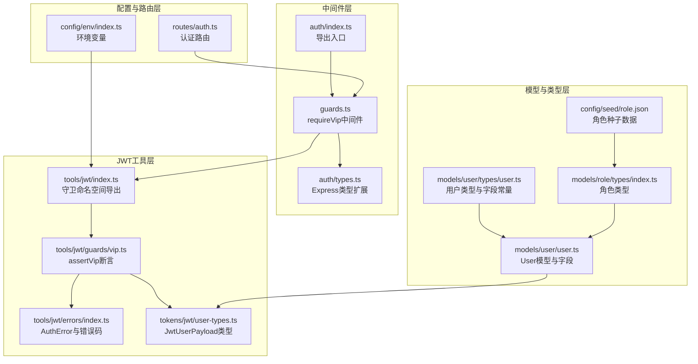
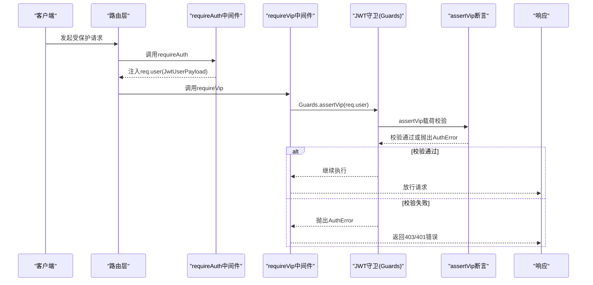
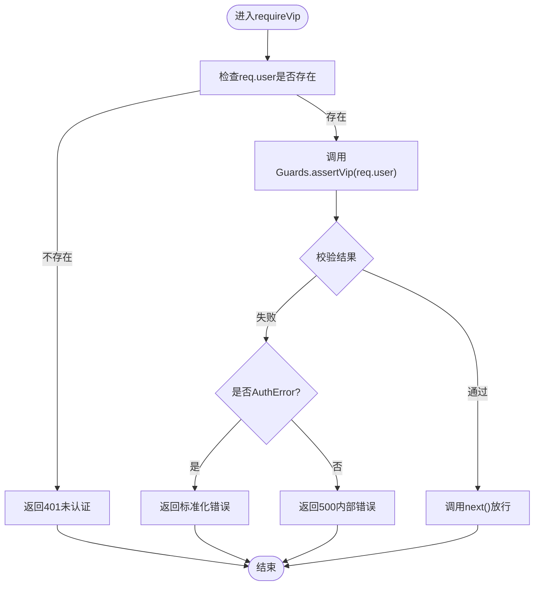
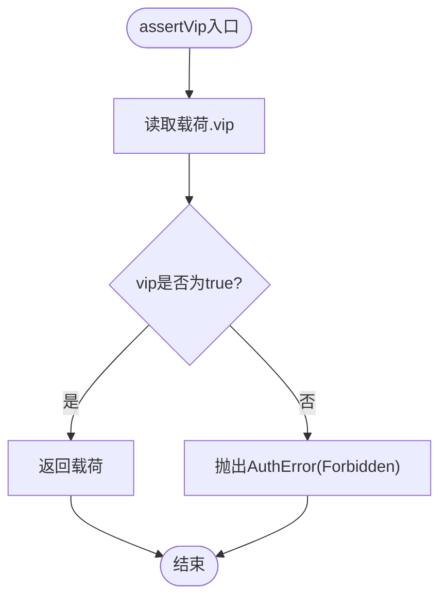
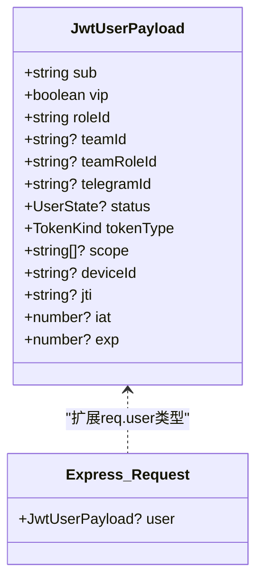
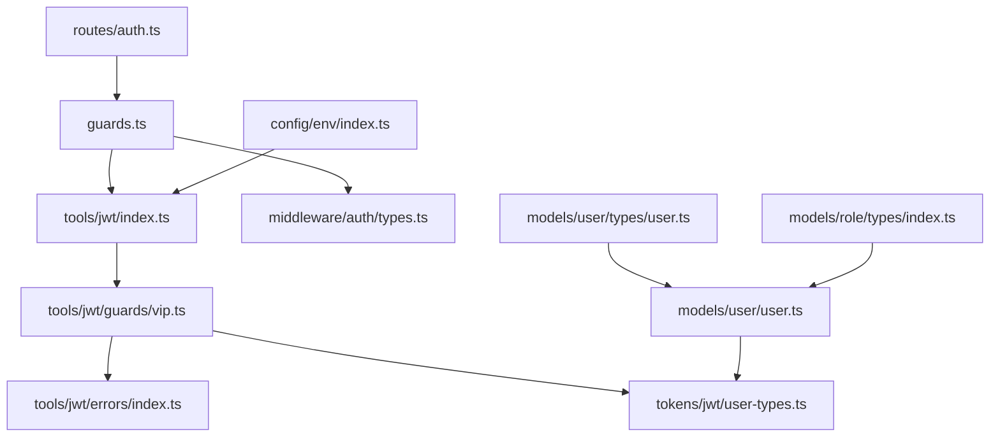

# VIP权限控制

<cite>
**本文档引用的文件**
- [src/middleware/auth/guards.ts](file://src/middleware/auth/guards.ts)
- [src/tools/jwt/guards/vip.ts](file://src/tools/jwt/guards/vip.ts)
- [src/middleware/auth/index.ts](file://src/middleware/auth/index.ts)
- [src/middleware/auth/types.ts](file://src/middleware/auth/types.ts)
- [src/tools/jwt/index.ts](file://src/tools/jwt/index.ts)
- [src/tokens/jwt/user-types.ts](file://src/tokens/jwt/user-types.ts)
- [src/tools/jwt/errors/index.ts](file://src/tools/jwt/errors/index.ts)
- [src/models/user/types/user.ts](file://src/models/user/types/user.ts)
- [src/models/user/user.ts](file://src/models/user/user.ts)
- [src/models/role/types/index.ts](file://src/models/role/types/index.ts)
- [src/config/seed/role.json](file://src/config/seed/role.json)
- [src/config/env/index.ts](file://src/config/env/index.ts)
- [src/routes/auth.ts](file://src/routes/auth.ts)
</cite>

## 目录
1. [简介](#简介)
2. [项目结构](#项目结构)
3. [核心组件](#核心组件)
4. [架构概览](#架构概览)
5. [详细组件分析](#详细组件分析)
6. [依赖关系分析](#依赖关系分析)
7. [性能考量](#性能考量)
8. [故障排除指南](#故障排除指南)
9. [结论](#结论)
10. [附录](#附录)

## 简介
本技术文档聚焦于VIP权限控制模块，系统性阐述VIP用户的权限模型与特权机制。文档涵盖以下要点：
- VIP用户标识与数据模型：基于用户模型中的布尔字段标识VIP身份，并在JWT载荷中体现。
- 特权等级与权限范围：VIP作为独立的特权维度，与角色、作用域、团队等共同构成多维权限矩阵。
- requireVip中间件实现逻辑：从请求解析到JWT载荷校验的完整流程，包括错误处理与安全响应。
- VIP权限与普通用户权限的区别与升级机制：如何在现有角色/作用域基础上叠加VIP特权。
- 使用场景示例：VIP专属功能访问、VIP用户资源限制等。
- 安全考虑与防滥用措施：令牌安全、错误处理、最小暴露原则等。

## 项目结构
VIP权限控制模块横跨多个层次：
- 中间件层：提供requireVip等权限守卫中间件，负责在HTTP请求链路中进行权限校验。
- JWT工具层：提供assertVip等断言函数，封装JWT载荷校验逻辑与标准化错误。
- 类型与模型层：定义JWT用户载荷结构、用户模型字段及角色类型，确保类型安全与一致性。
- 配置与路由层：通过路由与环境配置支撑VIP权限的启用与运行时行为。



**图表来源**
- [src/middleware/auth/guards.ts](file://src/middleware/auth/guards.ts#L1-L195)
- [src/middleware/auth/index.ts](file://src/middleware/auth/index.ts#L1-L44)
- [src/middleware/auth/types.ts](file://src/middleware/auth/types.ts#L1-L34)
- [src/tools/jwt/index.ts](file://src/tools/jwt/index.ts#L1-L107)
- [src/tools/jwt/guards/vip.ts](file://src/tools/jwt/guards/vip.ts#L1-L30)
- [src/tools/jwt/errors/index.ts](file://src/tools/jwt/errors/index.ts#L1-L288)
- [src/tokens/jwt/user-types.ts](file://src/tokens/jwt/user-types.ts#L1-L64)
- [src/models/user/user.ts](file://src/models/user/user.ts#L1-L275)
- [src/models/user/types/user.ts](file://src/models/user/types/user.ts#L1-L177)
- [src/models/role/types/index.ts](file://src/models/role/types/index.ts#L1-L66)
- [src/config/seed/role.json](file://src/config/seed/role.json#L1-L28)
- [src/config/env/index.ts](file://src/config/env/index.ts#L1-L223)
- [src/routes/auth.ts](file://src/routes/auth.ts#L1-L47)

**章节来源**
- [src/middleware/auth/guards.ts](file://src/middleware/auth/guards.ts#L1-L195)
- [src/tools/jwt/guards/vip.ts](file://src/tools/jwt/guards/vip.ts#L1-L30)
- [src/middleware/auth/index.ts](file://src/middleware/auth/index.ts#L1-L44)
- [src/middleware/auth/types.ts](file://src/middleware/auth/types.ts#L1-L34)
- [src/tools/jwt/index.ts](file://src/tools/jwt/index.ts#L1-L107)
- [src/tokens/jwt/user-types.ts](file://src/tokens/jwt/user-types.ts#L1-L64)
- [src/tools/jwt/errors/index.ts](file://src/tools/jwt/errors/index.ts#L1-L288)
- [src/models/user/types/user.ts](file://src/models/user/types/user.ts#L1-L177)
- [src/models/user/user.ts](file://src/models/user/user.ts#L1-L275)
- [src/models/role/types/index.ts](file://src/models/role/types/index.ts#L1-L66)
- [src/config/seed/role.json](file://src/config/seed/role.json#L1-L28)
- [src/config/env/index.ts](file://src/config/env/index.ts#L1-L223)
- [src/routes/auth.ts](file://src/routes/auth.ts#L1-L47)

## 核心组件
- requireVip中间件：在HTTP请求链路中校验JWT载荷中的VIP标识，若不满足则返回标准化错误。
- assertVip断言函数：对JwtUserPayload进行VIP校验，失败时抛出AuthError。
- JwtUserPayload类型：定义JWT业务载荷结构，其中包含vip字段。
- User模型与类型：用户模型包含vip布尔字段，类型定义提供字段清单与可筛选/可排序字段。
- 错误处理：统一的AuthError与AuthErrorCode，确保错误响应的一致性与可诊断性。

**章节来源**
- [src/middleware/auth/guards.ts](file://src/middleware/auth/guards.ts#L90-L122)
- [src/tools/jwt/guards/vip.ts](file://src/tools/jwt/guards/vip.ts#L14-L29)
- [src/tokens/jwt/user-types.ts](file://src/tokens/jwt/user-types.ts#L28-L58)
- [src/models/user/types/user.ts](file://src/models/user/types/user.ts#L38-L87)
- [src/models/user/user.ts](file://src/models/user/user.ts#L33-L101)
- [src/tools/jwt/errors/index.ts](file://src/tools/jwt/errors/index.ts#L30-L63)

## 架构概览
VIP权限控制在认证与授权体系中的位置如下：



**图表来源**
- [src/middleware/auth/guards.ts](file://src/middleware/auth/guards.ts#L96-L121)
- [src/tools/jwt/guards/vip.ts](file://src/tools/jwt/guards/vip.ts#L24-L28)
- [src/tools/jwt/index.ts](file://src/tools/jwt/index.ts#L68-L68)
- [src/middleware/auth/types.ts](file://src/middleware/auth/types.ts#L17-L31)

## 详细组件分析

### requireVip中间件实现逻辑
- 请求预检：若req.user不存在，直接返回未认证错误。
- 调用守卫：通过Guards.assertVip对JWT载荷进行VIP校验。
- 错误处理：捕获AuthError并返回对应HTTP状态码；其他异常返回内部错误。
- 放行：校验通过后调用next()继续处理。



**图表来源**
- [src/middleware/auth/guards.ts](file://src/middleware/auth/guards.ts#L96-L121)
- [src/tools/jwt/errors/index.ts](file://src/tools/jwt/errors/index.ts#L259-L267)

**章节来源**
- [src/middleware/auth/guards.ts](file://src/middleware/auth/guards.ts#L90-L122)

### assertVip断言函数
- 输入：JwtUserPayload，要求包含vip字段。
- 校验：若vip为false，抛出AuthError，错误码为Forbidden。
- 返回：若通过，返回原始载荷。



**图表来源**
- [src/tools/jwt/guards/vip.ts](file://src/tools/jwt/guards/vip.ts#L24-L28)
- [src/tools/jwt/errors/index.ts](file://src/tools/jwt/errors/index.ts#L46-L63)

**章节来源**
- [src/tools/jwt/guards/vip.ts](file://src/tools/jwt/guards/vip.ts#L14-L29)

### JWT用户载荷与类型安全
- JwtUserPayload：定义JWT业务载荷的关键字段，包括sub、roleId、vip、teamId、teamRoleId、telegramId、status、tokenType、scope、deviceId、jti、iat、exp等。
- 类型扩展：通过Express.Request扩展，确保req.user在中间件链中具有JwtUserPayload类型。



**图表来源**
- [src/tokens/jwt/user-types.ts](file://src/tokens/jwt/user-types.ts#L28-L58)
- [src/middleware/auth/types.ts](file://src/middleware/auth/types.ts#L17-L31)

**章节来源**
- [src/tokens/jwt/user-types.ts](file://src/tokens/jwt/user-types.ts#L28-L58)
- [src/middleware/auth/types.ts](file://src/middleware/auth/types.ts#L17-L31)

### 用户模型与VIP字段
- User模型：包含id、phone、account、roleId、state、vip、name、avatar、gender、location、ip、ua、longSession、lastOnlineAt、createdAt、updatedAt、deletedAt等字段。
- VIP字段：vip为布尔类型，默认false，表示普通用户；当为true时表示VIP用户。
- 类型定义：提供USER_LIST、USER_DETAIL、USER_CREATABLE、USER_UPDATABLE、USER_FILTERABLE、USER_SORTABLE等字段清单，便于查询与筛选。

```mermaid
erDiagram
USER {
string id PK
string phone
string account UK
string password
string pin
string roleId
string? telegramId
string? teamId
enum state
boolean vip
string? name
string? avatar
enum gender
json? location
string? ip
string? ua
boolean longSession
datetime? lastOnlineAt
datetime createdAt
datetime updatedAt
datetime? deletedAt
}
```

**图表来源**
- [src/models/user/user.ts](file://src/models/user/user.ts#L33-L101)
- [src/models/user/types/user.ts](file://src/models/user/types/user.ts#L38-L87)

**章节来源**
- [src/models/user/user.ts](file://src/models/user/user.ts#L33-L101)
- [src/models/user/types/user.ts](file://src/models/user/types/user.ts#L38-L87)

### 角色与VIP的关系
- 角色类型：RoleAttributes包含id、name、group，支持system、project、user、admin等分组。
- VIP独立于角色：VIP是用户的一个布尔属性，可在角色之外提供额外特权。
- 升级机制：可通过更新用户模型的vip字段实现VIP升级；结合requireVip中间件即可生效。

**章节来源**
- [src/models/role/types/index.ts](file://src/models/role/types/index.ts#L12-L45)
- [src/config/seed/role.json](file://src/config/seed/role.json#L1-L28)
- [src/models/user/user.ts](file://src/models/user/user.ts#L183-L188)

### requireVip中间件与JWT守卫的集成
- 导出入口：auth/index.ts导出requireVip与其他守卫，供路由使用。
- 守卫命名空间：tools/jwt/index.ts导出Guards命名空间，包含assertVip等断言函数。
- 类型安全：通过types.ts扩展Express.Request.user类型，确保req.user在编译期具备JwtUserPayload类型。

**章节来源**
- [src/middleware/auth/index.ts](file://src/middleware/auth/index.ts#L16-L32)
- [src/tools/jwt/index.ts](file://src/tools/jwt/index.ts#L54-L68)
- [src/middleware/auth/types.ts](file://src/middleware/auth/types.ts#L17-L31)

## 依赖关系分析
VIP权限控制模块的依赖关系如下：



**图表来源**
- [src/middleware/auth/guards.ts](file://src/middleware/auth/guards.ts#L1-L16)
- [src/tools/jwt/index.ts](file://src/tools/jwt/index.ts#L68-L68)
- [src/tools/jwt/guards/vip.ts](file://src/tools/jwt/guards/vip.ts#L1-L11)
- [src/tools/jwt/errors/index.ts](file://src/tools/jwt/errors/index.ts#L1-L10)
- [src/tokens/jwt/user-types.ts](file://src/tokens/jwt/user-types.ts#L1-L10)
- [src/models/user/user.ts](file://src/models/user/user.ts#L1-L10)
- [src/models/user/types/user.ts](file://src/models/user/types/user.ts#L1-L10)
- [src/models/role/types/index.ts](file://src/models/role/types/index.ts#L1-L10)
- [src/config/env/index.ts](file://src/config/env/index.ts#L1-L10)
- [src/routes/auth.ts](file://src/routes/auth.ts#L1-L16)

**章节来源**
- [src/middleware/auth/guards.ts](file://src/middleware/auth/guards.ts#L1-L16)
- [src/tools/jwt/index.ts](file://src/tools/jwt/index.ts#L68-L68)
- [src/tools/jwt/guards/vip.ts](file://src/tools/jwt/guards/vip.ts#L1-L11)
- [src/tools/jwt/errors/index.ts](file://src/tools/jwt/errors/index.ts#L1-L10)
- [src/tokens/jwt/user-types.ts](file://src/tokens/jwt/user-types.ts#L1-L10)
- [src/models/user/user.ts](file://src/models/user/user.ts#L1-L10)
- [src/models/user/types/user.ts](file://src/models/user/types/user.ts#L1-L10)
- [src/models/role/types/index.ts](file://src/models/role/types/index.ts#L1-L10)
- [src/config/env/index.ts](file://src/config/env/index.ts#L1-L10)
- [src/routes/auth.ts](file://src/routes/auth.ts#L1-L16)

## 性能考量
- assertVip为O(1)复杂度：仅进行布尔字段比较，开销极低。
- 中间件链路短：requireVip仅在路由层调用，避免重复计算。
- 错误快速返回：AuthError携带HTTP状态码，减少不必要的序列化成本。
- 建议：在高并发场景下，保持JWT载荷精简，避免在assertVip之外进行额外I/O操作。

## 故障排除指南
- 401未认证：通常发生在未通过requireAuth或req.user未注入时。检查认证流程与中间件顺序。
- 403禁止访问：assertVip失败，确认用户JWT载荷中的vip字段是否为true。
- 内部错误(500)：非AuthError异常被包装为内部错误，建议检查JWT守卫与错误处理逻辑。
- 类型错误：若req.user类型不正确，检查middleware/auth/types.ts的类型扩展是否正确导入。

**章节来源**
- [src/middleware/auth/guards.ts](file://src/middleware/auth/guards.ts#L96-L121)
- [src/tools/jwt/errors/index.ts](file://src/tools/jwt/errors/index.ts#L259-L267)

## 结论
VIP权限控制模块以JWT载荷中的vip字段为核心，通过requireVip中间件与assertVip断言函数实现轻量、高效且类型安全的VIP校验。该设计与现有角色、作用域、团队等权限维度协同工作，既保证了扩展性，又维持了实现的简洁性。配合完善的错误处理与类型安全，能够有效支撑VIP专属功能与资源限制等业务场景。

## 附录

### VIP权限控制使用示例（代码片段路径）
- VIP专属功能访问
  - 路由示例：[src/routes/auth.ts](file://src/routes/auth.ts#L1-L47)
  - 中间件调用：[src/middleware/auth/guards.ts](file://src/middleware/auth/guards.ts#L96-L121)
- VIP用户资源限制
  - 用户模型VIP字段：[src/models/user/user.ts](file://src/models/user/user.ts#L183-L188)
  - 用户类型字段清单：[src/models/user/types/user.ts](file://src/models/user/types/user.ts#L146-L155)

### VIP权限与普通用户权限的区别与升级机制
- 区别：VIP是独立的布尔标识，普通用户为false，VIP用户为true。
- 升级机制：通过更新用户模型的vip字段实现升级；升级后配合requireVip中间件即可生效。
- 参考：用户模型VIP字段定义与类型清单。

**章节来源**
- [src/models/user/user.ts](file://src/models/user/user.ts#L183-L188)
- [src/models/user/types/user.ts](file://src/models/user/types/user.ts#L146-L155)

### 安全考虑与防滥用措施
- 令牌安全：JWT算法与密钥配置由环境变量驱动，确保生产环境安全。
- 错误处理：统一的AuthError与AuthErrorCode，避免泄露内部细节。
- 最小暴露：User模型默认排除password字段，序列化时进一步确保敏感信息不外泄。
- 设备绑定与黑名单：JWT服务配置支持设备绑定与Redis黑名单，可根据需要启用。

**章节来源**
- [src/config/env/index.ts](file://src/config/env/index.ts#L166-L220)
- [src/tools/jwt/index.ts](file://src/tools/jwt/index.ts#L75-L106)
- [src/models/user/user.ts](file://src/models/user/user.ts#L92-L100)